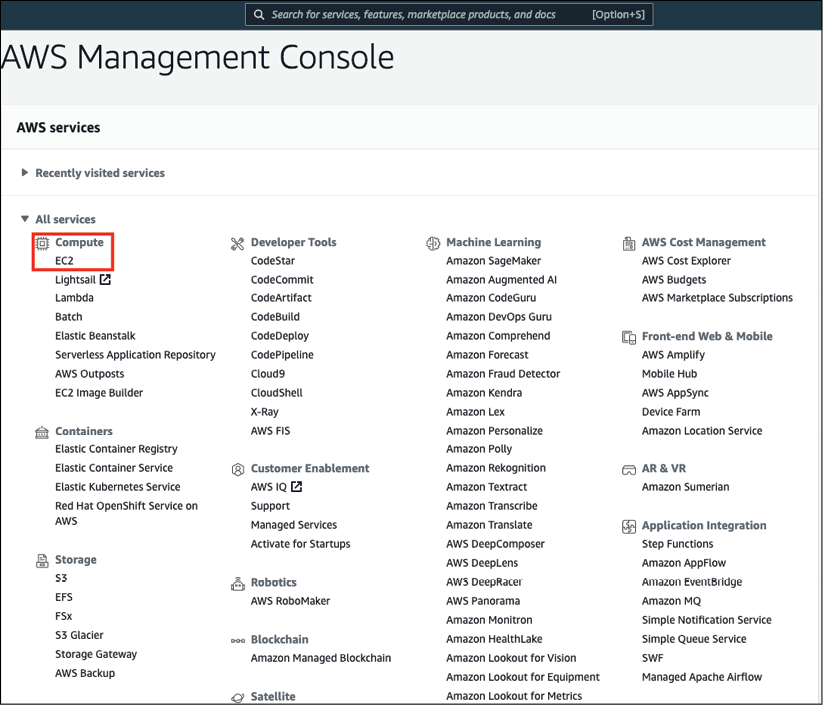

# 解决方案架构的意义

本书将是你进入解决方案架构世界的第一步，作为全面了解解决方案架构的全面指南，让你成为专业的解决方案架构师。在本章中，我们将探讨解决方案架构的含义，以及它如何成为组织中解决方案开发的基础。强大的解决方案架构设计有助于在复杂的组织中成功开发软件应用程序，涵盖从 IT 基础架构、应用程序安全性和可靠性到生产中的运营方面的所有方面。

对于成功的应用程序开发，定义解决方案架构应该是第一步，然后为实施奠定基础和稳健的构建块。解决方案架构处理关键的非功能性需求，例如可伸缩性、高可用性、可维护性、性能和安全性，同时牢记业务需求。

解决方案架构师是负责通过与涉众协作并跨涉众协作来设计解决方案架构的人员。解决方案架构师分析功能需求并定义非功能需求，以涵盖解决方案的所有方面，并避免任何意外。每个解决方案都有多个约束，例如成本、预算、时间线和法规约束，因此解决方案架构师在应用程序设计过程中选择技术以解决给定的业务问题时必须考虑这些约束。

解决方案架构师开发概念验证和原型以评估各种技术平台，然后选择最佳解决方案实施策略。

他们在整个解决方案开发过程中指导团队，并提供发布后指导以维护和扩展最终产品。

在本章中，你将了解以下主题：

- 什么是解决方案架构？
- 解决方案架构的演变
- 为什么解决方案架构很重要？
- 解决方案架构的好处
- 公共云中的解决方案架构

到本章结束时，你将了解解决方案架构对企业应用程序各个方面的好处。你将评估公共云中的解决方案架构，并开发一种云原生架构设计方法。

## 什么是解决方案架构？

向各种专业人士询问这个问题可能会导致解决方案架构定义的十个不同答案。事实上，在给定组织结构的背景下，它们可能都是正确的。每个组织可能会根据其业务需求、组织层次结构和解决方案的复杂性，从不同的角度看待解决方案架构。

简而言之，解决方案架构可以描述为从战略和事务的角度定义和预见业务解决方案的多个方面。 "战略"意味着解决方案架构师为软件应用程序定义一个长期愿景，以确保它保持相关性，无论未来如何变化，并可能进行扩展以满足不断增加的用户工作量和附加功能需求。 "事务性"意味着应用程序应该处理当前的客户工作量并毫无问题地应对日常业务挑战。

解决方案架构不仅仅是提供软件解决方案。它涵盖了系统的所有方面，包括但不限于系统基础设施、网络、安全、合规性要求、系统操作、成本和可靠性。如图 1.1 所示，解决方案架构师可能需要解决许多方面的问题。


图1.1：解决方案体系结构圈

一个好的解决方案架构师会解决组织中软件解决方案最常见的方面：

- **全球分布的团队**：在这个全球化的时代，几乎每个产品都有分布在全球各地的用户，以及负责照顾客户需求的利益相关者群体。通常，软件开发团队采用在岸-离岸模式，团队跨不同时区工作以提高生产力并优化项目成本。解决方案设计需要考虑全球分布的团队结构。这意味着解决方案的开发和运营不应该依赖于人，而是利用工具来扩展和协作，而不管团队成员的工作地点和时区如何。
- **全球合规要求**：当你在全球部署你的解决方案时，每个国家和地区都有其法律和合规法规，你的解决方案必须遵守这些法律法规。一些示例如下：
  - 美国联邦风险和授权管理计划 (FedRAMP) 和国防部云计算安全要求指南 (DoDSRG)
  - 欧洲通用数据保护条例 (GDPR)
  - 澳大利亚信息安全注册评估师计划 (IRAP)
  - 日本金融业信息系统中心 (FISC)
  - 新加坡的多层云安全 (MTCS) 标准
  - 英国的 G-Cloud
  - 德国的It-Grundschutz
  - 中国的多层次保护计划 (MLPS) Level 3
- 行业之间的合规要求不同：例如，**国际标准化组织 (ISO) 9001**（主要针对医疗保健、生命科学、医疗设备以及汽车和航空航天行业）、针对金融的支付卡行业数据安全标准 (PCI DSS) 以及健康医疗保健保险流通与责任法案 (HIPPA)。解决方案架构需要在设计阶段考虑任何合规性。你将在第 8 章"安全注意事项"中了解有关合规性的更多信息。
- **成本和预算**：解决方案架构可以很好地估算项目的总体成本，这有助于定义预算。这包括资本支出 (CapEx)（前期成本）和运营支出 (OpEx)（持续成本）。它有助于管理层为人力资源、基础设施资源和其他与许可相关的成本制定总体预算。
- **解决方案实施组件**：解决方案架构预先提供产品不同实施组件的高级概览，有助于计划执行。
- **业务需求**：解决方案架构考虑所有业务需求，包括功能性和非功能性。功能需求解决了最终用户将直接与之交互的应用程序特性。非功能性需求与面向客户的功能增强没有直接关系，但会影响整个应用程序的关键因素，包括性能、可伸缩性和可用性。它确保业务需求兼容，允许它们转换到技术实施阶段，并在利益相关者之间取得平衡。
- **IT 基础设施要求**：解决方案架构决定了执行项目需要什么样的 IT 基础设施；这包括计算、存储、网络和考虑因素，有助于更有效地规划 IT 资源。
- **技术选择**：在解决方案设计过程中，解决方案架构师创建原型，考虑企业需求，然后推荐合适的技术和工具进行实施。解决方案架构旨在构建内部而非第三方工具采购，同时定义整个组织的软件标准。
- **最终用户需求**：解决方案架构特别关注最终用户的需求，他们将成为产品的实际消费者。它有助于发现产品所有者可能无法捕获的隐藏需求。在实施和启动期间，解决方案架构师提供标准文档和标准语言结构，以确保满足所有要求以满足用户的需求。
- **解决方案维护**：解决方案架构不仅涉及解决方案设计和实施，还负责解决方案可扩展性、灾难恢复和卓越运营等发布后活动。
- **项目时间表**：解决方案架构设计每个组件的布局细节及其复杂性，这通过提供资源估算和相关风险进一步帮助定义项目里程碑和时间表。

一个行业标准和定义明确的解决方案架构解决了技术解决方案中的所有业务需求，并确保交付期望的结果以满足利益相关者，按照他们在质量、可用性、可维护性和可扩展性方面的期望解决方案。

解决方案架构的初始设计可以在售前周期的早期阶段构思，例如提案请求 (**RFP**) 或信息请求 (**RFI**)，然后创建原型或概念验证，以发现任何解决方案风险。解决方案架构师还确定是构建解决方案还是采购解决方案。它有助于确定适当的技术，同时牢记组织的关键安全性和合规性要求。

创建解决方案架构有两种主要情况：

1. 增强现有应用程序的技术，这可能包括硬件更新或软件重新架构。
2. 从头开始创建新的解决方案，你可以更灵活地选择最适合的技术来满足业务需求。

但是，在重构现有解决方案时，你需要考虑对当前环境的影响最小。如果重构现有解决方案不值得，解决方案架构师可能会决定完全重建，并且可以通过完全重建方法提供更好的解决方案。

简而言之，解决方案架构是关于查看系统的所有方面以生成技术愿景，它提供了实现业务需求的步骤。解决方案架构可以通过将与数据、基础设施、网络和软件应用程序相关的所有不同部分放在一起来定义一个项目或复杂环境中的一组项目的实现。一个好的解决方案架构不仅可以满足功能性和非功能性需求，还可以解决系统的长期可扩展性和维护问题。

我们现在已经简要介绍了解决方案架构的作用及其不同方面。在下一节中，我们将了解解决方案架构的演变。

## 解决方案架构的演变

解决方案架构随着技术的现代化而发展。如今，由于互联网使用的增加、高带宽网络的可用性、存储成本的降低和计算可用性的提高，与几十年前相比，解决方案架构设计发生了翻天覆地的变化。

早在互联网时代之前，大多数解决方案设计都专注于提供一个胖桌面客户端，该客户端能够在系统无法连接到互联网时以低带宽运行并离线工作。

这项技术已经发展了二十年。面向服务的架构 (**SOA**) 开始形成分布式设计，应用程序开始从单片架构转向现代 n 层架构，其中前端服务器、应用程序服务器和数据库位于它们自己的计算和存储层中。这些 SOA 主要通过基于 XML 的消息传递协议实现，称为简单对象访问协议 (**SOAP**)。其中一个主要组成部分是它能够遵循客户端-服务器模型来创建服务。

在这个数字化时代，你会看到基于 JavaScript 对象表示法 (**JSON**) 消息传递和表述性状态传输 (**REST**) 服务的基于微服务的解决方案设计变得越来越流行。这些是 Web API，不需要基于 XML 的 Web 服务协议 (SOAP) 来支持它们的接口。它们依赖于基于 Web 的 HTTP 协议，例如 ```POST```、```GET```、```UPDATE```、```DELETE``` 等。你将在第 6 章"解决方案架构设计模式"中详细了解不同的架构模式。

微服务架构满足了敏捷环境中不断变化的需求，任何解决方案的变化都需要快速适应和部署。组织必须敏捷才能在竞争中保持领先地位，这迫使解决方案架构与瀑布模型相比具有灵活性，瀑布模型在项目发布之前有很长的周期。

基于 Web 的微服务架构由几乎无限的资源能力推动，可从云提供商处获得，并且可以在几分钟或几秒钟内扩展。随着解决方案架构师和开发人员可以在不影响业务功能的情况下冒失败的风险，创新、试验和更改变得越来越容易。

## 为什么解决方案架构很重要？

解决方案架构是解决特定问题和需求的整体企业软件解决方案基础的组成部分。随着项目规模的增加，团队分布在全球范围内。需要有解决方案架构以实现长期可持续性和坚实的基础。

解决方案架构满足各种解决方案需求，保持业务环境完整。它指定并记录了技术平台、应用程序组件、数据要求、资源要求以及许多重要的非功能性要求，例如可伸缩性、可靠性、性能、吞吐量、可用性、安全性和可维护性。

解决方案架构对于任何行业使用软件应用程序解决业务问题都至关重要。在没有解决方案架构的情况下，软件开发有可能会失败：项目可能会延迟、超出预算并且无法以功能的形式交付足够的内容。通过创建解决方案架构并应用经验和知识（所有这些都由解决方案架构师提供），可以极大地改善这种情况。它有助于使所有领域的利益相关者，从非技术业务功能到技术开发，都在同一页面上，从而避免混淆，使项目按时、按时、按时进行，并有助于获得最大的投资回报（**投资回报率**）。

通常，解决方案架构师需要客户协作才能理解规范。在解决方案架构师的角色中，架构师需要调用多种技能，从技术领导者和专家到业务分析师和项目管理。我们将在第 2 章"组织中的解决方案架构师"中详细了解解决方案架构师的角色。

一个好的解决方案架构将规范与定义明确的解决方案放在一起，这有助于我们交付和完成最终产品，并在发布后实现顺畅的产品可操作性。

一个问题可以有多个解决方案，每个解决方案都有其约束条件。解决方案架构考虑了所有解决方案，并通过创建可适应所有业务和技术限制的实践概念证明来找到最佳解决方案。

让我们详细了解解决方案架构的各种好处。

## 解决方案架构的好处

既然我们已经详细说明了解决方案架构的重要性，我们现在将提供更多关于解决方案架构在组织的各个方面的好处的细节； 图 1.2 是在企业中采用解决方案架构师角色时赋予组织的潜在好处的细分。


图 1.2：解决方案架构的有益属性

上图突出显示了良好解决方案架构的以下属性：

- **技术价值和要求**：解决方案架构决定了投资回报率，通过特定的技术选择可以获得哪些解决方案，以及市场趋势。解决方案架构师评估组织或项目应该采用哪种技术，以实现长期的可持续性、可维护性和团队舒适度。
- **业务目标**：解决方案架构设计的主要职责是满足利益相关者的需求并使其适应他们的要求。解决方案架构通过分析市场趋势和实施最佳实践将业务目标转化为技术愿景。解决方案架构需要足够灵活，以满足新的、具有挑战性的、苛刻的和快速变化的业务需求。
- **目标日期**：解决方案架构师持续与所有利益相关者合作，包括业务团队、客户和开发团队。解决方案架构师定义流程标准并提供解决方案开发指南。他们确保整体解决方案与业务目标和发布时间表保持一致，以确保目标日期延迟的可能性最小。
- **提高投资回报率**：解决方案架构决定了投资回报率并有助于衡量项目的成功与否。解决方案架构迫使企业考虑如何通过应用自动化来降低成本和消除流程浪费，以提高整体投资回报率。
- **市场机会**：解决方案架构涉及分析和持续评估市场最新趋势的过程。它还有助于备份和推广新产品。
- **预算和资源**：为了获得更好的预算，始终建议在估算方面进行良好投资。定义明确的解决方案架构有助于我们了解完成项目所需的资源量。这有助于制定更好的预算预测和资源规划。
- **项目时间表**：定义准确的项目时间表对于解决方案的实施至关重要。解决方案架构师确定设计阶段所需的资源和工作量，这有助于确定进度表。

现在你已经对解决方案架构及其好处有了一个高层次的概述，让我们更仔细地研究解决方案架构的日常方面。

### 解决业务需求和交付质量

在产品开发的生命周期中，最具挑战性的阶段是确定需求的性质，尤其是当多个元素竞相被列为高优先级并且正在快速发展时。当不同的利益相关者对同一需求有不同的看法时，这就更具挑战性。例如，业务用户从用户的角度分析页面设计，而开发人员则从实现可行性和加载延迟的角度来看待它。这可能会导致功能和技术成员之间的需求冲突和误解。在这种情况下，解决方案架构有助于弥合差距并定义所有成员都能理解的标准。

功能需求是满足用户需求和解决给定业务问题的主要需求的产品特性。当用户与软件应用程序交互时，他们直接与功能需求交互。例如，在电子商务应用程序中，功能需求的示例是用户查看他们的订单历史记录、搜索商品、将它们添加到购物车以及使用他们喜欢的支付方式进行支付。虽然收集功能需求的主要责任在于产品所有者，但解决方案架构师确保他们的设计和实施能够根据用户需求进行扩展并适应任何未来的扩展。

解决方案架构定义了向非技术利益相关者解释技术方面并定期更新的标准文档。由于解决方案架构的设计跨越组织和不同的团队，它可以帮助发现隐藏的需求。解决方案架构师确保开发团队了解需求，并维护进度周期。

一个好的解决方案架构不仅定义了解决方案设计，还定义了定性和定量输出形式的成功标准，以确保交付质量。定性输出可以从用户反馈中收集，例如通过情绪分析，而定量输出可能包括技术方面的延迟、性能、加载时间和业务方面的销售数字。获取持续反馈并适应它是高质量交付的关键，应坚持解决方案设计和开发的所有阶段。

### 选择最好的技术平台

在快速竞争的市场中，最大的挑战是保持最佳技术的使用。今天，当你在世界各地拥有多种资源时，应该非常谨慎地选择一种特定的技术。解决方案是架构设计过程，可以有效解决这个问题。

技术栈的选择对团队高效实施解决方案起着重要作用。在解决方案架构中，我们应该采用不同的策略来采用不同的平台、技术和工具。解决方案架构师应仔细验证所有需求，然后使用多个参数评估和调查结果，以便通过以原型形式创建产品的工作模型来找到最适合产品开发的解决方案。

良好的解决方案架构通过调查所有可能的架构策略，基于混合用例、技术、工具和代码重用来解决不同工具和技术的深度，这些都是多年经验的一部分。最好的平台简化了实施过程；然而，正确的技术选择至关重要。这可以通过根据业务需求评估以及应用程序的敏捷性、速度和安全性构建原型来实现。

### 解决解决方案约束和问题

任何解决方案都可能受到各种约束的限制，并且可能会因进一步的复杂性或不可预见的风险而遇到问题。解决方案架构需要平衡多种约束，例如资源、技术、成本、质量、上市时间和频繁变化的需求。

每个项目都有自己的特定目标、要求、预算和时间表。解决方案架构评估所有可能的关键路径并共享最佳实践，以在给定的时间范围和预算内实现项目目标。这是一种系统的方法，其中所有任务都与先前的任务相互依赖；为了在项目中取得成功，所有任务都需要按顺序执行。一项任务的延迟会影响项目时间表，并可能导致组织错过推出产品的市场窗口。

如果项目开发过程中出现问题，则项目延迟的可能性很高。有时，你遇到的问题是所采用技术的局限性，甚至是解决方案环境的局限性。如果你有一个经过深思熟虑的解决方案架构，最常见的问题与非功能性需求相关：资源和预算可以缓解产品开发生命周期中遇到的问题。

解决方案架构师通过深入研究项目的每个组件来帮助推动项目。他们想到了一个开箱即用的想法来避免项目出现不可预见的问题，例如灾难恢复所涵盖的问题，并且会准备一个备份计划，以防万一主要计划无法解决问题。他们通过选择最佳实践和平衡约束来评估执行项目的最佳方式。

### 帮助资源和成本管理

解决方案实施过程中始终存在风险和不确定性；例如，如果开发人员需要花时间修复错误，它会变得非常乏味。一个好的解决方案架构通过在优先级、不同的通信服务和每个组件的细节方面为开发人员提供所需的指导来控制成本和预算并减少不确定性。

解决方案架构还创建将用于使系统保持最新的文档，以及部署图、软件补丁和软件发布版本，并强制执行运行手册以解决常见问题和业务持续流程。它还通过考虑可扩展性、可伸缩性和其他对开发环境重要的外部因素来解决构建解决方案成本的间接影响。

### 管理解决方案交付和项目生命周期

解决方案架构的初始阶段涉及大量规划。解决方案架构从战略视图开始，并在你推进解决方案实施过程中提供更多技术实施输入。

解决方案架构确保端到端的解决方案交付并影响整个项目生命周期。它为项目生命周期的不同阶段定义了一个流程标准，并确保它在整个组织中得到应用，以便在实施过程中可以解决其他依赖关系。

解决方案架构考虑项目的整体视图。它不断同步其他依赖组，例如安全性、合规性、基础设施、项目管理和支持，以便让他们根据需要参与项目生命周期的不同阶段。

### 解决非功能性需求

通常，解决方案架构师必须处理应用程序中的非功能需求 (NFR)。为了项目的成功，必须解决它们，因为它们对整个项目和解决方案具有更广泛的影响。这些 NFR 可以成就或破坏你的用户群，并解决解决方案的关键方面，例如安全性、可用性、延迟问题、维护、日志记录、屏蔽机密信息、性能问题、可靠性、可维护性、可扩展性和可用性。如果不按时考虑这些，可能会影响你的项目交付。图 1.3 显示了一些最常见的 NFR。


图 1.3：解决方案架构的非功能属性

如图所示，NFR 包括解决方案架构的以下属性。但是，根据项目的类型，可以有更多的 NFR：

- **容灾恢复**：确保解决方案在发生任何不可预见的事件时正常运行。
- **安全性和合规性**：为解决方案建立安全网，使其免受外部攻击，例如病毒、恶意软件等。还要通过满足合规性要求确保解决方案符合当地和行业法律。
- **高可用性**：确保解决方案始终正常运行。
- **可扩展性**：确保解决方案能够在需求增加的情况下处理额外的负载。
- **应用程序性能**：确保应用程序按用户期望加载，并且没有太多延迟。
- **网络请求和响应延迟**：在应用程序上执行的任何活动都应在适当的时间内完成，并且不应超时。

你将在第 3 章"解决方案体系结构的属性"中了解有关上述属性的更多详细信息。解决方案架构定义了产品开发的初始框架和解决方案的构建块。在建立解决方案架构时，质量和客户满意度始终是主要关注点。解决方案架构需要通过概念验证、探索和测试不断构建，直到达到所需的质量。

## 公共云中的解决方案架构

如今，云中的解决方案架构变得越来越重要，并且正在成为"新常态"，因为越来越多的企业选择将其工作负载迁移到云中。公共云一直是推动初创组织发展的关键因素，因为它们不需要大量的前期投资。它为组织提供了灵活性，使其可以作为实验运行，变得敏捷和创新。

云计算架构的伟大之处在于，你拥有所有架构组件的端到端视图，包括前端平台、应用程序开发平台、服务器、存储、数据库、自动化、交付以及云计算所需的网络。管理整个解决方案环境。

在进入云中的解决方案架构之前，让我们更多地了解公共云以及它如何成为企业必不可少的驱动技术平台。

### 什么是公有云？

公共云基于标准计算模型，在该模型中，服务提供商通过互联网向客户提供虚拟机、应用程序和存储等资源。公共云服务提供按需付费模式。

在云计算模型中，公共云供应商提供 IT 资源的按需可用性，例如服务器、数据库、网络和存储，组织可以通过基于 Web 的安全界面或通过 Internet 上的应用程序使用这些资源。在大多数情况下，客户只需为他们在使用期间使用的服务付费，这可以通过优化 IT 资源来减少空闲时间，从而为他们节省成本。

你可以将公共云想象成一种电力供应模型，你可以在其中打开电灯，只需为使用的电量付费（以单位为单位）。一旦你将其关闭，你就无需为此付费。它将你从使用涡轮机发电的复杂性、维护设施的资源、大型基础设施设置中抽象出来，并以简化的方式使用整个服务。

除了成本效益外，亚马逊网络服务 (**AWS**)、谷歌云平台 (**GCP**) 和 Microsoft **Azure** 等主要公共云提供商还通过云扩展其技术平台来帮助带来创新。这些公有云提供商通过全面的机器学习和分析掌握了可扩展性和面向未来的架构。借助公共云，你可以访问这些尖端技术，并可以选择考虑使用它们来改进你的架构。

### 公共云、私有云和混合云

在这里，你将获得不同类型的云计算部署模型的高级概述。你将在第 5 章"云迁移和混合云架构设计"中了解更多详细信息。

**私有云**或**内部部署**已注册到拥有和访问它的单个组织。私有云充当公司现有数据中心的复制或扩展。通常，**公共云**具有共享租赁，这意味着来自多个客户的虚拟服务器共享同一台物理服务器；但是，如果客户需要许可证或合规性需求，他们会为客户提供专用物理服务器。 AWS、Microsoft Azure 或 GCP 等公共云利用可通过即用即付模式通过互联网访问的大量 IT 基础设施。

第三种模型是**混合云**，供将工作负载从本地迁移到云的大型企业使用，他们仍然有无法直接迁移到云的遗留应用程序，或者他们可能有需要许可的应用程序留在本地——或者有时，由于合规性原因，他们需要在本地保护数据。在这种情况下，当企业必须在本地维护部分环境并将其他应用程序移动到公共云时，混合模型会有所帮助。有时，组织会转移到公共云来测试和开发环境，并将生产环境保留在本地。混合模型可能因组织的云策略而异。

由于市场上有多家公共云提供商，你可能会开始看到多云的趋势。企业选择在不同的公共云供应商之间分配他们的工作负载，以充分利用每种云技术，或者根据他们的技能组合为他们的团队提供选择。

### 公有云架构

公共云的典型定义是它是一个完全虚拟化的环境，可以通过互联网或私有网络访问。然而，最近，公共云供应商也开始提供本地物理基础设施，以更好地采用混合云。公有云提供多租户模式，多个客户共享存储和计算能力等 IT 基础设施；但是，它们在软件和逻辑网络级别是隔离的，不会干扰彼此的工作负载。在公共云中，通过创建网络级隔离，组织可以拥有自己的虚拟私有云，相当于逻辑数据中心。从组织的监管需求来看，公共云也提供专用的物理实例，然而，这些实例也可以通过网络访问，但这是一个不太常见的选择。

公共云存储通过使用多个数据中心和强大的数据复制创建冗余模型来实现高持久性和可用性。这使它们能够实现架构弹性和轻松的可扩展性。云计算模型主要分为三种，如图1.4所示。


在图 1.4 中，你可以看到本地环境中的客户责任与云计算服务模型之间的比较。在本地环境中，客户必须管理一切，而在云计算模型中，客户可以将责任推给供应商并专注于他们的业务需求。以下几点是在不同云计算模型下提供的服务的高级详细信息：

- **基础设施即服务 (IaaS)**：在这里，云供应商提供基础设施资源，例如计算服务器、网络组件和数据存储空间，作为托管服务。它可以帮助客户使用 IT 资源，而不必担心处理数据中心的开销，例如加热和冷却、货架和堆叠、物理安全等。
- **平台即服务 (PaaS)**：PaaS 模型添加了一个服务层，云供应商在其中负责你的开发平台所需的资源，例如操作系统、软件维护和补丁，以及基础设施资源。 PaaS 模型通过为你承担平台维护的所有负担，帮助你的团队专注于编写业务逻辑和处理数据。
- **软件即服务 (SaaS)**：SaaS 模型在 PaaS 和 IaaS 模型之上增加了一层抽象，其中云或软件供应商提供即用型软件，你为服务付费。例如，你使用电子邮件服务，例如 Gmail、Yahoo! Mail、AOL 等，你可以在其中获得自己的电子邮件空间即服务，而不必担心底层应用程序或基础架构。

第四个新兴模型是**功能即服务（FaaS）**模型，它通过使用包括 AWS Lambda 在内的服务在无服务器架构的构建中变得流行。你将在第 6 章"解决方案架构设计模式"中了解有关无服务器架构的更多详细信息。

由于公有云的功能和成本模型有很大的不同，让我们学习如何开发一种云原生的架构设计方法。

### 思考云原生架构

随着云的日益普及，云原生架构是一种即将到来的趋势，它可以针对云功能优化系统架构。典型的本地架构通常是为固定基础架构构建的，因为添加新的 IT 资源（例如服务器和计算能力）会增加大量时间、成本和工作量。然而，云是按使用量收费的，并且通过自动化提供了便利，例如在服务器上按需扩展和缩减，而不用担心采购周期长。云原生架构主要侧重于实现按需扩展、分布式设计和更换故障组件，而不是修复它们。

公有云不仅仅是基础设施，大多数公有云供应商提供范围广泛的托管服务，让用户可以忽略底层基础设施和运营维护。例如，AWS 提供了 Lambda，这是一个无服务器计算平台，可用于运行代码而无需管理服务器或运行时环境。同样，Amazon DynamoDB 数据库具有高度可扩展性；无需管理数据库服务器即可创建表和存储数据。托管服务使快速开发可扩展的应用程序变得容易。

在云原生架构中，你可以使用持续集成、部署和基础架构自动化的云功能，不断创建恢复、可扩展性、自我修复和高可用性的自动化操作。它鼓励使用每天发布和改进的新云功能，在成本和性能方面不断优化你的应用程序。

你将在下一章中了解有关云原生架构模式的更多详细信息。

### 公共云提供商和云服务产品

IT 行业有多家公共云提供商；其中，主要参与者是 AWS、GCP、Microsoft Azure 和阿里云。这些提供商提供一系列服务，从计算、存储、网络、数据库和应用程序开发，到分析和机器学习。

图 1.5 是 AWS 控制台的截图；你可以在多个区域看到提供的一系列服务。突出显示的 EC2 服务称为 Amazon Elastic Compute Cloud，可让你在几分钟内在 AWS 云中启动虚拟机。



图 1.5：AWS 控制台和服务产品

公共云供应商提供基础设施并促进各个领域的一系列服务，例如分析、机器学习、区块链、机器人技术、应用程序开发、电子邮件、安全、监控和警报。借助公共云，开发团队更容易获得不同的技术能力，这有助于推动创新并缩短产品发布的上市时间。

公共云提供商允许全球基础设施遍布全球，这有助于应用程序在你的用户群附近进行全球扩展。为鼓励采用，所有云服务都提供免费层级服务和大量学习资源，因此你可以亲身体验并加深对它们的了解。

## 概括

在本章中，你以简化的形式从行业标准中了解了解决方案架构的定义。你了解了解决方案架构的重要性，以及它如何帮助组织在最大化投资回报方面取得更重要的成果。本章帮助你了解拥有解决方案架构的好处，以及它如何帮助解决方案设计和实施的不同方面。

总之，解决方案架构是复杂组织中的构建块，用于解决所有利益相关者的需求并建立标准以填补业务需求和技术解决方案之间的差距。一个好的解决方案架构师不仅要解决功能需求，还要从长远考虑并照顾非功能需求，例如可伸缩性、性能、弹性、高可用性和灾难恢复。解决方案架构找到一个最佳解决方案来适应成本、资源、时间线、安全性和合规性的约束。

你还探索了云计算的基础知识、云环境中的解决方案架构以及重要的公共云提供商及其服务产品。这也有助于获得对不同云计算模型（例如 IaaS、PaaS 和 SaaS）以及公有云、私有云和混合云中的云计算部署模型的高级概述。最后，本章阐明了解决方案架构设计的演变。

在下一章中，你将了解有关解决方案架构师角色本身的所有信息——不同类型的解决方案架构师、该角色在解决方案架构方面的职责，以及这些角色如何适应组织结构和敏捷环境。