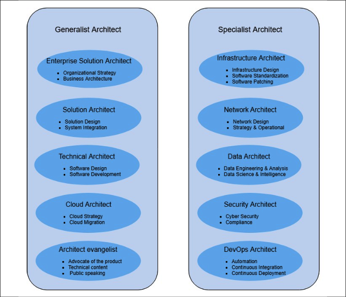
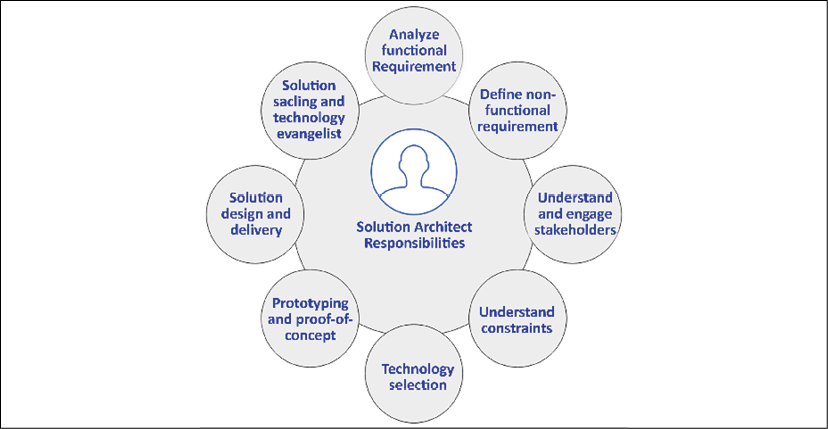
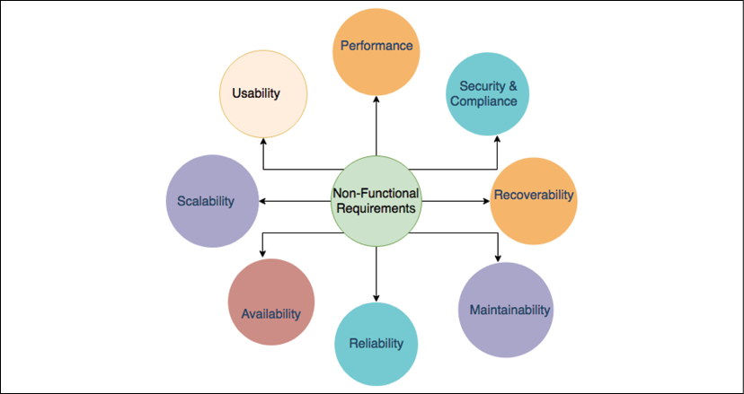
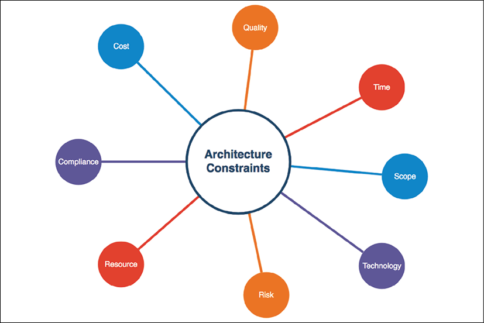
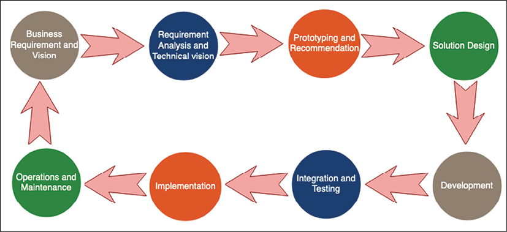

# 组织中的解决方案架构师

作为团队的一部分，解决方案架构师了解组织的需求和目标——所有利益相关者、流程、团队和组织的管理层都会影响解决方案架构师的角色及其工作。在本章中，你将学习和理解解决方案架构师的角色以及他们如何适应组织。之后，你将了解各种类型的解决方案架构师，以及他们如何在组织内共存。组织可能需要通才解决方案架构师，以及根据项目复杂性所需的其他专家解决方案架构师。

本章将详细介绍解决方案架构师的职责以及它如何影响组织的成功。解决方案架构师身兼多职，而业务主管在很大程度上依赖于他们的经验和决策来理解技术愿景。

解决方案和软件开发方法在过去几十年中不断发展，从瀑布式发展到敏捷式，并且是解决方案架构师所需要的。本章将详细介绍解决方案架构师为持续改进解决方案交付而应采用的敏捷方法和迭代方法。敏捷思维对于解决方案架构师来说极其重要。

除了解决方案设计之外，解决方案架构师还需要处理各种约束以评估风险和规划缓解策略。质量管理也起着重要作用，不容忽视。解决方案架构师在整个解决方案的生命周期中起着至关重要的作用：从需求收集、解决方案设计和解决方案实施，到测试，再到启动。

解决方案架构师需要在发布后定期参与，以确保解决方案的可扩展性、可用性和可维护性。对于更广泛的消费产品，解决方案架构师还需要通过内容发布和在各种论坛上公开演讲，作为产品的技术布道者与销售团队合作。

在本章中，你将了解以下主题：

- 解决方案架构师的角色类型
- 了解解决方案架构师的职责
- 敏捷组织中的解决方案架构师

## 解决方案架构师的角色类型

在上一章中，你了解了解决方案架构以及各种利益相关者如何影响解决方案策略——现在，你将了解解决方案架构师的角色。 软件解决方案可以在没有解决方案架构师的情况下开发，具体取决于项目的规模，但对于大型项目，需要有专门的解决方案架构师。 计划的成败取决于解决方案架构师。

总是需要可以为团队做出架构决策并推动团队与利益相关者协作的人。 有时，根据项目的大小，团队中需要有多个解决方案架构师。 图 2.1 描述了不同类型的解决方案架构师，显示了他们在组织中的不同职责。

图 2.1：解决方案架构师的类型

一个组织可以有多种类型的解决方案架构师。解决方案架构师可以分为通才或专家。通才解决方案架构师拥有来自多个技术领域的广度，而专家解决方案架构师在其专业领域(例如大数据、安全或网络)拥有非常深入的知识。通才解决方案架构师需要与专家解决方案架构师协作，以适应项目的要求和复杂性。

### 通才解决方案架构师角色

解决方案架构师的角色因组织而异，你可能会遇到与解决方案架构师相关的各种职位，最常见的是通才解决方案架构师角色。

有关解决方案架构师类型的详细信息，请参见以下部分。

#### 企业解决方案架构师
你是否考虑过如何在信息技术行业推出产品？这就是企业解决方案角色发挥作用的地方——他们定义最佳实践、文化和合适的技术。企业架构师与利益相关者、主题专家和管理层密切合作，以确定信息技术的组织战略，并确保他们的知识符合公司业务规则。

企业架构师处理整个组织的解决方案设计；他们与利益相关者和领导层一起制定长期计划和解决方案。最重要的方面之一是最终确定公司应使用哪些技术，并确保公司以一致性和完整性使用这些技术。

企业架构师的另一个重要方面是定义业务架构。在某些组织中，你可能会将业务架构师视为职位。业务架构填补了组织战略与其成功执行之间的差距。它有助于将地图策略转换为可执行的行动项目，并将其提升到战术层面进行实施。

总体而言，在为成功实施业务愿景定义组织范围的标准时，企业架构师更符合公司的愿景和责任。

#### 解决方案架构师
总的来说，本书以更通用的方式探讨了解决方案架构师的角色。不过，根据组织的结构，你经常会看到具有不同头衔的解决方案架构师；例如，企业解决方案、软件或技术架构师。在本节中，你会发现与各种标题相关的一些不同属性。但是，解决方案架构师的职责可能会重叠，具体取决于组织的结构。

如果你想知道应该如何组织和交付解决方案，那么解决方案架构师在这方面起着至关重要的作用。

解决方案架构师设计整个系统，以及不同系统如何跨不同组进行集成。解决方案架构师通过与业务利益相关者合作并提供技术团队对交付目标的清晰理解来定义预期结果。

解决方案架构师将整个组织的各个点连接起来，并确保不同团队内部的一致性，以避免在开发过程中可能出现的任何问题；他们参与整个项目生命周期，并定义监控和警报机制以确保产品发布后的平稳运行。解决方案架构师还通过提供有关资源、成本和时间表估算的建议，在项目管理中发挥重要作用。

总的来说，与企业架构师相比，解决方案架构师可以在更具战术性的层面上参与。有时，如果需要更多的战略参与，解决方案架构师会扮演企业架构师的角色。

#### 技术架构师
技术架构师也可以称为应用程序或软件架构师。技术架构师负责软件设计和开发。技术架构师在软件工程方面与组织合作，更专注于定义团队软件开发的技术细节。他们还在整个组织中工作，以了解集成将如何与软件模块的其他部分一起工作，这些部分可能由其他组管理。

技术架构师可以管理 API 设计的细节并定义 API 性能和扩展方面。他们确保软件的开发与组织的标准一致，并且可以轻松地与其他软件应用程序的组件集成。

技术架构师是与工程团队相关的任何技术问题的联系人，并且能够根据需要对系统进行故障排除。对于小型软件开发项目，你可能看不到技术架构师的角色，因为高级工程师可能会担任它并从事软件架构设计。

技术架构师通过与软件工程团队密切合作并解决跨团队集成或业务需求引起的任何障碍来指导和支持软件工程团队。

#### 云架构师
云架构师这一角色在过去十年才出现，但随着企业对云的采用不断增加，这一角色的需求量很大。

云架构师规划和设计云环境，负责部署和管理公司的云计算战略。云架构师提供云服务的广度和深度，并可以定义云原生设计。

正如你在第 1 章"解决方案架构的含义"中公有云部分的解决方案架构中所了解的那样，云的使用现在非常流行，并且已经成为组织迁移到公有云的常态。 Amazon Web Services、Microsoft Azure 和 Google Cloud Platform 等主要云提供商正在通过 SaaS、PaaS 和 IaaS 产品帮助客户以指数级速度采用云平台。你将在第 5 章"云迁移和混合云架构设计"中了解有关云架构的更多信息。

有大量企业希望将现有工作负载迁移到云中，以利用可扩展性、业务便利性和价格优势。云架构师可以准备云迁移策略并开发混合云架构。云架构师可以建议本地应用程序如何连接到云以及不同的传统产品如何适应云环境。

对于以云为起点的初创企业和企业，云架构师可以帮助设计云原生架构，该架构针对云进行了更优化，并使用了它提供的全部功能。云原生架构倾向于建立在即用即付模型上，以优化成本并利用云中可用的自动化。

云现在是企业战略的重要组成部分，如果公司想在现代时代取得成功并跟上创新和自动化的步伐，云架构师是必不可少的。

#### 架构师布道者
架构师布道者(也称为技术传播者)是一个相对较新的角色，它提供了一种新的营销范例，尤其是在复杂解决方案平台的日益普及方面。人们总是希望听到知识渊博且能够回答问题的专家的意见，以便他们做出明智的决定。在这里，架构师布道者凭借他们在竞争环境中特定主题的专业知识进入画面。

架构师可以根据客户需求设计架构，从而解决客户的痛点并赢得客户。传道者可以成为客户和合作伙伴值得信赖的顾问，对架构问题、概念和市场趋势有深刻的理解，以帮助确保平台采用并通过市场占领显示收入增长。

为了提高整体目标受众的平台采用率，架构师撰写公共内容，例如博客、白皮书和文章。他们在公共平台上发言，无论是行业峰会、技术讲座还是会议。他们举办技术研讨会并发布教程来宣传他们的特定产品。这使得解决方案架构师拥有出色的书面和口头沟通技巧非常重要；你经常会看到解决方案架构师将技术传播作为一项额外的责任。

### 专家解决方案架构师角色

可能还有其他类型的专业解决方案架构师，例如迁移架构师、存储架构师和机器学习架构师。这又取决于组织的结构。根据项目和组织的复杂性，解决方案架构师可以担任多个角色，或者不同的解决方案架构师可以承担重叠的职责。

#### 基础设施架构师
基础设施架构师是一个专业的架构师角色，主要关注企业 IT 基础设施设计、安全性和数据中心运营。他们与解决方案架构师密切合作，以确保组织的基础设施战略与其总体业务需求保持一致，并且他们通过分析系统需求和现有环境来分配适当的资源容量来满足这一需求。它们有助于减少可用于运营支出的资本支出，以提高组织效率和投资回报率。

基础设施架构师是组织的支柱，因为他们定义和规划从存储服务器到各个工作区的整体 IT 资源。基础设施架构师制定采购和设置 IT 基础设施的详细计划。他们定义整个组织的软件标准、补丁和计划系统更新。基础设施架构师负责基础设施安全并确保所有环境都受到保护，免受有害病毒的攻击。他们还计划进行灾难恢复和系统备份，以确保业务运营始终正常运行。

在大多数电子商务企业中，基础设施架构师的角色变得具有挑战性，因为他们需要为需求高峰期做计划，例如美国的感恩节、加拿大和英国的节礼日，或印度的排灯节，此时大多数消费者开始购物.他们需要准备足够的服务器和存储容量来应对旺季，其工作量可能比平时高出十倍，从而增加了 IT 基础架构的成本。除了旺季之外，系统将在一年中的大部分时间处于闲置状态。

他们需要规划成本优化和更好的用户体验，这是他们可能使用云来满足额外容量和按需扩展以降低成本的另一个原因。他们需要确保系统在支持新专业知识增长的同时得到占用。

总的来说，基础设施架构师需要很好地了解数据中心的运营和相关组件，例如加热、冷却、安全、机架和堆叠、服务器、存储、备份、软件安装和补丁、负载平衡器和虚拟化。

#### 网络架构师
你是否想过拥有多个办公室或商店的巨型企业是如何连接起来的？在这里，网络架构师出现在画面中，因为他们协调组织的网络通信策略并在 IT 资源之间建立通信，为 IT 基础架构赋予生命。

网络架构师负责设计计算机网络、局域网 (**LAN**)、广域网 (**WAN**)、互联网、内联网和其他通信系统。他们管理组织信息和网络系统，并确保为用户提供低网络延迟和高网络性能，以提高他们的工作效率。他们使用虚拟专用网络 (**VPN**) 连接在用户工作区和内部网络之间建立安全连接。

网络架构师与基础设施架构师密切合作；有时你将此视为一个重叠的角色，以确保所有 IT 基础设施都已连接。他们与安全团队合作，设计组织的防火墙以防止不道德的攻击。他们负责通过数据包监控、端口扫描以及部署入侵检测系统 (**IDS**) 和入侵防御系统 (**IPS**) 来监控和保护网络。你将在第 8 章安全注意事项中了解有关 IDS/IPS 系统的更多信息。

总的来说，网络架构师需要很好地理解网络策略、网络操作、使用 VPN 的安全连接、防火墙配置、网络拓扑、负载平衡配置、DNS 路由和 IT 基础设施连接。

#### 数据架构师
任何解决方案设计都围绕数据展开，无论是针对客户还是针对产品，它主要是关于存储、更新和访问数据。在过去的十年中，数据呈指数级增长——不久前，千兆字节的数据被认为是大数据，但现在，即使是 100 TB 的数据也被认为是正常的——你甚至可以获得 1 TB 的计算机硬盘。

传统上，数据以结构化关系方式存储。现在，大多数数据都是从社交媒体、物联网 (**IoT**) 和应用程序日志等资源生成的非结构化格式。需要存储、处理和分析数据以获得有用的见解，这就是数据架构师角色发挥作用的地方。

数据架构师定义一组规则、策略、标准和模型，用于管理在组织数据库中使用和收集的数据类型；他们设计、创建和管理组织中的数据架构。数据架构师开发数据模型和数据湖设计以捕获业务的关键绩效指标 (**KPI**)，并实现数据转换。它们确保整个组织的数据性能和数据质量一致。

数据架构师的主要客户如下：

- 企业高管使用商业智能 (**BI**) 工具进行数据可视化
- 业务分析师使用数据仓库获得更深入的数据洞察力
- 数据工程师使用提取、转换和加载 (**ETL**) 作业执行数据整理
- 机器学习的数据科学家
- 应用程序数据管理开发团队

为了满足组织需求，数据架构师负责以下工作：

- 数据库技术的选择
- 结构化和非结构化数据存储选择
- 流式和批量数据处理
- 作为集中式数据存储的数据湖
- 用于应用程序开发的关系数据库模式
- 用于数据分析和 BI 工具的数据仓库
- 数据集市设计
- 数据安全和加密
- 数据合规

你将在第 13 章"解决方案架构的数据工程"中了解有关数据架构的更多信息。总的来说，数据架构师需要了解不同的数据库技术、BI 工具、数据安全和加密，以便做出正确的选择。随着机器学习在企业中变得越来越重要，专门的机器学习架构师角色的出现是意料之中的。

#### 机器学习架构师
众所周知，人工智能 (**AI**) 和机器学习 (**ML**) 已经成为热门话题已有一段时间了，而且越来越多的公司正在转向在其企业解决方案堆栈中实施 ML。公共云加速了组织对 ML 的采用，具有易于访问的基础设施和工具。机器学习以多种方式帮助解决客户问题，包括开发个性化、提供预测和检测欺诈。除此之外，ML 还可以解决 IT 领导者、软件架构师和解决方案架构师面临的许多日常挑战，例如安全自动化、基础架构、灾难恢复和解决方案监控。这促成了 ML 架构师角色的兴起，这些角色在非常高的级别上承担以下职责：

- 应用系统思维在企业软件堆栈中实施/采用 ML
- 识别和分析用于 ML 和 AI 实施的工具
- 为 ML 构建信息/数据架构
- 修改当前的软件堆栈和工具以为 ML 集成让路
- 通过持续监控和改进来实施 ML

ML 架构师通过应用架构最佳实践创建 AI/ML 解决方案架构，同时考虑 AI/ML 解决方案设计的性能优化、安全性、合规性、可靠性、成本优化和卓越运营。并不是每个问题都可以用 AI/ML 解决，ML 架构师应该了解 ML 解决方案如何适应敏捷的企业环境。他们必须通过提供对设计支柱、高级设计模式、反模式以及现代 AI/ML 技术堆栈设计的云原生方面的详细理解，来整合 AI/ML 架构设计。你将在第 14 章"机器学习架构"中了解有关 ML 的更多信息。

#### 安全架构师
安全应该是任何组织的首要任务；有很多大型和成熟的组织因安全漏洞而倒闭的例子。组织不仅会失去客户的信任，还会因安全事件而遇到法律纠纷。有各种行业合规性认证，例如组织安全 (**SOC2**)、财务数据 (**PCI**) 和医疗保健数据 (**HIPPA**)，这些认证旨在确保公司需要遵守的组织和客户数据安全，具体取决于他们的应用的性质。

鉴于安全的关键性质，组织需要为其项目研究和设计最强大的安全架构，而这正是安全架构师所必需的。安全架构师与组织内的所有团队和外部供应商密切合作，以确保安全是重中之重。安全架构师的职责包括：

- 在组织中设计和部署网络和计算机安全的实施
- 了解公司的技术和信息系统，维护组织内计算机的安全
- 使用各种设置，例如保护公司网络和网站
- 规划漏洞测试、风险分析和安全审计
- 审查并批准安装防火墙、VPN和路由器，并扫描服务器
- 测试最终的安全流程并确保它们按预期工作
- 为安全团队提供技术指导
- 确保应用程序符合要求的行业标准
- 通过所需的可访问性和加密确保数据安全

安全架构师需要使用各种工具和技术来理解、设计和指导与数据、网络、基础设施和应用程序相关的安全的所有方面。你将在第 8 章安全注意事项中了解有关安全性和合规性的更多信息。

#### DevOps 架构师
随着系统变得越来越复杂，人为错误的可能性越来越大，这可能导致需要额外的工作、增加成本，甚至降低质量。自动化是避免故障和提高整体系统效率的最佳方式。自动化不是可有可无的——如果你想敏捷并更快地行动，自动化是必须的。

自动化可以应用于任何地方，无论是测试和部署应用程序、启动基础设施，还是确保安全性。自动化起着至关重要的作用，而 DevOps 架构师的角色是尽可能使一切自动化。 DevOps 是有助于以更快的速度交付应用程序的实践和工具的组合。

它使组织能够更好地服务于客户并在竞争中保持领先地位。

在 DevOps 中，开发团队和运营团队并行工作。对于软件应用程序，DevOps 架构师定义了持续集成和持续部署 (**CI/CD**)。在 CI 中，自动构建和测试运行发生在开发团队将其代码更改合并到中央存储库之前。 CD 通过在构建和测试阶段之后将所有代码更改部署到生产环境来扩展 CI。

DevOps 架构师自动化基础架构部署，称为基础架构即代码，这在云环境中非常普遍。 DevOps 可以利用 **Chef** 和 **Puppet** 等工具实现指令自动化，或者如果工作负载在云环境中，则使用云原生工具。他们可能会选择使用 **Ansible** 和 **Terraform** 等脚本来自动化基础设施。基础架构自动化在实验的帮助下为开发团队提供了出色的灵活性，并使运营团队能够创建副本环境。

为了顺利运行，DevOps 架构师计划在出现问题或任何重大更改时通过自动通信进行监控和警报。可以自动监控任何安全事件、部署故障或基础设施故障，并在需要时将警报发送到团队的相应移动设备或电子邮件帐户。

DevOps 架构师还计划通过不同的部署方法进行灾难恢复。组织恢复点目标 (**RPO**) 是组织可以容忍的数据丢失量。恢复时间目标 (**RTO**) 表明应用程序需要多长时间才能恢复并重新开始运行。你将在第 12 章 DevOps 和解决方案架构框架中了解有关 DevOps 的更多信息。

## 了解解决方案架构师的职责

现在我们已经分解了解决方案架构师的各种角色，接下来我们将详细了解解决方案架构师的职责。解决方案架构师是面向客户角色的技术领导者，承担着许多责任。解决方案架构师的主要职责是将组织的业务愿景转化为技术解决方案，并充当业务和技术利益相关者之间的联络人。解决方案架构师使用广泛的技术专业知识和业务经验来确保解决方案的交付成功。

根据组织的性质，解决方案架构师的职责可能略有不同。通常，在咨询组织中，解决方案架构师可能专注于特定项目和客户，而在基于产品的组织中，解决方案架构师可能会与多个客户合作，对他们进行产品教育并审查他们的解决方案设计。

解决方案架构师在应用程序开发周期的不同阶段承担各种责任，甚至在项目启动之前。在项目孵化阶段，解决方案架构师与业务涉众一起准备和评估响应请求 (**RFR**) 文档。项目启动后，解决方案架构师分析需求以决定技术实施的可行性，同时定义非功能性需求，例如可扩展性、高可用性、性能和安全性。解决方案架构师了解各种项目限制，并通过开发概念证明来进行技术选择。一旦开发开始，解决方案架构师就会指导开发团队并调整技术和业务需求。应用程序启动后，解决方案架构师确保应用程序按照定义的非功能性要求执行，并根据用户反馈确定下一次迭代。在本节中，你将详细了解产品开发生命周期各个阶段的解决方案架构师角色。总的来说，解决方案架构师承担以下主要职责，详见图 2.2。

图 2.2：解决方案架构师的职责模型

如图所示，解决方案架构师有多种重要职责。在接下来的部分中，你将了解解决方案架构师职责的各个方面。

### 分析用户需求

业务需求是任何解决方案设计的核心，并且在项目开始时以原始术语定义。有必要从一开始就让不同的群体参与进来，其中包括识别需求的技术能力。

业务利益相关者定义需求，并且在涉及项目的技术发展时需要进行多次调整。为了省力，有必要在定义用户需求文档时让解决方案架构师参与进来。

解决方案架构师设计应用程序，这可能会影响整体业务成果。这使得需求分析成为解决方案架构师应具备的关键技能。优秀的解决方案架构师需要具备业务分析师的技能以及与各种利益相关者合作的能力。

解决方案架构师带来了广泛的业务经验——他们不仅是技术专家，而且对业务领域也有很好的了解。他们与产品经理和其他业务利益相关者密切合作，以了解需求的所有方面。一个好的解决方案架构师可以帮助产品团队发现隐藏的需求，这些需求是非技术利益相关者可能没有从整体解决方案的角度考虑过的。

### 定义非功能性需求

非功能性需求 (**NFR**) 可能对用户和客户不直接可见，但它们的缺失可能会对整体用户体验产生负面影响，并阻碍业务发展。 NFR 包括系统的关键方面，例如性能、延迟、可伸缩性、高可用性和灾难恢复。最常见的 NFR 如图 2.3 所示。

图 2.3：解决方案设计中的 NFR

考虑以下 NFR：

- **表现**：
  - 用户的应用程序加载时间是多少？
  - 我们如何处理网络延迟？
- **安全性和合规性**：
  - 我们如何保护应用程序免受未经授权的访问，
  - 保护应用程序免受恶意攻击，
  - 并遵守当地法律和审计要求？
- **可恢复性**：
  - 我们如何从中断中恢复应用程序，
  - 并在发生中断时最大限度地缩短恢复时间？
  - 我们如何恢复丢失的数据？
- **可维护性**：
  - 我们如何确保应用程序监控和警报？
  - 我们如何确保应用支持？
- **可靠性**：
  - 我们如何确保应用程序始终如一地执行，
  - 检查并纠正故障？
- **可用性**：
  - 我们如何确保应用程序的高可用性，
  - 并使应用程序具有容错能力？
- **可扩展性**：
  - 如何满足日益增长的资源需求？
  - 我们如何才能在利用率突然飙升的情况下实现良好的规模？
- **易用性**：
  - 我们怎样才能简化应用程序的使用，
  - 实现无缝的用户体验，
  - 并让不同的用户可以访问该应用程序？

然而，根据项目的性质，可能有某些 NFR 仅适用于该特定项目(例如，呼叫中心解决方案的语音清晰度)。

你将在第 3 章"解决方案体系结构的属性"中了解有关这些属性的更多信息。

解决方案架构师从很早的阶段就开始参与项目，这意味着他们需要通过衡量组织内利益相关者的需求来设计解决方案。解决方案架构师需要确保跨系统组件和需求的解决方案设计的一致性。解决方案架构师负责跨组和不同组件定义 NFR，因为他们确保全面实现解决方案的预期可用性。

NFR 是解决方案设计不可或缺的重要方面，当团队过于关注业务需求时，它往往会失误，这会影响用户体验。优秀的解决方案架构师的主要职责是传达 NFR 的重要性，并确保将它们作为解决方案交付的一部分加以实施。

### 与利益相关者接触和合作

利益相关者是直接或间接对项目感兴趣的任何人。除了客户和用户，它还可能是开发团队、销售、市场营销、基础设施、网络、支持团队或项目资金组。利益相关者也可以是项目内部或外部的。内部利益相关者包括项目团队、发起人、员工和高级管理层；外部利益相关者包括客户、供应商、供应商、合作伙伴、股东、审计员和一个国家的代理政府。

利益相关者通常会根据他们所处的环境对同一业务问题有不同的理解；例如，开发人员可能会从编码的角度来看待业务需求，而审计员可能会从合规性和安全性的角度来看待它。解决方案架构师需要与所有技术和非技术利益相关者合作。

解决方案架构师拥有出色的沟通技巧和谈判技巧，这有助于他们确定解决方案的最佳路径，同时让每个人都参与其中。解决方案架构师充当技术和非技术资源之间的联络人，并填补沟通空白。通常，业务人员和技术团队之间的沟通障碍会成为失败的原因。业务人员试图更多地从特性和功能的角度来看待事物，而开发团队则努力构建一个技术上更兼容的解决方案，这有时可能会倾向于项目的非功能方面。

解决方案架构师需要确保两个团队都在同一页面上，并且建议的功能在技术上也是兼容的。他们根据需要指导和指导技术团队，并将他们的观点用每个人都能理解的简单语言表达出来。

### 处理各种架构约束

架构约束是解决方案设计中最具挑战性的属性之一。解决方案架构师需要仔细管理架构约束，并能够在它们之间进行协商以找到最佳解决方案。通常，这些限制相互依赖，强调一个限制可能会夸大其他限制。最常见的约束如图 2.4 所示。

图 2.4：解决方案设计中的架构约束

如图所示，解决方案设计可帮助我们了解应用程序的以下属性：

- **成本**：
  - 有多少资金可用于实施解决方案？
  - 预期的投资回报率是多少？
- **质量**：
  - 结果与功能和非功能需求的匹配程度如何？
  - 我们如何确保和跟踪解决方案的质量？
- **时间**：
  - 应该什么时候交付输出？
  - 交货时间是否有弹性？
- **范围**：
  - 业务和客户需求的确切期望是什么？
  - 需要如何处理和适应需求差距？
- **技术**：
  - 可以利用什么技术？
  - 使用传统技术与新技术相比有何灵活性？
  - 我们应该在内部构建还是从供应商处采购？
- **风险**：
  - 什么会出错，我们如何减轻它？
  - 利益相关者的风险承受能力如何？
- **资源**：
  - 完成解决方案交付需要什么？
  - 谁将负责解决方案的实施？
- **合规**：
  - 可能影响解决方案的当地法律要求是什么？
  - 审核和认证要求是什么？

可能会有与项目相关的更具体的限制，例如由于政府监管而在一个国家/地区存储数据的方式，以及出于安全考虑而选择内部开发。处理约束可能非常棘手。

解决方案架构师需要平衡约束并分析每个约束的权衡；例如，通过减少资源来节省成本可能会影响交付时间表。

在资源有限的情况下完成计划可能会影响质量，这反过来又会由于不需要的错误修复而增加成本。因此，在成本、质量、时间和范围之间找到平衡非常重要。范围蔓延是解决方案架构师可能面临的最具挑战性的情况之一，因为它会对所有其他约束产生负面影响并增加解决方案交付的风险。

解决方案架构师必须了解每个约束的所有方面并能够识别任何由此产生的风险。他们必须制定风险缓解计划并在它们之间找到平衡。处理任何范围蔓延都有助于按时交付项目。

### 进行技术选择

技术选择是解决方案架构师角色的关键方面，并且可能涉及最多的复杂性。可用的技术范围很广，需要解决方案架构师来确定解决方案的正确技术。解决方案架构师需要具备广度和深度的技术知识才能做出最佳决策，因为所选的技术堆栈会影响产品的整体交付。

每个问题都可以有多种解决方案和一系列可用的技术。为了做出正确的选择，解决方案架构师需要牢记功能需求和 NFR，并在做出技术决策时定义选择标准。所选择的技术需要考虑不同的角度，目标是能够与其他框架和 API 集成，还是满足性能要求和安全需求。

解决方案架构师应该能够选择既能满足当前需求又能满足未来需求的技术。

### 开发概念验证和原型

创建原型可能是解决方案架构师最有趣的部分。要选择经过验证的技术，解决方案架构师需要在各种技术堆栈中开发概念验证 (POC)，以分析它们是否适合解决方案的功能和非功能需求。解决方案设计 POC 是指解决方案架构师试图找出解决方案的构建块。

开发 POC 的想法是评估具有关键功能实现子集的技术，这可以帮助我们根据其能力来决定技术堆栈。它的生命周期很短，仅限于由团队或组织内的专家进行审查。

在使用 POC 评估多个平台后，解决方案架构师可以继续对技术堆栈进行原型设计。为演示目的开发了一个原型并提供给客户，以便它可以用来获得资金。 POC 和原型制作远未做好生产准备；解决方案架构师构建的功能有限，这可能被证明是解决方案开发的一个具有挑战性的方面。

### 设计解决方案并坚持交付

解决方案架构师在了解功能需求、NFR、解决方案约束和技术选择的不同方面后，着手解决方案设计。在敏捷环境中，这是一种迭代方法，其中需求可能会随着时间的推移而变化，并且需要适应解决方案设计。

解决方案架构师需要设计一个面向未来的解决方案，该解决方案应该具有强大的构建块并且足够灵活以适应由于用户需求或技术增强而可能发生的变化。例如，如果用户需求增加十倍，那么应用程序应该能够扩展并适应用户需求，而无需对体系结构进行重大更改。同样，如果引入机器学习或区块链等新技术来解决问题，你的架构应该能够适应它们；例如，使用 AI 在电子商务应用程序的现有数据之上构建推荐系统。

但是，解决方案架构师需要注意需求的剧烈变化并应用风险缓解计划。对于面向未来的设计，你可以以基于 RESTful API 的松耦合微服务架构为例。这些架构可以扩展到新的需求，并具有轻松集成的能力。你将在第 6 章"解决方案架构设计模式"中了解有关不同架构设计的更多信息。

图 4.5 包含显示解决方案交付生命周期的流程图。解决方案架构师参与解决方案设计和交付的所有阶段。

图 2.5：解决方案交付生命周期

如图所示，解决方案交付生命周期包括以下内容，以及解决方案架构师参与的方式：

- **业务需求和愿景**：解决方案架构师与业务利益相关者合作以了解他们的愿景。
- **需求分析和技术愿景**：分析需求，定义技术愿景以执行业务战略。
- **原型设计和推荐**：通过开发 POC 和展示原型来进行技术选择。
- **解决方案设计**：解决方案架构师根据组织的标准并与其他受影响的群体协作开发解决方案设计。
- **开发**：与开发团队合作开发解决方案，并作为业务和技术团队之间的桥梁。
- **集成和测试**：确保最终解决方案按预期工作，满足所有功能和非功能需求。
- **实施**：与开发和部署团队合作以顺利实施并指导他们解决任何问题。
- **操作和维护**：确保日志记录和监控到位，并根据需要指导团队进行扩展和灾难恢复。

整个生命周期是一个迭代的过程。一旦应用程序投入生产并且客户开始使用它，可能会从客户反馈中发现更多需求，这将推动未来增强的产品愿景。

解决方案架构师在解决方案设计期间拥有主要所有权，他们执行以下操作：

- 文档解决方案标准
- 定义高层设计
- 定义跨系统集成
- 定义不同的解决方案阶段
- 定义实施方案
- 定义监控和警报方法
- 记录设计选择的优缺点
- 记录审计和合规要求

解决方案架构师不仅负责解决方案设计：他们还帮助项目经理进行资源和成本估算、定义项目的时间表和里程碑、项目的发布及其支持计划。解决方案架构师在解决方案生命周期的不同阶段工作，从设计到交付和启动。解决方案架构师通过提供专业知识和广泛的理解帮助开发团队克服障碍。

### 确保启动后的可操作性和维护

在解决方案启动后，解决方案架构师在产品可操作性方面发挥着不可或缺的作用。为了处理不断增加的用户群和产品利用率，解决方案架构师应该知道如何扩展产品以满足需求并确保高可用性而不影响用户体验。

在中断等不可预见的事件中，解决方案架构会指导基础架构、IT 支持和软件部署团队执行灾难恢复计划以确保业务流程的持续进行。解决方案架构师满足组织的恢复点目标 (**RPO**) 和恢复时间目标 (**RTO**)。 RPO 根据中断间隔期间丢失的数据量定义组织可以容忍的数据丢失量——例如，丢失 15 分钟的数据。 RTO 定义了系统恢复正常运行所需的时间。你将在第 12 章 DevOps 和解决方案架构框架中了解有关 RTO 和 RPO 的更多信息。

如果由于需求增加而出现性能问题，解决方案架构师可帮助横向扩展系统以缓解应用程序瓶颈，或纵向扩展以缓解数据库瓶颈。你将在第 9 章"架构可靠性注意事项"中了解有关不同扩展机制和自我修复的更多信息。

解决方案架构师计划适应现有产品中因使用模式或任何其他原因而产生的任何新需求。他们可以根据监视用户行为来更改 NFR；例如，如果加载时间超过 3 秒，用户可能会离开页面。解决方案架构师负责解决这个问题，并指导团队处理发布后可能出现的问题。

### 作为技术布道者工作

成为布道者是解决方案架构师角色中最令人兴奋的部分。解决方案架构师通过公共论坛传播信息来提高产品和平台的采用率。他们撰写有关解决方案实施的博客，并举办研讨会来展示技术平台的潜在好处和使用。

他们为技术建立大众支持并帮助建立标准。解决方案架构师应该对技术充满热情。他们应该是一位出色的公众演讲者，并具备出色的写作技巧来扮演技术步道者的角色。

## 敏捷组织中的解决方案架构师

在过去的五年中，你可能已经看到了敏捷方法的快速采用。在这个竞争激烈的市场中，组织需要积极应对快速变化，并迅速为客户带来成果。快速创新和发布只有在组织快速适应并更快地响应变化以适应用户需求的情况下才有可能，这意味着组织和解决方案架构的每个部分都必须具有灵活性。

要在敏捷环境中取得成功，解决方案架构师需要敏捷的思维方式，并且必须通过与利益相关者持续合作来满足他们的需求，从而采用快速交付方法。首先，让我们更多地了解一下敏捷方法。这是一个广泛的主题，在本节中，我们将看到一个高级概述。

### 为什么采用敏捷方法？

敏捷可以创造和响应变化，从而在快速变化的商业环境中获利。在当今竞争激烈的环境中，技术发展迅速(这导致变化和客户需求的可能性很高)，敏捷是应对这种情况并获得竞争优势的答案。

如今，所有成功的组织都是以客户为导向的：他们经常从最终用户那里获取对其产品的反馈，并利用这些反馈来扩大他们的用户群。敏捷有助于收集用户的反馈，以不断使其适应新的软件版本，而且大多数时候一切都有高优先级。为了应对这种情况，你需要敏捷。

执行管理层提供资金并寻求透明度。他们需要高效的输出来提高投资回报率，而解决方案架构师希望通过展示产品的增量开发来赢得他们的信任。要为项目创建透明度并跟踪其预算和交付时间表，你需要敏捷。当你希望通过向利益相关者展示产品演示来不断吸引他们，并且当开发和测试是同一周期的一部分时，你需要敏捷。

上述场景是需要敏捷方法以通过稳健的交付和客户反馈使组织保持领先的情况。

敏捷能够以时间盒的方式快速移动，这意味着你可以在短周期内对活动进行时间限制，并采用迭代的方法进行产品开发，而不是对整个产品进行一次开发和交付。敏捷方法提倡通过让客户和利益相关者密切参与来寻求持续的反馈，让他们参与产品开发的每个阶段，根据需求调整反馈，评估市场趋势，并与他们合作确定利益相关者的优先级。然后，开发团队处理优先需求，进行技术分析、设计、开发、测试和交付。

大家作为一个统一的团队朝着一个目标努力，打破筒仓思维，敏捷思维帮助技术团队从客户的角度理解需求，快速高效地响应变化。这就是为什么大多数公司想要敏捷的原因。使用市场上可用的许多工具(例如 JIRA、VersionOne 和 Rally)可以快速轻松地采用敏捷方法。在发展敏捷思维时，你可能会面临一些最初的挑战，但好处远远超过组织在转向采用敏捷方法时可能面临的任何挑战。

### 敏捷宣言

应用任何形式的敏捷都需要清楚地理解敏捷宣言中规定的四个价值观。让我们了解这些值：

- **流程和工具之上的个人和交互**：流程和工具总是有助于完成项目。作为项目一部分的项目利益相关者知道如何实施计划以及如何借助项目交付工具交付成功的结果。但项目交付的主要责任是人员及其协作。
- **工作软件优于综合文档**：文档始终是任何产品开发的基本过程。过去，很多团队只是收集和创建文档库，例如高层设计、低层设计和设计变更，这些文档有助于后期实现对产品的定性和定量描述。
  - 使用敏捷方法，你可以专注于可交付成果。因此，根据这份宣言，你需要文档。但是，你还需要定义多少文档对产品的持续交付至关重要。首先，团队应该专注于在整个产品生命周期中以增量方式交付软件。
- **客户协作优于合同谈判**：早些时候，当组织从事固定投标或时间和材料项目时，客户总是参与软件生命周期的第一个和最后一个阶段——他们是不参与产品开发的局外人。当他们终于有机会在发布后看到产品时，市场趋势已经改变，他们失去了市场。
  - Agile 认为客户对产品的发布负有同等责任，他们应该参与开发的每一步。他们是演示的一部分，根据新的市场趋势或消费者需求提供反馈。由于业务现在是开发周期的一部分，因此可以通过敏捷和持续的客户协作来实现这些变化。
- **按照计划应对变化**：在当前快节奏的市场中，客户需求随着新的市场趋势而变化，企业也在不断变化。由于冲刺周期从一到三周不等，因此确保在频繁更改需求和欢迎敏捷更改之间取得平衡至关重要。响应变化意味着如果规范有任何变化，开发团队将接受变化并在冲刺演示中展示可交付成果，以不断赢得客户的信任。这个宣言帮助团队理解欢迎变化的价值。

敏捷宣言是一种工具，用于建立采用敏捷方法的基本指南。这些价值观是所有敏捷技术的核心。让我们更详细地了解敏捷过程。

### 敏捷过程和术语

让我们熟悉最常见的敏捷术语以及它们如何结合在一起。在这里，你将了解被广泛采用的敏捷 Scrum 流程。敏捷的scrum流程有一个小的一到三周的sprint周期，这取决于项目的稳定性，但最常见的是两周的sprint周期，也可以称为开发周期。

这些冲刺是团队将分析、开发、测试和交付工作功能的开发周期。团队采用迭代方法，并随着项目在每个冲刺中的进展创建产品的工作构建块。每个需求都被写成一个用户故事，牢记客户角色，并使需求清晰可见。

敏捷 scrum 团队有不同的角色。让我们了解最常见的那些，以及解决方案架构师如何与它们协作：

- **Scrum 团队**：由产品负责人、Scrum Master 和开发团队组成。分析师、技术架构师、软件工程师、软件测试人员和部署工程师是开发团队的一部分。
- **Scrum Master**：担任此角色的人会促进所有 Scrum 仪式(你将在下一节中了解)，保持团队积极性，并为团队消除障碍。 Scrum Master 与解决方案架构师一起消除任何技术障碍并获得业务需求的技术说明。
- **产品负责人**：这是一位商人，他是客户的拥护者。产品负责人了解市场趋势并可以定义业务中的优先级。解决方案架构师与产品所有者合作，了解业务愿景并使其与技术观点保持一致。
- **开发团队**：进行产品实施，该团队还负责项目的交付。他们是一个跨职能团队，致力于持续和增量交付。解决方案架构师需要与开发团队密切合作，以顺利实现产品实施和交付。

#### Scrum 仪式
冲刺周期包括为管理开发而执行的多项活动，这些活动通常称为 Scrum 仪式。这些 Scrum 仪式如下：

- **积压工作梳理**：梳理是一个时间盒会议，产品所有者、解决方案架构师和业务人员会面讨论积压工作故事、确定优先级并为冲刺交付成果达成共识。
- **Sprint 计划**：在 sprint 计划中，Scrum Master 会根据团队的能力促进将故事分配给 scrum 团队。
- **Sprint Daily Standup**：Daily Standup 是一种非常有效的协作方式，所有团队成员都聚集在一个地方，讨论他们最近一天的工作量、当天的计划以及他们是否面临任何问题。这次会议旨在简短明了，大约 15 分钟。 Standup 是解决方案架构师用来与开发团队协作的平台。
- **Sprint 演示**：在演示期间，所有利益相关者收集并审查团队在 sprint 中所做的工作。基于此，利益相关者接受和拒绝用户故事。解决方案架构师确保满足功能和非功能需求。在这次会议期间，团队从产品所有者和解决方案架构师那里收集反馈，并查看所做的更改。
- **冲刺回顾**：回顾在每个冲刺周期结束时进行，是团队检查和采用最佳实践的地方。团队确定进展顺利的事情，以及他们应该继续改进的事情，以及他们可以在下一个冲刺中做得更好的事情。 Sprint 回顾帮助组织在交付时应用持续改进。

#### 敏捷工具和术语
让我们了解一些有助于推动团队指标和项目进度的敏捷工具：

- **计划扑克**：计划扑克是敏捷方法中最流行的估算技术之一，Scrum Master 会在冲刺开始时进行计划扑克会议以估算用户故事。在此活动期间，将根据每个用户故事的复杂性对其进行评估。团队成员通过比较分析为每个用户故事给出故事点，这有助于团队了解完成用户故事需要付出多少努力。
- **燃尽图**：燃尽图用于监控冲刺进度并帮助团队了解有多少工作待处理。 Scrum Master 和团队始终遵循燃尽图以确保冲刺中没有风险，并重复使用该信息以改进下一次的估算。
- **产品积压**：产品积压包含用户故事和史诗形式的需求集合。产品负责人在冲刺梳理期间不断更新积压工作并确定需求的优先级。史诗是一种高层次的需求，产品所有者编写用户故事来完善它们。开发团队将这些用户故事分解成一个任务，这是一个可执行的动作项。
- **冲刺板**：冲刺板包含为活动冲刺列出的用户故事集合。冲刺板提供了透明度，因为任何人都可以查看该特定冲刺周期的项目进度。该团队在每日站立会议上参考董事会以确定整体工作进度并消除任何障碍。
- **完成的定义**：这意味着所有用户故事都应该通过解决方案架构师和产品所有者与利益相关者合作制定的完成标准。其中一些标准如下：
  - 代码必须经过同行评审
  - 代码应该进行单元测试
  - 已生成足够的文档来解释代码流和 API 设计
  - 代码质量达到团队和组织定义的可接受标准
  - 代码编写符合团队和组织定义的可接受标准

#### 敏捷与瀑布
瀑布是组织曾经遵循的最古老和最传统的软件开发方法之一。在本节中，你将了解瀑布和敏捷之间的区别以及组织需要转向敏捷的原因。我们不打算查看瀑布过程的细节；相反，我们将指出主要区别：

- 敏捷方法有助于将思维方式从传统方法转变为敏捷思维方式。这样做的动机是从瀑布方法转向敏捷方法，以实现最大的业务价值并赢得客户信任。
  这使得敏捷成为每个步骤中客户协作的倡导者，同时还提供了透明度。瀑布方法更倾向于以项目和文档为中心，客户在最后阶段参与其中。
- 当所有需求都明确且可交付成果的顺序也已知时，瀑布方法对项目更有帮助，这有助于消除任何不可预测性，因为需求非常简单。敏捷方法对于想要跟上市场趋势并增加客户压力的公司很有帮助。他们需要提前发布产品，并且必须适应需求的变化。
- 敏捷项目以最高质量的小迭代方式交付，以实现业务价值。许多敏捷团队在整个冲刺中并行工作，以便在每个冲刺周期结束时为产品提供可交付的解决方案。由于每个冲刺都有一个小的可交付成果，并不断在以前的版本之上构建，因此客户不断地看到产品的工作模型。 Waterfall 的周期很长，利益相关者最后才能看到最终产品，这意味着没有太多余地来适应变化。
- 敏捷过程确保团队朝着目标前进，并且通过在每个冲刺周期中设置检查点来确保项目按时完成。在传统的瀑布方法中，没有频繁的检查点可以确保团队在正确的路径上并验证项目是否会按时完成，这可能会导致歧义。
- 在敏捷方法中，客户始终与产品所有者和团队协作。这种协作可确保他们观察和审查可交付的小型产品。敏捷还确保工作正在完成，从而能够向利益相关者展示进展情况。但是，在瀑布方法中，直到项目结束才进行此类客户交互。

敏捷是最具适应性的方法，因为快速发展的技术和业务变得不可预测并且需要高团队生产力。敏捷支持检查和调整周期，从而在需求和控制之间建立平衡。

#### 敏捷架构
在考虑敏捷模型中的解决方案架构师时会想到什么？有很多误区，比如认为解决方案架构是一项非常复杂的活动，而敏捷会要求你立即或在下一个冲刺周期提交你的设计。另一个误区是敏捷架构对于这样的架构设计和开发将不健壮，或者无法进行测试。

敏捷环境中的解决方案架构师需要通过检查和调整方法来遵循迭代重构概念。这是关于为企业选择正确的解决方案、良好的沟通、持续的反馈以及以敏捷的方式建模。开发团队需要扎实的基础和适应不断变化的需求的能力；他们需要解决方案架构师的指导和指导。

敏捷架构的基础应该是降低变更成本，通过挑战来减少不必要的需求，并创建一个框架来快速扭转不正确的需求。敏捷架构师构建原型以通过理解它们来最小化风险和变更计划。他们在设计原型的同时平衡所有利益相关者的需求，并创建一个可以轻松与其他模块集成的松耦合架构。

敏捷架构提倡设计解耦和可扩展的接口、自动化、快速部署和监控。解决方案架构师可以使用微服务架构构建解耦设计，并使用具有持续部署管道的测试框架自动化来构建快速部署。你将在第 6 章"解决方案架构设计模式"中了解有关各种松散耦合架构模式的更多信息。

## 概括

在本章中，你了解了解决方案架构师如何适应组织，以及不同类型的解决方案架构师角色如何在一个组织中共存。有通才解决方案架构师角色，例如企业解决方案架构师、解决方案架构师、技术架构师、云架构师和架构师布道者。多面手解决方案架构师具有广泛的技术知识，并可能在特定领域发展深入的专业知识。专家解决方案架构师深入研究项目的其他所需领域。专家解决方案架构师对其专业领域有深入的了解，一些最常见的专家解决方案架构师角色是网络架构师、数据架构师、安全架构师、基础架构架构师和 DevOps 架构师。

你还非常详细地了解了解决方案架构师的职责。解决方案架构师身兼多职；他们与整个组织的利益相关者合作，分析功能需求，并定义非功能需求。解决方案架构师确保整个组织的一致性和标准，并提供技术建议和解决方案原型。解决方案架构师处理各种项目约束，例如成本、质量、范围和资源，并在它们之间找到平衡。

解决方案架构师帮助项目经理估算成本和所需的资源，并在从设计到启动的整个项目中都在场的同时定义时间表。在项目实施期间，解决方案架构师确保利益相关者的期望得到满足，并充当技术和业务团队之间的联络人。解决方案架构师参与启动后应用程序监控、警报、安全、灾难恢复和扩展。

还介绍了敏捷方法的好处。我们对此进行了简要概述，探讨了角色、工具和术语，以及敏捷与传统瀑布方法的不同之处。你了解了敏捷架构的特征以及解决方案架构师应如何使他们的架构更加灵活和敏捷。

在下一章中，你将了解在设计解决方案时应考虑的解决方案体系结构的不同属性。这些属性包括架构安全性、可扩展性、可用性、可靠性、容错性、可扩展性、可移植性、互操作性、卓越运营、性能效率、成本优化和自我修复。