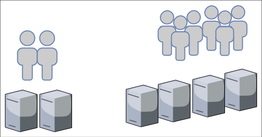
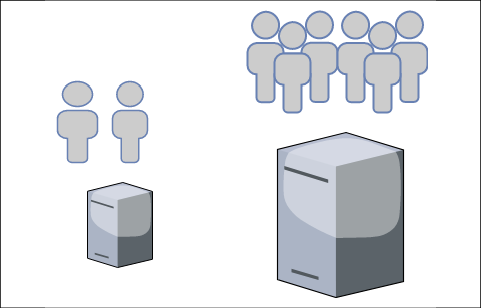
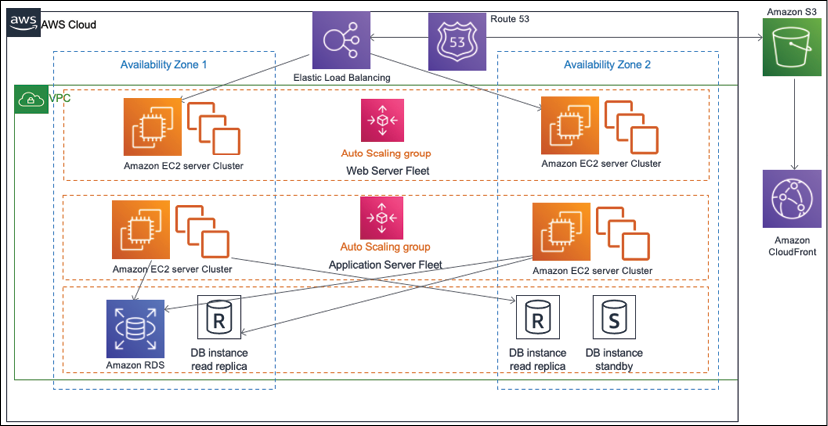
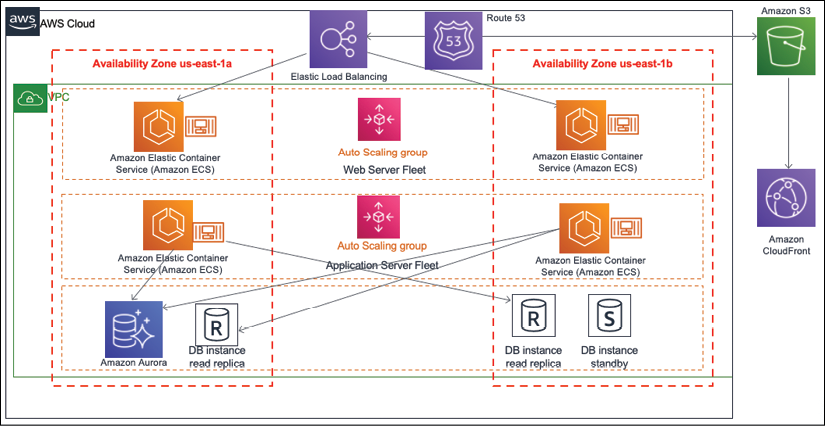
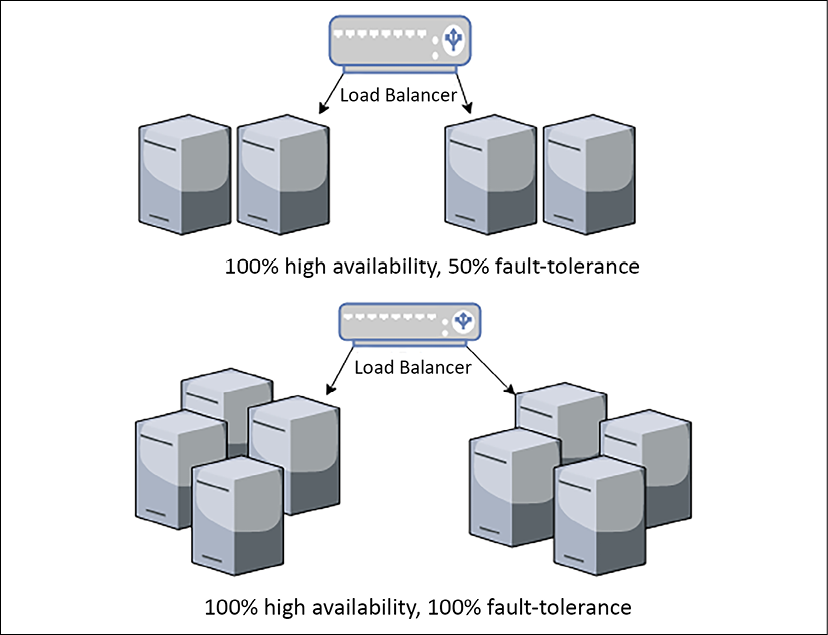
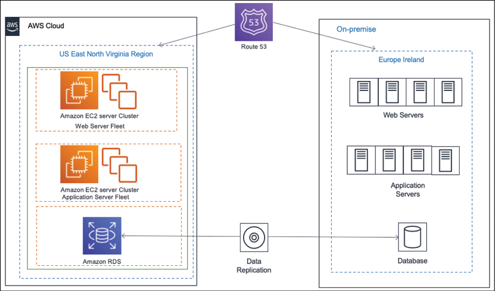
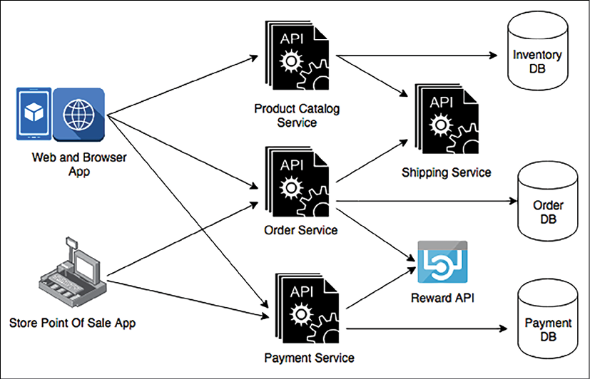
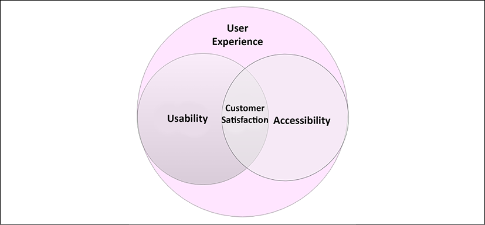
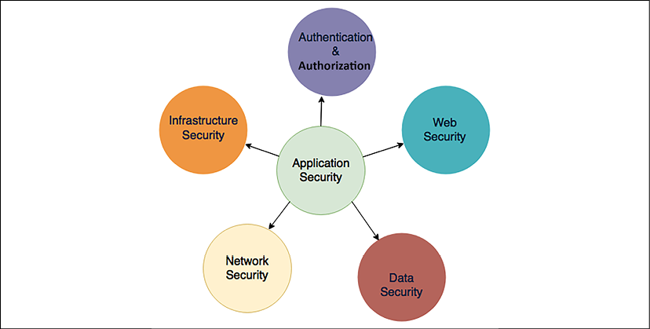

# 解决方案架构的属性

解决方案架构需要考虑多个属性和设计应用程序。解决方案设计可能会对组织中的众多项目产生广泛影响，这需要仔细评估架构的各种属性，同时还要在它们之间取得平衡。本章将提供对每个属性的整体理解，以及它们如何在解决方案设计中相互关联和共存。

根据解决方案的复杂性，可能有比这里介绍的更多的属性，但在本章中，你将了解可应用于解决方案设计的大多数方面的共同特征。你还可以将它们视为非功能性需求 (**NFR**)，它们满足设计的一个重要方面。解决方案架构师有责任查看所有属性并确保它们满足所需的要求并满足客户的期望。

在本章中，我们将讨论以下主题：

- 可扩展性和弹性
- 高可用性和弹性
- 容错和冗余
- 灾难恢复和业务连续性
- 可扩展性和可重用性
- 可用性和可访问性
- 可移植性和互操作性
- 卓越运营和可维护性
- 安全性和合规性
- 成本优化和预算

## 可扩展性和弹性

在设计解决方案时，可扩展性一直是主要因素。如果你向任何企业询问他们现有的和新的解决方案，大多数时候他们喜欢提前计划可扩展性。可扩展性意味着让你的系统能够处理不断增长的工作负载，并且它可以应用于多个层，例如应用程序服务器、Web 应用程序和数据库。

由于现在大多数应用程序都是基于 Web 的，因此我们也来谈谈弹性。这不仅是通过添加更多功能来扩大你的系统，而且是缩小它以节省不必要的成本。特别是随着公共云的采用，快速增长和缩减工作负载变得很容易，弹性现在取代了可扩展性。传统上，有两种扩展模式：

- 水平扩展：随着计算能力在过去十年中成为一种指数级便宜的商品，水平扩展变得越来越流行。在水平扩展中，团队添加了更多服务器来处理不断增加的工作负载：
  
  图 3.1：水平缩放

以图3.1所示的示意图为例； 假设你的应用程序能够使用两个服务器实例每秒处理 1,000 个请求。 随着用户群的增长，应用程序开始每秒接收 2,000 个请求，这意味着你可能希望将应用程序实例增加一倍至四个以处理增加的负载。
- 垂直缩放：这已经存在很长时间了。 在这种做法中，团队会向同一实例添加额外的计算机存储容量和内存能力，以处理不断增加的工作负载。 如图 3.2 所示，在垂直扩展中，你将获得更大的实例——而不是添加更多新实例——来处理增加的工作负载：
  
  图 3.2：垂直缩放

然而，垂直扩展模型可能不那么划算；当你购买具有更多计算能力和内存容量的硬件时，成本会成倍增加。你希望在某个阈值之后避免垂直缩放，除非绝对需要它来处理不断增加的工作负载。垂直扩展最常用于扩展关系数据库服务器。但是，你需要在这里考虑数据库分片。如果你的服务器达到垂直扩展的极限，则单个服务器的增长不能超过一定的内存和计算能力。

### 扩展中的容量困境

大多数企业都有用户最活跃的旺季，应用程序必须处理额外的负载以满足需求。以销售各种产品（如衣服、杂货、电子产品和商品）的电子商务网站为例。此类网站全年流量正常，但在购物季流量增加10到20倍；例如，美国的黑色星期五和网络星期一，或英国的节礼日，都会出现这种高峰。这种模式为容量规划带来了一个有趣的问题，你的工作量将在一年中的几个月内急剧增加。

在传统的本地数据中心，额外的硬件可能需要四到六个月的时间才能应用就绪，这意味着解决方案架构师必须规划容量。容量规划过剩意味着你的 IT 基础设施资源将在一年中的大部分时间处于闲置状态，容量减少意味着你将在重大销售活动期间损害用户体验，从而显着影响整体业务。这意味着解决方案架构师需要规划弹性工作负载，这些工作负载可以按需增长和收缩。公共云使容量规划变得非常容易，你可以根据组织的需要在有限的时间段内立即获得更多资源（例如计算机存储容量）。

## 扩展你的架构

让我们继续电子商务网站示例，考虑现代三层架构，看看我们如何在应用程序的不同层实现弹性。 在这里，我们只针对架构设计的弹性和可扩展性方面。 你将在第 6 章"解决方案体系结构设计模式"中了解更多相关信息。 图 3.3 显示了 AWS 云技术堆栈的三层架构图。



图 3.3：扩展三层架构

这张图中可以看到很多组件，包括以下几个：

- 虚拟服务器（亚马逊弹性云计算）
- 数据库（亚马逊 RDS）
- 负载均衡器（亚马逊弹性负载均衡器）
- DNS 服务器（亚马逊 Route53）
- CDN 服务（亚马逊 CloudFront）
- 网络边界 (VPC) 和对象存储 (Amazon S3)

如图 3.3 所示，负载均衡器后面有一组 Web 和应用程序服务器。在此架构中，用户向负载均衡器发送应用程序请求，负载均衡器将流量路由至 Web 服务器。随着用户流量的增加，自动扩展会在 Web 和应用程序队列中添加更多服务器。当需求低时，它会删除额外的服务器。在这里，自动缩放可以根据选择的类似矩阵的 CPU 利用率和内存利用率来添加或删除服务器；例如，你可以配置当 CPU 使用率超过 60% 时，添加三台新服务器；如果低于 30%，则可以删除两个现有服务器。

除了服务器之外，由于数据流的规模不断增长，扩展存储是另一个重要方面。对于大小迅速增长的静态内容（例如图像和视频）尤其如此；这比以往任何时候都更加关注存储扩展。在下一节中，你将了解静态内容缩放。

## 静态内容缩放

该体系结构的 Web 层主要关注显示和收集数据并将其传递给应用层以进行进一步处理。对于电子商务网站，每个产品都会有多个图像——甚至可能是视频——来展示产品的质感和演示，这意味着网站将有大量的静态内容，阅读量大，因为，大多数时候，用户会浏览产品。除此之外，用户可以上传多张图片和视频以供产品评论。

在 Web 服务器中存储静态内容意味着消耗大量存储空间，并且随着产品列表的增长，你不得不担心存储可扩展性。另一个问题是静态内容（例如高分辨率图像和视频）需要较大的文件大小，这可能会导致用户端出现显着的加载延迟。 Web 层需要利用内容分发网络 (CDN) 通过在边缘位置应用内容缓存来解决此问题。

CDN 提供商（例如 Akamai、Amazon CloudFront、Microsoft Azure CDN 和 Google CDN）在全球范围内提供边缘位置，静态内容可以从 Web 服务器缓存到用户位置附近的可用视频和图像，从而减少延迟。你将在第 6 章"解决方案体系结构设计模式"中了解有关缓存的更多信息。

要扩展静态内容存储，建议使用对象存储，例如 Amazon S3，或本地自定义来源，它可以独立于内存和计算机功能增长。此外，使用流行的对象存储服务（例如 Amazon S3）独立扩展存储可以节省成本。这些存储解决方案可以保存静态 HTML 页面，以减少 Web 服务器的负载，并通过 CDN 减少延迟来增强用户体验。

### 服务器机群弹性

应用层从网络层收集用户请求并执行计算业务逻辑和与数据库对话的繁重工作。当用户请求增加时，应用层需要扩展以处理它们，然后随着需求减少而缩减。在这种情况下，用户被绑定到会话中，他们可能会从他们的手机浏览并从他们的桌面购买。

在不处理用户会话的情况下执行水平缩放可能会导致糟糕的用户体验，因为这会重置他们的购物进度。

在这里，第一步是通过将用户会话与应用程序服务器实例解耦来处理用户会话，这意味着你应该考虑在独立层（例如 NoSQL 数据库）中维护用户会话；这些数据库是键值对存储，你可以在其中存储半结构化数据。 NoSQL 数据库最适合半结构化数据，其中数据条目的模式各不相同。例如，一个用户可以在设置用户配置文件时输入他们的姓名和地址。相比之下，另一个用户可以输入更多的属性，例如电话号码、性别、婚姻状况以及姓名和地址。由于两个用户具有不同的属性集，NoSQL 数据可以容纳它们并提供更快的搜索。 Amazon DynamoDB 等键值数据库是高度可分区的，允许以其他类型的数据库无法实现的规模进行水平扩展。

一旦你开始将用户会话存储在 NoSQL 数据库（例如 Amazon DynamoDB 或 MongoDB）中，你的实例就可以水平扩展而不会影响用户体验。你可以在一组应用程序服务器前面添加一个负载均衡器，它可以在实例之间分配负载；在自动缩放的帮助下，你可以按需自动添加或删除实例。

### 数据库缩放

大多数应用程序使用关系数据库来存储它们的事务数据。关系数据库的主要问题是它们无法水平扩展，除非你计划其他技术（例如分片）并相应地修改你的应用程序。这将是很多工作。

对于数据库，最好是未雨绸缪，减少它们的负载。使用混合存储方法，例如将用户会话存储在单独的 NoSQL 数据库中，将静态内容存储在对象存储中，以及应用外部缓存，有助于卸载主数据库。最好保留主数据库节点用于写入和更新数据，并为所有读取请求使用一个额外的只读副本。

Amazon RDS 引擎为关系数据库提供最多六个只读副本，Oracle 插件可以在两个节点之间实时同步数据。只读副本在与主节点同步时可能会有几毫秒的延迟，你需要在设计应用程序时对此进行规划。建议使用Memcached或Redis等缓存引擎来缓存频繁的查询，从而减轻master节点的负载。

如果你的数据库开始增长超过其当前容量，那么你需要重新设计并通过应用分区将数据库划分为碎片。

在这里，每个分片都可以独立增长，应用程序需要确定一个分区键来将用户数据存储在各自的分片中。例如分区键为```user_name```，那么A到E开头的用户名可以存放在一个分片中，F到I开头的名字可以存放在第二个分区中，以此类推。应用程序需要根据用户姓名的第一个字母将用户记录定向到正确的分区。

因此，正如你所见，可扩展性是设计解决方案架构时的一个重要因素，如果规划不当，它可能会显着影响整体项目预算和用户体验。解决方案架构师在设计应用程序和优化工作负载以实现最佳性能和最低成本时始终需要考虑弹性。

解决方案架构师需要评估不同的选项，例如用于静态内容缩放和负载平衡的 CDN、用于服务器缩放的自动缩放选项，以及用于缓存、对象存储、NoSQL 存储、只读副本和分片的各种数据存储选项。

在本节中，你已经发现了各种扩展方法以及如何将弹性注入架构的不同层。可扩展性是确保应用程序具有高可用性以使你的应用程序具有弹性的重要因素。我们将在下一节中了解有关高可用性和弹性的更多信息。

## 高可用性和弹性

组织不想看到的一件事是停机时间。应用程序停机会导致业务和用户信任度下降，这使得高可用性成为设计解决方案架构时的主要因素之一。应用程序正常运行时间的要求因应用程序而异。

如果你有一个拥有大量用户群的面向外部的应用程序，例如电子商务网站或社交媒体平台，那么 100% 的正常运行时间就变得至关重要。对于内部应用程序（由员工访问，例如人力资源系统或公司内部），博客可以容忍一些停机时间。实现高可用性与成本直接相关，因此解决方案架构师必须始终根据应用程序要求规划高可用性，以避免过度架构。

要实现**高可用性**架构，最好在数据中心的隔离物理位置规划工作负载，这样，如果一个地方发生中断，你的应用程序副本可以从另一个位置运行。

如图 3.4 中的架构图所示，你在两个独立的可用区（代表数据中心的不同物理位置）中有可用的 Web 和应用程序服务器群。

负载均衡器有助于在两个可用区之间分配工作负载，以防**可用区 1** 由于电源或网络中断而停机。**可用区 2** 可以处理用户流量，你的应用程序将启动并运行。

就数据库而言，你在**可用区 2** 中有一个备用实例，当**可用区 1** 出现问题时，该备用实例将进行故障转移并成为主实例。主实例和备用实例都会持续同步数据。



图 3.4：高可用性和弹性架构

另一个重要因素是架构的弹性。当你的应用程序遇到麻烦并且你面临间歇性问题时，请应用自我修复原则，这意味着你的应用程序应该能够在没有人为干预的情况下自行恢复。

对于你的架构，可以通过监控工作负载和采取主动行动来实现弹性。如图 3.4 所示，负载均衡器将监控实例的健康状况。如果任何实例停止接收请求，负载均衡器可以从服务器队列中取出坏实例，并告诉自动缩放启动一个新服务器作为替代。另一种主动方法是监控所有实例的健康状况（例如 CPU 和内存利用率，并在工作实例开始达到阈值限制时立即启动新实例），例如确保 CPU 利用率高于 70%，或者内存利用率超过 80%。

高可用性和弹性的属性可以通过实现弹性来帮助降低成本。例如，如果服务器利用率低，你可以取出一些服务器并节省拥有这种过剩容量的成本。

高可用性架构与自我修复密切相关，你可以在其中确保你的应用程序正常运行，但你还需要快速恢复以维持所需的用户体验。

虽然高可用性可确保你的系统正常运行并可供用户使用，但在容错发挥作用的情况下保持性能也很重要。现在让我们转向容错和冗余的主题。

## 容错和冗余

在上一节中，你了解到容错和高可用性彼此之间有着密切的关系。高可用性意味着你的应用程序可供用户使用，但性能可能会下降。假设你需要四台服务器来处理用户的流量。为此，你将两台服务器放在两个不同的物理隔离数据中心。如果一个数据中心出现中断，则可以从另一个数据中心提供用户流量。但是现在你只有两台服务器，这意味着只有原来容量的 50% 可用，用户可能会遇到性能问题。在这种情况下，你的应用程序具有 100% 的高可用性，但只有 50% 的容错能力。

容错是关于在发生中断时处理工作负载容量，而不影响系统性能。由于增加了冗余，完整的容错架构会带来高昂的成本。在应用程序恢复期间，你的用户群能否忍受性能下降取决于应用程序的重要性。



图 3.5：容错架构

如图 3.5 所示，你的应用程序需要四台服务器来处理全部工作负载，方法是将它们分布到两个不同的区域。在这两种情况下，你都保持 100% 的高可用性。要实现 100% 容错，你需要完全冗余，并且必须保持服务器的双重计数，以便用户在一个区域中断期间不会遇到任何性能问题。通过保持相同数量的服务器，只能实现 50% 的容错率。

在设计应用程序架构时，解决方案架构师需要确定应用程序用户的性质以及是否需要 100% 的容错率，这将不可避免地带来成本影响。例如，电子商务网站可能需要 100% 的容错能力，因为性能下降会直接影响业务收入。与此同时，员工在月底用来检查工资单的内部工资单系统可以容忍短期内的绩效下降。

为了业务连续性，需要针对不确定性进行规划，这可能会导致系统停机并影响整体可用性。灾难恢复通过确保系统在不可预见的事件中可用来帮助减轻这种风险。让我们在下一节中了解有关灾难恢复计划的更多信息。

## 容灾恢复和业务连续性

在上一节中，你了解了如何使用高可用性和容错来处理应用程序正常运行时间。可能会出现这样的情况，即你的数据中心所在的整个区域因大规模停电、地震或洪水而瘫痪，但你的全球业务仍应继续运行。在这种情况下，你必须制定灾难恢复计划，通过在完全不同的地区（甚至可能在不同的大陆或国家/地区）准备足够的 IT 资源来规划你的业务连续性。

在规划灾难恢复时，解决方案架构师必须了解组织的恢复时间目标 (**RTO**) 和恢复点目标 (**RPO**)。 RTO 衡量的是企业在没有任何重大影响的情况下可以维持多少停机时间； RPO 表示企业可以容忍多少数据丢失。降低 RTO 和 RPO 意味着产生更大的成本，因此必须了解业务是否是关键任务并且需要最小的 RTO 和 RPO。例如，股票交易应用程序不能丢失单个数据点，或者铁路信号应用程序不能停机，因为人类的生命取决于它。

以下图 3.6 中的架构图显示了一个多站点灾难恢复架构，其中主数据中心位于欧洲爱尔兰，灾难恢复站点位于美国弗吉尼亚州，托管在 AWS 公共云上。在这种情况下，即使整个欧洲地区或公共云出现问题，企业也可以继续运营。灾难恢复计划基于多站点模型以实现最小 RTO 和 RPO 这一事实意味着最小甚至没有中断，并且没有数据丢失。



图 3.6：混合多站点灾难恢复架构

以下是最常见的灾难恢复计划，你将在第 12 章 DevOps 和解决方案架构框架中了解所有这些计划：

- **备份和存储**：该方案成本最低，但具有最大的 RTO 和 RPO。在这个方案中，所有服务器的机器镜像和数据库快照都应该存储在容灾站点中。如果发生灾难，该团队将尝试从备份中恢复灾难站点。
- **Pilot Lite**：在这个方案中，所有服务器的机器映像都存储为备份，并在容灾恢复站点维护一个小型数据库服务器，并从主站点持续同步数据。其他关键服务（例如 Active Directory）可能在小型实例中运行。如果发生灾难，该团队将尝试从机器映像中启动服务器并扩展数据库。 Pilot Lite 比 Backup and Store 成本更高，但 RTO 和 RPO 更低。
- **暖备**：在该方案中，灾备站点中的所有应用服务器和数据库服务器（低容量运行）实例持续与主站点保持同步。如果发生灾难，该团队将尝试扩展所有服务器和数据库。暖待机比 Pilot Lite 选项成本更高，但 RTO 和 RPO 更低。
- **多站点**：此方案是最昂贵的，并且 RTO 和 RPO 接近于零。在此方案中，领先站点的副本在具有相同容量的灾难恢复站点中维护，并主动为用户流量提供服务。如果发生灾难，所有流量都将被路由到备用位置。

通常，组织会选择成本较低的灾难恢复选项，但必须执行定期测试以确保故障转移正常工作。团队应将卓越运营作为例行检查点，以确保在发生灾难恢复时业务连续性。

## 可扩展性和可重用性

企业随着业务的发展而发展，其中应用程序不仅可以扩展以处理不断增加的用户群，而且还不断添加更多功能以保持领先地位并获得竞争优势。解决方案设计需要具有足够的可扩展性和灵活性，以修改现有功能或添加新功能。为了模块化他们的应用程序，组织通常希望构建一个具有一组功能的平台并将它们作为单独的应用程序启动。这只有在可重复使用的设计中才有可能。

为了实现解决方案的可扩展性，解决方案架构师需要尽可能使用松散耦合的体系结构。在高层次上，创建基于 RESTful 或队列的架构可以帮助开发不同模块之间或跨应用程序的松散耦合通信。你将在第 6 章"解决方案架构设计模式"中了解有关其他类型架构的更多信息。在本节中，我们将通过一个简单的例子来解释架构灵活性的概念。

图 3.7 显示了电子商务应用程序中基于 API 的架构。在这里，你拥有独立的服务，例如最终用户应用程序以挑选方式使用的产品目录、订单、付款和运输。客户使用移动和浏览器应用程序下在线订单。这些应用程序需要产品目录服务来浏览 Web 上的产品，需要订单服务来下订单，还需要支付服务来付款。

产品目录和订单服务又与运输服务通信，将订购的商品送到客户家门口。另一方面，实体店使用销售点系统，客户代表扫描条形码、代表客户下订单并收款。在这里，不需要送货服务，因为客户会在店内提货。



图 3.7：可扩展的基于 API 的架构

从图 3.7 可以看到 Reward API，用于第三方 API 集成。此架构允许你扩展当前设计以集成 Reward API 以保留客户，并通过在新客户购买商品时提供优惠来吸引他们。在这里，你可以看到在线和商店订购如何重新利用支付服务。如果组织想要为礼品卡服务、食品服务等付款，则另一个服务可以重用它。

可扩展性和可重用性不仅限于服务设计层面——它深入到实际的 API 框架层面，软件架构师应该使用面向对象的分析和设计 (OOAD) 概念，例如继承和容器来创建 API 框架。这可以扩展和重新利用，以向同一服务添加更多功能。

你可能创建了一个功能非常丰富的产品，但在用户发现它易于导航和访问之前，它可能不会对用户产生广泛的吸引力。你的应用程序的可用性和可访问性对产品的成功起着重要作用。让我们在下一节中了解更多相关信息。

## 可用性和可访问性

你希望用户在浏览应用程序时获得无缝体验。它应该如此顺利，以至于他们甚至没有注意到他们能够轻松找到东西——没有任何困难。你可以通过使你的应用程序高度可用来做到这一点。在定义可以满足用户体验的可用性时，用户研究和测试是必不可少的方面。

可用性是用户在第一次使用你的应用程序时可以多快地学习导航逻辑。这是关于如果他们犯了错误并且能够有效地执行任务，他们能够以多快的速度反弹。如果不能有效使用，复杂且功能丰富的应用程序将毫无意义。

通常，在设计应用程序时，你希望面向全球受众或重要地理区域。你的用户群在技术设施和身体能力方面应该多样化。你希望每个人都可以访问你的应用程序，无论用户的 Internet 连接是否缓慢、使用旧设备或者他们是否有身体限制。

可访问性是关于包容性，使你的应用程序可供所有人使用。在设计应用程序时，解决方案架构师需要确保它可以通过慢速 Internet 连接访问，并且与各种设备兼容。有时，他们可能必须完全创建不同版本的应用程序才能实现这一目标。

辅助功能设计应包括设计组件，例如语音识别和基于语音的导航、屏幕放大镜以及大声朗读内容的能力。本地化有助于应用程序以特定区域的语言提供；例如，西班牙语、普通话、德语、印地语或日语。



图 3.8：客户对可用性和可访问性的满意度

如图 3.8 所示，客户满意度是可用性和可访问性的组成部分。你必须了解你的用户才能实现可用性和可访问性——可访问性是可用性的一个组成部分——因为它们是齐头并进的。在开始解决方案设计过程之前，解决方案架构师应与产品所有者一起通过对模拟前端设计进行访谈、调查和收集反馈来研究用户。你需要了解用户的局限性，并在应用程序开发期间为他们提供支持功能。

当产品发布时，团队应该通过将一小部分用户流量路由到新功能并了解用户反应来计划 A/B 测试。 A/B 测试是一种将应用程序的两个版本相互比较以确定哪个版本性能更好的方法。启动后，应用程序必须有一种机制来收集持续的反馈（通过提供反馈表或启动客户支持）以改进设计。

一个系统不可能长期单独运作。为了使应用程序功能丰富并简化用户交互，解决方案架构师必须考虑其与其他应用程序的可操作性。让我们在下一节中看看可移植性和互操作性。

## 可移植性和互操作性

互操作性是关于一个应用程序通过标准格式或协议与其他应用程序协同工作的能力。通常，应用程序需要与各种上游系统通信以使用数据并与下游系统通信以提供数据，因此无缝地建立该通信至关重要。

例如，电子商务应用程序需要与供应链管理生态系统中的其他应用程序协同工作。这包括用于记录所有交易的企业资源规划应用程序、运输生命周期管理、运输公司、订单管理、仓库管理和劳动力管理。

所有应用程序都应该能够无缝地交换数据，以实现从客户订单到交付的端到端功能。无论是医疗保健应用程序、制造应用程序还是电信应用程序，你都会在任何地方遇到类似的用例。

解决方案架构师需要在设计期间通过识别和处理各种系统依赖关系来考虑应用程序的互操作性。可互操作的应用程序在成本方面节省了大量成本，因为它依赖于能够以相同格式进行通信而无需任何数据消息传送工作的系统。每个行业都有其需要理解和遵守的数据交换标准规模。

一般来说，对于软件设计，架构师可能会为不同的应用程序选择一种流行的格式，例如JSON或XML，以便它们可以相互通信。在现代 RESTful API 设计和微服务架构中，这两种格式都是开箱即用的。

系统可移植性允许你的应用程序在不同的环境中工作，而无需任何更改，或者只需进行最小的更改。任何软件应用程序都必须跨各种操作系统和硬件工作才能实现更高的可用性。由于技术日新月异，你经常会看到软件语言、开发平台或操作系统的新版本发布。如今，移动应用程序是任何系统设计中不可或缺的一部分，你的移动应用程序需要与主要的移动操作系统平台兼容，包括 iOS、Android 和 Windows。

在设计阶段，解决方案架构师需要选择一种能够实现应用程序所需可移植性的技术。例如，如果你的目标是跨不同的操作系统部署你的应用程序，Java 等编程语言可能是一个不错的选择，因为它通常被所有操作系统支持，并且你的应用程序将在不同的平台上运行而无需移植过来。对于移动应用程序，架构师可以选择基于 JavaScript 的框架，例如 React Native，它可以提供跨平台的移动应用程序开发。

互操作性丰富了系统的可扩展性，而可移植性增加了应用程序的可用性。两者都是架构设计的关键属性，如果在解决方案设计期间未解决它们，可能会增加额外的指数成本。解决方案架构师需要根据行业要求和系统依赖性仔细考虑这两个方面。

## 卓越运营和可维护性

通过以最少的中断和高质量为客户提供同等的服务，卓越的运营可以使你的应用程序脱颖而出。它还通过应用主动的卓越运营来帮助支持和工程团队提高生产力。可维护性与卓越运营息息相关。易于维护的应用程序有助于降低成本、避免错误并让你获得竞争优势。

解决方案架构师需要为操作而设计，这意味着设计应包括如何长期部署、更新和操作工作负载。

必须规划日志记录、监控和警报以捕获所有事件并快速采取行动以获得最佳用户体验。尽可能应用自动化，无论是部署基础架构还是更改应用程序代码以避免人为错误。

在你的设计中包括部署方法和自动化策略非常重要，因为这可以在不影响现有运营的情况下加快任何新更改的上市时间。卓越运营规划应考虑安全性和合规性要素，因为法规要求可能会随着时间的推移而变化，你的应用程序必须遵守这些要求才能运行。

维护可以是主动的或被动的；例如，一旦新版本的操作系统可用，你可以使你的应用程序现代化以立即切换平台，或者监控系统运行状况并等到软件生命周期结束后再进行任何更改。在任何情况下，都应该使用回滚策略以小增量进行更改。要应用这些更改，你可以通过设置持续集成和持续部署 (CI/CD) 管道来自动化整个过程。对于启动，你可以计划 A/B 或蓝绿部署。

对于操作准备，架构设计应包括适当的文档和知识共享机制——例如，创建和维护运行手册来记录日常活动，以及创建可以指导系统处理问题的剧本。这使你可以在发生事故时迅速采取行动。你应该使用事件后报告的根本原因分析来确定问题发生的原因并确保它不会再次发生。

卓越运营和维护是一项持续的工作；每一次运营事件和失败都是一次学习的机会，并通过从以前的错误中吸取教训来帮助改进你的运营。你必须分析操作的活动和故障，进行更多试验并进行改进。你将在第 10 章"卓越运营注意事项"中了解有关卓越运营的更多信息。

## 安全性和合规性

安全性是解决方案设计最重要的属性之一。 许多组织都受到安全漏洞的威胁，这导致客户失去信任并损害你的企业声誉。 行业标准法规，例如针对金融的 PCI、针对医疗保健的 HIPAA、针对欧盟的 GDPR 和 SOC 合规性，强制实施安全保护措施以保护消费者数据，同时为组织提供标准指导。 根据你所在的行业和地区，你必须通过遵守合规性需求来遵守当地法规。

应用安全主要需要应用在以下几个方面的方案设计中：



图 3.9：解决方案设计中的安全方面

让我们来看看不同的安全方面。 你将在第 8 章"安全注意事项"中深入探讨每个组件。

### 认证授权

身份验证意味着指定谁可以访问系统，而授权则适用于用户进入系统或应用程序后可以执行的活动。解决方案架构师在创建解决方案设计时必须考虑适当的身份验证和授权系统。始终从最低特权开始，并根据用户角色的需要提供进一步的访问权限。

如果你的应用程序供公司内部使用，你可能希望允许通过联合组织系统（例如 Active Directory、SAML 2.0 或 LDAP）进行访问。如果你的应用程序针对大量用户群，例如社交媒体网站或游戏应用程序中存在的用户群，那么你可以允许他们通过 OAuth 2.0 和 OpenID 访问进行身份验证，用户可以在其中使用他们的其他 ID，例如 Facebook、Google、亚马逊和推特。

识别任何未经授权的访问并立即采取措施减轻安全威胁非常重要；这保证了对访问管理系统的持续监控和审计。你将在第 8 章安全注意事项中了解应用程序安全性。

### Web 安全

Web 应用程序经常暴露在互联网上，容易受到外部攻击。解决方案设计必须考虑防止攻击，例如跨站点脚本 (**XSS**) 和 **SQL 注入**。如今，分布式拒绝服务 (**DDoS**) 攻击方法给组织带来了麻烦。为了防止这种情况，需要适当的工具，并且需要制定事件响应计划。

解决方案架构师应该计划使用 Web 应用程序防火墙 (**WAF**) 来阻止恶意软件和 SQL 注入攻击。 WAF 可用于阻止来自你没有用户群的国家/地区的流量或阻止恶意 IP 地址。 WAF 结合 CDN 可以帮助预防和处理 DDoS 攻击。

### 网络安全

网络安全有助于防止组织和应用程序内部的整体 IT 资源向外部用户开放。解决方案设计必须计划保护网络，这有助于防止未经授权的系统访问、主机漏洞和端口扫描。

解决方案架构师应该通过将所有内容置于公司防火墙之后并尽可能避免访问 Internet 来规划最小的系统暴露。例如，Web 服务器不应该暴露在互联网上；相反，只有负载均衡器才能与互联网通信。对于网络安全，计划使用入侵检测系统 (**IDS**) 和入侵防御系统 (**IPS**)，并将它们置于网络流量之前。

### 基础设施安全

如果你要维护自己的数据中心，那么如果你希望阻止任何未经授权的用户对你的服务器进行物理访问，那么基础设施的物理安全性就非常重要。但是，如果你租用数据中心或使用私有云，则可以由第三方供应商处理。对服务器的逻辑访问必须受到网络安全的保护，这是通过配置适当的防火墙来实现的。

恶意攻击很常见，这是数据中心安全漏洞的主要原因。安全基础设施变得非常重要，管理谁可以访问数据，并保护它免受任何漏洞的影响。从你的应用程序托管数据中心到公司人力资源系统和全球位置，你需要确保 IT 基础设施的每一层都是安全的。

### 数据安全

数据是需要保护的最关键的组件之一。毕竟，你要在访问、Web、应用程序和网络级别设置安全层来保护你的数据。数据可以在两个系统之间交换，因此它在传输过程中必须是安全的，或者它在静止时可能是安全的（位于数据库或某些存储单元中）。

解决方案设计需要通过安全套接字层/传输层安全 (**SSL/TLS**) 和安全认证来规划传输中的数据安全。静态数据应该使用各种加密机制来保护，这些机制可以是对称的或非对称的。设计还应根据应用程序要求，计划使用正确的密钥管理方法来保护加密密钥。密钥管理可以通过使用硬件安全模块或云供应商提供的服务来实现。应应用使用标识和授权管理的最小权限规则来定义谁可以访问哪些数据。

在确保安全的同时，必须有一种机制可以在任何安全漏洞发生时立即识别它以实现快速响应。将自动化添加到每一层以监控并立即发出警报，任何违规行为都必须是解决方案设计的一部分。 DevSecOps 正在成为大多数组织的趋势，因为它在生命周期的软件开发部分应用最佳实践来自动化安全需求和安全响应。你将在第 12 章 DevOps 和解决方案架构框架中了解有关 DevSecOps 的更多信息。

为遵守相关法规，解决方案设计需要包含审计机制。对于金融，严格要求遵守支付卡行业数据安全标准 (**PCI DSS**) 等法规，以获取系统中每笔交易的日志记录，这意味着需要记录所有活动并在需要时将其发送给审计员。任何个人身份信息 (**PII**) 数据，如客户电子邮件 ID、电话号码和信用卡号码，都需要通过对任何存储 PII 数据的应用程序应用加密和有限访问来保护。

在本地环境中，客户组织有责任确保基础设施和应用程序的安全，并获得适当的合规性认证。然而，在公共云中，AWS 等环境减轻了这一负担，因为基础设施的安全性和合规性由云供应商负责。客户共同承担应用程序安全性的责任，并通过完成所需的审核确保其合规。

## 成本优化和预算

每个解决方案都受到预算的限制，投资者寻求最大的投资回报率。解决方案架构师需要在架构设计时考虑成本节约。

从试点创建到解决方案实施和启动，都应优化成本。成本优化是一项持续的努力，应该是一个持续的过程。与任何其他约束一样，节省成本也需要权衡取舍；它应该重点确定其他组件，例如交付速度和性能，是否更为关键。

通常，由于过度提供资源和忽视采购成本而导致成本增加。解决方案架构师需要规划最佳资源以避免过度利用不足。在组织层面，应该有一个自动化的机制来检测幽灵资源，团队成员可以在其中创建开发和测试环境，这些环境在完成任务后不再使用。通常，幽灵资源会被忽视并导致成本超支。组织需要通过应用自动发现来记录其 IT 库存，这可确保跟踪所有 IT 库存并将其当前运行状况和运行状态记录到中央数据库中。

在技术选择过程中，必须评估构建成本与源成本。有时，当你的组织手头没有专业知识并且构建成本很高时，最好使用第三方工具，例如采购日志分析和商业智能工具。此外，在选择解决方案实施技术时，我们需要确定学习的难易程度和实施的复杂性。从 IT 基础架构的角度来看，我们需要评估资本支出与运营支出，因为维护数据中心需要大量的前期资本投资才能满足不可预见的扩展需求。由于有多种选择，解决方案架构师可以从以下选项中进行选择：公共、私有和多云。或者，他们可以采用混合方法。

与所有组件一样，成本需要自动化，并且需要针对预算消耗设置警报。成本需要在组织单位和工作负载之间进行规划和分配，以便所有组都可以分担责任。随着收集到更多历史数据，该团队需要通过优化运营支持和工作负载来持续关注成本优化。你将在第 11 章"成本考虑"中了解有关成本优化的更多信息。

## 概括

在本章中，你了解了在创建解决方案设计时需要考虑的各种解决方案架构属性。你了解了垂直和水平两种可扩展性模式，以及如何扩展架构的各个层，包括 Web 层、应用程序服务器和数据库。

你还学习了如何使用自动缩放将弹性应用到你的工作负载，以便它可以按需增长和收缩。本章还提供了设计弹性架构的见解，以及用于实现高可用性的方法。此外，这有助于你了解容错和冗余，以便你可以按照用户的期望使你的应用程序具有高性能，并在发生不可预见的事件时制定灾难恢复计划以继续你的业务。

然后，你了解了使架构可扩展和可访问的重要性，以及架构的可移植性和互操作性如何帮助降低成本和提高应用程序的采用率。本章最后解释了应用卓越运营和安全性的方法，以及在架构的每一层节省成本的方法，以及如何从解决方案设计过程的开始就考虑这些属性。你将在本书后面更详细地查看每个组件。

在下一章中，你将了解解决方案架构设计的原则。我们将重点关注如何设计解决方案架构，同时牢记本章中解释的各种属性。