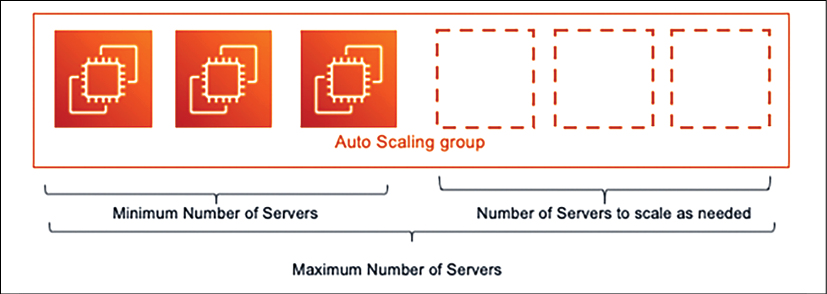
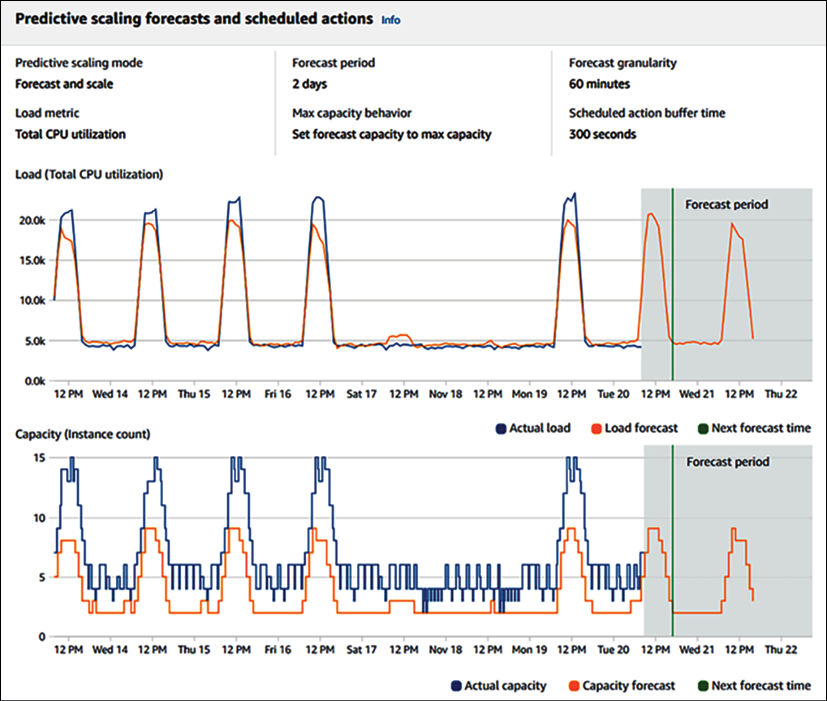
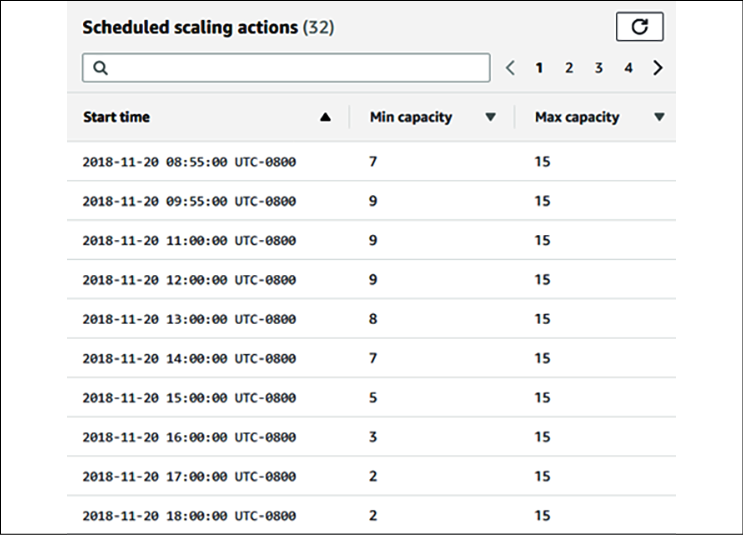
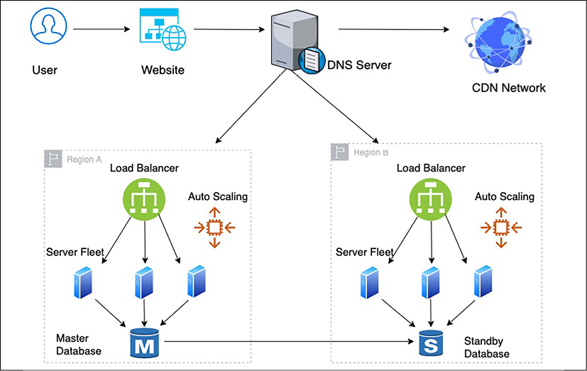
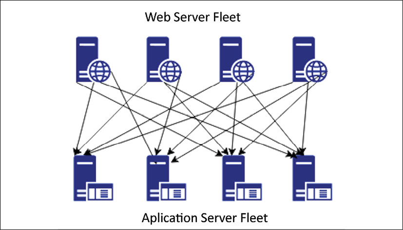
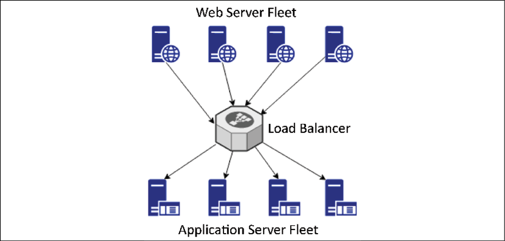
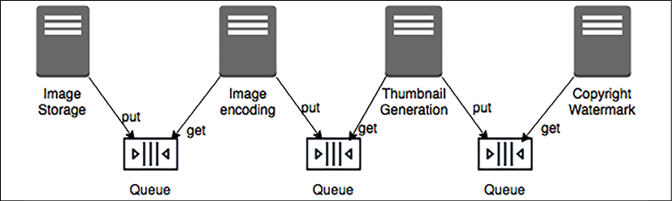
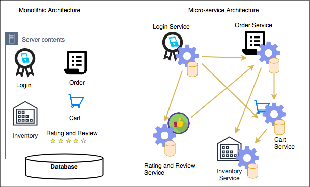

# 解决方案架构设计原则

在上一章中，你了解了解决方案架构的属性。这些属性是解决方案架构师在创建解决方案设计时需要牢记的基本属性。在本章中，你将了解解决方案架构设计的原则，这些原则在解决方案设计过程中包含各种属性。

本章阐明了最重要和最常见的设计原则。但是，可能会有更多基于产品复杂性和行业领域的设计方面。随着你在本书中成为解决方案架构师的学习之路向前推进，这些设计原则和属性将被进一步应用，以便在第 6 章"解决方案架构设计模式"中创建各种设计模式。

你将在本章中了解以下主题：

- 扩展工作负载
- 构建弹性架构
- 性能设计
- 使用可替换资源
- 考虑松耦合
- 认为服务而不是服务器
- 根据正确的要求使用正确的存储
- 思考数据驱动设计
- 克服架构限制
- 增加安全性
- 应用自动化

在本章中，你不仅将学习如何设计可扩展、有弹性和高性能的架构，还将学习如何通过应用安全性、克服架构约束以及应用更改以及测试和自动化方法来保护你的应用程序。这些原则将帮助你通过使用数据驱动的方法以正确的方式应用思维。

## 扩展工作负载

在第 3 章解决方案架构的属性的可扩展性和弹性部分，你了解了不同的扩展模式以及如何在较高级别扩展静态内容、服务器群和数据库。现在，让我们看看可用于处理工作负载峰值的各种扩展类型。

如果你了解自己的工作量（通常是这种情况），则扩展可能是可预测的；或者，如果你突然出现峰值，或者你以前从未处理过这种负载，它可能会反应迟钝。

例如，以下 Auto Scaling 组最多有六个实例，最小大小为三个实例。在正常的用户流量期间，将启动并运行三台服务器来处理工作负载，但要处理流量高峰，服务器的数量可以达到六台。你的服务器机群将根据你定义的扩展策略来增加，以调整实例数量。例如，当 CPU 使用率在现有服务器群中超过 60% 时，你可以选择添加一台服务器，但不会启动超过六台服务器。

图 4.1：服务器自动缩放

无论扩展是反应性的还是预测性的，你都需要监控应用程序并收集数据以规划你的扩展需求。让我们深入研究这些模式。

### 预测缩放

预测性扩展是任何组织都希望采用的最佳案例方法。通常，你可以收集应用程序工作负载的历史数据。例如，亚马逊等电子商务网站可能具有已知的流量峰值模式，你需要进行预测扩展以避免任何延迟问题。流量模式可能包括以下内容：

- 周末的流量是工作日的三倍
- 白天的车流量是晚上的五倍
- 感恩节或节礼日等购物季的客流量是平时的 20 倍
- 总体而言，11 月和 12 月的假期流量是其他月份的 8 到 10 倍

你可能已经根据用于拦截用户流量的监控工具收集了先前的数据，并基于此可以预测扩展需求。扩展可能包括计划在工作负载增加时添加更多服务器，或添加额外的缓存。上面的电子商务工作负载示例趋向于更高的复杂性，并提供了大量数据点来帮助我们理解整体设计问题。对于如此复杂的工作负载，预测扩展变得更加重要。

预测性自动缩放是一种非常流行的缩放变体，其中可以将历史数据和趋势提供给预测算法，并且你可以提前预测在给定时间预期的工作负载量。使用此预期数据，你可以设置配置以扩展你的应用程序。

要更好地了解预测性自动缩放，请查看 AWS 预测性自动缩放功能的以下指标仪表板。

此图捕获了服务器的历史 CPU 利用率数据，并基于此提供了预测的 CPU 利用率：

图 4.2：预测性缩放预测

在下面的屏幕截图中，算法根据预测建议你应该计划多少最小容量来处理流量：

图 4.3：预测性扩展容量计划

你可以看到一天中不同时间的最小容量有所不同。预测性扩展可帮助你根据预测以最佳方式优化工作负载，而预测性自动扩展有助于减少延迟并避免中断，因为添加新资源可能需要一些时间。如果延迟添加额外资源来处理网站流量高峰，则可能会导致请求泛滥和虚假高流量，因为用户在遇到速度缓慢或中断时往往会发送重复请求。

在本节中，你了解了预测性自动缩放，但有时，由于工作负载突然激增，你需要进行反应式缩放。我们将在下一节中了解这一点。

### 反应缩放

通过使用机器学习算法，预测扩展变得更加准确，但有时你可能不得不处理突然的流量峰值，因此将依赖于反应式扩展。这种可能到达的意外流量甚至可能是正常流量的 10 倍；这通常是由于突然的需求，或者，例如，第一次尝试运行销售活动，我们不确定传入流量的水平。

让我们举个例子，你要在你的电子商务网站上推出闪购。你的主页上会有大量流量，用户将从那里转到闪购产品特定页面。有些用户可能想购买该产品；因此，他们将转到添加到购物车页面。

在这种情况下，每个页面都有不同的流量模式，你需要了解现有的架构和流量模式，以及对所需流量的估计。你还需要了解网站的导航路径。例如，用户必须登录才能购买产品，这会导致登录页面的访问量增加。

要规划用于流量处理的服务器资源扩展，你需要确定以下模式：

- 确定网页，这些网页是只读的，可以缓存。
- 哪些用户查询需要只读取该数据，而不是写入或更新数据库中的任何内容？
- 用户是否经常查询，请求相同或重复的数据，例如他们自己的用户配置文件？

一旦了解了这些模式，你就可以计划卸载架构以处理过多的流量。要卸载 Web 层流量，你可以将静态内容（例如图像和视频）从 Web 服务器移动到内容分发网络。你将在第 6 章"解决方案体系结构设计模式"中了解有关缓存分布模式的更多信息。

在服务器机群层面，你需要使用负载均衡器来分配流量，你需要使用自动缩放来增加或缩减几台服务器以应用水平缩放。

要减少数据库负载，请根据正确的要求使用正确的数据库——NoSQL 数据库用于存储用户会话和评论评论，关系数据库用于交易，缓存应用程序用于存储频繁的查询。

在本节中，你了解了用于以预测缩放和反应缩放的形式处理应用程序缩放需求的缩放模式和方法。在第 6 章解决方案架构设计模式中，你将了解不同类型设计模式的详细信息，以及如何应用它们以扩展你的架构。

## 构建弹性架构

为失败而设计，没有什么会失败。拥有弹性架构意味着你的应用程序应该可供客户使用，同时还能从故障中恢复。使你的架构具有弹性包括应用最佳实践从由于更多用户请求、恶意攻击和架构组件故障而增加的负载中恢复你的应用程序。需要在所有架构层中使用弹性，包括基础架构、应用程序、数据库、安全性和网络。弹性架构应在期望的时间内恢复。

为了使你的架构具有弹性，你需要定义恢复时间并考虑以下几点：

- 在需要时识别和实施冗余架构组件。
- 在定义的恢复时间目标 (**RTO**) 和恢复点目标 (**RPO**) 内确定并实施备份和灾难恢复计划
- 了解何时修复与何时更换架构组件。例如，修复服务器问题可能比用相同的机器映像替换它花费的时间更长。

安全性是应用程序弹性的最重要方面之一。从安全角度来看，分布式拒绝服务 (**DDoS**) 攻击有可能影响服务和应用程序的可用性。 DDoS 攻击通常会在你的服务器中放置虚假流量并使其繁忙，这意味着合法用户无法访问你的应用程序。这可能发生在网络层或应用层。你将在第 8 章安全注意事项中了解有关 DDoS 攻击和缓解的更多信息。

采取主动方法来防止 DDoS 攻击至关重要。第一条规则是将尽可能多的应用程序工作负载保留在专用网络中，并且尽可能不要将你的应用程序端点暴露在互联网上。

要及早采取行动，了解你的常规流量并建立机制来确定应用程序和网络数据包级别的大量可疑流量至关重要。

通过内容分发网络 (**CDN**) 公开你的应用程序将提供内置功能，添加 Web 应用程序防火墙 (**WAF**) 规则有助于防止不需要的流量。在 DDoS 攻击期间，扩展应该是你最后的手段，但请准备好自动扩展机制，以便你在发生此类事件时能够扩展你的服务器。

要在应用程序级别实现弹性，首先想到的是冗余，这可以通过将工作负载分散到不同的地理位置来使你的应用程序具有高可用性。为了实现冗余，你可以在同一数据中心和不同区域的不同机架上拥有冗余服务器群。如果服务器分布在不同的物理位置，则可以在到达负载均衡器之前使用域名系统 (**DNS**) 服务器处理第一级流量路由：

图 4.4：应用架构弹性

正如你在前面的体系结构中看到的那样，需要在影响应用程序可用性的所有关键层中应用弹性，以实现故障设计。为了实现弹性，需要应用以下最佳实践来创建冗余环境：

- 使用 DNS 服务器在不同物理位置之间路由流量，以便你的应用程序在整个区域故障的情况下仍能运行。
- 使用 CDN 在用户位置附近分发和缓存静态内容，例如视频、图像和静态网页，以便你的应用程序在 DDoS 攻击或本地存在点 (PoP) 位置故障时仍然可用。
- 一旦流量到达一个区域，使用负载均衡器将流量路由到一组服务器，这样即使你所在区域内的一个位置出现故障，你的应用程序仍然能够运行。
- 使用自动缩放功能根据用户需求添加或删除服务器。因此，你的应用程序不应受到单个服务器故障的影响。
- 创建备用数据库以确保数据库的高可用性，这意味着你的应用程序应该在数据库发生故障时可用。

在前面的架构中，如果任何组件发生故障，你应该有一个备份来恢复它并实现架构弹性。 DNS 服务器上的负载平衡器和路由器执行健康检查，以确保流量仅路由到健康的应用程序实例。你可以将其配置为执行浅层健康检查，它监视本地主机故障，或深度健康检查，它也可以处理依赖项故障。然而，深度健康检查比浅层健康检查需要更多时间并且更耗费资源。你将在第 9 章"架构可靠性注意事项"中了解有关弹性架构的更多信息。

在应用程序级别，必须避免级联故障，即一个组件的故障可能导致整个系统崩溃。有不同的机制可用于处理级联，例如应用超时、流量拒绝、实施幂等操作和使用断路模式。你将在第 6 章"解决方案体系结构设计模式"中了解有关这些模式的更多信息。

## 性能设计

随着快速互联网的可用性，客户正在寻求加载时间最短的高性能应用程序。组织已经注意到，直接收入影响与应用程序性能成正比，而应用程序加载时间的缓慢会显着影响客户参与度。现代公司在性能方面设定了很高的期望，这导致高性能应用程序成为留在市场上的必要条件。

与弹性一样，解决方案架构师需要考虑架构设计每一层的性能。团队需要进行监控以继续有效地执行并不断改进它。更好的性能意味着更高的用户参与度和更高的投资回报——高性能应用程序旨在处理由于外部因素（例如互联网连接速度慢）导致的应用程序运行缓慢。例如，你可能已将博客网页设计为在互联网可用性良好的情况下在 500 毫秒内加载。但是，在网速较慢的情况下，你可以先加载文本，然后在加载图片和视频时让用户接触内容。

在理想的环境中，随着应用程序工作负载的增加，自动扩展机制会开始处理额外的请求，而不会影响应用程序性能。但在现实世界中，当缩放生效时，你的应用程序延迟会在短时间内下降。在实际情况下，最好通过增加负载来测试你的应用程序的性能，并了解你是否可以达到所需的并发性和用户体验。

在服务器级别，你需要根据工作负载选择合适的服务器类型。例如，选择合适的内存和计算量来处理工作负载，因为内存拥塞会降低应用程序性能，最终，服务器可能会崩溃。对于存储，选择正确的每秒输入/输出操作数 (IOPS) 非常重要。对于写入密集型应用程序，你需要高 IOPS 来减少延迟并提高磁盘写入速度。

要获得更高的性能，请在架构设计的每一层应用缓存。缓存使你的数据在本地可供用户使用或将数据保存在内存中以提供超快速响应。以下是将缓存添加到应用程序设计的各个层所需的注意事项：

- 使用用户系统上的浏览器缓存来加载经常请求的网页
- 使用 DNS 缓存进行快速网站查找
- 将 CDN 缓存用于靠近用户位置的高分辨率图像和视频
- 在服务器级别，最大化内存缓存来服务用户请求
- 使用 Redis 和 Memcached 等缓存引擎为来自缓存引擎的频繁查询提供服务
- 使用数据库缓存为内存中的频繁查询提供服务
- 在每一层处理缓存过期和缓存驱逐

如你所见，保持应用程序的高性能是基本设计方面之一，与组织的盈利能力直接相关。解决方案架构师在创建解决方案设计时需要考虑性能，并且应该不懈努力以不断提高应用程序的性能。在第 7 章，性能注意事项中，你将深入学习优化应用程序以获得更好性能的技术。

## 使用可替换资源

组织在硬件上进行了大量的资本投资，并且他们养成了用新版本的应用程序和配置更新它们的做法。随着时间的推移，这会导致不同的服务器以不同的配置运行，并且对它们进行故障排除成为一项非常繁琐的任务。有时，你必须在不需要时继续运行不必要的资源，因为你不确定要关闭哪个服务器。

由于无法更换服务器，因此很难在你的服务器群中推出和测试任何新更新。这些问题可以通过将你的服务器视为可替换资源来解决，这使你能够更快地移动以适应升级应用程序和底层软件等变化。

这就是为什么在设计你的应用程序时，请始终考虑不可变的基础架构。

### 创建不可变的基础设施

不可变意味着在应用程序升级期间，你不仅要更换软件，还要更换硬件。组织在硬件上进行了大量的资本投资，并养成使用新版本的应用程序和配置对其进行更新的做法。

要创建可更换的服务器，你需要使你的应用程序无状态并避免对任何服务器 IP 或数据库 DNS 名称进行硬编码。基本上，你需要应用将基础架构视为软件而不是硬件的想法，而不是将更新应用于实时系统。你应该始终从黄金机器映像启动新的服务器实例，该映像具有所有必要的安全性和软件。

使用虚拟机创建不可变基础架构变得更加可行，你可以在其中创建虚拟机的黄金映像并使用新版本部署它，而不是尝试更新现有版本。这种部署策略也有利于故障排除，你可以处理有问题的服务器并从黄金映像启动新服务器。

在处理有问题的服务器之前，你应该备份日志以分析根本原因。这种方法还可以确保整个环境的一致性，因为你使用相同的基准服务器映像来创建你的所有环境。

金丝雀测试是一种流行的方法，用于确保所有更改在推广到更广泛的用户之前在生产环境中按预期工作。现在让我们了解有关金丝雀测试的更多信息。

#### 金丝雀测试
金丝雀测试是一种流行的方法，用于通过不可变的基础设施应用滚动部署。它可以帮助你确保在不影响最终用户的情况下，将旧版本的生产服务器安全地替换为新服务器。在金丝雀测试中，你将软件更新部署在新服务器中并将少量流量路由到它。

如果一切顺利，你将通过添加更多新服务器来不断增加流量，同时处理旧服务器。金丝雀部署为你提供了一个安全的选择，可以将你的更改推送到实时生产环境中。如果出现问题，只有少数用户受到影响，你可以选择通过将流量路由回旧服务器来立即恢复。

解决方案架构师需要提前考虑使用可替换资源进行部署。他们需要提前规划会话管理并避免服务器对硬编码资源的依赖。始终将资源视为可替换的，并设计你的应用程序以支持硬件更改。

解决方案架构师需要设置一个标准来使用各种滚动部署策略，例如 A/B 测试或蓝/绿部署。像对待牛而不是宠物一样对待你的服务器；当这一原则应用于更换有问题的 IT 资源时，可以确保快速恢复，并减少故障排除时间。

## 考虑松耦合

传统的应用程序构建了一个紧密集成的服务器，其中每个服务器都有特定的职责。通常，应用程序依赖于其他服务器来实现功能的完整性。

如下图所示，在紧密耦合的应用程序中，Web 服务器群直接依赖于所有应用程序服务器，反之亦然：

图 4.5：紧耦合架构

在前面的架构图中，如果一个应用服务器宕机，那么所有的 Web 服务器都会开始接收错误，因为请求将路由到一个不健康的应用服务器，这可能会导致整个系统故障。在这种情况下，如果你想通过添加和删除服务器进行扩展，则需要做大量工作，因为所有连接都需要适当设置。

通过松散耦合，你可以添加一个中间层，例如负载均衡器或队列，它会自动为你处理故障或扩展。

在下面的架构图中，Web 服务器和应用程序服务器群之间有一个负载均衡器，它确保始终为来自健康应用程序服务器的用户请求提供服务：

图 4.6：基于负载均衡器的松耦合架构

如果其中一台应用程序服务器出现故障，负载均衡器将自动开始将所有流量引导至其他三台正常运行的服务器。松散耦合的架构还可以帮助你独立扩展服务器并优雅地替换不健康的实例。它使你的应用程序更具容错性，因为错误半径仅限于单个实例。

对于基于队列的松散耦合架构，以图像处理网站为例，你需要在其中存储图像，然后对其进行编码、缩略图和版权处理。下面的架构图有基于队列的解耦。你可以通过在系统之间使用队列和交换传输作业的消息来实现系统的松散耦合。

图 4.7：基于队列的松耦合架构

基于队列的解耦支持系统的异步链接，其中一台服务器不等待另一台服务器的响应，而是独立工作。此方法允许你增加并行接收和处理消息的虚拟服务器的数量。如果没有图像需要处理，你可以配置自动缩放以终止多余的服务器。

在复杂的系统中，松散耦合的体系结构是通过创建面向服务的体系结构 (**SOA**) 实现的，其中独立的服务包含一整套功能并通过标准协议相互通信。在现代设计中，微服务架构变得非常流行，它有助于应用程序组件的解耦。松耦合设计有很多好处，从提供可扩展性和高可用性到易于集成。

在下一节中，你将了解有关 SOA 的更多信息，并且你还将在第 6 章"解决方案架构设计模式"中深入探讨该主题的详细信息。

## 考虑服务不可用

在上一节中，你了解了松散耦合以及松散耦合架构对于可扩展性和容错性的重要性。发展面向服务的思想将有助于实现松散耦合的架构（与面向服务器的设计相反，后者会导致硬件依赖和紧耦合的架构）。 SOA 帮助我们为你的解决方案设计实现轻松部署和维护。

在谈到面向服务的思想时，解决方案架构师总是倾向于 SOA。两种最流行的 SOA 基于简单对象访问协议 (**SOAP**) 服务和表述性状态传输 (**RESTful**) 服务。在基于 SOAP 的架构中，你将消息格式化为 XML，并使用构建在 HTTP 之上的 SOAP 协议通过 Internet 发送它。

在 RESTful 架构中，你可以将消息格式化为 XML、JSON 或纯文本，然后通过简单的 HTTP 发送。然而，RESTful 架构相对更受欢迎，因为它非常轻量级并且比 SOAP 更直接。

现在谈到SOA，微服务架构越来越流行。微服务是独立可扩展的，这使得在不影响其他组件的情况下扩展或收缩应用程序的一个组件变得更加容易。

正如你在下图中看到的，在单体架构中，所有组件都构建在单个服务器中并与单个数据库绑定，这会产生硬依赖，而在微服务架构中，每个组件都是独立的，有自己的框架和数据库，允许它们独立扩展：

图 4.8：单体和微服务架构

在上图中，你可以看到一个电子商务网站的示例，在该网站上，客户可以通过将商品添加到购物车来登录并下订单，假设他们想要的商品有货。要将单体架构转换为基于微服务的架构，你可以创建由小型独立组件组成的应用程序，这些组件构成要迭代的更小部分。

采用模块化方法意味着更改的成本、大小和风险都会降低。在前面的例子中，每个组件都被创建为一个服务。在这里，登录服务可以独立扩展以处理更多流量，因为客户可能会经常登录以浏览产品目录和订单状态，而订单服务和购物车服务的流量可能较少，因为客户可能不会下订单常常。

解决方案架构师在设计解决方案时需要考虑微服务。服务的明显优势是你需要维护的代码表面积较小，而且服务是独立的。你可以在没有外部依赖项的情况下构建它们。服务包含所有先决条件，可实现松散耦合和缩放，并在发生故障时减少爆炸半径。

## 根据正确的要求使用正确的存储

几十年来，组织一直在使用传统的关系数据库，并试图将所有内容都放入其中，无论是基于键/值的用户会话数据、非结构化日志数据，还是数据仓库的分析数据。然而，事实是，关系数据库是为交易数据而生的，它对其他数据类型的作用不是很好——就像使用瑞士军刀一样，有多种工具可以使用，但容量有限；如果你想盖房子，那么刀的螺丝刀将无法起重物。同样，对于特定的数据需求，你应该选择合适的工具来完成繁重的工作，并在不影响性能的情况下进行扩展。

解决方案架构师在选择数据存储以匹配正确的技术时需要考虑多种因素。以下是重要的：

- **持久性需求**：数据应该如何存储以防止数据损坏？
- **数据可用性**：应该使用哪个数据存储系统来传输数据？
- **延迟要求**：数据可用的速度应该有多快？
- **数据吞吐量**：数据读写需求是多少？
- **数据大小**：数据存储要求是多少？
- **数据加载**：需要支持多少个并发用户？
- **数据完整性**：如何保持数据的准确性和一致性？
- **数据查询**：查询的性质是什么？

在下表中，你可以看到不同类型的数据以及示例和要使用的适当存储类型。需要根据存储类型做出技术决策，如下所示：

|          数据类型           |                 数据示例                 |      存储类型      |                           存储示例                           |
| :-------------------------: | :--------------------------------------: | :----------------: | :----------------------------------------------------------: |
|     事务性、结构化模式      |          用户订单数据、金融交易          |    关系型数据库    | Amazon RDS, Oracle, MySQL, Amazon Aurora,PostgreSQL, MariaDB, Microsoft SQL Server |
| 键/值对，半结构化，非结构化 |  用户会话数据、应用程序日志、评论、评论  |       无SQL        | Amazon DynamoDB, MongoDB, Apache HBase, Apache Cassandra, Azure Tables |
|            分析             |      销售数据、供应链智能、业务流程      |      数据仓库      | IBM Netezza, Amazon Redshift, Teradata, Greenplum, Google BigQuery |
|            缓存             |         用户主页数据，通用仪表板         |        缓存        |          Redis cache, Amazon ElastiCache, Memcached          |
|            实物             |                图片、视频                |      基于文件      |      SAN, Amazon S3, Azure Blob Storage, Google Storage      |
|            Block            |                可安装软件                |       基于块       |       NAS, Amazon EBS, Amazon EFS, Azure Disk Storage        |
|             流              |       物联网传感器数据、点击流数据       |  流数据的临时存储  | Apache Kafka、Amazon Kinesis、Spark Streaming、Apache Flink  |
|            归档             |              任何类型的数据              |      存档存储      | Amazon Glacier, magnetic tape storage, virtual tape library storage |
|          网络存储           | 静态网页内容，例如图像、视频和 HTML 页面 |        CDN         | Amazon CloudFront, Akamai CDN, Azure CDN, Google CDN, Cloudflare |
|            搜索             |            产品搜索、内容搜索            | 搜索索引存储和查询 |      Amazon Elastic Search, Apache Solr, Apache Lucene       |
|          数据目录           |         表元数据，关于数据的数据         |     元数据存储     | AWS Glue, Hive metastore, Informatica data catalog, Collibra data catalog |
|            监控             |       系统日志、网络日志、审计日志       |  监控仪表板和警报  |         Splunk, Amazon CloudWatch, SumoLogic, Loggly         |

从上表中可以看出，数据有结构化、半结构化、非结构化、键值对、流式等多种属性。选择正确的存储不仅有助于提高应用程序的性能，还有助于提高其可扩展性。例如，你可以将用户会话数据存储在 NoSQL 数据库中，这将允许应用程序服务器水平扩展并同时维护用户会话。

在选择存储选项时，你需要考虑数据的温度，它可能是热的、暖的或冷的：

- 对于热数据，你正在寻找亚毫秒级延迟和所需的缓存数据存储。热点数据的例子包括股票交易和在运行时进行产品推荐。
- 对于温数据，例如财务报表准备或产品性能报告，可接受的延迟可能从几秒到几分钟不等，你应该使用数据仓库或关系数据库。
- 对于冷数据，例如存储 3 年的财务记录以供审计，你可以以小时为单位规划延迟，并将其存储在归档存储中。

除了实现性能 SLA 之外，根据数据温度选择合适的存储还可以节省成本。由于任何解决方案设计都围绕处理数据展开，因此解决方案架构师始终需要彻底了解他们的数据，然后选择正确的技术。

在本节中，我们介绍了数据的高级视图，以了解根据数据的性质使用适当的存储。你将在第 13 章"解决方案架构的数据工程"中了解有关数据工程的更多信息。为正确的工作使用正确的工具有助于节省成本和提高性能，因此根据正确的要求选择正确的数据存储至关重要。

## 思考数据驱动设计

任何软件解决方案都围绕数据的收集和管理展开。以电子商务网站为例；该软件应用程序旨在在网站上展示产品数据并鼓励客户购买。它首先在客户创建登录时收集客户数据，添加支付方式，存储订单交易，并在产品售出时维护库存数据。另一个例子是银行应用程序，它是关于存储客户财务信息并以完整性和一致性处理所有财务交易数据。对于任何应用程序，最重要的是适当地处理、存储和保护数据。

在上一节中，你了解了不同种类的数据类型以及存储需求，这应该有助于你在设计中应用数据思维。解决方案设计在很大程度上受数据影响，使你能够通过牢记数据来应用正确的设计驱动解决方案。在设计解决方案时，如果你的应用程序需要超低延迟，那么你需要使用缓存存储，例如 Redis 或 Memcached。如果你的网站需要通过吸引人的高质量图像来缩短页面加载时间，那么你需要使用内容分发网络（例如 Amazon CloudFront 或 Akamai）在用户位置附近存储数据。同样，要提高你的应用程序性能，你需要了解你的数据库是读取密集型（例如博客网站）还是写入密集型（例如调查集合）并相应地规划你的设计。

不仅仅是应用程序设计，运营维护和业务决策都围绕数据展开。你需要添加监控功能以确保你的应用程序以及你的业务正常运行。对于应用程序监控，你从服务器收集日志数据并创建仪表板以可视化指标。

持续的数据监控和在出现问题时发送警报可帮助你通过触发自动修复机制从故障中快速恢复。从业务角度来看，收集销售数据可帮助你开展营销活动以增加整体业务收入。分析评论情绪数据有助于改善客户体验并留住更多客户，这对任何企业都至关重要。收集整体订单数据并将其输入机器学习算法可帮助你预测未来增长并维持所需库存。

作为解决方案架构师，你不仅要考虑应用程序设计，还要考虑整体业务价值主张。它与应用程序相关的其他因素有关，有助于提高客户满意度并最大限度地提高投资回报。数据是黄金，深入了解数据可以对组织的盈利能力产生巨大影响。

## 克服架构限制

早些时候，在第 2 章"组织中的解决方案架构师"中，你了解了解决方案架构需要处理和平衡的各种约束。主要限制是成本、时间、预算、范围、进度和资源。克服这些限制是设计解决方案时需要考虑的重要因素之一。你应该将限制视为可以克服的挑战，而不是障碍，因为挑战总是以积极的方式将你推向创新的极限。

解决方案架构师需要在考虑约束的同时做出适当的权衡。例如，当你需要在多层架构中添加额外的缓存时，高性能应用程序会导致更多成本。但是，有时成本比性能更重要，主要是内部员工使用系统时，这不会直接影响收入。有时，市场比推出功能齐全的产品更重要，你需要在范围与速度之间做出权衡。在这种情况下，你可以采用最小可行产品 (MVP) 方法；你将在下一节中了解更多详细信息。

技术限制在大型组织中变得很明显，因为在数百个系统中进行更改将具有挑战性。在设计应用程序时，你需要使用整个组织最常用的技术，这将有助于消除日常挑战。你还需要确保应用程序可升级以采用新技术，并能够插入构建在不同平台上的组件。

当团队可以自由使用任何技术进行开发时，RESTful 服务模型非常流行。他们唯一需要提供的是可以访问其服务的 URL。即使是大型机等遗留系统也可以使用围绕它的 API 包装器集成到新系统中，并克服技术挑战。

在本书中，你将学到更多关于处理各种架构约束的知识。采用敏捷方法可帮助你克服限制并构建以客户为中心的产品。在设计原则上，把一切都当作挑战而不是障碍。将任何约束视为挑战，并找到解决方案。

## 采用最小可行产品方法

要获得成功的解决方案，请始终将客户放在首位，同时还要注意架构限制。从客户的需求向后思考，确定对他们来说什么是关键，并计划以敏捷的方式交付你的解决方案。一种流行的需求优先级方法是 **MoSCoW**，你将客户需求分为以下几类：

- **Mo（必须具备）**：对你的客户非常关键的要求，没有这些要求产品就无法启动
- **S（应该有）**：一旦客户开始使用该应用程序，他们最想要的要求
- **Co (Could have)**：有很好的需求，但没有它们不会影响应用程序的预期功能
- **W（Won't have）**：如果客户不在场，他们可能不会注意到的要求

你需要为你的客户规划 MVP 和必须具备的要求，并根据应该具备的要求进行下一次交付迭代。通过这种分阶段交付方法，你可以充分利用你的资源并克服时间、预算、范围和资源方面的挑战。 MVP 方法可帮助你确定客户需求。你不会在不知道你构建的功能是否为客户增加价值的情况下尝试构建所有内容。这种以客户为中心的方法有助于明智地利用资源并减少资源浪费。

在下图中，你可以看到卡车制造交付的评估，其中客户想要一辆最初交付的送货卡车，你根据客户的要求改进流程：

图 4.9：构建解决方案的 MVP 方法

在这里，一旦客户得到第一辆功能齐全的送货卡车，他们就可以确定是否需要更大的负载来处理，并在此基础上，制造商可以制造 6 轮、10 轮，最后，一辆 18 轮卡车拖车。这种逐步方法为工作产品提供了客户可以使用的基本功能，并且团队可以根据客户要求在此基础上进行构建。

你可以看到 MVP 方法如何帮助以有效的方式利用有限的资源，与我们第一次使用 18 轮卡车的方法相比，这有助于争取更多时间并明确范围我们只需要一辆 6 轮车。就其他因素而言，当你尽早将可用产品交到客户手中时，你就会知道应该在哪里投资。由于你的应用程序已经开始产生收入，你可以根据需要提供用例以请求更多资源。

## 增加安全性

安全性是解决方案设计的重要方面之一；安全方面的任何漏洞都可能对业务和组织的未来产生破坏性影响。

安全方面会对解决方案设计产生重大影响，因此你甚至在开始应用程序设计之前就需要了解你的安全需求。安全性需要包含在硬件级别的平台准备和软件级别的应用程序开发中。以下是在设计阶段需要考虑的安全方面：

- **数据中心的物理安全**：数据中心的所有 IT 资源都应该受到保护，防止未经授权的访问
- **网络安全**：网络应该是安全的，以防止任何未经授权的服务器访问
- **身份和访问管理 (IAM)**：只有经过身份验证的用户才能访问该应用程序，并且他们可以根据他们的授权进行活动
- **传输中的数据安全**：数据在网络或互联网上传输时应该是安全的
- **静态数据安全**：数据在存储在数据库或任何其他存储中时应该是安全的
- **安全监控**：应捕获任何安全事件，并提醒团队采取行动

应用程序设计需要平衡安全要求（例如加密）和其他因素（例如性能和延迟）。数据加密总是会对性能产生影响，因为它增加了一层额外的处理，因为数据需要解密才能使用。你的应用程序需要在不影响整体性能的情况下容纳额外加密处理的开销。因此，在设计你的应用程序时，请考虑真正需要加密的用例。例如，如果数据不是机密的，则不需要对其进行加密。

应用程序设计要考虑的另一个方面是遵守当地法律的法规遵从性。如果你的应用程序属于受监管的行业，例如医疗保健、金融或联邦政府，则合规性至关重要。每项合规性都有其要求，通常包括保护数据和记录每项活动以供审计。你的应用程序设计应包括全面的日志记录和监控，这将满足审计要求。

在本节中，你已经学会了在设计和牢记任何监管需求时应用安全思维。安全自动化是另一个因素，你应该始终将其与你的设计一起实施，以减少和减轻任何安全事件。但是，你在这里有一个高级概述。你将在第 8 章"安全注意事项"中了解更多详细信息。

## 应用自动化

大多数事故是由于人为错误而发生的，而这可以通过自动化来避免。自动化不仅可以有效地处理工作，还可以提高生产率并节省成本。任何被确定为可重复的任务都应该自动化，以释放宝贵的人力资源，以便团队成员可以将时间花在更令人兴奋的工作上，并专注于解决实际问题。它还有助于提高团队士气。

在设计解决方案时，请考虑可以自动化的内容。考虑自动执行任何可重复的任务。考虑在你的解决方案中实现以下组件的自动化：

- **应用程序测试**：你需要在每次进行任何更改时测试你的应用程序，以确保没有任何问题。此外，手动测试非常耗时并且需要大量资源。最好考虑自动化可重复的测试用例以加速部署和产品发布。在生产规模上自动化测试并使用滚动部署技术（例如金丝雀测试和 A/B 测试）来发布更改。
- **IT 基础设施**：你可以通过使用基础设施即代码脚本来自动化你的基础设施，例如 Ansible、Terraform 和 Amazon CloudFormation。与几天相比，基础设施的自动化允许在几分钟内创建环境。基础架构即代码的自动化有助于避免配置错误并创建环境的副本。
- **日志记录、监控和警报**：监控是一个关键组件，你希望每次都监控所有内容。此外，基于监控，你可能希望采取自动化操作，例如扩展你的系统或提醒你的团队采取行动。你只能通过使用自动化来监控庞大的系统。你需要自动化所有活动监控和日志，以确保你的应用程序平稳运行，并按预期运行。
- **部署自动化**：部署是一项可重复的任务，非常耗时，在许多实时场景中会延迟最后一刻的启动。通过应用持续集成和持续部署 (CI/CD) 来自动化你的部署管道，可帮助你变得敏捷并通过频繁发布快速迭代产品功能。 CI/CD 可帮助你对应用程序进行小的增量更改。
- **安全自动化**：在自动化一切的同时，不要忘记为安全添加自动化。如果有人试图破解你的应用程序，你希望立即知道并迅速采取行动。
  你希望通过自动执行系统边界内的任何传入或传出流量来采取预防措施，并对任何可疑活动发出警报。

自动化确保产品正常运行，让你高枕无忧。在设计应用程序时，始终确保从自动化的角度思考并将其视为关键组件。你将在接下来的章节中了解更多关于自动化的知识。

## 概括

在本章中，你了解了在创建解决方案设计时需要应用的各种解决方案架构设计原则。这些原则可帮助你从多维度审视架构并考虑应用程序成功的重要方面。

你在本章的开头介绍了扩展的预测性和反应性模式，以及方法和好处。你还了解了如何构建一个可以承受故障并快速恢复而不影响客户体验的弹性架构。

设计灵活的架构是任何设计原则的核心，你了解了如何在你的架构中实现松耦合设计。 SOA 有助于构建易于扩展和集成的架构。你还了解了微服务架构，以及它与传统单体架构的区别及其优势。

你了解了以数据为中心的设计原则，因为几乎所有应用程序都围绕数据展开。你通过存储和相关技术示例了解了不同的数据类型。最后，你了解了安全和自动化的设计原则，该原则适用于所有组件。

随着基于云的服务和架构成为标准，在下一章中，你将了解云原生架构并开发面向云的设计。你将了解不同的云迁移策略以及如何创建有效的混合云。你还将了解流行的公共云提供商，通过它们你可以进一步探索云技术。