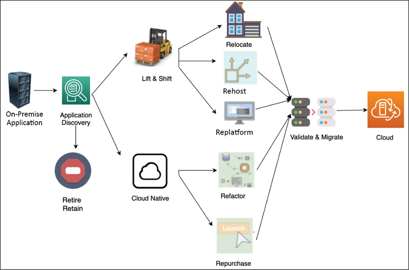
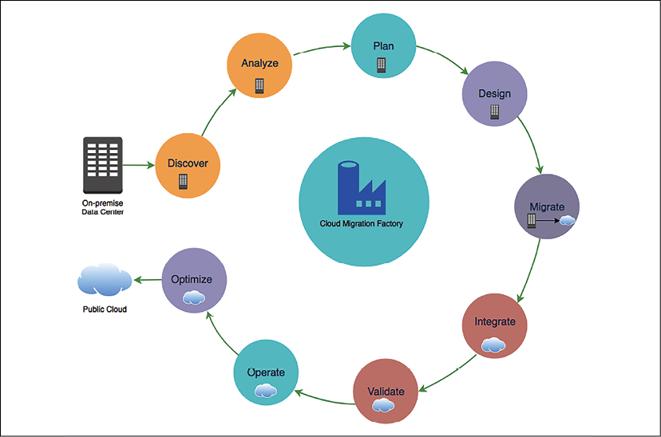
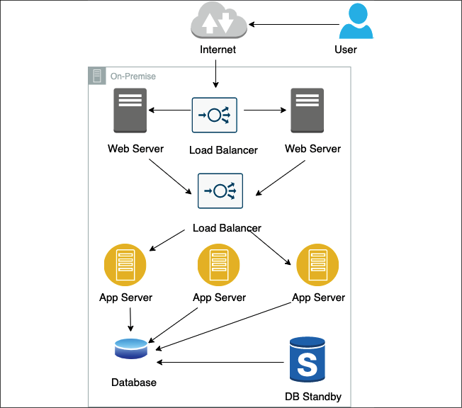
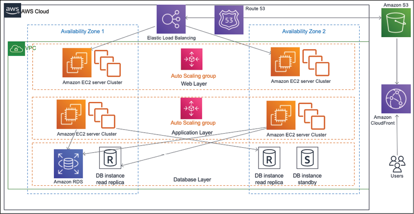
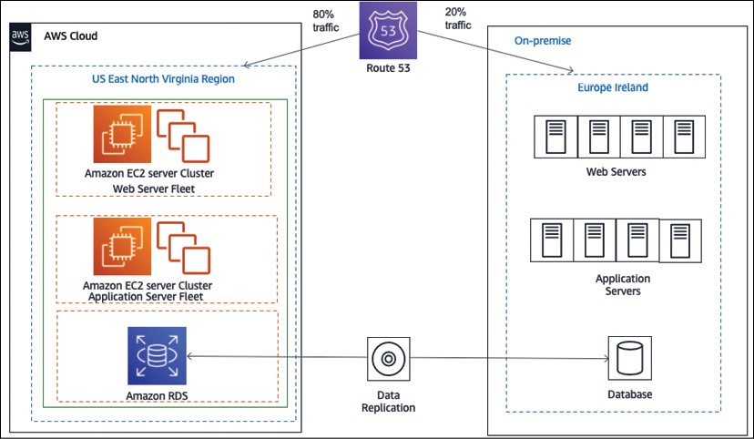
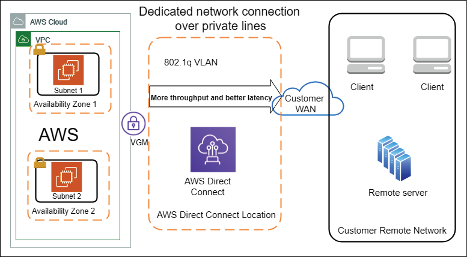
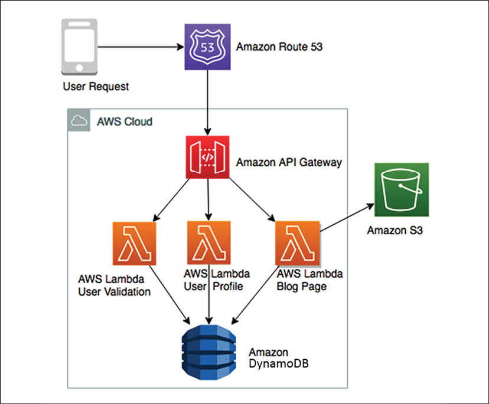

# 云迁移和混合云架构设计

当今的组织需要更加敏捷地响应客户需求，这需要能够在不影响预算的情况下快速扩展至数百万客户并根据需要缩减规模。组织需要不断获得新客户，在竞争激烈的环境中工作时取悦他们。云迁移可能是实现敏捷性和速度的答案。云支持频繁发布应用程序，并通过应用自动化和数据中心整合来降低成本。

到目前为止，你已经了解了解决方案架构、架构属性和架构原则的各个方面。现在每个人都在谈论云，组织正在寻求将他们的工作负载转移到云中以优化运营成本。 Amazon Web Services (**AWS**)、**Microsoft Azure** 和 Google Cloud Platform (**GCP**) 等公共云正在成为托管应用程序的主要目的地，因此了解迁移到云的主张和方法非常重要。在本章中，你将了解云的各个方面并培养云思维，这也有助于你更好地理解接下来的章节。

正如你在第 1 章"解决方案架构的含义"中了解到的，云计算是指通过 Web 按需交付 IT 资源，你在使用资源时付费。公共云可帮助你按需获取计算、存储、网络和数据库等技术，而不是购买和维护自己的数据中心。

借助云计算，云供应商在安全环境中管理和维护技术基础设施，组织通过网络访问这些资源以开发和运行他们的应用程序。 IT 资源的容量可以立即上升或下降，组织只需为他们使用的资源付费。

现在，云对于每个企业战略都变得至关重要。几乎每个组织都通过迁移到公共云来减少支出，除了节省成本之外，他们还将前期资本支出转化为运营支出。过去十年诞生的许多初创公司都是从云开始的，并在云基础设施的推动下实现了快速增长。企业上云，必须关注云迁移战略和混合云。

在本章中，你将通过涵盖以下主题了解云迁移和混合云的各种策略：

- 云原生架构的好处
- 创建云迁移策略
- 选择云战略
- 云迁移步骤
- 创建混合云架构
- 采用多云方法
- 设计云原生架构
- 流行的公共云选择

到本章结束时，你将了解云的优势并能够设计云原生架构。你将了解不同的云迁移策略和步骤。你还将了解混合云设计和流行的公共云提供商。

## 云原生架构的好处

近年来，技术日新月异，新公司在云世界中诞生，颠覆了老旧的组织。快速增长是可能的，因为当组织使用云时不涉及前期成本，并且与支付托管自己的服务器的前期成本相比，由于云的即用即付模型，试验风险更小。

云原生方法帮助组织中的员工培养创新思维并实现他们的想法，而无需等待基础架构的漫长周期。

有了云，客户无需提前计划过剩产能来应对他们的旺季，例如零售商的假日购物季；他们可以灵活地提供资源来立即满足需求。这显着有助于降低成本并改善客户体验。任何组织要想在竞争中脱颖而出，就必须快速创新地行动。

借助云，企业不仅能够在全球范围内快速获得其基础设施，而且还可以获得以前从未有过的各种技术。其中包括获得以下尖端技术：

- 大数据和分析
- 机器学习和人工智能
- 机器人学
- 物联网 (IoT)
- 区块链
- 量子计算

此外，为了实现可扩展性和弹性，以下是可以触发云迁移和混合云战略计划的一些原因：

- 数据中心需要技术更新
- 数据中心的租约即将结束
- 数据中心的存储和计算容量已用完
- 应用程序的现代化
- 利用尖端技术
- 需要优化 IT 资源以节省运营成本
- 灾难恢复规划和运营弹性
- 利用网站的内容分发网络
- 减少前期资本支出并消除维护成本
- 提高员工效率和生产力
- 提高业务敏捷性

每个组织都有不同的策略，在云采用方面，一种规模并不适合所有组织。常见的用例是将开发和测试环境置于云端，以增加开发人员的敏捷性，从而使他们能够更快地行动。随着使用云托管 Web 应用程序变得更加经济和直接，组织正在通过在云中托管其网站和数字资产来使用云进行数字化转型。

对于应用程序的可访问性，不仅要为 Web 浏览器构建应用程序，还要确保它可以通过智能手机和平板电脑访问。云正在帮助进行此类转换。数据处理和分析是企业利用云的另一个领域，因为通过云收集、存储、分析和共享数据成本更低、速度更快。

为云构建解决方案架构与为常规企业架构构建略有不同。在迁移到云时，你必须培养云思维并了解如何利用云的内置功能。对于云思维，你遵循现收现付模式。你需要确保正确优化工作负载并仅在需要时运行服务器。

你需要考虑如何通过在需要时为你的工作负载启动服务器并为始终需要运行的工作负载选择正确的策略来优化成本。在云中，解决方案架构师需要全面了解每个组件的性能、扩展性、高可用性、灾难恢复、容错、安全性和自动化。

其他优化领域是云原生监控和警报机制。你可能不需要将现有的第三方工具从本地部署到云端，因为你可以更好地利用本地云监控并摆脱昂贵的第三方许可软件。另外，现在，你可以在几分钟内拥有部署到世界任何地方的能力，所以不要把自己局限于一个特定的区域，利用全球部署模型来构建更好的高可用性和灾难恢复机制。

云为自动化提供了极好的交易；你几乎可以自动化一切。自动化不仅可以减少错误并加快上市时间；它还通过有效利用人力资源并将他们从执行繁琐和重复的任务中解放出来，从而节省了大量成本。云在共享责任模型上工作，云供应商负责保护物理基础设施。但是，应用程序及其数据的安全性完全由客户负责。因此，通过使用云原生工具进行监控、警报和自动化，锁定你的环境并密切关注安全性非常重要。

在本书中，你将了解解决方案架构的云视角，并深入了解云架构。在定义你的云战略之前，让我们了解一些你应该了解的流行公共云选择。

## 流行的公共云选择

由于现在云已成为常态，因此市场上有许多提供尖端技术平台的云提供商正在竞争以获得市场份额。

以下是主要的云提供商（在撰写本文时）：

- **AWS**：AWS 是历史最悠久、规模最大的云提供商之一。 AWS 采用即用即付模式，根据需要通过 Internet 提供 IT 资源，例如计算能力、存储、数据库和其他服务。 AWS 不仅提供 IaaS；它在 PaaS 和 SaaS 方面提供广泛的产品。 AWS 在机器学习、人工智能、区块链、物联网 (IoT) 领域提供多种尖端技术产品，以及一整套重要的数据功能。你几乎可以在 AWS 中托管任何工作负载，并结合服务来设计最佳解决方案。
- **Microsoft Azure**：也称为 Azure，与任何云提供商一样，它通过 Internet 向其客户提供计算、网络、存储和数据库等 IT 资源。与 AWS 一样，Azure 也在云中提供 IaaS、PaaS 和 SaaS 产品，其中包括计算、存储、数据管理、内容分发网络、容器、大数据、机器学习和物联网等一系列服务。此外，Microsoft 还通过 Microsoft Office、Microsoft Active Directory、Microsoft SharePoint、MS SQL Server 等将其流行的产品包装在云中。
- **GCP**：GCP 在计算、存储、网络和机器学习领域提供云产品。与 AWS 和 Azure 一样，它拥有一个全球数据中心网络，可用作基础设施即服务，供其客户通过互联网使用 IT 资源。在计算方面，GCP 为无服务器环境提供了 Google Cloud Functions，你可以将其与 AWS 中的 AWS Lambda 函数和 Azure 中的 Azure Functions 进行比较。同样，GCP 提供多种编程语言用于使用容器进行应用程序开发，以便你可以部署应用程序工作负载。

还有许多其他云供应商可用，例如阿里云、甲骨文云和 IBM Cloud，但主要市场被上述云供应商占领。使用哪个云提供商的选择取决于客户，这可能会受到他们正在寻找的功能的可用性或基于他们与提供商的现有关系的影响。有时，大型企业会选择多云战略来利用最好的供应商。在下一节中，你将了解云迁移的各种策略。

## 创建云迁移策略

正如我们在上一节中提到的，云迁移可能有多种原因，而这些原因在你的云之旅中起着至关重要的作用。你的云策略可帮助你确定迁移策略并确定应用程序的优先级。

除了云迁移的主要业务驱动因素之外，你可能还有更多与云迁移的数据中心、业务、应用程序、团队和工作负载相关的原因。

云采用不仅仅是选择平台、安全设计和操作，除了技术之外，你还需要考虑人员、流程和文化。要成功进行云迁移，你首先需要让领导者保持一致，并通过提高他们的技能来赢得团队的承诺。你需要定义整个组织的愿景，以确保云过渡成功。

通常，迁移项目采用多种策略并相应地使用不同的工具。迁移策略将影响迁移所需的时间以及应用程序在迁移过程中的分组方式。下图显示了将现有应用程序迁移到云端的一些常用策略：

图 5.1：云迁移策略

如上图所示，你可以将服务器或应用程序从源环境直接迁移到云端。迁移资源只需要最少的更改就可以在云中工作。要采用更云原生的方法，你可以重构你的应用程序以充分利用云原生特性，例如，将单体应用程序转换为微服务。

如果你的应用程序是遗留应用程序且无法移动，或者与云不兼容，你可能希望将其淘汰并替换为云原生 SaaS 产品或第三方解决方案。

一个组织可以采取多种迁移策略；例如，如果一个应用程序托管的操作系统生命周期结束，那么你就需要升级操作系统。你可以借此机会迁移到云端以获得更好的灵活性。在这种情况下，你很可能会选择 replatform 方法将你的代码重新编译到新版本的操作系统中并验证其所有功能。完成测试后，你可以将应用程序迁移到托管在云提供的基础架构中的操作系统。如果你想购买一个新的平台，比如用Salesforce提供的基于SaaS的解决方案替换旧的CRM解决方案，你可以选择退役回购策略。如果你想将应用程序从单体式服务重建为微服务式以增加灵活性，你可能会决定进行重构。

你的业务目标将推动你做出迁移应用程序的决定，并根据其优先级定义迁移策略。例如，当成本效率是主要驱动因素时，迁移策略通常涉及大规模迁移，重点放在提升和转移方法上。但是，如果主要目标是实现敏捷性和创新，那么云原生方法（例如重新架构和重构）在云迁移策略中起着关键作用。让我们在以下小节中了解有关每种策略的更多信息。

### 直接迁移

直接迁移是最快的迁移模式，因为你需要最少的工作来迁移你的应用程序。但是，它没有利用云原生功能。让我们看看最常见的迁移策略，即重新托管、重新平台化和重新定位，这些策略通常用于在需要对应用程序进行最少更改的情况下进行提升和转移。

#### 重新托管
Rehost 快速、可预测、可重复且经济，这使其成为迁移到云的首选方法。 Rehost 是最快的云迁移策略之一，其中服务器或应用程序被提升并从源本地环境转移到云中。在迁移过程中可以对资源进行最小的更改。

客户经常使用rehost将他们的应用程序快速迁移到云端，然后在资源运行在云端时专注于优化。这种技术使他们能够实现使用云的成本效益。

客户通常将重新托管技术用于以下目的：

- 临时开发测试环境
- 当服务器运行打包软件时，例如 SAP 和 Microsoft SharePoint
- 当应用程序没有活动路线图时

虽然rehost旨在应用于打包软件，帮助我们快速上云，但你可能需要对操作系统等底层应用平台进行升级。在这种情况下，你可以使用云迁移的重新平台方法。

#### 平台改造
当操作系统、服务器或数据库版本达到其使用寿命时，它可以触发云迁移项目，例如，将你的 Web 服务器的操作系统从 Microsoft Windows 2003 升级到 Microsoft Windows 2008/2012/2016 或升级你的 Oracle 数据库引擎，等等。 平台改造策略涉及将平台升级为云迁移项目的一部分，但不更改应用程序架构。作为迁移的一部分，你可以决定将操作系统或应用程序更新到更新版本。

使用平台改造迁移策略时，你可能需要在目标环境上重新安装你的应用程序，这会触发应用程序更改。这需要在重新平台化后对你的应用程序进行全面测试，以确保并验证其迁移后的运行效率。

以下常见原因保证了重新平台技术的使用：

- 将操作系统从 32 位更改为 64 位
- 更改数据库引擎
- 更新应用程序的最新版本
- 将操作系统从 Windows 2008 升级到 Windows 2012 或 2019
- 将 Oracle 数据库引擎从 Oracle 8 升级到 Oracle 19C/21C
- 获得云供应商提供的托管服务的好处，例如托管存储、数据库、应用程序部署和监控工具

平台改造可帮助你在迁移到云的同时提升应用程序的底层平台。如果你的应用程序部署在容器或 VMware 中，你可以简单地将其重新定位到云中。现在，让我们进一步了解迁移策略。

#### 迁移
你可以在本地数据中心使用容器或 VMware 设备部署你的应用程序。你可以使用称为改造的加速迁移策略将此类工作负载移动到云中。 Relocate 可帮助你在几天内迁移数百个应用程序。你可以轻松地将基于 VMware 和容器技术的应用程序快速迁移到云中，而无需付出太多努力和复杂性。

迁移策略不需要太多的前期开发人员投资或昂贵的测试计划，因为它提供了你期望从云中获得的敏捷性和自动化。你需要确定现有配置并使用 **VMotion** 或 **Docker** 将你的服务器迁移到云端。 VMotion 以实时迁移而闻名。它是一种 VMware 技术，可以使虚拟实例从一个物理主机服务器移动到另一个物理主机服务器，而不会中断服务。

客户通常出于以下原因使用重定位技术：

- 工作负载已部署在容器中
- 应用程序已部署在 VMware 设备中

AWS 上的 VMware Cloud (**VMC**) 不仅可以迁移应用程序，还可以将数以千计的虚拟机从单个应用程序迁移到整个数据中心。在将应用程序迁移到云端时，你可能希望借此机会重建和重新架构整个应用程序，使其更加云原生。云原生方法允许你使用云的全部功能。让我们进一步了解云原生方法。

### 云原生方法

当你的团队决定迁移到云原生时，在短期内，这似乎是更多的前期工作和更慢的云迁移。这有点昂贵，但从长远来看，当你开始与敏捷团队一起使用所有云优势进行创新时，它会带来长期回报。

随着时间的推移，你将看到使用云原生方法的成本急剧下降，因为你可以以合适的价格优化工作负载，同时通过即用即付模型保持性能不变。云原生包括通过将应用程序重新构建为微服务或选择纯无服务器方法来容器化你的应用程序。

出于你的业务需求，你可能希望将整个产品替换为现成的 SaaS 产品，例如，将本地销售和 HR 解决方案替换为 Salesforce 和 Workday SaaS 产品。下面我们来详细了解一下云原生迁移方式的重构和回购方式。

#### 重构
重构方法涉及在将应用程序迁移到云之前重新构建和重写应用程序，使其成为云原生应用程序。在重构中，你将应用程序更改为更加模块化的设计，例如从整体式到微服务。云原生应用程序是经过设计、架构和构建以在云环境中高效运行的应用程序。这些云固有功能的优势包括可扩展性、安全性、敏捷性和成本效益。重构为微服务可帮助组织创建可以完全拥有所有权的小型独立团队，从而提高创新速度。

重构需要更多的时间和资源来重新编码应用程序并在迁移之前重新构建它。这种方法通常由具有丰富的云经验或高技能劳动力的组织使用。重构的另一种选择是将你的应用程序迁移到云端，然后对其进行优化。你可以使用云原生无服务器技术来减少模块化设计带来的管理开销。

重构的常见示例包括：

- 改造平台，例如 AIX 到 UNIX
- 数据库从传统数据库过渡到云数据库
- 替换中间件产品
- 将应用程序从单体架构重构为微服务架构
- 重构应用程序架构，例如容器化或使其无服务器
- 重新编码应用程序组件
- 数据仓库现代化，将组织与客户联系起来

有时，你可能会发现需要花费大量精力来重构应用程序。作为架构师，你应该评估购买 SaaS 产品是否有助于你获得更好的投资回报 (**ROI**)。让我们更详细地探讨回购策略。

#### 回购
当你的 IT 资源和项目迁移到云端时，你可能需要服务器或应用程序，这需要你购买兼容云的许可证或版本。例如，当你在云中运行应用程序时，应用程序的当前本地许可证可能无效。

有多种方法可以解决此类许可场景。你可以购买新的许可证并继续在云中使用你的应用程序，或者你可以删除现有应用程序并用云中的另一个应用程序替换它。

此替换可能是同一应用程序的 SaaS 产品。

回购的常见示例包括：

- 将应用程序替换为 SaaS，例如 Salesforce CRM 或 Workday HR
- 购买云兼容许可证

云可能无法解决你所有的问题，有时，你会发现遗留应用程序可能无法从云迁移中受益，或者发现很少使用的应用程序可以停用。让我们更详细地了解保留或退休策略。

### 保留或退休

当你计划云迁移时，可能没有必要迁移所有应用程序。由于技术限制，你可能需要保留一些应用程序；例如，可能有遗留应用程序与无法迁移的本地服务器相结合。另一方面，你可能希望淘汰一些应用程序并使用云原生功能，例如第三方应用程序监控和警报系统。让我们详细了解保留或退休策略。

#### 保留
你可能会在本地环境中遇到一些应用程序，这些应用程序对你的业务至关重要，但由于技术原因而不适合迁移，例如云平台不支持操作系统/应用程序。在这种情况下，你的应用程序无法迁移到云端，但你可以继续在本地环境中运行它。

对于此类服务器和应用程序，你可能只需要执行初始分析以确定它们是否适合云迁移。但是，服务器或应用程序可能仍然与迁移的应用程序有依赖关系。因此，你可能必须保持这些本地服务器与你的云环境的连接。你将在本章的创建混合云架构部分了解有关本地到云连接的更多信息。

保留的一些典型工作负载示例如下：

- 客户看不到迁移到云的好处的遗留应用程序
- 操作系统或应用支持不在云端，如AS400和大型机应用

你可能希望将复杂的遗留系统保留为内部部署并确定它们的优先级，以便以后可以移动它们；然而，在发现过程中，组织通常会发现不再使用但仍闲置并占用基础设施空间的应用程序。你可以选择停用此类应用程序。让我们进一步探讨退休策略。

#### 退休
在迁移到云端时，你可能会发现以下内容：

- 很少使用的应用程序
- 消耗过多服务器资源的应用程序
- 由于云不兼容可能不需要的应用程序

在这种情况下，你可能希望淘汰现有的工作负载并采用一种更加云原生的新方法。

退休策略可以应用于即将停用的主机和应用程序。这也可以应用于不必要和冗余的托管应用程序。根据你的业务需求，此类应用程序可以在本地停用，甚至无需迁移到云端。通常适合停用的主机和应用程序包括：

- 用于灾难恢复目的的本地服务器和存储
- 服务器整合以解决冗余问题
- 并购导致资源重复
- 典型高可用性设置中的备用主机
- 第三方许可工具，例如工作负载监控和自动化，可作为云中的内置功能使用

大多数迁移项目采用多种策略，并且每种策略都有不同的工具可用。迁移策略将影响迁移所需的时间以及应用程序在迁移过程中的分组方式。云迁移是检查你的整体库存并摆脱在开发人员办公桌下运行且下落不明的幽灵服务器的好时机。在本节中，你了解了各种云策略。让我们在下一节中快速浏览一下它们的比较。

## 选择云策略

根据你的业务驱动因素为云采用选择正确的迁移策略至关重要。 最好考虑各种限制，例如财务、资源、时间和技能。 你可以在下表中比较上一节中涵盖的不同策略所需的工作量：

| 迁移策略 |                             描述                             |         时间和成本          |          优化机会           |
| :------: | :----------------------------------------------------------: | :-------------------------: | :-------------------------: |
|   重构   |      将应用程序重新架构为更加模块化，例如从单体到微服务      |  |  |
| 平台改造 | 在不改变核心架构的情况下将应用程序迁移到升级平台，例如传统数据库到云端或更高版本的操作系统 |  |  |
|   回购   |          通过购买基于云的解决方案来替换你当前的环境          |  |  |
| 重新托管 |      无需更改架构即可快速将你的应用程序提升并转移到云端      |  |  |
|   保留   |                  至少现在将应用程序留在本地                  |  |             NA              |
|   搬迁   |     无需更改即可快速将应用迁移到云端，例如基于容器的应用     |  |             NA              |
|   退休   |               识别不再有用的资产并完全删除它们               |             NA              |             NA              |

为降低云迁移风险，始终建议在将应用程序迁移到云时采用分阶段方法。首先，优先考虑业务功能，然后优化应用程序，以实现成本节约、性能提升和资源生产力方面的差异。尝试先迁移，在后续阶段，你可以进行优化。例如，如果你正在迁移一个使用 MS SQL 数据库的应用程序并将其替换为 Amazon Aurora 等云原生数据库，那么最好的方法是在第一阶段迁移应用程序，然后在监控风险和风险的同时迁移数据库。第二阶段的应用稳定性。你可以选择使用 AWS Lambda 和 Amazon DynamoDB 等云原生无服务器技术堆栈在后续步骤中优化你的应用程序。

应该定义迁移策略，以便可以通过允许团队独立工作来快速执行。云迁移策略可以影响其他组织因素，例如在组织内构建工程功能而不是外包。你可以通过自动化整个代码测试和部署管道在组织中构建 DevOps 文化。

通常，客户会在运行应用程序发现以准备迁移时看到优化工作负载和加强安全性的通常看不见的优势。云迁移涉及多个阶段。在下一节中，你将了解云迁移的步骤。

## 云迁移步骤

在上一节中，你了解了不同的迁移策略并对你的应用程序进行了分组，以便应用适当的迁移技术。这些策略也称为 7R（保留、退休、搬迁、重新托管、重新购买、重新构建平台和重构），其中一些或全部可能成为你的云之旅的一部分。

由于你可能需要在云中执行和管理多个应用程序，因此最好建立一个云卓越中心 (**CoE**) 并通过云迁移工厂将此流程标准化。云 CoE 包括来自整个组织的各个 IT 和业务团队的经验丰富的人员，他们充当专门的云团队，专注于加速组织中云专业知识的构建。云迁移工厂定义了迁移流程和工具，以及需要执行的步骤，如下图所示：

图 5.2：云迁移步骤

如上图所示，云迁移步骤包括以下内容：

- **发现**：发现云迁移组合和本地工作负载
- **分析**：分析发现的数据和工作负载
- **计划**：计划迁移到云并定义迁移策略
- **设计**：根据迁移策略设计应用程序
- **迁移**：执行迁移策略
- **集成**：与依赖项集成
- **验证**：迁移后验证功能
- **运营**：计划在云端运营
- **优化**：优化你的云工作负载

云迁移项目的初始步骤之一是评估迁移应用程序并确定其优先级。为此，你需要获得环境中 IT 资产的完整清单，以确定哪些服务器、应用程序和业务部门适合迁移到云端，确定迁移计划的优先级，并确定这些应用程序的迁移策略。让我们深入了解每个步骤并了解更多信息。

### 发现你的工作量

在迁移项目的发现阶段，你会发现并捕获有关云迁移产品组合的详细数据，例如迁移项目的范围。你确定产品组合中的服务器和应用程序，以及它们的相互依赖性和当前基准性能指标。除此之外，工作负载发现还包括了解现有存储，例如数据库和文件系统、网络配置、安全性和合规性需求、应用程序发布频率、DevOps 模型、升级路径、操作系统维护和修补、许可要求，以及作为其他相关资产。

然后，你分析收集到的信息以确定应用程序连接性和容量要求，这可以指导你设计和构建目标云环境并确定成本。要考虑所有因素，你需要与其他业务部门（从 IT 到营销和项目管理）进行跨职能讨论，这有助于调整变更以支持云迁移流程。

详细的发现还可以帮助识别在迁移到云之前可能需要缓解的应用程序当前状态中的任何问题。在分析发现数据时，你还将为你的应用程序确定合适的迁移方法。

组合发现是识别云迁移项目中涉及的所有 IT 资产的过程，包括服务器和应用程序、它们的依赖关系和性能指标。

你还需要收集有关资源的业务详细信息，例如资源的净现值 (NPV)、应用程序的更新周期、应用程序的路线图以及服务器或应用程序的业务关键性。这些详细信息将帮助你确定迁移策略并制定迁移计划。在大多数组织中，这些详细信息跨多个业务部门和团队进行维护。所以，在发现的过程中，你可能要和业务、开发、数据中心、网络、财务等各个团队打交道。

重要的是要了解你的发现环境将取决于多种因素：

- 什么已经迁移到云端？
- 有哪些应用程序依赖性，以及资源和资产？
- 云迁移的业务驱动因素是什么？
- 整个迁移项目的预计持续时间是多少？
- 迁移过程将分几个阶段进行？

迁移项目的最大挑战之一是确定应用程序之间的相互依赖关系，特别是因为它们与输入/输出 (I/O) 操作和通信有关。随着组织因合并、收购和增长而扩张，云迁移变得更具挑战性。组织通常没有以下方面的完整信息：

- 盘点服务器数量
- 服务器规格，例如操作系统、RAM、CPU 和磁盘的类型和版本
- 服务器利用率和性能指标
- 服务器依赖
- 整体网络细节

执行彻底的投资组合发现有助于回答以下问题：

- 哪些应用程序、业务部门和数据中心适合迁移？
- 应用上云的合适程度如何？
- 将应用程序迁移到云端有哪些已知或未知的风险？
- 应如何确定应用程序迁移的优先级？
- 该应用程序依赖于哪些其他 IT 资产？
- 应用程序的最佳迁移策略是什么？
- 由于应用程序的依赖性和风险，让应用程序停机是否比执行实时迁移更好？

市场上有多种工具可以帮助自动化发现过程并以各种格式提供更详细的信息。这些工具可以根据各种特征进行分类，例如部署类型、操作、支持以及发现和报告的数据类型。

大多数可用的解决方案可以大致分为两类：

- 基于代理的解决方案：他们需要在服务器上安装软件客户端以收集必要的详细信息。
- 无代理解决方案：他们无需任何额外安装即可捕获此信息。

一些解决方案执行端口扫描以探测服务器或主机的开放端口，而其他解决方案执行数据包扫描，这通常涉及捕获和分析网络数据包以解码信息。这些工具还根据所发现数据的粒度、存储类型和报告选项而有所不同。例如，一些工具可以提供超越网络的更高层次的智能堆栈，还可以确定正在运行的应用程序类型。

发现过程的复杂性取决于组织的工作量以及它是否已经拥有维护良好的库存。发现过程通常至少运行几周，以收集有关你的环境的更全面的信息。一旦发现所有必要的信息，就需要对其进行分析。让我们更详细地看一下分析步骤。

### 分析信息

要识别服务器和应用程序依赖性，你需要分析主机上的网络连接数据、端口连接、系统和进程信息。根据你的工具，你可以可视化来自服务器的所有联系人以识别其依赖关系，或者你可以运行查询以列出所有运行特定进程、使用特定端口或与特定主机通信的服务器。

要对服务器和应用程序进行分组以进行迁移计划，你需要确定主机配置中的模式。通常，一些前缀嵌入在服务器主机名中以表示它们与特定工作负载、业务部门、应用程序或要求的关联。某些环境还可能使用标签和其他元数据将此类详细信息与主机相关联。

要调整目标环境的规模，你可以分析服务器和应用程序的性能指标：

如果服务器配置过多，你可以修改合适大小的映射信息。你还可以通过利用服务器/应用程序的利用率数据而不是服务器规格来优化此过程。
如果服务器配置不足，你可以为服务器分配更高的优先级以迁移到云。
根据环境的不同，在发现过程中捕获的数据类型可能会有所不同。为迁移规划分析的数据用于确定目标网络详细信息，例如防火墙配置、工作负载分布和应用程序迁移的阶段。

你可以将这种洞察力与你的资源可用性和业务需求相结合，以确定你的云迁移工作负载的优先级。这种洞察力可以帮助你确定要包含在每个云迁移冲刺中的服务器数量。

基于对你的云迁移组合的发现和分析，你可以为你的应用程序确定合适的云迁移策略。例如，不太复杂且在受支持的操作系统上运行的服务器和应用程序可能适合直接迁移策略。在不受支持的操作系统上运行的服务器或应用程序可能需要进一步分析以确定适当的策略。

在云迁移项目中，发现、分析和规划紧密集成。你对云迁移产品组合进行全面发现并分析数据以制定迁移计划。在分析阶段结束时，根据你的分析和从企业所有者那里收集到的详细信息，你应该能够对云迁移组合中的每个服务器/应用程序执行以下操作：

- 根据你组织的云采用策略，为服务器/应用程序选择迁移策略。你可能仅限于保留、退休、搬迁、回购、重新托管、重新平台和重构中的特定选择。
- 分配将资源迁移到云的优先级。最终，属于云迁移组合的所有资源都可能迁移到云中，但此优先级将决定迁移的紧迫性。更高优先级的资源可能会在迁移计划中移动得更早。
- 记录将资源迁移到云的业务驱动因素，这将推动将资源迁移到云的需求和优先级。

规划利用在发现和分析阶段收集的信息来创建迁移浪潮。 Waves 是资源的逻辑分组，可以在云迁移期间按顺序部署到生产和测试/开发环境中。让我们更详细地了解一下迁移计划。

### 创建迁移计划

迁移项目的下一阶段是规划云迁移。你将使用在投资组合发现阶段收集的信息来创建高效的迁移计划。在迁移项目的这个阶段结束时，你应该能够创建可以迁移到云的应用程序的有序积压。

迁移规划阶段的主要目标包括：

- 选择迁移策略
- 定义迁移的成功标准
- 确定云中资源的正确大小
- 确定应用程序迁移到云的优先级
- 识别迁移模式
- 创建详细的迁移计划、清单和时间表
- 创建迁移冲刺团队
- 确定迁移工具

在为迁移规划阶段做准备时，你必须详细发现属于你的云迁移组合的所有 IT 资产。云中的目标目的地环境也在规划阶段之前进行架构。迁移规划包括确定云帐户结构和为你的应用程序创建网络结构。了解与目标云环境的混合连接也很重要。混合连接将帮助你规划可能依赖于仍在本地运行的资源的应用程序。

应用程序迁移的顺序可以通过三个高级步骤来确定：

1. 跨与潜在迁移相关的多个业务和技术维度评估每个应用程序，以准确量化环境。
2. 使用锁定、紧密耦合和松散耦合等条件识别每个应用程序的依赖关系，以识别任何基于依赖关系的排序要求。
3. 确定组织所需的优先级排序策略，以确定各个维度的适当相对权重。

应用程序或服务器迁移的启动取决于两个因素：

1. 贵组织的优先级策略和应用程序优先级。你的组织可能对几个维度有不同的重视，例如最大化 ROI、最小化风险、易于迁移或其他自定义维度。
2. 通过投资组合发现和分析阶段获得的洞察力可以帮助你识别与其战略相匹配的应用程序模式。

例如，如果组织战略是将风险降至最低，那么业务关键性在识别应用程序时将具有更大的权重。如果易于迁移是策略，则可以使用重新托管迁移的应用程序将具有更高的优先级，因为与其他策略相比，重新托管是一个更直接的过程。规划的结果应该是可用于安排云迁移的应用程序的有序列表。

以下是迁移规划的注意事项：

1. 在迁移之前为你的应用程序收集基线性能指标。性能指标将帮助你定量地设计或优化云中的应用程序架构。你可能已经在发现阶段捕获了大部分这些性能细节。
2. 为你的应用程序创建测试计划和用户验收计划。这些计划将有助于确定迁移过程的结果（成功或失败）。
3. 你还需要制定切换策略和回滚计划，以根据迁移结果定义应用程序继续运行的方式和位置。
4. 运营和管理计划将有助于确定迁移期间和迁移后的角色所有权。你可以利用 Responsible、Accountable、Consult、Inform (**RACI**) 矩阵电子表格来为你的应用程序定义跨越整个云迁移旅程的这些角色和职责。
5. 确定应用程序团队中可以在升级情况下提供及时支持的联系点。团队之间的密切协作将确保按照计划（冲刺）成功完成迁移。

如果你的组织已经为你现有的本地环境记录了其中的一些流程，例如，变更控制流程、测试计划以及运营和管理的运行手册，你可能能够利用它们。

你需要在迁移之前、期间和之后比较性能和成本，这可能表明他们目前没有捕获足够的正确关键性能指标 (KPI) 来实现这种洞察力。客户需要确定并开始实现有用的 KPI，以便在迁移期间和之后有一个基准进行比较。迁移中的 KPI 方法有双重目标。首先，它需要定义你现有应用程序的功能，然后将它们与云基础架构进行比较。

当新产品添加到目录或推出新服务时，它会增加你公司的收入，这是对公司 KPI 的计数。通常，IT 指标包括产品质量和为应用程序报告的错误数量。为修复关键错误、系统停机时间和性能指标而定义的服务级别协议 (SLA) 包括系统资源利用率值，例如内存利用率、CPU 利用率、磁盘利用率和网络利用率。

你可以使用 Scrum 等持续交付方法有效地将应用程序迁移到云端。在 Scrum 方法的帮助下，你可以创建多个冲刺并根据优先级将你的应用程序添加到冲刺待办事项列表中。有时你可以组合许多应用程序并创建遵循类似迁移策略并且可能彼此相关的 wave。通常，你会在冲刺中保持恒定的持续时间，并根据冲刺团队规模和应用程序的复杂性等因素改变应用程序。

如果你的小团队对需要迁移的应用程序有深入的了解，那么你可以使用每周冲刺，其中每个冲刺包括发现/分析、计划/设计和迁移阶段，最后切换冲刺的最后一天。然而，随着团队在 sprint 中迭代，每个 sprint 的工作量可能会增加，因为团队现在已经在迁移过程中获得了经验，并且可以结合以前 sprint 的反馈，通过不断的学习和适应使当前的 sprint 更加高效。

如果你正在迁移一个复杂的应用程序，你也可以将整个星期用于计划/设计阶段，并在单独的冲刺中执行其他阶段。你在冲刺中执行的任务及其可交付成果可能会有所不同，具体取决于复杂性和团队规模等因素。关键是从冲刺中获得价值。

你可以创建多个团队来协助迁移过程，具体取决于各种因素，例如你的产品积压工作、迁移策略和组织结构。一些客户创建了专注于每个迁移策略的组，例如重新托管团队、重构团队和重新平台团队。你还可以拥有一个专门优化云中应用程序架构的团队。多团队策略是有大量应用程序要迁移到云端的组织的首选模型。

团队可以分为以下几个部分：

- 首先，团队可以验证基本组件以确保你的环境（开发、测试或生产）正常运行、得到充分维护和监控。
- 集成团队将确定应用程序配置并找到依赖项，这将有助于减少另一个团队造成的浪费。
- 直接迁移冲刺团队迁移不需要重构或重新平台化的大型应用程序。团队将使用自动化工具在每次冲刺后交付少量增量价值。
- replatform migration sprint 团队专注于应用程序架构变更，以便将应用程序迁移到云端，例如，使微服务的应用程序设计现代化或将操作系统更新到最新版本。
- 重构迁移冲刺团队负责管理生产、测试、开发等各种迁移环境。他们通过密切监控确保所有环境都可扩展并按要求运行。
- 创新迁移冲刺团队与基础和过渡团队等团队协作，开发可供其他团队使用的一揽子解决方案。

建议你在规划和持续构建产品待办列表的同时运行试点迁移项目，以便可以将这些调整和吸取的教训纳入新计划。最好在试验阶段首先针对非生产迁移浪潮。试点项目和冲刺的成功结果也可用于帮助确保利益相关者支持云转型计划。

### 设计应用程序

在设计阶段，你的重点应该是成功迁移应用程序并确保你的应用程序设计满足所需的成功标准并且在迁移到云后是最新的。例如，如果你在本地应用程序服务器中维护用户会话（以便它可以水平扩展），请确保在迁移后在云中实施类似的架构，这定义了成功标准。

必须了解此阶段的主要目标是确保你的应用程序的设计符合迁移成功标准。你需要确定增强应用程序的机会，并且可以在优化阶段实现这些机会。

对于迁移，首先，你需要全面了解组织在本地和云中的基础架构，其中包括以下内容：

- 用户帐号
- 网络配置
- 网络连接
- 安全
- 治理
- 监控

了解这些组件将帮助你为你的应用程序创建和维护新的架构。例如，如果你的应用程序处理个人身份信息 (**PII**) 等敏感信息并具有控制访问权限，这意味着你的架构需要特定的网络设置来满足合规性需求。

在设计阶段，你将确定架构差距并根据你的应用程序要求增强你的架构。当你有多个账户时，每个账户可能有某种程度的关系或依赖；例如，你可以拥有一个安全帐户来确保你的所有资源都符合公司范围的安全准则。

在考虑应用程序的网络设计时，你需要考虑以下因素：

- 进入应用程序边界的网络数据包流
- 外部和内部流量路由
- 用于网络保护的防火墙规则
- 与 Internet 和其他内部应用程序隔离的应用程序
- 整体网络合规性和治理
- 网络日志和流量审计
- 根据对数据和用户的暴露程度，分离应用程序风险级别
- DDoS 攻击保护和预防
- 生产和非生产环境的网络要求
- 基于SaaS的多租户应用访问需求
- 组织中业务单元级别的网络边界
- 跨业务部门的共享服务模型的计费和实施

你可以考虑使用本地系统的混合连接选项，具体取决于你的连接需求。要在云中构建和维护安全、可靠、高性能且成本优化的架构，你需要应用最佳实践。在迁移到云之前，根据云最佳实践检查你的云基础架构。

第 4 章，解决方案架构设计原则，重点介绍在将应用程序迁移到云时可以考虑的常见架构设计模式。在此需要强调的是，迁移过程中设计阶段的主要目标是设计你的应用程序架构，使其满足规划阶段确定的迁移成功标准。你的应用程序可以在迁移项目的优化阶段进一步优化。

在迁移到云的过程中，你可以设计你的应用程序架构，使其受益于全球云基础架构并增加与最终用户的距离、降低风险、提高安全性并解决数据驻留限制。预计会随着时间的推移而增长的系统应该构建在可扩展的架构之上，该架构可以支持用户、流量或数据的增长而不会降低性能。

对于需要维护某些状态信息的应用程序，你可以使架构的特定组件无状态。如果体系结构中有任何层需要有状态，你可以利用会话亲和性等技术仍然能够扩展此类组件。为处理大量数据的应用程序利用分布式处理方法。

另一种降低运行应用程序操作复杂性的方法是使用无服务器架构。这些架构还可以降低成本，因为你既不需要为未充分利用的服务器付费，也不需要配置冗余基础设施来实现高可用性。你将在第 6 章"解决方案架构设计模式"中了解有关无服务器架构的更多信息。

下图显示了从本地到 AWS 云的迁移设计，从本地设计开始：

图 5.3：本地架构映射

现在我们过渡到 AWS 云设计：

图 5.4：本地到 AWS 云架构映射

在上图中，作为云迁移策略的一部分，决定重新托管 Web 服务器并引入自动缩放以提供有助于满足需求高峰的弹性。还添加了弹性负载平衡器以将传入流量分配到 Web 服务器实例。应用服务器重构迁移，数据库层平台从传统数据库变为云原生Amazon RDS。整个架构分布在多个可用区以提供高可用性，数据库复制到第二个可用区的备用实例。

作为设计阶段的输出，你应该为云中应用程序的架构创建详细的设计文档。设计文档应包括应用程序必须迁移到的用户帐户、网络配置以及需要访问此应用程序所持有数据的用户、组和应用程序列表等详细信息。设计文档应清楚地阐明应用程序托管详细信息和特定于应用程序的备份、许可、监视、安全性、合规性、修补和维护要求。确保为每个应用程序创建一个设计文档。你将在迁移验证阶段需要它来执行基本的云功能检查和应用程序功能检查。

### 执行应用程序迁移到云

迁移执行步骤使你的计划得以实现。在执行阶段，你需要定义一组步骤和配置，因为你将在开发/测试和生产浪潮中重复它们。在执行迁移之前，确保你有一个迁移计划，并且你已经确定了冲刺团队和迁移波次和时间表，已经创建了一个优先级的积压工作，并且已经通知所有应用程序利益相关者关于迁移时间表、时间表以及他们的角色和职责.

你还必须确保已使用基础架构和核心服务设置云中的目标环境。你可能有一些特定于应用程序的前置步骤，例如在迁移之前执行备份或同步、关闭服务器或从服务器卸载磁盘和设备。确保你设置了必要的组件，例如网络和防火墙规则、身份验证和授权以及帐户。都需要适当配置。你需要在基础架构上测试你的应用程序，以确保它们可以访问所需的服务器、负载平衡器、数据库、身份验证服务器等。你需要特别注意应用程序日志记录和监控以衡量性能比较。

确保在迁移过程中你与云环境的网络连接良好。考虑到其他因素（例如带宽和网络连接），对需要迁移的数据量进行良好估计还可以帮助你正确估计将数据迁移到云所需的时间。你还需要了解可用于执行迁移的工具。考虑到市场上可用的设备数量，你可能必须根据你的要求和其他限制条件缩小选择标准。

如你所知，重新托管通常是将应用程序迁移到云的最快方式。当应用程序在云中运行时，你可以进一步优化它以利用云必须提供的所有优势。通过应用直接迁移方法将你的应用程序快速迁移到云中，你可以更快地开始实现成本和敏捷性优势。

根据迁移策略，你通常会迁移整个服务器，包括应用程序和运行该应用程序的基础架构，或者仅迁移属于某个应用程序的数据。让我们看看如何迁移数据和服务器。

#### 数据迁移
云数据迁移是指将现有数据移动到新的云存储位置的过程。大多数应用程序在进入云端的整个过程中都需要数据存储。存储迁移通常采用以下两种方法之一，但组织可能会同时执行这两种方法：

1. 一个简单的提升和转移动作。在云中启动新应用程序之前，这可能是必需的。
2. 一种偏重于云的混合模型，这导致新架构的云原生项目具有一些遗留的本地数据。随着时间的推移，遗留数据存储可能会转向云端。

但是，你迁移数据的方法会有所不同。这取决于数据量、网络和带宽限制、数据分类层（例如备份数据、关键任务数据、数据仓库或存档数据）以及你可以为迁移分配的时间量等因素过程。

如果你在带宽和数据量不切实际的情况下拥有大量数据存档或数据湖，你可能希望将数据从其当前位置直接提升并转移到云提供商的数据中心。你可以通过使用专用网络连接来加速网络传输或通过硬盘驱动器物理传输数据来实现这一点。

如果你的数据存储可以随着时间的推移逐渐迁移，或者当新数据从许多非云来源聚合时，请考虑为云存储服务提供友好界面的方法。这些迁移服务可以利用或补充现有安装，例如备份和恢复软件或存储区域网络 (**SAN**)。

对于小型数据库，一步迁移是最好的选择，这需要你根据工作负载的复杂程度将应用程序关闭几个小时到几天不等。在停机期间，数据库中的所有信息都将被提取并迁移到云端的目标数据库。迁移数据库后，需要使用源数据库验证它是否没有数据丢失。之后，就可以完成最后的割接。

在另一种情况下，如果系统需要最少的停机时间，则两步迁移过程更常用于任何规模的数据库：

- 第一步，从源数据库中提取信息。
- 第二步，将在数据库仍在运行时迁移数据。你可以配置变更数据捕获 (CDC) 以确保迁移所有数据并且应用程序在迁移期间处于工作状态。

> 在整个过程中，没有停机。迁移任务完成后，你可以根据需要执行与外部应用程序连接或任何其他标准的功能和性能测试。

在此期间，由于源数据库仍在运行，因此需要在最终切换之前传播或复制更改。此时，你可以为数据库安排停机时间（通常为几个小时），并同步源数据库和目标数据库。在将所有更改数据传输到目标数据库后，你应该执行数据验证以确保成功迁移，最后将应用程序流量路由到新的云数据库。

你可能拥有不能有任何停机时间的关键任务数据库。执行此类零停机迁移需要详细的规划和适当的数据复制工具。对于此类场景，你将需要使用连续数据复制工具。此处需要注意的是，在同步复制的情况下，源数据库延迟可能会受到影响，因为它会等待数据被复制到任何地方，然后再在复制发生时响应应用程序。

如果你的数据库停机时间只有几分钟，你可以使用异步复制。通过零停机迁移，你可以更灵活地决定何时执行切换，因为源数据库和目标数据库始终保持同步。

#### 服务器迁移
你可以使用多种方法将服务器迁移到云：

- 主机或操作系统克隆技术涉及在源系统上安装一个代理，该代理将克隆系统的操作系统映像。快照在源系统上创建，然后发送到目标系统。这种类型的克隆用于一次性迁移。使用 OS Copy 方法，所有操作系统文件都从源计算机复制并托管在云实例上。为了使操作系统复制方法有效，执行迁移的人员和/或工具必须了解底层操作系统环境。
- 灾难恢复复制技术在源系统上部署一个代理，用于将数据复制到目标。但是，数据是在文件系统或块级别复制的。一些解决方案持续将数据复制到目标卷，提供连续数据复制解决方案。使用磁盘复制方法，磁盘卷被完整复制。一旦磁盘卷被捕获，它就可以作为卷加载到云中，然后可以附加到云实例。
- 对于虚拟机，你可以使用无代理技术将 VM 导出/导入到云中。使用 VM Copy 方法，复制本地虚拟机映像。如果本地服务器作为虚拟机运行，例如 VMware 或 OpenStack，那么你可以复制 VM 映像并将其作为机器映像导入到云中。这种技术的一个主要好处是你可以拥有可以反复启动的服务器备份映像。
- 使用用户数据复制方法，仅复制应用程序的用户数据。从原始服务器导出数据后，你可以选择三种迁移策略之一——重新购买、重新构建平台或重构。用户数据复制方法仅适用于了解应用程序内部结构的人员。但是，因为它只提取用户数据，所以用户数据复制方法是一种与操作系统无关的技术。
- 你可以容器化你的应用程序，然后将其重新部署到云中。使用容器化方法，复制应用程序二进制文件和用户数据。一旦复制了应用程序二进制文件和用户数据，它就可以在托管在云上的容器运行时上运行。因为底层平台不同，所以这是一个replatform迁移策略的例子。

市场上有多种迁移工具可以帮助你将数据和/或服务器迁移到云端。每个主要的公共云都提供自己的迁移工具；但是，你也可以使用其他流行的云迁移工具，例如 CloudEndure、NetApp、Dynatrace、Carbonite、Microfocus 等。有些工具采用容灾策略进行迁移，有些容灾工具还支持持续复制，方便热迁移。有一些专门从事叉车你的服务器、跨平台执行数据库迁移或数据库架构转换。该工具必须能够支持你熟悉的业务流程，并且你必须有操作人员来管理它。

### 集成、验证和切换

迁移、集成和验证齐头并进，因为你希望在与云中的应用程序进行各种集成的同时进行持续验证。该团队首先执行必要的云功能检查，以确保应用程序以正确的网络配置（在所需的地理位置）和一些指定的流量运行。基本云功能检查完成后，实例可以根据需要启动或停止。你需要验证服务器配置（如 RAM、CPU 和硬盘）是否与预期相同。

执行这些检查需要了解应用程序及其功能。完成初步检查后，你就可以对应用程序执行集成测试。

这些集成测试包括检查与外部依赖项和应用程序的集成；例如，确保应用程序可以连接到 Active Directory、客户关系管理 (**CRM**)、补丁或配置管理服务器以及共享服务。当集成验证成功时，应用程序就可以进行切换了。

在集成阶段，你集成应用程序并将其迁移到具有外部依赖项的云中以验证其功能。例如，你的应用程序可能必须与应用程序外部的 Active Directory 服务器、配置管理服务器或共享服务资源进行通信。你的应用程序可能还需要与属于你的客户或供应商的外部应用程序集成，例如供应商在下采购订单后从你的 API 接收提要。

集成过程完成后，你需要通过执行单元测试、冒烟测试和用户验收测试 (**UAT**) 来验证集成。这些测试的结果可帮助你获得应用程序和企业所有者的批准。集成和验证阶段的最后一步包括来自应用程序和应用程序业务所有者的签字流程，这将允许你将应用程序从本地切换到云端。

云迁移工厂的最后阶段是割接过程。在此阶段，你将采取必要的步骤将应用程序流量从源本地环境重定向到目标云环境。根据数据或服务器迁移的类型（一步、两步或零停机迁移），转换过程中的步骤可能会有所不同。确定切换策略时需要考虑的一些因素包括：

- 应用程序可接受的停机时间
- 数据更新频率
- 数据访问模式，例如只读或静态数据
- 特定于应用程序的要求，例如数据库同步、备份和 DNS 名称解析
- 业务限制，例如可以发生切换的日期或时间以及数据的关键性
- 改变管理指南和批准

实时迁移最常用于关键业务工作负载迁移。让我们进一步了解它。

#### 实时迁移割接
下图说明了实时零停机迁移的切换策略。在这种方法中，数据会不断复制到目的地，你可以在应用程序仍在运行时在目的地执行大部分功能验证和集成测试：

图 5.5：使用蓝绿部署的实时迁移切换

在复制过程中，源本地数据库和目标云数据库始终保持同步。当所有集成和验证测试成功完成并且应用程序准备好进行切换时，你可以采用蓝绿方法进行切换。蓝绿部署背后的理念是，你的蓝色环境是承载实时流量的现有生产环境。同时，你提供了一个绿色环境，除了新版本的代码之外，它与蓝色环境相同。你将在第 12 章 DevOps 和解决方案架构框架中了解有关蓝绿部署的更多信息。

最初，应用程序继续在本地和云中运行，导致流量在两侧分布。你可以逐渐增加到云应用程序的流量，直到所有流量都定向到新应用程序，从而实现无停机时间的切换。

其他最常用的切换策略涉及一些停机时间。你安排应用程序的停机时间、暂停流量、使应用程序脱机，并通过应用 CDC 流程执行最终同步。

在最终同步之后，在目标端执行快速冒烟测试可能是个好主意。此时，你可以将流量从源头重定向到运行在云端的应用程序，从而完成割接。数据对于迁移期间的同步和切换最为关键，因为它会在应用程序运行时不断变化。你可以使用AWS Database Migration Service (DMS)、Oracle GoldenGate等数据迁移工具对CDC数据进行一次性数据迁移。

### 运行云应用

迁移过程的操作阶段可帮助你允许、运行、使用和操作云中的应用程序，达到与业务利益相关者商定的级别。大多数组织通常已经为其本地环境定义了指南。此卓越运营程序将帮助你确定流程变更和培训，以支持运营支持云采用的目标。

让我们讨论在数据中心部署复杂计算系统与在云中部署它们之间的区别。在数据中心环境中，为项目构建物理基础设施的负担落在公司的 IT 部门身上。这意味着你需要确保为你的服务器提供适当的物理环境保护措施，例如电源和冷却，以便你可以物理保护这些资产，并且你已经在不同位置维护了多个冗余设施以减少发生故障的机会灾难。

数据中心方法的缺点是需要大量投资；如果你希望试验新系统和解决方案，那么确保获得必要资源可能具有挑战性。

在云计算环境中，这会发生巨大变化。物理数据中心不是你的公司拥有，而是由云提供商管理。当你想提供一台新服务器时，你向你的云供应商要求一台具有一定内存量、磁盘空间、数据 I/O 吞吐率、处理器能力等的新服务器。换句话说，计算资源成为一种服务，你可以根据需要提供和取消提供。

以下是你希望在云中解决的 IT 操作：

- 服务器打补丁
- 服务和应用程序日志记录
- 云监控
- 事件管理
- 云安全运营
- 配置管理
- 云资产管理
- 更换管理层
- 具有灾难恢复和高可用性的业务连续性

对于大多数此类操作，IT 组织通常遵循信息技术基础设施库 (**ITIL**) 和信息技术服务管理 (**ITSM**) 等标准。 ITSM 组织和描述计划、创建、管理和支持 IT 服务所涉及的活动和流程，而 ITIL 应用最佳实践来实施 ITSM。你需要使 ITSM 实践现代化，以便它们可以利用云提供的敏捷性、安全性和成本优势。

在传统环境中，开发团队和 IT 运营团队在各自的孤岛中工作。开发团队收集业务所有者的需求并开发构建。系统管理员全权负责操作和满足正常运行时间要求。这些团队在开发生命周期中一般没有直接的交流，每个团队也很少了解对方的流程和需求。每个团队都有自己的一套工具、流程和方法，这通常会导致冗余的工作，有时甚至是相互冲突的工作。

在 **DevOps**（开发和运营的缩写）方法中，开发团队和运营团队在软件开发生命周期的构建和部署阶段协同工作，分担责任并提供持续反馈。 DevOps 是一种促进开发人员和运营团队之间协作和协调以持续交付产品或服务的方法。在类似生产环境的整个构建阶段，软件构建经常被测试，这样可以及早发现缺陷或错误。

对于团队在开发或交付产品或服务的过程中依赖多个应用程序、工具、技术、平台、数据库、设备等的组织，这种方法很有用。你将在第 12 章 DevOps 和解决方案架构框架中了解有关 DevOps 的更多信息。

### 云端应用优化

优化是在云中运营的一个非常重要的方面，这是一个持续改进的过程。在本节中，你将了解各种优化领域。本书中有专门的章节介绍每个优化注意事项。以下是主要的优化领域：

- 性能：优化性能以确保系统的架构能够为一组资源（例如实例、存储、数据库和空间/时间）提供高效的性能。你将在第 7 章"性能考虑因素"中了解有关体系结构性能考虑因素的更多信息。
- 安全性：不断审查和改进组织的安全策略和流程，以保护 AWS 云中的数据和资产。你将在第 8 章安全注意事项中了解有关体系结构安全注意事项的更多信息。
- 可靠性：优化应用程序的可靠性以实现高可用性和定义的应用程序停机时间阈值，这将有助于从故障中恢复，处理增加的需求，并随着时间的推移减少中断。你将在第 9 章"体系结构可靠性考虑因素"中了解有关体系结构可靠性考虑因素的更多信息。
- 卓越运营：优化运营效率以及运行和监控系统的能力，以提供业务价值并持续改进支持流程和程序。你将在第 10 章"卓越运营考虑因素"中了解有关体系结构运营考虑因素的更多信息。
- 成本：优化一个应用程序或一组应用程序的成本效率，同时考虑波动的资源需求。你将在第 11 章"成本考虑因素"中了解有关体系结构成本考虑因素的更多信息。

作为对一些要考虑的主要元素的快速概述，为了优化成本，你需要了解当前在你的云环境中部署的是什么以及这些资源中的每一个的价格。通过使用详细的账单报告和启用账单警报，你可以主动监控云中的成本。

请记住，在公共云中，你为使用的内容付费。因此，你可以通过关闭不需要的实例来降低成本。通过自动化实例部署，你还可以根据需要完全拆除和构建实例。

随着卸载更多，你需要维护、扩展和支付更少的基础设施。另一种优化成本的方法是设计具有弹性的架构。确保你正确调整资源大小，使用自动缩放，并根据价格和需求调整你的利用率。例如，对于应用程序来说，使用更多的小型实例可能比使用更少的大型实例更具成本效益。

一些应用程序架构修改可以帮助你提高应用程序的性能。提高 Web 服务器性能的一种方法是通过缓存卸载网页。你可以编写一个应用程序来缓存图像、JavaScript 甚至整个页面，从而为你的用户提供更好的体验。

你可以设计 n 层和面向服务的体系结构以独立扩展每个层和模块，这将有助于优化性能。你将在第 6 章"解决方案架构设计模式"中了解有关此架构模式的更多信息。

由于分阶段方法或由于应用程序复杂性或许可问题而无法迁移到云，客户可能希望在云迁移期间将工作负载保留在本地。在这种情况下，你需要构建一个混合云，本地工作负载可以与云工作负载交互并无缝交换信息。让我们了解有关创建混合云架构的更多详细信息。

## 创建混合云架构

云的价值正在增长，许多大型企业正在将他们的工作负载转移到云中。然而，通常不可能在一天之内完全迁移到云端，对于大多数客户来说，这是一段旅程。这些客户寻求混合云模型，在这种模型中，他们在需要与云模块通信的本地环境中维护应用程序的一部分。

在混合部署中，你需要在本地环境和云环境中运行的资源之间建立连接。最常见的混合部署方法是在云和现有本地基础设施之间扩展和发展组织的基础设施到云中，同时将云资源连接到内部系统。设置混合云的常见原因可能包括：

- 你希望在本地环境中运行遗留应用程序，同时使用蓝绿部署模型在云中进行重构和部署。
- 大型机等遗留应用程序可能没有兼容的云选项，必须继续在本地运行。你需要时间来重构技术堆栈。
- 由于合规性要求，你需要将部分应用程序保留在本地。
- 为了加速迁移，将数据库保留在本地并将应用程序服务器移动到云端。
- 客户希望对应用程序的一部分进行更精细的控制。
- 从本地为云的提取、转换、加载 (ETL) 管道在云中摄取数据。

公共云供应商提供了一种在客户现有基础设施和云之间进行集成的机制，以便客户可以轻松地将云用作其当前基础设施投资的无缝扩展。这些混合架构功能允许客户做任何事情，从集成网络、安全和访问控制到支持自动化工作负载迁移和从本地基础设施管理工具控制云。

以 AWS 云为例，你可以使用 VPN 与 AWS 云建立安全连接。由于 VPN 连接是通过互联网建立的，因此第三方互联网提供商的多个路由器跳转可能会导致延迟问题。你可以使用 AWS Direct Connect 让你的光纤专线连接到 AWS 云以获得更好的延迟。

如下图所示，通过AWS Direct Connect，你可以在你的数据中心和AWS云之间建立高速连接，实现低延迟的混合部署：

图 5.6：混合云架构（本地到云连接）

如上图所示，AWS Direct Connect Location 在本地数据中心和 AWS 云之间建立连接。这有助于你满足客户对 AWS Direct Connect 位置的专用光纤线路的需求；客户可以从美国的 AT&T、Verizon、T-Mobile 或 Comcast 等第三方供应商处选择此光纤线路。 AWS 在世界每个地区都有一个直接连接的合作伙伴。

在 AWS Direct Connect 位置，客户的光纤线路连接到 AWS 专用网络，该网络提供从数据中心到 AWS 云的专用端到端连接。这些光纤线路可以提供高达 10 GB/s 的速度。要通过直接连接保护流量，你可以设置一个 VPN，它将对流量应用 IPSec 加密。随着市场上越来越多的知名供应商提供云产品，组织可能会选择采用多云方法。让我们了解有关多云策略的更多详细信息。

## 采用多云方法

在云出现之前，组织使用多个供应商来使用同类产品中最好的，避免供应商锁定。随着越来越多的公共云参与者进入市场，组织正在寻求创建多云方法。多云方法是利用两个或多个公共云提供商来满足组织基础设施和技术需求。多云战略可以是 AWS、GCP、Microsoft Azure、Oracle Cloud、IBM 等主要公共云提供商的组合。组织可以根据其地理可用性、技术能力和成本选择在不同云之间共享工作负载。他们还可以将多云与内部部署相结合。

多云战略的主要优势之一是具有供应商灵活性。借助多云，你可以获得在供应商之间进行选择的优势，并保持你的谈判能力、敏捷性和灵活性。如果错过 SLA，你可以选择切换到更好的云提供商。另一个优势是当一个云提供商出现故障时，能够在同一地区规划灾难恢复；你可以依赖其他提供商。每个云提供商都有自己的优势，你可以选择跨云提供的最佳服务。

虽然多云方法为组织提供了竞争优势，但它也带来了挑战。最突出的挑战之一是技能组合。在创建工作负载托管策略时，你需要有了解多个云的人员，不仅如此，还需要复制团队以深入研究每个云技术堆栈。你可以考虑聘请顾问或将你的云管理外包给全球系统集成商，这些系统集成商在云中拥有大量人力资源。

另一个主要挑战是跨多个云协调数据可用性、安全性和性能。

虽然每个云供应商都提供内置安全性、跨区域应用程序和用于性能的云原生工具，但当涉及到云时，这个领域几乎成为组织的责任。你需要跨云实施一致的数据管理，从一个云获取数据并将其提供给另一个云，并确保一致的性能。

如你所见，多云方法有其优点和缺点，因此你在选择多云策略时需要考虑。开始云之旅后，你可能想要构建云原生应用程序。让我们了解有关构建云原生架构的更多信息。

## 设计云原生架构

你在本章前面部分从迁移的角度了解了云原生方法，重点是在迁移到云时重构和重新架构应用程序。每个组织可能对云原生架构有不同的看法，但在其核心，成为云原生就是以尽可能最好的方式利用所有云功能。真正的云原生架构是关于设计你的应用程序，以便它可以从其基础构建在云中。

云原生并不意味着将你的应用程序托管在云平台上；它是关于利用云提供的服务和功能。这可能包括以下内容：

- 在微服务中容器化你的单体架构，并创建用于自动部署的 CI/CD 管道。
- 使用 AWS Lambda 函数即服务 (**FaaS**) 和 Amazon DynamoDB（云中托管的 NoSQL 数据库）等技术构建无服务器应用程序。
- 使用 Amazon S3（托管对象存储服务）、AWS Glue（用于 ETL 的托管 Spark 集群）和 Amazon Athena（用于即席查询的托管 Presto 集群）创建无服务器数据湖。
- 使用云原生监控和日志记录服务，例如 Amazon CloudWatch。
- 使用云原生审计服务，例如 AWS CloudTrail。

以下架构是微博应用的云原生无服务器架构示例：

图 5.7：云原生微博应用架构

上图描述了在 AWS 云中使用云原生无服务器服务。在这里，管理 DNS 服务的 Amazon Route 53 正在路由用户请求。 Lambda 将函数作为服务进行管理，以处理用户验证、用户配置文件和博客页面的代码。所有博客资产都存储在管理对象存储服务的 Amazon S3 中，所有用户配置文件数据都存储在由 NoSQL 存储管理的 Amazon DynamoDB 中。

当用户发送请求时，AWS Lambda 会验证用户并查看他们的个人资料以确保他们在 Amazon DynamoDB 中有订阅；之后，它会从 Amazon S3 中挑选博客资产，例如图片、视频和静态 HTML 文章，并将它们显示给用户。该架构可以无限扩展，因为所有服务都是云原生托管服务，你无需处理任何基础设施。

这些云原生服务会处理高可用性、灾难恢复和可扩展性等关键因素，以便你可以专注于功能开发。就成本而言，只有当请求转到博客应用程序时，你才需要付费。如果晚上没有人浏览博客，你无需为托管代码支付任何费用；你只需支付象征性的存储费用。

云原生架构的好处是它可以在团队中实现快节奏的创新和敏捷性。它简化了复杂应用程序和基础架构的构建。作为系统管理员和开发人员，你只专注于设计和构建你的网络、服务器、文件存储和其他计算资源，而将物理实现留给你的云计算提供商。云原生架构提供了几个好处：

- 快速扩展，按需：你可以在需要时请求所需的资源。你只需为使用的内容付费。
- 快速复制：基础架构即代码意味着你可以构建一次并复制更多。你可以将其构建为一系列脚本或应用程序，而不是手动构建你的基础架构。以编程方式构建基础架构使你能够在开发或测试需要时按需构建和重建它。
- 轻松拆解：在云端，按需提供服务，很容易搭建一个大型的实验系统。你的系统可能包括一组可扩展的 Web 和应用程序服务器、多个数据库、数 TB 的容量、工作流应用程序和监控。你可以在实验完成后立即将其全部拆除并节省成本。

在构建云原生架构的存储、网络和自动化领域还有更多示例。你将在第 6 章"解决方案架构设计模式"中了解有关此架构的更多信息。

## 概括

在本章中，你了解了云如何成为企业最流行的主流应用托管和开发环境。在本章开头，你了解了云思维及其与解决方案架构设计的关系。由于越来越多的组织希望迁移到云中，因此本章重点介绍了各种云迁移策略、技术和步骤。

你根据工作负载的性质和迁移优先级了解了各种云策略。迁移策略包括为 Lift and Shift 重新托管和重新平台化你的应用程序的能力，以及通过重构和重新架构你的应用程序以利用云原生功能来采用云原生方法。

你可能会在应用程序发现期间找到一些未使用的库存并将其淘汰。如果你选择不迁移特定工作负载，则将应用程序保留在本地。

然后，你了解了云迁移所涉及的步骤，这些步骤可帮助你发现本地工作负载、分析收集的数据并制定计划来决定采用哪种迁移策略。在设计阶段，你创建了一个详细的实施计划并在迁移步骤中执行该计划，在此期间你学会了设置与云的连接并将你的应用程序从内部部署迁移到云。

之后，你了解了如何在迁移后将工作负载集成、验证和运行到云中，并针对成本、安全性、可靠性、性能和卓越运营应用持续优化。混合云架构是迁移过程不可或缺的一部分，因此你通过查看 AWS 云的架构示例了解了如何在本地和云之间建立连接。在本章末尾，你了解了重要的云提供商及其产品。

在下一章中，你将深入了解各种架构设计模式以及参考架构。你将了解架构模式，例如多层、面向服务、无服务器和微服务。

## 延伸阅读

要了解有关主要公共云提供商的更多信息，请参阅以下链接：

- 亚马逊网络服务 (AWS)：https://aws.amazon.com
- 谷歌云平台（GCP）：https://cloud.google.com
- 微软 Azure：https://azure.microsoft.com
- 甲骨文云基础设施 (OCI)：https://www.oracle.com/cloud/
- 阿里云：https://us.alibabacloud.com
- IBM 云：https://www.ibm.com/cloud

几乎每个云提供商都将他们的学习证书扩展到新用户，这意味着你可以在选择使用哪个之前使用电子邮件注册并试用他们的产品。