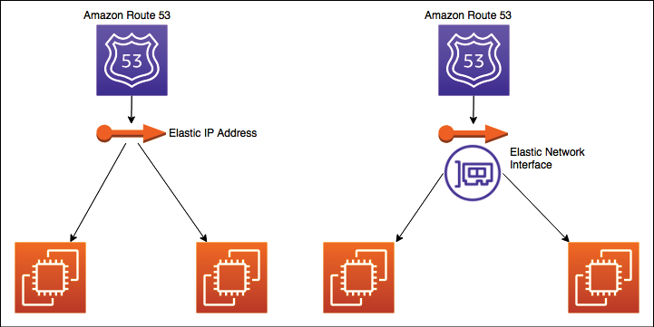

# 解决方案架构设计模式

你有没有想过大型企业是如何设计可扩展系统的？在开始应用程序开发之前，解决方案架构师跨组织工作并权衡多个选项以开发架构设计来处理业务需求。设计解决方案的方法有多种。解决方案架构师需要根据用户需求以及成本、性能、可伸缩性和可用性的架构限制采取正确的方法。在本章中，你将了解各种解决方案架构模式以及参考架构，以及如何将它们应用到实际场景中。

在前面的章节中，你了解了解决方案架构设计的属性和原则。本章既令人兴奋又必不可少，因为你将能够将所学知识应用到各种架构设计模式中。在本章中，你将了解一些重要的解决方案架构模式，例如分层、事件驱动、微服务、松散耦合、面向服务和 RESTful 架构。

你将了解各种架构设计的优点以及演示何时使用它们的示例。除了以下架构设计模式之外，你还将了解架构设计反模式：

- 构建 n 层分层架构
- 创建基于 SaaS 的多租户架构
- 构建无状态和有状态的架构设计
- 理解面向服务的架构
- 构建无服务器架构
- 创建微服务架构
- 构建基于队列的架构
- 创建一个事件驱动的架构
- 构建基于缓存的架构
- 了解断路器模式
- 实施舱壁模式
- 创建浮动 IP 模式
- 使用容器部署应用程序
- 应用程序架构中的数据库处理
- 避免解决方案架构中的反模式

到本章结束时，你将知道如何优化你的解决方案架构设计和应用最佳实践，使本章成为你学习的中心点和核心。

## 构建 n 层分层架构

在n层架构（也称为multitier architecture）中，需要应用松耦合设计原则（参考第4章解决方案架构设计原则）和可扩展性和弹性属性（参考第3章解决方案的属性）解决方案架构）。在多层架构中，你将产品功能划分为多个层次，例如表现层、业务层、数据库层和服务层，以便每一层都可以独立实现和扩展。

使用多层架构，很容易采用新技术并提高开发效率。这种分层架构提供了在每一层中添加新功能的灵活性，而不会干扰其他层的功能。在安全性方面，你可以确保每一层安全并与其他层隔离，因此如果一层受到威胁，其他层将不会受到影响。应用程序故障排除和管理也变得易于管理，因为你可以快速查明问题出在哪里以及需要对应用程序的哪一部分进行故障排除。

多层设计中最常见的架构是三层架构，下面我们来详细了解一下。下图显示了一个架构，它允许你从浏览器与 Web 应用程序交互并执行所需的功能，例如，订购你最喜欢的 T 恤或阅读博客并发表评论：


图 6.1：三层网站架构

在前面的体系结构中，你具有以下三层：

- Web 层：Web 层是应用程序面向用户的部分。最终用户与网络层交互以收集或提供信息。
- 应用层：应用层主要包含业务逻辑，并根据从网络层接收到的信息进行操作。
- 数据库层：各种用户数据和应用程序数据都存储在数据库层。

让我们更详细地看一下这些层。

### 网络层

Web 层也称为表示层。 Web 层提供了一个用户界面，可帮助最终用户与应用程序进行交互。 Web 层是你的用户界面（在本例中为网站页面），用户可以在其中输入信息或浏览信息。 Web 开发人员可以使用 HTML、CSS、AngularJS、ReactJS、JavaServer Pages (JSP) 和 Active Server Pages (ASP) 等技术构建表示层用户界面。该层从用户那里收集信息并将其传递给应用层。

Web 层是面向用户的，因此组织将大部分时间花在改善用户体验上。许多组织都有专门的用户体验 (UX) 团队，他们在各个领域进行研究，以了解用户如何与应用程序交互。

此外，解决方案架构师需要确保架构设计包括用户体验输入和页面加载性能。 Web 层和应用层之间应该有无缝的信息流，以便在预期的时间范围内将正确的信息返回给用户，例如用户登录、配置文件加载等。让我们看看应用层的更多细节。

### 应用层

应用层也称为逻辑层，因为这是所有业务逻辑所在的产品核心。表示层收集来自用户的信息，并将其传递给逻辑层进行处理并得到结果。例如，在 ```www.amazon.com``` 这样的电子商务网站上，用户可以在网站的订单页面上输入一个日期范围来查找他们的订单摘要。作为回报，Web 层将数据范围信息传递给应用层。应用层处理用户输入以执行业务逻辑，例如订单计数、金额总和和购买的商品数量。这会将信息返回到 Web 层以将其呈现给用户。

通常，在三层架构中，所有算法和复杂逻辑都位于应用层，包括创建推荐引擎或根据用户的浏览历史向用户显示个性化页面。你可以添加域层、数据访问层或表示层等层来构建 4 层或 5 层架构。开发人员可以选择使用服务器端编程语言（例如 C++、Java、.NET 或 Node.js）来实现这一层。应用层是系统设计的中心，需要大部分的设计工作。大多数应用程序功能都依赖于在应用程序层构建的逻辑。应用层对存储在数据库层中的数据执行逻辑。让我们更详细地看一下数据库层。

### 数据库层

数据库层，也称为数据层，存储与用户配置文件和交易相关的所有信息。本质上，它包含任何需要持久存储在数据层中的数据。这些信息被发送回应用层进行逻辑处理，然后最终在 web 层呈现给用户。例如，如果用户使用其用户 ID 和密码登录网站，则应用层会使用存储在数据库中的信息来验证用户凭证。如果凭据与存储的信息匹配，则允许用户登录并访问网站的授权区域。

架构师可以选择在关系数据库中构建数据层，例如 PostgreSQL、MariaDB、Oracle Database、MySQL、Microsoft SQL Server、Amazon Aurora 或 Amazon RDS。架构师还可以添加 NoSQL 数据库，例如 Amazon DynamoDB、MongoDB 或 Apache Cassandra。

数据层不仅用于存储交易信息，还用于保存用户会话信息和应用程序配置。为了满足性能需求，架构师可能决定添加缓存数据库，例如 Memcached 和 Redis。你将在第 13 章"解决方案架构的数据工程"中了解有关各种数据库的更多信息。

数据层在安全方面需要特别注意。你需要确保通过在静态和传输中应用数据加密来保护用户信息。在 n-tier 分层架构图中，你会注意到每一层都有自己的自动缩放配置，这意味着它可以独立缩放。此外，每一层都有一个网络边界，这意味着可以访问一个层不允许访问其他层。你将在第 8 章安全注意事项中了解有关安全注意事项的更多信息。

在设计多层架构时，你需要考虑应该将多少层添加到你的设计中。例如，解决方案架构师可能决定将应用层分解为业务层、服务层和持久层。但是，每一层都需要其服务器群和网络配置。因此，添加更多层意味着增加成本和管理开销，而保持更少的层意味着创建紧密耦合的架构。架构师需要根据应用程序的复杂性和用户需求来决定层数。例如，你可能希望添加额外的层，例如用于数据库访问逻辑的数据访问层，并保留用于数据库引擎的数据存储层。你可以通过定义逻辑分离来添加更多层以降低复杂性，这有助于提高通用应用程序的可维护性以及扩展和实现性能的能力。

## 构建基于 SaaS 的多租户架构

在上一节中，你了解了多层架构，在为单个组织构建时也称为单租户。随着组织采用数字革命，同时保持较低的整体应用程序和运营成本，多租户架构变得越来越流行。软件即服务 (**SaaS**) 模型建立在多租户架构之上，其中软件的单个实例和支持基础架构为多个客户提供服务。在此设计中，每个客户共享应用程序和数据库，每个租户通过其独特的配置、身份和数据进行隔离。在共享同一产品时，它们彼此不可见。

由于多租户 SaaS 提供商拥有从硬件到软件的一切，基于 SaaS 的产品将组织的责任转移到应用程序的维护和更新上，因为这由 SaaS 提供商负责。

每个客户（租户）都可以使用配置自定义他们的用户界面，而无需更改任何代码。由于多个客户共享一个公共基础设施，他们可以获得规模优势，从而进一步降低成本。一些最受欢迎的 SaaS 提供商是 Salesforce CRM、Jira 工具和 Amazon QuickSight。

如下架构图所示，有两个组织（租户）使用相同的软件和基础设施。 SaaS 供应商通过为每个组织分配唯一的租户 ID 来提供对应用程序层的访问。每个租户都可以使用简单的配置根据他们的业务需求自定义他们的用户界面：


图 6.2：多租户 SaaS 架构

如前面的架构设计所示，表示层提供用户界面，应用层承载业务逻辑。在数据访问层，每个租户将通过以下方法之一进行数据级隔离：

- **数据库级隔离**：在此模型中，每个租户都有与其租户 ID 相关联的数据库。当每个租户从用户界面查询数据时，他们将被重定向到他们的数据库。如果客户出于合规性和安全性原因不想要单个共享数据库，则需要此模型。
- **表级别隔离**：此隔离级别可以通过为每个租户提供单独的表来实现。在此模型中，表需要唯一分配给每个租户，例如，带有租户 ID 前缀。当每个租户从用户界面查询数据时，他们将根据他们的唯一标识符重定向到他们的表。
- **行级别隔离**：在此隔离级别中，所有租户共享数据库中的同一张表。表中还有一个附加列，其中针对每一行存储了唯一的租户 ID。当单个租户想要从用户界面访问他们的数据时，应用程序的数据访问层会根据租户 ID 制定对共享表的查询。每个租户都有一行只属于他们的用户。

对于企业客户，应进行仔细评估，根据其独特的功能需求了解 SaaS 解决方案是否适合他们。这是因为 SaaS 模型通常具有有限的定制功能。此外，如果需要大量用户订阅，我们需要找到成本价值主张。在做出构建与购买决策时，应根据总拥有成本来计算成本比较。这是因为构建软件并不是大多数组织的主要业务，因此 SaaS 模型正变得非常流行，因为组织可以专注于他们的业务并让专家处理它的 IT 方面。

## 构建无状态和有状态的架构设计

在设计电子商务网站等复杂应用程序时，你需要处理用户状态以维护活动流，其中用户可能会执行一系列活动，例如添加到购物车、下订单、选择送货方式、并付款。目前，用户可以使用多种渠道访问应用程序，因此他们很可能会在设备之间进行切换；例如，通过手机将商品添加到购物车，然后通过笔记本电脑完成结帐和付款。在这种情况下，你可能希望跨设备持久保存用户活动并维护它们的状态，直到交易完成。因此，你的架构设计和应用程序实现需要规划用户会话管理以满足此要求。

为了持久化用户状态并使应用程序无状态，用户会话信息需要存储在持久性数据库层中，例如 NoSQL 数据库。此状态可以在多个 Web 服务器或微服务之间共享。传统上，单体应用程序使用有状态架构，其中用户会话信息存储在服务器本身中，而不是通过任何外部持久性数据库存储。

会话存储机制是无状态和有状态应用程序设计之间的主要区别。由于有状态应用程序中的会话信息位于服务器本地，因此无法在其他服务器之间共享，也不支持现代微服务架构。你将在创建微服务架构部分了解有关基于微服务的架构的更多信息。

通常，有状态应用程序不能很好地支持水平扩展，因为应用程序状态在服务器中持久存在，无法被替换。当用户群不是很大时，有状态应用程序在早期运行良好。然而，随着 Internet 变得越来越流行，可以合理地假设你将有数百万用户活跃在 Web 应用程序上。因此，高效的水平扩展对于处理如此庞大的用户群和实现低应用程序延迟非常重要。

在有状态应用程序中，状态信息由服务器处理，因此一旦用户与特定服务器建立连接，他们必须坚持使用该连接直到事务完成。你可以在有状态应用程序之前放置一个负载均衡器，但为此，你必须在负载均衡器中启用粘性会话。粘性会话将特定用户会话的请求路由到为第一个请求提供服务的同一台物理机器，以确保用户会话不会因请求路由到不同的服务器而丢失。负载平衡器必须将用户请求路由到一台服务器，其中已建立会话信息。启用粘性会话违反了负载均衡器对分发方法的默认循环请求。其他问题可能包括许多打开的服务器连接，因为你需要为客户端实现会话超时。

你的设计方法应该更多地关注使用无状态方法的共享会话状态，因为它允许水平缩放。下图显示了一个架构，该架构描述了 Web 应用程序的无状态应用程序：


图 6.3：无状态应用程序架构

上面的架构图是一个三层架构，有Web层、应用层和数据库层。为了使应用程序松耦合和可扩展，所有用户会话都持久存储在 NoSQL 数据库中，例如 Amazon DynamoDB。

你应该为会话 ID 使用客户端存储，例如 cookie。此体系结构使你可以使用横向扩展模式，而不必担心用户状态信息丢失。无状态架构消除了创建和维护用户会话的开销，并允许跨应用程序模块的一致性。无状态应用程序也具有性能优势，因为它减少了服务器端的内存使用并消除了会话超时问题。

采用无状态模式会使任务复杂化；但是，通过正确的方法，你可以为你的用户群带来有益的体验。你可以使用带有 REST 设计模式的微服务方法开发应用程序，并将它们部署在容器中。为此，使用身份验证和授权将用户连接到服务器。

你将在下一节中了解有关 REST 设计模式和微服务的更多信息。由于从多个 Web 服务器访问状态信息集中在一个位置，因此你必须小心谨慎，以防止数据存储的性能成为瓶颈。

## 理解面向服务的架构

在面向服务的体系结构 (SOA) 模式中，不同的应用程序组件使用网络上的通信协议相互交互。每个服务都提供端到端的功能，例如，获取订单历史记录。 SOA 被大型系统广泛采用以集成业务流程，例如，将你的支付服务从主应用程序中取出并将其作为一个单独的解决方案。

一般而言，SOA 采用单体应用程序并将其中一些操作分散到彼此独立运行的单个服务中。使用 SOA 的目标是放松应用程序服务的耦合。有时，SOA 不仅包括将服务彼此分开，还包括将资源拆分为该服务的单独实例。例如，虽然有些人选择将他们公司的所有数据存储在一个按表拆分的数据库中，但 SOA 会考虑按功能将应用程序模块化到完全独立的数据库中。这使你可以根据每个数据库表的个别需求来扩展和管理吞吐量。

SOA 有很多好处，例如开发、部署和运行的并行化。它解耦了服务，以便你可以单独优化和扩展每个服务。

但是，它还需要更强大的治理来确保每个服务团队执行的工作符合相同的标准。使用 SOA，解决方案可能变得足够复杂以增加开销来平衡它，因此你需要正确选择工具以及服务监控、部署和扩展的自动化。

有多种实现 SOA 的方法。在这里，你将了解简单对象访问协议 (SOAP) Web 服务架构和表述性状态传输 (REST) Web 服务架构。

最初，SOAP 是最流行的消息传递协议，但它有点重量级，因为它完全依赖 XML 进行数据交换。现在，REST 架构变得越来越流行，因为开发人员需要构建更轻量级的移动和 Web 应用程序。让我们更详细地了解这两种架构及其差异。

### SOAP 网络服务架构

SOAP 是一种消息传递协议，用于在分布式环境中以 XML 格式交换数据。 SOAP 是一种标准的 XML，其中数据以称为 SOAP 信封的信封格式传输，如下图所示：


图 6.4：用于 Web 服务数据交换的 SOAP 信封

如上图所示，SOAP 信封包含两部分，这些 SOAP 消息采用 XML 格式，通常使用超文本传输协议 (**HTTP**) 发送：

- SOAP 标头：SOAP 标头提供有关 SOAP 消息的接收者应如何处理它的信息。它包含授权信息以将消息传递给正确的接收者和数据编码。
- 消息正文：消息正文包含 Web 服务描述语言 (**WSDL**) 规范中的实际消息。 WSDL 是一种 XML 格式文件，它描述了具有消息结构、API 操作和服务器的唯一资源定位器 (**URL**) 地址的应用程序编程接口 (**API**) 合同。使用 WSDL 服务，客户端应用程序可以确定服务的托管位置以及它可以执行的功能。

以下代码显示了 SOAP 信封 XML 的示例。在这里，你可以看到包在 SOAP 信封下的标头和消息：

```xml
<env:Envelope xmlns:env="http://www.w3.org/2003/05/soap-envelope">
<env:Header>
    <n:orderinfo xmlns:n="http://exampleorder.org/orderinfo">
        <n:priority>1</n:priority>
        <n:expires>2019-06-30T16:00:00-09:00</n:expires>
    </n:orderinfo>
</env:Header>
<env:Body>
    <m:order xmlns:m="http://exampleorder.org/orderinfo">
        <m:getorderinfo>
            <m:orderno>12345</m:oderno>
        </m:getorderinfo>
    </m:order>
</env:Body>
```

SOAP 通常使用 HTTP，但也可以使用其他协议，例如 SMTP。

在基于 SOAP 的 Web 服务中，服务提供者以 WSDL 的形式创建 API 契约。 WSDL列出了Web服务可以执行的所有操作，例如提供订单信息、更新订单、删除订单等。 服务提供者与 Web 服务客户端团队共享 WSDL，客户端使用它生成可接受的消息格式，将数据发送给服务提供者，并获得所需的响应。 Web 服务客户端在生成的 XML 消息中填充值，并将其与身份验证详细信息一起发送给服务提供商以供处理。 让我们看一个 WSDL 示例：

```xml
<?xml version="1.0"?>
<definitions name="Order"
targetNamespace="http://example.com/order.wsdl"
          xmlns:tns="http://example.com/ order.wsdl"
          xmlns:xsd1="http://example.com/ order.xsd"
          xmlns:soap="http://schemas.xmlsoap.org/wsdl/soap/"
          xmlns="http://schemas.xmlsoap.org/wsdl/">
    <types>
       <schema targetNamespace="http://example.com/ order.xsd"
              xmlns="http://www.w3.org/2000/10/XMLSchema">
           <element name="PlaceOrder">
              <complexType>
                  <all>
                      <element name="itemID" type="string"/>
                  </all>
              </complexType>
           </element>
           <element name="ItemPrice">
              <complexType>
                  <all>
                      <element name="price" type="float"/>
                  </all>
              </complexType>
           </element>
       </schema>
    </types>
    <message name="GetOrderInfo">
        <part name="body" element="xsd1:GetOrderRequest"/>
    </message>
    <message name="GetItemInfo">
        <part name="body" element="xsd1:ItemPrice"/>
    </message>
    <portType name="OrderPortType">
        <operation name="GetOrderInfo">
           <input message="tns: GetOrderInfoInput "/>
           <output message="tns: GetOrderInfoOutput"/>
        </operation>
    </portType>
    <binding name="OrderSoapBinding" type="tns:OrderPortType">
        <soap:binding style="document" transport="http://schemas.xmlsoap.org/soap/http"/>
        <operation name="GetOrderInfo">
           <soap:operation soapAction="http://example.com/GetOrderInfo "/>
           <input>
               <soap:body use="literal"/>
           </input>
           <output>
               <soap:body use="literal"/>
           </output>
        </operation>
    </binding>
    <service name="OrderService">
        <documentation>My first Order</documentation>
        <port name="OrderPort" binding="tns:OrderBinding">
           <soap:address location="http://example.com/order"/>
        </port>
    </service>
</definitions>
```

在高层次上，你可以看到六个主要元素用于在 WSDL 中定义 SOA 契约：

- 类型：它给出了数据类型定义来解释交换的消息。
- message：消息表示正在传输的数据的定义。消息具有与定义关联的逻辑部分。
- portType：是一组操作，包含输入消息和输出消息。
- 绑定：绑定为特定端口类型定义的操作和消息定义协议和数据格式规范。
- 端口：它通过定义单个通信端点来提供用于绑定的地址。
- 服务：用于聚合一组相关的端口。

软件架构师定义 WSDL 和消息模式，开发团队使用它们以他们选择的用于业务逻辑实现的编程语言为客户端和服务器框架生成代码。本节的总体目的是概述基于 SOAP 的体系结构。

Internet 上有各种可用资源，例如 W3Schools 教程，你可以探索开发团队深入了解基于 SOAP 的服务实现的教程。

下图显示了有关使用 SOAP 的 Web 服务中的消息交换的详细信息。在这里，Web 服务客户端将请求发送到托管 Web 服务的服务提供者，并收到具有所需结果的响应：


图 6.5：基于 SOAP 的 Web 服务

在上图中，客户端是电子商务网站的用户界面。用户需要他们的订单信息，因此将带有订单号的 XML 格式的 SOAP 消息发送到应用程序服务器。应用程序服务器托管订单服务，然后用客户的订单详细信息进行响应。

基于 SOAP 的 Web 服务的实现具有很高的复杂性和需要大量带宽，这会影响 Web 应用程序的性能，例如页面加载时间，并且服务器逻辑的任何重大更改都需要所有客户端更新其代码。 REST 的创建是为了解决基于 SOAP 的 Web 服务问题并提供更灵活的体系结构。让我们进一步了解 RESTful 架构及其流行的原因。

### RESTful 网络服务架构

由于其轻量级架构，REST 或 RESTful Web 服务可提供更好的性能。与仅允许 XML 的 SOAP 相比，它允许不同的消息传递格式，例如 JSON、纯文本、HTML 和 XML。 REST 是一种架构风格，它定义了使用 HTTP 协议进行数据传输的松耦合应用程序设计标准。

JavaScript 对象表示法 (**JSON**) 是一种更易于访问的 REST 架构中数据交换格式。 JSON 也是轻量级的并且与语言无关。它包含一个简单的键值对，使其与大多数编程语言中定义的数据结构兼容。

REST 专注于创建无状态服务的设计原则。与基于 SOAP 的服务一样，Web 服务客户端不需要生成复杂的客户端框架，但它可以使用唯一的统一资源标识符 (**URI**) 访问 Web 服务器资源。客户端可以通过HTTP协议访问RESTful资源，并对资源进行GET、PUT、DELETE、POST等标准操作。我们来看看REST和SOAP的区别：

|   属性   |                REST                 |             SOAP             |
| :------: | :---------------------------------: | :--------------------------: |
|   设计   |        带有非正式指南的风格         |   使用标准协议的预定义规则   |
| 消息格式 | JSON、YAML、XML、HTML、纯文本和 CSV |             XML              |
|   协议   |                HTTP                 |      HTTP、SMTP 和 UPD       |
| 会话状态 |             默认无状态              |          默认有状态          |
|  安全性  |            HTTPS 和 SSL             | Web 服务安全性和 ACID 合规性 |
|   缓存   |           缓存的 API 调用           |      无法缓存 API 调用       |
|   性能   |           资源少，速度快            |    需要更多带宽和计算能力    |

你在 REST 和 SOAP 之间选择的架构设计取决于你组织的需求。 REST 服务提供了一种与智能手机等轻量级客户端集成的有效方式，而 SOAP 提供了高安全性并适用于复杂的交易。 让我们了解一个基于面向服务设计的参考架构。

### 构建基于SOA的电子商务网站架构

像 ```www.amazon.com``` 这样的电子商务网站拥有来自世界各地的用户和包含数百万种产品的庞大目录。 每个产品都有多个图像、评论和视频。 为全球用户群维护如此庞大的目录是一项非常具有挑战性的任务。

此参考架构遵循 SOA 原则。 这些服务尽可能彼此独立运行。 该架构可以使用基于 SOAP 或 RESTful 的 Web 架构来实现：


图 6.6：电子商务网站 SOA

如上面的架构图所示，我们可以注意以下几点：

- 当用户在浏览器中键入网站地址时，用户请求会到达 DNS 服务器以加载该网站。网站的 DNS 请求由 Amazon Route 53 路由到托管 Web 应用程序的服务器。
- 用户群是全球性的，并且用户会继续浏览以购买产品，因为该网站有一个包含静态图像和视频的大型产品目录。诸如 Amazon CloudFront 之类的内容分发网络缓存静态资产并将其交付给用户。
- 目录内容（例如静态产品图像和视频）以及其他应用程序数据（例如日志文件）存储在 Amazon S3 中。
- 用户将从多个设备浏览网站，例如，他们将通过手机将商品添加到购物车，然后在桌面上付款。要处理用户会话，需要持久会话存储，例如 DynamoDB。事实上，DynamoDB 是一个 NoSQL 数据库，你不需要提供固定的架构，因此它是产品目录和属性的绝佳存储选项。
- 为了提供高性能并减少延迟，Amazon ElastiCache 被用作产品的缓存层，以减少对数据库的读写操作。
- 方便的搜索功能是产品销售和业务成功的关键。 Amazon CloudSearch 通过从 DynamoDB 加载产品目录来帮助构建可扩展的搜索功能。
- 推荐可以鼓励用户根据他们的浏览历史和过去的购买购买额外的产品。单独的推荐服务可以使用存储在 Amazon S3 上的日志数据，并向用户提供潜在的产品推荐。
- 电子商务应用程序还可以具有需要频繁部署的多个层和组件。 AWS Elastic Beanstalk 处理基础设施的自动配置、部署应用程序、通过应用自动缩放处理负载并监控应用程序。

在本节中，你了解了 SOA 以及体系结构概述。让我们更多地了解无服务器架构的现代架构设计的关键方面。

## 构建无服务器架构

在传统的场景中，如果你想开发一个应用程序，你需要有一个服务器来安装你想要的操作系统和所需的软件。在编写代码时，你需要确保服务器已启动并正在运行。在部署期间，你需要添加更多服务器以满足用户需求，并添加缩放机制（例如自动缩放）来管理所需数量的服务器以满足用户的请求。在整个情况下，大量的精力投入到基础架构的管理和维护中，这与你的业务问题无关。

无服务器使你能够专注于你的应用程序并为功能实现编写代码，而无需担心底层基础设施维护。

无服务器意味着不需要服务器来托管你的代码，这使你免于自动缩放和解耦开销，同时提供低成本模型。服务器管理和扩展的所有繁重工作都由云提供商负责。

AWS 等公共云在计算机和数据存储领域提供多种无服务器服务，这使得端到端无服务器应用程序的开发变得更加容易。谈到无服务器，首先想到的是AWS Lambda函数，它是一种函数即服务（**FaaS**），由AWS云提供。为了使你的应用程序面向服务，Amazon API Gateway 使你能够将 RESTful 端点置于 AWS Lambda 函数之前，并帮助你将它们公开为微服务。 Amazon DynamoDB 提供高度可扩展的 NoSQL 数据库，这是一个完全无服务器的 NoSQL 数据存储，Amazon Simple Storage Service (**S3**) 提供无服务器对象数据存储。

让我们看一下以下架构图中用于提供安全调查的参考无服务器架构示例：


图 6.7：用于安全调查交付的无服务器架构

在此示例中，无服务器架构服务、交付和处理安全调查，所有这些都在托管服务上进行：

1. 首先，客户通过 HTTPS 请求网站。该网页直接从 Amazon S3 提供。
2. 客户的调查通过对 Amazon API Gateway 的 AJAX 调用提交。
3. Amazon API Gateway 将此记录到 Amazon CloudTrail。如果调查结果丢失，或者如果其中一个 AJAX 调用包含某种恶意活动，这些日志可能有助于识别和修复问题。
4. 然后，Amazon API Gateway 将 AJAX 调用转换为 AWS Lambda 函数的事件触发器，该函数提取调查数据并对其进行处理。
5. 调查结果由 AWS Lambda 函数发送到 Amazon S3 存储桶，并在其中通过服务器端加密进行保护。
6. 来自调查的元数据（不包含任何个人身份信息）随后被写入并存储在 DynamoDB 表中。这可以用于以后的查询和分析。

由于无服务器架构的日益流行，随着本书的推进，你将看到更多使用无服务器服务的参考架构。此外，现在有更多框架可用于构建和管理无服务器应用程序，例如 AWS 无服务器应用程序模型 (**SAM**)。 SAM 是一个用于构建无服务器应用程序的开源框架，它提供了简单的语法来为无服务器应用程序创建函数、API 和数据库。

你可以使用 **YAML**（另一种标记语言）定义应用程序模型。由于 YAML 语法简单、易学且轻量级，它正变得非常流行并在许多地方取代了 JSON。在部署期间，SAM 将 YAML 配置文件语法转换为 AWS CloudFormation 语法，使你能够更快地构建无服务器应用程序。

随着 RESTful 风格架构的采用，微服务的概念也越来越流行。让我们在接下来的部分中了解更多关于 REST 架构和微服务的信息。

## 构建微服务架构

通常，微服务采用 REST 风格的 Web 服务架构，并且可以独立扩展。这样可以更轻松地扩展或缩小系统的相关组件，同时保持其余部分不变。采用微服务的系统可以更轻松地承受应用程序可用性可以优雅地降低以避免任何级联故障的事件。你的系统变得容错，也就是说，在构建时考虑到了故障。

微服务的明显优势是你必须维护更小的代码表面积。微服务应该始终是独立的。你可以在没有外部依赖的情况下构建每个服务，其中包含所有先决条件，这减少了应用程序模块之间的相互依赖并实现了松散耦合。

微服务的另一个总体概念是限界上下文，它们是组合在一起构成单个业务域的块。业务领域可以是汽车制造、图书销售或涉及完整业务流程的社交网络交互。单个微服务定义了封装所有细节的边界。

在处理应用程序的大规模访问时，扩展每个服务至关重要，其中不同的工作负载具有不同的扩展需求。让我们了解一些设计微服务架构的最佳实践：

- 创建单独的数据存储：为每个微服务采用单独的数据存储允许各个团队选择最适合其服务的数据库。例如，处理网站流量的团队可以使用可扩展性很强的 NoSQL 数据库来存储半结构化数据。处理订单服务的团队可以使用关系数据库来保证数据的完整性和交易的一致性。这也有助于实现松散耦合，其中一个数据库中的更改不会影响其他服务。
- 保持服务器无状态：正如你在上一节"构建无状态和有状态架构设计"中了解到的那样，保持服务器无状态有助于扩展。服务器应该能够停机并轻松更换，只需极少或不需要在服务器上存储状态。
- 创建单独的构建：为每个微服务创建单独的构建，使开发团队更容易引入新的更改并提高新功能发布的敏捷性。这有助于确保开发团队只构建特定微服务所需的代码，而不影响其他服务。
- 在容器中部署：在容器中部署为你提供了以相同标准方式部署所有内容的工具。你可以选择以相同的方式部署所有微服务，而不管它们使用容器的性质如何。你将在使用容器部署应用程序部分了解有关容器部署的更多信息。
- 去无服务器：当你的微服务不太复杂时，尝试使用无服务器平台或具有服务能力的杠杆功能，例如 AWS Lambda。无服务器架构可帮助你避免基础架构管理开销。
- 蓝绿部署：更好的方法是创建生产环境的副本。部署新功能并路由一小部分用户流量，以确保新功能在新环境中按预期运行。之后，增加新环境中的流量，直到整个用户群都能看到新功能。你将在第 12 章 DevOps 和解决方案架构框架中了解有关蓝绿部署的更多信息。
- 监控你的环境：良好的监控是对中断做出反应与通过适当的重新路由、扩展和管理降级主动防止中断之间的区别。为了防止任何应用程序停机，你希望服务提供并将其健康状态推送到监控层，因为有什么比服务本身更了解状态？可以通过多种方式进行监控，例如使用插件或写入监控 API。

虽然微服务架构具有各种优势，但模块化方法会带来管理更多基础设施的开销。你需要仔细选择工具来帮助你并行管理和扩展多个模块。在设计微服务架构时，尽可能尝试使用无服务器平台，这将有助于减轻基础设施和运营开销。让我们看一下用于实时投票应用程序的基于微服务的参考架构。

### 实时投票应用参考架构

下图说明了基于微服务的架构，代表实时投票应用程序，其中小型微服务处理和整合用户投票。 投票应用程序从每个移动设备收集个人用户投票，并将所有投票存储在 NoSQL Amazon DynamoDB 数据库中。

最后，在 AWS Lambda 函数中有应用程序逻辑，它聚合了用户对他们最喜欢的演员的所有投票数据并返回最终结果：


图 6.8：基于微服务的实时投票应用架构

在前面的架构中，发生了以下事情：

1. 用户将投票发送到电话号码或 Twilio 等第三方提供的短代码。
2. 第三方配置为将消息的内容发送到 Amazon API Gateway 创建的端点，然后将响应转发到 AWS Lambda 中内置的函数。
3. 此函数从消息内容中提取投票并将结果和任何元数据写入 Amazon DynamoDB 中的表中。
4. 此表启用了 DynamoDB Streams，这使你可以滚动跟踪对表的更改。
5. 更新后，DynamoDB Streams 通知第二个 AWS Lambda 函数，该函数具有聚合投票（每秒）的应用程序逻辑并将它们写回另一个 DynamoDB 表。第二个表只存储每个类别的投票总和。
6. 显示投票摘要的仪表板是使用 HTML 和 JavaScript 创建的，并作为静态网站托管在 Amazon S3 中。该页面使用 AWS JavaScript SDK 查询聚合的 Amazon DynamoDB 表并实时显示投票结果。
7. 最后，Amazon Route 53 用作 DNS 提供商以创建指向 Amazon S3 存储桶中自定义域名的托管区域。

这种架构不仅是基于微服务的，而且是无服务器的。使用微服务，你可以创建由小型独立组件组成的应用程序，这些组件构成要迭代的更小部分。基于微服务的架构意味着更改的成本、大小和风险会降低，从而提高更改率。

消息队列在实现准确的松散耦合和帮助避免应用程序节流方面发挥着至关重要的作用。队列允许组件之间进行安全可靠的通信。让我们在下一节中了解更多关于基于队列的架构。

## 构建基于队列的架构

在上一节中，你了解了使用 RESTful 架构的微服务设计。 RESTful 架构可帮助你轻松发现微服务，但如果你的服务出现故障怎么办？这是一个现代架构，你的客户端服务等待来自主机服务的响应，这意味着 HTTP 请求会阻止 API。有时，你的信息可能会因下游服务不可用而丢失。在这种情况下，你必须实施一些重试逻辑才能保留你的信息。

基于队列的体系结构通过在服务之间添加消息队列来解决此问题，消息队列代表服务保存信息。基于队列的架构提供了完全异步的通信和松散耦合的架构。在基于队列的架构中，你的信息在消息中仍然可用。如果服务崩溃，消息可以在服务可用时立即获取进程。让我们学习一些基于队列的架构的术语：

- **消息**：消息有两部分——标题和正文。标头包含有关消息的元数据，而正文包含实际消息。
- **队列**：队列保存可以在需要时使用的消息。
- **生产者**：产生消息并将其发布到队列的服务。
- **消费者**：消费和利用消息的服务。
- **消息代理**：帮助在生产者和消费者之间收集、路由和分发消息。

让我们了解一些典型的基于队列的架构模式，以了解它们的工作原理。

### 排队链模式

当顺序处理需要在链接在一起的多个系统上运行时，将应用排队链模式。让我们使用图像处理应用程序的示例来了解排队链模式。在图像处理管道中，捕获图像并将其存储在服务器上、运行作业以创建图像的不同分辨率副本、图像水印和缩略图生成等顺序操作彼此紧密相关。一个部件的故障可能会导致整个操作中断。

你可以在各种系统和作业之间使用队列来消除单点故障并设计真正松散耦合的系统。排队链模式可帮助你将不同的系统链接在一起，并增加可以并行处理消息的服务器数量。如果没有需要处理的镜像，可以配置自动缩放来终止多余的服务器。

下图显示了一个排队链模式架构。在这里，AWS 提供的队列称为 Amazon Simple Queue Service (**SQS**)：


图 6.9：排队链模式架构

上述架构有以下步骤：

1. 原始图像上传到服务器后，应用程序需要使用公司徽标为所有图像加水印。在这里，一组 Amazon EC2 服务器正在运行批处理作业，为所有图像添加水印并将处理后的图像推送到 Amazon SQS 队列中。
2. 第二组 Amazon EC2 服务器从 Amazon SQS 队列中提取带有水印的图像。
3. 第二组 EC2 工作人员处理图像并创建具有不同分辨率的多个变体。
4. 对图像进行编码后，EC2 工作人员将消息推送到另一个 Amazon SQS 队列中。
5. 在处理图像时，作业会从先前的队列中删除消息以腾出空间。
6. 最后一批 EC2 服务器从队列中获取编码消息，并创建缩略图和版权。

这种架构的好处如下：

- 你可以使用松散耦合的异步处理来快速返回响应，而无需等待另一个服务确认。
- 你可以使用 Amazon SQS 通过 Amazon EC2 实例或容器的松散耦合来构建系统。
- 即使 Amazon EC2 实例发生故障，消息也会保留在队列服务中。这使得处理能够在服务器恢复后继续进行，并创建一个对故障具有鲁棒性的系统。

你的应用程序需求可能会出现波动，从而导致意外的消息加载。根据队列消息负载自动化你的工作负载将帮助你处理任何波动。接下来让我们进一步了解如何使用作业观察者模式来处理此类自动化。

### 工作观察者模式

排队链模式可帮助你设计松散耦合的架构，但你将如何处理工作负载激增？在请求波动的情况下，你需要根据用户需求调整你的处理能力，这可以通过作业观察者模式来解决。

在作业观察者模式中，你可以根据队列中要处理的消息数创建一个自动缩放组。作业观察者模式通过增加或减少作业处理中使用的服务器实例的数量来帮助你保持性能。

下图描述了作业观察者模式：


图 6.10：作业观察者模式架构

在前面的架构中，第一批 Amazon EC2 服务器位于左侧，运行批处理作业并将消息放入队列中，例如图像元数据。右侧的第二组 EC2 服务器正在使用和处理这些消息，例如图像编码。当消息达到某个阈值时，Amazon CloudWatch 会触发自动扩展以在消费者队列中添加额外的服务器以加速作业处理。当队列深度低于阈值时，自动缩放还会删除额外的服务器。

工作观察者模式根据工作规模计算规模，提供效率和成本节约。作业观察者模式架构允许作业在更短的时间内完成。该过程具有弹性，这意味着如果服务器出现故障，作业处理不会停止。

虽然基于队列的架构提供了松耦合，但它主要在异步拉取方法上工作，消费者可以在消息可用时从队列中拉取消息。

通常，你需要推动各种体系结构组件之间的通信，其中一个事件应触发其他事件。让我们在下一节中了解有关事件驱动架构的更多信息。

## 构建一个事件驱动的架构

事件驱动架构可帮助你将一系列事件链接在一起以完成功能流。例如，当你在网站上付款购买商品时，你希望在付款完成后立即生成订单发票并收到一封电子邮件。事件驱动架构有助于将所有这些事件捆绑在一起，以便付款可以触发另一项任务来完成订单流。通常，在讨论事件驱动架构时，你会看到消息队列是你在上一节中了解的中心点。事件驱动架构也可以基于发布者/订阅者模型或事件流模型。

### 发布者/订阅者模型

在发布者/订阅者（pub/sub）模型中，当一个事件被发布时，一个通知被发送给所有的订阅者，每个订阅者可以根据他们对数据处理的要求采取必要的行动。让我们举一个照相馆应用程序的例子，它用不同的滤镜丰富照片并向用户发送通知。以下架构描述了一个发布/订阅模型：


图 6.11：照相馆应用程序发布/订阅事件驱动架构

在上图中，你会注意到以下几点：

1. 用户首先使用网络/移动应用程序将图片上传到 Amazon S3 存储桶。
2. 然后，Amazon S3 存储桶向 Amazon Simple Notification Service (**SNS**) 发送通知。 Amazon SNS 是具有以下订阅者的消息主题：
   1. 在这里，第一个订阅者正在使用电子邮件服务，一旦照片上传完成，就会向用户发送一封电子邮件
   2. 第二个订阅者正在使用 Amazon SQS 队列，它从 Amazon SNS 主题获取消息并在 AWS Lambda 编写的代码中应用各种过滤器以提高图像质量
   3. 第三个订阅者使用直接 AWS Lambda 函数，它创建图像缩略图

在此架构中，Amazon S3 作为生产者将消息发布到 SNS 主题，供多个订阅者使用。此外，一旦消息到达 SQS，它就会触发 Lambda 函数处理图像的事件。

### 事件流模型

在事件流模型中，消费者可以从来自生产者的连续事件流中读取。例如，你可以使用事件流来捕获点击流日志的连续流，并在检测到任何异常时发送警报，如下面的架构图所示：


图 6.12：点击流分析事件流架构

Amazon Kinesis 是一项用于摄取、处理和存储连续流数据的服务。在上图中，各种客户从 Web 和移动应用程序点击电子商务应用程序会产生点击事件流。

这些点击流被发送到使用 Amazon API Gateway 进行实时分析的分析应用程序。在此分析应用程序中，Kinesis Data Analytics 计算特定时间段内的转化率，例如，在过去五分钟内完成购买的人数。实时聚合数据后，Amazon Kinesis Data Analytics 将结果发送到 Amazon Kinesis Data Firehose，后者将所有数据文件存储在 Amazon S3 存储中，以便根据需要进行进一步处理。

Lambda 函数从事件流中读取并开始检查异常数据。当检测到转换率异常时，AWS Lambda 函数会通过电子邮件发送通知，以便通知活动团队。在此架构中，事件流不断发生，AWS Lambda 从流中读取特定事件。

你应该使用事件驱动的架构来解耦生产者和消费者，并保持架构的可扩展性，以便随时可以集成新的消费者。这提供了一个高度可扩展的分布式系统，每个子系统都具有独立的事件视图。但是，你需要应用一种机制来避免重复处理和错误消息处理。

为了获得良好的应用程序性能，缓存是一个重要因素，它可以应用于每个架构层和几乎任何架构组件。让我们在下一节中了解更多关于基于缓存的架构。

## 构建基于缓存的架构

缓存是将数据或文件临时存储在请求者和永久存储之间的中间位置的过程，目的是使未来的请求更快并降低网络吞吐量。缓存可提高应用程序速度并降低成本。它允许你重用以前检索到的数据。为了提高应用程序性能，缓存可以应用于架构的各个层，例如 Web 层、应用层、数据层和网络层。

通常，服务器的随机存取存储器 (RAM) 和内存缓存引擎用于支持应用程序缓存。但是，如果缓存耦合到本地服务器，则缓存不会持久化数据，以防服务器崩溃。现在，大多数应用程序都处于分布式环境中，因此最好有一个独立于应用程序生命周期的专用缓存层。如果你对应用程序应用水平扩展，所有服务器都应该能够访问集中缓存层以实现最佳性能。

下图描述了解决方案体系结构各个层中的缓存机制：


图 6.13：架构层的缓存

如上图所示，架构各层的缓存机制如下：

- **客户端**：客户端缓存应用于移动和桌面等用户设备。这会缓存以前访问过的 Web 内容，以便更快地响应后续请求。每个浏览器都有自己的缓存机制。 HTTP 缓存通过在本地浏览器缓存内容使应用程序更快。缓存控制 HTTP 标头定义了客户端请求和服务器响应的浏览器缓存策略。这些策略定义了内容应缓存的位置以及内容将保留多长时间，这称为生存时间 (TTL)。 Cookie 是另一种用于在客户端计算机上存储信息以便更快地响应浏览器的方法。
- **DNS 缓存**：当用户在 Internet 上键入网站地址时，公共域名系统 (DNS) 服务器会查找 IP 地址。缓存此 DNS 解析信息将减少网站的加载时间。 DNS 信息可以在第一次请求后缓存到本地服务器或浏览器，并且对该网站的任何进一步请求都会更快。
- **Web 缓存**：大部分请求涉及检索 Web 内容，例如图像、视频和 HTML 页面。将这些资产缓存在用户位置附近可以为页面加载提供更快的响应。这也消除了磁盘读取和服务器加载时间。内容分发网络 (CDN) 提供了一个边缘位置网络，可以在其中缓存高分辨率图像和视频等静态内容。它对于阅读游戏、博客、电子商务产品目录页面等重应用非常有用。用户会话包含大量有关用户偏好及其状态的信息。它将用户会话存储在自己的键值存储中以实现快速的用户响应，从而提供了极佳的用户体验。
- **应用缓存**：在应用层，可以应用缓存来存储复杂的重复请求的结果，避免业务逻辑计算和数据库命中。总体而言，它提高了应用程序性能并减少了数据库和基础架构的负载。
- **数据库缓存**：应用程序性能在很大程度上取决于数据库提供的速度和吞吐量。数据库缓存允许你显着增加数据库吞吐量并降低数据检索延迟。数据库缓存可以应用在任何类型的关系或非关系数据库之前。一些数据库提供商集成缓存，而应用程序处理本地缓存。

Redis 和 Memcached 是最流行的缓存引擎。虽然 Memcached 速度更快（它适用于低结构数据并以键值格式存储数据），但 Redis 是一种更持久的缓存引擎，能够处理游戏排行榜等应用程序所需的复杂数据结构；你将在本章的 Memcached 与 Redis 部分了解更多详细信息。让我们了解更多的缓存设计模式。

### 三层网络架构中的缓存分布模式

传统的 Web 托管架构实施标准的三层 Web 应用程序模型，该模型将架构分为表示层、应用程序层和持久层。

如下架构图所示，缓存应用于Web、应用程序和数据库层：


图 6.14：缓存分布模式架构

卸载网页的一种方法是通过缓存。在缓存模式中，你的目标是尽可能少地访问后端。你可以编写一个可以缓存图像、JavaScript 甚至整个页面的应用程序，以便为你的用户提供更好的体验。如上图所示，缓存应用于架构的各个层：

- **Amazon Route 53** 提供 DNS 服务以简化域管理并帮助缓存 DNS 到 IP 映射。
- **Amazon S3** 存储所有静态内容，例如高分辨率图像和视频。
- **Amazon CloudFront** 为大量内容提供边缘缓存。它还使用这些缓存控制标头来确定需要多长时间检查源文件的更新版本。
- **Amazon DynamoDB** 用于会话存储，Web 应用程序在其中缓存以处理用户会话。
- **Elastic Load Balancing** 将流量分散到此图中的 Web 服务器 Auto Scaling 组。
- **Amazon ElastiCache** 为应用程序提供缓存服务，从而消除数据库层的负载。

通常，你只缓存静态内容；但是，动态或独特的内容会影响应用程序的性能。根据需求，你仍然可以通过缓存动态或独特的内容来获得一些性能提升。让我们来看一个更具体的模式。

### 重命名分配模式

使用 Amazon CloudFront 等 CDN 时，你可以将常用数据存储在靠近用户的边缘位置以实现快速性能。 通常，你会在 CDN 中为你的数据设置 TTL（生存时间），这意味着在 TTL 到期之前，边缘位置不会向服务器查询更新的数据。 TTL 是对象在被删除或刷新之前存储在缓存系统中的时间。 你可能会遇到需要立即更新 CDN 缓存内容的情况，例如，如果你需要更正错误的产品描述。

在这种情况下，你不能等待文件的 TTL 过期。 重命名分发模式可帮助你在发布新更改后立即更新缓存，以便用户可以立即获取更新信息。 下图显示了重命名分布模式：


图 6.15：重命名分布模式架构

如上图所示，将重命名分布模式与缓存分布模式结合使用有助于解决更新问题。使用此模式，服务器不会覆盖源服务器中的文件并等待 CloudFront 中的 TTL 过期，而是使用新文件名上传更新后的文件，然后使用新 URL 更新网页。当用户请求原始内容时，CloudFront 必须从源获取它并且不能提供已经缓存的过时文件。

但是，你可以选择立即使旧文件失效，但这会花费更多，因此最好放置一个新版本的文件供 CDN 立即挑选。同样，你必须更新应用程序中的 URL 以获取新文件，与无效选项相比会增加一些开销。最好根据你的业务需求和预算做出决定。

如果你不想为分布在一个国家/地区的用户群使用 CDN，则可以使用代理缓存服务器。让我们在下一节中了解更多信息。

### 缓存代理模式

你可以通过添加缓存层显着提高应用程序性能。在缓存代理模式中，静态内容或动态内容缓存在 Web 应用服务器的上游。如下架构图所示，你在 Web 应用程序集群前面有一个缓存层：


图 6.16：缓存代理模式架构

在上图中，为了实现高性能交付，缓存内容由缓存服务器交付。缓存代理模式的一些好处如下：

缓存代理模式可帮助你使用缓存传送内容，这意味着无需在 Web 服务器或应用程序服务器级别进行修改。
它们尤其减少了动态内容的内容生成负载。
你可以灵活地在浏览器级别设置缓存，例如 HTTP 标头、URL、cookie 等。或者，如果你不想将信息存储在浏览器级别，则可以将信息缓存在缓存层中。
在缓存代理模式中，你需要确保维护缓存的多个副本以避免单点故障。有时，你可能希望同时从服务器和 CDN 提供静态内容，这两种方式都需要不同的方法。让我们在下一节中深入探讨这种混合情况。

### 重写代理模式

有时，你希望更改图片、视频等静态网站内容的访问目的地，但又不想对现有系统进行更改。你可以通过使用重写代理模式提供代理服务器来实现这一点。要将静态内容的目的地更改为内容服务或互联网存储等其他存储，你可以在网络服务器群前面使用代理服务器。如下架构图所示，你在应用层之前有一个代理服务器，这有助于在不修改实际应用程序的情况下更改内容交付目的地：


图 6.17：重写代理模式架构

如上图所示，要实现重写代理模式，请将代理服务器放在当前运行的系统之前。你可以使用 Apache NGINX 等软件构建代理服务器。以下是构建重写代理模式的步骤：

1. 在 EC2 实例上放置一个正在运行的代理服务器，它能够覆盖负载均衡器和存储静态内容的存储服务（例如 Amazon S3）之间的内容
2. 添加到代理服务器规则以覆盖内容中的 URL。这些规则将帮助 Elastic Load Balancing (ELB) 指向新位置，如上图所示，它将代理服务器规则从 ```https://cdn/test.jpg``` 重定向到 ```/test.jpg```
3. 根据需要，通过根据应用程序负载配置多个最小和最大代理服务器，将自动缩放应用到代理服务器

在本节中，你了解了处理通过网络分发静态内容的缓存的各种方法。但是，应用层的缓存对于提高应用程序性能和整体用户体验非常重要。让我们进一步了解应用缓存模式以处理动态用户数据交付性能。

### 应用缓存模式

在将缓存应用于应用程序时，你希望在应用程序服务器和数据库之间添加一个缓存引擎层。应用程序缓存模式允许你减少数据库的负载，因为最频繁的查询是从缓存层提供服务的。应用程序缓存模式提高了整体应用程序和数据库性能。如下图所示，可以看到在应用层和数据库层之间应用的缓存层：


图 6.18：应用程序缓存模式架构

如上图所示，根据你的数据访问模式，你可以使用惰性缓存或直写。在惰性缓存中，缓存引擎检查数据是否在缓存中，如果不在，则从数据库中获取数据并将其保存在缓存中以服务于未来的请求。惰性缓存也称为缓存备用模式。

在write-through方法中，数据同时写入缓存和数据存储。如果数据从缓存中丢失，则可以从数据库中重新获取。 Write-through 主要用于用户正在撰写产品评论（始终需要加载到产品页面上）的应用程序到应用程序的情况。让我们进一步了解流行的缓存引擎 Redis 和 Memcached。

#### Memcached 与 Redis
Redis 和 Memcached 是应用程序设计中使用的两种流行的缓存引擎。通常，需要 Redis 缓存引擎来满足更复杂的应用程序缓存需求，例如为游戏创建排行榜。但是，Memcached 的性能更高，有助于处理繁重的应用程序负载。每个缓存引擎都有自己的优点和缺点。让我们来看看它们之间的主要区别，这将帮助你决定使用哪个：

|                        Memcached                        |                       Redis                        |
| :-----------------------------------------------------: | :------------------------------------------------: |
|                       提供多线程                        |                       单线程                       |
|          能够使用更多的 CPU 内核来加快处理速度          |        无法使用多核处理器，导致性能相对较慢        |
|                    支持键值样式数据                     |              支持复杂和高级的数据结构              |
| 缺乏数据持久性； 在发生崩溃时丢失存储在高速缓存中的数据 | 数据可以使用具有故障转移功能的内置只读副本持久保存 |
|                        易于维护                         |       由于需要维护集群，因此涉及更多的复杂性       |
| 适合缓存平面字符串，例如平面 HTML 页面、序列化 JSON 等  |     很适合为游戏排行榜、现场投票应用等创建缓存     |

总的来说，如果你需要决定使用哪个引擎，请基于可以证明使用 Redis 或 Memcached 的用例。 Memcached 简单且维护较少，当你的缓存不需要 Redis 提供的高级功能时，它通常是首选。但是，如果你需要数据持久性、高级数据类型或列出的任何其他功能的优势，那么 Redis 是最佳解决方案。

实现缓存时，必须了解需要缓存的数据的有效性。如果缓存命中率高，则意味着数据在需要时在缓存中可用。为了获得更高的缓存命中率，通过减少直接查询来卸载数据库；这也提高了整体应用程序性能。当缓存中不存在数据时会发生缓存未命中，这会增加数据库的负载。缓存不是大型数据存储，因此你需要根据应用程序需要设置 TTL 和逐出缓存。

正如你在本节中看到的，应用缓存有多种好处，包括应用程序性能改进、提供可预测性能的能力以及数据库成本的降低。

让我们了解更多基于应用程序的架构，这些架构演示了松散耦合和约束处理的原则。

## 了解断路器模式

分布式系统调用其他下游服务很常见，调用可能会失败或挂起而无响应。你经常会看到多次重试失败调用的代码。远程服务的问题在于它可能需要几分钟甚至几小时才能纠正，并且立即重试可能会以另一个失败告终。因此，当你的代码重试多次时，最终用户会等待更长的时间才能获得错误响应。此重试函数会消耗线程，并且可能会导致级联故障。

断路器模式是关于了解下游依赖项的健康状况。它检测这些依赖项何时不健康，并实施逻辑以优雅地失败请求，直到它检测到它们再次健康为止。断路器可以使用持久层来实现，以监视过去请求间隔内健康和不健康的请求。

如果定义百分比的请求在过去的时间间隔内或在异常总数中观察到不健康的行为，无论百分比如何，电路都被标记为打开。在这种情况下，所有请求都会抛出异常，而不是在定义的超时期限内与依赖项集成。一旦超时时间结束，一小部分请求会尝试与下游依赖项集成，以检测何时恢复健康。一旦足够百分比的请求在一段时间内再次健康，或者没有观察到错误，电路将再次关闭，并允许所有请求像往常一样彻底集成。

实施决策涉及状态机来跟踪/共享健康/不健康的请求计数。服务状态可以在 DynamoDB、Redis/Memcached 或其他低延迟持久性存储中维护。

## 实施舱壁模式

舱壁在船舶中用于创建单独的水密舱室，用于限制故障的影响，理想地防止船舶沉没。 如果水在一个舱室中冲破船体，舱壁会阻止它流入其他舱室，从而限制故障范围。

同样的概念对于限制大型系统架构中的故障范围很有用，在这种情况下，你希望对系统进行分区以分离服务之间的依赖关系。 这个想法是一个故障不应该导致整个系统故障，如下图所示：


图 6.19：隔板模式

在隔板模式中，最好将应用的元素隔离到服务池中，具有高依赖性；因此，如果一个失败，其他人将继续为上游服务提供服务。在上图中，服务 3 从单个服务划分为两个池。在这里，如果服务 3 发生故障，那么服务 1 或服务 2 的影响取决于它们对池的依赖性，但整个系统不会宕机。以下是在你的设计中引入舱壁模式时需要考虑的要点，尤其是对于共享服务模型：

- 保存部分船舶，这意味着你的应用程序不应由于一项服务的失败而关闭。
- 确定低效使用资源是否可以。一个分区中的性能问题不应影响整个应用程序。
- 选择一个有用的粒度。不要让服务池太小；确保它们能够处理应用程序负载。

监控每个服务分区的性能并遵守 SLA。确保所有移动部件协同工作，并在一个服务池出现故障时测试整个应用程序。
你应该为每个业务或技术需求定义一个服务分区。你应该使用此模式来防止应用程序发生级联故障并将关键消费者与标准消费者隔离开来。

通常，遗留应用程序服务器的配置具有硬编码的 Internet 协议 (IP) 地址或域名服务器 (DNS) 名称。为实现现代化和升级而对服务器进行任何更改都需要对应用程序进行更改并重新验证。在这些情况下，你不想更改服务器地址。让我们在下一节中学习如何使用浮动 IP 处理这种情况。

## 创建浮动 IP 模式

整体式应用程序对部署它们的服务器有很多依赖性是很常见的。通常，应用程序配置和代码具有基于服务器 DNS 名称和 IP 地址的硬编码参数。如果你想在原始服务器出现问题时启动新服务器，则硬编码 IP 配置会带来挑战。此外，你不希望为了升级而关闭整个应用程序，这可能会导致大量停机。

要处理这种情况，你需要创建一个新服务器，保持相同的服务器 IP 地址和 DNS 名称。这可以通过将网络接口从有问题的实例移动到新服务器来实现。网络接口通常基于网络接口卡 (**NIC**)，它有助于通过网络在服务器之间进行通信。它可以是硬件或软件的形式。移动网络接口意味着现在你的新服务器采用旧服务器的身份。这样，你的应用程序就可以使用相同的 DNS 和 IP 地址。它还允许通过将网络接口移动到原始实例来轻松回滚。

公共云（例如 AWS）通过提供弹性 IP (**EIP**) 和弹性网络接口 (**ENI**) 使其变得简单。如果你的实例出现故障，你需要将流量推送到具有相同公网IP地址的另一个实例，那么你可以将EIP地址从一台服务器移动到另一台服务器，如下架构图所示：



图 6.20：浮动 IP 和接口模式

由于你正在移动 EIP，因此 DNS 可能不需要更新。 EIP 可以跨实例移动服务器的公共 IP。如果需要同时迁移公网IP和私网IP，可以采用弹性更大的方式，如弹性网卡，如上图右侧所示。 ENI 可以跨实例移动，你可以使用相同的公共和私有地址进行流量路由或应用程序升级。

到目前为止，你已经了解了应用程序部署在虚拟机中的多种架构模式。但是，在许多情况下，你可能无法充分利用虚拟机。为了进一步优化你的利用率，你可以选择在容器中部署你的应用程序。容器最适合微服务部署。让我们在下一节中详细了解基于容器的部署。

## 使用容器部署应用程序

随着许多编程语言的发明和技术的发展，这带来了新的挑战。不同的应用程序堆栈需要不同的硬件和软件部署环境。通常，需要跨不同平台运行应用程序并从一个平台迁移到另一个平台。解决方案需要可以在任何地方运行任何东西并且一致、轻便和便携的东西。

正如海运集装箱标准化货运货物的运输一样，软件集装箱标准化应用程序的运输。 Docker 创建一个容器，其中包含软件应用程序运行其所有文件所需的一切，例如文件系统结构、守护进程、库和应用程序依赖项。容器将软件与其周围的开发和暂存环境隔离开来。这有助于减少在同一基础架构上运行不同软件的团队之间的冲突。

VM 在操作系统级别隔离，而容器在内核级别隔离。这种隔离允许多个应用程序在单一主机操作系统上运行，但仍然有它们的文件系统、存储、RAM、库，并且主要是它们自己的系统视图：


图 6.21：用于应用程序部署的虚拟机和容器

如上图所示，多个应用程序使用容器部署在单个虚拟机中。每个应用程序都有其运行时环境，因此你可以运行许多单独的应用程序，同时保持相同数量的服务器。容器共享机器的操作系统内核。它们立即启动并使用更少的计算时间和 RAM。容器镜像由文件系统层构成并共享标准文件。共享资源最大限度地减少了磁盘使用，并且容器映像下载速度更快。让我们来看看为什么容器越来越受欢迎，以及它们的好处。

### 容器的好处

当谈到容器时，客户经常会问这些问题：

- 当我们有实例时，为什么我们需要容器？
- 实例不是已经为我们提供了与底层硬件的隔离级别吗？

虽然前面的问题是有效的，但使用 Docker 等系统会带来一些好处。 Docker 的主要优势之一是它允许你通过在同一实例中托管多个应用程序（在不同的端口上）来充分利用你的虚拟机资源。

Docker 使用 Linux 内核的某些特性，即内核命名空间和组，来实现每个 Docker 进程之间的完全隔离，如下架构图所示：


图 6.22：应用基础设施中的容器层

如上图所示，可以在同一台机器上运行两个或多个需要不同版本 Java 运行时的应用程序，因为每个 Docker 容器都安装了自己的 Java 版本和关联的库。反过来，应用程序基础架构中的容器层可以更轻松地将你的应用程序分解为可以在同一实例上并行运行的微服务。容器具有以下优点：

- **便携式运行时应用程序环境**：容器提供独立于平台的功能，你可以在其中构建一次应用程序并将其部署到任何地方，而无需考虑底层操作系统
- **更快的开发和部署周期**：修改应用程序并在任何地方运行它，启动时间很快，通常在几秒钟内
- **将依赖项和应用程序打包在单个工件中**：将代码、库和依赖项打包在一起，以便在任何操作系统中运行应用程序
- **运行不同的应用版本**：不同依赖的应用同时运行在一台服务器上
- **一切都可以自动化**：容器管理和部署通过脚本完成，有助于节省成本和人为错误
- **更好的资源利用率**：容器提供高效的扩展和高可用性，并且可以为你的应用程序跨服务器部署同一微服务容器的多个副本
- **易于管理安全方面**：容器是特定于平台而不是特定于应用程序的

容器部署因其优势而变得非常流行。有多种方法来编排容器。接下来让我们更详细地了解一下容器部署。

### 容器部署

使用容器部署可以快速部署具有多个微服务的复杂应用程序。在环境相同的情况下，容器可以更轻松地更快地构建和部署应用程序。在开发模式下构建容器，推送测试，然后发布到生产环境。对于混合云环境，容器部署非常有用。容器使跨微服务的环境保持一致变得更加容易。由于微服务并不总是非常消耗资源，因此可以将它们放在一个实例中以降低成本。

有时，客户的工作流程较短，需要临时环境设置。这些环境可能是队列系统或持续集成作业，它们并不总是有效地利用服务器资源。 Docker 和 Kubernetes 等容器编排服务可以作为一种变通方法，允许它们将容器推送和弹出到实例上。

Docker 的轻量级容器虚拟化平台提供了管理应用程序的工具。它的独立应用程序可以安装在任何计算机上以运行容器。 Kubernetes 是一种容器编排服务，可与 Docker 和其他容器平台配合使用。 Kubernetes 允许自动配置容器并认真处理安全、网络和扩展方面的问题。

容器帮助企业创建更多的云原生工作负载，AWS 等公共云提供商扩展服务以管理 Docker 容器和 Kubernetes。

下图显示了使用 Amazon Elastic Container Service (**ECS**) 进行 Docker 的容器管理，提供完全托管的弹性服务来自动化 Docker 容器的扩展和编排：


图 6.23：容器部署架构

在上图中，多个容器部署在单个 Amazon EC2 虚拟机中，通过 Amazon ECS 进行管理，方便代理通信服务和集群管理。所有用户请求都使用负载均衡器在容器之间分配。同样，AWS 提供 Amazon Elastic Kubernetes Service (EKS) 来使用 Kubernetes 管理容器。

容器是一个广泛的主题，作为解决方案架构师，你需要熟悉所有可用选项。本节概述了容器。但是，如果你选择将容器用于微服务部署，则需要进一步深入研究。让我们在下一节中看一下基于容器的架构。

### 构建基于容器的架构

正如你在上一节中了解到的，容器化有助于为可重复和可扩展的应用程序创建环境。要开始采用容器，你需要确定一个通过容器编排管理的试点工作负载。你可以采用现有的微服务组件并将它们部署到容器中。在确定差距和运营需求后，你可以定义迁移策略以将工作负载迁移到容器。

与任何其他变化一样，如果你的应用程序并非设计为在容器环境中运行，那么容器迁移也会带来挑战。由于应用程序经常将文件持久化到本地存储并进行有状态会话，因此容器迁移需要满足这些要求。

对于容器平台，你可以做出选择；你可以选择 Docker、OpenShift、Kubernetes 等。然而，Kubernetes 正在成为越来越受欢迎的开源容器编排器。 AWS 等公共云供应商提供了一个平台来管理容器，例如用于 Docker 的 Amazon ECS 和用于 Kubernetes 的 Amazon EKS。这些云服务提供了一个控制平面来选择各种计算选项，以使用 AWS Fargate 选择自我管理节点、托管节点或无服务器选项。以下架构图显示了使用你选择的编程语言（例如 Java 或 .NET）在 Amazon EKS 上运行有状态服务。给定架构，你可以管理 Redis 数据库中的会话状态。


图 6.24：在容器上部署有状态应用程序

正如你在上图中看到的，基于容器的架构包括以下组件：

- 一个 Amazon 虚拟私有云 (VPC)，其中一个公共子网用于负载均衡器，两个私有子网用于应用程序和数据库部署
- 一个应用程序负载均衡器，用于访问在容器内运行的网站
- 在 Kubernetes 中具有托管节点组的 Amazon EKS 集群。这些节点运行多个应用程序容器
- 用于存储用户会话状态的 Amazon ElastiCache Redis 数据库

上述架构通过将用户会话保存在 Redis 数据库中来帮助你扩展应用程序。此解决方案需要更改应用程序代码，并且在某些情况下这不是一个选项。

到目前为止，你已经了解了各种专注于应用程序开发的架构模式。每个人都必须同意，数据是任何架构设计中不可或缺的一部分，并且大多数架构都围绕着收集、存储和处理数据的可视化。让我们在下一节中了解有关在应用程序体系结构中处理数据的更多信息。

## 应用程序架构中的数据库处理

数据始终是任何应用程序开发的中心，扩展数据一直是一项挑战。有效地处理数据可改善应用程序延迟和性能。在上一节构建基于缓存的架构中，你学习了如何通过在应用程序缓存模式下将缓存放在数据库前面来处理频繁查询的数据。你可以将 Memcached 或 Redis 缓存放在数据库前面，这样可以减少对数据库的多次访问并改善数据库延迟。

在应用程序部署中，随着应用程序用户群的增长，你需要使用关系数据库处理更多数据。你需要通过添加更多内存和 CPU 能力来添加更多存储或垂直扩展数据库服务器。通常，在扩展关系数据库时，水平扩展不是很简单。如果你的应用程序是读取密集型的，你可以通过创建只读副本来实现水平扩展。将所有读取请求路由到数据库只读副本，同时让主数据库节点为写入和更新请求提供服务。由于只读副本具有异步复制，因此会增加一些滞后时间。如果你的应用程序可以容忍几毫秒的延迟，你应该选择只读副本选项。你可以使用只读副本来卸载报告。

你可以使用数据库分片为关系数据库创建多主数据库，并注入水平扩展的概念。分片技术用于提高多个数据库服务器的写入性能。本质上，数据库是用相同的结构准备和划分的，使用适当的表列作为键来分配写入过程。如下架构图所示，客户数据库可以分为多个分片：


图 6.25：关系数据库分片

如上图所示，没有分片，所有数据都在一个分区中；例如，用户的名字在一个数据库中以 A 到 Z 开头。通过分片，数据被分成大块，称为分片。例如，用户名以 A 到 I 开头的在一个数据库中，J 到 R 在另一个数据库中，S 到 Z 在第三个数据库中。在许多情况下，分片可以为你提供更高的性能和更好的运行效率。

> 你可以在分片后端数据库中使用 Amazon RDS。在 Amazon EC2 实例上安装分片软件，例如 MySQL 结合 Spider 存储引擎。然后，首先准备多个RDS数据库作为分片后端数据库。

但是，如果你的主数据库实例出现故障怎么办？在这种情况下，你需要保持数据库的高可用性。让我们仔细看看数据库故障转移。

### 高可用性数据库模式

为了你的应用程序的高可用性，保持数据库始终正常运行至关重要。由于水平缩放在关系数据库中不是一个简单的选项，因此它带来了额外的挑战。为了实现数据库的高可用性，你可以拥有主数据库实例的备用副本，如下图所示：


图 6.26：高可用性数据库模式

如上图所示，如果主实例宕机，你的应用服务器将切换到备用实例。只读副本减轻了主实例的负载以处理延迟。 Master 和 Standby 位于不同的可用区，因此即使整个可用区都宕机，你的应用程序仍会正常运行。这种架构还有助于实现零停机，这可能是在数据库维护窗口期间造成的。当主实例因维护而停机时，应用程序可以故障转移到辅助备用实例并继续为用户请求提供服务。

出于灾难恢复的目的，你将需要定义数据库备份和归档策略，具体取决于应用程序的恢复点目标 (**RPO**)，即你希望备份的频率。如果你的 RPO 是 30 分钟，则意味着你的组织只能容忍 30 分钟的数据丢失。在这种情况下，你应该每半小时进行一次备份。在存储备份时，需要确定数据可以存储多长时间，以供客户查询。你可能希望将数据作为活动备份存储六个月，然后根据合规性要求存储在存档存储中。

根据公司恢复时间目标 (**RTO**)，考虑你可能需要多快访问备份并确定满足备份和恢复要求所需的网络连接类型。

例如，如果你公司的 RTO 是 60 分钟，这意味着你应该有足够的网络带宽来在一小时内检索和恢复你的备份。此外，定义你要备份的是完整系统的快照还是附加到系统的卷。

你可能还需要对你的数据进行分类，例如，如果它包含电子邮件、地址、个人身份信息等客户敏感信息。你需要相应地定义数据加密策略。你将在第 8 章安全注意事项中了解有关数据安全的更多信息。

你还可以考虑从 RDBMS 迁移到 NoSQL 数据库，具体取决于应用程序的增长和复杂性。与大多数关系数据库相比，NoSQL 可以为你提供更高的可伸缩性、管理、性能和可靠性。然而，从 RDBMS 迁移到 NoSQL 的过程可能既费时又费力。

任何应用程序中都有大量数据需要处理，例如点击流数据、应用程序日志数据、评级和评论数据、社交媒体数据等等。分析这些数据集并获得洞察力可以帮助你以指数方式发展你的组织。你将在第 13 章"解决方案架构的数据工程"中了解有关这些用例和模式的更多信息。到目前为止，你已经了解了设计解决方案架构的最佳实践。让我们在下一节中了解一些应该避免的反模式。

## 避免解决方案架构中的反模式

在本章中，你了解了使用各种设计模式设计解决方案架构的不同方法。通常，由于时间压力或资源不可用，团队可能会偏离最佳实践。你始终需要特别注意以下架构设计反模式：

在反模式（设计不佳的系统的示例）中，缩放是被动和手动完成的。当应用程序服务器达到其最大容量而没有更多空间时，将阻止用户访问该应用程序。根据用户投诉，管理员发现服务器已满负荷运行，并开始启动新实例以减轻部分负载。不幸的是，实例启动和可用之间总是有几分钟的延迟。在此期间，用户无法访问该应用程序。当服务器达到某个阈值（例如 60% 的 CPU 利用率或 60% 的内存利用率）时，你应该采取主动的方法并使用自动缩放来增加额外的处理能力。
有了反模式，自动化就消失了。当应用程序服务器崩溃时，管理员手动启动和配置新服务器并手动通知用户。可以自动检测不健康资源并启动替换资源，你甚至可以在资源更改时发出通知。
使用反模式，服务器会长期使用硬编码的 IP 地址，这会妨碍灵活性。随着时间的推移，不同的服务器最终会采用不同的配置，并且资源在不需要时运行。你应该保持所有服务器相同，并且应该能够切换到新的 IP 地址。你应该自动终止任何未使用的资源。
使用反模式，应用程序以整体方式构建，其中架构的所有层（包括 Web、应用程序和数据层）都紧密耦合且依赖于服务器。如果一台服务器崩溃，它会导致整个应用程序崩溃。你应该通过在两者之间添加负载平衡器来保持应用程序层和 Web 层的独立性。如果其中一个应用程序服务器出现故障，负载均衡器会自动开始将所有流量引导至其他正常运行的服务器。
使用反模式，应用程序是服务器绑定的，服务器直接相互通信。用户身份验证和会话存储在本地服务器中，所有静态文件均由本地服务器提供。你应该选择创建面向服务的 RESTful 架构，其中服务使用标准协议（如 HTTP）相互通信。用户身份验证和会话应存储在低延迟分布式存储中，以便应用程序可以水平扩展。静态资产应该存储在与服务器解耦的集中式对象存储中。
使用反模式，单一类型的数据库可满足各种需求。你正在使用关系数据库来满足所有需求，这会带来性能和延迟问题。你应该根据正确的需要使用正确的存储，例如：

- NoSQL 存储用户会话
- 缓存数据存储以实现低延迟数据可用性
- 满足报告需求的数据仓库
- 交易数据的关系数据库
- 使用反模式，你将通过使用单个数据库实例为应用程序提供服务来发现单点故障。尽可能消除架构中的单点故障。创建辅助服务器（备用）并复制数据。如果主数据库服务器离线，辅助服务器可以接管负载。
- 使用反模式，高分辨率图像和视频等静态内容直接从服务器提供，无需任何缓存。你应该考虑使用 CDN 在用户位置附近缓存大量内容，这有助于改善页面延迟并减少页面加载时间。
- 借助反模式，你可以在没有细粒度安全策略的情况下找到开放服务器访问的安全漏洞。你应该始终应用最小权限原则，这意味着从无访问权限开始，只授予所需用户组的访问权限。

前面的几点提供了一些最常见的反模式。在本书中，你将学习如何在解决方案设计中采用它们的最佳实践。

## 概括

在本章中，你通过应用第 3 章"解决方案架构的属性"和第 4 章"解决方案架构设计的原则"中的技术了解了各种设计模式。首先，你使用来自三层 Web 应用程序体系结构的参考体系结构从多层体系结构构建了体系结构设计基础。你学习了如何在三层架构之上设计多租户架构，该架构可以提供 SaaS 类产品。你学习了如何根据客户和组织的需要在数据库标签、架构级别和表级别隔离多租户架构。

用户状态管理对于金融、电子商务、旅游预订等复杂应用来说非常关键。你了解了有状态和无状态应用程序之间的区别及其优势。你还学习了如何使用数据库的持久层创建无状态应用程序以进行会话管理。你了解了两种最流行的 SOA 模式，即基于 SOAP 和基于 RESTful 的模式，以及它们的优点。你查看了基于 SOA 的电子商务网站的参考架构，并了解了如何应用松散耦合和扩展的原则。

你了解了无服务器架构以及如何设计完全无服务器的安全调查交付架构。你还使用基于微服务模式构建的无服务器实时投票应用程序示例了解了微服务架构。对于更松散耦合的设计，你了解了队列链和作业观察者模式，它们提供松散耦合的管道来并行处理消息。你了解了用于设计事件驱动架构的发布/订阅和事件流模型。

如果不应用缓存，就不可能达到你想要的性能。你了解了各种缓存模式以应用于客户端、内容分发、Web 层、应用程序层和数据库层的缓存。

你了解了处理故障的架构模式，例如处理下游服务故障场景的断路器和处理完整服务故障的隔板模式。你了解了浮动 IP 模式以在故障情况下更改服务器而不更改其地址以最大程度地减少停机时间。

你了解了在应用程序中处理数据的各种技术，以及如何确保你的数据库高度可用以服务于你的应用程序。最后，你了解了各种架构反模式以及如何使用最佳实践替换它们。

虽然在本章中你了解了各种架构模式，但在下一章中，你将了解用于性能优化的架构设计原则。此外，你将深入研究计算、存储、数据库和网络领域的技术选择，这有助于提高应用程序的性能。