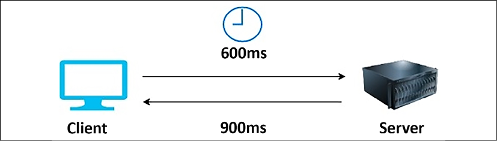
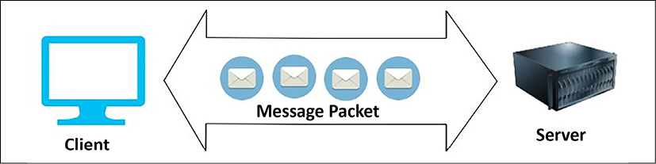
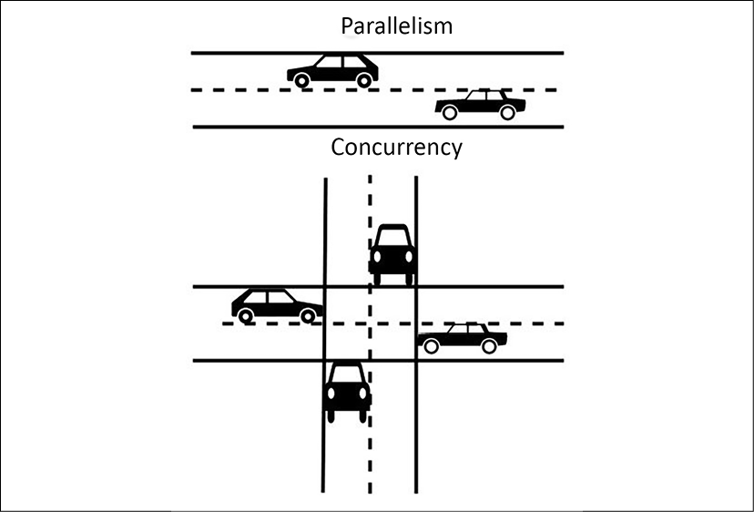
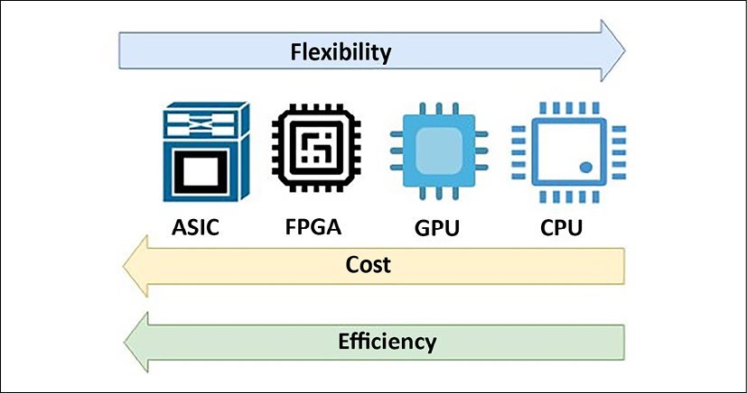
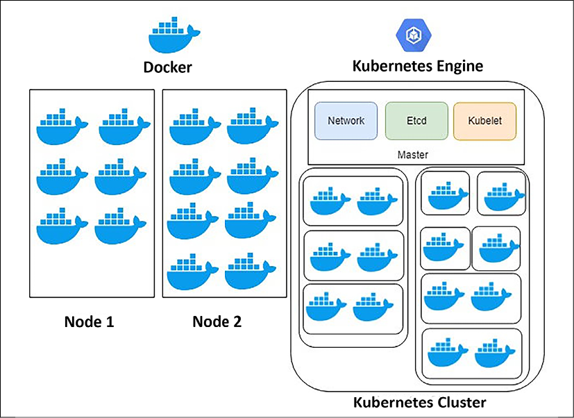
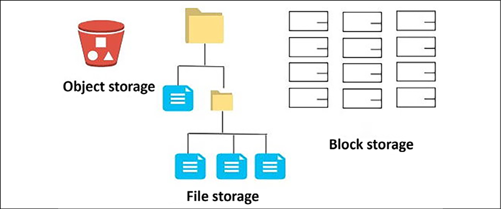
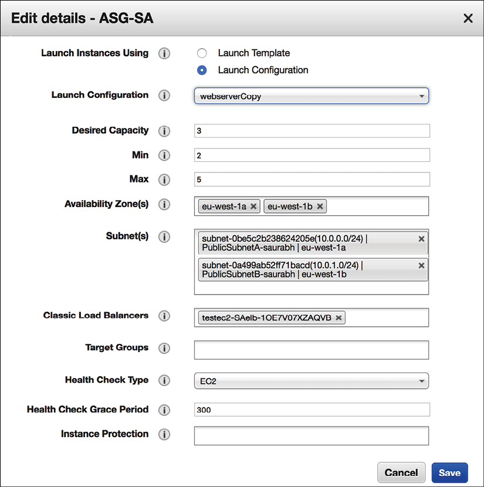

# 性能注意事项

在这个快速互联网时代，用户期望非常高性能的应用程序。已有实验表明，应用程序加载延迟的每一秒都会导致组织收入的重大损失。因此，应用程序的性能是解决方案设计的最关键属性之一，它会影响你的产品采用率增长。

在上一章中，你了解了可用于解决复杂业务问题的各种解决方案架构设计模式。在本章中，你将了解优化应用程序以获得最佳性能的最佳实践。你将学习可用于优化解决方案架构性能的各种设计原则。在这里，需要在架构的每一层和每个组件中优化性能。

你将了解如何在架构的各个层选择正确的技术，以不断提高应用程序的性能。你将在本章中学习如何遵循性能优化的最佳实践。我们将特别关注以下主题：

- 架构性能的设计原则
- 性能优化的技术选择
- 性能监控

到本章结束时，你将了解性能改进的重要属性，例如延迟、吞吐量和并发性。你将能够就技术选择做出更好的决策，这可以帮助你提高架构各个层的性能，例如计算、存储、数据库和网络。

## 架构性能的设计原则

架构性能效率侧重于使用应用程序基础架构和资源来满足不断增长的需求和技术评估。技术供应商和开源社区不断努力提高应用程序的性能。通常，由于害怕改变和承担风险，大型企业继续使用遗留的编程语言和技术。随着技术的发展，它通常会解决关键的性能问题，应用程序中技术的进步有助于提高应用程序性能。

许多大型公共云提供商，例如亚马逊网络服务 (**AWS**)、微软 Azure 和谷歌云平台 (**GCP**)，都提供技术即服务。这使得以最少的努力更有效地采用复杂技术变得更加容易——例如，你可以使用存储即服务来管理大量数据，或者使用 NoSQL 数据库作为托管服务来为你的应用程序提供高性能的可扩展性。

现在，组织可以利用内容分发网络 (**CDN**) 在用户位置附近存储大量图像和视频数据，以减少网络延迟并提高性能。借助边缘位置，可以更轻松地在离用户群更近的地方部署工作负载，这有助于通过减少网络延迟来优化应用程序性能。

随着服务器虚拟化，你可以更加敏捷地试验你的应用程序，并且可以应用高度自动化。敏捷性可帮助你试验并确定最适合你的应用程序工作负载的技术和方法。例如，你可以选择你的服务器部署是应该用于虚拟机、容器，还是将无服务器与 AWS Lambda(一种功能即服务 (**FaaS**))结合使用。让我们看看一些重要的设计原则，以考虑你的工作负载性能优化。

### 减少延迟

延迟可能是你产品采用的一个重要因素，因为用户正在寻找更快的应用程序。无论你的用户位于何处，你都需要为你的产品增长提供可靠的服务。你可能无法实现零延迟，但目标应该是将响应时间减少到用户容忍范围内。

延迟是用户发送请求和收到所需响应之间的时间延迟。

下图显示了一个示例，其中客户端向服务器发送请求需要 600 毫秒，服务器需要 900 毫秒进行响应，这引入了 1.5 秒(1500 毫秒)的总延迟：

图 7.1：客户端-服务器模型中的请求-响应延迟

现在，任何应用程序都需要访问互联网才能拥有多样化的全球用户。这些用户期望性能的一致性，无论他们身在何处。这有时具有挑战性，因为通过网络将数据从世界的一个地方移动到另一个地方需要时间。

网络延迟可能由多种因素引起，例如网络传输介质、路由器跳数和网络传播。通常，通过 Internet 发送的请求会跨越多个路由器，这会增加延迟。企业通常使用光纤线路在企业网络和云之间建立连接，这有助于避免不一致。

除了网络引起的问题外，体系结构的各个组件也会出现延迟。由于内存和处理器问题，你的计算服务器可能在基础架构级别存在延迟问题，其中 CPU 和 RAM 之间的数据传输速度很慢。由于读写过程缓慢，磁盘可能会有延迟。硬盘驱动器 (**HDD**) 的延迟取决于选择磁盘内存扇区并将其自身定位在磁头下进行读写所需的时间。

> 磁盘内存扇区是数据在内存盘中的物理位置。在硬盘驱动器中，写入操作时数据分布在内存扇区中，因为磁盘不断旋转，因此可以随机写入数据。在读操作过程中，磁头需要等待旋转将其带到磁盘内存扇区。

在数据库级别，延迟可能是由于硬件瓶颈或查询处理缓慢而导致的数据库数据读取和写入速度缓慢造成的。通过分区和分片分布数据来减轻数据库负载有助于减少延迟。

来自需要在应用程序级别使用垃圾收集和多线程处理的代码的事务处理可能存在问题。实现低延迟意味着更高的吞吐量，因为延迟和吞吐量直接相关，所以让我们更多地了解吞吐量。

### 提高吞吐量

网络吞吐量是在给定时间发送和接收的数据量。同时，当用户在应用程序中发起请求并获得响应时，定义了延迟。在网络方面，带宽起着重要作用。

> 带宽决定了可以通过网络传输的最大数据量。

吞吐量和延迟在协同工作时具有直接关系。较低的延迟意味着高吞吐量，因为更多的数据可以在更短的时间内传输。为了更好地理解这一点，让我们以一个国家的交通基础设施为例。

假设有车道的高速公路是网络管道，汽车是数据包。假设给定的高速公路在 2 个城市之间有 16 条车道。并非所有车辆都能在期望的时间到达目的地；他们可能会因为交通拥堵、车道关闭或事故而延误。在这里，延迟决定了汽车从一个城市行驶到另一个城市的速度，而吞吐量告诉我们有多少辆汽车可以到达目的地。对于网络，由于错误和流量拥塞，使用全带宽具有挑战性。

网络吞吐量是通过网络发送的数据量来衡量的，单位为比特每秒 (bps)。网络带宽是它可以处理的网络管道的最大尺寸。下图说明了客户端和服务器之间传输的数据量：

图 7.2：网络中的吞吐量

除了网络，吞吐量也适用于磁盘级别。磁盘吞吐量由每秒输入/输出操作数 (**IOPS**) 和请求的数据量(I/O 大小)等因素决定。使用以下公式以每秒兆字节 (**Mbps**) 为单位确定磁盘吞吐量：

平均 I/O * I/OPS = 吞吐量  (MB/s)

因此，如果你的磁盘 IOPS 为 20,000，I/O 大小为 4 KB(4,096 字节)，则吞吐量将为 81.9 MB/s(20,000 x 4,096，从字节转换为兆字节)。

I/O 请求和磁盘延迟有直接关系。 I/O 分别表示写入和读取，而磁盘延迟是每个 I/O 请求从磁盘接收响应所花费的时间。延迟以毫秒为单位测量，应该是最小的。它受磁盘每分钟转数 (**RPM**) 的影响。 IOPS 是磁盘每秒可以服务的操作数。

在操作系统级别，吞吐量取决于每秒 CPU 和 RAM 之间的数据传输量。在数据库级别，吞吐量取决于数据库每秒可以处理的事务数。在应用程序级别，你的代码需要处理每秒可以处理的事务，方法是借助垃圾收集处理和内存缓存的有效使用来管理应用程序内存。

当你查看延迟、吞吐量和带宽时，还有另一个因素称为并发性，它适用于体系结构的各个组件并有助于提高应用程序性能。让我们了解更多关于并发的知识。

### 处理并发

并发性是解决方案设计的一个关键因素，因为你希望你的应用程序一次处理多个任务。例如，你的应用程序需要同时处理多个用户并在后台处理他们的请求。另一个例子是当你的网络用户界面需要收集和处理网络 cookie 数据以了解用户与产品的交互时，同时向用户显示他们的个人资料信息和产品目录。并发是关于同时执行多个任务。

人们经常混淆并行性和并发性，认为它们是同一回事。但是，并发不同于并行。在并行性中，你的应用程序将一个巨大的任务分成更小的子任务，它可以并行处理这些子任务，并为每个子任务分配一个专用资源。然而，在并发中，应用程序通过利用线程之间的共享资源同时处理多个任务。

应用程序可以在处理过程中从一个任务切换到另一个任务，这意味着代码的关键部分需要使用锁和信号量来管理。

如下图所示，并发就像一个交通灯信号，交通流在所有四个车道之间切换以保持交通畅通。由于只有一条线程可以传递所有流量，因此当一个通道中的流量处于清理过程中时，其他通道中的处理必须停止。在平行的情况下，有一条平行车道可用，所有的车都可以平行行驶，互不干扰，如下图所示：

图 7.3：并发与并行

除了应用层面的事务处理，并发还需要应用在网络层面，多台服务器共享相同的网络资源。当用户尝试通过网络连接到 Web 服务器时，需要处理 Web 服务器的许多网络连接。它需要处理活动请求并关闭已完成或超时请求的连接。在服务器级别，你会看到分配了多个 CPU 或一个多核处理器。这些有助于处理并发性，因为服务器可以处理更多线程以同时完成各种任务。

在内存层面，共享内存并发模型有助于实现并发。在这个模型中，并发模块使用共享内存相互交互。它可以是在同一台服务器上运行并共享文件系统以进行读写的两个程序。此外，可能有两个处理器或处理器内核共享同一内存。服务器中的磁盘可能会遇到两个程序试图写入同一内存块的并发情况。并发 I/O 通过允许磁盘同时读取和写入文件来帮助提高磁盘并发性。

数据库始终是架构设计的中心点。并发性在数据处理中起着至关重要的作用，因为数据库应该能够同时响应多个请求。数据库并发性更复杂，因为一个用户可能正在尝试读取记录，而另一个用户正在同时更新它。数据库应仅在完全保存后才允许查看数据。在另一个用户尝试更新数据之前，确保数据已完全提交。缓存有助于显着提高性能；让我们了解架构中的一些不同缓存类型。

### 应用缓存

在第 6 章解决方案架构设计模式中，你在基于缓存的架构部分学习了如何在架构的各个级别应用缓存。缓存有助于显着提高应用程序性能。尽管你通过添加外部缓存引擎和技术(如 **CDN**)了解了应用于缓存的不同设计模式，但必须了解几乎每个应用程序组件和基础架构都有缓存机制。利用每一层的缓存机制可以帮助减少延迟并提高应用程序的性能。

CPU 在服务器级别有它的硬件缓存，这减少了从主内存访问数据时的延迟。 CPU缓存包括指令缓存和数据缓存；数据缓存存储经常使用的数据的副本。缓存也应用于磁盘级别，但它由操作系统软件管理(称为页面缓存)；然而，CPU 缓存完全由硬件管理。磁盘缓存源自辅助存储，例如 HDD 或固态驱动器 (**SSD**)。经常使用的数据存储在主内存的未使用部分(即作为页面缓存的 RAM，这样可以更快地访问内容)。

通常，数据库有一个缓存机制，可以保存来自数据库的结果以更快地响应。数据库有一个内部缓存，可以根据你的使用模式在缓存中准备好数据。他们还有一个查询缓存，如果你多次进行查询，可以将数据保存在主服务器内存 (RAM) 中。如果表内数据发生任何更改，查询缓存将被清除。如果服务器内存不足，则会删除最早的查询结果以腾出空间。

你在网络级别有一个 DNS 缓存，它存储服务器本地的 Web 域名和相应的 IP 地址。如果你重新访问同一个网站域名，DNS 缓存允许快速 DNS 查找。 DNS 缓存由操作系统管理，包含所有最近访问的网站。你在第 6 章"解决方案架构设计模式"中了解了客户端缓存机制，例如浏览器缓存和各种缓存引擎，例如 Memcached 和 Redis。

在本节中，你了解了原始设计因素，例如延迟、吞吐量、并发性和缓存，这些因素需要解决以进行架构性能优化。架构的每个组件(无论是服务器级别的网络还是数据库级别的应用程序)都有一定程度的延迟和需要处理的并发问题。

你应该设计你的应用程序以获得所需的性能，因为提高性能需要付出代价。性能优化的细节可能因应用程序而异。解决方案架构需要相应地指导工作——例如，股票交易应用程序甚至不能容忍亚毫秒级的延迟。另一方面，电子商务网站可以忍受几秒钟的延迟。让我们了解如何为各种架构级别选择技术以克服性能挑战。

## 性能优化的技术选择

在第 6 章解决方案架构设计模式中，你了解了各种设计模式，包括微服务、事件驱动、基于缓存和无状态。组织可以根据其解决方案的设计需求选择这些设计模式的组合。根据你的工作负载，你可以采用多种架构设计方法。一旦你确定了策略并开始实施解决方案，下一步就是优化你的应用程序。要优化你的应用程序，你需要根据应用程序的性能要求执行负载测试和定义基准测试来收集数据。

性能优化是一个持续改进的过程，在这个过程中，你需要从解决方案设计之初到应用程序启动之后都了解最佳资源利用率。你需要根据工作负载选择正确的资源或调整应用程序和基础架构配置。例如，你可能希望选择一个 NoSQL 数据库来存储应用程序的会话状态，并将事务存储在关系数据库中。

出于分析和报告目的，你可以通过将数据从应用程序数据库加载到数据仓库解决方案并从那里创建报告来卸载生产数据库。

对于服务器，你可能希望选择虚拟机或容器。你可以采用完全无服务器的方法来构建和部署你的应用程序代码。无论你的方法和应用程序工作负载如何，你都需要选择主要资源类型：计算、存储、数据库和网络。让我们看一下有关如何选择这些资源类型以进行性能优化的更多详细信息。

### 做出计算选择

在本节中，你将看到使用术语计算而不是服务器，因为如今软件部署不限于服务器。 AWS 等公共云提供商提供无服务器产品，你不需要服务器即可运行你的应用程序。最受欢迎的 FaaS 产品之一是 AWS Lambda。与 AWS Lambda 一样，其他流行的公共云提供商在 FaaS 领域扩展了他们的产品——例如，Microsoft Azure 有 Azure Functions，而 GCP 提供了 Google Cloud Functions。

但是，组织仍然会默认选择带有虚拟机的服务器。现在，随着对自动化和资源利用的需求增加，容器也变得流行起来。容器正在成为首选，尤其是在微服务应用程序部署领域。计算的最佳选择——无论你是要选择服务器实例、容器，还是选择无服务器——取决于应用程序用例。让我们看看可用的各种计算选择。

#### 选择服务器实例
如今，随着虚拟服务器成为常态，术语实例变得越来越流行。这些虚拟服务器提供了灵活性和更好地利用资源。特别是对于云产品，所有云提供商都提供虚拟服务器，只需单击 Web 控制台或 API 调用即可进行配置。服务器实例有助于自动化并提供基础设施即代码，其中一切都可以在任何地方实现自动化。

随着工作负载的变化，你可能更喜欢可用的不同类型的处理单元选择之一。让我们看看一些最流行的处理能力选项：

- **中央处理器 (CPU)**：CPU 是最流行的计算处理选择之一。 CPU 易于编程，支持多任务处理，最重要的是，它的通用性足以适用于任何地方，这使它们成为通用应用程序的首选。 CPU的功能是以GHz(千兆赫兹)来衡量的，这表明CPU速度的时钟速率是以每秒十亿次循环为单位的。CPU 的价格很低；但是，它们不能很好地进行并行处理，因为 CPU 具有顺序处理的主要功能。
- **图形处理单元 (GPU)**：顾名思义，GPU 最初设计用于处理图形应用程序并提供强大的处理能力。随着数据量的增长，需要利用大规模并行处理(MPP)来处理数据。对于机器学习等大数据处理用例，GPU 已成为显而易见的选择，并用于许多计算密集型应用程序。你可能听说过 tera 浮点运算 (TFLOP) 作为 GPU 计算能力的单位。万亿次浮点运算是指处理器每秒计算一万亿次浮点运算的能力。GPU 由数千个小内核组成，而 CPU 则只有很少的大内核。 GPU 有一种机制，可以使用 CUDA 编程创建数千个线程，每个线程都可以并行处理数据，这使得处理速度非常快。 GPU 比 CPU 贵一点。在处理能力方面，你会发现 GPU 对于需要图像分析、视频处理和信号处理的应用程序来说处于成本和性能的最佳平衡点。但是，它们会消耗大量功率，并且可能无法使用需要更多定制处理器的特定算法。
- **现场可编程门阵列 (FPGA)**：FPGA 与 CPU 或 GPU 有很大不同。它们是可编程硬件，具有灵活的逻辑元素集合，可以针对特定应用重新配置，安装后可以更改。 FPGA 的功耗比 GPU 低得多，但也不太灵活。它们可以容纳 MPP，还提供将它们配置为 CPU 的功能。总体而言，FPGA 成本较高，因为它们需要针对每个应用程序进行定制，并且需要更长的开发周期。 FPGA 在顺序操作方面可能表现不佳，而且在触发器(浮点操作)方面也不是很好。
- **专用集成电路 (ASIC)**：ASIC 是针对特定应用专门构建的定制集成电路优化——例如，特定于深度学习 TensorFlow 包，谷歌将其作为张量处理单元 (TPU) 提供。它们可以针对应用进行定制设计，以实现功耗和性能的最佳组合。由于开发周期最长，ASIC 会产生高成本，并且你必须针对任何更改执行硬件级重新设计。

下图显示了前面列表中提到的处理类型之间的比较。在这里，ASIC 是最有效的，但需要更长的开发周期才能实现。 ASIC 提供最佳性能，但再利用的灵活性最低，而 CPU 非常灵活，可以适应许多用例：

图 7.4：CPU、GPU、FPGA 和 ASIC 之间的比较

如上图所示，从成本上看，CPU是最便宜的，ASIC是最贵的。如今，CPU 已成为一种商品，并随处用于通用设备以降低成本。 GPU 以计算密集型应用而闻名，而 FPGA 则成为需要更多定制性能的首选。你将看到公共云提供商(例如 AWS)提供的这些处理选项。除了 CPU 之外，Amazon Elastic Cloud Compute (EC2) 产品还提供大量使用 GPU 的 P 系列实例。 F 系列实例提供 FPGA 用于自定义硬件加速。

在本节中，你了解了最流行的计算选择。你可能听说过其他类型的处理器，例如加速处理单元 (APU)。 APU 结合了 CPU、GPU 和数字信号处理器 (DSP)，经过优化以分析模拟信号，然后需要实时进行高速数据处理。让我们更多地了解其他流行的计算类型容器，这些容器因其优化虚拟机内资源使用的能力而迅速流行起来。

#### 使用容器
在第 6 章解决方案架构设计模式中，你在标题为使用容器部署应用程序的部分了解了容器部署及其优势。由于易于自动化和资源利用效率，使用容器正在成为部署复杂微服务应用程序的规范。有多种平台可用于容器部署。

由于其受欢迎程度和独立于平台的能力，容器成为构建与云无关的平台的首选。你可以在本地数据中心部署容器并通过云管理它们。此外，你可以采用重定位方法将容器从本地移动到云端，而无需进行任何更改。

你可以使用容器构建多云平台，现在每个主要的公共云供应商都提供工具来管理分布在多个平台上的容器环境。例如，AWS 提供 ECS Anywhere，使你能够轻松地在客户管理的基础设施上运行和管理容器工作负载。同样，GCP 提供了 Google Anthos，它可以让你跨本地和其他云平台进行容器管理。让我们了解一下容器领域中一些最流行的选择、它们的区别以及它们如何协同工作。

##### Docker

Docker 是最受欢迎的技术之一。它允许你将应用程序及其相关依赖项打包为一个容器，并将其部署到任何操作系统平台。 Docker 为软件应用程序提供独立于平台的功能，使整个软件开发、测试和部署过程得到简化和更易于访问。

Docker 容器映像可通过本地网络或使用 Docker Hub 通过 Internet 从一个系统移植到另一个系统。你可以使用 Docker Hub 容器存储库管理和分发容器。如果你对 Docker 映像进行任何更改导致你的环境出现问题，则可以轻松恢复到容器映像的工作版本，从而更轻松地进行整体故障排除。

Docker 容器可帮助你构建更复杂的多层应用程序。例如，假设你需要同时运行应用程序服务器、数据库和消息队列。

在这种情况下，你可以使用不同的 Docker 映像并行运行它们，然后在它们之间建立通信。这些层中的每一层都可能有库的修改版本，而 Docker 允许它们在同一台计算机上运行而不会发生冲突。

在使用 Docker 时，开发团队会构建一个应用程序并将其与所需的依赖项打包到一个容器镜像中。此应用程序映像在 Docker 主机上的容器中运行。就像你在 GitHub 等代码库中管理代码一样，Docker 镜像也应该存储在注册表中。 Docker Hub是一个公共注册中心，其他公有云厂商也提供自己的注册中心，例如**AWS ECR(Elastic Container Registry)**和**Azure Container Registry**。此外，你可以在本地为自己的 Docker 映像创建私有注册表。

AWS 等公共云提供商提供容器管理平台，例如 Amazon Elastic Container Service (**ECS**)。容器管理有助于在云虚拟机 Amazon EC2 之上管理 Docker 容器。 AWS 还提供了使用 Amazon Fargate 进行容器部署的无服务器选项，你可以在其中部署容器而无需预置虚拟机。

复杂的企业应用程序是基于可能跨越多个容器的微服务构建的。将各种 Docker 容器作为一个应用程序的一部分进行管理可能会非常复杂。 Kubernetes 有助于解决多容器环境的挑战；让我们进一步了解 Kubernetes。

##### Kubernetes

Kubernetes 可以轻松管理和控制生产环境中的多个容器。你可以将 Kubernetes 视为容器编排系统。你可以在裸机(物理服务器)或称为 Docker 主机的虚拟机节点中托管 Docker 容器，Kubernetes 可以跨这些节点的集群进行协调。

Kubernetes 通过在任何应用程序错误的情况下替换无响应的容器来使你的应用程序自我修复。它还提供水平扩展能力和蓝绿部署能力，以防止任何停机。 Kubernetes 在容器之间分配传入的用户流量负载，并管理各个容器共享的存储。

如下图所示，Kubernetes 和 Docker 可以很好地协同工作来编排你的软件应用程序。 Kubernetes 处理 Docker 节点和 Docker 容器之间的网络通信：

图 7.5：Docker 和 Kubernetes

Docker 作为应用程序的一个单独部分工作，而 Kubernetes 负责编排以确保所有这些部分按设计一起工作。使用 Kubernetes 可以更轻松地自动化整体应用程序部署和扩展。在 Docker 中，容器托管在节点中，单个节点中的每个 Docker 容器共享相同的 IP 空间。在 Docker 中，你需要通过处理任何 IP 冲突来管理容器之间的连接。 Kubernetes 通过拥有一个主实例来跟踪所有托管容器的节点来解决这个问题。

Kubernetes 的主节点负责分配 IP 地址并托管用于容器配置的键值存储和管理容器的 kubelet。 kubelet 是在每个节点上运行的主要"节点代理"，可确保 Pod 中定义的容器启动并继续运行。 Docker 容器被分组到 pod 中，它们共享相同的 IP 地址。整个设置称为 Kubernetes 集群。

在 Kubernetes 迅速流行的同时，还有其他选项可用，例如 Docker 本身构建的 Docker Swarm。 Docker Swarm 是一种容器编排工具，它允许用户管理部署在多台主机上的多个容器。然而，Swarm 没有像 Kubernetes 这样的基于 Web 的界面，也不提供自动缩放和外部负载平衡。

Kubernetes 学习起来很复杂。 AWS 等公有云提供商提供 Amazon Elastic Kubernetes Service (**EKS**) 来简化 Kubernetes 集群的管理。 OpenShift 是另一个由 Red Hat 管理的 Kubernetes 发行版，作为平台即服务 (PaaS) 提供。同样，Microsoft Azure 提供 Azure Kubernetes Service (**AKS**)，GCP 提供 Google Kubernetes Engine (**GKE**)，提供一种自动部署、扩展和管理 Kubernetes 的简单方法。

总的来说，容器为整个应用基础设施增加了一层虚拟化。虽然它们有助于资源利用，但如果需要超低延迟，你可能希望为你的应用程序部署选择裸机物理机。

##### 无服务
近年来，由于亚马逊、谷歌和微软等云提供商提供的公共云产品的流行，无服务器计算已成为可能。无服务器计算允许开发人员专注于他们的代码和应用程序开发，而无需担心底层基础设施的供应、配置和扩展。无服务器产品从开发人员那里抽象出服务器管理和基础设施决策，让他们专注于自己的专业领域和他们试图解决的业务问题。无服务器计算带来了相对较新的功能即服务 (**FaaS**) 概念。

FaaS 产品可使用 AWS Lambda、Microsoft Azure Functions 和 Google Cloud Functions。你可以在云编辑器中编写代码，AWS Lambda 会处理底层的计算基础设施以运行和扩展你的功能。你可以通过使用 Amazon API Gateway 和 AWS Lambda 函数添加 API 端点来设计基于事件的架构或 RESTful 微服务。 Amazon API Gateway 是一项托管云服务，它添加了 RESTful API 和 WebSocket API 作为 Lambda 函数的前端，并支持应用程序之间的实时通信。你可以进一步将你的微服务分解为可以自动和独立扩展的小任务。

除了专注于你的代码，你永远不必为 FaaS 模型中的闲置资源付费。无需扩展整个服务，你可以使用内置的可用性和容错功能独立扩展所需的功能。

但是，如果你有数千个功能需要编排，这可能是一项非常艰巨的任务，并且预测自动缩放成本可能很棘手。它非常适合安排作业、处理 Web 请求或排队消息。

在本节中，你了解了各种计算选择，查看了服务器实例、无服务器选项和容器。你需要根据应用程序的要求选择这些计算服务。没有规则强制你选择特定类型的计算；这完全取决于你的组织对技术的选择、创新的步伐以及软件应用程序的性质。

但是，一般来说，对于单体应用程序，你可以坚持使用虚拟机或裸机，而对于复杂的微服务，你可以选择容器。对于简单的任务调度或基于事件的应用程序，你可以将无服务器功能作为一个显而易见的选择。许多组织完全在无服务器上构建了复杂的应用程序，这有助于他们降低成本并实现高可用性，而无需管理任何基础设施。

让我们了解基础架构的另一个重要方面，以及它如何帮助你优化性能。

### 选择存储

存储是应用程序性能的关键因素之一。 任何软件应用程序都需要与存储交互以进行安装、记录和访问文件。 存储的最佳解决方案将因以下因素而异：

|  访问方法  |                 块、文件或对象                 |
| :--------: | :--------------------------------------------: |
|  访问模式  |                   顺序或随机                   |
|  访问频率  |          在线(热)、离线(暖)或归档(冷)          |
|  更新频率  |         一次写入多次读取 (WORM) 或动态         |
| 访问可用性 |               需要时的存储可用性               |
| 存取耐久性 | 数据存储的可靠性，以最大限度地减少任何数据丢失 |
| 访问吞吐量 |     每秒 IOPS 和数据读/写(以 MB 为单位)。      |

这些取决于你的数据格式和可伸缩性需求。你首先需要决定你的数据是存储在块存储、文件存储还是对象存储中。这些是以不同方式存储和呈现数据的存储格式。让我们更详细地看一下。

#### 使用块存储和存储区域网络
块存储将数据分成块，并将它们存储为数据块。每个块都有一个唯一的 ID，允许系统将数据放在最容易访问的地方，因为块不存储有关文件的任何元数据。因此，基于服务器的操作系统管理和使用硬盘驱动器中的这些块。每当系统请求数据时，存储系统收集块并将结果返回给用户。部署在存储区域网络 (SAN) 中的块存储可以高效、可靠地存储数据。它适用于需要存储和频繁访问大量数据的情况——例如，数据库部署、电子邮件服务器、应用程序部署和虚拟机。

SAN 存储非常复杂，支持复杂的关键任务应用程序。它是一种高性能的存储系统，在服务器和存储之间进行块级数据通信；然而，SAN 的成本非常高，应该用于需要低延迟的大型企业应用程序。

要配置基于块的存储，你必须在 SSD 和 HDD 之间进行选择。 HDD 是服务器和企业存储阵列的传统数据存储系统。 HDD 更便宜，但它们速度更慢并且需要更多的电力和冷却。 SSD 使用半导体芯片并且比 HDD 更快。它们的成本要高得多；然而，随着技术的发展，SSD 变得更加实惠并因其效率以及更低的功耗和冷却要求而受到欢迎。

#### 使用文件存储和网络区域存储
文件存储由来已久，应用广泛。在文件存储中，数据存储为一条信息，并组织在文件夹中。当需要访问数据时，提供文件路径，获取数据文件；但是，随着文件嵌套在多个文件夹层次结构下，文件路径可能会变得复杂。每条记录都有有限的元数据，包括文件名、创建时间和更新的时间戳。你可以将书籍存放在抽屉中的图书馆进行类比，并记下每本书存放的位置。

网络区域存储 (**NAS**) 是一种文件存储系统，它连接到网络并向用户显示他们可以存储和访问文件的位置。 NAS 还管理用户权限、文件锁定和其他保护数据的安全机制。 NAS 适用于文件共享系统和本地存档。在存储数十亿个文件时，NAS 可能不是正确的解决方案，因为它具有有限的元数据信息和复杂的文件夹层次结构。要存储数十亿个文件，你需要使用对象存储。让我们进一步了解对象存储及其相对于文件存储的优势。

#### 使用对象存储和云数据存储
对象存储将数据与唯一标识符和可定制的元数据捆绑在一起。与文件存储中的分层地址或块存储中分布在一大块块上的地址相比，对象存储使用平面地址空间。无论数据存储在何处，平面地址空间都可以更轻松地定位数据并更快地检索数据。对象存储还可以帮助用户实现存储的无限扩展性。

对象存储元数据可以有很多细节，比如对象名称、大小、时间戳等，用户可以自定义它来添加比文件存储中的标记更多的信息。数据可以通过简单的 API 调用访问，并且存储起来非常划算。对象存储最适合大容量、非结构化数据；然而，对象不能被修改而只能被替换，这使得它不是一个好的数据库用例。

云数据存储，例如 Amazon Simple Storage Service (**S3**)，提供具有高可用性和持久性的无限可扩展对象数据存储。你可以访问具有唯一全局标识符和元数据文件前缀的数据。下图简要显示了所有三个存储系统：

图 7.6：数据存储系统

如上图所示，块存储以块的形式存储数据。当你的应用程序需要非常低的延迟和单个实例的数据存储访问时，你应该使用块存储。文件存储将数据存储在分层文件夹结构中，延迟开销很小。当一个单独的房间需要访问多个实例时，你应该使用文件存储系统。对象存储将数据存储在具有对象唯一标识符的桶中。它提供 Web 访问以减少延迟并提高吞吐量。你应该使用对象存储来存储和访问静态内容，例如图像和视频。你可以在对象存储中存储大量数据并进行大数据处理和分析。

直连存储(**DAS**)是另一种直接连接到主机服务器的数据存储；但是，它的可扩展性和存储容量非常有限。磁带驱动器是另一种流行的备份和归档存储系统。由于其低成本和高可用性，磁带驱动器用于存档目的但具有高延迟，使其不适合用于直接应用。

通常，你需要提高关键任务应用程序的吞吐量和数据保护，例如数据存储在 SAN 存储中的事务数据库；但是，单个 SAN 存储的容量和吞吐量可能有限。你可以使用独立磁盘冗余阵列 (RAID) 配置来克服这种情况。 RAID 是一种在多个磁盘上存储数据的方法。它可以防止数据因驱动器故障而丢失，并通过将各种磁盘条带化来提高磁盘吞吐量。

RAID使用磁盘镜像或磁盘条带化技术，但对于操作系统而言，RAID是单个逻辑磁盘。 RAID 有不同的级别来区分配置类型。例如，RAID 0 使用磁盘条带化并提供最佳性能但没有容错，而 RAID 1 是磁盘镜像。它复制了数据存储，并没有为写入操作提供性能改进，但使读取性能翻倍。你可以将 RAID 0 和 RAID 1 组合成 RAID 10，也称为 RAID 1+0。它有助于在高吞吐量和容错方面取得最佳效果。它至少需要四个磁盘并跨镜像对条带化数据。

选择与你的访问模式相匹配的存储解决方案以最大限度地提高性能。云产品提供了多种选项供你选择块、文件和对象存储方法。例如，公有云 AWS 提供 Amazon Elastic Block Store (**EBS**) 作为云中 SAN 类型的存储，以及 Amazon Elastic File System (**EFS**) 作为云中 NAS 类型存储。 Amazon S3 在对象存储方面非常受欢迎。同样，Microsoft Azure 提供用于 SAN 的 Azure 磁盘存储、用于 NAS 的 Azure 文件和用于块存储的 Azure Blob。不同的存储解决方案允许你根据访问模式选择存储方法，无论是在本地环境中工作还是在云原生环境中工作。

现在你已经了解了实现最佳性能所需的计算和存储选择，让我们看看应用程序开发的下一个关键组件：数据库。根据正确的需求选择正确的数据库将帮助你最大限度地提高应用程序性能并降低整体应用程序延迟。有不同类型的数据库可用，选择正确的数据库至关重要。

### 选择数据库

通常，你会希望标准化一个通用平台并使用数据库以便于管理；但是，你应该考虑根据你的数据要求使用不同的数据库解决方案。选择不正确的数据库解决方案会影响系统延迟和性能。数据库的选择可能因应用程序对可用性、可伸缩性、数据结构、吞吐量和持久性的要求而异。选择使用数据库时需要考虑多个因素。例如，访问模式会显着影响数据库技术的选择。如果你根据访问模式优化数据库，那将是最好的。

数据库通常有一个用于工作负载优化的配置选项。你应该考虑内存、缓存、存储优化等配置。你还应该探索有关可伸缩性、备份、恢复和维护的数据库技术的操作方面。让我们看看可用于满足应用程序数据库要求的不同数据库技术。

#### 在线交易处理
大多数传统的关系数据库被认为使用联机事务处理(**OLTP**)。事务数据库是最古老和最流行的存储和处理应用程序数据的方法。关系型 OLTP 数据库的一些示例包括 Oracle、Microsoft SQL Server、MySQL、PostgreSQL、Amazon RDS 等。 OLTP 的数据访问模式涉及通过查找其 ID 来获取小型数据集。数据库事务意味着所有相关的数据库更新都已完成或均未完成。

关系模型允许在应用程序中处理复杂的业务事务，例如银行、贸易和电子商务。它将使你能够使用跨表的多个连接来聚合数据并创建复杂的查询。在优化关系数据库时，你需要考虑包括以下优化：

- 包括计算、内存、存储和网络的数据库服务器
- 操作系统级设置，例如存储卷的 RAID 配置、卷管理和块大小
- 根据需要配置数据库引擎和分区
- 与数据库相关的选项，例如架构、索引和视图

关系数据库的扩展可能很棘手，因为它可以垂直扩展并达到系统容量的上限。对于水平缩放，你必须读取副本以进行读取缩放和分区以进行写入缩放。在上一章中，你在标题为应用程序体系结构中的数据库处理的部分中学习了如何扩展关系数据库。

OLTP数据库适用于大型复杂的事务性应用；但是，在需要聚合和查询大量数据的情况下，它们无法很好地扩展。此外，随着互联网的蓬勃发展，大量的非结构化数据无处不在，关系数据库无法开箱即用地有效处理非结构化数据。在这种情况下，NoSQL 数据库可以派上用场。让我们进一步了解如何处理非关系数据库。

#### 非关系数据库
社交媒体程序、物联网 (**IoT**)、点击流数据和日志等应用程序会生成大量非结构化和半结构化数据，这些数据具有非常动态的模式。对于每组记录，这些数据类型可能具有不同的模式。将此数据存储在关系数据库中可能是一项非常乏味的任务。一切都必须以固定模式归档，这可能导致大量空值或数据丢失。非关系或 NoSQL 数据库为你提供了存储此类数据的灵活性，而无需担心固定模式。每条记录可以有可变数量的列，并且可以存储在同一个表中。

NoSQL 数据库可以存储大量数据并提供低访问延迟。它们很容易通过在需要时添加更多节点来扩展，并且可以支持开箱即用的水平扩展。它们是存储用户会话数据并使你的应用程序无状态以实现水平扩展而不影响用户体验的绝佳选择。你可以在 NoSQL 数据库之上开发分布式应用程序，这提供了良好的延迟和扩展性，但查询连接必须在应用程序层处理。 NoSQL 数据库不支持复杂的查询，例如连接表和实体。

NoSQL 数据库有多种选择，例如 Cassandra、HBase 和 MongoDB，你可以将它们安装在虚拟机集群中；然而，类似于公共云的 AWS 提供了一个名为 Amazon DynamoDB 的托管 NoSQL 数据库，它提供了具有无限扩展的高吞吐量亚毫秒延迟。

你可以将 OLTP 用于关系数据库，但它的存储容量有限。它不能很好地响应对大量数据的查询，并根据数据仓库的要求执行聚合。数据仓库的需求更多是分析性的，而不是事务性的。联机分析处理(**OLAP**)数据库填补了OLTP数据库查询大数据集的空白。让我们进一步了解 OLAP 数据库。

#### 在线分析处理
OLTP 和 NoSQL 数据库有助于应用程序部署，但对大规模分析的能力有限。为了更快地访问结构化数据而设计的数据仓库平台可以更好地为分析目的查询大量结构化数据。现代数据仓库技术采用柱状格式并使用 MPP，这有助于更快地获取和分析数据。

当你只需要聚合一列数据时，分栏格式避免了扫描整个表格的需要——例如，如果你想要确定给定月份的库存销售情况。 order 表中可能有数百列，但你只需要聚合 purchase 列中的数据。使用列格式，你将只扫描购买列，与行格式相比，这减少了扫描的数据量并提高了查询性能。

使用 MPP，你可以在子节点之间以分布式方式存储数据，并向领导节点提交查询。根据你的分区键，领导节点会将查询分发给子节点，其中每个节点都会选择部分查询来执行并行处理。领导节点然后从每个子节点收集子查询结果并返回你的聚合结果。这种并行处理可帮助你更快地执行查询并更快地处理大量数据。

你可以通过在虚拟机上安装 IBM Netezza 或 Microsoft SQL Server 等软件来使用这种处理方式，或者你也可以寻求更多云原生解决方案，例如 Snowflake。 AWS 等公有云提供 PB 级数据仓库解决方案 Amazon Redshift，采用列式格式和 MPP。你将在第 13 章"解决方案架构的数据工程"中了解有关数据处理和分析的更多信息。

你需要存储和搜索大量数据，尤其是当你想要在日志中查找特定错误或构建文档搜索引擎时。对于这种功能，你的应用程序需要创建数据搜索功能。让我们进一步了解数据搜索。

#### 构建数据搜索功能
通常，你需要搜索大量数据才能快速解决问题或获得业务洞察力。搜索你的应用程序数据将帮助你访问详细信息并从不同的角度对其进行分析。要以低延迟和高吞吐量搜索数据，你需要将搜索引擎作为你的技术选择。

Elasticsearch 是最流行的搜索引擎平台之一，构建于 Apache Lucene 库之上。 Apache Lucene 是一个免费的开源软件库，是许多流行搜索引擎的基础。 **ELK**(Elasticsearch、Logstash 和 Kibana 的缩写)堆栈易于使用，可以发现大规模数据并将其编入索引以进行自动搜索。由于其特性，围绕 Elasticsearch 开发了多种用于可视化和分析的工具。例如，Logstash 与 Elasticsearch 一起收集、转换和分析应用程序的大量日志数据。 Kibana 有一个与 Elasticsearch 的内置连接器，为创建仪表板和分析索引数据提供了一个简单的解决方案。

Elasticsearch 可以部署在虚拟机中并水平扩展以通过向集群添加新节点来增加容量。公共云 AWS 提供托管服务 Amazon OpenSearch Service，使得在云中扩展和管理 Elasticsearch 集群经济高效且简单。

在本节中，你了解了各种数据库技术及其使用场合。你的应用程序可以针对其不同组件使用所有数据库技术的组合，以实现最佳性能。对于复杂事务，需要使用关系型OLTP数据库，存储和处理非结构化或半结构化数据，需要使用非关系型NoSQL数据库。如果在多个地理区域需要非常低的延迟，并且需要在应用程序层处理复杂的查询，例如游戏应用程序，你应该使用 NoSQL 数据库。如果你需要对结构化数据执行任何大规模分析，请使用数据仓库 OLAP 数据库。你可以使用缓存数据库来提高数据库的性能效率。你在第 6 章解决方案架构设计模式的 Memcached 与 Redis 一节中了解了 Redis 和 Memcached。

让我们看看你的体系结构的另一个关键组件，即网络。网络是整个应用程序的支柱，并在服务器和外界之间建立通信。让我们了解有关应用程序性能的网络。

### 提高网络性能

在这个世界上几乎每个角落都可以快速访问互联网的时代，预计应用程序将覆盖全球用户。系统响应时间的任何延迟取决于请求负载和最终用户与服务器的距离。如果系统无法及时响应用户请求，则会产生连锁反应，继续占用所有系统资源并堆积大量请求积压，从而降低整体系统性能。

为了减少延迟，你应该模拟用户的位置和环境以识别任何差距。根据你的发现，你应该设计服务器的物理位置和缓存机制以减少网络延迟；然而，应用程序的网络解决方案选择取决于网络速度、吞吐量和网络延迟要求。处理全球用户群的应用程序需要与其客户建立快速连接，而位置起着重要作用。 CDN 提供的边缘位置有助于本地化丰富的内容并减少整体延迟。

在第 6 章解决方案架构设计模式中，你在标题为基于缓存的架构的部分中学习了如何使用 CDN 将数据放在用户位置附近。有各种 CDN 解决方案可用于广泛的边缘位置网络。如果你的应用程序包含大量静态内容，你可以使用 CDN，你需要向最终用户提供大型图像和视频内容。一些比较流行的 CDN 解决方案是 Akamai、Cloudflare 和 Amazon CloudFront(由 AWS 云提供)。如果你的应用程序部署在全球范围内，让我们看看一些 DNS 路由策略以实现低延迟。

#### 定义 DNS 路由策略
要实现全球覆盖，你可能会在多个地理区域部署你的应用程序。当谈到用户请求路由时，你希望将他们的请求路由到最近和最快的可用服务器，以便你的应用程序快速响应。 DNS 路由器提供域名和 IP 地址之间的映射。它确保当用户输入域名时请求由正确的服务器提供服务——例如，当你在浏览器中输入 amazon.com 进行购物时，你的请求总是被路由到 Amazon 应用程序服务器 DNS 服务。

类似于公共云的 AWS 提供了一种名为 Amazon Route 53 的 DNS 服务，你可以在其中根据应用程序的需要定义不同类型的路由策略。 Amazon Route 53 提供 DNS 服务以简化域管理和区域 APEX 支持。以下是最常用的路由策略：

- **简单路由策略**：顾名思义，这是最直接的路由策略，没有任何复杂性。将流量路由到单个资源很有帮助，例如，为特定网站提供内容的 Web 服务器。
- **故障转移路由策略**：该路由策略要求你通过配置主动-被动故障转移来实现高可用性。如果你的应用程序在一个区域出现故障，那么所有流量都可以自动路由到另一个区域。
- **地理定位路由策略**：如果用户属于特定位置，则可以使用地理定位策略。地理位置路由策略有助于将流量路由到特定区域。
- **Geoproximity 路由策略**：这类似于地理定位策略，但你可以选择在需要时将流量转移到附近的其他位置。
- **延迟路由策略**：如果你的应用程序在多个区域运行，你可以使用延迟策略来为来自可实现最低延迟的区域的流量提供服务。
- **加权路由策略**：加权路由策略用于 A/B 测试，你希望向一个区域发送一定量的流量，并随着你的试验证明越来越成功而增加此流量。

此外，Amazon Route 53 可以检测 DNS 查询的来源和数量中的异常情况，并对来自已知可靠的用户的请求进行优先级排序。它还可以保护你的应用程序免受 DDoS 攻击。一旦流量通过 DNS 服务器，在大多数情况下，下一站将是负载平衡器，它将在服务器集群之间分配流量。让我们了解有关负载均衡器的更多详细信息。

#### 实施负载均衡器
负载平衡器在服务器之间分配网络流量，以提高并发性、可靠性和应用程序延迟。负载平衡器可以是物理的或虚拟的。如果你根据应用程序的需要选择负载平衡器，那将是最好的。通常，应用程序可以使用两种类型的负载均衡器：

- **第 4 层或网络负载平衡器**：第 4 层负载平衡根据数据包标头中的信息(例如源/目标 IP 地址和端口)路由数据包。第 4 层负载平衡不检查数据包的内容，这使得计算密集度较低，因此速度更快。网络负载平衡器每秒可以处理数百万个请求。
- **第 7 层或应用程序负载平衡器**：第 7 层负载平衡根据数据包的完整内容检查和路由数据包。第 7 层与 HTTP 请求结合使用。通知路由决策的材料是 HTTP 标头、URI 路径和内容类型等因素。它允许更强大的路由规则，但需要更多的计算时间来路由数据包。应用程序负载均衡器可以根据独特的端口号将请求路由到集群中的容器。

根据环境，你可以选择基于硬件的负载均衡器，例如 F5 负载均衡器或 Cisco 负载均衡器。你还可以选择基于软件的负载均衡器，例如 Nginx。

公共云提供商 AWS 促进了称为 Amazon Elastic Load Balancing (**ELB**) 的托管虚拟负载平衡器。 ELB 可以应用于第 7 层作为应用程序负载均衡器和第 4 层作为网络负载均衡器。

负载均衡器是保护你的应用程序的绝佳方式，通过向健康实例发送请求使其具有高可用性。它与自动缩放一起工作以根据需要添加或删除实例。让我们看看自动缩放并了解它如何帮助提高应用程序的整体性能和高可用性。

#### 应用自动缩放
你在第 4 章"解决方案架构设计原则"中了解了自动缩放。你在标题为规模设计的部分中了解了预测性自动缩放和反应性自动缩放。自动缩放的概念随着云计算平台提供的敏捷性而流行起来。云基础架构允许你根据用户或资源需求快速扩大或缩小服务器群。

借助 AWS 等公共云平台，你可以在架构的每一层应用自动扩展。你可以根据你在表示层中的请求和基于服务器内存和 CPU 利用率的应用程序层中的请求来扩展 Web 服务器队列。如果你知道服务器负载增加时的流量模式，你还可以执行计划扩展。在数据库级别，自动扩展可用于关系数据库，例如 Amazon Aurora Serverless 和 Microsoft Azure SQL 数据库。 Amazon DynamoDB 等 NoSQL 数据库可以根据吞吐量自动扩展。

自动缩放时，你需要定义所需服务器实例的数量。你需要根据应用程序的扩展需求确定最大和最小服务器容量。以下屏幕截图说明了来自 AWS 云的自动扩展配置：

图 7.7：自动缩放配置

在前面的自动伸缩配置设置中，如果有 3 个 Web 服务器实例正在运行，如果服务器的 CPU 使用率超过 50%，它可以扩展到 5 个实例，如果 CPU 使用率低于 20%，则减少到 2 个实例。在不健康的情况下，计数将低于标准场景中的所需容量。在这种情况下，负载均衡器将监控实例运行状况并使用自动缩放来提供新实例。负载均衡器监控实例运行状况，并将触发自动缩放以根据需要提供新实例。

自动缩放是一个很好的功能，但请确保设置所需的配置以限制 CPU 使用率变化的成本。在分布式拒绝服务 (**DDoS**) 攻击导致不可预见的流量的情况下，自动缩放会显着增加成本。如果你计划保护你的系统免受此类事件的影响，这将有所帮助。你将在第 8 章"安全注意事项"中了解更多相关信息。

你需要高性能计算 (**HPC**) 来在实例级别执行制造模拟或人类 DNA 分析。当你将同一网络中的所有实例彼此靠近以实现集群节点之间数据传输的低延迟时，HPC 性能良好。在你的数据中心或云之间，你可以选择使用你的专用网络，这可以提供额外的性能优势。例如，要将你的数据中心连接到 AWS 云，你可以使用 Amazon Direct Connect。 Direct Connect 提供 10 Gbps 专用光纤线路，网络延迟远低于通过 Internet 发送数据。

在本节中，你了解了有助于提高应用程序性能的各种网络组件。你可以根据你的用户位置和应用需求优化你的应用网络流量。性能监控是应用程序的重要组成部分，你应该进行主动监控以改善客户体验。让我们进一步了解性能监控。

## 管理性能监控

当你试图了解任何性能问题并主动减少对最终用户的影响时，性能监控必不可少。你应该定义你的性能基线，并在违反阈值的情况下向团队发出警报——例如，应用程序的移动应用程序加载时间不应超过三秒。你的警报应该能够触发自动操作来处理性能不佳的组件——例如，在 Web 应用程序集群中添加更多节点以减少请求负载。

有多种监控工具可用于衡量应用程序性能和整体基础架构。

你可以使用第三方工具(例如 Splunk 或 AWS 提供的 Amazon CloudWatch)来监控任何应用程序。监控解决方案可分为主动监控和被动监控解决方案：

通过主动监控，你需要模拟用户活动并预先确定任何性能差距。应用程序数据和工作负载情况不断变化，这需要持续主动监控。当你运行已知的可能场景以复制用户体验时，主动监控与被动监控一起工作。你应该在所有开发、测试和生产环境中运行主动监控，以便在到达用户之前发现任何问题。
被动监控试图实时识别未知模式。对于基于 Web 的应用程序，被动监控需要从浏览器收集可能导致性能问题的基本指标。你可以从用户处收集有关其地理位置、浏览器类型和设备类型的指标，以了解用户体验和应用程序的地理性能。监控全都与数据有关，它包括大量数据的摄取、处理和可视化。
性能总是伴随着成本，作为解决方案架构师，你需要考虑权衡取舍以采取正确的方法。例如，一个组织的内部应用程序，如时间表和 HR 程序，可能不需要像电子商务应用程序等外部产品那样的高性能。处理交易(例如)的应用程序需要非常高的性能，这需要更多的投资。根据应用程序的需要，你可以平衡耐用性、一致性、成本和性能。你将在接下来的章节中继续了解各种监控方法和工具，并在第 9 章"架构可靠性注意事项"中深入探讨监控和警报。

跟踪和提高性能是一项复杂的任务，你需要收集大量数据并分析模式。访问模式可帮助你做出正确的性能优化选择。负载测试是一种允许你通过模拟用户负载来调整应用程序配置并为你提供数据以针对你的应用程序架构做出正确决策的方法。将持续的主动监控与被动监控结合使用可帮助你保持应用程序的一致性能。

## 概括

在本章中，你了解了影响应用程序性能的各种体系结构设计原则。你了解了不同架构层的延迟和吞吐量以及它们之间的关系。

对于高性能应用程序，你需要在每个架构层都具有低延迟和高吞吐量。并发有助于处理大量请求。你还了解了并行性和并发性之间的区别，并深入了解缓存如何帮助提高整体应用程序性能。

然后，你了解了如何选择你的技术及其工作模型，这有助于实现你想要的应用程序性能。在查看计算选项时，你了解了各种处理器类型及其差异，以帮助你在选择服务器实例时做出正确的选择。你了解了容器以及它们如何帮助你有效地利用资源，同时帮助提高性能。你还了解了 Docker 和 Kubernetes 如何相互配合并融入你的架构。

在选择存储部分，你了解了不同类型的存储，例如块存储、文件存储和对象存储，以及它们的区别。你还了解了本地和云环境中可用的存储选择。存储选择取决于多种因素。你可以通过将多个卷置于 RAID 配置中来增强磁盘存储耐用性和吞吐量。

在关于选择数据库的部分中，你了解了各种数据库类型，包括关系型、非关系型、数据仓库和数据搜索。在考虑选择网络时，你了解了不同的请求路由策略，这些策略可以帮助你改善全球分布式用户的网络延迟。你了解了负载均衡器和自动缩放如何帮助你在不影响应用程序性能的情况下管理许多用户请求。

在下一章中，你将学习如何通过应用身份验证和授权来保护你的应用程序。它将确保你的静态和传输中的数据以及你的应用程序免受各种威胁和攻击。你还将了解合规性要求以及如何在设计应用程序时满足这些要求。你将了解有关安全审计、警报、监控和自动化的详细信息。