# 安全注意事项

安全始终是架构设计的核心。当客户数据泄露时，许多大型企业因安全漏洞而蒙受经济损失。因此，组织不仅会失去客户的信任，还会失去整个业务。有许多行业标准合规性和法规可确保你的应用程序安全并保护客户敏感数据。在上一章中，你了解了架构的各种性能改进方面和技术选择。在本章中，你将了解保护应用程序并确保其符合行业标准法规的最佳实践。

安全性不仅仅是通过基础架构的外部边界。它还与确保你的环境及其组件相互安全有关。例如，在服务器中，你可以设置一个防火墙，允许你确定实例上的哪些端口可以发送和接收流量，以及这些流量来自何处。你可以使用防火墙保护来降低一个实例上的安全威胁不会传播到你环境中的其他实例的可能性。数据和应用程序等其他服务也需要采取类似的预防措施。本章将讨论实施安全最佳实践的具体方法。

你将在本章中了解以下最佳安全实践：

- 架构安全的设计原则
- 为架构安全选择技术
- 安全性和合规性认证
- 云的共享安全责任模型

你将了解适用于保护你的解决方案架构的各种设计原则。安全性需要应用于架构的每一层和每个组件。你将了解要选择的正确技术，以确保你的架构在每一层都是安全的。

## 架构安全的设计原则

安全性就是在为客户提供商业价值的同时保护你的系统和信息的能力。你需要进行深入的安全风险评估并为业务的持续运营规划缓解策略。以下部分讨论了可帮助你增强体系结构安全性的标准设计原则。

### 实现认证和授权控制

身份验证的目的是确定用户是否可以使用提供的用户 ID 和密码凭据访问系统，而授权确定用户进入系统后可以做什么。你应该创建一个集中式系统来管理用户的身份验证和授权。

集中式用户管理系统可帮助你跟踪用户的活动，因此如果他们不再是系统的一部分，你可以将其停用。你可以定义标准规则来加入新用户并删除不活跃用户的访问权限。集中式系统消除了对长期凭据的依赖，并允许你配置其他安全方法，例如密码轮换和强度。

对于授权，你应该从**最小权限原则**开始——这意味着用户一开始不应该有任何访问权限，并且只根据他们的工作角色分配所需的访问类型。根据工作角色创建访问组有助于在一个地方管理授权策略并在大量用户之间应用授权限制。例如，你可以限制开发团队对开发环境具有完全访问权限，对生产环境具有只读访问权限。如果有任何新的开发人员加入，他们应该被添加到这个开发组，所有授权策略都集中管理。

使用集中式用户存储库启用单点登录 (**SSO**) 有助于减少为用户群记住多个密码的麻烦，并消除密码泄露的任何风险。

大型组织使用 Active Directory (**AD**) 等集中式用户管理工具进行员工身份验证和授权，为他们提供对内部企业应用程序(如 HR 系统、费用系统、时间表应用程序等)的访问权限。

在电子商务和社交媒体网站等面向客户的应用程序中，你可以使用 OpenID 身份验证系统来维护集中式系统。你将在本章的 OAuth 和 OpenID Connect 部分更详细地了解大规模用户管理工具。

### 应用安全性

通常，组织的主要关注点是确保其数据中心的物理安全并保护外部网络层免受任何攻击。确保在应用程序的每一层都应用安全性，而不是只关注单个外层。

应用纵深防御 (**DiD**) 方法，将安全置于应用程序的各个层级；例如，需要通过保护全球演进增强型数据速率 (**EDGE**) 网络和域名系统 (**DNS**) 路由来保护 Web 应用程序免受外部互联网流量的影响。在负载均衡器和网络层应用安全措施以阻止任何恶意流量。

通过仅允许 Web 应用程序和数据库层中所需的传入和传出流量来保护应用程序的每个实例。使用防病毒软件保护操作系统以防止任何恶意软件攻击。通过将入侵检测系统 (**IDS**) 和入侵防御系统 (**IPS**) 置于你的流量之前并使用 Web 应用程序防火墙 (WAF) 来应用主动和被动保护措施，以保护你的应用程序免受各种攻击。你将在本章的“为体系结构安全选择技术”部分了解有关要使用的各种安全工具的更多详细信息。

### 减小爆炸半径

在每一层都应用安全措施时，你应该始终将系统隔离在一个范围内，以减少影响范围。如果攻击者可以访问系统的一部分，你应该能够将安全漏洞限制在应用程序的尽可能小的区域。例如，在 Web 应用程序中，将负载均衡器保持在与架构其他层不同的网络中，因为它将面向 Internet。此外，在 Web、应用程序和数据库层应用网络分离。无论如何，如果攻击发生在一层，它不会扩展到架构的其他层。

相同的规则适用于你的授权系统，以授予用户最少的权限并仅提供所需的最少访问权限。确保实施多因素身份验证 (**MFA**)，这样即使用户访问出现漏洞，攻击者也始终需要二级身份验证才能进入系统。

提供最小访问权限以确保你不会暴露整个系统，并提供临时凭据以确保访问权限不会长时间打开。在通过放置安全令牌并频繁轮换密钥来提供编程访问时要小心。

### 随时监控和审计

为系统中的每个活动设置日志记录机制并进行定期审核。各种行业合规性法规通常需要审计功能。从每个组件收集日志，包括所有事务和每个 API 调用，以实施集中监控。为集中式日志帐户添加一定级别的安全性和访问限制是一种很好的做法，这样就没有人能够篡改它。

采取积极主动的方法并具有警报功能，以便在用户受到影响之前处理任何事件。具有集中监控的警报功能可帮助你快速采取行动并减少任何事件。监控所有用户活动和应用程序帐户以限制安全漏洞。

### 自动化

自动化是对任何违反安全规则的行为进行快速缓解的重要方法。你可以使用自动化来恢复对所需配置所做的更改，并提醒安全团队——例如，如果有人在你的系统中添加了管理员用户，并且打开了防火墙到未经授权的端口或 IP 地址。你可以应用自动化来删除系统中的此类不需要的更改。随着 DevSecOps 的概念，在安全系统中应用自动化已经变得流行起来。 DevSecOps 旨在为应用程序开发和操作的每个部分增加安全性。你将在第 12 章 DevOps 和解决方案架构框架中了解有关 DevSecOps 的更多信息。

创建安全架构并实施作为代码定义和管理的安全控制。你可以将安全性作为代码模板进行版本控制，并根据需要分析更改。作为软件代码的自动化安全机制可帮助你以经济高效的方式更快地扩展安全操作。

### 保护数据

数据是你架构的核心，保护数据的安全至关重要。大多数现有的合规性法规都是为了保护客户数据和身份。大多数时候，任何攻击都有窃取用户数据的意图。你应该根据数据的敏感度级别对数据进行分类并相应地对其进行保护。例如，客户信用卡信息应该是最敏感的数据，需要格外小心处理。另一方面，客户的名字可能不是那么敏感，而卡号是敏感信息。

创建机制和工具，最大限度地减少直接访问数据的需要。通过应用基于工具的自动化来消除人为错误，避免手动处理数据，尤其是在处理敏感数据时。尽可能对数据应用访问限制，以降低数据丢失或数据修改的风险。

对数据敏感度进行分类后，你可以使用适当的加密、令牌化和访问控制来保护数据。数据不仅在静止时需要受到保护，而且在通过网络传输时也需要在运动中受到保护。你将在本章的数据安全部分了解保护数据的各种机制。

### 应对安全事件

为任何安全事件做好准备。根据你的组织政策要求创建事件管理流程。事件管理可能因组织而异，也可能因应用程序而异。例如，如果你的应用程序正在处理客户的个人身份信息 (PII)，则你需要在事件响应中采取更严格的安全措施。但是，如果应用程序正在处理少量敏感数据，例如库存管理应用程序，那么它将采用不同的方法。

确保模拟事件响应，以查看你的安全团队如何从这种情况中恢复过来。你的团队应该使用自动化工具来加快检测、调查和响应任何安全事件的速度。你需要设置警报、监控和审计机制来进行根本原因分析 (RCA)，以防止此类事件再次发生。

在本节中，你了解了在你的应用程序安全架构中应用的一般安全原则。在下一节中，你将学习如何使用不同的工具和技术来应用这些原则。

## 为架构安全选择技术

上一节更侧重于创建架构设计时要考虑的应用程序安全的一般规则，但问题是：我们如何应用这些规则来确保应用程序在实施过程中安全？有多种工具和技术可用于应用程序的每一层以确保其安全。

在本节中，你将详细了解在用户管理和保护 Web、基础设施和应用程序数据方面应用的多种技术选择。让我们从第一个领域开始，即用户身份和访问管理。

### 用户身份和访问管理

用户身份和访问管理是信息安全的重要组成部分。你需要确保只有经过身份验证和授权的用户才能以定义的方式访问你的系统资源。随着你的组织和产品采用率的增长，用户管理可能是一项艰巨的任务。用户访问管理应区分和管理对组织的员工、供应商和客户的访问。

企业或公司用户可以是组织的员工、承包商或供应商。这些是具有开发、测试和部署应用程序特殊权限的专家用户。除此之外，他们还需要访问另一个公司系统来完成他们的日常工作——例如，企业资源系统 (**ERP**)、薪资系统、人力资源系统、时间表应用程序等。随着组织的发展，用户数量可能会从数百增加到数千。

最终用户是使用你的应用程序并且具有最少访问权限来探索和利用应用程序所需功能的客户，例如，游戏应用程序的玩家、社交媒体应用程序的用户或电子商务网站的客户。随着你的产品或应用程序越来越受欢迎，这些用户的数量可能从数千到数百万不等。另一个因素是用户数量可能呈指数级增长，这会增加挑战。在将应用程序暴露给面向外部的互联网流量时，你需要特别注意安全性，以保护它免受各种威胁。

先说企业用户管理。你需要有一个集中式存储库，你可以在其中执行强密码创建、密码轮换和 MFA 等安全策略，以更好地管理用户。如果密码可能已经泄露，使用 MFA 提供了另一种验证某人身份的方法。流行的 MFA 提供商包括 Google Authenticator、Gemalto、YubiKey、RSA SecurID、Duo 和 Microsoft Authenticator。

从用户访问的角度来看，基于角色的身份验证(RBA)简化了用户管理；你可以根据用户的角色创建用户组并分配适当的访问策略。如下图所示，你有三个组(管理员、开发人员和测试人员)，每个组都应用了相应的访问策略。例如，管理员可以访问任何系统，包括生产环境，而开发人员访问仅限于开发环境，而测试人员只能访问测试环境：

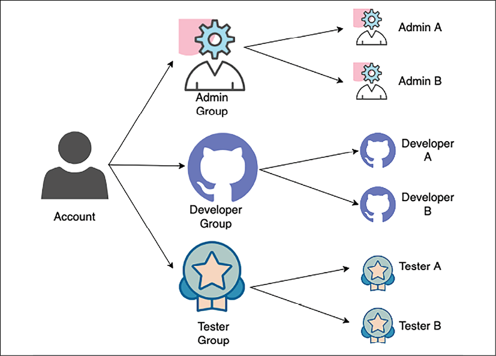

图 8.1：用户组组织

如上图所示，当任何新用户加入团队时，都会根据他们的角色将他们分配到适当的组。这样，每个用户都有一组定义的标准访问权限。用户组还有助于更新访问权限，以防引入新的开发环境，并且所有开发人员都需要访问该环境。

SSO(单点登录)是减少任何安全漏洞并帮助系统自动化的标准流程。 SSO 使用单个用户 ID 和密码为用户提供对不同公司系统的登录。联合身份管理 (FIM) 允许用户通过预验证机制在没有密码的情况下访问系统。让我们看一些更多的细节。

#### 联合身份管理和单点登录
FIM(Federated Identity Management)提供了一种在用户信息存储在第三方身份提供者(IdP)时连接身份管理系统的方式。使用 FIM，用户只需向 IdP 提供身份验证信息，后者又与服务建立了信任关系。

如下图所示，当用户登录访问服务时，服务提供者从 IdP 获取凭据，而不是直接从用户那里获取：

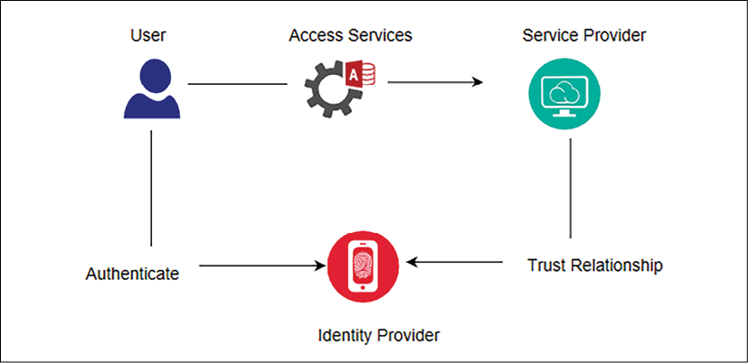

图 8.2：FIM 认证流程

SSO 允许使用单点登录，用户可以使用单点登录访问多项服务。在这里，服务提供商可以将你想要登录的环境作为目标——例如，客户关系管理 (CRM) 应用程序或你的云应用程序。 IdP 可以是公司 AD。联合允许类似于 SSO 的身份验证，但没有密码，因为联合服务器了解用户并允许他们访问信息。

有多种技术可用于实施 FIM 和 SSO。让我们看一下可用的一些流行的身份识别和访问管理 (**IAM**) 选项。

#### Kerberos
Kerberos 是一种身份验证协议，它允许两个系统以安全的方式相互识别并有助于实现 SSO。它在客户端-服务器模型中工作，并使用票证系统来识别用户身份。

Kerberos 有一个密钥分发中心 (**KDC**)，它有助于两个系统之间的身份验证。 KDC 由两个逻辑部分组成——身份验证服务器 (**AS**) 和票证授予服务器 (**TGS**)。

Kerberos 在数据存储中存储和维护每个客户端和服务器的密钥。它在两个系统通信期间在两个系统之间建立安全会话，并使用存储的密钥识别它们。下图说明了 Kerberos 身份验证的体系结构：

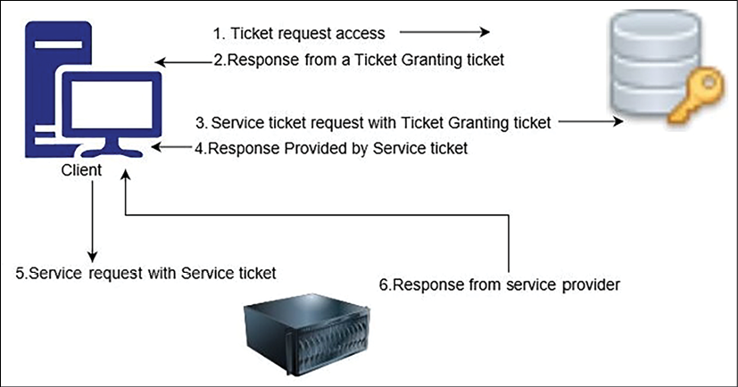

图 8.3：Kerberos 身份验证

如上图所示，当你想要访问一个服务时，会涉及以下几个步骤：

客户端以明文请求的形式向 AS 发送访问票证请求。此请求包含客户端 ID、TGS ID、IP 地址和身份验证时间。
AS 检查你的信息是否在 KDC 数据库中可用。一旦 AS 找到你的信息，它就会在客户端请求和 TGS 之间建立会话。然后 AS 使用 Ticket-Granting Ticket (**TGT**) 和 TGS 会话密钥回复客户端。
现在，TGS 会话密钥要求输入密码，如果输入正确的密码，客户端就可以解密 TGS 会话密钥。但是，它无法解密 TGT，因为 TGS 密钥不可用。
现在，客户端将当前的 TGT 与身份验证器一起发送到 TGS。 TGS 包含会话密钥以及客户端要访问的资源的客户端 ID 和服务主体名称 (**SPN**)。
现在，TGS 再次检查请求的服务地址是否存在于 KDC 数据库中。如果是，则 TSG 将加密 TGT 并将该服务的有效会话密钥发送给客户端。
客户端将会话密钥转发给服务以证明用户具有访问权限，服务授予访问权限。
虽然 Kerberos 可能非常有用，但它是一种开源协议，通常大型企业喜欢使用具有强大支持的更多托管软件，例如 AD。让我们看一下最流行的用户管理工具之一Microsoft AD 的工作机制，它基于轻量级目录访问协议(**LDAP**)。

#### 微软活动目录
**AD**(Active Directory)是微软为用户和机器开发的身份服务。 AD 有一个域控制器，也称为 Active Directory 域服务 (**AD DS**)，它存储用户和系统的信息、他们的访问凭证和他们的身份。下图说明了必要身份验证过程的简单流程：

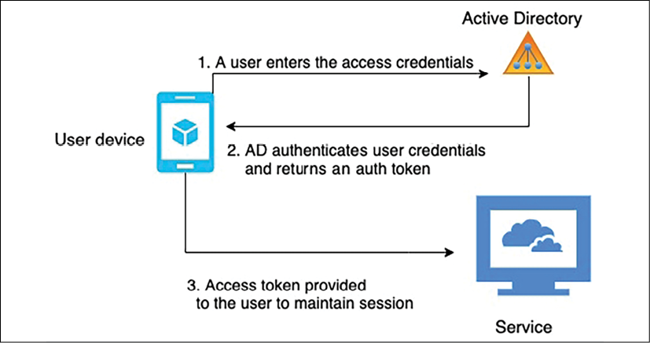

图 8.4：AD 认证流程

如上图所示，用户登录由 AD 或域网络上的任何资源管理。用户首先将请求连同其凭据发送到域控制器，并与 Active Directory 身份验证库 (ADAL) 进行通信。 ADAL 验证用户凭据并发回一个访问令牌，其中包含所请求服务的连续会话。

LDAP(轻量级目录访问协议)是处理存储在目录中的树状层次结构信息的标准协议。 Active Directory 轻型目录服务 (**AD LDS**) 为用户和系统目录提供 LDAP 接口。对于文件加密和网络流量加密，Active Directory 证书服务 (**AD CS**) 提供关键基础结构功能。 Active Directory Federation Services (ADFS) 为外部资源提供访问机制，例如大量用户的 Web 应用程序登录。

随着许多组织开始使用云服务，让我们了解一下AWS云提供的活动目录服务。

#### 亚马逊网络服务目录服务
Amazon Web Services (**AWS**) 目录服务有助于将你账户中的 AWS 资源与现有的本地用户管理工具(如 AD)连接起来。它有助于在 AWS 云中设置一个新的用户管理目录。 AWS Directory Service 促进与本地目录的安全连接。建立连接后，所有用户都可以使用已有的凭据访问云资源和本地应用程序。

AWS AD Connector 是另一项服务，可帮助你将现有的 Microsoft AD 连接到 AWS 云。你不需要任何特定的目录同步工具。设置 AD 连接后，用户可以使用他们现有的凭据登录 AWS 应用程序。管理员用户可以使用 AWS IAM 管理 AWS 资源。

AD 连接器通过与你现有的 MFA 基础设施(例如 YubiKey、Gemalto 令牌、RSA 令牌等)集成来帮助启用 MFA。对于较小的用户群(少于 5,000 名用户)，AWS 提供了 Simple AD，这是一个由 Samba 4 Active Directory Compatible Server 提供支持的托管目录。 Simple AD具有用户账户管理、用户组管理、基于Kerberos的单点登录、用户组策略等通用特性。

#### 与 Active Directory 的 Google 身份联盟
谷歌云使用谷歌身份进行用户身份验证和授权。它通过联合 AD 中现有身份管理系统的用户身份，实现轻松的用户管理。要实施联合，你可以使用 Google Cloud Directory Sync 将用户和组从 AD 服务同步到 Google Cloud 域目录。你还可以使用 ADFS AD 在现有环境中进行联合身份验证。

在本节中，你已经了解了由 Microsoft 和 Amazon 提供的 AD 和托管 AD 服务的高级概述。主要技术公司提供的其他目录服务包括 Okta、Centrify、Ping Identity 和 Oracle Identity Cloud Service (**IDCS**)。

#### 安全断言标记语言

在本节前面的联合身份管理和单点登录下，你了解了 IdP 和 SP。要访问服务，用户需要从 IdP 进行验证，而 IdP 又与 SP 建立信任关系。安全断言标记语言 (**SAML**) 是在 IdP 和 SP 之间建立信任关系的机制之一。 SAML 使用可扩展标记语言 (**XML**) 来标准化 IdP 和 SP 之间的通信。 SAML 启用 SSO，因此用户可以使用单个凭据访问多个应用程序。

SAML 断言是 IdP 通过用户授权发送给服务提供商的 XML 文档。下图说明了 SAML 断言的流程：

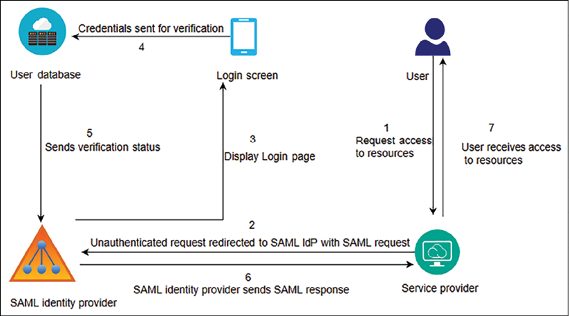

图 8.5：使用 SAML 的用户身份验证

如上图所述，采用以下步骤使用 SAML 实现用户身份验证：

1. 用户作为服务提供商发送访问服务(例如，Salesforce CRM 应用程序)的请求。
2. 服务提供商(CRM 应用程序)向 SAML IdP 发送带有用户信息的 SAML 请求。
3. SAML IdP 弹出 SSO 登录页面，用户在其中输入身份验证信息。
4. 用户访问凭证进入身份存储进行验证。在这种情况下，用户身份存储是一个 AD。
5. 用户身份存储将用户验证状态发送给 SAML IdP，身份存储与 SAML IdP 具有信任关系。
6. SAML IdP 向服务提供商(CRM 应用程序)发送 SAML 断言，其中包含与用户验证相关的信息。
7. 收到 SAML 响应后，服务提供商允许用户访问应用程序。

有时，服务提供商也可以充当 IdP。 SAML 在任何身份存储和服务提供商之间建立关系时非常流行。所有现代身份存储应用程序都与 SAML 2.0 兼容，这使它们能够相互无缝通信。 SAML 允许联合用户身份并为企业用户启用 SSO。

但对于社交媒体、电商网站等大用户群，OAuth(Open Authorization的简称)和OpenID更为合适。让我们进一步了解 OAuth 和 OpenID Connect (**OIDC**)。

#### OAuth 和 OpenID 连接

OAuth 是一种开放标准授权协议，可提供对应用程序的安全访问。 OAuth 提供安全访问授权。 OAuth 不共享密码数据，而是使用授权令牌在服务提供者和消费者之间建立身份。应用程序的用户无需提供登录凭据即可访问其信息。虽然 OAuth 主要用于授权，但许多组织已开始添加自己的身份验证机制。 OIDC 在 OAuth 授权之上定义了身份验证标准。

Amazon、Facebook、Google 和 Twitter 等大型科技公司允许用户与第三方应用程序共享其帐户中的信息。例如，你可以使用你的 Facebook 登录名登录一个新的照片应用程序，并授权该新应用程序仅访问你的 Facebook 照片信息。

下图说明了 OAuth 访问委托流程：

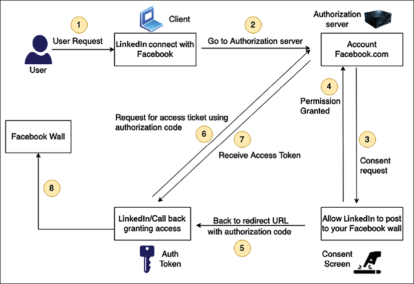

图 8.6：使用 OAuth 2.0 的用户访问授权

如上图所示，认证流程遵循以下步骤：

1. 在这种情况下，你希望 LinkedIn 应用程序从 Facebook 获取你的个人资料照片。
2. LinkedIn 应用请求授权以访问 Facebook 个人资料照片。
3. 授权服务器(在本例中是你的 Facebook 帐户)创建并向你显示同意屏幕。
4. 你同意 LinkedIn 应用仅访问你的 Facebook 个人资料照片的请求。
5. 获得你的批准后，授权 Facebook 服务器将授权代码发送回请求的 LinkedIn 应用程序。
6. 然后，LinkedIn 应用程序使用授权代码从授权服务器(Facebook 帐户)请求访问令牌。

授权服务器识别 LinkedIn 应用程序并检查验证码的有效性。如果访问令牌通过验证，服务器会向 LinkedIn 应用程序发出访问令牌。
LinkedIn 应用程序现在可以使用访问令牌访问 Facebook 个人资料照片等资源。
OAuth 2.0 比 OAuth 1.0 更快，实施起来更舒适，现在最常用。 JSON Web Token (**JWT**) 是一种简单易用的令牌格式，可以与 OAuth 一起使用，并且在 OpenID 中很受欢迎。

#### JSON 网络令牌
JWT 具有 JSON 结构，其中包含有关到期时间、颁发者、主题等信息。它比 Simple Web Token (**SWT**) 更健壮，也比 SAML 2.0 更简单。你可以在以下屏幕截图中看到 JWT：

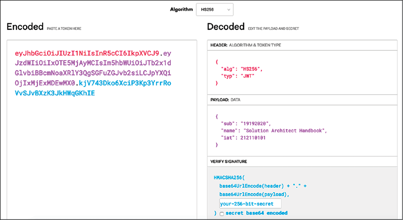

如前面的屏幕截图所示，JWT 由以点分隔的三部分组成，如你在“编码”部分中所见：

- 标头：标头由两部分组成：令牌的类型，即 JWT，以及使用的签名算法，例如 HS256 或 RSA。
- 有效负载：有效负载包含声明。声明是关于用户和任何附加数据的声明。
- 签名：签名验证消息在传输过程中没有被更改。它还可以验证 JWT 的发送者。

JSON 的结构比 XML 更简单，体积也更小，使得 JWT 比 SAML 更紧凑。 JWT 是将信息传递到 HTML 和 HTTP 环境中的不错选择。

在本节中，你了解了最常见的用户管理工具和服务。但是，还有各种其他协议和服务可用于用户身份验证和授权。前面提到的协议的实施可能很复杂，并且有大量可用的打包软件可以使工作变得更容易。

Amazon Cognito 是 AWS 提供的用户访问管理服务，包括基于标准的授权，如 SAML 2.0、OIDC 和 OAuth 2.0，以及提供与 AD 连接的企业用户目录。 Okta 和 Ping Identity 提供企业用户管理以及在一个地方与各种服务提供商工具进行通信的能力。

一旦你的应用程序暴露在 Internet 上，总会有各种类型的攻击不可避免地发生。让我们了解一些最常见的攻击，以及如何设置 Web 层保护的第一层防御。

### 处理网络安全

随着用户需求转变为需要 24/7 全天候服务可用性，企业正在演变为进入在线模式并采用 Web 应用程序模型。 Web 应用程序还可以帮助公司获得全球客户群。网上银行和电子商务网站等业务始终可用，它们处理客户的敏感数据，如支付信息和付款人身份。

现在，Web 应用程序是任何企业的核心，并且这些应用程序向全世界公开。 Web 应用程序可能存在漏洞，这使它们容易受到网络攻击和数据泄露。让我们探讨一些常见的 Web 漏洞以及如何缓解它们。

#### Web 应用程序安全漏洞
Web 应用程序很容易出现安全漏洞，因为黑客会从不同位置通过各种方法策划网络攻击。 Web 应用程序比实体店位置更容易被盗。正如你锁定和保护你的实体店一样，你的 Web 应用程序需要以同样的方式保护自己免受不必要的活动。让我们探讨一些可能导致 Web 应用程序中出现安全漏洞的标准攻击方法。

##### 拒绝服务和分布式拒绝服务攻击

拒绝服务 (**DoS**) 攻击试图让你的用户无法访问你的网站。为实现成功的 DoS 攻击，攻击者使用各种消耗网络和系统资源的技术，从而中断合法用户的访问。攻击者使用多个主机来编排针对单个目标的攻击。

分布式拒绝服务 (**DDoS**) 攻击是一种 DoS 攻击，其中使用多个受损系统(通常感染特洛伊木马)来针对单个系统。 DDoS 攻击的受害者发现他们的所有系统都在分布式攻击中被黑客恶意使用和控制。如下图所示，当多个系统耗尽目标系统的资源带宽时，就会发生 DDoS 攻击：

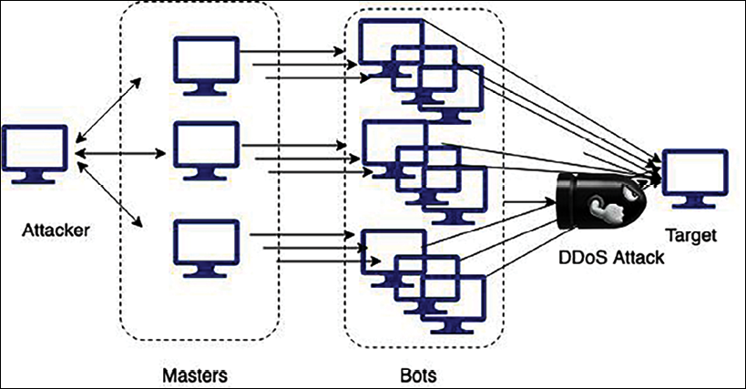

图 8.8：DDoS 攻击

DDoS 攻击的一般概念是利用额外的主机来放大对目标的请求，使它们过度配置和不可用。 DDoS 攻击通常是多个受损系统的结果，僵尸网络借此向目标系统注入大量流量。

最常见的 DDoS 攻击发生在应用程序层，使用 DNS 泛洪攻击或安全套接字层 (SSL) 协商攻击。在 DNS 泛洪中，攻击者会用过多的请求耗尽 DNS 服务器的资源。在 SSL 协商期间，攻击者发送大量无法理解的数据以进行计算量大的 SSL 解密。攻击者可以对服务器群执行其他基于 SSL 的攻击，并通过不必要的任务处理使其负担过重。

在基础设施层，典型的 DDoS 攻击以以下形式发生：

- 用户数据报协议 (**UDP**) 反射：通过 UDP 反射，攻击者可以欺骗目标服务器的 IP 地址并发出请求，该请求会从被黑的反射器服务器返回放大的重要响应。
- SYN 泛洪：通过 SYN 泛洪，攻击者通过创建和放弃大量连接来耗尽目标服务器的传输控制协议 (**TCP**) 服务，从而阻止合法用户访问服务器。

通常，攻击者会尝试获取敏感的客户数据，为此，他们会使用一种称为 SQL 注入 (**SQLi**) 攻击的不同类型的攻击。让我们更多地了解它们。

##### SQL注入攻击

顾名思义，在 SQLi 攻击中，攻击者注入恶意结构查询语言 (**SQL**) 以控制 SQL 数据库并获取敏感的用户数据。攻击者使用 SQLi 访问未经授权的信息、控制应用程序、添加新用户等。

以贷款处理 Web 应用程序为例。你将 loanId 作为一个字段，客户可以使用该字段获取与其贷款融资相关的所有信息。典型的查询如下所示：```SELECT * FROM loans WHERE loanId = 117```。如果不小心，攻击者可以执行诸如 ```SELECT * FROM loans WHERE loanId = 117 or '1=1' ```之类的查询，并获得对整个客户数据库，因为此查询将始终返回真实结果。

通过脚本注入来破解用户数据的另一种常见方法是跨站点脚本 (**XSS**)，其中黑客冒充合法用户。让我们进一步了解它。

##### 跨站脚本攻击

你一定遇到过带有冒充你已知网站链接的网络钓鱼电子邮件。单击这些链接可能会导致通过 XSS 泄露数据。使用 XSS，攻击者将他们的代码附加到合法网站并在受害者加载网页时执行它。恶意代码可以通过多种方式插入，例如在 URL 字符串中或通过在网页上放置少量 JavaScript 代码。

在 XSS 攻击中，攻击者在 URL 或客户端代码的末尾添加一小段代码。当你加载网页时，此客户端 JavaScript 代码将被执行并窃取你的浏览器 cookie。

这些 cookie 通常包含敏感信息，例如你的银行或电子商务网站的访问令牌和身份验证。使用这些被盗的 cookie，黑客可以进入你的银行帐户并拿走你辛苦赚来的钱。

##### 跨站请求伪造攻击

跨站点请求伪造 (**CSRF**) 攻击通过制造混淆来利用用户身份。它通常会通过更改状态的交易活动来欺骗用户——例如，更改购物网站的密码或请求向你的银行转账。

它与 XSS 攻击略有不同，因为对于 CSRF，攻击者试图伪造请求而不是插入代码脚本。例如，攻击者可以伪造一个请求，从用户的银行转账一定数量的钱，然后通过电子邮件将该链接发送给用户。一旦用户点击该链接，银行就会收到请求并将资金转入攻击者的账户。 CSRF 对单个用户帐户的影响微乎其微，但如果攻击者能够进入管理员帐户，则可能会非常有害。

##### 缓冲区溢出和内存损坏攻击

软件程序将数据写入一个临时内存区域以进行快速处理，该区域称为缓冲区。通过缓冲区溢出攻击，攻击者可以覆盖与缓冲区相连的一部分内存。攻击者可以故意导致缓冲区溢出并访问连接的内存，其中可能存储了应用程序可执行文件。攻击者可以用实际程序替换可执行文件并控制整个系统。缓冲区溢出攻击可能会导致内存损坏和无意的内存修改，黑客可以利用它来注入代码。

从整体应用来看，基础设施层、网络层和数据层存在更多的安全威胁。让我们探索一些标准方法来减轻和预防 Web 层的安全风险。

#### 网络安全缓解
安全需要应用到每一层，Web 层由于它暴露于世界，因此需要特别注意。对于 Web 保护，重要的步骤包括跟上最新的安全补丁、遵循最佳软件开发实践以及确保执行正确的身份验证和授权。有多种方法可以保护和保护 Web 应用程序；让我们探索最常见的方法。

##### 网络应用防火墙

WAF 是对 HTTP 和 HTTPS 流量(即端口 80 和 443)应用特定规则的必要防火墙。 WAF 是一种软件防火墙，可以检查你的 Web 流量并验证它是否符合预期行为的规范。 WAF 提供额外的保护层以抵御 Web 攻击。

WAF 速率限制能够查看发送到你的服务的请求的数量或类型，并定义一个阈值来限制每个用户、会话或 IP 地址允许的请求数量。已批准和未批准的列表允许你明确允许或阻止用户。 AWS WAF 通过创建和应用规则来过滤 Web 流量来帮助你保护 Web 层。这些规则基于包括 HTTP 标头、用户地理位置、恶意 IP 地址或自定义统一资源标识符 (**URI**) 等条件。 AWS WAF 规则阻止常见的网络攻击，例如 XSS 和 SQLi。

AWS WAF 以规则的形式提供了一种集中机制，可以跨多个网站部署。这意味着你可以为运行各种网站和 Web 应用程序的环境创建一组规则。你可以跨应用程序重用规则，而不是重新创建它们。

总体而言，WAF 是一种将一组规则应用于 HTTP 流量的工具。它有助于根据 IP 地址、HTTP 标头、HTTP 正文或 URI 字符串等数据过滤 Web 请求。它可用于通过卸载非法流量来减轻 DDoS 攻击。让我们了解有关 DDoS 缓解的更多信息。

##### DDoS 缓解

弹性架构有助于防止或减轻 DDoS 攻击。保持基础设施安全的一个基本原则是减少攻击者可以攻击的潜在目标数量。简而言之，如果一个实例不需要公开，那么就不要将其公开。由于 HTTP 泛洪，应用层攻击可能会激增监控指标，例如内容分发网络 (**CDN**) 的网络利用率、负载均衡器和服务器指标。你可以应用各种策略来最小化攻击面：

- 尽可能减少必要的互联网入口点的数量。例如，打开对你的负载均衡器的传入 Internet 访问，而不是 Web 服务器。
- 对不受信任的最终用户隐藏任何必需的互联网入口点，使他们无法访问它们。
- 识别并删除任何非关键的互联网入口点——例如，公开文件共享存储以供供应商上传具有有限访问权限的数据，而不是将其公开给全球互联网流量。
- 与应用程序管理流量相比，隔离接入点并对最终用户流量应用特定的限制策略。
- 创建一个分离的互联网入口点以最小化攻击面。

你的主要目标是在 CDN 的边缘位置缓解 DDoS 攻击。如果 DDoS 攻击进入你的应用程序服务器，则处理这些攻击更具挑战性且成本更高。下图说明了 AWS 云工作负载的 DDoS 缓解示例：

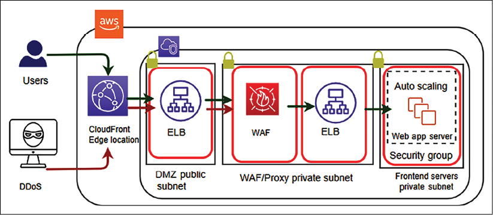

图 8.9：DDoS WAF 三明治缓解策略

上图说明了 WAF 三明治架构，其中 WAF 设备位于两个负载均衡器之间以处理 DDoS 攻击。频繁的 DDoS 攻击来自 SYN 泛洪和 UDP 反射等攻击策略，Amazon CloudFront 通过在攻击策略到达你的应用程序服务器之前仅接受格式正确的连接来阻止这种攻击。 Amazon CloudFront 等 CDN 通过将它们隔离在地理上隔离的位置并防止流量影响其他位置来帮助解决 DDoS 攻击。网络防火墙安全性可帮助你在单个服务器级别控制传入和传出流量。

如上一节所述，WAF 用于保护 Web 应用程序免受 XSS 和 SQLi 攻击等漏洞利用攻击。除此之外，WAF 还有助于检测和防止 Web 应用程序层的 DDoS 攻击。

要处理 DDoS 攻击，你可以应用水平缩放或垂直缩放。你可以通过以下方式利用缩放：

1. 首先，为你的 Web 应用程序选择正确的服务器大小和配置。
2. 其次，应用负载均衡器在服务器群之间分配流量，并添加自动缩放以根据需要添加/删除服务器。
3. 最后，使用 CDN 和 DNS 服务器，因为它们是为处理大规模流量而构建的。

扩展 DDoS 攻击是一个很好的例子，说明为什么必须为服务器设置合理的最大计数。 DDoS 攻击可以将你的服务器扩展到一个非常昂贵的数量，同时仍然可能无法避免变得不可用。对常规流量峰值的预期设置合理的最大限制可以防止 DDoS 攻击给你的公司造成过多损失。

在本节中，你了解了 Web 层的各种安全风险和漏洞以及保护它们的一些标准方法。由于安全需要应用到每一层，让我们更多地探讨基础设施层的保护。

### 保护应用程序及其基础设施

在上一节中，你了解了如何保护 Web 层。由于需要在工作负载的每一层应用安全性，让我们了解如何保护应用程序层和网络层。

#### 应用程序和操作系统强化
不可能完全消除应用程序中的漏洞，但可以通过强化应用程序的操作系统、文件系统和目录来限制系统攻击。一旦攻击者可以进入你的应用程序，他们就可以获得根访问权限并策划对整个基础架构的攻击。通过加固权限来限制目录，将攻击限制在应用程序级别是必不可少的。在进程级别，限制内存和 CPU 使用率以防止 DoS 攻击。

在文件、文件夹和文件分区级别设置正确的权限，这是应用程序执行的唯一要求。避免向应用程序或其用户授予 root 权限。你应该为每个应用程序创建一个仅具有所需访问权限的单独目录，以便只有所需用户才具有应用程序访问权限。不要对所有应用程序使用公共访问。

使用工具自动重启应用程序，避免用户需要登录服务器才能启动的手动方式。

你可以使用 DAEMON Tools 和 Supervisord 等进程控制工具来自动重启应用程序。对于 Linux 操作系统，诸如 systemd 或 System V 初始化脚本之类的实用程序有助于启动/停止应用程序。

#### 软件漏洞和安全代码
始终建议你对操作系统供应商提供的操作系统应用最新的安全补丁。这有助于填补系统中的任何安全漏洞，并保护你的系统免受攻击者能够窃取你的安全证书或运行任意代码的漏洞。确保按照开放 Web 应用程序安全项目 (OWASP) 的建议，将安全编码最佳实践集成到你的软件开发过程中，有关详细信息，请访问：```https://owasp.org/www-project-top-ten/```.

使用最新的安全补丁使你的系统保持最新状态非常重要。最好在最新补丁可用后立即自动执行最新补丁安装过程。但是，有时，运行安全补丁可能会破坏你的工作软件，因此最好设置一个具有自动化测试和部署的持续集成和持续部署 (**CI/CD**) 管道。你将在第 12 章 DevOps 和解决方案架构框架中了解有关 CI/CD 过程的更多信息。

AWS 云提供了一个系统管理器工具，允许你在云中应用安全补丁和监控你的服务器群。你可以使用自动更新或无人值守升级等工具来自动安装安全补丁。

#### 网络、防火墙和可信边界
在保护你的基础架构时，首先要考虑保护网络。数据中心 IT 基础设施的物理安全由供应商负责。对于类似云的 AWS 供应商，他们会非常注意你基础设施的物理安全。让我们谈谈确保网络安全，这是你作为应用程序所有者的责任。

为了更好地理解它，让我们以 AWS 等公共云提供商为例。你也可以将相同的示例应用于本地或私有云网络基础设施。

如下图所示，你应该在每一层应用安全性，并在每一层周围定义可信边界，访问权限最少：

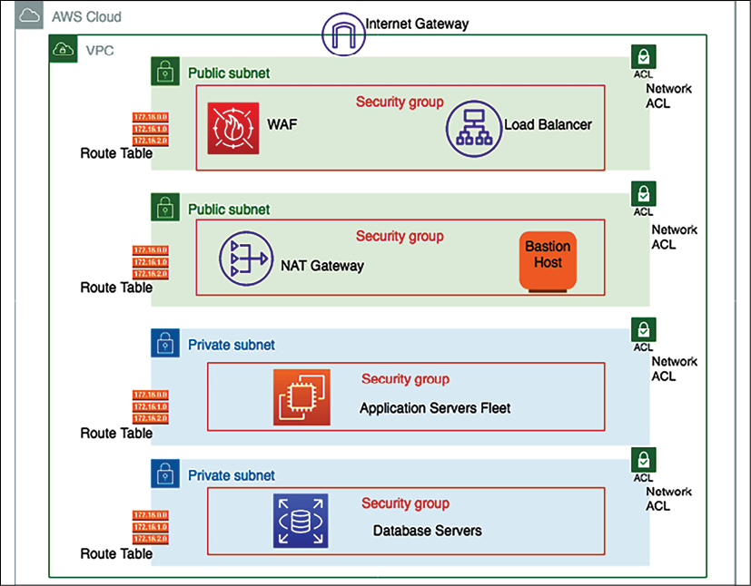

图 8.10：基础设施安全的网络配置

在上图中，负载均衡器位于公共子网中，它可以接受互联网流量并将其分配给应用程序服务器群。正如你在上一节中了解到的，WAF 过滤器流量基于设置的规则并保护你的应用程序免受各种攻击。应用程序服务器群和数据库服务器位于私有子网中，这意味着无法直接访问互联网以将它们暴露在公共互联网上。让我们深入了解前面的架构图并遍历每一层，如下所示：

- Amazon Virtual Private Cloud (**VPC**) 为你提供基础设施的逻辑网络隔离。 Amazon VPC 是你在云端的网络环境。这是你将启动许多资源的地方。它旨在更好地控制环境及其资源之间的隔离。你可以在每个账户或区域中拥有多个 VPC。
- 创建 VPC 时，你使用无类域间路由 (**CIDR**) 表示法指定其 IP 地址集。 CIDR 表示法是一种显示特定 IP 地址范围的简化方法。例如10.0.0.0/16涵盖了从10.0.0.0到10.0.255.255的所有IP，提供65535个IP地址使用。
- 子网是按 CIDR 范围划分的网络段或分区。它们在私有资源和公共资源之间创建可信边界。与其根据应用程序或功能层(**web/app/data**)定义子网，不如根据 Internet 可访问性来组织子网。子网允许你在公共资源和私有资源之间定义清晰的子网级隔离。
- 在此环境中，所有需要直接访问 Internet 的资源(面向公众的负载均衡器、网络地址转换 (**NAT**) 实例、堡垒主机等)都将进入公共子网，而所有其他实例(例如作为数据库和应用程序资源)将进入你的私有子网。使用子网在资源层之间创建分隔层，例如将你的应用程序实例和数据资源放入单独的私有子网中。
- AWS 上的大部分资源都可以托管在私有子网中，必要时使用公共子网来控制对 Internet 的访问。因此，你应该规划你的子网，以便与你的公共子网相比，你的私有子网具有更多的可用 IP。
- 虽然子网可以使用网络访问控制列表 (**NACL**) 规则在资源之间提供基本的隔离元素，但安全组可以在你的资源之间提供更细粒度的流量控制级别，而没有使你的基础架构过于复杂以及浪费或运行的风险出于IP。
- 路由表包含一组称为路由的规则。路由确定哪些应用程序服务器将接收网络流量。为了更好的安全性，请为每个子网使用自定义路由表。
- 安全组是虚拟防火墙，控制来自 CIDR 块范围或另一个安全组的一个或多个实例的入站和出站流量，作为指定资源。根据最小权限原则，默认拒绝所有传入流量，并创建可以基于 TCP、UDP 和 Internet 控制消息协议 (**ICMP**) 协议过滤流量的规则。
- NACL 是一种可选的虚拟防火墙，可在子网级别控制入站和出站流量。与有状态的安全组相比，NACL 是一种无状态防火墙。这意味着如果你的传入请求被允许，则不必检查或跟踪出站请求。虽然是无状态的，但你必须明确定义入站和出站流量规则。
- Internet 流量通过 Internet 网关 (**IGW**) 路由以公开子网。默认情况下，你环境中的互联网流量拒绝互联网访问。需要将 IGW 附加到你的 VPC，子网的路由表应定义到 IGW 的规则。
- 私有子网会阻止所有传入和传出的互联网流量，但服务器可能需要传出互联网流量来安装软件和安全补丁。 NAT 网关使私有子网中的实例能够启动到 Internet 的出站流量，并保护资源免受传入 Internet 流量的影响。
- 堡垒主机就像一个跳转服务器，它允许访问私有子网中的其他资源。堡垒主机需要通过更严格的安全性进行强化，以便只有合适的人才能访问它。要登录到服务器，请始终使用公钥密码术进行身份验证，而不是使用常规的用户 ID 和密码方法。

许多组织通常出于各种目的收集、存储、监控和分析网络流日志，包括排除连接和安全问题以及测试网络访问规则。你需要监控流向系统 VPC 的流量，其中包括记录来自网络的传入和传出流量信息。 VPC 流日志使你能够捕获该信息，以及指定资源的接受和拒绝流量信息，以更好地了解流量模式。

流日志也可以用作监控到达你的实例的流量的安全工具。你可以创建警报以在检测到某些类型的流量时通知你。你还可以创建指标来帮助你识别趋势和模式。你可以为 VPC、子网或网络接口创建流日志。如果你为子网或 VPC 创建流日志，VPC 或子网中的每个网络接口都会受到监控。

如你所见，网络层有多个安全层可以帮助保护你的基础设施。将资源保留在其隔离的子网中有助于减少爆炸半径。如果攻击者可以渗透一个组件，你应该能够将它们限制在有限的资源范围内。你可以在基础设施前端使用 IDS 和 IPS 来检测和防止任何恶意流量。让我们更多地了解它们。

##### 入侵检测系统和入侵防御系统
IDS 通过识别攻击模式来检测通过网络流量发生的任何网络攻击。 IPS 更进一步，有助于主动阻止恶意流量。

IPS 位于防火墙后面，为恶意数据包丢弃、阻止来自源地址的流量以及连接重置等危险内容提供一层分析。

IPS 有两种主要的检测方法，即基于签名的检测和基于统计异常的检测，用于发现漏洞利用。基于签名的检测基于每个漏洞利用的唯一可识别模式的字典。每个利用签名都存储在一个不断增长的签名字典中以确定模式。统计异常检测定义了基线性能参数。它随机抽取网络流量样本，并将它们与基准性能水平进行比较。如果网络流量活动超出参数范围，则 IPS 会采取措施。

你需要根据应用程序的要求确定 IDS/IPS 系统的适用性。 IDS 可以基于主机或基于网络。

##### 基于主机的 IDS

在 IDS 中，基于主机或代理的 IDS 运行在你环境的每台主机上。它可以查看该主机内的活动以确定攻击是否已经发生并且是否成功。它可以通过检查日志、监视文件系统、监视与主机的网络连接等来完成此操作。然后，该软件或代理与中央/命令应用程序就其正在监控的主机的健康状况或安全性进行通信。

基于主机的解决方案的优点包括它们可以深入检查每个主机内部的活动。它们可以根据需要水平扩展(每个主机都有自己的代理)，并且不需要影响正在运行的应用程序的性能。缺点包括在许多服务器上管理代理时可能会引入额外的配置管理开销，这对组织来说是一种负担。

由于每个代理都是孤立运行的，因此更难检测到广泛/协调的攻击。为了应对协同攻击，系统应该在所有主机上立即做出响应，这就要求基于主机的解决方案能够与部署在主机上的其他组件(例如操作系统和应用程序接口)很好地协同工作。

##### 基于网络的入侵检测系统

基于网络的 IDS 将一个设备插入网络，通过它路由所有流量并检查是否存在攻击。

优点包括需要远离应用程序主机部署和管理的简单/单个组件。此外，它以一种可能对所有主机造成负担的方式进行强化或监控。个人/共享的安全视图存在于一个地方，因此可以检查全局是否存在异常/攻击。

然而，基于网络的 IDS 包括向应用程序添加网络跃点的性能影响。需要解密/重新加密流量以对其进行检查，这既是对性能的巨大影响，也是使网络设备成为有吸引力的目标的安全风险。 IDS 无法解密的任何流量都无法检查/检测到任何内容。

IDS 是一种检测和监视工具，不会单独运行。 IPS 根据设定的规则检测、接受和拒绝流量。 IDS/IPS 解决方案有助于防止 DDoS 攻击，因为它们的异常检测功能使它们能够识别有效协议何时被用作攻击工具。 IDS 和 IPS 读取网络数据包并将内容与已知威胁的数据库进行比较。你的基础架构需要持续审核和扫描，以主动保护它免受任何攻击，所以让我们了解更多相关信息。

在本节中，你了解了有关保护基础设施免受各种类型攻击的所有信息。这些攻击的目的是获取你的数据。你应该以这样一种方式保护你的数据，即攻击者即使在获取数据后也无法获取敏感信息。让我们了解使用数据层安全性、加密和备份来保护数据。

### 数据安全

在当今的数字世界中，每个系统都围绕数据展开。有时，这些数据可能包含敏感信息，例如客户健康记录、支付信息和政府身份。保护客户数据以防止任何未经授权的访问是最重要的。许多行业都强调数据保护和安全。

在构建任何解决方案之前，你应该根据应用程序目标定义基本的安全实践，例如遵守法规要求。在解决数据保护问题时使用了几种不同的方法。以下部分描述了如何使用这些方法。

#### 数据分类
最佳实践之一是对数据进行分类，这提供了一种根据敏感度级别对组织数据进行分类和处理的方法。

根据数据敏感性，你可以规划数据保护、数据加密和数据访问需求。

通过根据系统的工作负载要求管理数据分类，你可以创建数据所需的数据控制和访问级别。

例如，用户评级和评论等内容通常是公开的，提供公共访问权限是可以的，但用户信用卡信息是高度敏感的数据，需要加密并限制访问权限。

在高层次上，你可以将数据分为以下几类：

- 受限数据：这包含如果遭到破坏可能会直接损害客户的信息。对受限数据的不当处理可能会损害公司的声誉并对业务产生不利影响。受限数据可能包括客户 PII 数据，例如社会安全号码、护照详细信息、信用卡号码和付款信息。
- 私有数据：如果数据包含客户敏感信息，攻击者可以使用这些信息计划获取其受限数据，则该数据可以归类为机密数据。机密数据可能包括客户电子邮件 ID、电话号码、全名和地址。
- 公共数据：每个人都可以使用和访问，并且需要最少的保护——例如，客户评分和评论、客户位置以及用户公开的客户用户名。

根据行业类型和用户数据的性质，你可以拥有更细化的类别。数据分类需要平衡数据可用性与数据访问。如前所述，设置不同级别的访问权限有助于仅限制必要的数据并确保不暴露敏感数据。始终避免让人类直接访问数据，并添加一些可以生成只读报告供用户以限制性方式使用的工具。

##### 静态数据加密
静态数据意味着它存储在某个地方，例如存储区域网络 (**SAN**) 或网络附加存储 (**NAS**) 驱动器，或存储在云存储中。所有敏感数据都需要通过应用对称或非对称加密来保护，如本节所述，并具有适当的密钥管理。

数据加密是一种保护数据的方法，你可以使用加密密钥将数据从纯文本格式转换为编码的密文格式。要读取这些密文，首先需要使用加密密钥对其进行解密，只有授权用户才能访问这些解密密钥。

常用的基于密钥的加密属于两类密码学之一：

- 对称密钥加密：使用对称加密算法，使用相同的密钥来加密和解密数据。每个数据包都使用密钥进行自我加密。数据在保存时加密，在检索时解密。早些时候，对称加密曾经根据使用 56 位密钥的数据加密标准 (**DES**) 应用。现在，高级加密标准 (**AES**) 大量用于对称加密，因为它使用 128 位、192 位或 256 位密钥，因此更可靠。
- 非对称密钥加密：借助非对称算法，可以使用两种不同的密钥，一种用于加密，另一种用于解密。在大多数情况下，加密密钥是公钥，解密密钥是私钥。非对称密钥加密也称为公钥加密。公钥和私钥是相同的，但它们是配对在一起的。私钥仅供一个用户使用，而公钥可以分布在多个资源中。只有拥有私钥的用户才能解密数据。 Rivest–Shamir–Adleman (**RSA**) 是第一个也是最流行的公钥加密算法之一，用于保护网络上的数据传输。

数据加密和解密以性能为代价，因为它增加了一个额外的处理层。在选择要加密的数据时，你需要谨慎权衡。你可能只想在真正需要避免性能和密钥管理开销的地方应用加密。

如果你使用 AES 256 位安全密钥加密数据，则几乎不可能破解加密。解密的唯一方法是获取加密密钥，这意味着你需要保护代码并将其保存在安全的地方。让我们了解一些保护加密密钥的基本管理方法。

##### 加密密钥管理

密钥管理涉及控制和维护你的加密密钥。你需要确保只有授权用户才能创建和访问加密密钥。除了访问管理和密钥生成之外，任何加密密钥管理系统都会处理密钥的存储、轮换和销毁。密钥管理根据你使用的是对称算法还是非对称算法而有所不同。以下方法是流行的密钥管理方法。

##### 信封加密

信封加密是一种保护数据加密密钥的技术。数据加密密钥是对称密钥，以提高数据加密的性能。对称加密密钥与 AES 等加密算法配合使用，并生成你可以安全存储的密文，因为它无法被人类读取。但是，你需要将对称加密数据密钥与数据一起保存，以便根据需要将其用于数据解密。现在，你需要进一步隔离保护数据密钥，这就是信封加密帮助你保护它的地方。让我们借助下图更详细地理解它：

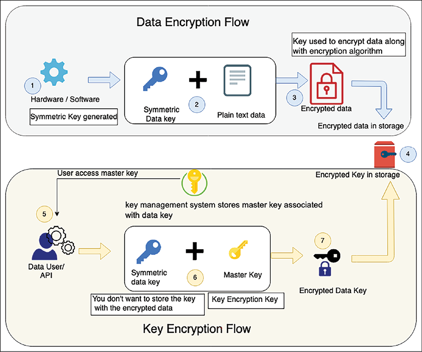

图 8.11：信封加密

上图说明了以下流程来解释信封加密：

1. 对称密钥由软件或硬件生成。
2. 生成的对称数据密钥用于加密明文数据。
3. 密钥使用AES等算法对数据进行加密，生成加密后的密文数据。
4. 加密数据存储在目标存储中。
5. 由于数据密钥需要与加密后的数据一起存储，因此需要对数据密钥进行进一步加密。用户获取存储在密钥管理系统中的客户主密钥来加密数据密钥。
6. 数据密钥使用主密钥加密。你的主密钥是主要加密密钥，因为它对数据加密密钥进行加密。只有主密钥可以加密多个数据密钥，并安全地存储在密钥管理系统中，访问受限。
7. 主密钥对数据密钥进行加密，加密后的数据密钥与加密数据一起存储在存储器中，而主密钥安全地存储在密钥管理系统中，访问受限。

如果用户想要解密数据，那么他们首先需要一个主密钥，而主密钥又具有加密的数据加密密钥。该主密钥可以存储在单独的访问系统中，例如硬件安全模块或由 AWS 等云提供商提供的基于软件的密钥管理服务。让我们更详细地研究一下。

##### AWS 密钥管理服务

AWS Key Management Service (**KMS**) 使用信封加密，唯一数据密钥加密客户数据，KMS 主密钥加密数据密钥。你可以将密钥材料带到 AWS KMS 并从一个集中的位置管理用户访问、密钥分发和轮换。你还可以禁用未使用的密钥，少量密钥有助于提高应用程序的性能并鼓励更好的密钥管理。

AWS KMS 旨在限制访问和保护主密钥。 KMS 从不将明文主密钥存储在磁盘或内存中，从而帮助你实施密钥安全最佳实践。 KMS 还优雅地轮换主密钥以进一步保护你的数据。

AWS KMS 是一个多租户密钥管理模块；由于合规性，客户希望拥有专用的密钥管理模块。同理，其他云厂商也提供了密钥管理系统，比如GCP提供的Cloud Key Management，微软提供Azure Key Vault。

有时，由于多租户的行业监管原因，客户希望拥有自己的密钥管理系统。在这种情况下，他们可以选择将密钥存储在 HSM 中。 AWS 等云提供商还提供 AWS CloudHSM 等商店。你也可以选择自己的 HSM 供应商。让我们更深入地探索 HSM。

##### 硬件安全模块

硬件安全模块 (**HSM**) 是一种旨在保护加密密钥和相关加密操作的设备。 HSM 设计有物理机制来保护密钥，其中包括篡改检测和响应。如果发生任何密钥篡改，HSM 会销毁密钥并防止任何安全危害。

HSM 包括用于限制访问控制的逻辑保护。逻辑分离有助于 HSM 设备管理员安全地管理设备。访问限制适用于可以将其连接到网络并提供 IP 地址的用户的规则。你可以为每个人创建一个单独的角色，包括安全员、设备管理员和用户。

由于丢失密钥会使你的数据变得无用，因此你需要通过在不同的地理位置维护至少两个 HSM 来确保 HSM 的高可用性。你可以使用其他 HSM 解决方案，例如 SafeNet 或 Voltage。要保护你的密钥，请选择由 AWS CloudHSM 或 CipherCloud 等云服务提供的托管 HSM。

#### 传输中的数据加密
传输中的数据意味着移动中的数据并通过网络传输。你可以在源和目标中加密静态数据，但在传输数据时你的数据传输管道需要是安全的。通过 HTTP 等未加密协议传输数据时，数据可能会因窃听攻击或中间人 (**MITM**) 攻击等攻击而泄露。

在窃听攻击中，攻击者从网络中捕获一个小数据包并使用它来搜索任何其他类型的信息。 MITM 攻击是一种基于篡改的攻击，攻击者秘密更改通信以代表接收方开始通信。可以通过使用传输安全层 (**TSL**) 等强协议通过 SSL 传输数据来防止此类攻击。

你会发现现在大多数网站都使用 HTTPS 协议进行通信，该协议使用 SSL 对数据进行加密。默认情况下，HTTP 流量不受保护。所有 Web 服务器和浏览器都支持 HTTP 流量 (**HTTPS**) 的 SSL/TLS 保护。 HTTP 流量也适用于面向服务的架构，例如基于表述性状态传输 (**REST**) 和简单对象访问协议 (**SOAP**) 的架构。

SSL/TSL 握手使用证书通过非对称加密交换公钥，然后使用公钥通过对称加密交换私钥。安全证书由可接受的证书颁发机构 (**CA**) 颁发，例如 Verisign。采购的安全证书需要使用公钥基础设施 (**PKI**) 进行保护。以下是使用 RSA 密钥交换的标准 SSL 握手：

1. 客户端问候：客户端向服务器发送消息，通过 SSL 与客户端通信。信息包括 SSL 版本号、密码设置和特定于用户会话的数据。
2. 服务器问候：服务器将信息返回给客户端，这需要使用 SSL。服务器使用公钥确认 SSL 版本号和证书。
3. 身份验证和预主密码：客户端使用公用名、日期和颁发者等详细信息对服务器证书进行身份验证。客户端根据他们的密码为会话创建预主密钥，使用服务器的公钥加密，并将加密的预主密钥发送到服务器。
4. Decryption and master secret：服务器使用它的私钥来解密pre-master secret。服务器和客户端都执行步骤以使用约定的密码生成主密钥。
5. 使用会话密钥加密：客户端和服务器都交换消息以通知将来的消息将被加密。它被称为共享秘密。共享后，客户端和服务器交换消息以确认消息加密和解密。从那里开始，双方都在会话的其余部分保护他们的通信。

网络上的非网络数据传输也应该加密，这包括安全外壳 (**SSH****)** 和互联网协议安全 (**IPsec**) 加密。 SSH 在连接到服务器时最为普遍，而 IPsec 适用于保护通过虚拟专用网络 (**VPN**) 传输的公司流量。文件传输应使用 SSH 文件传输协议 (**SFTPS**) 或安全 FTP (**FTPS**) 进行保护，电子邮件服务器通信需要使用安全简单邮件传输协议 (**SMTPS**) 或互联网消息访问协议 (**IMAP**) 进行保护。

在本节中，你了解了使用不同加密技术保护静态和动态数据的各种方法。在发生任何不可预见的事件时，数据备份和恢复是保护数据的一个重要方面。你将在灾难恢复规划部分的第 9 章“架构可靠性考虑”中了解有关数据备份的更多信息。

有许多发布合规性的管理机构，这是一组确保客户数据安全的清单。合规性还确保组织遵守行业和地方政府规则。让我们在下一节中详细了解各种合规措施。

## 安全性和合规性认证

根据你的行业和地理位置，有许多合规性认证可以保护客户隐私和安全数据。对于任何解决方案设计，合规性要求都是需要评估的关键标准之一。以下是一些最流行的行业标准合规性：

- 全球合规性包括所有组织都需要遵守的认证，无论其所在地区如何。其中包括用于云安全的 ISO 9001、ISO 27001、ISO 27017、ISO 27018、SOC 1、SOC 2、SOC 3 和 CSA STAR。
- 美国政府要求各种合规性来处理公共部门的工作量。其中包括 FedRAMP、DoD SRG Level-2、4 和 5、FIPS 140、NIST SP 800、IRS 1075、ITAR、VPAT 和 CJIS。
- 应用程序的行业级合规性适用于特定行业。其中包括 PCI DSS、CDSA、MPAA、FERPA、CMS MARS-E、NHS IG 工具包(英国)、HIPAA、FDA、FISC(日本)、FACT(英国)、共享评估和 GLBA。
- 区域合规认证适用于特定国家或地区。其中包括欧盟 GDPR、欧盟示范条款、英国 G-Cloud、中国 DJCP、新加坡 MTCS、阿根廷 PDPA、澳大利亚 IRAP、印度 MeitY、新西兰 GCIO、日本 CS Mark Gold、西班牙 ENS 和 DPA、加拿大隐私法和美国隐私法盾。

如你所见，根据行业、地区和政府政策，不同监管机构提供了许多合规性认证。我们不会深入探讨合规性的细节，但你需要在开始解决方案设计之前根据合规性要求评估你的应用程序。合规性要求严重影响整体解决方案设计。你需要根据合规性需求来决定需要哪种加密，以及工作负载的日志记录、审计和位置。

日志记录和监控有助于确保强大的安全性和合规性。日志记录和监控是必不可少的。如果发生事故，你的团队应立即收到通知并准备好应对事故。你将在第 10 章“卓越运营注意事项”中了解有关监控和警报方法的更多信息。

根据你的应用程序地理位置、行业和政府规则，有多个合规行业。你了解了各种类别的合规性以及适用于每个组的一些通用合规性标准。许多组织正在迁移到云，因此了解云中的安全性至关重要。

## 云的共享安全责任模型

随着云正在成为常态，许多组织正在将他们的工作负载转移到公共云，例如 AWS、谷歌云平台 (**GCP**) 和 Azure，客户需要了解云安全模型。云中的安全性是客户和云提供商之间的共同努力。客户对他们使用云服务实现的内容以及连接到云的应用程序负责。在云中，客户对应用程序安全需求的责任取决于他们使用的云产品和系统的复杂性。

下图说明了来自最大的公共云提供商 (**AWS**) 之一的云安全模型，它几乎适用于任何公共云提供商，例如 Azure、GCP、Oracle、IBM 或阿里巴巴：

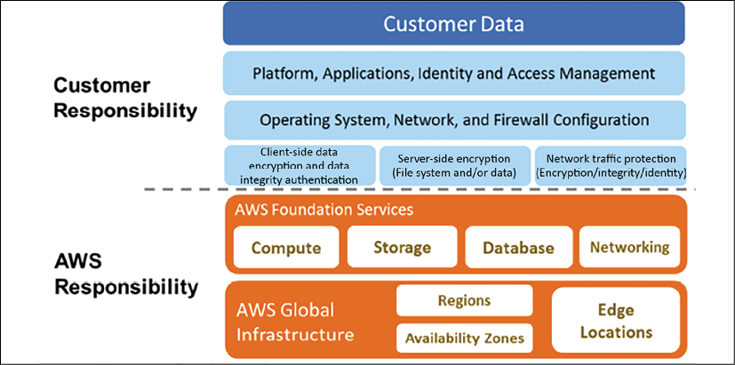

图 8.12：AWS 云共享安全责任模型

如上图所示，AWS 处理云的安全性，特别是托管你的资源的物理基础设施。

这包括以下内容：

- 数据中心：非描述性设施、24/7 保安人员、双因素身份验证、访问记录和审查、视频监控以及磁盘消磁和销毁
- 硬件基础设施：服务器、存储设备和其他依赖 AWS 服务的设备
- 软件基础设施：主机操作系统、服务应用程序和虚拟化软件
- 网络基础设施：路由器、交换机、负载平衡器、防火墙、布线等。还包括在外部边界、安全接入点和冗余基础设施的持续网络监控

客户在云端处理安全，包括以下内容：

- 服务器的操作系统：安装在服务器上的操作系统容易受到攻击。操作系统的修补和维护是客户的责任，因为软件应用程序在很大程度上依赖于它。
- 应用程序：每个应用程序及其环境(例如开发、测试和生产)均由客户维护。因此，处理密码策略和访问管理是客户的责任。
- 操作系统/基于主机的防火墙：客户需要保护他们的整个系统免受外部攻击。然而，云在该领域提供了安全性，但客户应该考虑使用 IDS 或 IPS 来增加额外的安全层。
- 网络配置和安全组：云端提供了创建网络防火墙的工具，但需要停止或允许哪些流量通过，取决于应用需求。客户负责设置防火墙规则以保护他们的系统免受外部和内部网络流量的影响。
- 客户数据和加密：数据处理是客户的责任，因为他们更了解所需的数据保护。云提供了通过使用各种加密机制来申请数据保护的工具，但是客户有责任应用这些工具并保护他们的数据。

公共云还提供适用于其管理的硬件部分的各种合规性认证。为了使你的应用程序合规，你需要处理并完成对应用程序级别投诉的审核。作为客户，你可以通过继承云提供商提供的安全性和合规性获得额外优势。

尽可能尝试自动化安全最佳实践。基于软件的安全机制提高了你更快速、更经济、更安全地扩展的能力。创建并保存虚拟服务器的自定义基准图像，然后在你启动的每个新服务器上自动使用该图像。创建在模板中定义和管理的整个基础架构，以复制新环境的最佳实践。

云提供各种工具和服务来保护你在云中的应用程序，以及 IT 基础架构级别的内置安全性。但是，这取决于客户如何利用这些服务并确保他们的应用程序在云中安全。整体云为你的 IT 库存提供更好的可见性和集中管理，这有助于管理和保护你的系统。

安全是任何解决方案的重中之重，解决方案架构师需要确保他们的应用程序是安全的并且免受任何攻击。安全是一项持续的努力。每个安全事件都应该被视为应用程序的改进机会。一个健壮的安全机制应该有认证和授权控制。每个组织和应用程序都应该自动响应安全事件并在多个级别保护基础设施。

## 概括

在本章中，你了解了将安全最佳实践应用于解决方案设计的各种设计原则。这些原则包括解决方案设计过程中的关键考虑因素，通过实施适当的访问控制、数据保护和监控来保护你的应用程序。你需要在每一层应用安全性。从用户身份验证和授权开始，你了解了如何在 Web 层、应用程序层、基础架构层和数据库层应用安全性。每一层都容易受到不同类型的攻击，你学习了使用可用技术选择来保护你的应用程序的各种方法。

对于用户管理，你了解了使用 FIM 和 SSO 处理企业用户，以及实现用户身份验证和授权的各种方法。这些选择包括企业管理服务，例如 Microsoft 的 AD 和 AWS Directory Service。你还可以选择使用 OAuth 2.0 来处理数百万用户。

在 Web 层，你了解了各种攻击类型，例如 DDoS、SQLi 和 XSS。你了解了如何使用不同的 DDoS 防御技术和网络防火墙来保护这些攻击。你学习了各种技术来保护应用程序层的代码并确保基础设施的安全。你深入研究了不同的网络组件和方法来构建可信边界以限制攻击半径。

你通过适当的数据分类并将你的数据标记为机密、私有或公共数据来了解数据保护。你了解了对称和非对称算法以及它们之间的区别。你了解了如何使用密钥管理来保护公共/私有加密密钥。数据可以处于移动状态或存储在存储器中。你了解了如何在两种模式下保护数据。最后，你了解了适用于云工作负载的各种合规性和共享安全责任模型。

虽然本章是关于应用安全最佳实践的，但可靠性是任何解决方案设计的另一个重要方面。为了使你的业务取得成功，你需要创建一个可靠的解决方案，该解决方案应该始终可用并且能够处理工作量波动。在下一章中，你将了解通过可用技术选择使你的应用程序可靠的最佳实践。你将学习各种灾难恢复和数据复制策略，使你的应用程序更加可靠。