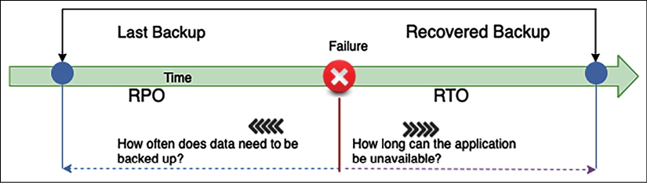
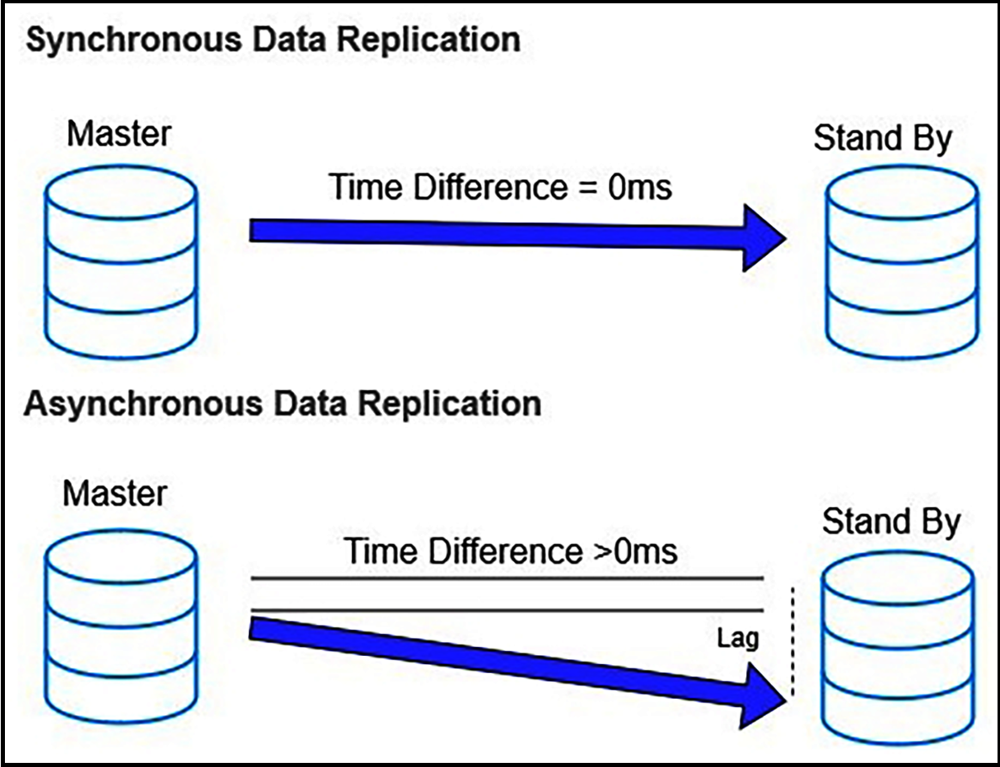
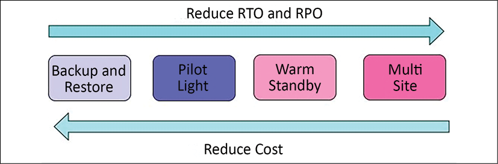
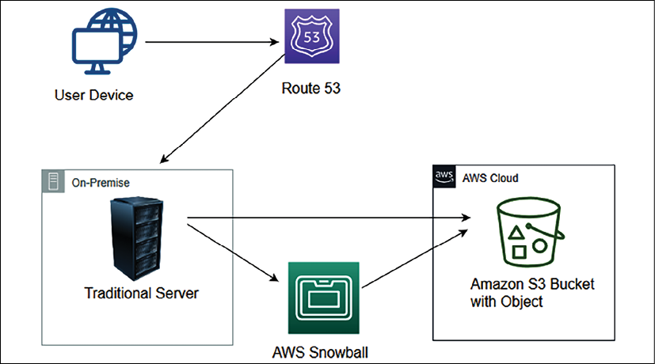
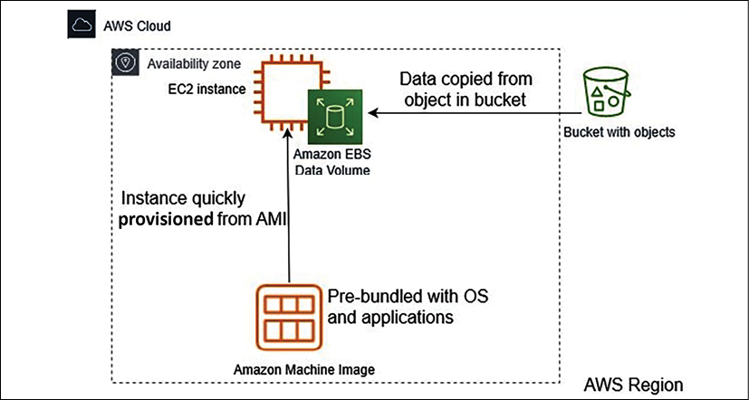
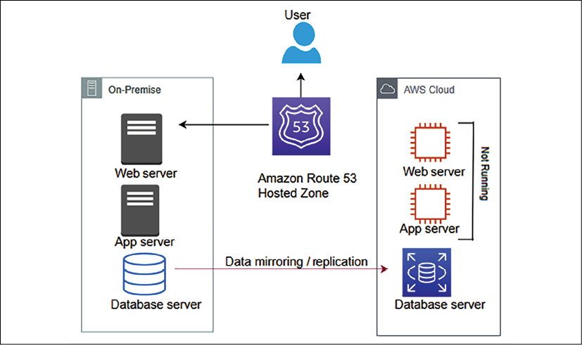
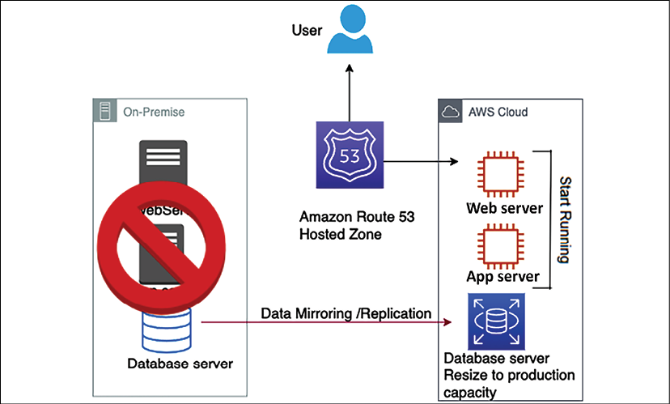
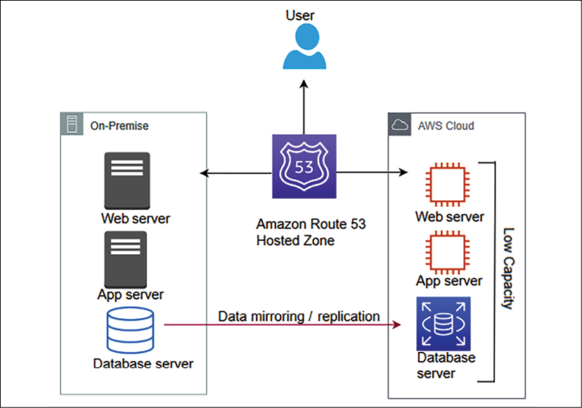
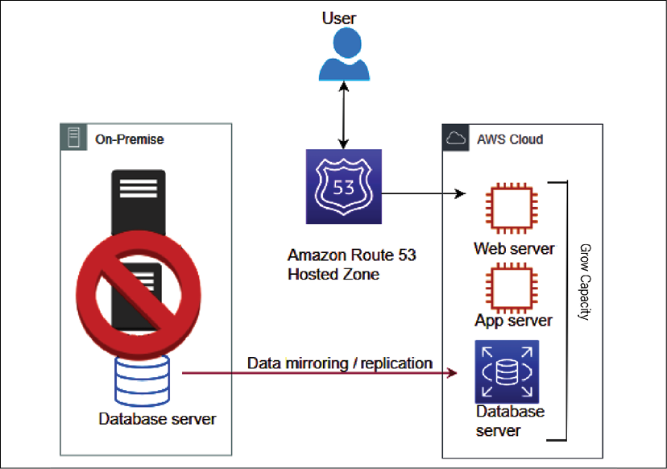
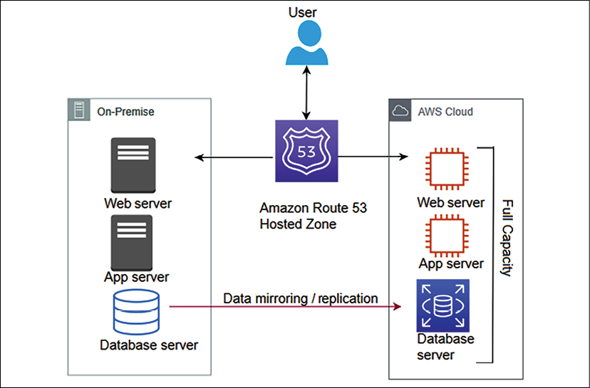

# 架构可靠性

应用程序可靠性是架构设计的重要方面之一。可靠的应用程序通过在客户需要时随时可用来帮助赢得客户信任。随着各种业务的在线化，高可用性已经成为在线应用的强制性标准之一。用户希望随时浏览你的应用程序并在方便时完成购物和银行业务等任务。可靠性是任何企业成功的基本秘诀之一。

可靠性是指系统从故障中恢复的能力。它是关于让你的应用程序具有容错能力，以便它可以在不影响客户体验的情况下恢复。可靠的系统应该能够从任何基础设施故障或服务器故障中恢复。你的系统应该准备好处理任何可能导致中断的情况。

在本章中，你将学习各种适用于使你的解决方案可靠的设计原则。在评估可靠性时，你需要考虑架构的每个组件。你将了解如何选择正确的技术来确保架构在每一层的可靠性。你将在本章中学习以下可靠性最佳实践：

- 架构可靠性的设计原则
- 架构可靠性的技术选择
- 通过云提高可靠性

到本章结束时，你将了解各种灾难恢复技术和数据复制方法，以确保你的应用程序的高可用性和业务流程的连续性。

## 架构可靠性的设计原则

可靠性的目标是将任何故障的影响控制在尽可能小的范围内。通过为最坏情况准备系统，你可以为基础架构和应用程序的不同组件实施各种缓解策略。

> 在发生故障之前，你应该彻底测试你的恢复过程。

以下是可帮助你增强系统可靠性的标准设计原则。你会发现所有的可靠性设计原则都是密切相关，相辅相成的。

### 使系统自我修复

系统故障需要提前预测，在故障发生的情况下，你应该有一个系统恢复的自动响应，称为系统自愈。自我修复是解决方案自动从故障中恢复的能力。自我修复系统会主动检测故障并以最小的客户影响从容应对。故障可能发生在整个系统的任何层，包括硬件故障、网络故障或软件故障。通常，数据中心故障不是日常事件，对于数据库连接和网络连接故障等频繁发生的故障，需要更细粒度的监控。系统需要监控故障并采取行动进行恢复。

要使系统自我修复，首先，你需要为你的应用程序和业务确定关键性能指标(**KPI**)。这些 KPI 可能包括每秒处理的请求数或你网站在用户级别的页面加载延迟。你可以在基础架构级别定义最大 CPU 利用率，例如它不应超过 60%，内存利用率不应超过总可用随机存取内存(**RAM**) 的 50%。

当你定义 KPI 时，你应该让监控系统跟踪故障并在你的 KPI 达到阈值时通知你。你应该围绕监控应用自动化，以便系统可以在发生任何事件时自我修复。例如，当 CPU 利用率接近 50% 时添加更多服务器——主动监控有助于防止故障。

### 应用自动化

自动化是提高应用程序可靠性的关键。尝试自动化从应用程序部署和配置到整体基础设施的一切。自动化为你提供敏捷性，让你的团队可以快速行动并更频繁地进行试验。你只需单击一下即可复制整个系统基础架构和环境以尝试新功能。

你可以根据时间表来规划你的应用程序的自动扩展，例如，电子商务网站可能在周末有更多的用户流量。你还可以根据用户请求量自动扩展以处理不可预测的工作负载。使用自动化来启动独立和并行的作业，这些作业在与单个作业的结果相结合时将提供更高的准确性。

通常，你需要将开发环境中的相同配置应用到质量保证(**QA**) 环境。每个测试阶段可能有多个 QA 环境，包括功能测试、UAT 和压力测试环境。通常，QA 测试人员会发现由错误配置的资源引起的缺陷，这可能会进一步延迟测试计划。最重要的是，你不能承受生产服务器中的配置错误。

要精确重现相同的配置，你可能需要记录分步配置说明。重复相同的步骤以手动配置每个环境可能容易出错。总是存在人为错误的可能性，例如数据库名称中的拼写错误。应对这一挑战的解决方案是通过创建脚本来自动化这些步骤。自动化脚本本身可以是文档。

只要脚本正确，就比手动配置靠谱。毫无疑问，它是可复制的。可以自动检测不健康资源并启动替换资源，并且你可以在资源发生变化时通知 IT 运营团队。自动化是一个基本的设计原则，需要在你的系统中的任何地方应用。

### 构建分布式系统

在系统正常运行时间方面，单体应用程序的可靠性较低，因为特定模块中的一个小问题可能会导致整个系统崩溃。将你的应用程序划分为多个小服务可减少影响区域。应用程序的一部分不应影响整个系统，应用程序可以继续提供关键功能。例如，在电子商务网站中，支付服务出现问题不应影响客户下订单的能力，因为可以稍后处理付款。

在服务级别，横向扩展你的应用程序以提高系统可用性。设计一个系统以使用多个较小的组件协同工作，而不是使用单个整体系统来减少影响区域。在分布式设计中，请求由不同的系统组件处理，一个组件的故障不会影响系统其他部分的功能。例如，在电子商务网站上，仓库管理组件的故障不会影响客户下订单。

然而，分布式系统中的通信机制可能很复杂。你需要利用断路器模式来处理系统依赖性。正如你在第 6 章"解决方案架构设计模式"中了解的有关断路器模式的内容，基本思想很简单。你将受保护的函数调用包装在断路器对象中，该对象会监视故障并采取自动操作来缓解故障。

### 监控和增加容量

资源饱和是应用程序失败的最常见原因。通常，你会遇到应用程序因 CPU、内存或硬盘过载而开始拒绝请求的问题。添加更多资源并不总是一项简单的任务，因为你应该在需要时拥有额外的可用容量。

在传统的本地环境中，你需要预先根据假设计算服务器容量。对于购物网站和任何在线业务等业务而言，工作负载容量预测变得更具挑战性。在线流量非常难以预测，并且受全球趋势的驱动而大幅波动。通常，采购硬件可能需要 3 到 6 个月的时间，而且很难提前猜测容量。由于资源闲置，订购过多的硬件会产生额外的成本，而资源不足会因应用程序不可靠而导致业务损失。

你需要一个无需猜测容量并且你的应用程序可以按需扩展的环境。

Amazon Web Services(**AWS**) 等公共云提供商提供基础设施即服务(**IaaS**)，促进资源的按需可用性。

在云中，你可以监控系统供需。你可以根据需要自动添加或删除资源。它使你能够维持满足需求的资源水平，而不会出现过度供应或供应不足的情况。

### 执行恢复验证

在基础设施验证方面，大多数时候，组织专注于验证一切正常的快乐路径。相反，你应该验证你的系统是如何失败的以及你的恢复过程如何运作。验证你的应用程序，假设一切都失败了。不要只是期望你的恢复和故障转移策略会起作用。确保定期测试它们，这样如果出现问题你就不会感到惊讶。

基于模拟的验证可帮助你发现任何潜在风险。你可以自动化可能导致系统失败的可能场景，并相应地准备事件响应。你的验证应该以这样一种方式提高应用程序的可靠性，即在生产中不会出现任何故障。

可恢复性有时作为可用性的一个组成部分而被忽视。要改进系统的恢复点目标(**RPO**) 和恢复时间目标(**RTO**)，你应该将数据和应用程序连同它们的配置一起备份为机器映像。你将在下一节中了解有关 RTO 和 RPO 的更多信息。假设一场自然灾害使你的一个或多个组件不可用或破坏了你的主要数据源。在这种情况下，你应该能够快速恢复服务而不会丢失数据。让我们更多地讨论具体的灾难恢复策略，以提高应用程序的可靠性和相关的技术选择。

## 架构可靠性的技术选择

应用程序可靠性通常着眼于应用程序为用户提供服务的可用性。有几个因素会影响你的应用程序的高可用性。但是，容错是指应用程序组件的内置冗余。你的应用程序可能具有高可用性，但并非 100% 容错。例如，如果你的应用程序需要四台服务器来处理用户请求，你可以将它们分配到两个数据中心以实现高可用性。如果一个站点出现故障，你的系统在 50% 的容量下仍具有高可用性，但这可能会影响用户的性能预期。但是，如果你在两个站点中创建相同的冗余，每个站点有四台服务器，你的应用程序将不仅具有高可用性，而且还具有 100% 的容错能力。

假设你的应用程序不是 100% 容错的。在这种情况下，你希望添加自动可扩展性，定义你的应用程序的基础架构将如何响应增加的容量需求，以确保你的应用程序可用并在你要求的标准内执行。为了使你的应用程序可靠，你应该能够快速恢复服务而不丢失数据。展望未来，我们将把恢复过程作为灾难恢复来处理。在进入各种灾难恢复场景之前，让我们详细了解 RTO/RPO 和数据复制。

### 规划恢复时间目标和恢复点目标

业务应用程序需要以服务级别协议(**SLA**) 的形式定义服务可用性。组织定义 SLA 以确保其用户的应用程序可用性和可靠性。你可能想要定义一个 SLA，说明你的应用程序在给定年份的可用性应该达到 99.9%，或者组织可以容忍每月 43 分钟的停机时间，等等。定义的 SLA 主要驱动应用程序的 RPO 和 RTO。

RPO 是组织在给定时间段内可以容忍的数据丢失量。例如，如果我的应用程序丢失了 15 分钟的数据，它是可以接受的。例如，如果你每 15 分钟处理一次客户订单以进行履行，那么你可以容忍在订单履行应用程序出现任何系统故障时重新处理该数据。 RPO 有助于定义数据备份策略。 RTO 与应用程序停机时间以及应用程序在发生故障后恢复和正常运行所需的时间有关。下图说明了 RTO 和 RPO 之间的区别：

图 9.1：RTO 和 RPO

在上图中，假设故障发生在上午 10 点，而你在上午 9 点进行了最后一次备份；如果系统崩溃，你将丢失 1 小时的数据。当你恢复系统时，会有一个小时的数据丢失，因为你每小时都在进行数据备份。

在这种情况下，你的系统 RPO 是 1 小时，因为它可以承受一个小时的数据丢失。在这种情况下，RPO 表示可以容忍的最大数据丢失为 1 小时。

如果你的系统需要 30 分钟才能恢复到备份并启动系统，那么它会将你的 RTO 定义为半小时。这意味着可以容忍的最长停机时间为 30 分钟。 RTO 是在导致停机的故障后恢复整个系统所需的时间，在本例中为 30 分钟。

组织通常会根据系统不可用时的用户体验和对业务的财务影响来决定可接受的 RPO 和 RTO。组织在确定 RTO/RPO 时会考虑各种因素，包括业务收入损失和因停机造成的声誉损害。 IT 组织计划解决方案以根据定义的 RTO 和 RPO 提供有效的系统恢复。你现在可以看到数据是系统恢复的关键，所以让我们学习一些将数据丢失降至最低的方法。

### 复制数据

数据复制和快照是灾难恢复和使系统可靠的关键。复制在辅助站点上创建主数据站点的副本。在主系统发生故障时，系统可以故障转移到备用系统并保持可靠工作。此数据可以是存储在 NAS 驱动器、数据库快照或机器映像快照中的文件数据。站点可以是两个地理上分离的本地系统、同一场所中的两个独立设备或物理上分离的公共云。

数据复制不仅有助于灾难恢复，而且可以通过快速创建用于测试和开发的新环境来加快组织的敏捷性。数据复制可以是同步的或异步的。

#### 同步与异步复制
同步复制实时创建数据副本。实时数据复制有助于降低 RPO 并提高发生灾难时的可靠性。但是，它很昂贵，因为它需要在主系统中使用额外的资源来进行连续的数据复制。

异步复制创建数据副本有一些滞后或按照定义的时间表。但是，异步复制的成本较低，因为与同步复制相比，它使用的资源较少。如果你的系统可以使用更长的 RPO，你可以选择异步复制。

就Amazon RDS等数据库技术而言，如果我们创建具有多个可用区故障转移的RDS，则应用同步复制。对于只读副本，存在异步复制，你可以使用它来处理报告和读取请求。

如下架构图所示，在同步复制中，数据库的主备实例之间的数据复制没有滞后，而在异步复制的情况下，在主备之间复制数据时可能会有一些滞后和复制实例：

图 9.2：同步和异步数据复制

让我们探索一些用于同步和异步方法的数据复制方法。

#### 复制方法
复制方法是一种从源系统中提取数据并创建用于数据恢复目的的副本的方法。根据业务流程延续的存储类型，可以使用不同的复制方法来存储数据副本。复制可以通过以下方式实现：

- **基于阵列的复制**：在这种情况下，内置软件会自动复制数据。但是，源存储阵列和目标存储阵列都应该兼容且同构以复制数据。存储阵列包含机架中的多个存储磁盘。由于易于部署和计算能力主机系统的减少，大型企业使用基于阵列的复制。你可以选择基于阵列的复制产品，例如 HP Storage、EMC SAN Copy 和 NetApp SnapMirror。
- **基于网络的复制**：这可以在不同种类的异构存储阵列之间复制数据。它在不兼容的存储阵列之间使用额外的交换机或设备来复制数据。在基于网络的复制中，复制的成本可能会随着多个参与者的加入而增加。你可以选择基于网络的复制产品，例如 NetApp Replication X 和 EMC RecoverPoint。
- **基于主机的复制**：在这种情况下，你在主机上安装一个软件代理，可以将数据复制到任何存储系统，如 NAS、SAN 或 DAS。你可以使用基于主机的软件供应商，例如 Symantec、Commvault、CA 或 Vision Solution。由于较低的前期成本和异构设备兼容性，它在中小型企业(**SMB**) 中非常受欢迎。但是，它会消耗更多计算能力，因为需要在主机操作系统上安装代理。
- **基于管理程序的复制**：这是 VM 感知的，这意味着将整个虚拟机从一台主机复制到另一台主机。由于组织大多使用虚拟机，因此它提供了一种非常有效的灾难恢复方法来减少 RTO。基于管理程序的复制具有高度可扩展性，并且比基于主机的复制消耗更少的资源。它可以由内置于 VMware 和 Microsoft Windows 中的本机系统执行。你可以选择 Zerto 等产品来执行基于管理程序的复制或来自不同供应商的其他产品。

之前，在第 3 章解决方案架构的属性中，你了解了可扩展性和容错性。在第 6 章，解决方案架构设计模式中，你了解了各种设计模式以使你的架构具有高可用性。现在，你将发现多种从故障中恢复系统并使其高度可靠的方法。

### 规划灾难恢复

灾难恢复(**DR**) 是关于在系统发生故障时保持业务连续性。它是关于让组织为任何可能的系统停机时间做好准备以及从中恢复的能力。 DR规划涵盖多个维度，包括硬件和软件故障。在规划 DR 时，请始终确保考虑其他运营损失，包括停电、网络中断、加热和冷却系统故障、物理安全漏洞以及其他事件，例如火灾、洪水或人为错误。

组织根据系统关键性和影响在 DR 规划中投入精力和资金。创收应用程序需要始终运行，因为它会显着影响公司形象和盈利能力。这样的组织投入大量精力来创建其基础架构并培训其员工以应对 DR 情况。灾难恢复就像一份保险单，即使你不使用它也必须投资和维护，因为在发生不可预见的事件时，灾难恢复计划将成为你企业的救星。

业务关键性的基础(例如软件应用程序)可以置于复杂性范围内。有四种 DR 场景，从最高到最低的 RTO/RPO 排序如下：

- 备份还原
- 指示灯
- 热备
- 多站点

如下图所示，在 DR 规划中，随着每个选项的进展，你的 RTO 和 RPO 将减少，而实施成本将增加。你需要根据应用程序可靠性要求在 RTO/RPO 要求和成本之间做出正确的权衡：

图 9.3：DR 选项的范围

让我们详细探讨上面提到的每个选项以及所涉及的技术选择。请注意，AWS 等公共云使你能够经济高效地运行上述每个 DR 策略。

业务连续性是指确保关键业务功能在发生灾难时继续运行或快速运行。由于组织选择将云用于 DR 计划，让我们了解本地环境和云之间的各种 DR 策略。

#### 备份还原
备份和恢复是成本最低的选项，但它会导致更高的 RPO 和 RTO。此方法上手简单，性价比高，只需要备份存储空间。此备份存储可以是磁带驱动器、硬盘驱动器或网络访问驱动器。随着存储需求的增加，跨区域添加和维护更多硬件可能是一项艰巨的任务。最具成本效益和最直接的选择之一是使用云作为备份存储。 Amazon S3 以低成本和按需付费模式提供无限存储容量。

下图显示了一个基本的 DR 系统。在此图中，数据位于传统数据中心，备份存储在 AWS 中。 AWS Import/Export 或 Snowball 用于将数据导入 AWS，信息稍后存储在 Amazon S3 中：

图 9.4：数据从本地基础设施备份到 Amazon S3

你可以使用其他可用于备份和恢复的第三方解决方案。一些最受欢迎的选择是 NetApp、VMware、Tivoli、Commvault 和 CloudEndure。你需要备份当前系统并使用备份软件解决方案将它们存储在 Amazon S3 中。请务必列出从云端备份还原系统的过程，其中包括以下内容：

- 了解使用哪个 Amazon 系统映像(**AMI**) 或根据需要使用预安装的软件和安全补丁构建你自己的系统映像。
- 记录从备份恢复系统的步骤。
- 记录将流量从主站点路由到云中的新站点的步骤。
- 为部署配置和可能的问题及其解决方案创建运行手册。

如果位于本地的主站点出现故障，你将需要启动恢复过程。如下图所示，在准备阶段，创建一个自定义的 Amazon Machine Image(**AMI**)，它预先配置了操作系统和所需的软件，并将其作为备份存储在 Amazon S3 中。在 Amazon S3 中存储任何其他数据，例如数据库快照、存储卷快照和文件：

图 9.5：从云中的 Amazon S3 备份恢复系统

如果主站点出现故障，你需要执行以下恢复步骤：

- 通过使用带有所有安全补丁和所需软件的机器映像启动 Amazon EC2 服务器实例来启动所需的基础设施，并将它们置于具有根据需要自动扩展配置的负载均衡器后面。
- 服务器启动并运行后，你需要从存储在 Amazon S3 中的备份中恢复数据。
- 最后一项任务是通过调整 DNS 记录以指向 AWS，将流量切换到新系统。

这将是一种更好的方法来自动化你的基础设施元素，例如网络、服务器和数据库部署，并通过运行 AWS CloudFormation 模板来启动它。

此 DR 模式易于设置且相对便宜。但是，在这种情况下，RPO 和 RTO 都会很高； RTO 将是系统从备份恢复并开始运行之前的停机时间，而丢失的 RPO 取决于系统的备份频率。让我们探索下一个方法，pilot light，它可以改进你的 RTO 和 RPO。

#### 指示灯
指示灯是继备份和恢复之后成本最低的 DR 方法。顾名思义，你需要在不同区域保持最少数量的核心服务正常运行。在发生灾难时，你可以快速启动额外的资源。

你可能会主动复制数据库层，然后从 VM 映像启动实例或使用**基础设施即代码**(如 CloudFormation)构建基础设施。就像你的燃气取暖器中的指示灯一样，始终点亮的微小火焰可以迅速点亮整个炉子，从而为房屋供暖。

下图显示了指示灯 DR 模式。在这种情况下，数据库被复制到 AWS，Web 服务器和应用程序服务器的 Amazon EC2 实例已准备就绪，但当前未运行：

图 9.6：试点数据复制到 DR 站点场景

指示灯场景与备份和恢复非常相似，你可以备份大部分组件并被动存储它们。但是，你为数据库或身份验证服务器等关键组件维护容量较低的活动实例，这可能需要很长时间才能启动。你需要根据需要自动启动所有必需的资源，包括网络设置、负载平衡器和虚拟机映像。由于核心部分已经在运行，恢复时间比备份和恢复方法更快。

指示灯非常具有成本效益，因为你没有满负荷运行所有资源。你需要启用将所有关键数据复制到 DR 站点(在本例中为 AWS 云)。你可以使用 AWS Data Migration Service 在本地和云数据库之间复制数据。对于基于文件的数据，你可以使用 Amazon 文件网关。许多第三方管理的工具可以高效地提供数据复制解决方案，例如 Attunity、Quest、Syncsort、Alooma 和 JumpMind。

如果主系统出现故障，如下图所示，你可以使用最新的数据副本启动 Amazon EC2 实例。然后，你重定向 Amazon Route 53 以指向新的 Web 服务器：

图 9.7：指示灯方法中的恢复

对于指示灯方法，在灾难环境的情况下，需要执行以下步骤：

- 启动处于待机模式的应用程序和 Web 服务器。此外，使用负载均衡器横向扩展应用程序服务器。
- 垂直扩展以低容量运行的数据库实例。
- 最后，更新路由器中的 DNS 记录以指向新站点。

在试验灯下，你可以自动调出复制核心数据集周围的资源，并根据需要扩展系统以处理当前流量。指示灯 DR 模式相对容易设置且价格低廉。但是，在这种情况下，RTO 需要更长的时间来自动启动替换系统，而 RPO 很大程度上取决于复制类型。让我们探索下一种方法，即热备用，它可以进一步改善你的 RTO 和 RPO。

#### 热备
暖备用，也称为全工作低容量备用，就像指示灯的增强版。这是你使用云的敏捷性来提供低成本 DR 的选项。它节省了服务器成本，并通过让一小部分服务已经在运行来允许数据更快地恢复。

你可以决定你的 DR 环境是否足以容纳 30% 或 50% 的生产流量。或者，你也可以将其用于非生产测试。

如下图所示，在AWS等云上，有两个系统以暖备方式运行——中央系统和一个低容量系统。

你可以使用 Amazon Route 53 等路由器在中央系统和云系统之间分发请求：

图 9.8：运行低容量主动-主动工作负载的热备份场景

就数据库而言，热备份采用类似于指示灯的方法，其中数据不断从主站点复制到 DR 站点。但是，在热备用中，你正在 24/7 全天候运行所有必要的组件；但它们不会针对生产流量进行扩展。

通常，组织会为更关键的工作负载选择热备份策略，因此你需要使用持续测试来确保 DR 站点没有问题。最好的方法是 A/B 测试，其中领先的站点将处理大量流量。少量流量(大约 1% 到 5%)被路由到 DR 站点。这将确保 DR 站点能够在主站点关闭时为流量提供服务。此外，请确保定期修补和更新 DR 站点上的软件。

如下图所示，在主环境不可用期间，你的路由器切换到辅助系统，该辅助系统旨在在主系统发生故障转移时自动扩展其容量：

图 9.9：热备场景恢复阶段

假设主站点发生故障。在这种情况下，你可以采用以下方法：

- 立即将关键生产工作负载流量转移到 DR 站点。将辅助站点中的流量路由从 5% 增加到 100%。例如，在电子商务业务中，你首先需要启动面向客户的网站以保持其正常运行。
- 扩大以低容量运行的环境。你可以对数据库应用垂直扩展，对服务器应用水平扩展。
- 随着你扩大环境，现在可以转移在后台工作的其他非关键工作负载，例如仓库管理和运输。

如果你的应用程序是一个全集成云，你的 DR 过程将变得更加高效，其中整个基础设施和应用程序都托管在公共云中，例如 AWS。

AWS云让你高效使用云原生工具；例如，你可以在 Amazon RDS 数据库中启用多可用区故障转移功能，以在具有连续复制功能的另一个可用区中创建备用实例。

对于主数据库，当一个实例出现故障时，内置的自动故障转移负责将应用程序切换到备用数据库，而无需更改任何应用程序配置。同样，你可以使用自动备份和复制选项来保护各种数据。

暖备用 DR 模式的设置相对复杂且昂贵。 RTO 比关键工作负载的指示灯快得多。但是，对于非关键工作负载，这取决于你可以多快地扩展系统，而 RPO 在很大程度上取决于复制类型。让我们探索下一个方法，多站点，它提供接近于零的 RTO 和 RPO。

#### 多站点
最后，多站点策略(也称为热备份)可帮助你实现接近于零的 RTO 和 RPO。你的 DR 站点是主站点的副本，具有连续的数据复制和站点间的流量。由于跨区域或内部部署与云之间的流量自动负载平衡，它被称为多站点架构。

如下图所示，多站点是灾难恢复的下一个级别，具有与本地系统同时在云中运行的全功能系统：

图 9.10：以满容量运行主动-主动工作负载的多站点场景

多站点方法的优势在于它随时可以承担全部生产负载。它类似于热备用，但在 DR 站点上以满负荷运行。如果主站点宕机，所有流量都可以立即故障转移到容灾站点，相对于热备时容灾站点切换扩容时性能和时间的损失有所改善。

多站点 DR 模式是最昂贵的，因为它需要为所有组件构建冗余。但是，对于这种情况下的所有工作负载，RTO 都快得多，而 RPO 在很大程度上取决于复制类型。让我们探讨一些有关 DR 的最佳实践，以确保你的系统可靠运行。

### 应用灾难恢复最佳实践

当你开始考虑 DR 时，以下是一些重要的注意事项：

- **从小处着手，按需构建**：确保首先提出对业务影响最大的关键工作负载，然后在此基础上提出不太重要的负载。简化备份的第一步，因为组织经常丢失数据，因为他们没有有效的备份策略。备份所有内容，无论是文件服务器、机器映像还是数据库。
- **应用数据备份生命周期**：保留大量活动备份可能会增加成本，因此请确保根据你的业务需求应用生命周期策略来存档和删除数据。例如，你可以选择保留 90 天的活动备份，并在该期限之后将其存储在低成本的存档存储中，例如磁带驱动器或 Amazon Glacier。 1 或 2 年后，你可能需要设置生命周期策略来删除数据。符合 PCI-DSS 等标准可能要求用户将数据存储 7 年，在这种情况下，你必须选择归档数据存储以降低成本。
- **检查你的软件许可证**：管理软件许可证可能是一项艰巨的任务，尤其是在当前的微服务架构环境中，你有多个服务在其虚拟机和数据库上独立运行。软件许可证可以与多个安装、多个 CPU 和多个用户相关联。当你进行缩放时，它会变得棘手。你需要有足够的许可证来支持你的扩展需求。
- **对于水平扩展，你需要添加更多安装了软件的实例，而对于垂直扩展，你需要添加更多 CPU 或内存**：你需要了解你的软件许可协议并确保你拥有适当的许可来完成系统扩展。另外，请确保你没有购买过多的许可证，你可能不会使用这些许可证并且会花费更多的钱。总的来说，请确保像管理基础设施或软件一样管理你的许可证清单。
- **经常测试你的解决方案**：DR 站点是为罕见的 DR 事件创建的，并且经常被忽视。你需要确保你的 DR 解决方案按预期工作，以在发生事件时实现高可靠性。破坏已定义的 SLA 可能会违反合同义务并导致金钱和客户信任的损失。
- **玩游戏日**：经常测试解决方案的一种方法是玩游戏日。玩游戏日，你选择生产工作量小的一天，召集所有负责维护生产环境的团队。你可以通过关闭一部分生产环境来模拟灾难事件，让团队处理这种情况以保持环境正常运行。这些事件确保你拥有有效的备份、快照和机器映像来处理灾难事件。
- **始终监控资源**：放置监控系统以确保在发生事件时自动故障转移到 DR 站点。监控可帮助你采取主动方法并通过应用自动化提高系统可靠性。监控容量可以避免资源饱和问题，这可能会影响应用程序的可靠性。

创建灾难恢复计划并执行定期恢复验证有助于实现所需的应用程序可靠性。让我们进一步了解如何通过使用公共云来提高可靠性。

## 通过云提高可靠性

在前面的部分中，你已经看到了 DR 站点的云工作负载示例。许多组织已经开始为 DR 站点选择云以提高应用程序的可靠性，因为云提供了各种构建块。此外，AWS 等云提供商拥有一个市场，你可以在其中从提供商处购买多个即用型解决方案。

云提供了触手可及的跨地理位置可用的数据中心。你可以毫不费力地选择在另一个大陆上创建可靠性站点。借助云，你可以轻松创建和跟踪基础架构的可用性，例如备份和机器映像。

在云中，轻松监控和跟踪有助于确保你的应用程序根据业务定义的 SLA 高度可用。云使你能够很好地控制 IT 资源、成本以及处理 RPO/RTO 要求的权衡。数据恢复对于应用程序的可靠性至关重要。数据资源和位置必须与 RTO 和 RPO 保持一致。

云为你的 DR 计划提供了简单有效的测试。你继承了云中可用的功能，例如各种云服务的日志和指标。内置指标是深入了解系统健康状况的强大工具。

借助所有可用的监控功能，你可以通知团队任何阈值违规或触发系统自我修复的自动化。例如，AWS 提供 CloudWatch，它收集日志并生成指标，同时监控不同的应用程序和基础设施组件。它可以触发各种自动化来扩展你的应用程序。

云提供了一种内置的变更管理机制，有助于跟踪配置的资源。云提供商扩展了开箱即用的功能，以确保应用程序和操作环境运行已知软件，并且可以以受控方式进行修补或更换。例如，AWS 提供了 AWS System Manager，它具有批量修补和更新云服务器的能力。云具有备份数据、应用程序和操作环境的工具，以满足 RTO 和 RPO 的要求。客户可以利用云支持或云合作伙伴来满足他们的工作负载处理需求。

借助云，你可以设计一个可扩展的系统，该系统可以灵活地自动添加和删除资源以满足当前需求。数据是任何应用程序可靠性的重要方面之一。云提供开箱即用的数据备份和复制工具，包括机器映像、数据库和文件。在发生灾难时，你的所有数据都会备份并妥善保存在云端，这有助于系统快速恢复。

应用程序开发和运营团队之间的定期互动将有助于解决和防止已知问题和设计差距，从而降低故障和中断的风险。持续构建你的应用程序以实现弹性并分发它们以处理任何中断。分布应该跨越不同的物理位置以实现高水平的可用性。

## 概括

在本章中，你了解了使系统可靠的各种原则。这些原则包括通过应用自动化规则使你的系统自我修复，以及通过设计一个工作负载跨越多个资源的分布式系统来减少发生故障时的影响。

整体系统可靠性在很大程度上取决于系统的可用性及其从灾难事件中恢复的能力。你了解了同步和异步数据复制类型以及它们如何影响你的系统可靠性。你了解了各种数据复制方法，包括基于阵列、基于网络、基于主机和基于管理程序的方法。每种复制方法都有其优点和缺点。有多个供应商的产品可用于实现所需的数据复制。

你了解了根据组织的需求以及 RTO 和 RPO 制定的各种灾难规划方法。学习了备份还原方式，RTO和RPO高，容易实现。 Pilot light 方法通过在 DR 站点中保持数据库等关键资源处于活动状态来改进 RTO/RPO。热备份和多站点方法维护 DR 站点工作负载的活动副本，并在你通过降低系统的 RTO/RTO、系统的复杂性和成本来提高应用程序可靠性时帮助实现更好的 RTO/RPO。你了解了如何利用云的内置功能来确保应用程序的可靠性。

解决方案的设计和发布可能不会经常发生，但运维是一项日常工作。在下一章中，你将了解解决方案架构的警报和监控方面。你将了解各种设计原则和技术选择，以使你的应用程序高效运行并实现卓越运营。