# 卓越运营注意事项

应用程序可维护性是解决方案架构师在架构设计期间应考虑的主要方面之一。每个新项目一开始都有大量的计划和资源。团队会在最初的几个月中创建和启动你的应用程序。产品发布后，应用程序需要注意几件事才能继续运行。你需要持续监控你的应用程序，以便每天发现并解决任何问题。

运营团队需要处理应用程序基础架构、安全性和任何软件问题，以确保你的应用程序可靠运行，没有任何问题。通常，企业应用程序本质上很复杂，具有关于应用程序可用性的已定义服务级别协议 (SLA)。你的运营团队需要了解业务需求并相应地做好准备以应对任何事件。

应该跨架构的各个组件和层实施卓越运营。在现代微服务应用程序中，涉及的活动部件非常多，使得系统运维成为一项复杂的任务。你的运营团队需要实施适当的监控和警报机制，以解决可能阻碍业务流程的任何问题。运营问题涉及多个团队的协调，以进行准备和解决。运营支出是组织为经营业务而预留的重要成本之一。

在本章中，你将学习适用于实现解决方案卓越运营的各种设计原则。

操作方面需要考虑架构的每个组件。你将了解正确选择技术以确保软件应用程序每一层的操作可维护性。你将在本章中学习以下卓越运营的最佳实践：

- 卓越运营的设计原则
- 为卓越运营选择技术
- 在公共云中实现卓越运营

到本章结束时，你将了解实现卓越运营的各种流程和方法。你将了解可在整个应用程序设计、实施和后期制作过程中应用的最佳实践，以提高应用程序的可操作性。

## 卓越运营的设计原则

卓越运营是指以尽可能少的中断运行你的应用程序以获得最大的业务价值。它是关于应用持续改进以使系统高效。

以下部分讨论了可以帮助你增强系统可维护性的标准设计原则。你会发现所有卓越运营设计原则都密切相关，相互补充。

### 自动化手动任务

技术近来一直在快速发展，因此 IT 运营需要跟上这一趋势，其中硬件和软件库存是从多个供应商处采购的。企业正在构建混合云和多云系统，因此你需要处理本地和云操作。所有现代系统都拥有明显更广泛的用户群，各种微服务协同工作，数百万台设备连接在网络中。 IT 运营中有很多活动部件，因此很难手动运行。

组织保持敏捷性，运营必须快速，以利用新服务开发和部署所需的基础设施。运营团队有更重要的责任保持服务正常运行并在发生事件时快速恢复。现在，需要在 IT 运营中采取积极主动的方法，而不是等待事件发生然后做出反应。

通过应用自动化，你的运营团队可以非常高效地工作。手动工作需要自动化，以便团队可以专注于更具战略性的计划，而不是过度从事战术工作。启动新服务器或启动和停止服务应该通过采用基础架构即代码 (IaC) 方法实现自动化。自动化主动发现和响应任何安全威胁是最重要的，可以解放运营团队。自动化使团队能够将更多时间用于创新。

对于面向 Web 的应用程序，你可以使用机器学习预测在异常影响你的系统之前提前检测到异常。如果有人通过 HTTP 端口 ```80``` 将你的服务器暴露给全世界，你可以提出自动安全票证。你几乎可以自动化整个基础架构并将其重新部署多次作为一键式解决方案。自动化还有助于防止人为错误，即使一个人重复做同样的工作也可能发生。自动化现在是 IT 运营的必备条件。

### 进行增量和可逆更改

运营优化是一个持续的过程，需要不断的努力来确定差距并加以改进。实现卓越运营是一段旅程。你的工作负载的所有部分总是需要进行更改以维护它——例如，服务器的操作系统通常需要使用供应商提供的安全补丁进行更新。你的应用程序正在使用的各种软件需要进行版本升级。你需要对系统进行更改以符合新的合规性要求。

你应该以允许所有系统组件定期更新的方式设计你的工作负载，这样系统将受益于可用的最新和最重要的更新。自动化你的流程，以便你可以应用小的更改来避免任何重大影响。任何更改都应该是可逆的，以便在出现任何问题时恢复系统工作条件。增量更改有助于进行彻底的测试并提高整体系统的可靠性。自动化任何变更管理以避免人为错误并提高效率。

### 预测失败和响应

防止故障对于实现卓越运营至关重要。失败是必然会发生的，并且尽可能提前识别它们是至关重要的。在架构设计期间，预测失败以确保你针对失败进行设计，这样就不会出现任何失败。假设一切都会失败，并准备好备份计划。定期进行练习以确定任何潜在的故障源。尝试移除或减轻任何可能在系统运行期间导致故障的资源。

根据你的 SLA 创建一个测试场景，其中可能包括系统恢复时间目标 (**RTO**) 和恢复点目标 (**RPO**)。测试你的方案，并确保你了解它们的影响。通过在类似生产的场景中进行模拟，让你的团队准备好应对任何事件。测试你的响应程序以确保它有效地解决问题并创建一个熟悉响应执行的自信团队。

### 从错误中学习并改进

当你的系统发生操作故障时，你应该从错误中吸取教训并找出差距。确保那些相同的事件不会再次发生，并且你应该准备好解决方案以防故障再次发生。一种改进方法是运行根本原因分析，也称为 **RCA**。

在 RCA 期间，你需要召集团队并询问五个为什么。对于每一个为什么，你都会剥掉问题的一层，在问完最后一个为什么之后，你就会找到问题的根源。确定实际原因后，你可以通过移除或减轻资源来准备解决方案，并使用现成的解决方案更新操作手册。

随着你的工作负载随时间变化，你需要确保操作过程得到相应更新。确保定期验证和测试所有方法，并且团队熟悉最新更新以便执行它们。

### 保持操作手册更新

通常，团队会忽视文档，从而导致运行手册过时。运行手册提供了执行一组操作的指南，以解决由于外部或内部事件引起的问题。缺乏文档会使你的操作依赖于人，这可能会因团队流失而带来风险。始终建立流程以保持系统操作人员独立，并记录所有方面。

在 Runbook 中，你希望跟踪所有以前的事件以及团队成员为解决这些事件而采取的行动，以便任何新的团队成员都可以在运营支持期间快速解决类似事件。通过脚本使你的 Runbook 自动化，以便它可以在系统推出新更改时自动更新。

你的运行手册应包括与 RTO/RPO、延迟、可扩展性性能等相关的已定义 SLA。系统管理员应该维护一个运行手册，其中包含启动、停止、修补和更新系统的步骤。运营团队应包括系统测试和验证结果，以及响应事件的程序。

在团队将更改应用到系统时以及在每次构建之后，自动化流程来注释文档。你可以使用注释来自动化你的操作，并且它很容易被代码读取。业务优先级和客户需求不断变化，设计运营以支持随时间演变至关重要。

## 为卓越运营选择技术

运营团队需要创建程序和步骤来处理任何运营事件并验证其行动的有效性。他们需要了解提供有效支持的业务需求。运营团队需要收集系统和业务指标来衡量业务成果的实现。

操作过程可以分为三个阶段——计划、运行和改进。让我们探索可以在每个阶段提供帮助的技术。

### 规划卓越运营

卓越运营流程的第一步是定义运营优先级，以专注于高业务影响领域。这些领域可能是应用自动化、简化监控、随着工作负载的发展开发团队技能，以及专注于提高整体工作负载性能。有一些可用的工具和服务可以通过扫描日志和系统活动来爬取你的系统。这些工具提供了一组核心检查，可以建议系统环境的优化并帮助确定优先级。

了解优先级后，你需要设计操作，包括设计工作负载和构建支持它们的程序。工作负载的设计应包括如何实施、部署、更新和操作。整个工作负载可以被视为各种应用程序组件、基础架构组件、安全性、数据治理和操作自动化。

在设计操作时，请考虑以下最佳实践：

- 使用脚本自动化你的 Runbook 以减少人为错误，从而减少操作工作量。
- 使用资源标识机制根据定义的条件(例如环境、各种版本、应用程序所有者和角色)执行操作。
- 使事件响应自动化，以便在发生事件时，系统应该在没有太多人为干预的情况下开始自我修复。
- 使用各种工具和功能来自动管理服务器实例和整个系统。
- 在你的实例上创建脚本程序，以便在服务器启动时自动安装所需的软件和安全补丁。这些脚本也称为引导脚本。

在操作设计之后，创建操作准备清单。这些检查表应该是全面的，以确保系统在投入生产时准备好进行操作支持。这包括日志记录和监控、沟通计划、警报机制、团队技能组合、团队支持章程、供应商支持机制等。对于卓越运营规划，以下是你需要适当工具进行准备的领域：

- IT资产管理
- 配置管理

让我们更详细地探讨每个领域，以了解可用的工具和流程。

#### IT资产管理
卓越运营规划需要一份 IT 清单清单并跟踪其使用情况。这些清单包括基础设施硬件，如物理服务器、网络设备、存储、最终用户设备等。你还需要跟踪软件许可证、运营数据、法律合同、合规性等。 IT 资产包括公司用于执行业务活动的任何系统、硬件或信息。

跟踪 IT 资产有助于组织做出有关运营支持和规划的战略和战术决策。然而，在大型组织中管理 IT 资产可能是一项非常艰巨的任务。运营团队可以使用各种 IT 资产管理 (**ITAM**) 工具来帮助资产管理流程。一些最流行的 ITAM 工具是 **SolarWinds、Freshservice、ServiceDesk Plus、Asset Panda、PagerDuty、Jira Service Desk** 等。

IT 管理不仅仅是跟踪 IT 资产。它还涉及持续监控和收集资产数据，以优化使用和运营成本。 ITAM 通过提供端到端的可见性和快速应用补丁和升级的能力使组织更加敏捷。下图说明了 ITAM：

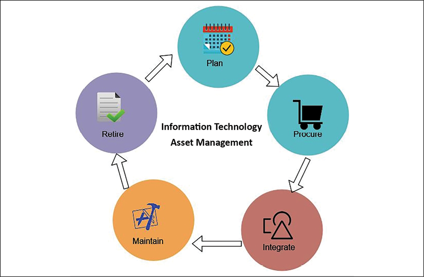

图 10.1：ITAM 流程

如上图所示，ITAM 流程包括以下阶段：

- **计划**：资产生命周期从计划开始，这是一个更具战略意义的重点，用于确定对整体 IT 资产和采购方法的需求。它包括成本效益分析和总拥有成本。
- **采购**：在采购阶段，组织根据计划的结果获取资产。他们还可能决定根据需要开发一些资产——例如，用于日志记录和监控的内部软件。
- **集成**：在此阶段，资产被安装到 IT 生态系统中。它包括资产的运营和支持，并定义用户访问权限——例如，安装日志代理以从集中仪表板中的所有服务器收集日志，并将监控仪表板指标限制为 IT 运营团队。
- **维护**：在维护阶段，IT 运营团队跟踪资产，并根据资产生命周期采取行动进行升级或迁移——例如，应用软件供应商提供的安全补丁。另一个例子是跟踪许可软件的生命周期结束，例如随着旧操作系统的生命周期结束，从 Windows Server 2008 迁移到 Windows 2022 的计划。
- **退役**：在退役阶段，运营团队处置报废资产。例如，如果旧数据库服务器的使用寿命即将结束，则团队会采取措施对其进行升级，并将所需的用户和支持迁移到新服务器。

ITAM 帮助组织遵守 **ISO 19770** 合规性要求。它包括软件采购、部署、升级和支持。 ITAM 提供更好的数据安全性并有助于提高软件合规性。它为运营、财务、营销团队和一线员工等业务部门之间提供了更好的沟通。配置管理是帮助维护 IT 库存数据以及所有者及其当前状态等详细信息的另一个方面。让我们进一步了解它。

#### 配置管理
配置管理维护配置项 (**CI**) 以管理和交付 IT 服务。 CI 在配置管理数据库 (**CMDB**) 中进行跟踪。 CMDB 存储和管理系统组件记录及其属性，例如它们的类型、所有者、版本以及与其他组件的依赖关系。 CMDB 跟踪服务器是物理服务器还是虚拟服务器、操作系统及其版本(即 Windows 2022 或 Red Hat Enterprise Linux (RHEL) 8.0)、服务器所有者(即支持、营销或HR)，以及它是否依赖于其他服务器，例如订单管理等。

配置管理不同于资产管理。资产管理处理资产从规划到报废的整个生命周期，而 CMDB 是资产管理的一个组件，用于存储单个资产的配置记录。如下图所示，配置管理实现了资产管理的集成和维护部分：

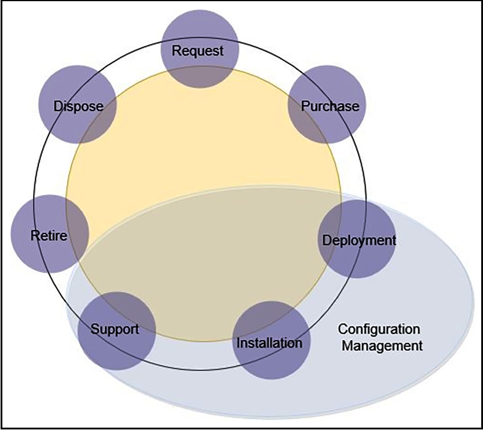

图 10.2：IT 资产生命周期与配置管理

配置管理，如上图所示，实现了资产管理的部署、安装和支撑部分。配置管理工具可以通过提供现成的资产配置信息帮助运营团队减少停机时间。

实施有效的变更管理有助于我们了解环境中任何变化的影响。最流行的配置管理工具是 Chef、Puppet、Ansible 和 Bamboo。你将在第 12 章 DevOps 和解决方案架构框架中了解有关它们的更多详细信息。

如果你的工作负载位于公共云中，例如 Amazon Web Services (**AWS**)、Microsoft Azure 或 Google Cloud Platform (**GCP**)，IT 管理会变得更加容易。云供应商提供内置工具来在一个地方跟踪和管理 IT 库存和配置。例如，AWS 提供 AWS Config 等服务，它跟踪作为 AWS 云工作负载的一部分启动的所有 IT 库存，以及 AWS Trusted Advisor 等服务，它建议成本、性能和安全改进，你可以使用这些服务决定如何管理你的工作量。你可以在以下屏幕截图中看到一个示例：

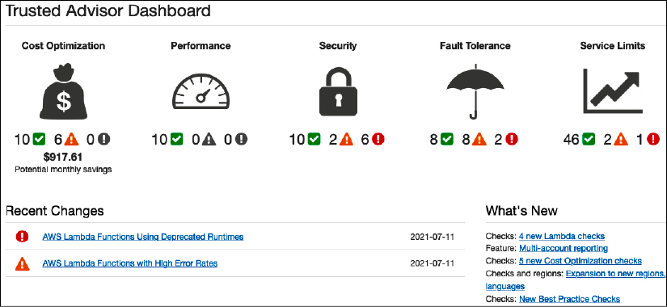

图 10.3：AWS Trusted Advisor 控制面板

如前面的屏幕截图所示，AWS Trusted Advisor 控制面板显示了 6 个安全问题，你可以进一步探索这些问题以了解更多详细信息。

配置管理有助于持续监控和记录你的 IT 资源配置，并允许你根据所需配置自动评估记录的配置。配置管理提供以下好处：

- **持续监控**：持续监控和记录 IT 资源的配置变化。
- **变更管理**：跟踪资源之间的关系并在进行变更之前审查资源依赖性。
- **持续评估**：持续审计和评估你的 IT 资源配置与你组织的政策和指南的整体合规性。
- **企业范围内的合规性监控**：查看整个企业的合规性状态并识别不合规的帐户。你可以更深入地查看特定区域帐户的状态。
- **管理第三方资源**：发布第三方资源的配置，例如 GitHub 存储库、Microsoft Active Directory 资源或任何本地和云端服务器。
- **操作故障排除**：捕获 AWS 资源配置更改的全面历史记录，以简化操作问题的故障排除。

配置管理可帮助你执行安全分析，持续监控资源的配置，并评估其配置是否存在潜在的安全漏洞。它可以让你了解 IT 资源和第三方资源的配置，并持续根据你所需的配置评估资源配置更改，从而帮助你评估是否符合内部政策和法规标准。

企业创建了一个框架，例如信息技术基础设施库 (**ITIL**)，它实施了信息技术服务管理 (ITSM) 最佳实践。 ITIL 提供了关于如何实施 ITSM 的视图。

在本节中，你了解了资产管理和配置管理，它们是 ITIL 框架的一部分，与卓越运营更相关。 ITSM 帮助组织每天运行其 IT 操作。你可以访问其网站 (https://www.axelos.com/best-practice-solutions/itil)，从其管理机构 AXELOS 了解有关 ITIL 的更多信息。 AXELOS 提供 ITIL 认证，以培养 IT 服务管理流程中的技能。正如你已经了解了规划，让我们在下一节中探索 IT 运营的功能。

### 卓越运营的运作

卓越运营取决于主动监控和在发生事件时快速响应恢复。通过了解工作负载的运行状况，可以确定事件和响应何时对其产生影响。使用有助于使用指标和仪表板了解系统运行状况的工具。你应该将日志数据发送到集中存储并定义指标以建立基准。

通过定义和了解工作负载是什么，可以快速准确地响应操作问题。使用工具自动响应支持工作负载各个方面的操作事件。这些工具允许你自动响应操作事件并启动它们的执行以响应警报。

使你的工作负载组件可更换，这样你就可以通过用已知的良好版本更换故障组件来缩短恢复时间，而不是解决问题。然后，在不影响生产环境的情况下分析失败的资源。为了实现卓越运营，以下是需要适当工具的领域：

- 监控系统健康状况
- 处理警报和事件响应

让我们通过有关可用工具和流程的信息更详细地了解每个领域。

#### 监控系统健康状况
跟踪系统运行状况对于了解工作负载行为至关重要。运营团队使用系统健康监控来记录系统组件中的任何异常，并采取相应的行动。传统上，监控仅限于跟踪服务器 CPU 和内存利用率的基础设施层。但是，监控需要应用于架构的每一层。以下是应用监控的重要组件。

##### 基础设施监控

基础设施监控是必不可少的，也是最流行的监控形式。基础设施包括托管应用程序所需的组件。这些是核心服务，例如存储、服务器、网络流量、负载均衡器等。基础设施监控可能包括以下指标：

- **CPU 使用率**：服务器在给定时间段内使用的 CPU 百分比
- **内存使用情况**：服务器在给定时间段内使用的随机存取内存 (**RAM**) 的百分比
- **网络利用率**：给定时间段内进出的网络数据包
- **磁盘利用率**：磁盘读/写吞吐量和每秒输入/输出操作数 (**IOPS**)
- **负载均衡器**：给定时间段内的请求计数数量

有更多可用指标，组织需要根据其应用程序监控要求自定义这些监控指标。以下屏幕截图显示了网络流量的示例监控仪表板：

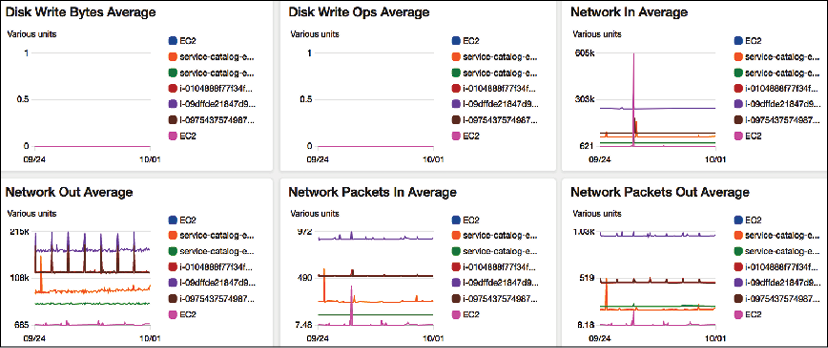

图 10.4：基础设施监控仪表板

你可以看到前面的系统仪表板在"平均网络"窗格中显示了一天内的峰值，并为不同的服务器应用了颜色编码。运营团队可以深入研究每个图表和资源，以获得更精细的视图来确定整体基础设施的健康状况。

##### 应用监控

有时，除了应用程序由于代码中的某些错误或任何第三方软件问题而出现问题外，你的基础架构都是健康的。你可能已经应用了一些供应商提供的操作系统安全补丁，这些补丁弄乱了你的应用程序。应用程序监控可能包括以下指标：

- **端点调用**：给定时间段内的请求数
- **响应时间**：完成请求的平均响应时间
- **Throttle**：当系统用完处理额外请求的容量时溢出的有效请求数
- **错误**：应用程序在响应请求时抛出错误

以下屏幕截图显示了示例应用程序端点监控仪表板：

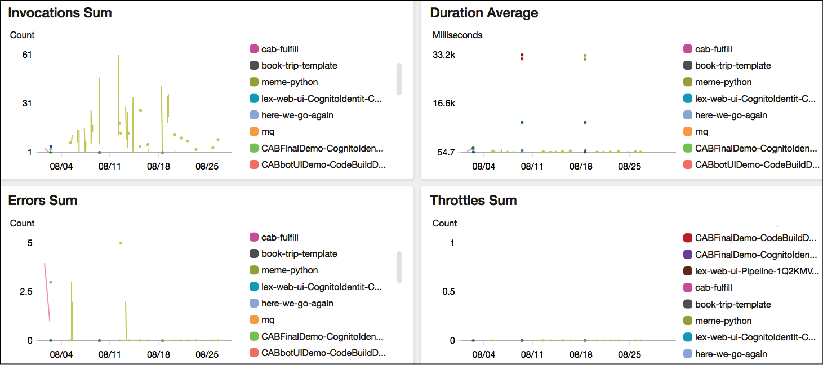

图 10.5：应用程序监控仪表板

可能有更多基于应用程序和技术的指标——例如，Java 应用程序的内存垃圾收集量、RESTful 服务的 HTTP POST 和 GET 请求数、4XX 客户端错误计数、5XX 服务器错误计数Web 应用程序的错误，以及他们可能正在寻找的表明应用程序运行状况不佳的内容。

##### 平台监控

你的应用程序可能正在使用多个需要监控的第三方平台和工具。这些可能包括以下内容：

- **内存缓存**：Redis 和 Memcached
- **关系数据库**：Oracle 数据库、Microsoft SQL Server、Amazon 关系数据库服务 (RDS)、PostgreSQL
- **NoSQL 数据库**：Amazon DynamoDB、Apache Cassandra、MongoDB
- **大数据平台**：Apache Hadoop、Apache Spark、Apache Hive、Apache Impala、Amazon Elastic MapReduce (EMR)
- **容器**：Docker、Kubernetes、OpenShift
- **商业智能工具**：Tableau、MicroStrategy、Kibana、Amazon QuickSight
- **消息系统**：MQSeries、Java 消息服务 (JMS)、RabbitMQ、简单队列服务 (SQS)
- **搜索**：Elasticsearch，基于 Solr 搜索的应用程序

上述每个工具都有自己的一组指标，你需要监控这些指标以确保你的应用程序整体健康。以下截图显示了关系数据库平台的监控仪表板：

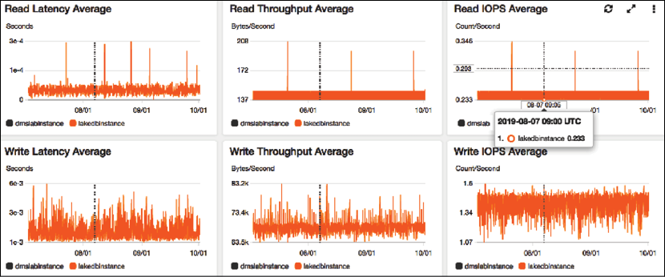

图 10.6：关系数据库管理系统 (RDBMS) 的平台监控仪表板

在上面的dashboard中，可以看到数据库有大量的写入活动，这表明应用程序在不断地写入数据。另一方面，读取事件相对一致，除了一些尖峰。

##### 日志监控

传统上，日志监控是一个手动过程，组织在遇到问题时采用被动方法来分析日志。然而，随着竞争的加剧和用户期望的提高，在用户注意到问题之前迅速采取行动变得至关重要。对于主动方法，你应该能够在集中位置流式传输日志并运行查询以监控和识别问题。

例如，如果某个产品页面出现错误，你需要立即知道错误并在用户投诉之前解决问题，否则你将蒙受收入损失。在任何网络攻击的情况下，你需要分析你的网络日志并阻止可疑的 IP 地址。这些 IP 可能会发送错误数量的数据包来降低你的应用程序。 AWS CloudWatch、Logstash、Splunk、Google Stackdriver 等监控系统提供了一个安装在你的应用程序服务器中的代理。代理会将日志流式传输到集中存储位置。你可以直接查询中央日志存储并为任何异常设置警报。

以下屏幕截图显示了在集中位置收集的示例网络日志：

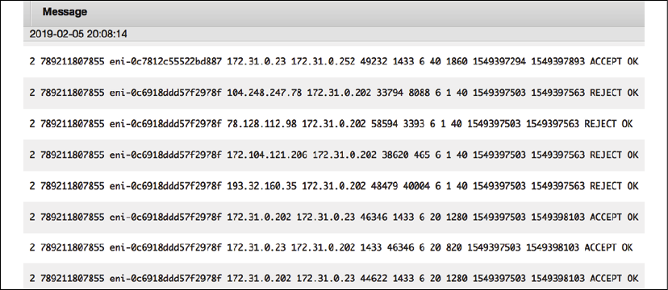

图 10.7：在集中式数据存储中流式传输的原始网络日志

你可以在这些日志中运行查询，找出拒绝请求数量最多的前 10 个源 IP 地址，如以下屏幕截图所示：

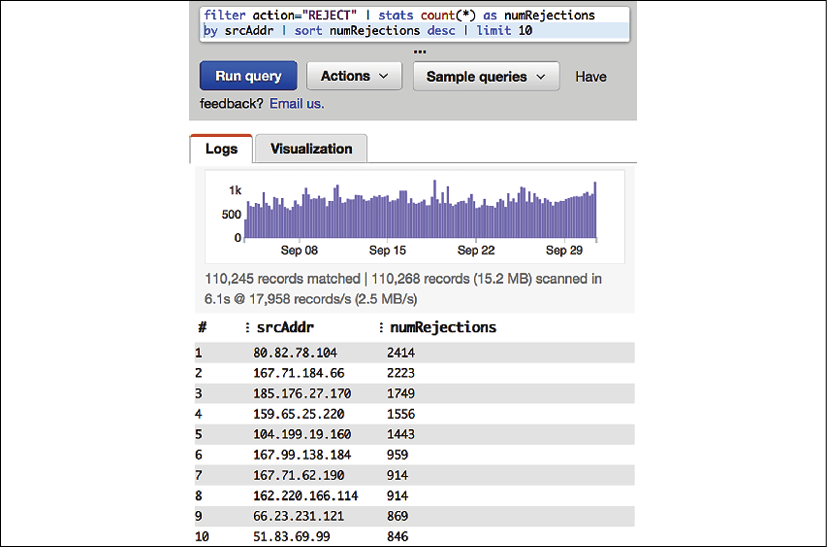

图 10.8：通过运行查询从原始网络日志中获得洞察力

如前面的查询编辑器所示，你可以创建一个图表并在检测到的拒绝数量超过特定阈值(例如超过 5,000)时发出警报。

##### 安全监控

安全性是任何应用程序的关键方面。在解决方案设计期间应考虑安全监控。正如你在第 8 章"安全注意事项"中查看各种体系结构组件中的安全性时所了解到的那样，安全性需要应用于所有层。你需要实施安全监控以采取行动并响应任何事件。以下重要组件显示需要应用监控的位置：

- **网络安全**：监控任何未经授权的端口打开、可疑 IP 地址和活动
- **用户访问**：监控任何未经授权的用户访问和可疑的用户活动
- **应用安全**：监控任何恶意软件或病毒攻击
- **Web 安全**：监控分布式拒绝服务 (**DDoS**) 攻击、SQL 注入或跨站点脚本 (**XSS**)
- **服务器安全**：监控安全补丁中的任何漏洞
- **合规性**：监控任何合规性失误，例如违反支付卡行业 (**PCI**) 对支付应用程序的合规性检查或对医疗保健应用程序的健康保险流通与责任法案 (HIPAA)
- **数据安全**：监控未经授权的数据访问、数据屏蔽以及静态和传输中的数据加密

对于监控，你可以使用各种第三方工具，例如 **Imperva**、**McAfee**、**Qualys**、**Palo Alto Networks**、**Sophos**、**Splunk**、**Sumo Logic**、**Symantec**、Turbot 等。

下面显示了一个使用 Amazon Detective 对 AWS 云进行安全监控的示例：

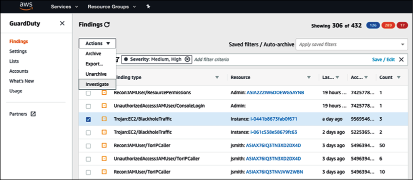

图 10.9：使用 Amazon GuardDuty 进行安全监控

当你使用应用程序监控工具来监控系统的所有组件时，监控监控系统是必不可少的。确保监控你的监控系统的主机。例如，如果你在 Amazon Elastic Compute Cloud (**EC2**) 中托管监控工具，则 AWS CloudWatch 可以监控 EC2 的运行状况。

#### 处理警报和事件响应
监控是卓越运营运作的一部分；另一部分涉及处理警报并根据警报采取行动。使用警报，你可以定义系统阈值以及你想要工作的时间。例如，如果服务器 CPU 利用率达到 70% 达 5 分钟，则监控工具会记录高服务器利用率并向运营团队发送警报，以便在系统崩溃之前采取措施降低 CPU 利用率。针对这个事件，运维团队可以手动添加服务器。当自动化到位时，自动缩放会触发警报以根据需要添加更多服务器。它还会向运营团队发送通知，稍后可以解决。

通常，你需要定义警报类别，运营团队根据警报严重性准备响应。

以下严重性级别提供了如何对警报优先级进行分类的示例：

- **严重性 1**：Sev1 是一个关键的优先级问题。只有在对客户产生重大影响且需要立即进行人工干预时，才应提出 Sev1 问题。 Sev1 警报可能是整个应用程序已关闭。典型的团队需要在 15 分钟内响应此类警报，并需要 24/7 支持来解决问题。
- **严重性 2**：Sev2 是高优先级警报，应在工作时间内解决。例如，应用程序已启动，但评级和评论系统不适用于特定产品类别。典型的团队需要在 24 小时内响应此类警报，并需要正常办公时间的支持来解决问题。
- **严重性 3**：Sev3 是一个中等优先级的警报，可以在几天内的工作时间内解决——例如，服务器磁盘将在 2 天内填满。典型的团队需要在 72 小时内响应此类警报，并需要正常办公时间的支持来解决问题。
- **严重性 4**：Sev4 是低优先级警报，可以在一周的工作时间内解决——例如，安全套接字层 (SSL) 认证将在 2 周后到期。典型的团队需要在一周内响应这些类型的警报，并且需要正常办公时间的支持来解决问题。
- **严重性 5**：Sev5 属于通知类别，不需要升级，它可以是简单的信息——例如，发送部署完成的通知。此处不需要回复，因为它仅供参考。

每个组织都可以根据其应用程序需求具有不同的警报严重性级别。一些组织可能希望为严重性设置四个级别，而其他组织可能会设置六个级别。此外，警报响应时间可能不同。也许某些组织希望在 24/7 的基础上在 6 小时内解决 Sev2 警报，而不是等待它们在办公时间内得到解决。

设置警报时，请确保标题和摘要具有描述性和简洁性。通常，警报会发送到手机(作为 SMS)或寻呼机(作为消息)，并且需要简短且信息量足够大，以便立即采取行动。确保在消息正文中包含正确的指标数据。

在消息正文中，包括诸如 The disk is 90% full in production-web-1 server 而不是仅仅说 The disk is full 之类的信息。以下屏幕截图显示了一个示例警报仪表板：

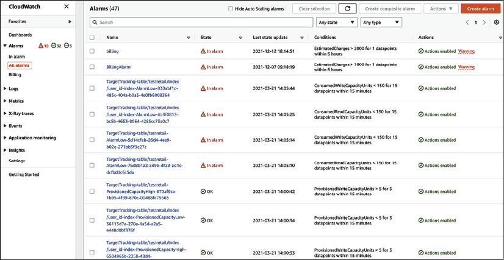

图 10.10：警报仪表板

如前面的警报仪表板所示，当名为 testretail 的 NoSQL Amazon DynamoDB 数据库表使用低写入容量单位并导致不必要的额外成本时，会发出一个警报。底部和顶部的两个警报具有正常状态，因为在监控期间收集的数据完全在阈值内。可能还有其他警报显示 Insufficient data，这意味着没有足够的数据点来确定你正在监视的资源的状态。只有当它可以收集数据并进入 OK 状态时，你才应该认为此警报有效。

在出现严重警报的情况下测试事件响应对于确保你已准备好根据定义的 SLA 进行响应非常重要。确保你的阈值设置正确，以便你有足够的空间来解决问题，并且不要发送太多警报。确保一旦问题得到解决，你的警报就会重置为原始设置并准备好再次捕获事件数据。

事件是对系统和客户产生负面影响的任何计划外中断。事件发生时的第一反应是恢复系统和恢复客户体验。当系统恢复并开始运行时，可以稍后解决该问题。自动警报有助于主动发现事件并将对用户的影响降至最低。如果整个系统出现故障，这可以充当到灾难恢复站点的故障转移，并且主系统可以在以后修复和恢复。

例如，Netflix 使用 **Simian Army** (https://netflixtechblog.com/the-netflix-simian-army-16e57fbab116)，其中有 **Chaos Monkey** 来测试系统可靠性。 Chaos Monkey 安排生产服务器的随机终止，以测试系统是否可以在不对最终用户产生任何影响的情况下响应灾难事件。同样，Netflix还有其他的猴子来测试系统架构的各个维度，比如**Security Monkey**、**Latency Monkey**，甚至还有Chaos Gorilla，可以模拟整个可用区的宕机。

监控和警报是实现卓越运营的关键组成部分。所有监控系统通常都集成了警报功能。完全自动化的警报和监控系统提高了运营团队维护系统健康的能力，提供专业知识以采取快速行动，并在用户体验方面表现出色。

当你监控你的应用程序环境时，应用持续改进和实现卓越非常重要。让我们更详细地了解如何提高卓越运营。

##### 提高卓越运营

任何过程、产品或应用程序都需要持续改进才能脱颖而出。卓越运营需要不断改进才能随着时间的推移而成熟。在执行 RCA(根本原因分析)并从各种操作活动中吸取教训时，你应该继续实施小的增量更改。

从失败中吸取教训将帮助你预测可能计划(如部署)或计划外(如利用率激增)的任何操作事件。你应该在操作手册中记录所有经验教训和更新补救措施。为了改进运营，以下是你需要适当工具的领域：

- IT 运营分析
- 根本原因分析
- 审计和报告

##### IT 运营分析

IT 运营分析 (**ITOA**) 是一种从各种资源收集数据以做出决策并预测你可能遇到的任何潜在问题的做法。为了改进，必须分析所有事件和运营活动。分析故障将有助于预测任何未来事件，并让团队准备好提供适当的响应。

实施一种机制来收集操作事件日志、跨工作负载的各种活动以及基础架构更改。你应该创建详细的活动轨迹并维护活动历史记录以供审计之用。

大型组织可能有数百个系统生成大量数据。你需要一种机制来摄取和存储所有日志和事件数据一段时间(例如 90 或 180 天)以获得洞察力。 ITOA 使用大数据架构来存储和分析来自各地的数 TB 数据。 ITOA 有助于发现你通过查看单个工具无法发现的任何问题，并有助于确定各种系统之间的依赖关系，从而提供整体视图。

如下图所示，每个系统都有自己的监控工具，有助于获得洞察力并维护各个系统组件。对于运营分析，你需要在一个集中的地方摄取这些数据。所有操作数据收集在一个地方提供单一的事实来源，你可以在其中查询所需数据并运行分析以获得有意义的见解：

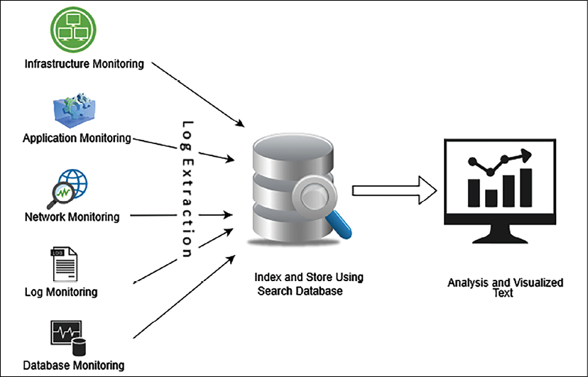

图 10.11：ITOA 的大数据方法

要创建运营分析系统，你可以使用可扩展的大数据存储，例如 Amazon Simple Storage Service (**S3**)。你还可以将数据存储在本地 Hadoop 集群中。对于数据提取，可以在每台服务器上安装代理，将所有监控数据发送到一个集中存储系统。你可以使用 **Amazon CloudWatch** 代理从每个服务器收集数据并将其存储在 S3 中。

**ExtraHop** 和 **Splunk** 等第三方工具可以帮助从各种系统中提取数据。

在集中存储中收集数据后，你可以执行转换以使数据为搜索和分析做好准备。数据转换和清洗可以使用Spark、MapReduce、AWS Glue等大数据应用来实现。要可视化数据，你可以使用任何商业智能工具，例如 Tableau、MicroStrategy、Amazon QuickSight 等。在这里，我们讨论的是构建提取、转换和加载 (**ETL**) 管道。你将在第 13 章"解决方案架构的数据工程"中了解更多详细信息。你可以进一步执行机器学习以对未来事件进行预测分析。

你将在第 14 章"机器学习体系结构"中了解有关机器学习的更多信息。

##### 根本原因分析
为了持续改进，必须防止任何错误再次发生。如果你能够正确识别问题，那么就可以开发和应用有效的解决方案。找到问题的根本原因以解决问题很重要。五个为什么是一种简单但最有效的技术，用于确定问题的根本原因。

在五个为什么技术中，你召集团队对事件进行回顾，并连续提出五个问题以确定实际问题。以数据未显示在应用程序监控仪表板中的示例为例。你会问五个为什么来找到根本原因。

**问题**：应用程序仪表板未显示任何数据。

1. 为什么：因为应用无法连接数据库
2. 为什么：因为应用程序出现数据库连接错误
3. 为什么：因为网络防火墙没有配置到数据库端口
4. 为什么：因为配置端口是手动检查，基础架构团队错过了
5. 为什么：因为团队没有自动化工具

**根本原因**：基础设施创建期间的手动配置错误。

**解决方案**：实施用于自动化基础设施创建的工具。

在前面的示例中，乍一看问题似乎与应用程序有关。经过五个为什么分析，发现问题更大，需要引入自动化来防止类似事件的发生。

RCA 帮助团队记录吸取的经验教训，并以此为基础不断构建卓越运营。确保更新和维护类似 runbook 的代码，并在整个团队中共享最佳实践。

##### 审计和报告
审计是通过内部或外部干扰创建建议和识别系统中任何恶意活动的基本活动之一。如果你的应用程序需要符合监管机构的要求，例如 PCI、HIPPA、联邦风险和授权管理计划 (**FedRAMP**)、国际标准化组织 (**ISO**) 等，审计就变得尤为重要。大多数合规监管机构需要进行定期审计并验证系统中正在进行的每项活动，以准备合规报告并颁发证书。

审计对于预防和检测安全事件至关重要。黑客可能会悄无声息地进入你的系统并在没有人注意的情况下系统地窃取信息。定期安全审计可以发现隐藏的威胁。你可能希望对成本优化进行定期审计，以确定资源是否在不需要时处于闲置状态。此外，确定资源需求和可用容量，以便你可以进行规划。

除了警报和监控之外，运营团队还负责通过启用和执行审计来保护系统免受任何威胁。 IT 审计确保你保护 IT 资产和许可证保护，并确保数据完整性和操作充分实现你的组织目标。以下屏幕截图显示了使用 Amazon Macie 存储在 Amazon S3 存储桶中的数据审计，这是一种数据安全和数据隐私服务，使用机器学习和模式匹配来发现和保护你在 AWS 中的敏感数据。

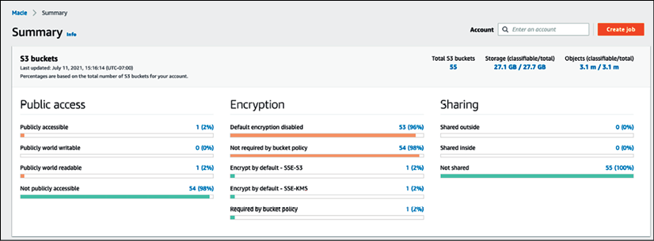

图 10.12：来自 Amazon Macie 的数据审计报告摘要

上述屏幕截图中的数据审计报告显示了数据可访问性、加密和数据共享报告以及数据存储和大小详细信息。

审计步骤包括计划、准备、评估和报告。任何风险项目都需要在报告中突出显示，并将进行后续工作以解决未解决的问题。

为了实现卓越运营，团队可以执行内部审计检查，以确保所有系统都健康，并且有适当的警报来检测任何事件。

## 在公共云中实现卓越运营

AWS、GCP 或 Azure 等公共云提供商提供许多内置功能和指导，以在云中实现卓越运营。云提供商提倡自动化，这是实现卓越运营的最重要因素之一。以 AWS 云为例，以下服务可以帮助实现卓越运营：

- **规划**：卓越运营规划包括识别差距和建议、通过脚本自动化以及管理你的服务器群以进行修补和更新。以下 AWS 服务可在规划阶段为你提供帮助：
  - **AWS Trusted Advisor**：AWS Trusted Advisor 根据预先构建的最佳实践检查你的工作负载并提供实施建议
  - **AWS CloudFormation**：借助 AWS CloudFormation，可以将整个工作负载视为代码，包括应用程序、基础设施、策略、治理和操作
  - **AWS Systems Manager**：AWS Systems Manager 提供批量管理云服务器以进行修补、更新和整体维护的能力
- **功能**：一旦你创建了卓越运营最佳实践并应用了自动化，你就需要持续监控你的系统以便能够响应事件。以下 AWS 服务可帮助你进行系统监控、警报和自动响应：
  - **Amazon CloudWatch**：CloudWatch 提供数百个内置指标来监控工作负载操作并根据定义的阈值触发警报。它提供中央日志管理系统并触发自动事件响应。
  - **AWS Lambda**：用于自动响应操作事件的 AWS 服务是 AWS Lambda。
- **改进**：当事件进入你的系统时，你需要确定它们的模式和持续改进的根本原因。你应该应用最佳实践来维护脚本的版本。以下 AWS 服务将帮助你识别和应用系统改进：
  - **Amazon OpenSearch**：OpenSearch 有助于从经验中学习。使用 OpenSearch 分析日志数据以获得洞察力，并使用分析从经验中学习。
  - **AWS CodeCommit**：通过将库、脚本和文档作为代码维护在中央存储库中来共享知识。

AWS 提供各种功能来以代码的形式运行你的工作负载和操作。这些功能可帮助你自动化操作和事件响应。借助 AWS，你可以轻松地将故障组件替换为良好版本并分析故障资源，而不会影响生产环境。

在 AWS 上，聚合所有系统操作和工作负载活动以及基础设施的日志，以创建活动历史记录，例如使用 AWS CloudTrail。你可以使用 AWS 工具来查询和分析一段时间内的操作，并找出需要改进的地方。在云中，资源发现很容易，因为所有资产都位于同一层次结构中的 API 和基于 Web 的界面下。你还可以从云端监控本地工作负载。对于 AWS 云中的安全审计，Amazon GuardDuty 和 Amazon Detective 提供跨多个账户的重要洞察力和详细信息。

卓越运营是一项持续的努力。应分析每个操作故障以改进应用程序的操作。通过了解应用程序负载的需求、将常规活动记录为运行手册、遵循指导问题处理的步骤、使用自动化和建立意识，你的操作将准备好处理任何故障事件。

## 概括

通过根据运营需求和使用 RCA 从过去事件中吸取的经验教训不断改进，可以实现卓越运营。你可以通过提高运营的卓越性来取得商业成功。构建和运行可提高效率的应用程序，同时构建高度响应的部署。使用最佳实践使你的工作负载运行良好。

在本章中，你了解了实现卓越运营的设计原则。这些原则提倡操作自动化、持续改进、采取渐进方法、预测失败并准备好响应。

你了解了卓越运营的各个阶段以及相应的技术选择。在规划阶段，你了解了 ITAM 以跟踪 IT 资源清单并使用配置管理识别它们之间的依赖关系。

你在卓越运营的运作阶段了解了警报和监控。你考虑了各种监控，例如基础架构、应用程序、日志、安全和平台监控。你了解了警报的重要性，以及如何定义警报严重性和响应它。

在卓越运营的改进阶段，你通过构建大数据管道了解了 IT 运营中的分析、使用五个为什么执行 RCA 的方法，以及审计对于保护系统免受任何恶意行为和未注意到的威胁的重要性。你了解了云中的卓越运营以及可用于在 AWS 云中实现卓越运营的不同内置工具。

到目前为止，你已经了解了性能、安全性、可靠性和卓越运营方面的最佳实践。在下一章中，你将了解成本优化的最佳实践。你还将了解用于优化整体系统成本的各种工具和技术，以及如何利用云中的多种工具来管理 IT 支出。