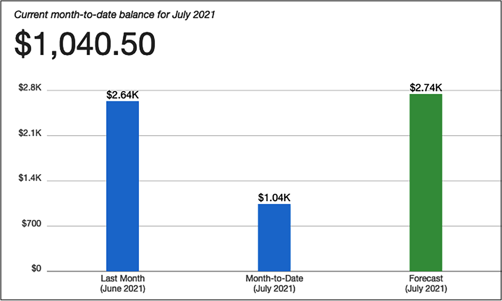

# 成本考虑

任何企业的主要目标之一是在为客户服务的同时提高盈利能力。成本是项目启动时讨论的关键参数。进行应用程序升级和添加新产品功能在很大程度上取决于可用资金的数量。产品的成本是每个人的责任，需要在产品生命周期的每个阶段(从计划到后期制作)加以考虑。本章将帮助你了解优化 IT 解决方案和运营成本的最佳实践。

成本优化是一个持续的过程，需要在不牺牲客户体验的情况下谨慎管理。成本优化并不意味着降低成本，而是通过最大化投资回报率 (ROI) 来降低业务风险。在计划任何成本优化并采取相应行动之前，你需要了解客户的需求。通常，如果客户追求质量，他们愿意支付更高的价格。

在本章中，你将了解用于解决方案成本优化的各种设计原则。架构的每个阶段和组件都需要考虑成本方面。你将了解正确选择技术以确保每一层的成本优化。你将在本章中学习以下成本优化最佳实践：

- 成本优化的设计原则
- 成本优化技术
- 公共云中的成本优化

到本章结束时，你将了解在不影响业务敏捷性和成果的情况下优化成本的各种技术。你将学习不同的方法来监控成本并应用治理来控制成本。

## 成本优化的设计原则

成本优化包括增加业务价值和最小化风险，同时降低运营业务的成本。你需要通过估算预算和预测支出来制定计划。要实现成本收益，你需要实施成本节约计划并密切监控你的支出。

你可以遵循几个有助于实现成本优化的原则。以下部分讨论了可帮助你优化成本的通用设计原则。你会发现所有的成本优化设计原则都是密切相关，相辅相成的。

### 计算总拥有成本

通常，组织往往会忽视总拥有成本 (**TCO**)，并根据购买软件和服务的前期成本(即资本支出 (**CapEx**))来做出决定。虽然确定前期成本至关重要，但从长远来看，TCO 最为重要。 TCO 包括资本支出和运营支出 (**OpEx**)，涵盖应用程序生命周期的所有维度。 CapEx 成本包括组织为获取服务和软件而预先支付的价格，而 OpEx 包括软件应用程序的运营、维护、培训和报废成本。最好在计算长期投资回报率时考虑所有相关成本，以帮助做出更具战略性的决策。

例如，当你购买一台 24/7 全天候运行的冰箱时，你会寻找节能等级以保持低电费。你已经准备好预先支付更高的价格，因为你知道随着时间的推移总成本会因能源费用的节省而降低。

现在让我们以数据中心为例。涉及前期硬件购置成本，即资本支出。然而，数据中心的设置需要额外的持续成本，即运营支出，其中包括加热、冷却、机架维护、基础设施管理、安全等。

对于典型用例，当你购买和实施软件时，请考虑以下成本来计算 TCO：

图 11.1：软件的 TCO

让我们在更细粒度的层面上看一下。对于 Oracle 或 MS SQL 数据库等现成软件，每个 TCO 组件都涉及以下常见成本：

- **购买和设置成本**：这些是购买软件和部署软件的服务的前期成本。这包括以下内容：

  - 软件价格包括带用户许可证的软件

  - 硬件成本包括购买服务器和存储以部署软件

  - 实施成本包括为生产做好准备所花费的时间和精力

  - 迁移成本包括将数据移动到新系统

- **运营和维护成本**：这延续了为业务用例保持软件运行的服务成本。该费用包括以下内容：
  - 软件维护与支持
  - 修补和更新
  - 强化
  - 维护硬件服务器的数据中心成本
  - 安全
- **人力资源和培训成本**：这是培训员工使用软件处理业务活动的间接费用。该费用包括以下内容：
  - 申请管理人员
  - IT 支持人员
  - 职能及技术顾问
  - 培训费用和培训工具

在寻找解决方案时，你将有多种选择(例如订阅软件即服务 (**SaaS**) 产品，例如 **Salesforce CRM**)。 SaaS 模型主要基于订阅，因此你需要确定你是否获得了更多用途所需的投资回报率。你可以采用混合方法，通过选择基础架构即服务 (**IaaS**) 选项并安装现成的软件，使用云来处理你的硬件。总的来说，如果可用的软件不能满足你的要求，你可以选择自己构建。在任何情况下，你都应该计算 TCO 来决定在哪里可以获得最大的 ROI。让我们看看预算和预测规划，这有助于控制 TCO 并实现 ROI。

### 规划预算和预测

每个企业都需要计划其支出并计算投资回报率。规划预算为组织和团队提供成本控制方面的指导。组织计划 1-5 年的长期预算，这有助于他们根据所需资金开展业务。这些预算然后归结为单个项目和应用程序级别。在解决方案设计和开发过程中，团队需要考虑可用的预算并做出相应的计划。预算有助于量化企业想要实现的目标。该预测提供了对公司正在做的事情的估计。

从长远来看，你可以将预算视为重要的战略规划，而预测提供了更具战术层面的估计来决定业务方向。在应用程序开发和运营中，如果没有预算和预测，你可能很快就会忘记预算并超出预期成本。这两个术语可能令人困惑，所以让我们了解预算和预测之间的明显区别：

|                           预算                           |                    预报                    |
| :------------------------------------------------------: | :----------------------------------------: |
|        代表你想要实现的业务目标的未来结果和现金流        |             代表收入和业务现状             |
|                  长期计划，例如 1-5 年                   |              按月或按季度计划              |
|       根据业务驱动因素不经常调整，可能每年调整一次       |          根据实际业务进展定期更新          |
| 帮助决定业务方向，例如根据实际成本与预算成本进行组织重组 | 有助于调整短期运营成本，例如额外的人员配置 |
|         通过比较计划成本与实际成本来帮助确定绩效         |      不用于性能变化，而是用于简化进度      |

预测信息可帮助你立即采取行动，而预算可能因市场变化而变得无法实现。 如下图所示，当你在处理日常解决方案时，基于历史支出预测的发展会提示你调整下个月的成本：

图 11.2：计费和预测报告

在前面的账单和预测报告中，你的每月预算为 2,000 美元，预测显示你将在月底超支预算。在这里，预测可帮助你采取行动并控制成本以保持在预算范围内。让我们在下一节中了解通过管理需求和服务来提高成本效率的机制。

### 管理需求和服务目录

几乎每个组织都有一个集中的 IT 团队，该团队与内部业务伙伴合作，例如应用程序开发团队和各个业务部门的支持团队。 IT 团队管理对 IT 基础架构的需求，包括所有软件和硬件的成本，以及管理应用程序托管的支持。通常，业务合作伙伴不了解他们使用的 IT 服务的成本驱动因素。例如，应用程序开发团队倾向于过度配置他们的开发或测试环境，从而导致额外成本。

从各个组织单位获得正确规模和需求预测的其他因素可以帮助匹配供需。通过将所有需求整合到一个地方，组织可以从规模经济中获益。你可以获得较低的可变成本，因为大合同可以实现更高的规模经济。来自所有组织单位的正确需求被汇总，这转化为更低的价格。

组织可以采用以下两种方法之一来管理需求和服务：

- **需求管理**：为了节省现有 IT 环境的成本(你可能会发现超支现象很普遍)，你可以采用需求主导的方法。它有助于在短期内提高成本效率，因为你没有引入很多新服务。你可以分析历史数据以了解推动需求的因素并捕获过度配置的案例。你应该在 IT 团队和业务合作伙伴之间建立一个流程来简化 IT 服务的运营成本。
- **服务目录管理**：如果有新服务需求，历史数据不多，可以采用服务主导的方式。在这种方法中，你需要了解最常用服务的需求并创建一个目录。例如，假设开发团队需要一台带有 MySQL 数据库的 Linux 服务器来创建开发环境。在这种情况下，IT 团队可以创建一个服务目录，帮助开发团队获得一个小型 Linux 和一个数据库服务器。同样，IT 团队可以确定最常见的服务集并附加细粒度的成本。

从短期和长期来看，每种方法都可以显着节省成本。然而，这些转换带来了巨大的挑战，因为你需要更改项目规划和审批流程。业务和财务团队需要协调并理解业务增长与增加的 IT 能力之间的明确关系。成本模型需要围绕最有效的方法构建，方法是结合来自云、本地和现成的产品。

### 跟踪支出

你可以通过跟踪支出并将其链接到系统或企业所有者来查找单个系统成本。透明的支出数据有助于确定投资回报率并奖励所有者，优化资源并降低成本。它可以帮助你确定部门或项目每月的成本。

节约成本是一项共同责任，你需要有一种机制让每个人都对节约成本负责。通常，组织会引入回扣或退款机制以在组织单位之间分担成本责任。

集中计费账户以回馈方式通知每个组织单位他们的支出，但不收取实际金额。组织内的每个业务部门都在退款机制中的主收款人账户下管理其预算。主账户每月根据业务单位的IT资源消耗向业务单位返还金额。

在开始为你的组织进行成本控制时，最好以回馈作为踏脚石，并随着组织模型的成熟而转向费用回馈。对于每个业务部门，你应该通过配置通知来创建支出意识，以便团队在接近预测或预算的消费量时收到警报。你应该创建一种机制，通过将成本适当分配给正确的业务计划来监控成本。提供可见性，为每个团队的成本支出建立问责制。成本跟踪将帮助你了解团队运作。

每个工作负载都不同；你应该使用适合你的工作负载的定价模型，以最大限度地降低成本。建立确保通过应用成本优化最佳实践实现业务目标的机制。你可以通过定义标记策略将业务部门与特定支出联系起来并使用平衡方法来避免超支。

### 持续的成本优化

如果你遵循成本优化最佳实践，你应该与现有活动进行良好的成本比较。随着时间的推移迁移和成熟的应用程序的成本总是可以降低的。成本优化永远不会结束，直到识别省钱机会的成本超过你将节省的金额。在达到这一点之前，你应该持续监控你的支出并寻找新的方法来节省成本。你应该不断寻找一个区域，通过移除闲置资源来节省成本。

对于成本和性能平衡的架构，确保为资源支付的成本得到充分利用，并避免任何严重未充分利用的 IT 资源，例如服务器实例。

显示异常高或低成本的有偏见的利用率指标会损害你组织的业务。

需要仔细考虑用于成本优化的应用程序级指标。例如，引入归档策略来控制数据存储容量。要优化数据库，你应该检查适当的数据库部署需求，例如数据库的多位置部署是否必不可少，或者配置的每秒输入/输出操作数 (**IOPS**) 是否适用于你的数据库利用率需求。为了减少你的管理和运营开销，你可以使用 SaaS 模型来帮助你的员工专注于应用程序和业务活动。

要确定差距并应用必要的更改以节省成本，你应该在项目生命周期中实施资源管理和更改控制流程。你的目标是帮助你的组织设计尽可能最佳且具有成本效益的架构。继续寻找可以直接降低成本的新服务和功能。

让我们学习一些可以帮助你优化成本和提高投资回报率的技术。

## 成本优化技术

为了获得竞争优势并跟上快速增长的步伐，企业正在加大对技术的投资。由于经济不稳定，成本优化成为一项重要但具有挑战性的任务。这些公司花费大量时间和研究来降低采购流程、运营和供应商的成本。许多公司甚至共享数据中心、呼叫中心和工作空间作为一种节省成本的方法。有时组织会延迟升级以避免购买新的昂贵硬件。

如果组织更广泛地审视其业务部门的整体信息技术架构，则可以节省更多。改进现有架构可以打开大门，为公司带来更多机会和业务，即使这需要对预算进行更多调整。让我们确定公司可以通过迁移到云、简化架构、虚拟化和共享资源等技术节省资金并获得更多收入的重点领域。

### 降低架构复杂性

组织通常缺乏集中式 IT 架构，导致每个业务部门都试图构建自己的工具集。缺乏整体控制导致大量重复系统和数据不一致。各个业务部门的 IT 计划是由短期目标驱动的。

在这种情况下，业务部门与长期组织愿景不太一致，例如整个组织的数字化转型。此外，它增加了维护和升级这些系统的复杂性。采取一个简单的步骤来定义既定标准并避免重复可以帮助节省成本。

在下图中，你可以在左侧看到一个复杂的架构，其中业务部门在没有任何标准化的情况下在自己的应用程序中工作，从而导致具有大量依赖关系的重复应用程序。这种架构导致高成本和高风险。任何新的实验都需要很长时间才能推向市场，这会导致失去竞争优势。标准流程可以提供整体视图和高度灵活性，以通过应用自动化创建敏捷环境，这有助于降低总体成本并带来更显着的投资回报率：

图 11.3：架构标准化

首先是消除重复并确定跨业务部门的功能重用，以降低架构的复杂性。在对现有架构进行差距分析时，你会发现有那么多代码、那么多现有组件和一个可以在整个组织中重用以支持你的业务需求的项目。要降低 IT 体系结构的复杂性，请考虑一个适合你的业务需求并提供 ROI 的开箱即用的解决方案。如果没有其他选项可用，定制应该是最后的方法。

任何新的应用程序都需要有一个可访问的集成机制，以便使用面向服务的体系结构 (SOA) 与现有系统进行交互。跨应用程序协调用户界面设计提供了一组标准的 UI 包，可以将其重复用于任何新应用程序。

同样，其他模块也可以通过面向服务的设计进行复用。你在第 6 章"解决方案体系结构设计模式"中学习了 SOA 模式，它帮助你保持所有不同的软件部分独立工作并仍然相互通信以构建整个系统。

在模块化方法中，每个团队负责开发一项服务，组织中的每个团队都可以使用该服务来避免重复。作为架构师，你应该帮助团队创建面向服务的设计，其中每个团队将单独的架构组件作为可以独立开发的服务来处理。借助微服务架构，你可以以模块化方式部署整个应用程序。如果一个组件不工作，你可以在不影响整个应用程序的情况下对其进行返工。例如，为从访问电子商务网站的客户收集付款而开发的支付服务也可用于在供应商管理系统中向供应商付款。

设置集中式 IT 架构后，采用模块化方法可帮助你降低成本。授权你的 IT 架构团队可以帮助使组织单位与公司的愿景保持一致，并支持其他并行项目遵循整体战略。它还有助于在其他经常被忽视的关键服务中提供一致性，例如法律、会计和人力资源。

在 IT 架构团队的帮助下，你可以获得出色的反馈并确保项目符合业务需求和要求。通过跨团队监督整体架构，架构师可以建议是否存在任何与业务需求不一致的重复工作、项目、流程或系统。集中式架构将降低复杂性和技术债务，带来更高的稳定性并提高质量。集中式架构的总体思路是提高 IT 效率，让我们进一步了解它。

### 提高 IT 效率

如今，每个公司都在使用和消耗 IT 资源。过多的服务器、笔记本电脑、存储容量和软件许可证消耗了大量资金。许可证是有时未被充分利用、未被发现、闲置或安装不正确并消耗大量资金的资源之一。一个集中的 IT 团队可以通过跟踪使用的软件许可证和停用额外的许可证来领导许可证优化工作。他们可以通过与供应商协商批量折扣来节省成本。

为提高 IT 效率，你可能希望取消需要额外资金和资源的不合规项目。此外，你应该帮助团队重新审视战略，以持续支持或终止任何未使用和未对齐的项目。成本优化可以考虑以下方法：

- 重新评估成本高的项目，因为它们可能与业务愿景不一致。重塑具有高价值但对 IT 战略没有直接影响的项目。
- 降低那些几乎没有业务价值的项目的优先级，即使它们与 IT 战略保持一致。
- 取消商业价值低的不合规项目。
- 停用或停用未使用的应用程序。
- 通过对其进行现代化改造以降低维护成本来替换旧的遗留系统。
- 通过重新利用现有应用程序避免重复项目。
- 尽可能合并数据并开发集成数据模型。你将在第 13 章解决方案架构的数据工程中了解如何维护集中式数据湖。
- 整合整个组织的供应商采购，以节省 IT 支持和维护支出的成本。
- 整合任何与支付和访问管理功能相同的系统。
- 消除昂贵、浪费、过度配置的项目和支出。

迁移到云可能是有效增加 IT 资源和降低成本的一个很好的考虑。公共云提供商，例如 Amazon Web Services (AWS)，提供现收现付模式，这意味着你只需为使用的内容付费。例如，开发人员桌面可以在非工作时间和周末关闭，从而减少高达 70% 的工作空间成本。批处理系统只需要启动来处理作业，然后可以立即关闭。它的工作原理就像你在不需要节省电费时将其关闭的任何电器一样。

应用自动化是提高整体 IT 效率的重要机制。自动化有助于消除成本高昂的人工，并减少无差错地执行日常工作所花费的时间。尽可能自动化以配置服务器、运行监控作业和处理数据。

在决定优化成本的同时，确保做出正确的权衡以改善结果。让我们举个例子。如果你要去一个主题公园，在那里你想体验很多有趣的游乐设施，那么你愿意支付更高的价格，看看你所花的钱的价值。为了吸引更多的顾客，如果供应商决定降低价格并通过减少愉快游乐设施的数量来进行调整，那么你可能会因为寻找美好时光而去另一个主题公园。在这里，竞争对手将获得优势并吸引现有客户，而当前供应商将失去业务。在这种情况下，降低成本会增加业务风险，这不是正确的成本优化方法。

你的目标应该是可衡量的，并且这些衡量标准应该侧重于业务输出和系统成本。定量测量可帮助你了解增加产量和降低成本的影响。组织和团队级别的目标必须与应用程序的最终用户保持一致。在组织层面，目标将跨越组织的业务部门。在团队层面，他们将与个人系统更加一致。你可以在业务部门级别设置一个目标，例如，每季度将每笔交易的成本降低 10% 或每六个月降低 15%。定义目标可确保系统在其生命周期内不断改进。

### 应用标准化和治理

组织需要一种策略来分析偏差和过度消耗，降低复杂性，并定义指南以使用适当且高效的系统并在需要的地方实施流程。创建和实施这些指南将帮助公司开发标准基础架构并减少重复项目和复杂性。

要实施治理，你需要在整个组织中设置资源限制。将服务目录与基础架构即代码 (IaC) 一起放置有助于确保团队不会过度配置超出其分配能力的资源。你应该有一种机制来快速理解业务需求并根据业务需求采取行动。在应用资源限制和定义更改它们的过程时，同时考虑资源创建和退役。

企业由不同的团队运营多个应用程序。这些团队可以属于其收入流中的不同业务部门。确定应用程序和业务部门或团队的资源成本可以推动高效的使用行为并有助于降低成本。你可以根据成本归因和组、组织单位或部门的要求来定义资源容量。要组织成本结构，你可以使用资源标记和帐户结构。

如下图所示，你可以将你的账户组织到HR、Finance等不同的组织单位，组织单位下的每个部门都可以拥有自己的账户。例如，在这里，HR 有单独的 Payroll 和 Marketing 账户，而 Finance 有单独的 Sales 和 Marketing 账户：

图 11.4：组织单位 (OU) 的企业帐户结构

在上述账户构建策略中，你可以控制每个业务单元和部门级别的成本。为每个部门采用费用分摊机制可以在更细粒度的层面上增加成本问责制，这有助于优化成本。帐户结构可帮助你在整个组织中应用高安全性和合规性标准。由于每个账户都链接到一个父账户，你可以通过整合整个组织的支出来显着处理来自供应商的资源的大量利用。

#### 资源成本标记
如以下屏幕截图所示，要获得完整的成本可见性和跨资源整合，你可以标记在团队级别配置的每个资源，从而提供更精细的控制：

图 11.5：用于成本可见性的资源标记

在上图中，你可以看到标记策略，这表明给定的服务器用于应用程序部署并由开发团队使用。该服务器归财务业务部门的市场部所有。通过这种方式，组织可以获得细粒度的成本支出可见性，团队的支出也会更加节俭。但是，你可能希望采用团队级别的回扣机制和部门和业务单元级别的计费机制。

你可以定义标记机制，你可以在其中将名称和值(例如资源名称和所有者名称)附加到任何资源。几乎每个公共云提供商都提供开箱即用的标记功能。对于本地，你可以嵌入服务器元数据，例如 DNS 名称或主机名。标记不仅可以帮助你组织成本，还可以定义容量限制、安全性和合规性。它可以成为库存管理和关注组织各个级别对资源不断增长的需求的绝佳工具。以下屏幕截图显示了按 aws:createdBy 标签排序的成本，这有助于确定 AWS 自动创建的每个资源的成本：

图 11.6：成本标签的资源金额支出仪表板

企业领导者应评估创建高效 IT 架构的总体要求。需要协作来开发强大的 IT 架构并定义跨职能团队的治理以建立问责制。此外，建立一个标准来审查架构，为任何新的项目计划创建基线，并解释将确保系统符合正确架构并确定改进途径的过程。

让你企业内所有受影响的利益相关者参与使用和成本讨论。 CFO 和应用程序所有者必须了解资源消耗和购买选项。部门负责人必须了解整体业务模型和每月计费流程。这将有助于为业务部门和整个公司设定方向。

确保第三方供应商与你的财务目标保持一致，并且可以调整他们的参与模式。供应商应提供他们拥有和开发的任何应用程序的成本分析。组织内的每个团队都应该能够将业务、成本或使用因素从管理转化为系统调整，这有助于应用程序实施并实现公司的预期目标。

### 监控成本使用和报告

准确的成本因素可帮助你确定业务部门和产品的盈利能力。成本跟踪可帮助你在正确的地方分配资源以提高投资回报率。了解成本动因有助于你控制业务支出。

要优化成本，你必须了解整个组织的支出模式。你需要了解一段时间内的 IT 支出以确定节省成本的机会。你可以采取成本优化所需的步骤，并通过创建成本趋势可视化来了解影响，该趋势显示整个组织的资源和部门的历史成本和预测。你的团队需要通过记录所有数据点、通过监控对其进行分析并创建可视化报告来收集数据。

要确定节省成本的机会，你需要详细了解你的工作负载资源利用率。成本优化取决于你预测未来支出的能力，并根据你的预测制定适当的方法来调整成本和使用情况。以下是你应该进行数据可视化以节省成本的主要领域：

- 确定最重要的资源投资
- 分析和了解你的支出和使用数据
- 预算和预测
- 当你超出预算或预测阈值时收到警报

以下报告显示了 AWS 六个月的资源支出。查看可视化，你可以看到图形数据库服务 Amazon Neptune(以每个月的第二个条形表示)消耗的成本最高，并且从 2021 年 3 月开始呈上升趋势。由于业务部门可以将高成本可视化在 5 月和 6 月，它会提示系统管理员深入研究成本优化并找到过度配置的资源。管理员通过停止额外的服务器来执行清理，这将降低成本：

图 11.7：资源成本和使用报告

上述报告可帮助企业主了解成本模式并采取反应性方法来控制成本。被动方法会导致隐性成本，在特定时期内未被发现。通过主动方法，预测可以帮助企业主提前做出决定。

以下报告显示实心条中的每日成本支出和空心条中的预测支出以及估计范围。查看报告，你可以看到未来几个月成本可能会增加，你可以采取行动了解成本属性并控制成本：

图 11.8：成本趋势及成本预测报告

根据预算监控成本可以为你提供另一种控制成本的主动措施。在支出达到预算的特定比例(例如，50% 或 80%)时设置提醒有助于你审查和调整持续成本。

在下面的报告中，你可以直观地确定当前成本与预算成本的对比，一年前预算成本非常高，实际成本为 7,397 美元，而预算为 2,500 美元。根据以下报告，IT 管理员能够采取措施优化成本并将其降低到每月预算范围内。

图 11.9：成本和预算报告

成本和预算报告可帮助你通过采取主动行动来控制成本。将你的实际运行成本与预算和预测相结合，每天可以提供大量的成本控制。

你还可以在实际成本达到预算或预测中的特定阈值时设置警报。它通过电子邮件或移动消息主动提醒你，并告诉你采取主动行动来控制成本。

在下面的屏幕截图中，你可以看到已为实际成本达到预算的 80% 时设置了警报。你可以设置多个警报以在成本达到预算或预测的 50% 和 80% 时获取信息：

图 11.10：基于实际成本的警报

进行成本控制的一种方法是通过资源监控来调整你的环境规模，并触发过度或未充分利用的警报。可以使用 Splunk 或 CloudWatch 等监控工具和自定义日志来执行资源分析，其中可以监控自定义指标(例如系统的应用程序内存利用率)以执行正确的大小调整。资源利用率低可能是确定成本优化机会的标准。例如，可以分析和监控 CPU 利用率、RAM 利用率、网络带宽以及与应用程序的连接数。

在调整环境大小时，你需要小心谨慎，以确保不会影响客户体验。以下是执行适当规模调整时可应用的最佳实践：

- 确保监控反映最终用户体验。选择正确的时期。例如，性能指标应该涵盖 99% 的用户请求-响应时间，而不是取平均响应时间。
- 选择正确的监控周期，例如每小时、每天或每周。例如，如果你正在进行日常分析，你可能会错过每周或每月的高利用率周期，并且你的系统配置不足。
- 根据成本节省评估变更成本。例如，你可能必须执行额外的测试或使用资源来执行大小调整。这种成本效益分析将帮助你分配资源。

根据你的业务需求确定应用程序利用率，例如查看月底或旺季期间预计会有多少用户请求。识别和优化利用率差距可以帮助你节省成本。为此，请使用涵盖从成本节约到系统利用率以及变化对客户体验的影响的所有维度的正确工具，然后利用报告了解成本变化对业务 ROI 的影响。公共云遵循不同的成本模型，通常是按需付费的成本结构。

你在使用云资源时必须非常勤奋，因为每一秒都在计算你的成本，如果你忽视成本优化和监控，可能会付出高昂的代价。让我们了解有关公共云中成本优化的更多详细信息。

## 公共云中的成本优化

AWS、Microsoft Azure 和谷歌云平台 (**GCP**) 等公有云通过即用即付模式提供了大量成本优化。公共云成本模型允许客户用资本支出换取可变费用，在他们使用 IT 资源时支付费用。由于规模经济，运营支出通常较低。在云中并从随着时间的推移发生的持续降价中受益可能具有成本效益。另一个优势是你可以通过 AWS 等云提供商获得开箱即用的额外工具和功能，这有助于你实现更好的敏捷性。

在定义云成本结构模型时，你需要一种不同的思维方式，因为它与大多数企业几十年来一直遵循的传统成本模型大不相同。你在云中拥有触手可及的所有基础设施，这需要更好的控制和监管。

云为成本治理和规范化提供了多种工具。例如，在 AWS 中，你可以为每个帐户设置服务限制，因此开发团队不能使用超过 10 个服务器，而生产可以拥有所需数量的服务器和数据库，并有缓冲。

所有资源都与云中的帐户相关联，因此可以轻松地在一个地方跟踪 IT 资源库存并监控其利用率。除此之外，你还可以获得跨各种 IT 资源收集数据并提供建议的工具。如以下屏幕截图所示，AWS Trusted Advisor 会爬取账户中的所有资源，并根据资源利用率提供节省成本的建议：

图 11.11：来自 AWS Trusted Advisor 的成本节约建议

在前面的屏幕截图中，AWS Trusted Advisor 检测到应用程序服务器(Elastic Compute Cloud，EC2)的持续使用，并建议通过预付一年的费用购买保留实例，节省 40% 的成本。进一步检查确定了一个未充分利用的数据库 **(Amazon RDS**)，并建议将其关闭以节省开支。

云可以为节约成本提供极好的价值主张。首先，你可以创建一个混合云，在其中建立本地数据中心和云之间的连接。你可以将开发和测试服务器移动到云端以确定成本结构和潜在的节省。在云中设置成本治理后，根据成本效益分析移动更多工作负载。但是，你需要评估你的工作负载以及它是否可以移动到云端并定义策略。你在第 5 章云迁移和混合云架构设计中了解了云迁移。

公共云提供商越来越多地提供托管服务，这消除了任何基础设施维护成本以及警报和监控配置的开销。托管服务通过随着服务采用的增加而降低成本来降低总拥有成本。

## 概括

成本优化是从应用程序开始(从概念验证到实施和后期制作)的持续努力。你需要不断审查架构和成本节约工作。

在本章中，你了解了优化成本的设计原则。在做出任何购买决定之前，你应该考虑软件或硬件整个生命周期的总拥有成本。规划预算并跟踪预测可帮助你始终走在成本优化的道路上。始终跟踪你的支出并寻找可能的成本优化机会，同时不影响用户体验或业务价值。

你了解了成本优化的各种技术，包括通过简化企业架构和设置每个人都可以遵循的标准来降低架构复杂性。建议通过识别和整合闲置和重复的资源来协商批量采购成本，从而避免重复。在整个组织中应用标准化以限制资源供应并开发标准架构。根据预算和预测跟踪实际成本数据可以帮助你采取主动行动。你了解了有助于控制成本的各种报告和警报。你还了解了云中的成本优化，这可以帮助你进一步优化价值。

自动化和敏捷性是提高资源效率的主要因素，而 DevOps 可以提供大量的自动化。在下一章中，你将了解各种 DevOps 组件和 DevOps 策略，以最自动化的方式高效地部署你的工作负载。