# DevOps 和解决方案架构框架

在传统环境中，开发团队和 IT 运营团队各自为战。开发团队收集业务所有者的需求并开发应用程序。系统管理员全权负责操作和满足正常运行时间要求。这些团队在开发生命周期中一般没有任何直接的沟通，每个团队也很少了解对方团队的流程和需求。

每个团队都有自己的一套工具、流程和冗余方法，这有时会导致冲突。例如，开发和质量保证 (**QA**) 团队可以在操作系统 (**OS**) 的特定补丁上测试构建。但是，运营团队在生产环境中的不同操作系统版本上部署相同的构建，导致交付出现问题和延迟。

DevOps 是一种促进开发人员和运营团队之间协作和协调以持续交付产品或服务的方法。在团队在开发或交付产品或服务的过程中依赖多个应用程序、工具、技术、平台、数据库、设备等的组织中，这种方法是有建设性的。

尽管 DevOps 文化有不同的方法，但所有方法都是为了实现一个共同的目标。 DevOps 是关于通过分担责任提高运营效率，在最短时间内交付产品或服务。 DevOps 有助于在不影响质量、可靠性、稳定性、弹性或安全性的情况下交付。

在本章中，你将了解以下 DevOps 主题：

- 介绍 DevOps
- 了解 DevOps 的好处
- 了解 DevOps 的组成部分
- 在安全领域引入 DevOps
- 结合 DevSecOps 和 CI/CD
- 实施 CD 战略
- 在 CI/CD 管道中实施持续测试
- 使用 DevOps 工具进行 CI/CD
- 实施 DevOps 最佳实践
- 在云中构建 DevOps 和 DevSecOps

到本章结束时，你将了解 DevOps 在应用程序部署、测试和安全方面的重要性。你还将学习 DevOps 最佳实践以及实施它们的不同工具和技术。

## 介绍 DevOps

在 **DevOps**(**开发和运维**的缩写)方法中，开发团队和运维团队在软件开发生命周期的构建和部署阶段协同工作，分担责任并提供持续反馈。在类似生产环境的整个构建阶段，软件构建经常被测试，从而可以及早发现缺陷。

有时，你会发现一个软件应用程序的开发及其操作由一个团队处理，工程师在整个应用程序生命周期中工作，从开发和部署到操作。这样的团队需要培养一系列技能，而不仅限于单一职能。应用程序测试和安全团队还可以与运营和开发团队更紧密地合作，从应用程序的开始到生产启动。

速度使组织能够在竞争中保持领先地位并快速满足客户需求。良好的 DevOps 实践鼓励软件开发工程师和运营专业人员更好地合作。这导致更紧密的协作和沟通，从而缩短上市时间、可靠发布、提高代码质量和更好的维护。

开发人员受益于运营团队提供的反馈，并制定测试和部署策略。

系统管理员不必在生产环境中实施有缺陷或未经测试的软件，因为他们参与了构建阶段。当软件开发和交付生命周期中的所有利益相关者协作时，他们还可以评估他们打算在流程的每个步骤中使用的工具，验证设备之间的兼容性，并确定是否可以在团队之间共享任何工具。

DevOps 是文化和实践的结合。它要求组织通过打破产品开发和交付生命周期中所有团队之间的障碍来改变他们的文化。 DevOps 不仅仅是关于开发和运营；相反，它涉及整个组织，包括管理层、业务/应用程序所有者、开发人员、QA 工程师、发布经理、运营团队和系统管理员。

DevOps 作为首选的运营文化越来越受欢迎，尤其是对于处理云计算或分布式计算的组织而言。让我们了解一下 DevOps 的各种好处，以及为什么它对你的应用程序工作负载很重要。

## 了解 DevOps 的好处

DevOps 的目标是可重复、可靠、稳定、有弹性和安全的 **CI/CD**(持续集成和持续部署)模型。这些特性提高了运营效率。为实现这一目标，团队必须协作并参与开发和交付过程。所有技术团队成员都应具有开发管道中涉及的流程和工具的经验。一个成熟的 DevOps 过程提供了好处，如下图所示：

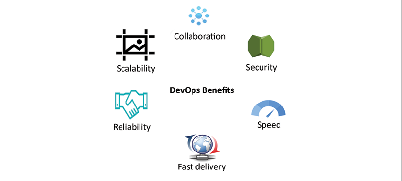

图 12.1：DevOps 的好处

DevOps 的这些好处在此处进一步详述：

- 速度：快速发布产品功能有助于适应客户不断变化的业务需求并扩大市场。 DevOps 模型使组织能够更快地取得成果。
- 快速交付：DevOps 流程通过自动化端到端管道(从代码构建到代码部署和生产启动)来提高效率。快速交付可帮助你更快地进行创新。错误修复和功能的更快发布让你获得竞争优势。
- 可靠性：DevOps 流程提供所有检查以确保交付质量和快速安全的应用程序更新。 CI 和 CD 等 DevOps 实践嵌入了自动化测试和安全检查，以提供积极的最终用户体验。
- 可扩展性：DevOps 通过在任何地方包含自动化，帮助按需扩展你的基础架构和应用程序。
- 协作：DevOps 模型建立了一种主人翁文化，团队可以借此考虑他们的行动。运营和开发团队在共同责任模型中协同工作。协作简化了流程并提高了效率。
- 安全性：在敏捷环境中，频繁更改需要严格的安全检查。 DevOps 模型自动执行安全性和合规性最佳实践，对其进行监控，并以自动化方式采取纠正措施。

DevOps 模型优化了开发团队的生产力和系统运行的可靠性。由于团队密切协作，这有助于提高效率和质量。团队对他们提供的服务拥有完全的所有权，通常超出他们角色的传统范围，并从客户的角度发展思维来解决任何问题。

## 了解 DevOps 的组成部分

DevOps 工具和自动化将开发和系统操作结合在一起。以下是 DevOps 实践的关键组成部分：

- 持续集成/持续集成
- 持续监控和改进
- 基础设施即代码
- 配置管理

所有元素的最佳实践是自动化。自动化流程使你能够以快速、可靠和可重复的方式高效地执行这些操作。自动化可能涉及脚本、模板和其他工具。在蓬勃发展的 DevOps 环境中，基础架构作为代码进行管理。自动化使 DevOps 团队能够快速设置和调整测试和生产环境。让我们探索有关每个组件的更多详细信息。

### 持续集成/持续部署

在 CI(持续集成)中，开发人员经常将代码提交到代码存储库。代码经常构建。每个构建都使用自动化单元测试和集成测试进行测试。在 CI(持续集成)中，你更进一步并在生产中频繁部署你的代码。构建被部署到测试环境，并使用自动化和可能的手动测试进行测试。成功的构建通过测试并部署到暂存或生产环境。下图说明了 CI 与 CD 在软件开发生命周期中的影响：

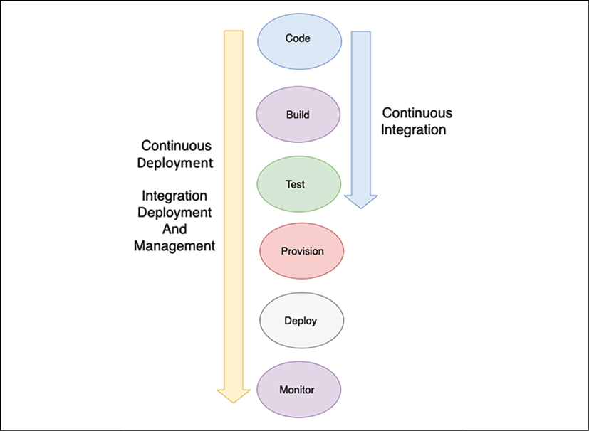

图 12.2：CI/CD

如上图所示，CI 是指软件开发生命周期的构建和单元测试阶段。在代码存储库中提交的每个更新都会创建一个自动构建和测试。 CD 是 CI 的一个重要方面，它进一步扩展了 CI 过程以在生产中部署构建。在 CI/CD 实践中，有几个人在处理代码。他们都必须使用最新的工作版本来完成他们的工作。代码存储库维护不同版本的代码，并使团队可以访问代码。你从存储库中检出代码，在本地副本中进行更改或编写新代码，编译和测试代码，并经常将代码提交回主存储库。

CI 使大部分软件发布过程自动化。它创建了一个自动化流程，用于构建、测试然后暂存更新。但是，开发人员必须触发最终部署到非自动化的实时生产环境。它通过在构建阶段之后将所有代码更改部署到测试环境和/或生产环境来扩展 CD。如果 CD 得到正确实施，开发人员将始终拥有经过测试和部署就绪的构建。

下图中的概念说明了与应用程序自动化相关的所有内容，从代码提交到代码存储库到部署管道。它显示了从构建到生产环境的端到端流程，开发人员在代码库中签入由 CI 服务器拉取的代码更改。 CI 服务器触发构建以创建具有新应用程序二进制文件和相应依赖项的部署包。这些新的二进制文件部署在目标开发或测试环境中。此外，二进制文件被签入工件存储库以进行安全的版本控制存储：

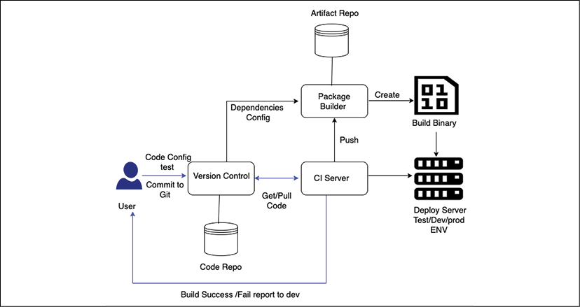

图 12.3：DevOps 的 CI/CD

在 CI/CD 中，代码、构建、部署和测试等软件开发生命周期阶段是使用 DevOps 管道自动化的。部署和供应阶段需要使用基础架构即代码 (**IaC**) 脚本实现自动化。可以使用各种监控工具自动进行监控。

强大的 CD 管道还可以自动为测试和生产环境提供基础设施，并支持对测试和生产环境的监控和管理。 CI/CD 为团队提供了多种好处，例如通过节省构建、测试和部署代码的时间来提高开发人员的工作效率。它可以帮助开发团队快速检测和修复错误，并在生产环境中更快地启动功能更新。

CD 并不意味着开发人员提交的每个更改都会投入生产。相反，这意味着每个更改都已准备好投入生产。当更改在暂存环境中暂存和测试时，将启动手动批准流程并发出部署到生产环境的绿色信号。因此，在 CD 中，部署到生产环境成为一项业务决策，并且仍然通过工具实现自动化。

### 持续监控和改进

持续监控有助于我们了解应用程序和基础架构性能对客户的影响。通过分析数据和日志，你可以了解代码更改如何影响用户。在 24/7 服务和对应用程序和基础架构不断更新的时代，主动监控至关重要。你可以通过创建警报和执行实时分析来更主动地监控服务。

你可以跟踪各种指标来监控和改进你的 DevOps 实践。 DevOps 相关指标的示例如下：

- **变更量**：这是开发的用户故事数、新代码行数和修复的错误数。
- **部署频率**：这表示团队部署应用程序的频率。该指标通常应保持稳定或呈上升趋势。
- **从开发到部署的提前期**：从开发周期开始到部署结束之间的时间可用于识别发布周期中间步骤中的低效率。
- **失败部署的百分比**：失败部署的百分比，包括导致中断的部署数量，应该很低。
应结合更改量来审查此指标。如果更改量较小但部署失败的数量较多，则分析潜在的故障点。
- **可用性**：跟踪有多少发布导致可能违反服务级别协议 (SLA) 的故障。应用程序的平均停机时间是多少？
- **客户投诉量**：客户提出的投诉单数量代表你的应用质量。
- **用户量的百分比变化**：注册使用你的应用程序的新用户数量以及由此产生的流量增加可以帮助你扩展基础架构以匹配工作负载。

将构建部署到生产环境后，必须持续监控应用程序的性能。在我们讨论自动化环境时，让我们探索有关 IaC(基础设施即代码)的更多细节。

### 基础架构即代码

就人力而言，提供、管理甚至弃用基础设施是一项代价高昂的活动。此外，反复尝试手动构建和修改环境可能会充满错误。无论是根据先前的经验还是根据有据可查的操作手册工作，人类犯错的倾向都是一种统计概率。

我们可以自动化创建完整环境的任务。任务自动化可以帮助完成重复性任务并毫不费力地提供重要价值。使用 IaC，我们可以以模板的形式定义我们的基础设施。单个模板可能包含环境的一部分或全部。更重要的是，这个模板可以重复使用，再次创建相同的环境。

在 IaC 中，基础设施是使用代码和 CI 启动和管理的。 IaC 模型可帮助你以编程方式大规模地与基础架构交互，并通过自动化资源配置来避免人为错误。这样，你就可以使用基于代码的工具，像处理代码一样处理基础设施。由于基础设施是通过代码管理的，因此可以使用标准化方法部署应用程序，并且可以反复更新任何补丁和版本而不会出现任何错误。一些最流行的 IaC 脚本工具是 Ansible、Terraform、Azure Resource Manager、Google Cloud Deployment Manager、Chef、Puppet 和 AWS CloudFormation。

以下是来自 AWS CloudFormation 的代码示例，它为 AWS 云平台上的自动化基础设施提供基础设施即代码功能。

```json
{
    "AWSTemplateFormatVersion" : "2010-09-09",
    "Description" : "Create a S3 Storage with parameter to choose own bucket name",
    "Parameters": {
        "S3NameParam" : {
            "Type": "String",
            "Default" : "architect-book-storage",
            "Description" : "Enter the S3 Bucket Name",
            "MinLength" : "5",
            "MaxLength" : "30"
        }
    },
    "Resources" : {
        "Bucket" : {
            "Type" : "AWS::S3::Bucket",
            "DeletionPolicy" : "Retain",
            "Properties" : {
                "AccessControl" : "PublicRead",
                "BucketName" : {"Ref" : "S3NameParam" },
                "Tags" : [ {"Key" : "Name" , "Value" : "MyBucket"} ]
            }
        }
    },
    "Outputs" : {
        "BucketName" : {
            "Description" : "BucketName" ,
            "Value" : { "Ref" : "S3NameParam"}
        }
    }
}
```

前面的代码创建了 Amazon S3 对象存储，用户可以选择提供他们选择的存储名称，如下所示：

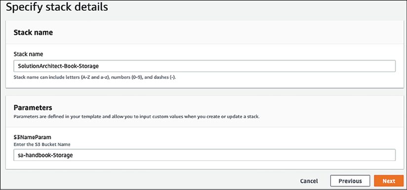

图 12.4：使用 AWS CloudFormation 的基础设施即代码

执行代码后，将创建 Amazon S3 对象存储，如你在输出中所见：

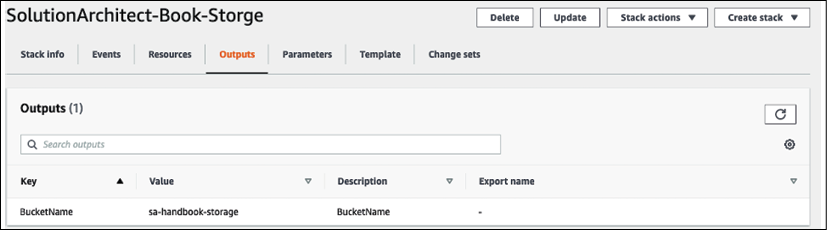

图 12.5：使用 AWS CloudFormation 自动创建 AWS S3 对象存储

多个团队可以使用提供的代码来创建任意数量的 Amazon S3 存储。由于数据非常重要，管理员选择添加存储桶"DeletionPolicy"："保留"，以确保在基础架构出现故障且数据安全时存储不会被删除。你可以了解如何使用 IaC 实现跨组织的标准化、一致性和合规性。配置管理是 DevOps 流程的另一个重要方面。让我们进一步了解它。

### 配置管理

配置管理 (**CM**) 是使用自动化来标准化整个基础架构和应用程序中的资源配置的过程。 Chef、Puppet 和 Ansible 等 CM 工具可以帮助你管理 IaC 并自动执行大多数系统管理任务，包括供应、配置和管理 IT 资源。通过在开发、构建、测试和部署阶段自动化和标准化资源配置，你可以确保一致性并消除由错误配置引起的故障。

CM 还可以让你按一下按钮将相同的配置自动部署到数百个节点，从而提高你的运营效率。还可以利用 CM 来部署对配置的更改。

尽管你可以使用注册表设置或数据库来存储系统配置设置，但配置管理应用程序除了存储之外还允许你维护版本控制。 CM 也是一种跟踪和审核配置更改的方法。如有必要，你甚至可以为不同版本的软件维护多个版本的配置设置。

CM 工具包括一个管理服务器节点的控制器机器。例如，Chef 需要在每台服务器上安装客户端代理应用程序进行管理，而主 Chef 应用程序则安装在控制器机器上。 Puppet 也以同样的方式与中央服务器一起工作。但是，Ansible 采用分散式方法，不需要在服务器节点上安装代理软件。下表显示了流行的配置管理工具之间的高级比较：

|          |                     Ansible                     |             Puppet              |                            Chef                             |
| :------: | :---------------------------------------------: | :-----------------------------: | :---------------------------------------------------------: |
|   机制   | 控制器机器使用安全外壳 (SSH) 将更改应用到服务器 | Master 将更改同步到 Puppet 节点 | Chef 工作站查找 Chef 服务器中的更改并将它们推送到 Chef 节点 |
|   架构   |            任何服务器都可以是控制器             |    由 Puppet master 集中控制    |                   由 Chef 服务器集中控制                    |
| 脚本语言 |                      YAML                       |          Ruby 特定领域          |                            Ruby                             |
| 脚本术语 |               Playbook and roles                |      Manifests and modules      |                    Recipes and cookbooks                    |
| 测试执行 |                      顺序                       |             非顺序              |                            顺序                             |

CM 工具提供特定领域的语言和一组自动化功能。 其中一些工具具有陡峭的学习曲线，因此团队必须学习该工具。 AWS 提供了一个名为 OpsWorks 的托管平台来管理云端的 Chef 和 Puppet。 它提供各种属性来通过自动化管理 IT 基础架构，如下所示：

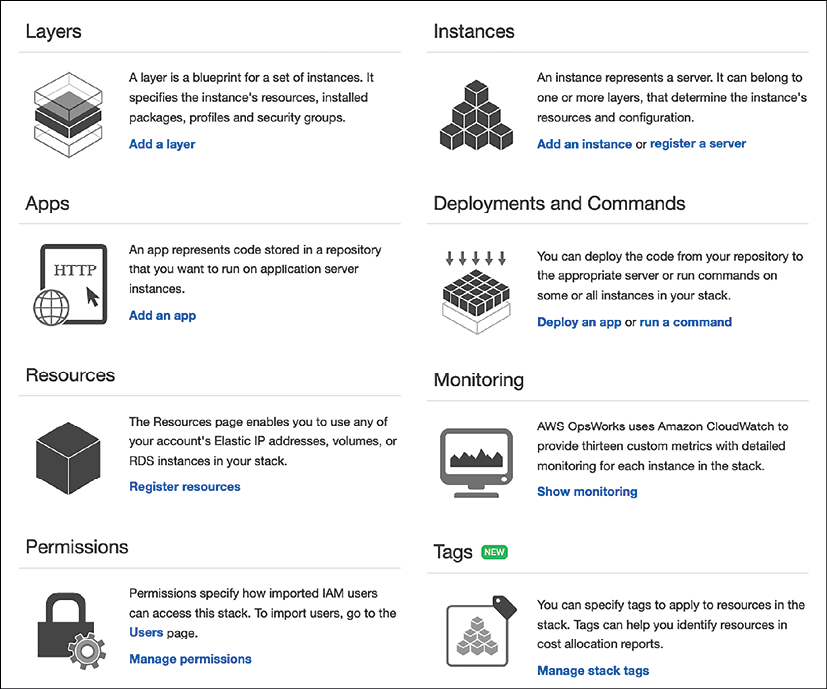

图 12.6：托管 Chef 和 Puppet 的 AWS OpsWorks 服务功能

安全已成为任何组织的首要任务，因此完全自动化的安全性是当务之急。 组织正在转向严格的安全实施和监控，以避免人为错误，使用通常称为 DevSecOps 的 DevOps 流程。 让我们在下一节中探讨 **DevSecOps**(开发、安全和操作的缩写)。

## 介绍 DevSecOps

我们现在比以往任何时候都更加关注安全。在许多情况下，安全是赢得客户信任的唯一途径。 DevSecOps 是关于安全的自动化和安全的大规模实施。开发团队不断进行更改，DevOps 团队在生产中发布它们(更改通常是面向客户的)。需要DevSecOps来保证整个流程的应用安全。

DevSecOps 不是用来审计代码或 CI/CD 工件的。组织应实施 DevSecOps 以实现速度和敏捷性，但不应以验证安全性为代价。自动化的力量在于提高产品功能启动的敏捷性，同时通过实施所需的安全措施保持安全。 DevSecOps 方法会带来内置的安全性，而不是事后才应用。 DevOps 旨在提高效率以加快产品发布生命周期，而 DevSecOps 可在不减慢生命周期的情况下验证所有构建块。

要在你的组织中采用 DevSecOps 方法，首先要在整个开发环境中建立坚实的 DevOps 基础，因为安全是每个人的责任。要在开发团队和安全团队之间建立协作，你应该从一开始就将安全性嵌入到架构设计中。为避免任何安全漏洞，自动化连续安全测试并将其构建到 CI/CD 管道中。为了跟踪任何安全漏洞，通过实时监控设计状态的偏离，申请扩展监控以包括安全性和合规性。监控应启用警报、自动修复和删除不合规的资源。

编码一切是开启无限可能性的基本要求。 DevSecOps 的目标是保持创新的步伐，这应该符合安全自动化的步伐。可扩展的基础架构需要可扩展的安全性，需要自动事件响应补救措施以实施持续的合规性和验证。

## 结合 DevSecOps 和 CI/CD

DevSecOps 实践需要嵌入到 CI/CD 管道的每个步骤中。 DevSecOps 通过管理分配给每个服务器的正确访问和角色，并确保构建服务器(例如 Jenkins)得到加固以免受任何安全故障的影响，从而确保 CI/CD 管道的安全。除此之外，我们需要确保所有工件都经过验证并且代码分析到位。最好通过自动化持续合规性验证和事件响应补救来为事件响应做好准备。

下图为我们提供了多个阶段来测试安全边界并尽早发现安全问题和政策合规性：

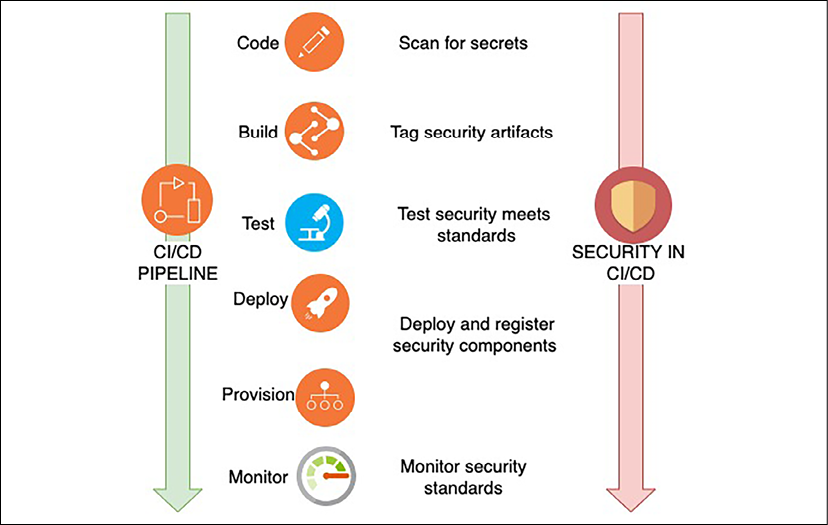

图 12.7：DevSecOps 和 CI/CD

在每个集成点，你可以识别不同的问题，如上图所示：

- 在编码阶段，扫描所有代码以确保没有秘密密钥或访问密钥被硬编码在代码行之间。
- 在构建期间，包括所有安全工件，例如加密密钥和访问令牌管理，并标记它们以便于识别。
- 在测试期间，扫描配置以确保测试安全性满足所有安全标准。
- 在部署和供应阶段，确保所有安全组件都已注册。执行校验和以确保构建文件中没有任何更改。校验和是一种用于确定接收到的文件的真实性的技术。操作系统提供校验和命令来验证文件并确保在文件传输期间没有进行任何更改。
- 在监控阶段监控所有安全标准。以自动化方式执行持续审核和验证。

要识别各个阶段的安全漏洞，你可以将多个工具集成到 DevSecOps 管道中并汇总漏洞发现结果。使用自动测试、分析和报告安全漏洞的工具进行应用程序安全测试 (**AST**) 对于应用程序开发至关重要。 AST可以分为以下四类来扫描软件应用程序中的安全漏洞：

- 软件组合分析 (**SCA**)：SCA 评估代码库中开源软件的安全性、许可证合规性和代码质量。 SCA 尝试检测项目依赖项中包含的公开披露的漏洞。流行的 SCA 工具有 **OWASP Dependency-Check**、**Synopsys** 的 **Black Duck**、**WhiteSource**、**Synk** 和 **GitLab**。
- 静态应用程序安全测试 (**SAST**)：SAST 在编译代码之前扫描应用程序。 SAST 工具在开发人员编码时为他们提供实时反馈，帮助他们在通过代码构建阶段之前解决问题。它是一种白盒测试方法，可分析源代码以查找使你的应用程序容易受到攻击的安全漏洞。 SAST 最好的一点是，它可以在 DevOps 周期的早期，在编码期间引入，因为它不需要工作应用程序，并且可以在不执行代码的情况下进行。流行的 SAST 工具有 SonarQube、PHPStan、Coverity、Synk、Appknox、Klocwork、CodeScan 和 Checkmarx。
- 动态应用程序安全测试 (**DAST**)：DAST 通过在应用程序运行时模拟对应用程序的外部攻击来查找安全漏洞。它试图通过检查暴露的接口是否存在漏洞和缺陷来从外部渗透应用程序——这种类型的黑盒安全测试也称为 Web 应用程序漏洞扫描程序。流行的 DAST 工具是 OWASP ZAP、Netsparker、Detectify Deep Scan、StackHawk、Appknox、HCL AppScan、GitLab 和 Checkmarx。
- 交互式应用程序安全测试 (**IAST**)：IAST 在应用程序通过自动测试或验证应用程序功能的活动运行时分析代码是否存在安全漏洞。 IAST 工具实时报告漏洞，不会为你的 CI/CD 管道增加额外的时间。 IAST 工具部署在 QA 环境中以实现自动化功能测试。流行的 IAST 工具有 GitLab、Veracode、CxSAST、Burp Suite、Acunetix、Netsparker、InsightAppSec 和 HCL AppScan。

你将在本章后面的"在云中构建 DevOps 和 DevSecOps"部分了解如何将上述一些工具集成到 DevOps 管道中。 DevSecOps CI/CD 让我们相信代码是根据公司安全策略进行验证的。

它有助于避免由于不同的安全配置而在以后的部署中出现任何基础架构和应用程序故障。 DevSecOps 在不影响 DevOps 创新步伐的情况下保持敏捷性并确保大规模安全性。让我们了解 DevOps 管道中的 CD 策略。

## 实施 CD 战略

CD 提供现有版本到新版本应用程序的无缝迁移。通过 CD 实现的一些最流行的技术如下：

- 就地部署：在当前服务器中更新应用程序
- 滚动部署：在现有服务器群中逐步推出新版本
- 蓝绿部署：逐步用新服务器替换现有服务器
- 红黑部署：从现有服务器即时切换到新服务器
- 不可变部署：完全建立一组新的服务器

让我们更详细地探讨每个选项。

### 就地部署

就地部署是一种在现有服务器群上推出新应用程序版本的方法。更新是在一次部署操作中完成的，因此需要一定程度的停机时间。另一方面，此更新几乎不需要任何基础架构更改。也无需更新现有的域名系统 (**DNS**) 记录。部署过程本身相对较快。如果部署失败，重新部署是恢复的唯一选择。

作为一个简单的解释，你要用新版本 (v2) 替换应用程序基础结构上的现有应用程序版本 (v1)。就地更新成本低且部署速度快。

### 滚动部署

通过滚动部署，服务器群被分成几组，因此不需要同时更新。部署过程在同一服务器机群上同时运行新旧软件版本，但具有不同的子组。滚动部署方法有助于实现零停机时间。如果新版本部署失败，则整个机队中只有一部分服务器会受到影响，并且风险很小，因为机队的一半仍将正常运行。滚动部署有助于实现零停机；但是，部署时间仅比就地部署时间长。

### 蓝绿部署

蓝绿部署背后的理念是，你的蓝色环境是承载实时流量的现有生产环境。同时，你提供了一个绿色环境，除了新版本的代码之外，它与蓝色环境相同。部署时，你将生产流量从蓝色环境路由到绿色环境。如果你在绿色环境中遇到任何问题，可以通过将流量恢复到原始蓝色环境来回滚。 DNS 切换和交换自动缩放组是在蓝绿部署中重新路由流量的两种最常见方法。

使用自动扩展策略，你可以在应用程序横向扩展时逐渐用托管新版本应用程序的实例替换现有实例。此选项最适用于次要版本和小的代码更改。另一种选择是利用 DNS 路由在我们的应用程序的不同版本之间执行复杂的负载平衡。

如下图所示，在创建了一个托管新版本应用程序的生产环境后，你可以使用 DNS 路由将一小部分流量转移到新环境：

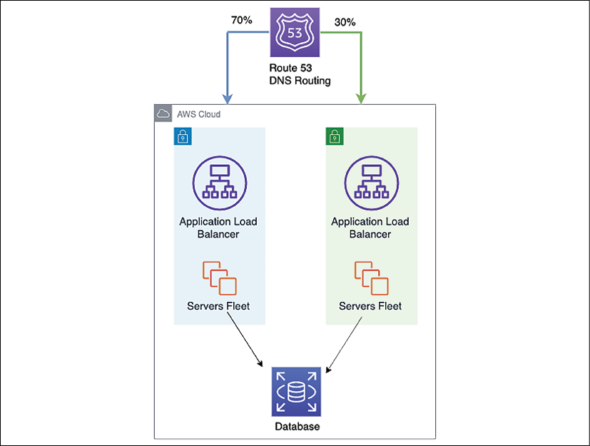

图 12.8：蓝绿部署 DNS 逐步割接

用一小部分生产流量测试绿色环境；这称为金丝雀分析。如果环境存在功能问题，你将能够立即发现并在对用户造成重大影响之前将流量切换回去。继续逐步转移交通，测试绿色环境处理负载的能力。监控绿色环境以检测问题，提供改变交通的机会，从而限制爆炸半径。最后，当所有指标都正确时，停用蓝色环境并释放资源。

蓝绿部署有助于实现零停机并提供轻松回滚。你可以根据需要自定义部署时间。

### 红黑部署

在红黑部署中，在建立一个新版本的系统之前，首先要进行金丝雀测试。金丝雀用最新版本的应用程序替换了大约 1% 的现有生产系统，并监控最新版本的错误。如果金丝雀通过了这个初始测试，系统就被认为可以部署了。

为了准备切换，新版本的系统与旧版本的系统并存。新系统的初始容量是通过检查当前在生产中运行的实例数量并将此数量设置为新自动缩放组的所需容量来手动设置的。一旦新系统启动并运行，两个系统都是红色的。当前版本是唯一接受流量的版本。

然后使用 DNS 服务将系统从现有版本切换到新版本。此时，旧版本被视为黑色；它仍在运行，但没有收到任何流量。如果检测到新版本有任何问题，恢复就像将 DNS 服务器指向旧版本的负载平衡器一样简单。

红黑部署也称为暗启动，与蓝绿部署略有不同。在红黑部署中，你从旧版本到新版本做突然的DNS割接，而在蓝绿部署中，DNS逐渐增加流量到新版本。蓝绿部署和暗启动可以结合起来，同时部署两个版本的软件。使用了两个独立的代码路径，但只有一个被激活。功能标志激活其他代码路径。此部署可用作 Beta 测试，你可以在其中明确启用新功能。

### 不可变部署

如果你的应用程序具有未知的依赖项，则不可变或一次性升级是更简单的选择。随着时间的推移已经打过补丁和重新打过补丁的旧应用程序基础架构变得越来越难以升级。这种类型的升级技术在不可变的基础设施中更为常见。

在新版本中，通过终止旧实例推出一组新的服务器实例。对于一次性升级，你可以使用 Chef、Puppet、Ansible 和 Terraform 等部署服务设置克隆环境，或者将它们与自动缩放配置结合使用来管理更新。

除了停机时间，你还需要在设计部署策略时考虑成本。考虑你需要更换的实例数量和你的部署频率来确定成本。使用最适合的方法，同时考虑你的预算和停机时间。

在本节中，你了解了各种 CD 策略，这些策略可以帮助你更高效、更轻松地发布应用程序。你需要在每一步都执行应用程序测试以实现高质量交付，这通常需要付出巨大的努力。 DevOps 管道可以帮助你自动化测试过程并提高功能发布的质量和频率。让我们进一步了解 CI/CD 管道中的持续测试。

## 在 CI/CD 管道中实施持续测试

DevOps 是根据客户反馈、新功能需求或市场趋势变化不断变化的业务场景的关键。强大的 CI/CD 管道可确保在更短的时间内整合更多功能/反馈，并且客户可以更快地使用新功能。

通过频繁的代码签入，将良好的测试策略融入 CI/CD 管道可确保你以高质量关闭反馈循环。持续测试对于平衡 CI/CD 管道至关重要。虽然快速添加软件功能是件好事，但通过持续测试来确保这些功能符合良好的质量。

单元测试构成了最重要的测试策略。它们通常在开发人员的机器上运行，速度最快，成本最低。一般的经验法则是将 70% 的测试工作纳入单元测试。在此阶段捕获的错误可以相对快速地修复，复杂性较低。

开发人员经常执行单元测试，一旦代码准备好，就部署它进行集成和系统测试。这些测试需要他们的环境，有时需要独立的测试团队，这使得测试过程成本更高。一旦团队确保所有预期功能都按预期工作，运营团队就需要运行性能和合规性测试。这些测试需要类似生产的环境，而且成本很高。此外，用户验收测试 (UAT) 需要类似生产环境的副本，这会导致更多费用。

如下图所示，开发人员执行单元测试以测试开发阶段的代码更改/新功能。编码完成后，通常在开发人员的机器上进行测试。

还建议对代码更改运行静态代码分析，并进行代码覆盖、遵守编码指南等。没有依赖关系的较小单元测试运行得更快。因此，如果测试失败，开发者可以快速发现：

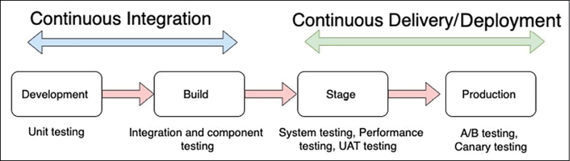

图 12.9：CI/CD 中的连续测试

构建阶段是测试不同组件之间和各个组件本身之间集成的第一个阶段。构建阶段也是测试开发人员提交的代码是否破坏任何现有功能并执行回归测试的绝佳时机。

暂存环境是生产环境的镜像。在此阶段执行端到端系统测试(对 UI、后端逻辑和 API 进行广泛测试)。性能测试测试应用程序在特定工作负载下的性能。性能测试包括负载测试和压力测试。 UAT 也在这个阶段执行，为生产部署做好准备。进行合规性测试以测试行业特定的法规合规性。

A/B 测试或金丝雀分析等策略用于在生产阶段测试新应用程序版本。在 A/B 测试中，新的应用程序版本被部署到一小部分生产服务器并测试用户反馈。逐渐地，根据用户对新应用程序的接受程度，部署增加到跨越所有生产服务器。

### A/B测试

通常，在软件开发中，并不清楚哪种功能的实现在现实世界中最成功。整个计算机科学学科——人机交互 (**HCI**)——致力于回答这个问题。虽然 UI 专家有几个指导方针来帮助他们设计合适的界面，但设计的最佳选择通常只能通过将其提供给用户并查看他们是否可以使用该设计来完成给定任务来确定。

如下图所示，A/B 测试是一种测试方法，其中将两个或多个不同版本的功能提供给不同的用户组。收集每个实现使用情况的详细指标，UI 工程师检查这些数据以确定未来应该采用哪种实现：

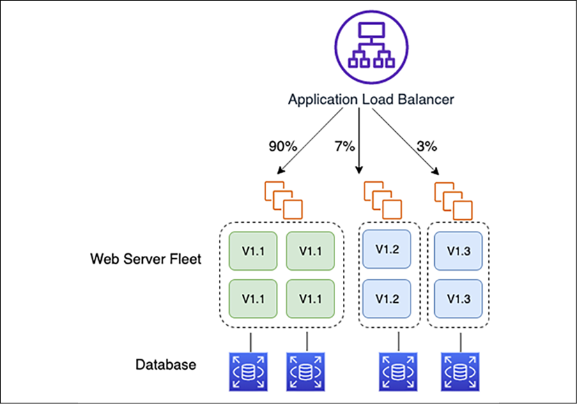

图 12.10：使用 A/B 测试按特征实验划分用户

启动应用程序的多个不同版本很容易，每个版本都包含新功能的不同实现。 DNS 路由可用于将大部分流量发送到当前系统，同时也将一部分现有流量发送到运行新功能的系统版本。大多数 DNS 解析器都支持 DNS 循环解析，并且是传播传入流量的有效方法。

负载和性能测试是其他重要因素。对于5基于 Java 的应用程序，你可以使用 JMeter 通过发出 Java 数据库连接 (**JDBC**) 命令来对关系数据库进行负载测试。 MongoDB 可以使用 Mongo-Perf，它可以在数据库上生成可重现的负载并记录响应时间。然后你可以点击使用数据库的组件和服务，同时测试数据库。

衡量实例负载的一种常见方法是通过所谓的微基准测试。在微基准测试中，你测量系统的一个小子组件(甚至是一段代码)的性能，然后尝试从该测试结果中推断出一般性能数据。在测试服务器的情况下，你可以在新实例类型上测试系统的一部分，并将该测量结果与在当前运行的系统上测量的同一部分进行比较，该系统现在正在使用另一种服务器类型和配置。

## 使用 DevOps 工具进行 CI/CD

要构建 CI/CD 管道，开发人员需要各种工具。其中包括代码编辑器、源存储库、构建服务器、部署工具和编排整个 CI 管道。让我们探索 DevOps 开发人员工具的一些流行技术选择，包括云端和本地。

### 代码编辑器

DevOps 是一个动手编码的角色，你经常需要编写脚本来自动化环境。你可以使用 ACE 编辑器或基于云的 AWS Cloud9 集成开发环境 (**IDE**)。你可以在本地计算机上使用基于 Web 的代码编辑器，或在连接到应用程序环境(例如开发、测试和生产)的本地服务器上安装代码编辑器以进行交互。环境是你存储项目文件和运行工具来开发应用程序的地方。你可以将这些文件本地保存在实例或服务器上，或者将远程代码存储库克隆到你的环境中。 AWS Cloud9 IDE 是作为托管服务提供的云原生 IDE。

Ace 编辑器让你可以快速轻松地编写代码。它是一个基于 Web 的代码编辑器，但提供的性能类似于流行的基于桌面的代码编辑器，例如 Eclipse、Vim 和 Visual Studio Code (**VS Code**) 等。它具有标准的 IDE 功能，例如实时语法和匹配括号突出显示、自动缩进和完成、选项卡之间的切换、与版本控制工具的集成以及多个光标选择。它适用于大文件，有数十万行而没有输入延迟。它内置了对所有流行编码语言和调试工具的支持，你还可以安装自己的工具。对于基于桌面的 IDE，VS Code 和 Eclipse 是 DevOps 工程师可以选择的其他流行代码编辑器选项。

### 源代码管理

你的源代码存储库有多种选择。你可以设置、运行和管理你的 Git 服务器，你将负责其中的一切。

你可以选择使用 GitHub 或 Bitbucket 等托管服务。如果你正在寻找云解决方案，那么 AWS CodeCommit 提供了一个安全、高度可扩展且托管的源代码控制系统，你可以在其中托管私有 Git 存储库。

你需要为你的代码存储库设置身份验证和授权，以提供访问权限以授权团队成员读取或写入代码。你可以在传输中和静止时应用数据加密。当你推送到代码存储库 (```git push```) 时，它会加密数据然后存储它。当你从代码存储库 (```git pull```) 中拉取数据时，它会解密数据，然后将其发送回调用方。用户必须是经过身份验证的用户，对代码存储库具有适当的访问级别。通过使用 HTTPS 或 SSH 协议的加密网络连接传输，可以在传输过程中对数据进行加密。

### 持续集成服务器

CI 服务器也称为构建服务器。对于在多个分支上工作的团队，合并回主分支会变得很复杂。在这种情况下，CI 起着关键作用。 CI 服务器挂钩提供了一种在代码提交到存储库时基于事件触发构建的方法。几乎每个版本控制系统中都包含的挂钩是指由存储库中指定的必要操作触发的自定义脚本。挂钩可以在客户端或服务器端运行。

拉取请求很常见，开发人员可以在将其合并到公共代码分支之前通知和审查彼此的工作。 CI 服务器提供了一个 Web 界面，用于在将更改添加到最终项目之前查看更改。如果提议的更改有任何问题，可以将源代码发回给开发人员，以便根据组织的编码要求进行调整。

如下图所示，服务器端钩子与 CI 服务器结合用于提高集成速度：

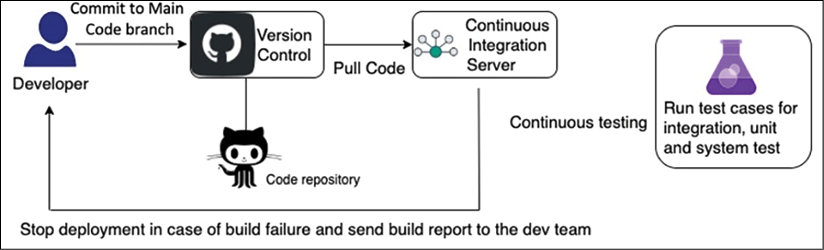

图 12.11：CI 的自动化

如上图所示，使用 post-receive，你可以指示新分支在 CI 服务器上触发测试，以验证新构建是否正确集成以及所有单元是否正常运行。开发人员会收到测试失败的通知，然后知道只有在解决问题后才能将他们的分支与主线合并。开发人员可以从他们的分支构建，测试那里的更改，并在决定是否将他们的分支合并到主线之前获得关于他们的更改工作情况的反馈。

当该分支合并到主线时，运行集成和单元测试会显着减少阻力。还可以自定义挂钩以测试合并到主线并阻止任何未通过的合并。使用 CI 服务器可以最好地完成所有集成。

Jenkins 是构建 CI 服务器的最受欢迎的选择。但是，你必须自己维护服务器的安全和补丁。对于本地云选项和托管服务，你可以使用托管代码构建服务(例如 AWS CodeBuild)，从而消除对服务器管理的需求，并通过即用即付模式显着降低成本。该服务可根据你的需求进行扩展。你的团队有权专注于推送代码并让服务构建所有工件。

如下图所示，你可以在 AWS 弹性计算云 (**EC2**) 服务器的队列中托管 Jenkins 集群，并根据构建负载自动扩展：

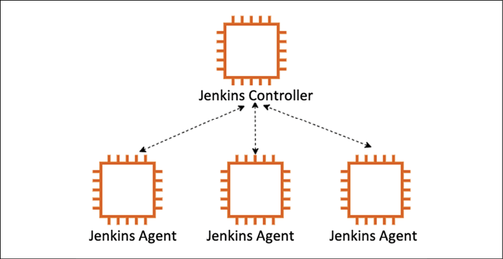

图 12.12：Jenkins CI 服务器的自动缩放

在过载的情况下，Jenkins 控制器卸载构建到代理节点实例。当负载下降时，Jenkins 控制器会自动终止代理实例。

CI 服务器通过与开发团队的团队成员协作，帮助你从源代码存储库构建正确的代码版本，而代码部署则帮助团队准备好代码以供测试和发布以供最终用户使用。让我们更详细地了解代码部署。

### 代码部署

构建准备就绪后，你可以使用 Jenkins 服务器进行部署或选择 AWS CodeDeploy 作为云原生托管服务。你可以使用其他流行的工具(例如 **Chef** 或 **Puppet**)来创建部署脚本。指定部署配置的选项如下：

- **OneAtATime**：一次只有部署组中的一个实例安装新部署。假设给定实例上的部署失败。在这种情况下，部署脚本将停止部署并返回一个错误响应，详细说明成功安装的数量与失败安装的数量。
- **HalfAtATime**：部署组中的一半实例安装新部署。如果一半实例成功安装修订版，则部署成功。 HalfAtATime 可以再次成为生产/测试环境的一个很好的选择，其中一半实例更新到新版本，另一半在旧版本的生产中仍然可用。
- **AllAtOnce**：每个实例都会在下次轮询部署服务时安装可用的最新修订版。此选项最适用于开发和测试部署，因为它有可能在部署组中的每个实例上安装无法运行的部署。
- **自定义**：你可以使用此命令创建自定义部署配置，指定在任何给定时间必须存在于部署组中的固定数量的健康主机。此选项是 OneAtATime 选项的更灵活的实现。它允许部署在一个或两个已损坏或配置不当的实例上失败的可能性。

下图说明了部署期间的生命周期事件：

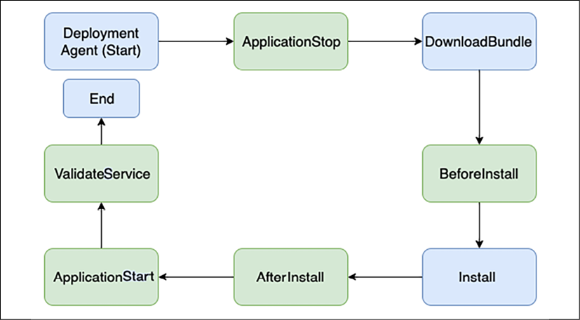

图 12.13：部署生命周期事件

部署代理通过一系列步骤来执行部署。这些步骤称为生命周期事件。在上图中，灯箱中突出显示的步骤可以通过人为干预来控制；但是，深色方框中突出显示的步骤是自动化的，并由部署代理控制。以下是有关每个步骤的更多详细信息：

- **停止服务**：要触发部署，第一个要求是停止应用程序服务器，以便在复制文件时流量停止服务。软件应用程序服务器的示例有 Tomcat、JBoss 或 WebSphere 服务器。
- **DownloadBundle**：停止应用程序服务器后，部署代理开始从 JFrog Artifactory 等工件下载预构建的部署包。工件存储应用程序二进制文件，可以在新版本发布之前部署和测试应用程序。
- **安装前**：部署代理触发预安装步骤，例如通过脚本创建当前版本的备份和任何所需的配置更新。
- **安装**：在此步骤中，部署代理开始安装——例如，运行 Ant 或 Maven 脚本来安装 Java 应用程序。
- **安装后**：部署代理在你的应用程序安装完成后触发此步骤。它可能包括更新安装后配置，例如本地内存设置和日志参数。
- **启动服务**：在此步骤中，代理启动应用程序并通知成功或失败的运营团队。
- **验证服务**：验证步骤在其他一切完成后触发，让你有机会对应用程序进行健全性检查。它包括执行自动健全性测试和集成测试等步骤，以验证新版本的应用程序是否已正确安装。当测试成功时，代理还会向团队发送通知。

你已经了解了作为独立组件的各种代码部署策略和步骤。但是，要设置自动化 CI/CD 管道，你需要将所有 DevOps 步骤拼接在一起。让我们进一步了解代码管道，它可以帮助你构建端到端的 CI/CD 管道。

### 代码流水线

代码管道是关于将所有内容编排在一起以实现 CD。整个软件发布过程在 CD 中完全自动化，包括构建和部署到生产版本。一段时间后，通过实验，你可以建立一个成熟的 CI/CD 流水线。生产发布的路径是自动化的，因此可以快速部署功能和即时的客户反馈。你可以使用 AWS CodePipeline 等云原生托管服务来编排整个代码管道或使用 Jenkins 服务器。

代码管道使你能够向 CI/CD 管道中的阶段添加操作。每个动作都可以与执行该动作的提供者相关联。 code pipeline action的provider类别和示例如下：

- 来源：你的应用程序代码需要存储在具有版本控制功能的中央存储库中，称为源代码存储库。一些流行的代码存储库是 AWS CodeCommit、Bitbucket、GitHub、并发版本系统 (**CVS**)、Subversion (**SVN**) 等。
- 构建：构建工具从源代码存储库中提取代码并创建应用程序二进制包。一些流行的构建工具是 AWS CodeBuild、Jenkins、Solano CI 等。构建完成后，你可以将二进制文件存储在 JFrog 等人工制品中。
- 部署：部署工具可帮助你在服务器上部署应用程序二进制文件。一些流行的部署工具是 AWS Elastic Beanstalk、AWS CodeDeploy、Chef、Puppet、Jenkins 等。
- 测试：自动化测试工具可帮助你完成和执行部署后验证。一些流行的测试验证工具有 Jenkins、BlazeMeter、Ghost Inspector 等。
- 调用：你可以使用基于事件的脚本来调用备份和警报等活动。任何脚本语言(如 **shell 脚本**、**PowerShell** 和 **Python**)都可用于调用各种自定义活动。
- 批准：批准是 CD 中必不可少的步骤。你可以通过自动电子邮件触发器请求手动批准，也可以通过工具自动批准。

在本部分中，你了解了用于管理软件开发生命周期 (**SDLC**) 的各种 DevOps 工具，例如代码编辑器、存储库以及构建、测试和部署工具。你需要集成到 DevOps 管道中的其他工具是持续日志记录、持续监控和操作处理，你在第 10 章"卓越运营注意事项"中学到了这些。到目前为止，你已经了解了每个 SDLC 阶段的各种 DevOps 技术。让我们更多地了解最佳实践和反模式。

## 实施 DevOps 最佳实践

在构建 CI/CD 管道时，请考虑你创建项目并向其添加团队成员的需要。项目仪表板提供通过部署管道的代码流的可见性、监控构建、触发警报和跟踪应用程序活动。下图说明了定义明确的 DevOps 管道：

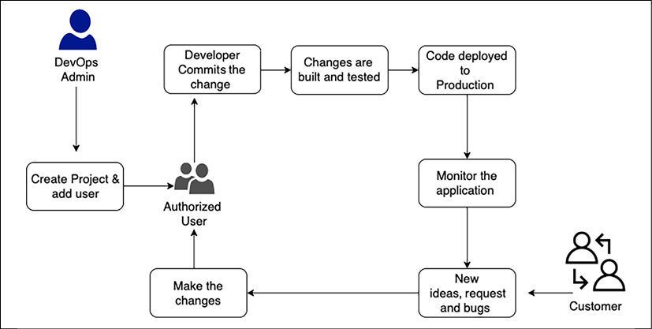

图 12.14：CI/CD 工作流最佳实践

在设计管道时考虑以下几点：

- 阶段数：阶段可以是开发、集成、系统、用户接受和生产。一些组织还包括开发、alpha、beta 和发布阶段。
- 每个阶段的测试类型：每个阶段可以有多种类型的测试，如单元测试、集成测试、系统测试、UAT、冒烟测试、负载测试和生产阶段的A/B测试。
- 测试顺序：测试用例可以并行运行，也可以按顺序运行。
- 监控和报告：监控系统缺陷和故障，并在故障发生时发送通知。
- 基础设施供应：为每个阶段供应基础设施的方法。
- 回滚：定义回滚策略以在需要时回退到以前的版本。

拥有一个需要手动干预但可以避免的系统会减慢你的流程。因此，使用 CD 自动化你的流程将加速你的流程。

另一个常见的反模式是将构建的配置值保留在代码本身内，甚至让开发人员在构建过程中使用不同的工具，从而导致开发人员之间的构建不一致。需要花费大量时间和精力来解决为什么特定构建在一个环境中工作而不在其他环境中工作。为了克服这个问题，最好将构建配置存储在代码之外。将这些配置外部化为工具，使它们在构建之间保持一致，从而实现更好的自动化，并允许你的流程更快地扩展。不使用 CD 过程可能会导致在最后一刻、半夜匆匆忙忙地让构建工作。将你的 CD 流程设计为快速失败，以减少在最后一刻出现意外的可能性。

要在应用程序开发的每个步骤应用架构最佳实践，可以使用十二因素方法，正如十二因素应用程序 (https://12factor.net/) 所推荐的那样，企业采用该方法进行端到端的结束 Web 应用程序的开发和交付。这适用于所有编码平台，无论编程语言如何。如今，大多数应用程序都是作为 Web 应用程序构建的，并利用云平台。让我们了解如何构建端到端 DevOps 以及云中的安全自动化。

## 在云中构建 DevOps 和 DevSecOps

正如你在前面几节中了解到的，构建 CI/CD 管道需要多种工具，并且在此基础上添加安全自动化会增加复杂性。从头开始集成各种工具并汇总漏洞发现可能是一项挑战。 AWS 等公共云提供商提供了构建 DevSecOps 管道的灵活性，可以轻松集成云原生和第三方工具并聚合安全发现。

以下 DevSecOps 管道架构涵盖 CI/CD 实践，包括 SCA、SAST 和 DAST 工具，以可视化管道中安全自动化的概念：

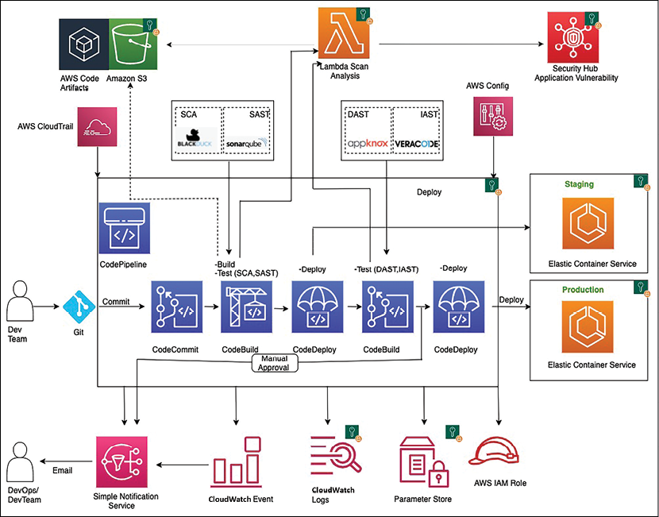

图 12.15：AWS 云中的 DevSecOps CI/CD 管道架构

如上图所示，当开发人员在 GitHub 中提交代码时，会触发 CI/CD 管道。生成一个事件以使用 AWS CloudWatch 启动 AWS CodePipeline。 AWS CodePipeline 编排 CI/CD 管道，包括代码提交、构建和部署。 AWS CodeBuild 打包构建并将构件上传到 AWS CodeArtifact。 AWS CodeBuild 从 AWS Parameter Store 中检索扫描工具令牌等身份验证信息以启动扫描。

你需要在管道中集成 AST 工具以实施 DevSecOps。 CodeBuild 使用 SCA 工具(例如 **Synopsys** 的 **Black Duck** 或 **WhiteSource**)和 SAST 工具(例如 **SonarQube** 或 **Coverity**)扫描代码。 SCA 或 SAST 设备可能会检测到需要发布到 AWS Security Hub 中的漏洞。 AWS CodeBuild 调用 Lambda 函数将所有安全发现整合到 AWS Security Hub 下的一个位置。你还可以在应用程序通过自动测试以验证应用程序功能时添加 IAST，例如 Veracode 或 CxSAST。如果没有漏洞，CodeDeploy 会将代码部署到暂存 AWS Elastic Container Service (**ECS**) 环境。

部署成功后，CodeBuild 使用 OWASP ZAP 或 Appknox 工具触发 DAST 扫描。同样，如果存在任何漏洞，CodeBuild 会调用 Lambda 函数，该函数会将安全发现发布到 AWS Security Hub。假设 DAST 没有发现任何安全问题。在这种情况下，构建可以提前获得批准，并且管道会通知批准者采取行动将构建推送到生产 AWS ECS 环境中。在 CI/CD 管道运行期间，AWS CloudWatch 监控所有更改并通过 SNS 通知向 DevOps 和开发团队发送电子邮件通知。

AWS CloudTrail 跟踪任何关键更改，例如管道更新、删除和创建，并向 DevOps 团队发送通知以进行审计。此外，AWS Config 会跟踪所有配置更改。

对于 DevSecOps，CI/CD 管道安全是使用 AWS IAM 角色实施的，以限制对所需资源的访问。任何静态和传输中的管道数据都使用加密和 SSL 进行保护。你可以使用 AWS Parameter Store 来存储敏感信息，例如 API 令牌和密码。

在 Security Hub 中的一个位置汇总安全发现，提供了自动修复的机会。根据安全发现，你可以触发 Lambda 函数以采取所需的补救措施。例如，如果有人不小心向所有人开放了 SSH 端口，它会自动阻止服务器访问互联网流量。自动化减轻了 DevOps 和安全团队的负担，因为他们现在可以通过一个工具解决漏洞，而不是登录多个仪表板。

对于任何团队而言，在应用程序开发的早期阶段识别安全威胁都可以大大降低应用程序更改的总体成本。以自动化方式执行此操作可以加速这些更改的交付。 DevSecOps 管道对于构建繁荣的应用程序开发环境至关重要。

DevOps 结合了文化、实践和工具，将应用程序开发与其操作相结合。 DevOps 实践使组织能够快速交付新的应用程序功能。 DevSecOps 通过将安全性集成到 DevOps 中更进一步。借助 DevSecOps，你可以快速提供安全且合规的应用程序更改，同时以自动化方式一致地运行操作。

## 概括

在本章中，你了解了强大的 DevOps 实践的关键组成部分：CI、CD 以及持续监控和改进。 CI/CD 的敏捷性只能通过在所有地方应用自动化来实现。为了实现自动化，你了解了 IaC 和配置管理。你还了解了各种自动化工具，例如 Chef、Puppet 和 Ansible，以实现配置管理的自动化。

由于安全是重中之重，因此你了解了 DevSecOps，也就是安全方面的 DevOps。 CD 是 DevOps 的关键方面之一。你了解了各种部署策略，包括滚动、蓝绿和红黑部署。测试是确保产品质量的另一个方面。你了解了 DevOps 中持续测试的概念，以及 A/B 测试如何通过在实时环境中获取客户的直接反馈来帮助改进产品。

你已经了解了 CI/CD 管道中的各个阶段。你已经了解了可以使用的工具和服务，以及可以遵循的最佳实践，以获得强大的 CI/CD 管道。你了解了各个服务的工作原理，并讨论了如何集成服务以构建复杂的解决方案。

到目前为止，你已经了解了解决方案架构的各个方面。由于每个组织都有大量数据，因此他们付出了巨大的努力来深入了解他们的数据。在下一章中，你将学习如何收集、处理和使用数据以获得更深入的洞察力。