# 解决方案架构的数据工程

在互联网和数字化时代，数据无处不在，速度快，海量大。快速从这些海量数据中获取洞察力具有挑战性。我们需要不断创新以摄取、存储和处理这些数据，以获得业务成果。

随着云、移动和社交技术的融合，基因组学和生命科学等许多领域的进步正在以越来越快的速度发展。挖掘这些数据以获得更多洞察力具有巨大的价值。现代流处理系统需要以低延迟、高输入速率的数据为基础产生连续的结果。

大数据的概念不仅仅指数据的收集和分析。组织在其数据中的实际价值可用于获得洞察力并创造竞争优势。并非所有大数据解决方案都必须以可视化告终。机器学习 (**ML**) 和其他预测分析等许多解决方案以编程方式将这些答案提供给其他软件或应用程序，提取信息并按设计做出响应。

与大多数事情一样，获得更快的结果成本更高，大数据也不例外。有些答案可能不会立即需要，因此该解决方案的延迟和吞吐量可能足够灵活，需要数小时才能完成。一旦数据可用，可能就需要其他响应，例如预测分析。

在本章中，你将学习以下主题来处理和管理你的大数据需求：

- 什么是大数据架构？
- 设计大数据处理管道
- 数据摄取、存储、处理和分析
- 数据可视化
- 设计大数据架构
- 大数据架构最佳实践

到本章结束时，你将知道如何设计大数据和分析架构。你将了解大数据管道步骤，包括数据摄取、存储、处理和可视化，以及各种架构模式。

## 什么是大数据架构？

所收集数据的绝对数量可能会导致问题。随着越来越多的数据积累，管理和移动数据及其底层大数据基础设施变得越来越困难。云提供商的兴起促进了将应用程序迁移到云的能力。多个数据源导致数量、速度和多样性增加。以下是一些常见的计算机生成的数据源：

- **应用服务器日志**：应用日志和游戏
- **点击流日志**：来自网站点击和浏览
- **传感器数据**：天气、水、风能和智能电网
- **图像和视频**：交通和安全摄像头

计算机生成的数据可以从半结构化日志到非结构化二进制文件。计算机生成的数据源可以在数据中产生模式匹配或相关性，从而为社交网络和在线游戏生成推荐。你还可以使用计算机生成的数据来跟踪应用程序或服务行为，例如博客、评论、电子邮件、图片和品牌认知度。

人工生成的数据包括电子邮件搜索、自然语言处理、对产品或公司的情绪分析以及产品推荐。社交图谱分析可以根据你的朋友圈产生产品推荐，你可能会感兴趣的工作，甚至可以根据你朋友圈的生日、纪念日等产生提醒。

你从分析团队那里听到的阻止他们为组织提供最大价值的典型障碍是：

- **对客户体验和运营的洞察力有限**：为了创造新的客户体验，组织需要更好地了解他们的业务。复杂且昂贵的数据收集和处理系统以及增加的规模成本要求组织限制他们收集和分析的数据的类型和数量。
- **需要更快地做出决定**：这是一个由两部分组成的问题：
  - 传统数据系统不堪重负，导致现有工作负载需要很长时间才能完成。
  - 更多的决策需要在几秒钟或几分钟内做出，需要系统实时收集和处理数据。
- **通过机器学习实现创新**：组织正在增加和发展他们的数据科学团队，以帮助优化和发展他们的业务。这些用户需要使用他们选择的工具更轻松地访问数据，而无需传统的繁文tape节和会减慢他们速度的流程。
- **扩展自我管理基础设施的技术人员和成本**：在本地管理基础设施的客户在快速扩展以满足业务需求方面面临困难。管理基础设施、高可用性、扩展和操作监控很难正确进行，尤其是在规模上。 AWS Managed Services 允许客户专注于构建他们的数据应用程序，而不是管理工具。

在大数据架构中，重要数据管道的一般流程始于数据，终于洞察力。你如何从头到尾取决于很多因素。下图说明了可帮助你设计数据架构的数据工作流管道：

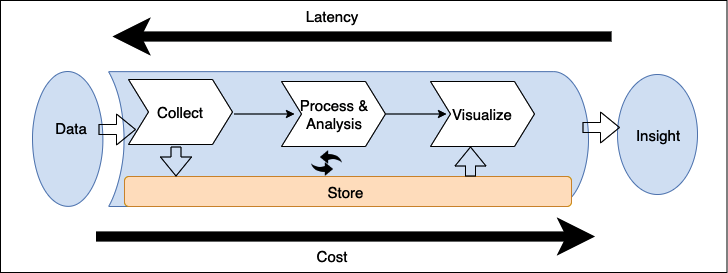

图 13.1：数据架构设计的大数据管道

如上图所示，大数据流水线的标准流程包括以下步骤：

通过适当的工具收集(摄取)数据。
数据持久存储。
处理或分析数据。数据处理/分析解决方案从存储中获取数据，执行操作，然后再次存储处理后的数据。
然后，其他处理/分析工具或同一工具再次使用这些数据，以从数据中获得更多答案。
为了使答案对业务用户有用，他们使用商业智能 (BI) 工具将其可视化或输入 ML 算法以进行未来预测。一旦向用户提供了适当的答案，他们就可以深入了解数据，然后可以使用这些数据来做出进一步的业务决策。
你在管道中部署的工具决定了你的回答时间，即从创建数据到你可以从中获得洞察力之间的延迟。在考虑延迟的同时构建数据解决方案的最佳方法是确定如何平衡吞吐量与成本，因为更高的性能和随后减少的延迟通常会导致更高的价格。

## 设计大数据处理管道

许多大数据架构所犯的严重错误之一是使用一种工具处理数据管道的多个阶段。管理端到端数据管道(从数据存储和转换到可视化)的一组服务器可能是最简单的架构，但它也是最容易受到管道故障影响的。这种紧密耦合的大数据架构通常无法为你的需求提供吞吐量和成本的最佳平衡。在设计数据架构时，请使用 FLAIR 数据原则，如下所述：

- **F**：可发现性。查看哪些数据资产可用、访问元数据(包括所有权和数据分类)以及数据治理和合规性的其他强制属性的能力
- **L**：血统。在数据从数据源流向消费时，能够找到数据来源、追溯数据并理解和可视化数据
- **A**：辅助功能。请求授予访问数据资产权利的安全凭证的能力。它还需要一个网络基础设施来促进高效访问
- **I**：互操作性。数据以大多数(如果不是全部)内部处理系统都可以访问的格式存储
- **R**：可重用性。数据注册到一个已知的模式，数据源的属性是明确的。可能包含 **MDM**(主数据管理)概念

大数据架构师建议将摄取、存储、处理和获取洞察力之间的管道分离。在多个阶段解耦存储和处理有几个优点，包括提高容错能力。例如，如果在第二轮处理中出现问题并且专用于该任务的硬件出现故障，你将不必从流水线的开头重新开始；你的系统可以从第二个存储阶段恢复。将存储与各种处理层分离使你能够读取和写入多个数据存储。

下图说明了在设计大数据架构管道时要考虑的各种工具和流程：

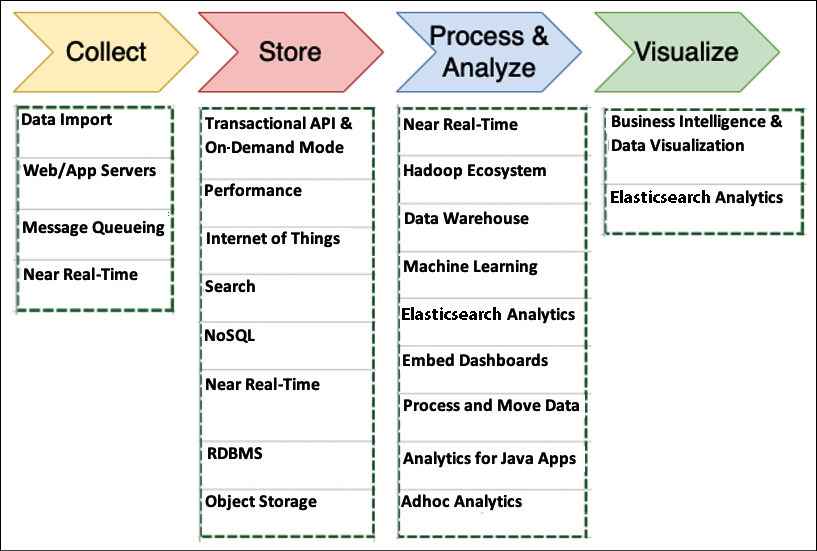

图 13.2：大数据架构设计的工具和流程

在为你的大数据架构确定合适的工具时，你应该考虑的事项包括：

- 你的数据结构
- 最大可接受延迟
- 最小可接受吞吐量
- 系统最终用户的典型访问模式

你的数据结构会影响你用来处理它的工具和存储它的位置。数据的排序以及存储和检索的每个对象的大小也是重要的考虑因素。回答时间取决于你的解决方案如何权衡延迟/吞吐量和成本。

用户访问模式是另一个需要考虑的重要组成部分。有些作业需要定期连接许多相关表，而其他作业则需要每天或不太频繁的存储数据。有些工作需要比较来自广泛数据源的数据，而其他工作只从一个非结构化表中提取数据。了解你的最终用户最常使用数据的方式将有助于你确定大数据架构的广度和深度。让我们深入了解大数据架构中涉及的每个流程和工具。

## 数据摄取

数据摄取是收集数据以进行传输和存储的行为。有很多地方可以载入数据。数据摄取主要属于数据库、流、日志和文件的类别之一。其中，数据库是最受欢迎的。这些通常包括你的主要上游事务系统，这些系统是你应用程序的主要数据存储。它们具有关系型和非关系型，并且有多种技术可以从它们中提取数据。

流是时间序列数据的开放式序列，例如来自网站或物联网设备的点击流数据，通常发布到我们托管的 API 中。日志由应用程序、服务和操作系统生成。数据湖是存储所有数据以进行集中分析的好地方。数据湖提供了一个单一的事实来源，可以将所有数据存储在一个地方，并打破组织中各个业务部门之间的数据孤岛。在本章后面的部分"设计大数据架构"中，你将了解有关数据湖的更多信息。文件来自自托管文件系统或通过 FTP 或 API 的第三方数据源。如下图所示，使用你的环境收集的数据类型及其收集方式来确定哪种摄取解决方案最适合你的需求：

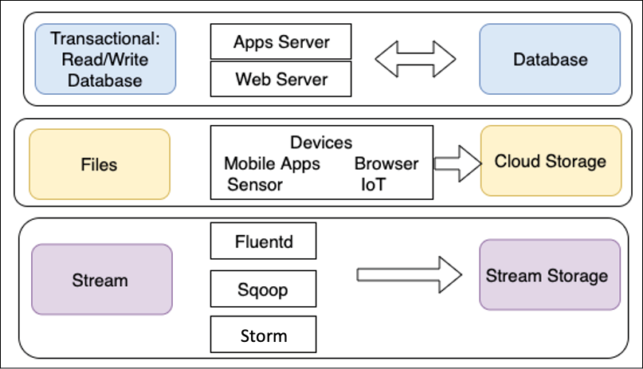

图 13.3：数据摄取的类型

如图所示，事务数据存储必须能够快速存储和检索数据。最终用户需要快速直接地访问数据，这使得应用程序和 Web 服务器成为理想的摄取方法。出于同样的原因，NoSQL 和关系数据库管理系统 (**RDBMS**) 数据库通常是此类流程的最佳解决方案。

通过单个文件传输的数据通常是从连接的设备中获取的。与交易数据相比，大量文件数据不需要快速存储和检索。对于文件数据，传输通常是单向的，其中数据由多个资源生成并摄取到单个对象或文件存储中供以后使用。

应通过 **Apache Kafka** 或 **Fluentd** 等适当的解决方案摄取点击流日志等流数据。最初，这些日志存储在 Kafka 等流存储解决方案中，因此它们可用于实时处理和分析。这些日志的长期存储最好采用对象存储等低成本解决方案。

流式存储将你的收集系统(生产者)与处理系统(消费者)分离。它为你的传入数据提供持久缓冲区。可以处理数据，你可以根据需要以一定的速率抽取数据。让我们了解一些流行的数据摄取技术。

### 数据摄取的技术选择

让我们看看一些流行的数据摄取和传输开源工具：

- **Apache DistCp**：DistCp 代表分布式副本，是 Hadoop 生态系统的一部分。 DistCp 工具用于在集群内或集群之间复制大数据。 DistCp利用MapReduce的并行处理分布能力，实现数据的高效快速复制。它将目录和文件分发到映射任务中，以将文件分区从源复制到目标。 DistCp 还跨集群进行错误处理、恢复和报告。
- **Apache Sqoop**：Sqoop 也是 Hadoop 生态系统项目的一部分，有助于在 Hadoop 和 RDBMS 等关系数据存储之间传输数据。 Sqoop 允许你将数据从结构化数据存储导入 Hadoop 分布式文件系统 (HDFS)，并将数据从 HDFS 导出到结构化数据存储。 Sqoop 使用插件连接器连接到关系数据库。你可以使用 Sqoop 扩展 API 来构建新的连接器，或者使用支持 Hadoop 和通用关系数据库系统之间数据交换的连接器之一。
- **Apache Flume**：Flume 是开源软件，主要用于摄取大量日志数据。 Apache Flume 以分布式方式可靠地收集数据并将其聚合到 Hadoop。 Flume 促进流式数据摄取并允许分析。

更多开源项目可用于流式处理，例如 Apache Storm 和 Apache Samza，以提供一种可靠地处理无限数据流的方法。

### 将数据提取到云端

AWS 等公共云提供商提供一系列大数据服务来大规模存储和处理数据。以下是将数据移动到 AWS 云并利用云提供商提供的可扩展性的一些选项：

- **AWS Direct Connect**：AWS Direct Connect 在 AWS 云和你的数据中心之间提供高达 100 Gbps 的私有连接。专用网络连接可减少网络延迟并增加带宽吞吐量。与数据必须通过多个路由器跳跃的互联网连接相比，它提供了更可靠的网络速度。 Direct Connect 在你或 Direct Connect 合作伙伴管理的路由器之间创建交叉连接，具体取决于你是否位于 AWS Direct Connect 位置之一和 AWS 拥有的该位置的路由器。电路本身提供公共和私有虚拟接口 (**VIF**)。
  你可以使用私有 VIF 直接访问在 AWS 上的 Virtual Private Cloud (**VPC**) 中运行的资源，使用公共 VIF 访问 Amazon Simple Storage Service (**S3**) 等 AWS 服务的公共端点。
- **AWS Snowball**：如果你想将大量数据(例如数百太字节 (TB) 或拍字节 (PB))传输到云端，则可能需要数年时间才能通过互联网完成。 AWS Snowball 提供可传输大量数据的 80 TB 防篡改存储设备。它像一个大硬盘一样工作，你可以将其插入本地数据存储服务器、加载所有数据并将其发送到 AWS。 AWS 会将你的数据放置在云存储中的指定位置。 AWS Snowball 还有其他风格，例如 Snowball Edge，它具有计算能力和 100 TB 的存储空间，可满足在游轮或石油钻井平台等远程位置处理数据的用例。它就像一个小型数据中心，你可以在其中加载数据并使用内置计算功能执行一些分析。一旦设备上线，数据就可以加载到云中。如果你有 PB 级数据，则可以使用 Snowmobile，这是一个 45 英尺的物理运输集装箱，你可以使用它一次性将 100 PB 数据从数据中心传输到 AWS 云。
- **AWS Data Migration Service (DMS)**：AWS DMS 可以轻松安全地将你的数据库和数据仓库迁移或复制到 AWS。在 DMS 中，你可以创建数据迁移任务，该任务将通过源端点连接到本地数据，并使用 AWS 提供的存储(如 RDS 和 Amazon S3)作为目标端点。 DMS 支持完整的数据转储和持续的变更数据捕获 (**CDC**)。 DMS 还支持同构(MySQL 到 MySQL)和异构(MySQL 到 Amazon Aurora)数据库迁移。

AWS 提供了更多工具，例如用于从本地向 AWS 连续传输文件的 **AWS DataSync** 和用于 **SFTP** 的 **AWS Transfer** 以安全地从 SFTP 服务器提取数据。当你摄取数据时，需要将其放入合适的存储空间以满足业务需求。同样，其他公共云提供商(如 Azure 和 GCP)提供了各种选项来在其云中摄取数据。流数据对于摄取和分析也变得非常重要。你将在流式数据存储部分了解有关流式数据的更多信息。让我们详细了解选择正确存储和可用存储选项的技巧。

## 存储数据

为大数据环境设置存储时最常见的错误之一是使用一种解决方案(通常是 RDBMS)来处理所有数据存储需求。

你将拥有许多可用的工具，但它们都没有针对它们需要完成的任务进行优化。一种解决方案不一定能满足你的所有需求；适合你环境的最佳解决方案可能是仔细平衡延迟与成本的存储解决方案组合。理想的存储解决方案使用正确的工具来完成正确的工作。下图结合了与你的数据相关的多个因素以及与之相关的存储选择：

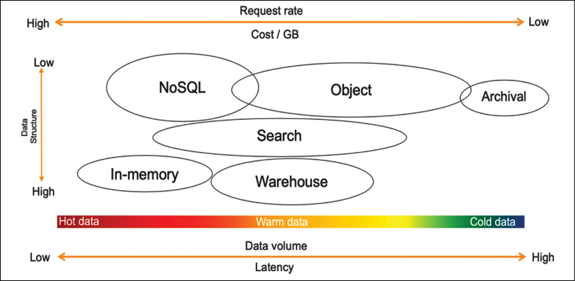

图 13.4：了解数据存储

如流程图所示，选择数据存储取决于以下因素：

- **你的数据结构如何**？它是否遵循特定的、格式良好的模式，如 Apache 网络日志(日志通常结构不佳且不适合关系数据库)、标准化数据协议和契约接口？它是完全任意的二进制数据，如图像、音频、视频和 PDF 文档中的那样吗？或者，它是半结构化的，具有一般结构，但在记录中可能具有很高的可变性，如 JSON 或 CSV？
- **新数据需要以多快的速度可供查询**？它是一个实时场景，在新记录流入时做出决策，例如活动经理根据转化率进行调整或网站根据用户行为相似性进行产品推荐？是每天、每周还是每月的批量场景，比如模型训练、财务报表编制、产品性能报告？还是介于两者之间，例如用户参与电子邮件，它不需要实时操作，但你可以在用户操作和接触点之间留出几分钟甚至几小时的缓冲时间？
- **数据摄取的大小是多少**？数据是否在数据传入时逐条记录地摄取，例如来自 REST API 的 JSON 负载最多只有几 KB？是否有大量记录同时到达，例如系统集成和第三方数据馈送？还是介于两者之间，例如将一些微批次的点击流数据聚合在一起以进行更高效的处理？
- **数据总量及其增长率是多少**？你是在 GB 和 TB 领域，还是打算存储 PB 甚至艾字节 (EB)？你的特定分析用例需要多少此类数据？你的大部分查询是否只需要特定的滚动时间窗口？或者，你是否需要一种机制来查询整个历史数据集？
- **在任何特定位置存储和查询数据的成本是多少**？对于任何计算环境，我们通常会看到性能、弹性和低成本之间的三角形约束。你希望存储具有的性能越好和弹性越高，它的成本就越高。你可能希望快速查询 PB 级数据，但决定以压缩格式查询 TB 级数据以满足你的成本要求。

最后，将针对数据运行什么类型的分析查询？它会为仪表板提供一组固定的指标和向下钻取吗？会不会参与各个业务维度汇总起来的大数值聚合？或者，它会用于诊断，利用字符串标记化进行全文搜索和模式分析吗？

当你确定数据的所有特征并了解数据结构后，你就可以评估需要使用哪种解决方案来存储数据。让我们了解存储数据的各种解决方案。

### 数据存储的技术选择

正如我们所讨论的，单一工具无法完成所有工作。你需要为正确的工作使用正确的工具，而数据湖使你能够构建高度可配置的大数据架构来满足你的特定需求。业务问题过于广泛、深入和复杂，以至于一种工具无法解决所有问题，尤其是大数据和分析。

例如，热数据需要在内存中存储和处理，因此缓存或内存数据库(如 Redis 或 SAP Hana)是合适的。 AWS 提供 ElastiCache 服务，提供托管的 Redis 或 Memcached 环境。 NoSQL 数据库在面对高速但小规模的记录时是理想的，例如，用户会话信息或物联网数据。 NoSQL 数据库也可用于内容管理以存储数据目录。让我们了解最流行和最常用的结构化数据存储。

#### 结构化数据存储
结构化数据存储已经存在了几十年，是最常见的数据存储技术选择。由于处理来自软件应用程序的频繁数据写入，大多数事务性数据库(例如 Oracle、MySQL、SQL Server 和 PostgreSQL)都是基于行的。组织经常将事务数据库重新用于报告目的，需要频繁的数据读取但更少的数据写入。鉴于高数据读取要求，更多创新正在查询结构化数据存储，例如列式文件格式，这有助于提高数据读取性能以满足分析需求。

基于行的格式将数据按行存储在文件中。基于行的写入是将数据写入磁盘的最快方法，但它不一定是最快的读取选项，因为你需要跳过大量不相关的数据。基于列的格式将所有列值一起存储在文件中。这会导致更好的压缩，因为现在将相同的数据类型分组。它还通常提供更好的读取性能，因为你可以跳过不需要的列。

让我们看看结构化数据存储的常见选择。举个例子，你需要从有五十列的订单表中查询给定月份的销售总数。在基于行的架构中，查询将扫描整个表的所有五十列，但在列式架构中，查询将只扫描订单销售列，从而提高数据查询性能。让我们研究有关关系数据库的更多细节，重点关注事务数据和数据仓库来处理数据分析需求。

#### 关系数据库

RDBMS 更适合联机事务处理 (**OLTP**) 应用程序。一些流行的关系数据库有 Oracle、MSSQL、MariaDB、PostgreSQL 等。其中一些传统数据库已经存在了几十年。许多应用程序，包括电子商务、银行和酒店预订，都由关系数据库提供支持。关系数据库非常擅长处理需要复杂的表间联合查询的事务数据。从事务数据需求来看，关系型数据库应该遵循原子性、一致性、隔离性、持久性(**ACID**)原则，具体如下：

- 原子性：原子性是指事务将从头到尾完全执行，并且，在任何错误的情况下，整个事务将回滚。
- 一致性：一致性是指当事务完成后，所有的数据都应该提交到数据库中。
- 隔离性：隔离性要求多个事务可以隔离并发运行，互不干扰。
- 持久性：在任何中断的情况下，例如网络或电源故障，事务应该能够恢复到最后已知的状态。

通常，来自关系数据库的数据被卸载到数据仓库解决方案以用于报告和聚合目的。让我们进一步了解数据仓库。

#### 数据入库

数据仓库数据库更适合联机分析处理 (**OLAP**) 应用程序。数据仓库提供对大量结构化数据的快速聚合能力。虽然这些技术(例如 **Amazon Redshift**、**Netezza** 和 **Teradata**)旨在快速执行复杂的聚合查询，但它们并未针对大量并发写入进行优化。因此，数据需要分批加载，防止仓库提供对热点数据的实时洞察。

现代数据仓库使用柱状基来提高查询性能。这方面的示例包括 Amazon Redshift、Snowflake 和 Google BigQuery。由于列式存储和改进的 I/O 效率，这些数据仓库提供了非常快的查询性能。除此之外，Amazon Redshift 等数据仓库系统通过跨多个节点并行查询并利用大规模并行处理 (MPP) 来提高查询性能。

数据仓库是存储来自一个或多个源的数据累积的中央存储库。它们存储用于帮助创建业务数据分析的分析报告的当前和历史数据。但是，数据仓库集中存储来自各个系统的数据，但不能将其视为数据湖。数据仓库仅处理结构化关系数据，而数据湖则处理结构化和非结构化数据，例如 JSON 日志和 CSV 数据。

Amazon Redshift 等数据仓库解决方案可以处理 PB 级数据，并提供解耦的计算和存储功能以节省成本。除了列式存储，Redshift 还使用数据编码、分布和区域映射来提高查询性能。更传统的基于行的数据仓库解决方案包括 Netezza、Teradata 和 Greenplum。

然而，数据仓库导致各种应用程序的数据被放置在不同的物理位置。然后，数据架构师必须围绕数据仓库构建全新的基础架构。随着文本、物联网、图像、音频和视频等企业数据种类的增加，数据仓库的局限性变得越来越明显。此外，ML 和 AI 的兴起引入了需要直接访问数据且不基于 SQL 的迭代算法。你将在本章后面的设计大数据架构部分了解更多关于克服这些挑战的信息。

#### NoSQL 数据库
NoSQL 数据库(例如 **DynamoDB**、**Cassandra** 和 **MongoDB**)解决了你在使用关系数据库时经常遇到的扩展和性能挑战。顾名思义，NoSQL 的意思是非关系型数据库。 NoSQL 数据库存储数据时没有明确的结构化机制来链接来自不同表的数据(没有连接、外键和强制规范化)。

NoSQL 使用多种数据模型，包括列式、键值、搜索、文档和图形。 NoSQL 数据库提供可扩展的性能、高可用性和弹性。 NoSQL 通常不强制执行严格的模式，每个项目都可以有任意数量的列(属性)，这意味着在同一个表中一行可以有四列，而另一行可以有十列。分区键用于检索包含相关属性的值或文档。 NoSQL 数据库是高度分布式的，可以复制。它们经久耐用，并且在高度可用时不会遇到性能问题。

##### SQL 与 NoSQL 数据库

SQL 数据库已经存在了几十年，我们大多数人可能已经非常熟悉关系数据库。让我们了解 SQL 和 NoSQL 数据库之间的一些显着差异：

|   特性   |                          SQL数据库                           |                         NoSQL 数据库                         |
| :------: | :----------------------------------------------------------: | :----------------------------------------------------------: |
| 数据模型 | 在 SQL 数据库中，关系模型将数据规范化为包含行和列的表。模式包括表、列、表之间的关系、索引和其他数据库元素。 | NoSQL 数据库不强制执行模式。分区键通常用于从列集中检索值。它存储半结构化数据，如 JSON、XML 或其他文档，如数据目录和文件索引。 |
|   事务   |    基于 SQL 的传统 RDBMS 支持并符合 ACID 的事务数据属性。    | 为了实现横向扩展和数据模型的灵活性，NoSQL 数据库可能会交换传统 RDBMS 的一些 ACID 属性。 |
|   性能   | 基于 SQL 的 RDBMS 用于在存储昂贵时优化存储并最大限度地减少磁盘占用空间。对于传统的 RDBMS，性能主要依赖于磁盘。为了实现性能查询优化，需要创建索引和修改表结构。 | 对于 NoSQL，性能取决于底层硬件集群大小、网络延迟以及应用程序调用数据库的方式。 |
|   规模   | 基于 SQL 的 RDBMS 数据库最容易通过高配置硬件垂直扩展。额外的工作需要关系表跨越分布式系统，例如执行数据分片。 | NoSQL 数据库旨在使用低成本硬件的分布式集群进行水平扩展，以在不影响延迟的情况下提高吞吐量。 |

根据你的数据，存在各种类别的 NoSQL 数据存储来解决特定问题。让我们了解一下 NoSQL 数据库的类型。

##### NoSQL 数据存储的类型

以下是主要的 NoSQL 数据库类型：

- **列式数据库**：Apache Cassandra 和 Apache HBase 是流行的列式数据库。列式数据存储可帮助你在查询数据时扫描特定列而不是扫描整行。假设一个项目表有 10 列和 100 万行，你想要查询库存中可用的给定项目的数量。在这种情况下，列式数据库会将查询应用于商品数量列，而不是扫描整个表。
- **文档数据库**：一些最流行的文档数据库是 MongoDB、Couchbase、MarkLogic、DynamoDB、DocumentDB 和 Cassandra。你可以使用文档数据库以 JSON 和 XML 格式存储半结构化数据。
- **图形数据库**：流行的图形数据库选择包括 Amazon Neptune、JanusGraph、TinkerPop、Neo4j、OrientDB、GraphDB 和 GraphX on Spark。图形数据库存储顶点和称为边的顶点之间的链接。图可以建立在关系数据库和非关系数据库上。
- **内存键值存储**：一些最流行的内存键值存储是 Redis 和 Memcached。它们将数据存储在内存中以供读取密集型应用程序使用。来自应用程序的任何查询首先进入内存数据库，如果数据在缓存中可用，则不会访问主数据库。内存数据库适合存储用户会话信息，这导致复杂的查询和频繁请求用户配置文件等数据。

NoSQL 有很多用例，但你需要为所有数据建立索引以构建数据搜索。让我们了解有关搜索数据存储的更多信息。

#### 搜索数据存储
**Elasticsearch** 服务是最受欢迎的搜索引擎之一，适用于点击流和日志分析等大数据用例。搜索引擎适用于可以跨任意数量的属性(包括字符串标记)临时查询的热数据。

**Amazon OpenSearch Service** 提供数据搜索功能和开源 Elasticsearch 集群的支持，并包括 API 访问。它还提供 Kibana 作为搜索索引数据存储的可视化机制。 AWS 管理集群的容量、扩展和修补，从而消除任何运营开销。日志搜索和分析是一种流行的大数据用例，OpenSearch 可帮助你分析来自网站、服务器群、物联网传感器等的日志数据。 OpenSearch 和 Elasticsearch 被银行、游戏、营销、应用程序监控、广告技术、欺诈检测、推荐和物联网等行业的各种应用程序所利用。现在也可以使用基于 ML 的搜索服务，例如 Amazon Kendra，它使用自然语言处理提供更高级的搜索功能。

#### 非结构化数据存储
当你查看非结构化数据存储的要求时，Hadoop 似乎是一个完美的选择，因为它具有可伸缩性、可扩展性，而且非常灵活。它可以在消费类硬件上运行，拥有庞大的工具生态系统，而且运行起来似乎具有成本效益。 Hadoop 使用主子节点模型，其中数据分布在多个子节点之间，主节点协调作业以运行数据查询。 Hadoop 系统基于 MPP，可以快速查询所有类型的数据，无论是结构化的还是非结构化的。

创建 Hadoop 集群时，从服务器创建的每个子节点都带有一个附加磁盘存储块，称为本地 HDFS 磁盘存储。你可以使用 Hive、Pig 和 Spark 等常见处理框架对存储的数据运行查询。但是，本地磁盘上的数据仅在关联实例的生命周期内保留。

如果你使用 Hadoop 的存储层 (**HDFS**) 来存储数据，那么你就是在将存储与计算结合起来。增加存储空间意味着必须添加更多机器，这也会增加计算能力。为了获得最大的灵活性和成本效益，你需要将计算和存储分开并独立扩展它们。总体而言，对象存储更适合数据湖，以经济高效的方式存储各种数据。由对象存储支持的基于云的数据湖提供了解耦计算和存储的灵活性。让我们进一步了解对象存储。

#### 对象存储
对象存储是指使用通常称为存储在存储桶中的对象的单元存储和访问的数据。在对象存储中，文件或对象不会拆分为数据块，而是将数据和元数据保存在一起。存储在存储桶中的对象数量没有限制，并且使用 API 调用(通常通过 HTTP GET 和 PUT)访问它们以从存储桶读取和写入存储桶。通常，对象存储不是安装在操作系统上的文件系统，因为基于 API 的文件请求的延迟和缺乏文件级锁定会导致文件系统性能不佳。对象存储提供可扩展性并具有扁平命名空间，可减少管理开销和元数据管理。对象存储在公共云中变得越来越流行，并且成为在云中构建可扩展数据湖的首选存储。最流行的对象存储是 Amazon S3、Azure Blob 存储和 GCP 中的 Google 存储。

#### 区块链数据存储
随着加密货币的兴起，你一定听说过很多区块链。区块链技术可以构建分散的应用程序，这些应用程序可以由多方验证，而不是依赖于单一的权威机构。区块链通过促进区块链网络(点对点网络)实现去中心化验证，参与者可以访问共享数据库来记录交易。这些交易是不可变的，并且通过设计可以独立验证。

区块链不仅仅是关于加密；区块链技术有助于解决两类客户需求。在第一种情况下，多方与中央机构合作以维护可验证的交易记录。例如，制造商可以将来自多个系统的数据存储在一个集中式分类账中。一旦出现问题，制造商可以快速追踪缺陷的根本原因并采取预防措施。同样，政府重要记录办公室可以实施一个集中式分类账，在一个地方维护其公民数字历史的可信和完整记录，用于出生证明和结婚证等重要记录。

在其他用例中，多方在不需要集中信任机构的分散设置中一起工作。例如，金融联盟可以通过去中心化的方式直接与保险、交易商和银行等多方合作，减少跨境支付和资产转移的时间和复杂性。同样，零售商可以与第三方忠诚度计划合作，为其客户构建无缝奖励计划，而无需中央银行或供应商来处理奖励。

为了保持记录的完整性，客户需要一个集中式分类帐来记录所有应用程序数据更改并将这些更改的不可变记录维护到分类帐数据库中。

这个数据库应该是高性能的、不可变的和密码可验证的，无需构建复杂的审计表或设置区块链网络。一个这样的分类账数据库是 Amazon Quantum Ledger Database (**QLDB**)，它在他们以集中方式拥有和管理的应用程序中维护完整且可验证的数据更改历史记录。

客户需要分类帐提供的不可变和可验证的功能，并希望允许多方在没有受信任的中央机构的情况下进行交易。在这种情况下，他们可以使用可扩展的区块链服务。如果你正在寻找托管区块链，一些最流行的区块链网络包括 Amazon Managed Blockchain (**AMB**)、**R3 Corda**、**Ethereum** 和 **Hyperledger**。

流数据处理曾经是一项小众技术，但现在它变得普遍，因为每个组织都希望从实时数据处理中获得快速洞察力。让我们了解有关流式数据存储的更多信息。

#### 流式数据存储
流式数据具有连续的数据流，没有开始和结束。现在来自各种实时资源的大量数据需要快速存储和处理，例如股票交易、自动驾驶汽车、智能空间、社交媒体、电子商务、游戏和乘车应用程序等。 Netflix 根据你正在观看的内容提供实时推荐，Lyft rideshare 使用流媒体将乘客与司机实时联系起来。

存储和处理流数据是一项具有挑战性的任务，因为数据源源不断地涌入，而且你无法预测存储容量。除了大容量外，流数据还具有非常高的速度，这需要一个可扩展的存储系统来存储数据并提供重放数据的能力。随着时间的推移，数据流的维护成本可能会变得非常昂贵，而且管理起来也很复杂。流行的流数据存储是 Apache Kafka、Apache Flink、Apache Spark Streaming、Apache Samza 和 Amazon Kinesis。现在，AWS 还提供托管 Kafka，称为 Amazon Managed Streaming for Kafka。让我们了解有关流数据摄取和存储技术的更多详细信息：

- **Amazon Kinesis**：Amazon Kinesis 提供三种功能。第一个是 Kinesis Data Streams (**KDS**)，它是存储原始数据流以执行所需记录的任何下游处理的地方。第二个是 Amazon Kinesis Data Firehose (**KDF**)，有助于将这些记录传输到常见的分析环境，如 Amazon S3、Elasticsearch、Redshift 和 Splunk。 Firehose 将自动缓冲流中的所有记录，并根据你可以配置的时间或数据大小阈值或先达到的一个，作为单个文件或一组记录刷新到目标。
  第三个是 Kinesis Data Analytics (**KDA**)，通过执行 SQL 操作对流的记录进行分析。输出随后可以流入你创建的更多流中，以构建整个无服务器流式传输管道。
- **Amazon Managed Streaming for Kafka (MSK)**：MSK 是一项完全托管、高度可用且安全的服务。 Amazon MSK 在 AWS 云中的 Apache Kafka 上运行应用程序，无需 Apache Kafka 基础设施管理专业知识。 Amazon MSK 提供托管的 Apache Kafka 集群和 ZooKeeper 集群，以维护配置并构建生产者/消费者以进行数据摄取和处理。
- **Apache Flink**：Flink 是另一个用于流数据和批数据处理的开源平台。 Flink 包含一个流式数据流引擎，可以处理有界和无界数据流。有界数据流有定义的开始和结束，而无界数据流有开始但没有结束。 Flink 也可以在其流引擎上执行批处理，并支持批优化。
- **Apache Spark Streaming**：Spark Streaming 有助于以高吞吐量和容错、可扩展的方式摄取实时数据流。 Spark Streaming 将传入的数据流分成批次，然后将它们发送到 Spark 引擎进行处理。 Spark Streaming 使用 DStreams，它是弹性分布式数据集 (**RDD**) 的序列。
- **Apache Kafka**：Kafka 是最流行的开源流媒体平台之一，可帮助你发布和订阅数据流。 Kafka 集群将记录的流存储在 Kafka 主题中。生产者可以在 Kafka 主题中发布数据，消费者可以通过订阅 Kafka 主题来获取输出的数据流。

流式存储需要持久化连续的数据流，并在需要时提供维护顺序的能力。你将在接下来的流式数据架构部分中了解有关流式架构的更多信息。摄取和存储数据后，以所需结构处理数据以可视化和分析业务洞察力非常重要。让我们了解有关数据处理和转换的更多细节。

## 处理数据和执行分析

数据分析是摄取、转换和可视化数据以发现对业务决策有价值的见解的过程。在过去的十年中，收集了更多的数据，而客户正在寻求对其数据的更深入洞察。

这些客户还希望在最短的时间内获得这些见解，有时甚至是实时的。他们想要更多的临时查询来回答更多的业务问题。为了回答这些问题，客户需要更强大、更高效的系统。

批处理通常涉及查询大量冷数据。在批处理中，可能需要几个小时才能得到业务问题的答案。例如，你可以使用批处理在月底生成账单报告。实时流处理通常涉及查询少量的热点数据，并且只需要很短的时间就可以得到答案。基于 MapReduce 的系统(例如 **Hadoop**)是支持批处理作业类别的平台示例。数据仓库是支持查询引擎类别的平台示例。

流式数据处理活动摄取一系列数据并增量更新功能以响应每个数据记录。通常，它们会摄取连续生成的数据记录流，例如计量数据、监控数据、审计日志、调试日志、网站点击流以及设备、人员和实物的位置跟踪事件。

下图说明了使用 AWS 云技术堆栈处理、转换和可视化数据的数据湖管道：

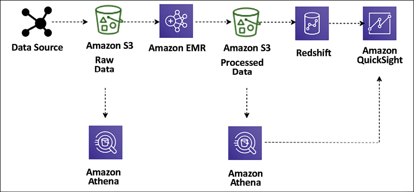

图 13.5：用于大数据处理的数据湖 ETL 管道

在这里，提取、转换、加载 (**ETL**) 管道使用 Amazon Athena 来临时查询存储在 Amazon S3 中的数据。从各种数据源(例如，Web 应用程序服务器)提取的数据会生成持久保存到 S3 中的日志文件。然后使用 Amazon Elastic MapReduce (**EMR**) 将这些文件转换和清理为有意义的见解所需的集合形式，并加载到 Amazon S3 中。 Amazon EMR 在云端提供托管的 Hadoop 服务器，使用 Hive、Pig、Spark 等各种开源技术进行数据处理。

这些转换后的文件使用 COPY 命令加载到 Amazon Redshift 中，并使用 Amazon QuickSight 可视化。使用 Amazon Athena，你可以在存储数据时和转换后(使用聚合数据集)直接从 Amazon S3 查询数据。你可以在 Amazon QuickSight 中可视化来自 Athena 的数据。你可以在不更改现有数据流的情况下轻松查询这些文件。

让我们看看一些流行的数据处理工具。

### 数据处理和分析的技术选择

以下是一些最流行的数据处理技术，可以帮助你对大量数据进行转换和处理：

- **Apache Hadoop** 使用分布式处理架构，其中任务映射到商品服务器集群进行处理。分配给集群服务器的每一项工作都可以在任何服务器上运行或重新运行。集群服务器经常使用 HDFS 将数据存储在本地进行处理。 Hadoop 框架承担了一项大工作，将其拆分为离散的任务，并并行处理它们。它允许跨大量 Hadoop 集群的大规模可扩展性。它还为容错设计，其中每个工作节点定期向主节点报告其状态，主节点可以重新分配没有积极响应的集群的工作。 Hadoop 使用的一些最流行的框架是 Hive、Presto、Pig 和 Spark。
- **Apache Spark** 是一个内存处理框架。 Apache Spark 是一个大规模并行处理系统，具有不同的执行器，可以拆分 Spark 作业并并行运行任务。要增加作业的并行性，请向集群添加节点。 Spark 支持批处理、交互式和流式数据源。 Spark 在作业执行期间的所有阶段都使用有向无环图 (**DAG**)。 DAG 可以在作业期间跟踪你的数据或沿袭转换，并通过将数据帧存储在内存中来有效地减少 I/O。 Spark 还具有分区感知功能，可以避免网络密集型洗牌。
- **Hadoop 用户体验 (HUE)** 使你能够通过基于浏览器的用户界面而不是命令行在集群上运行查询和脚本。 HUE 在用户界面中提供最常见的 Hadoop 组件。它支持基于浏览器的 Hadoop 操作查看和跟踪。多个用户可以通过 HUE 的登录门户访问集群，管理员可以手动管理访问或使用 LDAP、PAM、SPNEGO、OpenID、OAuth 和 SAML2 身份验证。 HUE 允许你实时查看日志，并提供一个 Metastore 管理器来操作 Hive Metastore 内容。
- **Pig** 通常用于在以结构化格式(SQL 表)存储之前处理大量原始数据。 Pig 非常适合 ETL 操作，例如数据验证、数据加载、数据转换以及以多种格式组合来自多个源的数据。除了 ETL，Pig 还支持嵌套数据、连接和分组等关系操作。 Pig 脚本可以使用非结构化和半结构化数据(例如 Web 服务器日志或点击流日志)作为输入。相反，Hive 始终对输入数据强制实施模式。 Pig Latin 脚本包含有关过滤、分组和连接数据的说明，但 Pig 并不是一种查询语言。 Hive 更适合查询数据。 Pig 脚本编译并运行以根据 Pig Latin 脚本中的指令转换数据。
- **Hive** 是一个运行在 Hadoop 集群之上的开源数据仓库和查询包。 SQL 是一项广泛使用的技能，可帮助团队轻松过渡到大数据世界。 Hive 使用一种称为 Hive 查询语言 (**HQL**) 的类似 SQL 的语言，使得在 Hadoop 系统中查询和处理数据变得容易。 Hive 抽象了使用 Java 等编码语言编写程序以执行分析作业的复杂性。
- **Presto** 是一个类似 Hive 的查询引擎，但速度要快得多。它支持 ANSI SQL 标准，该标准易于学习且是最流行的技能集。 Presto 支持复杂的查询、连接和聚合功能。与 Hive 或 MapReduce 不同，Presto 在内存中执行查询，从而减少延迟并提高查询性能。在为 Presto 选择服务器容量时需要小心，因为它需要具有高内存。如果发生内存溢出，Presto 作业将重新启动。
- **HBase** 是作为开源 Hadoop 项目的一部分开发的 NoSQL 数据库。 HBase运行在HDFS之上，为Hadoop生态系统提供非关系型数据库能力。 HBase 有助于以压缩的列格式存储大量数据。此外，它提供了快速查找，因为大部分数据缓存都保存在内存中，而集群实例存储仍在使用。
- **Apache Zeppelin** 是一个基于 Web 的数据分析编辑器，构建在 Hadoop 系统之上，也称为 Zeppelin notebook。它对其后端语言使用解释器的概念，并允许将任何语言插入 Zeppelin。 Apache Zeppelin 包括一些基本图表和数据透视图。就可以识别和可视化的任何语言后端的任何输出而言，它都非常灵活。
- **Ganglia** 是一个 Hadoop 集群监控工具。但是，你需要在启动期间在集群上安装 Ganglia。 Ganglia UI 在主节点上运行，你可以使用 SSH 隧道查看它。 Ganglia 是一个开源项目，旨在监控集群而不影响其性能。 Ganglia 可以帮助检查集群中单个服务器的性能以及整个集群的性能。
- **JupyterHub** 是一个多用户 Jupyter 笔记本。 Jupyter Notebook 是数据科学家执行数据工程和 ML 时最流行的工具之一。 JupyterHub notebook 服务器为每个用户提供了一个基于 web 的 Jupyter notebook IDE。多个用户可以同时使用他们的 Jupyter 笔记本来编写和执行用于探索性数据分析的代码。
- **Amazon Athena** 是一种交互式查询服务，用于使用标准 ANSI SQL 语法在 Amazon S3 对象存储上运行查询。 Amazon Athena 建立在 Presto 之上，并将即席查询功能扩展为托管服务。 Amazon Athena 元数据存储的工作方式类似于 Hive 元数据存储，使用来自 Amazon Athena 中的 Hive 元数据存储的相同 DDL 语句。 Athena 是一种无服务器托管服务，这意味着所有基础设施和软件的处理和维护都由 AWS 负责，你可以直接在基于 Web 的 Athena 编辑器中开始运行查询。
- **Amazon Elastic MapReduce (EMR)** 本质上是云中的 Hadoop。你可以使用 EMR 将 Hadoop 框架与 AWS 云的强大功能结合使用。 EMR 支持所有最流行的开源框架，包括 Apache Spark、Hive、Pig、Presto、Impala、HBase 等。 EMR 提供解耦的计算和存储，这意味着你不必总是运行大型 Hadoop 集群；你可以执行数据转换并将结果加载到持久性 Amazon S3 存储中并关闭服务器。 EMR 提供自动缩放功能，让你免于使用各种软件安装和更新服务器的管理开销。
- **AWS Glue** 是一种托管 ETL 服务，可帮助进行数据处理、数据编目和 ML 转换以查找重复记录。 AWS Glue 数据目录与 Hive 数据目录兼容，并提供跨各种数据源(包括关系数据库、NoSQL 和文件)的集中式元数据存储库。 AWS Glue 建立在温暖的 Spark 集群之上，并提供 ETL 作为托管服务。 AWS Glue 在 PySpark 和 Scala 中为常见用例生成代码，这样你就不必从头开始编写 ETL 代码。 Glue 作业创作功能处理作业中的任何错误并提供日志以了解底层权限或数据格式问题。 Glue 提供的工作流可帮助你通过简单的拖放功能构建自动化数据管道。

数据分析和处理是一个庞大的主题，足以单独写一本书。本节对用于数据处理的流行和常用工具进行了非常高层次的概述。还有更多专有和开源工具可用。作为解决方案架构师，你需要了解市场上可用的各种工具，以便为你组织的用例做出正确的选择。

业务分析师需要创建报告和仪表板并执行临时查询和分析以识别数据洞察力。让我们在下一节中了解数据可视化。

## 可视化数据

数据洞察力用于回答重要的业务问题，例如客户收入、地区利润或站点广告推荐等等。在大数据管道中，从各种来源收集了大量数据。然而，公司很难找到有关每个地区的库存、盈利能力和欺诈账户费用增加的信息。你出于合规目的不断收集的一些数据也可用于产生业务。

BI 工具的两个重大挑战是实施成本和实施解决方案所需的时间。让我们看一下数据可视化的一些技术选择。

### 数据可视化的技术选择

以下是一些最流行的数据可视化平台，可帮助你根据业务需求准备具有数据可视化的报告：

- **Amazon QuickSight** 是一种基于云的 BI 工具，用于企业级数据可视化。它带有各种可视化图形预设，例如折线图、饼图、树状图、热图、直方图等。
- **Amazon QuickSight** 具有称为超快并行内存计算引擎 (**SPICE**) 的数据缓存引擎，可帮助快速呈现可视化效果。你还可以执行数据准备任务，例如重命名和删除字段、更改数据类型以及创建新的计算字段。 QuickSight 还提供基于 ML 的可视化见解和其他基于 ML 的功能，例如自动预测。
- **Kibana** 是一个用于流数据可视化和日志探索的开源数据可视化工具。 Kibana 提供与 Elasticsearch 的紧密集成，并将其用作在 Elasticsearch 服务之上搜索数据的默认选项。与其他 BI 工具一样，Kibana 还提供流行的可视化图表，例如直方图、饼图和热图，并提供内置的地理空间支持。
- **Tableau** 是最受欢迎的数据可视化 BI 工具之一。它使用可视化查询引擎，这是一种专门构建的引擎，用于比传统查询更快地分析大数据。 Tableau 提供拖放式界面和混合来自多个资源的数据的能力。
- **Spotfire** 使用内存中处理来加快响应时间，支持来自各种资源的广泛数据集。它提供了在地理地图上绘制数据并在 Twitter 上共享的功能。借助 Spotfire 建议，它会自动检查你的数据并就如何最好地可视化数据提出建议。
- **Jaspersoft** 支持自助式报告和分析。它还提供拖放式设计器功能。
- **Power BI** 是 Microsoft 提供的一种流行的 BI 工具。它提供具有多种可视化选择的自助式分析。

数据可视化对于解决方案架构师来说是一个重要且庞大的主题。作为解决方案架构师，你需要了解可用的工具，并根据数据可视化的业务需求做出正确的选择。

现在你已经了解了各种数据管道组件，从摄取、存储和处理到可视化。让我们将它们放在一起，并在下一节中学习如何编排大数据架构。

## 设计大数据架构

大数据解决方案以重复的方式包含数据摄取、存储转换和可视化，以运行日常业务运营。你可以使用在前面部分中了解的开源或云技术构建这些工作流。

首先，你需要通过从业务用例逆向工作来了解哪种架构风格适合你。你需要了解大数据架构的最终用户，并创建用户角色以更好地了解需求。要确定大数据架构所针对的关键角色，你需要了解以下几点：

- 他们属于你组织中的哪些团队、单位或部门？
- 他们的数据分析和数据工程熟练程度如何？
- 他们通常使用什么工具？
- 你是否需要迎合组织的员工、客户或合作伙伴？

作为参考，以零售连锁店分析为例，你可以确定以下角色：

- 拥有产品线/代码但只看到产品营业额的产品经理角色。
- 想要了解单个商店的销售周转率和产品组合的商店经理角色(只能看到他们的商店)。
- 管理员角色可以访问所有数据。
- 数据分析师可以访问所有已编辑 PII 数据的数据。
- 客户保留经理想要了解重复的客户流量。
- 数据科学家需要访问原始数据和处理后的数据来建立建议和预测。

了解你的用户角色后，接下来确定这些角色希望解决的业务用例，例如：

- 随着时间的推移，有多少客户花费更多？时间越长越少？描述这些客户。
- 在随着时间的推移花费更多的客户中，哪些类别的增长速度更快？
- 在那些随着时间的推移支出减少的客户中，他们在哪些类别中的参与度降低了？
- 哪些人口因素(例如家庭人数、有孩子、收入)似乎会影响客户支出？哪些人口统计因素似乎会影响与某些类别的互动？
- 是否有证据表明直接营销可以提高整体参与度？
- 一个类别的直接营销是否会提高其他类别的参与度？

当你获得有关用例的详细信息时，构建数据架构的重要方面是了解访问模式和数据保留，可以使用以下查询对其进行分析：

- 关键用户和角色多久运行一次他们的报告、查询或模型？
- 他们对数据新鲜度的期望是什么？
- 他们对数据粒度的期望是什么？
- 最常访问数据的哪一部分进行分析？
- 你打算将数据保留多长时间以供分析？
- 数据在什么时候可以脱离数据湖环境？

处理数据时总会有某种敏感性。每个国家和地区都有其当地的法规遵从性要求，解决方案架构师需要了解这些要求，例如：

- 你的企业有哪些合规要求？
- 你是否遵守数据局部性、数据隐私或数据编辑要求？
- 谁有权查看数据集中的哪些记录和哪些属性？
- 你将如何根据要求强制删除记录？
- 你可以在哪里存储数据，例如，本地到地理位置、县或全球？

作为数据架构师，你还需要考虑投资回报及其对整体业务决策的帮助。要理解，你可能需要通过以下几点：

- 你的数据湖支持哪些主要业务流程和决策？
- 这些决策需要什么级别的粒度？
- 数据延迟对业务决策有何影响？
- 你打算如何衡量成功？
- 投入的时间和材料的预期回报是多少？

最终，你希望构建一个数据架构，你可以在其中灵活地做出技术选择。例如，使用最好的基于云的托管服务和开源技术来利用现有技能和投资。你希望构建大数据解决方案以利用并行性来实现高性能和可扩展性。如果你确保大数据管道的任何组件都可以独立扩展或扩展，以便你可以根据不同的业务工作负载进行调整，那将是最好的。

要充分发挥解决方案的潜力，你需要提供与现有应用程序的互操作性，以便大数据架构的组件也可用于机器学习处理和企业 BI 解决方案。它将使你能够创建跨数据工作负载的集成解决方案。让我们了解一些大数据架构模式。

### 数据湖架构

数据湖是结构化和非结构化数据的集中存储库。数据湖是公司中发现的不同类型数据的组合。它已成为你可以将所有企业数据卸载到 Amazon S3 等低成本存储系统的地方。你可以使用通用 API 和开放文件格式(例如 **Apache Parquet** 和 **ORC**)访问数据。该湖按原样存储数据，使用开源文件格式支持直接分析和机器学习用途。

数据湖正在成为一种在集中式存储库中存储和分析大量数据的流行方式。数据可以按其当前格式原样存储，你无需将数据转换为预定义的模式，从而提高了数据摄取速度。如下图所示，数据湖是你组织中所有数据的单一真实来源：

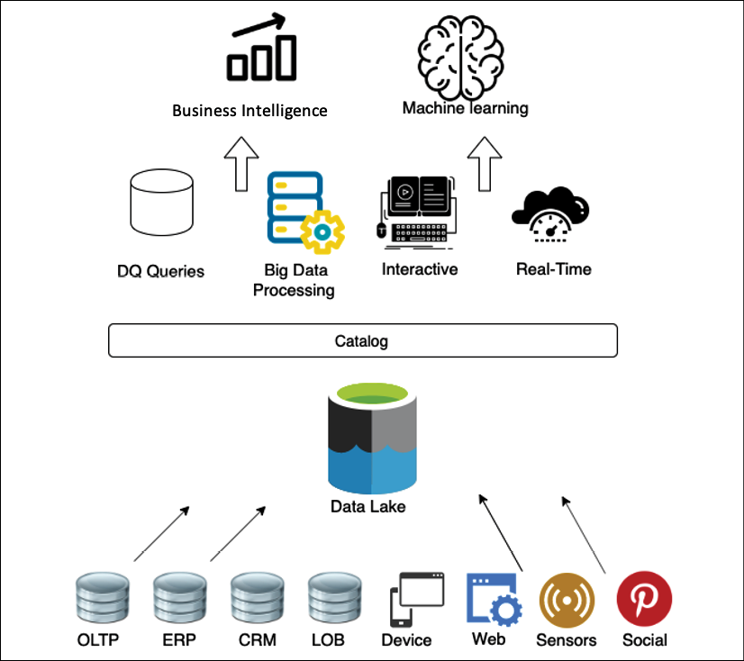

图 13.6：数据湖的对象存储

以下是数据湖的好处：

- 从各种来源摄取数据：数据湖让你可以在一个集中位置存储和分析来自多个来源(例如关系和非关系数据库和流)的数据，以获得单一事实来源。这就回答了诸如为什么数据分布在很多地方这样的问题。单一的真相来源在哪里？
- 收集和有效存储数据：数据湖可以吸收任何类型的数据结构，包括半结构化和非结构化数据，而无需任何模式。这回答了诸如如何从各种来源以多种格式快速提取数据并高效地大规模存储等问题？
- 根据生成的数据量进行扩展：数据湖允许你分离存储层和计算层以分别扩展每个组件。这回答了诸如如何根据生成的数据量进行扩展等问题？
- 将分析应用于来自不同来源的数据：使用数据湖，你可以确定读取模式并为从各种资源收集的数据创建集中式数据目录。这使你能够执行快速的即席分析。这回答了诸如我可以将多个分析和处理框架应用于相同数据的问题吗？

你的数据湖需要一个无限可扩展的数据存储解决方案。将你的处理和存储分离提供了大量好处，包括使用各种工具处理和分析相同数据的能力。虽然这可能需要额外的步骤才能将你的数据加载到正确的工具中，但作为你的中央数据存储的 Amazon S3 比传统存储选项提供更多优势。下图提供了使用 AWS 服务的数据湖视图：

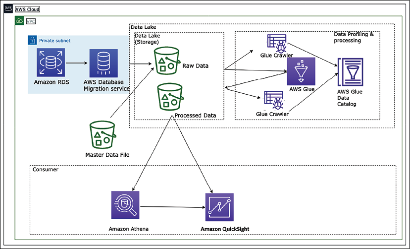

图 13.7：AWS 平台中的数据湖架构

上图描述了使用 Amazon S3 存储的数据湖。数据从各种资源(如关系数据库和主数据文件)提取到集中存储。所有数据都以其原始格式存储在数据湖的原始层中。使用 AWS Glue 服务对这些数据进行编目和转换。 AWS Glue 是 AWS 云平台中基于 Spark 框架的无服务器数据编目和 ETL 服务。转换后的数据存储在数据湖的处理层中，可以用于不同的目的。数据工程师可以使用 Amazon Athena(一种基于托管 Presto 实例构建的无服务器查询服务)运行临时查询，并使用 SQL 直接从 Amazon S3 查询数据。业务分析师可以使用 Amazon QuickSight、Tableau 或 Power BI 为业务用户构建可视化或在 Amazon Redshift 中加载选择性数据以创建数据仓库集市。最后，数据科学家可以使用 Amazon SageMaker 使用这些数据来执行机器学习。

数据湖的美妙之处在于你的架构是面向未来的。十二个月后，可能会有你想要使用的新技术。有了数据湖中的数据，你就可以以最小的开销将这项新技术插入到你的工作流中。通过在大数据处理管道中构建模块化系统，以共享对象存储(如 Amazon S3)为骨干，你可以在特定模块过时或有更好的工具可用时替换它们。

一种工具不能做所有事情。你需要为正确的工作使用正确的工具，而数据湖使你能够构建高度可配置的大数据架构来满足你的特定需求。业务问题过于广泛、深入和复杂，以至于一种工具无法解决所有问题，尤其是大数据和分析。

然而，随着时间的推移，组织意识到数据湖有其局限性。由于数据湖使用廉价存储，组织会尽可能多地在数据湖中存储数据，从而提供开放、直接访问文件的灵活性。由于数据质量和细粒度数据安全问题，数据湖很快开始变成数据沼泽。然而，为了解决数据湖的性能和质量问题，组织将数据湖中的一小部分数据处理到下游数据仓库，以供 BI 应用程序用于重要决策。

数据湖和数据仓库之间的双系统架构需要持续的数据工程来维护和处理这两个系统之间的数据。每个数据处理步骤都有可能导致降低数据质量的故障，同时保持数据湖和数据仓库的一致性既困难又昂贵。除了支付持续的数据处理成本外，用户还要为复制到仓库的数据支付双倍的存储成本。为了解决双系统问题，出现了一种称为数据湖屋的新型架构。让我们了解更多关于湖屋建筑的细节。

### 湖屋建筑

出现了一种称为 **Lakehouse** 架构的新架构范例，以解决数据湖和数据仓库的局限性。 Lakehouse 架构旨在利用两者的优势，利用数据湖的规模以客户想要分析的开放格式摄取和存储数量不断增加的数据，并实现 SQL 查询的用户友好性和保证数据仓库。湖屋建筑的主要方面是：

- 以开放数据格式存储数据
- 解耦存储和计算
- 交易担保
- 支持多样化的消费需求
- 安全且受监管

让我们看看 Data Lakehouse 模式中的阶段是什么。

图 13.8：Lakehouse 架构层

这些层可以描述如下：

- **原始层**：该层充当源交付格式的所有源数据的着陆区。此处的数据可以存储更长的时间并存档以用于审计和可再现性目的。
- **标准化层**：由于到达原始层的数据可以是源交付的特定格式，标准化层用于在执行模式验证、模式演化控制、数据后以标准格式(通常是 Parquet)存储数据数据的质量规则、标记化规则和清理规则。清理规则的一个典型示例是将 DateTime 格式标准化为标准格式(例如 ISO 8601)。此处存储的数据也针对分析查询进行了优化，因为它以列格式分区和存储。此数据通常也编目在中央数据目录中以供发现。该层充当组织中标准化原始数据的消费层。
- **一致层**：通常，在任何组织中，一些公共实体/主题领域都得到了明确定义，并且在整个组织中得到了普遍理解和使用。这些实体可以被视为已确认实体并最终进入一致性层。
  这些公共实体的定义需要集中管理，因为它们通常是基于组织的主数据形成的。所有这些实体也都记录在中央数据目录中，具有明确的所有权和用于 PII/PCI、保留、目的等的元数据。集中管理合规实体的好处之一是清晰的企业所有权。由于多方在组织内使用此数据，如果所有权是分布式的，定义可能会变得模棱两可，并且维护和保留这些合规实体的历史、治理和数据管理可能会成为一个挑战。
- **丰富层**：这更像是一个逻辑层，因为它针对的是数据工程团队，他们将创建结合一致实体和标准化原始数据的数据产品。首先，这些以业务领域为中心的团队将拥有许多对特定业务领域有用的最终产品；但是，在某些情况下，这些也可能是对其他业务领域有用的产品。这些可以称为具有适当业务定义的"黄金数据集"，可以卸载到数据湖进行共享。该层的所有最终产品数据集也应添加到中央数据目录中，并带有适当的标签、元数据和数据集的用途。

下图显示了使用 Redshift Spectrum 进行数据共享的示例 lakehouse 架构。 Amazon Redshift Spectrum 提供了从数据湖中查询数据的能力，而无需将数据存储在数据仓库中。假设你已经在使用 Amazon Redshift 进行数据仓储。在这种情况下，你不需要将整个数据加载到 Amazon Redshift 集群中。尽管如此，你仍然可以简单地使用 spectrum 直接从 Amazon S3 数据湖中查询数据，并将其与数据仓库数据相结合。

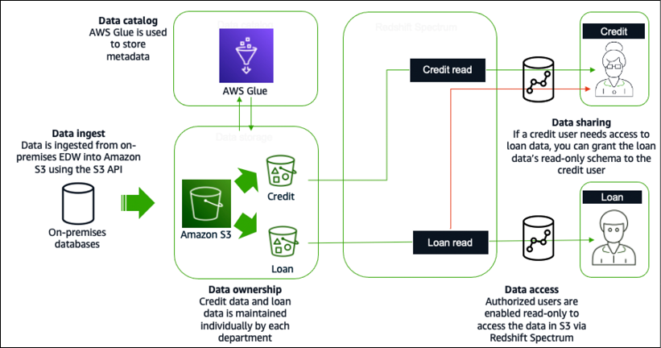

图 13.9：使用 Redshift Spectrum 的 AWS 云平台中的 Lakehouse 架构

使用上图中的 S3 API 将数据从本地企业数据仓库 (**EDW**) 提取到 S3。 AWS Glue 用于单独存储元数据和信用贷款数据。贷款部门的数据分析师将被授予对贷款数据的只读访问权限以进行数据访问。同样，信用分析师将被授予对信用数据的只读访问权限。对于数据共享，如果信用分析师需要访问贷款数据，则可以为信用分析师提供贷款数据的只读模式。

湖屋建筑有很多好处；但是，对于具有由地理上分离的业务部门驱动的复杂应用程序环境的大型组织而言，它并不能解决问题。这些业务部门已经建立了数据湖和数据仓库作为他们的分析源。每个业务部门可以合并多个内部应用程序数据湖来支持他们的业务。集中式企业数据湖或数据湖房很难实现，因为变化的速度通常很慢，而且很难满足不同业务部门的所有需求。要处理这个问题，你需要面向领域的去中心化数据所有权和架构。这就是数据网格发挥作用的地方。让我们进一步了解数据网格架构。

### 数据网格架构

数据网格和数据湖架构之间的主要区别在于，数据不是试图将多个域组合成一个集中管理的数据湖，而是有意地让数据分布。数据网格提供了一种模式，允许大型组织连接大型企业内的多个数据湖/湖屋，并促进与合作伙伴、学术界甚至竞争对手的共享。数据网格标志着我们管理大型分析数据集的方式发生了受欢迎的架构和组织范式转变。该范式基于四个原则：

- 所有权和架构的面向领域的去中心化
- 数据作为产品
- 具有集中审计控制的联合数据治理
- 使数据可消费的公共访问

数据网格是一种解决这些维度的组织架构：面向领域的分散式数据所有权和架构、数据作为产品、自助式数据基础设施作为平台，以及联合计算治理。它鼓励数据驱动的敏捷性，并通过轻量级集中策略支持域本地治理。数据网格通过明确的责任隔离数据资源来提供更好的所有权。数据网格的核心概念是以数据域为特征的节点，存在于数据湖账户中。

数据生产者向数据网格帐户中的中央目录贡献一个或多个数据产品，其中联合数据治理应用于数据产品的共享方式，提供可发现的元数据和可听性。数据消费者搜索目录并通过数据网格模式接受资源共享来访问数据产品。下面是 AWS 云中的数据网格架构：

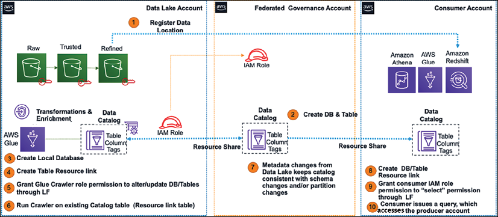

图 13.10：AWS 云平台中的数据网格架构

以下是为构建数据网格而实现的组件，如上图所示：

- 注册数据产品的中央 AWS 账户，由数据库、表、列和行组成。
- 访问控制标签和标签访问策略集中管理。
- 实现与消费者共享的存储数据权限。权限可以是直接的，也可以基于标签。
- 将安全和治理策略应用于生产者和消费者账户以及他们发布的数据产品。

使用数据网格架构，你可以致力于加速业务领域 lakehouses 的独立交付。数据网格提高了域内的数据安全性和合规性，并支持自助式数据产品创建、发现和订阅，从而使消费者能够透明地访问数据产品。人们越来越需要提供快速洞察力并根据客户需求迅速采取行动，这使得流数据分析成为任何业务的重要方面。让我们了解有关流式数据分析架构的更多详细信息。

### 流数据架构

流数据是增长最快的数据部分之一。你需要从视频、音频、应用程序日志、网站点击流和物联网遥测数据等各种资源中获取实时数据，并快速处理以提供快速的业务洞察力。流数据用例遵循类似的模式：数据从数据生产者流经流存储，数据消费者流向存储目的地。源不断生成数据，通过摄取阶段传送到流存储层，在那里它被持久地捕获并可用于流处理。流处理层对存储层中的数据进行处理，并将处理后的信息发送到指定的目的地。

流数据架构不同，因为它需要以非常高的速度处理连续的海量数据流。这些数据通常是半结构化的，需要大量处理才能获得可操作的见解。在设计流数据架构时，你需要轻松扩展数据存储，同时从时间序列数据中获取实时模式识别。

你需要考虑生成数据流的生产者，例如物联网传感器，如何存储数据并使用实时数据处理工具进行处理，最后，如何实时查询数据。下图显示了在 AWS 平台中使用托管服务的流式数据分析管道：

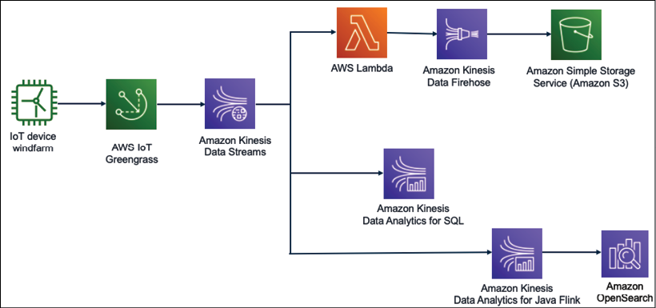

图 13.11：物联网数据的流式数据分析

在上图中，从风电场获取数据以了解风力涡轮机的健康状况和速度。重要的是实时控制风力涡轮机，以避免在风速超过风力涡轮机可以处理的极限的情况下进行昂贵的维修。

使用 AWS IoT 将风力涡轮机数据提取到 Kinesis Data Streams。 Kinesis Data Streams 可以将流数据保留长达一年并提供重放功能。它们采用扇出技术将数据传送到多个资源，你可以在其中使用 Lambda 处理数据并将其存储到 Amazon S3，以便使用 Amazon Kinesis Firehose 进行进一步分析。

你可以通过 Kinesis Data Analytics for SQL 使用简单的 SQL 查询对流数据执行实时查询。你可以使用 Kinesis Data Analytics for Java Flink 自动执行数据管道以实时转换流数据，并将处理后的数据存储在 Amazon OpenSearch 中以获得数据洞察力。你可以在 OpenSearch 之上添加 Kibana，以实时可视化风力涡轮机数据。

这些用例的挑战在于开发人员需要花费大量的时间和精力来创建资源并建立流数据服务所需的最佳实践(例如访问控制、日志记录功能和数据集成)。上述解决方案与数据无关且易于定制，使客户能够快速修改预配置的默认值并开始编写代码以包含他们的特定业务逻辑。

## 大数据架构最佳实践

在前面的部分中，你了解了各种大数据技术和架构模式。让我们看一下以下包含数据湖架构不同层的参考架构图，以了解最佳实践。

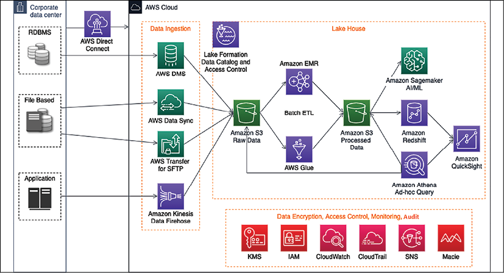

图 13.12：数据湖参考架构

上图描述了使用 AWS 云平台和以下组件的数据湖架构中的端到端数据管道：

- AWS Direct Connect 在本地数据中心和 AWS 之间建立高速网络连接以迁移数据。如果你有大量存档数据，最好使用 AWS Snow 系列将其离线移动。
- 一个包含各种组件的数据摄取层，使用 Amazon Kinesis 摄取流数据，使用 AWS Data Migration Service (**DMS**) 摄取关系数据，使用 AWS Transfer for SFTP 安全文件传输，以及使用 AWS DataSync 更新云和本地系统之间的数据文件。
- 使用 Amazon S3 的所有数据的集中式数据存储，其中数据存储有多个层来存储原始数据、处理后的数据和归档数据。
- 云原生数据仓库解决方案 Amazon Redshift，使用 Redshift Spectrum 来支持 lakehouse 架构。
- 使用 Amazon Athena 的临时查询功能。
- 使用 AWS Glue 基于 Spark 的快速 ETL 管道。
- Amazon EMR 以重新利用现有的 Hadoop 脚本和其他 Apache Hadoop 框架。
- Amazon Lake Formation 在数据湖级别构建全面的数据编目和精细访问控制。
- Amazon SageMaker 的 AI/ML 扩展。

其他组件包括用于数据加密的 **Amazon KMS**(密钥管理服务)、用于访问控制的 **Amazon IAM**(身份和访问管理)、用于 PII 数据检测以遵守 PCI-DSS 等数据合规性的 Amazon Macie、用于监控操作的 CloudWatch，以及CloudTrail 审计数据湖活动。

你需要使用以下标准来验证你的大数据架构：

- 安全
  - 使用基于资源的访问控制对数据进行分类并定义相应的数据保护策略。
  - 使用用户权限和单点登录 (**SSO**) 实施强大的身份基础。
  - 为审计目的启用环境和数据可追溯性。
  - 在所有层应用安全性并在所有层使用 SSL 和静态加密保护传输中和静态数据。
  - 让人们远离数据，例如锁定对生产数据集的写入访问权限。
- 可靠性
  - 使用数据编目使用自动数据分析来加强数据卫生。
  - 使用数据仓库和数据湖之间的数据分层管理数据资产、转换和过期的生命周期。
  - 通过维护数据目录中的数据移动历史来保存数据沿袭。
  - 通过 ETL 作业故障的自动恢复，为分析管道和监控系统 SLA 设计弹性。
- 性能效率
  - 使用数据分析通过数据验证提高性能并构建清理层。
  - 不断优化数据存储，例如使用Parquet格式的数据压缩、数据分区、文件大小优化等。
- 成本优化
  - 采用消费模型并确定你是需要临时查询模式还是快速查询模式。
  - 删除不再使用的数据。定义数据保留规则并删除或归档超出保留期限的数据。
  - 使用基于数据湖的解决方案分离计算和存储。
  - 针对各种数据源和数据量使用不同的迁移策略来提高迁移效率。
  - 使用托管和应用程序级服务来降低拥有成本。
- 卓越运营
  - 使用 CloudFormation、Terraform 和 Ansible 等工具以代码形式执行操作。
  - 自动化操作，例如使用 Step Functions 或 Apache Airflow 构建编排层。
  - 通过持续监控和自动恢复 ETL 作业故障来提前预测故障。
  - 衡量工作负载的健康状况。

你可以使用上述清单作为验证大数据架构的指南。数据工程是一个非常广泛的主题，需要多本书来深入介绍每个主题。

在本章中，你了解了具有流行架构模式的数据工程的各种组件，这将帮助你开始并更深入地探索该主题。

## 概括

在本章中，你了解了用于大数据管道设计的大数据架构和组件。你了解了数据摄取以及可用于收集批处理和流数据以进行处理的各种技术选择。由于云是存储当今产生的大量数据的核心，你了解了可用于在 AWS 云生态系统中摄取数据的各种服务。

在处理大数据时，数据存储是中心点之一。你了解了各种数据存储，包括结构化和非结构化数据、NoSQL 和数据仓库，以及与每种数据相关的适当技术选择。你了解了数据湖架构及其优势。

收集和存储数据后，你需要对其进行转换以深入了解该数据并可视化你的业务需求。你了解了数据处理架构和技术选择，以便根据你的数据要求选择开源和基于云的数据处理工具。这些工具可帮助你根据数据的性质和组织需求获得数据洞察力和可视化效果。

你了解了各种大数据架构模式，包括数据湖、湖屋、数据网格和流数据架构，以及参考架构。最后，你通过将所有学习内容整合到参考架构中，学习了大数据架构最佳实践。

当你收集更多数据时，获得未来见解总是有益的，这对业务非常有益。要根据历史数据预测未来结果，你通常需要机器学习。让我们在下一章中了解更多关于机器学习以及如何使你的数据架构永不过时的知识。