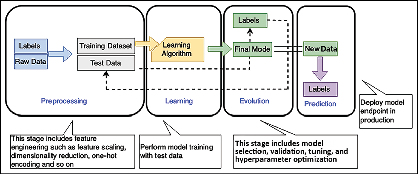
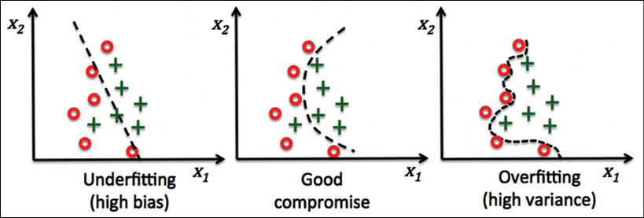

# 机器学习架构

在上一章中，你了解了如何摄取和处理大数据并获得洞察力以了解你的业务。在传统的企业经营方式中，组织的决策者查看过去的数据并利用他们的经验来规划公司未来的发展方向。这不仅仅是关于建立业务愿景，还包括通过预测他们的需求并取悦他们或自动化日常决策活动(例如贷款审批)来改善最终用户体验。

然而，随着可用数据量的增加，现在人脑很难处理所有数据并预测未来。这就是机器学习 (**ML**) 通过查看大量历史数据帮助我们预测未来行动方案的地方。大多数企业要么正在投资 ML，要么正在计划这样做。它正迅速成为帮助公司脱颖而出的技术——通过创造新的产品、服务和商业模式来创新并获得竞争优势。

ML 非常适合解决业务问题，因为在整个公司的不同业务线中可能存在无数用例，而且这些用例可能产生很大的影响。商业和政府行业可以受益于部署 ML 工具，帮助他们在更短的时间内取得更好的成果。 AI/ML 是解决不同业务线问题的好方法，例如，利用呼叫中心智能构建新级别的客户服务，或通过使用基于 ML 的个性化营销活动帮助营销团队实现其个性化目标。

在本章中，你将学习以下主题来处理和管理你的 ML 需求：

- 什么是机器学习
- 数据科学和机器学习
- 机器学习模型过拟合与欠拟合
- 监督和非监督 ML 模型
- 机器学习架构
- MLOps
- 深度学习
- 自然语言处理
- 机器学习架构的设计原则

到本章结束时，你将了解如何设计 ML 架构。你将了解各种 ML 模型和 ML 工作流程。你将了解通过特征工程、模型训练、推理和模型评估创建 ML 模型管道的过程。

## 什么是机器学习？

机器学习推动更好的客户体验、更高效的业务运营以及更快、更准确的决策制定。随着计算能力的提升和数据的激增，ML 已经从外围转变为各行业企业和组织的核心差异化因素。机器学习用例适用于大多数业务，例如个性化产品和内容推荐、联络中心智能、虚拟身份验证和智能文档处理。还有为特定行业构建的定制用例，例如制药业的临床试验或制造业的装配线质量控制。

假设你的公司想要向潜在客户发送新玩具发布的营销优惠，而你的任务是开发一个系统来确定营销活动的目标对象。你的客户群可能是数百万用户，你需要对其应用预测分析，而 ML 可以帮助你解决这样一个复杂的问题。

ML 使用技术来发现趋势和模式，并根据过去的事实数据计算数学预测模型。 ML 可以帮助解决以下复杂问题：

- 当你可能不知道如何创建复杂的代码规则来做出决定时；例如，如果你想识别图像和语音中的人的情绪，就没有简单的方法来编写逻辑代码来实现这一点。
- 当你需要分析大量数据以进行决策时，数据量太大以至于人类无法有效地进行分析。例如，虽然人类可以通过垃圾邮件检测来做到这一点，但数据量使得快速做到这一点变得不切实际。
- 当你需要根据个人数据调整和个性化用户行为时，相关信息可能仅动态可用；例如个性化产品推荐或网站个性化。
  当有许多任务和大量可用数据时，你无法足够快地跟踪信息以做出基于规则的决策——例如，欺诈检测和自然语言处理。

人们根据他们的分析结果和经验来处理数据预测。使用机器学习，你可以训练计算机根据可用数据提供专业知识，并根据新数据做出预测。下面列出了一些行业 ML 用例：

- 预测性维护：根据传感器数据预测组件是否会在故障发生前发生故障。示例应用程序包括预测汽车车队、制造设备和物联网传感器的故障和剩余使用寿命 (**RUL**)。关键价值是增加车辆和设备的正常运行时间并节省成本。该用例广泛用于汽车和制造业。
- 需求预测：使用历史数据更快地预测关键需求指标，并围绕生产、定价、库存管理和采购/补货做出更准确的业务决策。关键价值是满足客户需求，通过减少过剩库存和减少浪费来降低库存持有成本。此用例主要用于金融服务、制造、零售和消费品 (**CPG**) 行业。
- 欺诈检测：自动检测潜在的欺诈活动并将其标记以供审查。关键价值是降低与欺诈相关的成本并维护客户信任。此用例主要用于金融服务和在线零售行业。
- 信用风险预测：解释信用申请中的个人预测，以预测信用是否会被偿还(通常称为信用违约)。关键价值在于识别偏差并满足监管要求。此用例主要用于金融服务和在线零售行业。
- 从文档中提取和分析数据：理解书面和数字文档和表格中的文本，提取信息，并使用它来对项目进行分类和做出决策。此用例通常用于医疗保健、金融服务、法律、机电和教育行业。
- 个性化推荐：根据历史趋势进行个性化推荐。常见于机电、零售和教育(最有可能是推荐课程)行业。
- 流失预测：预测客户流失的可能性；通常用于零售、教育和软件即服务 (**SaaS**)。

ML 背后的主要思想是为 ML 算法提供训练数据集，并让它从新数据集中预测一些东西，例如，将一些历史股市趋势数据提供给 ML 模型，并让它预测市场将如何波动接下来的6个月到1年。

在开发 ML 解决方案时，数据和代码必须谨慎地结合在一起，并且应该以可控的方式发展，以实现强大且可扩展的 ML 系统的共同目标；用于训练、测试和推理的数据会随着时间、不同来源发生变化，并且需要通过不断变化的代码来满足。如果没有系统的方法，代码和数据的演变方式可能会出现差异，从而导致生产出现问题，阻碍顺利部署，并导致难以追踪或重现的结果。让我们在下一节中了解数据科学如何与 ML 携手并进。

## 使用数据科学和机器学习

机器学习就是处理数据。训练数据和标签的质量对于 ML 模型的成功至关重要。高质量的数据会带来更准确的 ML 模型和正确的预测。通常在现实世界中，你的数据存在多个问题，例如缺失值、噪声、偏差、异常值等。数据科学的一部分是清理和准备数据，为 ML 做好准备。

数据准备首先要了解业务问题。数据科学家通常渴望直接进入数据、开始编码并产生见解。但是，如果对业务问题没有清晰的了解，你形成的任何见解都极有可能成为无法解决手头问题的解决方案。在迷失在数据中之前，从简单的用户故事和业务目标开始更有意义。在对业务问题有了扎实的了解后，你可以开始缩小 ML 问题类别的范围，并确定 ML 是否适合解决你的特定业务问题。

数据科学包括数据收集、分析、预处理和特征工程。探索数据为我们提供了必要的信息，例如数据质量和清洁度、数据中有趣的模式以及开始建模后可能的前进路径。

数据准备是构建 ML 模型的第一步。它非常耗时，占 ML 开发时间的 80%。数据准备一直被认为是乏味和资源密集型的，因为数据的固有性质是"脏"的，并且还没有为原始形式的 ML 做好准备。 "脏"数据可能包括缺失值或错误值、离群值等。通常需要特征工程来转换输入以提供更准确和高效的 ML 模型。

数据准备通常需要多个步骤。虽然大多数"独立数据准备工具"都提供数据转换、特征工程和可视化，但很少有工具提供内置模型验证。所有这些数据准备步骤都被认为与 ML 分开。我们需要的是一个框架，它可以在一个地方提供所有这些功能，并与 ML 管道的其余部分紧密集成。因此，数据准备模块在部署到生产环境之前需要管理和集成。

如下图所示，数据预处理和学习创建 ML 模型是相互关联的——你的数据准备将在很大程度上影响你的模型，而你选择的模型将在很大程度上影响你将进行的数据准备类型。找到正确的平衡是高度迭代的，并且是一门艺术(或反复试验)：

图 14.1：ML 工作流程

如上图所示，ML 工作流程包括以下阶段：

预处理：在此阶段，数据科学家对数据进行预处理并将其分为训练、验证和测试数据集。你的 ML 模型使用训练数据集进行训练以适合模型，并使用验证数据集进行评估。模型准备就绪后，你可以使用测试数据集对其进行测试。考虑到数据量和你的业务案例，你需要将数据分为训练集、测试集和验证集，可能保留 70% 的数据用于训练，10% 用于验证，20% 用于测试。特征是数据集的独立属性，可能会或可能不会影响结果。特征工程涉及找到正确的特征，这有助于实现模型的准确性。标签是你的目标结果，它取决于特征选择。你可以应用降维来选择正确的特征，从而过滤并提取对你的数据最有吸引力的特征。
学习：你在学习阶段根据业务用例和数据选择合适的 ML 算法。学习阶段是 ML 工作流的核心，你可以在训练数据集上训练 ML 模型。为了达到模型的准确性，你需要尝试各种超参数并进行模型选择。
评估：一旦你的 ML 模型在学习阶段得到训练，你就想使用已知数据集评估准确性。你使用在预处理步骤中保留的验证数据集来评估你的模型。如果你的模型预测精度达不到验证数据确定的异常，则需要根据评估结果执行所需的模型调整。
预测：预测也称为推理。在此阶段，你部署了模型并开始进行预测。这些预测可以实时或分批进行。
根据你的数据输入，ML 模型通常存在过拟合或欠拟合问题，你必须考虑这些问题才能获得正确的结果。

### 评估 ML 模型——过度拟合与欠拟合

在过度拟合中，你的模型无法概括。你将确定一个在训练集上表现良好但在测试集上表现不佳的过度拟合模型。

这通常表明该模型对于训练数据量来说过于灵活，而这种灵活性使其能够记住数据，包括噪声。过度拟合对应于高方差，其中训练数据的微小变化会导致结果发生重大变化。

在欠拟合中，你的模型无法捕获训练数据集中的基本模式。通常，欠拟合表示模型太简单或解释变量太少。欠拟合模型不够灵活，无法对真实模式进行建模，并且对应于高偏差，表明结果在某个区域显示出系统性的失配。

下图说明了过度拟合和欠拟合之间的明显区别，因为它们对应于具有良好拟合的模型：

图 14.2：ML 模型过度拟合与欠拟合

ML 模型将两个数据点类别分类，如上图的红点和绿叉所示。 ML 模型试图确定客户是否会购买给定产品。该图表显示了来自三个不同 ML 模型的预测。你可以看到一个过度拟合的模型(右侧)遍历了训练中的所有红色数据点，并且未能将算法推广到训练数据集之外的真实世界数据。另一方面，欠拟合模型(左侧)遗漏了几个数据点并产生了不准确的结果。一个好的模型(显示在中间)在大多数情况下都能提供清晰的数据点预测。创建一个好的 ML 模型就像创造艺术一样，你可以通过模型调优找到合适的模型。

ML 算法分为监督学习和无监督学习，是整个 ML 工作流程的核心。

### 监督和非监督机器学习算法

在监督学习中，算法被赋予一组训练示例，其中数据和目标是已知的。然后它可以预测包含相同属性的新数据集的目标值。对于监督算法，需要人工干预和验证，例如照片分类和标记。

在无监督学习中，算法被提供给大量数据，它必须找到数据之间的模式和关系。然后它可以从数据集中得出推论。

无监督学习不需要人为干预，例如，基于上下文的文档自动分类。它解决了训练示例无法获得正确输出的问题，并且该算法必须使用聚类在数据中找到模式。

强化学习是另一个类别，你不告诉算法什么动作是正确的，而是在序列中的每个动作之后给予它奖励或惩罚。

以下是用于 ML 的流行 ML 算法类型：

- 线性回归：我们以房价为例简单解释一下线性回归。假设我们收集了许多代表房屋价格及其在市场上的大小的数据点，并将它们绘制在二维图上。现在我们尝试找到一条最适合这些数据点的线，并用它来预测新尺寸房屋的价格。
- 逻辑回归：估计输入属于正负两类的概率。
- 神经网络：ML 模型就像人脑一样，其中节点层在神经网络中连接。每个节点是一个具有单变量非线性变换的多元线性函数。神经网络可以表示任何非线性函数并解决通常难以解释的问题，例如图像识别。神经网络的训练成本很高，但预测速度很快。
- K-最近邻居：它选择k个邻居的数量。它会找到你要分类的新观测值的 k 最近邻，并通过多数投票分配类别标签。例如，你想要将数据分为五个集群，那么你的 k 值将为 5。
- 支持向量机 (SVM)：支持向量是研究中的一种流行方法，但在行业中并不常见。 SVM 最大化边距，即决策边界(超平面)和支持向量(最接近边界的训练示例)之间的距离。
  SVM 的内存效率不高，因为它们存储支持向量，支持向量随着训练数据的大小而增长。
- 决策树：在决策树中，节点根据特征进行拆分，以便在父节点与其拆分节点之间具有最显着的信息增益 (IG)。决策树易于解释且灵活；不需要很多特征转换。
- 随机森林和集成方法：随机森林是一种集成方法，其中训练了多个模型，并将它们的结果组合起来，通常通过多数表决或平均。随机森林是一组决策树。每棵树都从不同的随机采样子集中学习。从原始特征集中随机选择的特征应用于每棵树。随机森林通过随机选择训练数据集和每棵树的特征子集来增加多样性，通过平均减少方差。
- K 均值聚类：它使用无监督学习来查找数据模式。 K-means 通过最小化到最近集群中心的距离总和，迭代地将数据分成 k 个集群。它首先将每个实例分配给最近的中心，然后根据分配的实例重新计算每个中心。用户必须确定或提供 k 个集群。

Zeppelin、RStudio 和 Jupyter 笔记本是数据工程师进行数据发现、清理、丰富、标记和 ML 模型训练准备的最常见环境。 Spark 提供了 Spark ML 库，它实现了许多标准的高级估计算法，例如回归、页面排名、k-means 等。

对于利用神经网络的算法，数据科学家使用 TensorFlow 和 MXNet 等框架，或 Keras、Gluon 或 PyTorch 等更高级别的抽象。这些框架和常用算法可以在 Amazon SageMaker 服务中找到，该服务提供完整的 ML 模型开发、训练和托管环境。随着云正在成为 ML 模型训练的首选平台，让我们了解一些可用的 ML 云平台。

## 云中的机器学习

ML 开发是一个复杂且成本高昂的过程。 ML 工作流程的每一步都存在采用障碍，从收集和准备数据(耗时且无差别)到选择正确的 ML 算法(通常通过反复试验完成)到冗长的训练时间，这导致到更高的成本。然后是模型调整，这可能是一个非常长的周期，需要调整数千种不同的组合。部署模型后，你必须对其进行监控，然后扩展和管理其生产。

为了解决这些挑战，所有主要的公共云供应商都提供了一个 ML 平台，该平台有助于以低成本轻松地在任何地方训练、调整和部署 ML 模型。例如，Amazon SageMaker 是提供端到端 ML 服务的最受欢迎的平台之一。 SageMaker 通过 SageMaker Studio 为用户提供了一个集成的工具工作台，这些工具集中在一个地方。用户可以通过 SageMaker Studio 即时启动 Jupyter Notebook 和 JupyterLab 环境。 SageMaker 还提供完整的实验管理、数据准备以及管道自动化和编排，以帮助提高数据科学家的工作效率。 SageMaker 还提供了一个完全托管的 RStudio 平台，它是机器学习和数据科学项目的 R 开发人员中最受欢迎的 IDE 之一。

SageMaker 在云中提供完全托管的服务器，使数据科学家和开发人员可以轻松实现这一点。但即使在笔记本之外，SageMaker 还提供其他托管基础设施功能。从分布式训练作业、数据处理作业，甚至模型托管，SageMaker 负责所有与构建、训练和托管模型相关的扩展、修补、高可用性等。同样，GCP 为 Google Cloud AI 平台提供不同的服务来执行 ML 实验，Microsoft Azure 提供 Azure Machine Learning Studio。

除了托管 ML 平台，云供应商还提供即用型人工智能 (AI) 服务。 AI 服务允许开发人员轻松地向任何应用程序添加智能，而无需 ML 技能。预训练模型为你的应用程序和工作流提供现成的智能，帮助你执行个性化客户体验、预测业务指标、翻译对话、从文档中提取含义等操作。例如，AWS 提供了 Amazon Comprehend AI 服务，该服务具有预训练模型，支持多种语言的实体检测、关键短语检测和情感分析。

数据科学家利用托管云环境进行数据准备并设置模型训练集群以开始他们的训练工作。完成后，他们可以一键部署模型并开始通过 HTTP 提供推理，同时你了解算法和 ML 工作流程以构建 ML 管道。让我们详细了解设计 ML 架构时需要考虑的一些重要事项。

## 构建机器学习架构

创建 ML 管道由多个阶段组成，需要迭代改进。从松散的代码集合构建强大且可扩展的工作流是一个复杂且耗时的过程，而且许多数据科学家没有构建工作流的经验。 ML 工作流可以定义为包含多个步骤的编排序列。数据科学家和 ML 开发人员首先需要打包大量代码配方，然后指定他们应该执行的顺序，跟踪代码、数据和每个步骤之间的模型参数依赖关系。

增加 ML 工作流程的复杂性需要监控用于训练和预测的数据变化，因为数据变化可能会引入偏差，从而导致不准确的预测。除了监控数据之外，数据科学家和 ML 开发人员还需要监控模型预测，以确保它们是准确的，并且不会随着时间的推移而偏向特定结果。因此，可能需要几个月的自定义编码才能使各个代码配方以正确的顺序和预期的方式执行。

ML 架构需要保护模型工件并需要自助服务功能来进行模型开发和训练。你的 ML 架构需要是跨开发、培训和部署的整个模型开发生命周期的自动化端到端证据捕获。 ML 应用程序应使用与变更控制系统集成的持续集成和持续部署 (**CI/CD**) 管道来进行模型管理和部署。这些环境需要预定义的安全配置。以下是 ML 架构组件以及来自 Amazon Web Services (**AWS**) ML 平台的示例，以便更好地理解它。

### 准备和标记

要为 ML 准备好数据，你需要运行数据处理工作负载，例如特征工程、数据验证、模型评估和模型解释。该功能还对数据集进行预处理，以将输入数据集转换为你正在使用的 ML 算法所需的格式。你可以使用上一节中提到的处理数据和执行分析的各种工具和技术，根据你的 ML 需求处理数据。像 Amazon SageMaker 这样的托管 ML 平台还提供数据整理器和特征存储功能，使你的数据处理工作更加轻松。 **Amazon SageMaker** 是一项完全托管的服务，可提供快速构建、训练和部署 ML 模型的能力。其他 ML 平台包括 Azure ML Studio、H2O.ai、SAS、Databricks 和 Google AI 平台。

在数据处理过程中，经常需要对数据进行标注，在图像处理的情况下就变得很费力。数据标签可帮助你快速构建和管理高度准确的训练数据集。可以使用Labelbox、CrowdAI、Docugami、Scale等第三方厂商帮你标注图片。你还可以使用 AI 服务(例如 **SageMaker Ground Truth**)自动执行标记过程，它会不断从人类提供的标签中学习以提高注释质量。自动标注显着降低标注成本；一旦你的数据准备就绪，下一步就是选择合适的算法并构建模型。

### 选择和构建

在创建 ML 模型时，你首先要清楚地了解业务问题，这将有助于你选择正确的算法。如前一节所述，你可以从算法和 ML 框架列表中进行选择，包括监督和非监督机器学习算法。一旦为你的用例选择了合适的算法来构建 ML 模型，你就需要一个平台来训练和开发你的模型。

Jupyter notebook 和 RStudio 是数据科学家构建 ML 模型时最流行的平台。你可以使用 Amazon SageMaker 等云平台启动 Jupyter 笔记本或 RStudio Workbench。 AWS 为 SageMaker Studio 和 RStudio 提供基于 Web 的可视化界面，你可以在其中执行所有 ML 开发步骤。

要选择你的模型，你可以选择几种可用于各种问题类型的内置 ML 算法，或者从云市场中获取数百种算法和预训练模型，从而轻松快速上手。下一步是训练和调整模型。让我们进一步了解它。

### 训练和调整

最好获得一个分布式计算集群，执行训练，并输出应用程序可以用于训练的结果。模型调整也称为超参数调整，这是实现结果准确性的关键方面。你需要通过使用算法和超参数范围在数据集上运行多个训练作业来找到最佳模型版本。那么最好是你选择了正确的超参数值，以根据你喜欢的指标来衡量，从而使模型表现最佳。

在调整模型时，你需要具备调试模型的能力，这有助于在训练期间捕获实时指标，例如训练和验证、混淆矩阵和学习梯度，以帮助提高模型准确性。你需要捕获输入参数、配置和结果并将它们存储为实验，以便你可以根据特征搜索以前的实验，查看以前的实验及其结果，并直观地比较实验结果。大多数托管 ML 平台(例如 Amazon SageMaker)都提供所有这些功能，例如模型自动调整、实验和调试器。

Amazon SageMaker 还提供 Autopilot，它会自动查看原始数据并应用特征处理器。它选择最佳算法集，训练、调整多个模型，跟踪它们的性能，并根据性能对模型进行排名。模型准备就绪后，你需要在生产中部署和管理它以获得有用的见解。

### 部署和管理

你需要将经过训练的模型部署到生产环境中，以开始为实时或批量数据生成预测。你需要跨多个位置对 ML 实例应用自动缩放以实现高冗余，并为你的应用程序设置 restful HTTPS 端点。你的应用程序需要对 ML 端点进行 API 调用，以实现低延迟和高吞吐量。这种类型的架构允许你将新模型快速集成到你的应用程序中，因为模型更改不再需要更改应用程序代码。

数据可能会根据季节性或不可预测的事件快速变化，因此必须监控模型的准确性和业务相关性并纠正概念漂移。如今，影响部署模型准确性的重要因素之一是用于生成预测的数据是否与用于训练模型的数据不同。例如，不断变化的经济状况可能会推动影响购房预测的新利率。这称为概念漂移，即模型用于进行预测的模式不再适用。你需要自动检测已部署模型中的概念漂移，并提供详细的警报以帮助识别问题的根源。

在大多数深度学习应用程序中，使用经过训练的模型进行预测(称为推理的过程)可能是影响应用程序计算成本的一个重要因素。整个 GPU 实例对于模型推理来说可能过大。此外，优化深度学习应用程序的 GPU、CPU 和内存需求可能具有挑战性。你需要通过在不更改代码的情况下向生产实例添加正确的 GPU 驱动推理加速来解决这些问题。

模型兼容性是部署期间的另一个关键因素。使用 MXNet、TensorFlow、PyTorch 或 XGBoost 构建和训练模型后，你可以从 Intel、NVIDIA 或 ARM 选择目标硬件平台。你需要编译经过训练的 ML 模型以优化运行并高效地将编译后的模型部署到边缘设备并提供高性能和低成本的推理。在学习构建和部署 ML 模型的各个阶段时，你应该能够运行大规模 ML 推理应用程序，例如图像识别、语音识别、自然语言处理、个性化和欺诈检测。让我们看一下连接所有组件的参考架构。

## 机器学习参考架构

下面的架构描述了基于 AWS 云平台上构建的客户数据的银行贷款审批工作流。

在这里，提取到云中的客户数据和 ML 框架决定客户的贷款申请。

图 14.3：AWS 云中的机器学习架构

在设计上述架构时，需要考虑的一些基本设计原则是：

1. **培训工作流程**：
   1. 数据集使用 S3 进入流程。此数据可能是原始输入数据或从本地数据集预处理的数据。
   2. Ground Truth 用于为 ML 模型构建高质量的训练标记数据集。如果需要，数据可以使用 Ground Truth 服务来标记数据。
   3. AWS Lambda 可用于在将数据集传递给 SageMaker 之前进行数据集成、准备和清理。
   4. 数据科学家将与 SageMaker 交互以训练和测试他们的模型。 SageMaker 使用的 Docker 镜像存储在 ECR 中，可以是带有自定义工具集的自定义镜像，这些自定义工具集是通过下面的构建流程步骤创建的，也可以使用预构建的 Amazon 镜像之一。
   5. 用作部署阶段一部分的模型工件输出到 S3。 SageMaker 模型的输出也可用于使用 Ground Truth 标记数据。可以将已在本地或其他平台上预构建和训练的模型存放到模型构件 S3 存储桶中，并使用 SageMaker 进行部署。
   6. AWS Lambda 可以根据存放到 S3 存储桶中的新模型工件触发批准工作流。
   7. Amazon Simple Notification Service 可用于提供基于人工干预的自动或手动审批工作流程，以部署最终模型。支持的 Lambda 函数采用 SNS 的输出来部署模型。
   8. DynamoDB 用于存储所有模型元数据、操作和其他用于审计跟踪的关联数据。
   9. 为了托管最终模型，我们在工作流的最后一步中部署了具有关联配置的端点。
2. **构建流程**：
   1. SageMaker 笔记本实例用于准备和处理数据以及训练和部署 ML 模型。可以通过 SageMaker 服务的 VPC 端点访问这些笔记本。
   2. CodeCommit 为源代码提供存储库，以触发 SageMaker 使用的任何自定义 Docker 映像所需的构建作业。
   3. CodePipeline 服务管理自定义 Docker 映像的端到端构建管道，并在构建/测试阶段使用 CodeBuild 服务。
   4. CodeBuild 将构建和执行自定义 Docker 映像的单元测试，并将其推送到 Amazon ECR(此过程可以集中管理或由需要工具的业务功能管理)。
3. **推理流程**：
   1. 由于 SageMaker 终端节点是私有的，Amazon API Gateway 将模型终端节点公开给最终用户以进行推理。
   2. 批量转换作业通常用于对整个数据集进行推理。使用经过训练的模型和数据集，批处理作业的输出存储在 S3 中。
   3. SageMaker Model Monitor 用于监控生产模型，以提醒他们注意任何质量问题。

本部分介绍了如何按照 ML 架构设计原则使用 CI/CD 管道构建 ML 架构。在本书的前面部分，你了解了 DevOps 以自动化和操作你的开发工作负载。随着 ML 成为主流，MLOps 对于在生产中大规模学习 ML 变得很重要。让我们探索有关使用 MLOps 操作 ML 工作负载的更多详细信息。

## 机器学习操作

ML 工作流是为生成数学模型而开发和执行的一组操作，该模型最终旨在解决现实世界的问题。但是，除了概念验证之外，这些模型在部署到生产环境之前没有任何价值。 ML 模型几乎总是需要部署到生产环境才能提供商业价值。

机器学习操作 (**MLOps**) 的核心是将实验性 ML 模型带入生产系统。 MLOps 是一种不同于传统 DevOps 的新兴实践，因为 ML 开发生命周期和 ML 工件是不同的。 ML 生命周期涉及使用来自训练数据的模式，使 MLOps 工作流对数据变化、数量和质量敏感。此外，成熟的 MLOps 应该支持监控 ML 生命周期活动和生产模型监控。

MLOps 框架实施使组织可以轻松地对构建成熟的 MLOps 框架充满信心，从而消除大量编码。与任何其他工作负载一样，你希望通过在 ML 生命周期的部署阶段应用安全性、可靠性、高可用性、性能和成本等最佳实践来开发 MLOps。让我们看看一些 MLOps 原则。

### MLOps原则

任何更改的代码、数据或模型都应触发 ML 开发管道中的构建过程。在开发 ML 系统时，ML 管道应遵循以下 MLOps 原则：

1. **自动化**：机器学习模型在生产中的部署应该是自动化的。 MLOps 团队应该自动化端到端 ML 工作流程，从数据工程到生产中的模型干扰，无需任何人工干预。 MLOps pipeline可以根据日历调度、消息、监控、数据变更、模型训练代码变更、应用代码变更等事件触发模型训练和部署。
2. **版本控制**：版本控制是 MLOps 的一个重要方面，与 DevOps 一样。每个 ML 模型和相关脚本版本都应在 GitHub 等版本控制系统中维护，以使模型可重现和可审计。
3. **测试**：机器学习系统需要广泛的测试和监控。每个机器学习系统至少应该有以下三个测试范围：
   1. 特征和数据测试包括验证数据质量和为你的 ML 模型选择正确的特征
   2. 模型开发测试包括业务指标测试、模型陈旧性测试和模型性能验证测试
   3. ML 基础架构测试包括 ML API 使用测试、完整的 ML 管道集成测试以及培训和生产服务器可用性测试
4. **可再现性**：ML 工作流的每个阶段都应该是可再现的，这意味着数据处理、ML 模型训练和 ML 模型部署应该在给定相同输入的情况下产生相同的结果。它将确保一个强大的 ML 系统。
5. **部署**：MLOps 是一种 ML 工程文化，包括 CI/CD 和持续培训/持续监控 (CT/CM)。自动化部署/测试有助于在早期阶段快速发现问题。这样可以快速修复错误并从错误中吸取教训。
6. **监控**：由于数据漂移等原因，模型性能可能会在生产中下降。这意味着必须不断将新模型投入生产，以解决性能下降或提高模型公平性的问题。部署 ML 模型后，需要对其进行监控以确保 ML 模型按预期执行。

在本节中了解了 MLOps 设计原则后，让我们考虑一些在机器学习工作负载中应用 MLOps 的最佳实践。

### MLOps 最佳实践

由于许多移动部分(数据、模型或代码)以及使用 ML 解决业务问题的挑战，MLOps 可能是一项具有挑战性的任务。

基于上一节概述的原则，以下是 ML 工程师/全栈数据科学家在生产中部署 ML 解决方案时应实践的最佳实践，这将有助于减少"技术债务"和"维护开销"机器学习项目并从中获得大部分商业价值：

1. **设计注意事项**：要开发可维护的 ML 系统，体系结构/系统设计应该是模块化的，并且尽可能松散耦合。
   拥有松散耦合的架构允许团队独立工作，而不依赖于其他团队的支持和服务，使他们能够快速工作并为组织创造价值。
2. **数据验证**：数据验证对于成功的 ML 系统至关重要。在生产中，数据可能会产生各种问题。如果数据的统计特性与训练数据的特性不同，则说明训练数据或采样过程有问题。数据漂移可能会导致连续数据批次的统计属性发生变化。数据漂移可能会导致模型性能随着时间的推移而降低，因为与 ML 模型训练期间使用的数据相比，输入数据属性会发生变化。
3. **模型验证**：重用模型不同于重用软件。你需要调整模型以适应每个新场景。在将模型投入生产之前验证模型非常重要。要在实时数据上建立模型的足够性能，你应该执行在线和离线数据验证。
4. **模型实验跟踪**：始终跟踪 ML 模型实验。实验可能涉及尝试不同的代码组合(预处理、训练和评估方法)、数据和超参数。每个独特的组合都会产生你需要与其他实验进行比较的指标。
5. **代码质量检查**：每个 ML 模型规范(创建 ML 模型的 ML 训练代码)都应该经过代码审查阶段。将此代码质量检查作为拉取请求触发的管道的第一步是一种很好的做法。
6. **命名约定**：在你的 ML 代码中遵循标准命名约定(如用于 Python 编程的 PEP8)有助于缓解改变任何事物都会改变一切 (CACE) 原则的挑战。它还可以帮助团队成员快速熟悉你的项目。
7. **模型预测服务性能监控**：除了评估模型与业务目标相关的性能的项目指标(如 RMSE 和 AUC-ROC)外，延迟、可扩展性和服务更新等运营指标对于监控以避免业务损失也至关重要.
8. **持续训练 (CT) 和持续监控 (CM) 过程**：由于数据漂移等原因，模型性能可能会在生产中下降。这意味着必须不断将新模型部署到生产中以提高模型的公平性。这需要 CT/CM。
9. **资源利用**：在训练和部署阶段了解系统的要求有助于你的团队优化实验成本。

MLOps 在 AI 的产业化中起着至关重要的作用。 MLOps 将 ML、DevOps 和数据工程与在生产中可靠高效地构建、部署和维护 ML 系统的目标相结合。深度学习现在是解决复杂 ML 问题的首选机制。让我们了解更多关于深度学习的细节。

## 深度学习

机器学习不仅仅是预测数字，还包括使用神经语言处理解决复杂问题。这些用例包括由人脑处理的复杂场景，例如构建模拟人类的自动聊天机器人、阅读手写文本、图像识别、转录视频/音频以及将文本转换为音频，反之亦然。深度学习能够通过模仿人脑来解决此类用例。

ML使用监督学习需要一组预定义的标记数据，而深度学习则使用神经网络进行无监督学习，通过使用大量数据来模拟人脑行为，从而为机器开发学习能力。深度学习是一个多层神经网络，你不需要预先进行数据标记。但是，你可以将标记数据和未标记数据用于深度学习，具体取决于你的用例。下图显示了一个简单的深度学习模型：

图 14.4：深度学习层概览

在上图中，深度学习模型具有相互连接的节点，其中输入层通过各种节点提供数据输入。该数据经过多个隐藏层计算输出并通过输出节点层提供最终模型推理。输入层和输出层是可见层，学习通过权重和偏差发生在中间层，如下图所示：

图 14.5：深度学习神经网络模型

如上图所示，你可以看到中间有一系列隐藏层，每一层都对这些互连的节点应用一些权重函数，以学习与人脑相同的模式，以提供所需的结果。你可以看到标签数据作为输入进入并通过神经网络节点，其权重(0.2、0.4、0.3 和 0.9)在顶点之间指示。

权重是一种神经网络参数，可在隐藏层内转换输入数据。权重决定了输入对输出的影响有多大。它代表节点之间连接的强度。如果从节点 A 到节点 B 的权重有更大的程度，这意味着神经元 A 对神经元 B 的影响更大。权重接近零意味着改变这个输入不会对输出产生任何影响。如果权重为负，这意味着增加输入会减少输出，反之亦然。

上述学习方法称为前向传播，其中数据从输入层流向输出层。另一种称为反向传播的技术使用算法来计算预测中的误差，然后通过向后移动层来训练模型来调整函数的权重和偏差。借助前向和反向传播，你可以构建神经网络进行预测和纠错，并通过训练算法逐渐变得更加准确。

深度学习有不同类型的神经网络。最常见的两种是用于计算机视觉和图像分类的卷积神经网络 (**CNN**)，以及用于自然语言处理和语音识别的递归神经网络 (RNN)。一些最流行的构建神经网络模型的框架是：

- **TensorFlow**：它是 ML 的开源软件库。 TensorFlow 的主要 API 是用 Python 编写的，并且对其他语言有实验性的支持。它内置了对许多神经网络架构的支持。
- **MXNet**：MXNet 也是一个用于深度学习的开源软件库，以 C++ 原生实现，并内置支持许多网络架构。其 API 支持多种语言，例如 Python、Scala、Clojure、R、Julia、Perl 和 Java(仅限推理)。

除了上述之外，其他流行的深度学习框架还有 PyTorch、Chainer、Caffe2、ONNX、Keras、Gluon 等。本节的目的是为你提供深度学习的高级视图。这是一个复杂的主题，需要一整本书来涵盖基础知识。你会发现有关每个框架的多本书。深度学习模型训练需要大量的处理能力并且可能非常昂贵。但是，AWS、GCP 和 Azure 等公共云提供商可以轻松提供基于 GPU 的高性能实例，以按需付费的方式训练这些模型。

现在，机器学习无处不在，包括解决预测性维护等客户问题，为企业提供准确的预测，或为最终用户构建个性化推荐。 ML 用例不仅限于解决客户问题，还可以通过预测性扩展优化工作负载、识别日志模式、在错误导致生产问题之前修复错误或 IT 基础设施的预算预测来帮助你处理 IT 应用程序。因此，解决方案架构师了解 ML 用例和相关技术非常重要。

总的来说，ML 和 AI 是非常广泛的主题，需要多本书才能更详细地理解它们。在本章中，你刚刚了解了 ML 模型、类型和 ML 工作流的概述。

## 概括

在本章中，你了解了 ML 工作流程的 ML 架构和组件。你了解了数据和 ML 如何齐头并进。通过特征工程获得高质量数据以构建正确的 ML 模型至关重要。

你通过识别模型过拟合与欠拟合情况了解了 ML 模型验证。你还了解了各种监督和非监督 ML 算法。随着云成为 ML 模型训练和部署的首选平台，你了解了流行的公共云提供商中的 ML 平台。

此外，你了解了 ML 工作流程，包括数据预处理、建模、评估和预测。此外，你还了解了如何使用在 AWS 云平台中构建的详细参考架构来构建 ML 架构。 MLOps 对于将 ML 模型投入生产至关重要。你了解了 MLOps 原则和最佳实践。此外，你还了解了深度学习的概况，它通过模仿人脑帮助解决复杂问题。

有数以百万计的小型设备连接到互联网，统称为物联网。你需要了解云中可用的各种组件来收集、处理和分析 IoT 数据以产生有意义的见解。在下一章中，你将了解有关物联网用例的更多详细信息并解决它们。你将了解 IoT 系统面临的挑战以及用于扩展它们的技术。