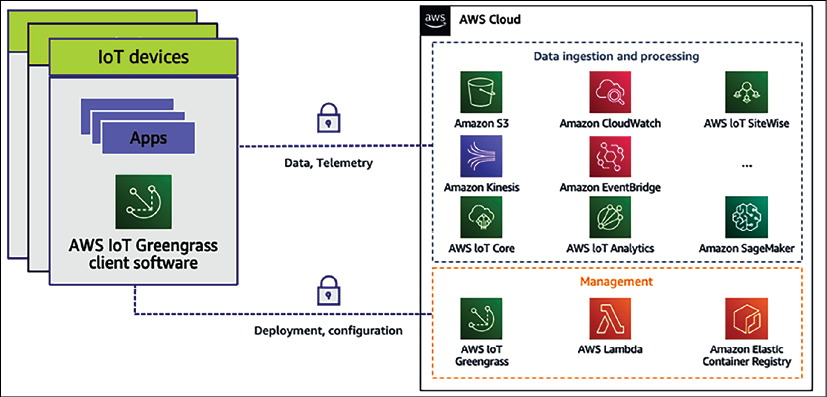

# 物联网架构

随着互联网连接的增加，到处都有越来越多的小型设备，它们的内存和计算能力都很小。这些传感器连接各种物理实体，例如你的家庭警报器、热传感器和汽车，并且需要收集和分析来自数百万个这些连接设备的数据。例如，从多个传感器收集的天气数据可用于预测风能和农业的天气。家庭、工厂、油井、医院、汽车和数以千计的其他地方有数十亿台联网设备，它们正在推动数字化转型，产生海量数据并呈指数级增长。

物联网 (**IoT**) 不仅仅是来自传感器和设备的数据集合。全面的物联网解决方案包括设备、本地数据收集和分析，以及用于收集、存储和分析数据的云服务。你需要与设备集成才能在没有互联网连接的情况下运行，并且当可以连接时，它们可以连接以报告数据和状态。

物联网解决方案需要设备连接和消息服务、车队管理和设备更新服务。他们需要确保设备和车队的安全，包括审计和异常检测；最重要的是，你应该对嘈杂和间歇性的物联网数据执行分析功能。要实时获得全部业务价值，你应该构建机器学习模型，然后将它们部署回设备以优化流程和结果。

在本章中，你将学习以下主题来处理和管理你连接的物联网设备：

- 什么是物联网？
- 物联网架构的组成部分
- 管理物联网设备
- 连接和控制物联网设备
- 对 IoT 数据执行分析
- 物联网在云端
- 构建工业物联网解决方案
- 实施数字孪生

到本章结束时，你将了解如何设计物联网解决方案架构。你将了解 IoT 解决方案的各个组成部分，包括设备管理、设备连接、设备安全以及通过分析和机器学习从 IoT 数据中获取见解。

## 什么是物联网？

想象一下，如果你知道一切的状态并且可以根据这些数据进行推理；你会解决什么问题？物联网就是要告诉各地一切事物的状态。物联网是指具有 IP 地址并连接到互联网的物理设备的网络生态系统。虽然 IoT 设备的数量正在成倍增加，但目前利用 IoT 设备的复杂性也随之增加。

你需要从 IoT 传感器获取数据，存储数据以通过流式传输进行分析，并快速提供结果。家庭、医疗机构、工厂、汽车和许多其他地方都有大量设备。你越来越需要解决方案来连接这些设备并收集、存储和分析设备数据以提高运营效率。

物联网解决方案使你能够从所有这些欺骗中收集数据并获得洞察力。物联网是人工智能/机器学习、机器人、视频分析、移动和语音等新兴技术的关键推动力。 IoT 是这些新兴技术的核心，因为访问设备数据对于训练机器学习模型、提供智能和提高业务效率至关重要。企业正在使用物联网解决多个工业用例，例如：

- **优化制造**：通过捕获机器性能数据，你可以提高工业流程的性能和生产率。通过预测性维护，你可以深入了解机器性能并在零件损坏之前更换它们。
- **医疗保健**：借助物联网，你可以随时随地为患者提供医疗保健服务。医生可以远程监控患者的健康状况，并在出现任何健康警报时采取行动。现在，每个人都在使用嵌入在 Apple Watch 和 Fitbit 等可穿戴设备中的健康应用程序，以更好地了解自己的健康状况，并直接与初级保健机构共享健康数据。
- **库存跟踪**：物联网有助于保持即时库存并优化仓库运营成本。你可以跟踪库存水平并自动下达补货订单。借助物联网传感器，你几乎可以自动化整个仓库操作，从接收到补货、包装和运输。
- **联网家庭**：使用智能开关、智能恒温器和智能相机等支持物联网的设备，你可以增强家庭、建筑物和城市的用户体验。你可以使用智能设备操作整个设施并优化容量，或者为家庭配备智能安全设备，以帮助你随时随地监控你的家庭。
- **农业**：这是人类生存的重要领域，用于湿度、天气和温度的物联网传感器正在帮助以更高的效率种植更健康的作物。你可以结合湿度传感器和天气预报的数据来确定何时给作物浇水。
- **能源效率**：你可以通过物联网更有效地管理能源资源，例如实时监控风电场和太阳能发电场的能源生产，并计划维护。
- **交通运输转型**：物联网正在通过联网和自动驾驶汽车帮助塑造交通运输的未来。你能看到的最流行的用例是特斯拉汽车，它配备了物联网传感器，并通过实时收集数千个数据点来支持完全的自动驾驶功能。
- **增强安全性**：物联网设备通过持续监控和在任何设备故障或安全事件发生之前发出警报以立即采取行动，有助于提高家庭、办公室和工厂车间的安全性。

物联网战略赋予企业构建新服务所需的智能，并随着时间的推移改进产品和服务，与客户建立更好的关系。数据驱动的纪律导致做出更快、更智能的决策，从而导致收入增长和更高的运营效率。借助物联网，组织要么变得更高效、成本更低，要么构建全新的服务和产品，从而推动新业务的发展。这些是任何物联网设备架构面临的一些最关键的挑战。除了数据收集和执行洞察之外，你还需要确保设备的安全和管理。让我们更多地了解物联网架构的各种属性。

## 物联网架构的组成部分

在上一节提到的用例中，组织拥有跨多个产品线的许多设备。他们需要一种架构来获取各种遥测测量值和属性，以支持用户和服务应用程序的实时消费。在高层次上，物联网架构由三个组件组成，如下图所示：

图 15.1：物联网架构周期

如上图所示，物联网架构周期包含三个要素：

1. **管理 IoT 设备软件**：要构建 IoT 解决方案，你需要部署大量设备，从数千到数百万不等。这些设备应该能够生成用例所需的数据，并根据需要在边缘执行操作。你需要弄清楚的第一件事是，我如何构建在边缘运行的设备？
2. **处理物联网设备连接和控制**：管理数百万台设备并保护它们是一项繁琐的任务。最重要的是，你希望它们使用最新的软件/固件进行更新，或者它们可能需要以不同的版本进行维护。你还需要分组以便于管理，并确保它们安全连接。你需要了解的第二件事是如何大规模控制、管理和保护你的设备。
3. **执行物联网分析服务**：部署并连接设备后，你需要收集高速到达的大量数据并获得洞察力以获取业务价值。
   在最后的行动中，你需要设计如何理解你的 IoT 数据并采取适当的行动。

所以现在，要构建物联网架构，你需要从上述架构层中回答三个问题。在深入研究架构时，你希望将可用技术选择的示例嵌入到上述每个元素中。让我们更详细地探讨物联网架构的第一个元素，以更深入地学习物联网设备软件管理。

### 管理物联网设备

谈到物联网设备，你想了解如何在边缘构建和操作智能设备软件。随着 Internet 可用性的提高，你可以找到几乎每个设备都配备了对微控制器或微处理器的支持。微控制器单元 (**MCU**) 是包含带存储器的简单处理器的单个芯片；它用于工业传感器、恒温器、智能开关和灯泡等设备。微控制器占所有已连接和可连接设备的 80% 以上。微处理器单元 (**MPU**) 可扩展边缘设备的计算和处理能力。它具有外部连接的内存和 I/O 组件；这些是功能更强大的设备，例如笔记本电脑、计算机、相机和路由器。现在让我们了解微控制器设备管理和连接。

#### 微控制器设备管理
对于基于微控制器的设备，FreeRTOS 是最流行的实时操作系统 (**RTOS**) 之一。 FreeRTOS 包括一个内核和一组适合所有行业部门使用的 IoT 库，可以轻松安全地将你的小型低功耗设备连接到更强大的边缘设备和网关。 FreeRTOS 有助于轻松对连接的基于微控制器的设备进行编程，并收集数据以发送进行分析，并在数百万台设备上扩展 IoT 应用程序。它有助于通过安全凭证和密钥管理确保边缘设备的安全，还通过传输层加密确保你的数据安全。

MCU 设备可以使用 MQTT Pub/Sub 消息传递或基于 HTTPS 的文件从云下载或上传到云存储以实现云连接以摄取和分析数据，从而连接到 AWS IoT Core。 MQTT 是用于物联网的 OASIS 标准消息传递协议。它是一种轻量级的发布/订阅消息传输，非常适合连接具有小代码占用空间和最小带宽的远程设备。 FreeRTOS 扩展了蜂窝 LTE 和 Wi-Fi 抽象层，这有助于在没有云连接的情况下继续通信、收集数据和采取行动。

FreeRTOS 为设备安全提供了一个 AWS IoT Device Defender 库，当这些指标偏离预期行为时，可以轻松报告设备端指标以检测异常。 Device Defender 还会持续审核与你的 FreeRTOS 设备关联的 IoT 配置，以确保它们符合安全最佳实践，例如审核和监控设备、报告 TCP 连接和检测异常。

FreeRTOS 完全受支持并与 AWS 云集成。 AWS 通过使用 AWS IoT 设备管理的集成代码签名支持 FreeRTOS 的完全集成固件更新服务，并支持无线 (**OTA**) 软件更新。 OTA 是物联网价值主张的关键部分，也是端到端安全解决方案的重要组成部分。

由于 MCU 设备功能更强大，并且能够将数据分析功能扩展到边缘，因此 AWS 提供了 IoT Greengrass 以将这些设备连接到 AWS 云。此外，FreeRTOS 提供方便的 API，可以轻松连接到 AWS Greengrass 设备。假设 Greengrass Core 设备失去与云的连接。在这种情况下，Greengrass 组中的 FreeRTOS 设备可以继续通过本地网络相互通信，因此即使连接断断续续，你的应用程序也可以继续运行。了解MPU设备管理，构建数据源附近的数据采集能力。

#### 微处理器设备管理
在中央位置收集物联网数据并执行分析以获得一些见解并不总是适用的。你需要在无法连接互联网的情况下(例如飞机、游轮或偏远地区)在边缘收集数据并在本地执行分析。当你因合规性或需要超快延迟而无法将数据存储在其他位置时，它也适用，例如在工厂车间管理机器人车队。在这种情况下，你的设备需要减少延迟、降低成本并提高边缘位置的法规遵从性。通常，MPU 设备是此类用例的首选，因为它们比 MCU 设备强大得多。它们还可以充当网关并在边缘管理多个 MCU 设备。

AWS 提供 IoT Greengrass，它有助于将 AWS 服务扩展到你的设备上，以在本地处理它们生成的数据，从而获得即时数据洞察力并采取行动。使用 Greengrass，设备无需将你的数据发送到遥远的云端；数据存储在本地，以毫秒为单位节省时间。此外，它还提供了仅将你需要的数据发送到云端的选择，从而降低了成本。当数据需要根据数据主权法保留在本地时，支持 Greengrass 的设备会继续路由本地消息，从而确保数据安全并保存在本地。

AWS IoT Greengrass 由两部分组成——物联网边缘运行时和云服务。在设备上使用 Greengrass 边缘运行时可帮助客户通过本地处理、数据管理和 ML 推理添加设备智能，并将其无缝连接到 AWS 云服务。

Greengrass 云服务允许客户跨设备群远程部署和管理物联网应用程序。以下是对 AWS 云中 IoT Greengrass 的预集成分析和 ML 服务的高级概述：

图 15.2：AWS IoT Greengrass 预集成 AWS 云服务

有时，物联网设备并不直接连接到云端。它们与本地的集线器或网关通信，然后连接到云。对于此类用例，Greengrass 边缘运行时可以安装在集线器或网关上，并帮助设备开发人员在其网关上构建、部署和管理物联网边缘应用程序。此外，网关能够为本地连接到网关的所有设备提供智能。

AWS Greengrass 在互联设备中嵌入本地 lambda 计算、本地消息传递、用于数据和状态同步的本地设备影子以及通信安全。 OTA 使安装更新版本的 Greengrass Core 更容易使用 AWS IoT Device Management 访问新功能、错误修复和安全增强功能。

最后，你要确保你的设备已连接并使用云 IoT 服务。 AWS 提供 IoT Device Tester，这是一种测试自动化应用程序，可让你在你选择的设备上测试 FreeRTOS 或 AWS IoT Greengrass。你可以测试 FreeRTOS 云连接、OTA 和安全库是否在 MCU 设备的微控制器板设备驱动程序之上正常运行。对于 MPU 设备，你可以测试设备的 CPU 架构、Linux 内核配置和驱动程序的组合是否适用于 AWS Greengrass。

现在，让我们详细了解架构设备连接和控制的第二个组成部分，以连接、管理和保护你的设备。

### 连接和控制物联网设备

如今，你拥有数以百万计的设备每秒生成数 GB 和 TB 的数据。所以下一个问题是，我如何安全地连接我的数据并处理它们大规模生成的数据？这不仅与数据摄取有关。你需要考虑其他因素，例如：

- **身份服务**：你需要识别服务来管理设备的授权并大规模提供唯一身份。 IoT Core 使你能够携带根 CA 和客户端证书，或让 IoT 平台为你生成证书。 IoT 平台需要支持 SigV4、X.509 和自定义身份验证，同时通过 IoT 策略提供细粒度的访问控制，直至 MQTT 主题级别。
- **设备网关**：将设备安全地连接到数据中心或云。数据网关应使用队列配置在首次连接时自动为大量设备提供唯一标识，并通过即时注册促进自动设备注册。数据网关应将设备安全地连接到云或数据中心以及其他大规模设备。对于连接可靠性，数据网关需要建立长期连接以通过 MQTT、WebSocket 或 HTTP 进行双向通信，并通过 TLS 1.2 相互身份验证进行安全通信。
- **消息代理**：处理数据消息并将其路由到数据中心或云。消息代理需要通过可扩展、低延迟和可靠的消息路由来路由来自 IoT 设备的数据。它需要为解耦的设备和应用程序提供发布/订阅，并促进双向消息流。 IoT 消息代理有助于随时了解和控制你的设备状态并保留离线设备的消息，并扩展了对 MQTT 服务质量(**QoS**) 消息传递的支持：
  - QoS 级别 0 最多意味着消息的一次性传递。它也称为即刻即弃，因为收件人不确认收货，因此无法保证送达。
  - QoS 级别 1 保证消息至少传递给接收方一次，但由于相同消息的重新传递，消息也可能被复制。
  - QoS 级别 2 是 MQTT 中最高级别的服务。它保证每条消息只被接收一次；然而，这是最慢的方法并且需要发送方和接收方之间的四次握手。
- **规则引擎**: 这会根据业务需要在你的设备上触发操作。规则引擎摄取大量数据，对其进行预处理，并将其提供给其他分析、报告和可视化服务。规则引擎需要具有用于数据转换的数学、字符串操作、日期等内置函数，并提供在路由到 ML 和分析的其他服务之前过滤数据的能力。
- **Device Shadow**: 这使得应用程序即使在离线时也能与设备交互，并有助于随时了解和控制你的设备状态。 Device Shadow 应该通过维护离线设备的最后已知状态来表示设备状态，例如灯泡的最后已知颜色是红色。 Device Shadow 应该根据应用程序的操作进行实时状态更改，并通过状态更改控制设备，例如，将灯泡的颜色更改为蓝色。一旦设备的连接建立起来，它就会自动同步。
- **设备注册**: 这会启用自动设备注册并帮助管理它们。设备注册表通过执行简单的搜索(例如哪些设备是 2016 年制造的？)或通过定义事物类型来定义和分类设备以便于使用；例如，BMW 和 Audi 属于 Car 事物类型，以实现跨设备的属性和策略标准化。为了进一步简化，你可以定义组，例如风力涡轮机中的传感器，以实现对运行作业和设置策略的更简单管理。最好使用提供上述所有服务的托管物联网平台，例如 AWS IoT Core。 AWS IoT Core 允许将任意数量的设备安全连接到云和其他设备，而无需你预置服务器。你可以路由、处理和处理来自连接设备的数据，并使你的应用程序能够与设备交互，即使它们处于离线状态。 IoT Core 提供 AWS 服务，通过分析、AI 和 ML 作为云生态系统的一部分在数据之上进行推理。
- **AWS IoT Device Management (DM)**: 有助于注册、组织、监控和远程管理不断增长的连接设备群。它使用批量注册来注册许多设备，将设备组织成组，执行 OTA 固件更新，并通过完全托管的 Web 应用程序促进所有物联网设备的端到端管理。
- **AWS IoT Device Defender (DD)**: 是一种完全托管的 IoT 安全服务，可促进持续保护一组连接的设备。它监控与设备和整个设备群相关的物联网资源，以发现可能表明存在潜在安全问题的异常行为。 Device Defender 在出现异常情况时发送警报，例如从设备到未经授权的 IP 地址的流量或出站流量的峰值，这可能表明设备正在参与 DDoS 攻击。最后，通过与 IoT Device Management 集成，IoT Device Defender 允许你采取纠正措施来保护你的设备。

AWS 提供 IoT Core、Device Managment 和 Device Defender，统称为 IoT 连接和控制服务，它们提供连接、管理和保护设备的能力。当你从数百万个 IoT 设备收集数据时，从数据中获取见解变得非常重要。让我们了解有关对 IoT 数据执行分析的技术的更多详细信息。

### 对 IoT 数据执行分析

物联网数据的分析具有挑战性，因为它不是通常由专为商业智能和网络分析设计的分析工具处理的高度结构化数据。相反，物联网数据来自连接到间歇性连接的移动机械上的传感器、Wi-Fi 或无线覆盖较差的控制器，或者信号丢失或减弱的许多其他地方。来自这些设备的数据经常会有明显的差距和错误的读数。此外，IoT 数据通常仅在来自外部来源的其他数据的上下文中才有意义。例如，农民需要用田间的预期降雨量来丰富湿度传感器数据，以确定何时给作物浇水。

传入的真实世界物联网数据需要通过与时间、位置和其他信息等其他数据相结合来丰富，这给企业带来了挑战。为了使他们的应用程序运行良好，他们经常需要设计自定义逻辑来清除错误读数、填补数据空白并使用上下文信息丰富数据。他们还需要在为他们的应用程序处理数据之前适当地存储过程数据。这需要自定义代码来构建、测试和维护，并增加 IoT 应用程序的处理成本。

你可以看到，物联网应用程序中有许多常见的数据管理和分析任务，包括处理和丰富数据、配置和分区数据库以及编写复杂的查询。随着设备的发展、车队规模的变化以及新的分析需求的出现，所有数据处理都需要不断发展。像 C3 IoT 这样的公司提供复杂的分析，而 AWS 等云供应商已经创建了 AWS IoT Analytics 等服务来大规模执行 IoT 数据分析。

AWS IoT Analytics 是一项托管服务，可大规模收集、预处理、丰富、存储、分析和可视化物联网设备数据。它允许你仅收集要存储的数据并将原始数据转换为有意义的信息。

大多数 IoT 数据都受时间戳限制，因此 AWS IoT Analytics 将设备数据存储在时间序列数据存储中以供分析，以更深入地了解资产的运行状况和性能并可视化你的 IoT 数据集。

总的来说，要设计你的物联网架构，你应该根据你的硬件选择、软件环境和用例为你的物联网项目选择合适的设备软件。如果你使用高度受限的设备，微控制器通常建议使用 FreeRTOS 和 IoT 设备 SDK。如果你拥有微处理器驱动的 IoT 设备，则可以使用 AWS IoT Greengrass。 Greengrass 使用预构建的处理和连接功能加速设备应用程序的开发，并在边缘远程部署和管理设备软件。

准备好设备后，你可以使用 AWS IoT Core、Device Management 和 Device Defender 连接和控制你的设备，并使用 AWS IoT 数据分析对收集的数据执行数据洞察。随着云正在成为大规模数据收集和分析的首选场所，我们将以领先的云提供商之一亚马逊网络服务提供的物联网服务为例。现在，让我们进一步了解云中的物联网。

## 物联网在云端

由于 IoT 解决方案可能很复杂且多维，因此你需要消除在企业中实施 IoT 的复杂性，并帮助客户安全地将任意数量的设备连接到中央服务器。在物联网方面，云提供商提供托管服务产品以实现对数百万设备的可扩展性。一些最流行的云 IoT 平台是 Google Cloud IoT、AWS IoT Core、Azure IoT Hub、IBM Watson IoT 和 Oracle IoT。让我们研究一下 AWS IoT 产品以了解 IoT 系统的工作原理，以及其他云提供商(例如 **GCP** 和 **Azure**)，它们具有相同的 IoT 产品。

AWS 云有助于随时处理和操作设备数据以及读取和设置设备状态。 AWS 提供可根据需要扩展的基础设施，因此组织可以深入了解其 IoT 数据，构建 IoT 应用程序和服务以更好地为客户服务，并帮助他们的业务全面开发 IoT。

下图说明了 AWS IoT 的组件：

图 15.3：AWS 平台上的物联网架构

以下是每个物联网组件的详细信息以及它们在上图中的连接方式：

- **IoT Greengrass**：AWS IoT Greengrass 安装在边缘设备上，有助于将 IoT 消息发送到 AWS 云。
- **IoT 设备 SDK**：AWS IoT 设备 SDK 有助于将 IoT 设备连接到你的应用程序。 IoT 设备 SDK 提供了一个 API，用于将设备连接到应用程序并对其进行身份验证。它有助于使用 MQTT 或 HTTP 协议在设备和 AWS IoT 云服务之间交换消息。物联网设备 SDK 支持 C、Arduino 和 JavaScript。
- **身份验证和授权**：AWS IoT 促进相互身份验证和加密，以便仅与授权设备交换数据。 AWS IoT 使用 SigV4 和 X.509 证书等身份验证机制。你可以通过附加证书和远程处理授权来将身份验证附加到所有连接的设备。
- **IoT 消息代理**：消息代理支持 MQTT 和 HTTP 协议，并在 IoT 设备和云服务(例如 **AWS IoT** 规则引擎、**Device Shadow** 和其他 **AWS** 服务)之间建立安全通信。
- **物联网规则引擎**：物联网规则引擎有助于管理物联网数据处理和分析的数据管道。规则引擎查看 IoT 数据以执行流分析并连接到其他 AWS 存储服务，例如 Amazon S3、DynamoDB 和 Elasticsearch。
- **Device Shadow 服务**：Device Shadow 服务可帮助你在设备因偏远地区失去网络连接而离线时保持设备状态。一旦设备上线，它就可以从 Device Shadow 恢复其状态。连接到设备的任何应用程序都可以通过使用 RESTful API 从影子中读取数据来继续工作。
- **设备注册表**：设备注册表有助于识别物联网设备，并有助于大规模管理数百万台设备。注册表存储设备元数据，例如版本、制造商和读取方法(例如，华氏度与摄氏度)。

到目前为止，你已经熟悉云中的 IoT 服务产品。随着物联网在制造业中处理机器数据和优化生产变得非常普遍，它开发了工业物联网 (IIoT) 的概念。现在让我们更多地了解这一点。

## 构建工业物联网解决方案

工业客户寻求深入了解他们的工业数据并实现诸如降低能源成本、检测和修复设备问题、发现生产线效率低下、提高产品质量和提高产量等成果。这些客户希望了解来自机器和产品生命周期 (**PLC**) 系统的运营技术 (**OT**) 数据，以便在生产线或机器出现故障时执行根本原因分析 (**RCA**)。此外，物联网通过实时了解机器的微停机，在不影响产品质量的情况下提高了生产吞吐量。

跨多个来源、站点或工厂的数据收集和组织在构建和维护方面具有挑战性。组织需要一致地表示其所有资产，这些资产可以轻松地与用户共享并用于在工厂、跨工厂和公司级别构建应用程序。使用本地服务器收集和组织的数据被隔离到一个工厂。由于缺乏开放和可访问的数据，大多数在本地收集的数据从未被分析和丢弃。

最佳实践是从工业设施中常见的数据库中提取数据，将其传输到数据中心或云中的集中存储，并将其结构化以方便用户和应用程序搜索。在这些数据之上，你可以得出通用的工业性能指标，例如整体设备效率 (**OEE**)，监控多个工业设施的运营，并构建应用程序来分析工业设备数据，防止代价高昂的设备问题，并减少生产差距。要设计工业物联网架构，你需要执行以下步骤：

- 从工业设备、数据服务器和历史数据库中获取数据
- 大规模收集、组织和分析工业数据
- 使用 OPC-UA、Modbus 和 Ethernet/IP 等工业协议和标准从现场设备读取数据
- 创建物理资产、处理设备数据流和计算工业性能指标的可视化表示
- 访问本地仪表板以查看实时和历史设备数据，即使暂时与互联网断开连接也是如此
- 使用资产数据创建本地或云应用程序，以优化工厂输出质量、最大化资产利用率并识别设备维护问题

为了满足对 IIOT 不断增长的需求，AWS 等领先的云提供商提供了一项托管服务 AWS IoT SiteWise，该服务使用本地网关从车间收集数据，对数据进行结构化和标记，并生成实时 KPI 和指标做出更好的数据驱动决策。

数据在摄取期间从所有站点的设备收集，并从 AWS IoT Core 发送到 AWS IoT SiteWise。然后它创建模型资产，这些模型资产是物理资产的虚拟表示。 SiteWise 有助于对整个生产环境进行数字化、情境化和建模，而客户无需维护其基础设施。客户可以使用丰富的信息建模来表示复杂的设备层次结构。

事件管理对于检测复杂工业系统中的变化至关重要。需要持续监控来自设备的数据以识别其状态、检测变化并在发生变化时触发适当的响应。 AWS 提供 AWS IoT Events，它构建简单的逻辑来评估传入的遥测数据，以检测设备或过程中的状态变化。它从数千个传感器的数据中检测事件并触发响应以优化操作。它不依赖于对零件、机器或产品的手动检查，而是可以更快地将问题通知维护团队或指示设备关闭。例如，你可以在设备运行异常或应用修复程序时提醒技术支持代表。

由于你使用逻辑表达式而不是复杂的代码配置 AWS IoT Events，因此可以轻松适应添加新设备等变化。你可以扩展到队列中的数千台设备。 AWS IoT Events 与处理和分析 IoT 数据的其他 AWS 服务集成，例如 AWS IoT Core 和 AWS IoT Analytics。客户可以直接从 AWS IoT Events 控制台识别和提取他们需要评估的数据。 IoT Events 可以触发 AWS Lambda、SQS、SNS、Kinesis Firehose、IoT Core 等中的操作。让我们看一下 IIoT 参考架构，以将所有部分组合在一起。

### 互联工厂物联网架构

互联工厂 (**CF**) 解决方案旨在汇集各种功能来转变制造运营。 CF 使客户可以轻松地从他们的遗留系统中解锁数据，近乎实时地可视化数据，执行更深入的分析以优化操作，并提高生产力和资产可用性。 CF 产品的重点是将工业数据收集商品化并提高可重复性。 让我们看下图，它展示了在 AWS 云平台上实施互联工厂解决方案的物联网架构。

图 15.4：AWS 云中的互联工厂架构

如上图所示，AWS IoT Greengrass 部署在工厂车间的边缘，用于收集设备数据和从工厂服务器提取的其他数据。数据通过IoT Core落地AWS云，IoT SiteWide帮助构建物理设备模型。来自各种设施的数据存储在 Amazon S3 中以构建一个制造数据湖，该数据湖可以进一步加载到 Redshift 中以进行数据仓库处理，并使用 AWS Glue 通过 ETL 管道进行处理，并使用 Amazon Athena 执行临时查询。最后，你可以使用 QuickSight 为业务用户可视化数据。

流数据通过 Amazon Kinesis 进行转换和处理，并向产品设备提供输入或向车辆提供装运信息。你还可以看到 ML 组件执行生产预测并将该数据发布到 ERP 和 PLM 系统中以优化生产效率。 Amazon SageMaker 在边缘执行 ML 以了解设备运行状况并发出警报以减少停机时间。

在培训员工使用设备和创建模拟时，添加可视化层很有意义。现在，随着 **AR/VR**(增强现实/虚拟现实)的出现，这成为可能。这就是数字孪生的用武之地。让我们了解有关数字孪生的更多详细信息。

### 实施数字孪生

数字双胞胎是物理机器的数字副本。在数字孪生中，你可以使用 AR/VR 构建机器的虚拟表示，以可视化实时数据叠加。它有助于查看实时操作和健康数据，并结合机器学习；你可以从现实世界的行为中汲取见解，例如执行主动维护模型。数字孪生可以方便地模拟假设场景以确定机器的最佳 KPI，并构建沉浸式教育和培训来处理设备。

数字双胞胎使用物联网不断收集实时数据，并可以从数字副本控制机器的运行。它提供了机器实时模型的身临其境的体验，并有助于早期预警、预测和优化。数字孪生执行以下任务，如下图所示：

图 15.5：使用数字孪生对机器的思维进行建模

如上图所示，数字孪生通过以下方式管理机器：

- **监控**：数字孪生通过在虚拟世界中复制数字副本来收集和分析数据。机器遥测数据可以来自云摄取的传感器，例如使用 AWS IoT Core 的 AWS。可以通过围绕本地应用程序构建 API 包装器来获取工厂车间数据。
- **分析**：要构建数字副本，你可以使用流行的 AR/VR 技术，例如 Microsoft HoloLens、Amazon Sumerian 或 Oculus。你可以在数字副本之上创建数据叠加层，以显示数据如何从各种传感器流出。可以使用 AWS IoT Analytics 执行进一步的分析。要构建数据可视化和搜索功能，你可以使用 Amazon OpenSearch 和 QuickSight。可以使用 Amazon Alexa 等人工智能服务通过语音控制数字孪生。 ML 功能可以使用 Amazon SageMaker 来训练、调整和部署 ML 模型来实现。
- **行动**：当你获得数据洞察力和预测时，你可以通过将消息发送回运营团队来采取所需的行动。你可以使用 AWS IoT Events 和 AWS Lambda 通过为现场员工创建自动维护票证来通知操作应用程序。 AWS IoT Core 可以获取你的消息并将直接操作应用于机器。如果冷却风扇运行异常或温度高于预期，你可以直接从数字孪生中停止机器。

让我们以飞机喷气发动机的数字孪生参考架构为例，如下图所示。在这里，你使用 IoT 传感器实时收集发动机温度和速度数据，并在数字发动机副本中显示数据叠加，以获得洞察力并采取行动。

图 15.6：飞机喷气发动机的数字孪生架构

如上图所示，温度和发动机转速数据通过 IoT Core 从喷气发动机发送到 AWS 云。 AWS IoT Analytics 执行数据处理以收集对收集的传感器数据的见解，并在 Amazon QuickSight 控制面板中可视化信息。喷气发动机的当前状态是使用 Device Shadow 维护的，因此如果传感器离线，你仍然可以执行模拟。在这里，喷气发动机数字副本是使用 Amazon Sumerian 虚拟现实平台创建的，并部署在 Oculus 中。使用 Amazon Lex AI 服务，你可以通过语音或消息启动/停止实际引擎。

物联网是一个非常庞大的主题，需要写一整本书。在本章中，你了解了具有工业用途的 IoT 架构的各种组件。

## 概括

有数以百万计的小型设备连接到互联网，统称为物联网。在本章中，你了解了 IoT 和 IoT 架构的组件。物联网就是要大量、高速地处理来自传感器和机器的非结构化遥测数据。要处理此类数据，你需要有一个可扩展的系统，并且你通过 AWS IoT 服务的示例了解了云中的 IoT。

在构建物联网解决方案时，设备是中心点之一。你了解了两种主要类型的设备软件，包括 MCU 和 MPU，以及获取这些设备数据的方法。你了解了用于控制 IoT 设备的各种技术，包括设备身份验证、设备注册表和大规模设备管理，以及 AWS IoT Device Management 服务。安全是最紧迫的工作，物联网设备也是如此；你了解了使用 AWS IoT Device Defender 管理和保护 IoT 设备的各种机制。

收集和存储数据后，你需要转换数据以深入了解该数据并可视化你的业务需求。你了解了云中可用于收集、处理和分析 IoT 数据以产生有意义的见解的各种组件。工业物联网在优化生产和减少运营停机时间方面正变得非常流行。你了解了 IIoT 以及 AWS IoT SiteWide 如何帮助大规模解决 IIoT 运营问题。你还详细了解了 Connect Factory IoT 架构及其功能。

将 AR/VR 技术与物联网相结合可提供身临其境的体验。你了解了数字双胞胎概念，即使用实时数据叠加创建物理机器的虚拟副本。你了解了具有不同组件的喷气发动机数字孪生架构，以使用数字孪生模型进行监控、分析和操作。

到目前为止，我们一直依靠配备大量 GPU 和 CPU 的超级计算机来解决大部分问题。但随着技术使用的增加，在需要数百万和数十亿组合来解决分子分析和建立金融风险模型等复杂用例中的问题的情况下，超级计算机变得越来越慢。对于此类用例，量子计算可能是理想的技术。我们仍处于量子演化的早期阶段，但组织已经开始对其进行试验。在下一章中，你将了解量子计算、它的用例和可用的选项。