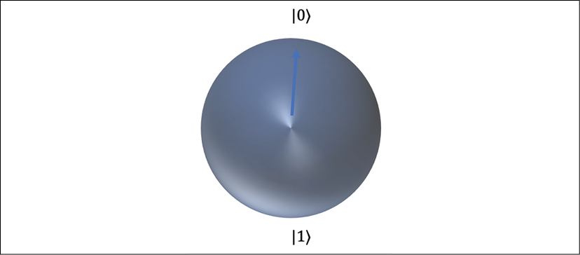
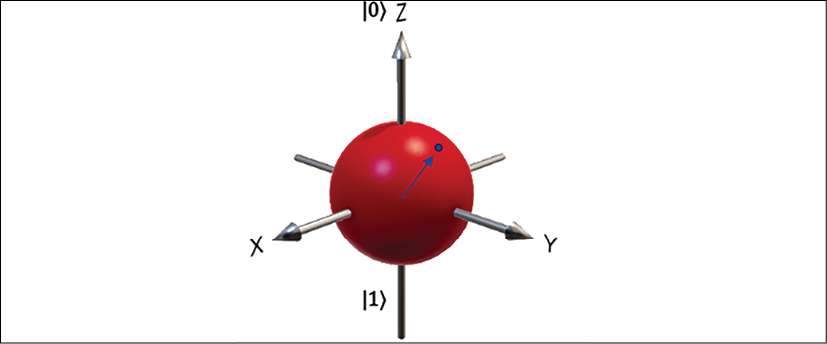
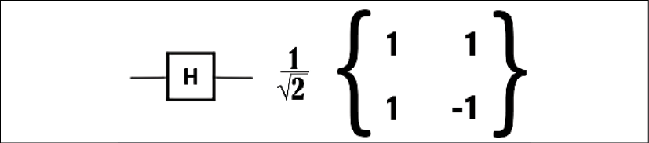
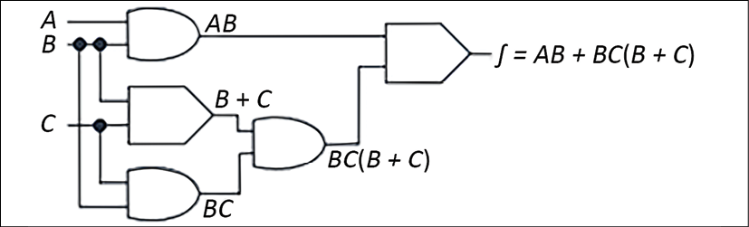
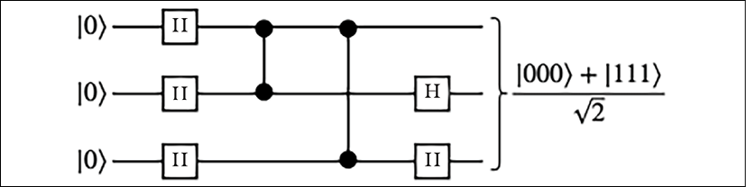

# 量子计算

量子技术是一个快速发展的跨学科科学与工程领域。到目前为止，我们一直依靠超级计算机来解决大多数问题，但量子计算 (**QC**) 以指数方式加速复杂计算，从而产生了非常强大的超级计算机。根据量子物理学，量子是任何物理属性的最小单位，指的是原子粒子的属性，例如电子、中微子和光子。 QC 可以利用量子力学定律以新的方式处理信息，从而解决经典计算机无法解决的计算问题。

QC 是一种新的计算范例，它可以加快解决复杂问题的速度，性能提升不是 10 倍，而是 10 倍。这种计算方法可以改变化学工程、材料科学、药物发现、金融投资组合优化和机器学习。

QC 还处于研究阶段，可能需要几年时间才能商业化。量子技术很复杂，但在本章中，你将通过探索以下主题以简化的方式学习 QC 概念：

- 量子计算机的构建块
- 量子计算机的工作机制
- 量子门
- 量子电路
- 量子计算机的类型
- 云中的量子计算

到本章结束时，你将了解 QC 的基础知识。你将了解量子计算机的工作原理，包括它们的构建块、类型和各种用例。你还将了解量子算法背后的逻辑，例如量子门和电路，以及量子计算机如何在幕后工作。

## 量子计算机的构建块

量子计算机的基本构建块是量子比特。 QC 中的量子比特类似于经典计算中的比特，但它们的行为却截然不同。让我们进一步了解量子位。

### 量子比特

经典位只能保持 0 或 1 的位置，但量子位可以保持 0 和 1 之间的位置，并且一次可以保持多个位置。量子比特是科学家和工程师可以控制的量子系统。量子比特的一些例子是原子、分子和光子。

量子态由小旗标"}"表示，称为狄拉克符号。 单个经典位由 0 或 1 表示，而单个量子位 (qubit) 由 |0> 和 |1> 的复杂线性组合表示。 量子比特是具有复系数的二维向量，如下图所示：：

图 16.1：布洛赫球体——量子比特的抽象表示

在上图中，使用 Bloch 球体表示一个量子位。 布洛赫球体是量子比特纯态空间的表示，以物理学家菲利克斯·布洛赫的名字命名。 蓝色箭头表示任何给定时间的量子位状态。 你可以看到图中用 |0> 和 |1> 表示的两种状态。 当表示为二维向量时，|0>和|1>的值为：

两个量子位的可能状态除了叠加之外还可以是基向量 |00>, |01>, |10>, |11>，这与两个经典位的可能状态相反，它们是 00 或 01 或 10 或 11。

量子计算机利用了量子物理学的独特行为，例如叠加和纠缠。让我们了解这些概念。

### 叠加

为了简化，让我们以经典的公平掷硬币为例来理解 QC 的各种概念。与经典计算机一样，抛硬币有 50-50 的机会给你正面或反面。 1 位有两个可能的值——我们可以假设正面为 1，反面为 0。量子计算机使用量子位来处理信息，1 个量子位代表一个量子态，它可以是抛硬币时的任何状态。想象一下，如果你能够同时看到一枚硬币的正面和反面，以及两者之间的每个状态：硬币将处于叠加状态。

量子比特本身不是很有用。但是，我们可以通过创建许多空间并将它们以称为叠加的状态连接起来来创建巨大的计算空间。在叠加态中，量子粒子代表所有可能状态的组合。它们会波动，直到被观察和测量。在这种情况下，如果同时抛50枚硬币，一个量子比特可以处于正面和反面的叠加状态，50个量子比特可以处于250种状态的任意叠加状态。现在你可以看到，一台只有 50 个量子比特的小型量子计算机可以存储 100 万亿个从 250 ~ 1,000,000,000,000,000 导出的复数。

现在你已经了解了量子位，让我们看看两个量子位如何通过量子纠缠协同工作。

### 纠缠

纠缠是量子粒子相互关联的能力。量子计算机可以通过在系统中纠缠更多的量子比特来计算呈指数级增长的更多信息并解决更复杂的问题。纠缠的量子位形成一个单一的系统，通过相互关联，得出相关性并得到结果。你可以使用一个量子位的测量结果得出关于其他量子位的结论。

量子纠缠允许随机行为的量子比特彼此完美相关。让我们通过比较经典位与量子位的属性，从下表中的编程角度理解纠缠。

|        |                经典计算机：将 X 位复制到 Y 位                |       量子计算机：纠缠 X 量子位和 Y 量子位        |
| :----: | :----------------------------------------------------------: | :-----------------------------------------------: |
| 相关性 |                     X位和Y位复制后不相关                     | X 量子比特和 Y 量子比特相关； 测量 X 会立即影响 Y |
|  引用  | 可以通过引用分配相同的数据，因此 X 位和 Y 位可以指向相同的数据 |      纠缠的量子比特单独存在，但它们相互关联       |
| 可逆性 |      这是不可逆的——将 X 复制回 Y 之类的逆向操作会破坏 Y      |    它是可逆的——纠缠的量子比特 X 和 Y 可以解开     |
|  纠错  |              对于纠错，可以从以前的副本中恢复位              |          量子纠错使用许多纠缠的量子比特           |

正如你在上表中看到的，纠缠不是复制。使用量子算法和量子纠缠，可以比使用经典计算机更有效地解决特定的复杂问题，因为你可以关联多个量子位来得出结论并利用它们来存储大值。一个量子比特数组可以使用叠加来一次表示 2^64 个可能的值，这使得量子计算机能够解决标准计算机无法解决的复杂问题。

现在你了解了 QC 的组成部分。让我们更多地探讨它们的工作机制以及是什么让它们如此之快。

## 量子计算机的工作机制

你在上一节中了解了量子位。现在，要构建量子计算机，物理量子比特是在实验室中构建的，而量子计算机有一个区域来容纳量子比特。

容纳量子比特的单元保持在刚好高于绝对零的温度，以最大化量子比特的相干性并减少干扰。低温有助于稳定和控制量子比特。真空室也可用于帮助最小化振动并稳定量子位。可以使用各种方法将信号发送到量子位，包括微波、激光和电压。

你一定想知道量子计算机如何运行得如此之快。量子计算机运行得如此之快，是因为它会并行尝试解决一个问题的所有答案。真的吗？好吧，不是真的，不是在平行宇宙中发生多重计算的意义上。也就是说，量子比特可以通过叠加同时保持0和1的值，并让它们通过纠缠相互影响。这为构建智能量子算法以加速计算开辟了新的可能性。

为了使量子计算机更快，一种被使用的有前途的量子算法称为 Grover 搜索。假设你需要从 N 项列表中找到一项。在经典计算机上，你平均必须检查 N/2 个项目，在最坏的情况下，你需要检查所有 N 个项目。在量子计算机上使用 Grover 搜索，你可以在检查大约 √N 个项目后找到该项目。这代表着处理效率的显着提高和时间的节省。例如，如果你想在 1 万亿的列表中找到一个项目，并且每个项目需要 1 微秒来检查，在经典超级计算机上搜索可能需要一周多的时间，但量子计算机可以在秒。

让我们用制作音乐来类比。当音乐家演奏优美的音乐时，他们通过对音乐和弦的声音进行造型来制作它，就像量子计算机通过操纵状态向量的振幅来工作一样。要写一首歌，你要弄清楚你需要什么音符，然后把它们放在一起编曲；以同样的方式，要对量子计算机进行编程，你需要将量子位排列到量子电路中并运行该电路。最后，当你制作音乐时，你的乐队会聚在一起并以听起来不错的方式演奏乐器；以同样的方式，你设置量子电路，使给出的答案是最有可能的。

与经典计算机相比，量子计算机可以创建巨大的多维空间来表示非常大的问题。量子算法然后在这个空间中找到解决方案并将它们转换回我们可以使用和理解的形式。由于叠加，量子比特本征行为中的量子干涉会影响它崩溃的概率。量子计算机的设计和制造旨在尽可能降低噪音并确保最准确的结果。量子逻辑由各种类型的逻辑门构建。让我们了解有关构建量子逻辑的更多细节。

### 量子门

无论是经典门还是量子门，逻辑门都是采用一组二进制输入(1 和 0 或自旋向上/自旋向下电子)并给出单个二进制输出的任何物理结构或系统：1(即自旋向上电子)，或两种叠加态之一。决定结果的是布尔函数。你可以将布尔函数视为响应是/否问题的规则。门被组合成电路，而电路又被组合成 CPU 或其他计算组件。

为了更好地理解门，让我们看看 3D 空间中的 Bloch 球体，它表示量子粒子(例如电子的自旋)沿相应轴的方向。你在上一个主题量子计算机的构建块中了解了 Bloch 球体。

图 16.2：电子自旋及其轴的 3D 表示

上图表示 3D 空间中的一个量子比特；可以使用量子门将量子比特置于沿 X、Y 和 Z 轴的自旋向上状态。量子门在量子位上运行，而不是在 0 或 1 位上运行的经典门，这使得量子门可以使用叠加(0 和 1 之间的其他状态)和纠缠(关联两个量子位来驱动结果)。

许多类型的门被用来构建量子电路，最简单的一种是单量子位泡利门。让我们进一步了解泡利门。

#### Pauli 门
Pauli 门以 Wolfgang Pauli 的名字命名，它基于更为人熟知的 Pauli 矩阵。

泡利门对于计算单个电子自旋的变化非常有用。今天的量子门使用电子自旋作为量子位的首选属性。泡利门一次只作用于一个量子比特。这转化为每个只有 4 个元素的简单 2 x 2 矩阵。泡利门分为三种类型：泡利-X、泡利-Y 和泡利-Z。

泡利-X 门：泡利-X 门与经典非门相关，通常称为量子非门。以下表示它：

图 16.3：Pauli-X 门

现在，如果你采用单个量子位向量的线性状态并将其传递给 Pauli-X 门，它将翻转到另一侧，例如，从 |0> 到 |1>，反之亦然。

Pauli-Y 门：这看起来很像 X 门，但用 i(-1 的平方根)代替左下角的 1 和负 i 在右上角。以下表示它：

图 16.4：Pauli-Y 门

当电子形式的量子比特通过 Y 门时，它会旋转到 3D 空间中的 Y 轴。

Pauli-Z 门：这看起来有点像 X 门的镜像，但在右下角有一个负号。以下表示它：

图 16.5：Pauli-Z 门

当电子形式的量子比特通过 Z 门时，它会翻转到 3D 空间中的 Z 轴。

Y 门和 Z 门也会改变量子位电子的自旋。但让我们看看另一个非常重要的门，Hadamard，你会在任何量子电路中看到它。

#### 阿达玛门
Hadamard也被称为H-gate，它在QC中无处不在。 Hadamard 门具有转换量子位的确定量子态的量子能力，例如同时自旋向上和自旋向下的叠加。以下表示它：

图 16.6：阿达玛门

一旦你发送一个电子通过 H 门，它就会像半空中的硬币一样；以 50/50 的赔率，它在着陆时最终会出现正面或反面。 H 门对于在量子程序中执行初始计算非常有用，因为它将初始化的量子位转换回它们的自然流体状态以利用它们的全部量子功率。 H 门映射 X->Z 和 Z->X，因为它同时在两个状态之间运行，因此需要 H 门来进行叠加。

还有几个量子门。让我们探索一些流行的门。

#### 其他量子门
你一定会使用许多其他量子门。虽然一些门在单个量子位上运行，但其他门同时在多个量子位上运行。让我们看一下在单个量子位上运行的更多门，可以将其可视化为围绕 Bloch 球体的变换：

- **X-Gate**：也称为翻转位，它围绕 X 轴执行 Pi 旋转，更改 Z -> -Z，如果完成两次则再次返回。
- **Z-Gate**：也称为相位翻转，它围绕 Z 轴执行 Pi 旋转，改变 X -> -X，如果完成两次则再次返回。
- **S-Gate**：这会围绕 Z 轴执行 Pi/2 旋转并映射 X -> Y。此门进一步扩展 H 门以进行复杂的叠加。
- **S'-Gate**：这是 S-gate 和映射 X -> -Y 的逆向。 它围绕 Z 轴执行 -Pi/2 - 旋转。
- **T-Gate**：这会围绕 Z 轴执行 Pi/4 旋转。
- **T'-Gate**：这是 T 门的倒数，并围绕 Z 轴执行 -Pi/4 旋转。

其他一些流行的门是 Toffoli 门、Fredkin 门、NOT 门平方根、Deutsch 门、交换门(和交换门平方根)、受控非门 (C-NOT)、和其他受控门。但我们不会探索所有的大门；我们已经介绍了上面的主要内容。你已经了解了所有基本门，所以让我们看看如何将它们组合在一起并构建量子电路。

### 量子电路

现在你已经了解了一些基本的量子门，所以下一个问题是如何执行量子逻辑。要构建量子算法，你需要使用控制良好的量子位进行计算。这些量子比特可以根据需要相互作用和改变状态。通过使用量子门(矩阵)操纵量子态(向量)来构建算法。让我们看一下具有三个输入的经典计算机中的布尔电路。

图 16.7：布尔电路中的运算

在上图中，你有多个布尔门的组合，其中一个与门将两个输入相乘，结果是 A & B->AB 和 B & C->BC。此外，或门将两个输入相加，导致 B & C->B + C。你可以看到，通过将这些门连接在一个电路中，已经构建了一个算法。

这就是经典计算机的工作方式。现在，让我们看一下下图中的量子电路，你可以将其与上面的布尔电路进行比较：

图 16.8：量子电路中的操作

在上图中，你传递了三个具有零向量状态的量子位。它们通过 H 门并改变状态以在一些进一步的步骤过程中创建叠加(我们在这里避免细节，因为它超出了本章的范围来解释量子算法的全部复杂性)，导致在两个同样可能的最终测量结果之一中，[000] 和 [111]，每个都超过 2 的平方根，如图 16.6 所示。

基本量子电路由三个基本模块组成：

- **初始化**：准备初始状态
- **执行**：在量子位上执行酉门
- 这是 T 门的倒数，并围绕 Z 轴执行 -Pi/4 旋转。：在一些参考基础上测量量子比特

在这里，在量子电路中，数字布尔电路问题被分解为几个基本构建块的序列：上一节中提到的一组通用门和实现容错的纠错过程。越来越多的量子算法，例如：

- **数论**：因式分解、离散对数、子集求和和密码分析
- **优化**：约束满足、求解线性系统、求解 ODE、PDE
- **神谕**：搜索、隐藏子组、隐藏移位、查找顺序
- **模拟/近似**：结不变量、QAOA、SDP、直接模拟

我们不打算深入算法的细节，因为这是一个非常广泛的话题。这些算法通常与用例无关，QC 可用于任何核心问题之一的应用程序。当我们拥有通用的容错量子计算机时，这些算法将很有帮助。在本节中，我们解释了量子计算机的基本构建模块，以了解未来十年的未来趋势。

量子计算机处于非常早期的阶段，还有很多需要探索的地方。如果你的组织的问题需要高级计算和存储超出经典计算机限制的大值，例如一次计算数万亿个数字，你将只希望使用此类计算机。

你看过基于门控的 QC；另一种类型的 QC 称为量子退火。在量子退火中，量子操作是模拟的，而不是基于门的数字操作。这些是更复杂和专用的优化机器。量子退火用于通过找到问题的基态或系统的零点能量来编码优化问题的解决方案。

让我们进入现实世界，看看可用的量子计算机硬件类型。

## 量子计算机的类型

正如你在上一节中了解到的，有两种 QC 范式。第一个是基于门的使用量子计算机，为通用设备提供更少、更高质量的量子比特。大多数量子计算机都是基于门的，例如 Rigetti 和 IonQ。

第二种 QC 范式涉及具有许多为特殊目的而构建的量子比特的量子退火炉。 D-Wave 构建的量子计算机基于量子退火。 D-Wave 提供高达 2,000 量子比特的量子计算机。让我们根据所使用的不同类型的粒子来看一些量子计算机：

- 俘获离子：第一个量子逻辑门于 1995 年使用俘获原子离子进行了演示。它使用离子的两种内部状态，其位置由"离子阱"中的电场控制，作为它们的基本量子元素。使用受控的微波辐射可以改变每个离子的状态。可以安排这些脉冲以耦合两个或多个离子的状态以在离子之间产生纠缠。
- 里德堡原子：这类似于俘获离子 QC，但使用中性原子代替量子位的带电离子。激光镊子用于将粒子固定到位，而不是电场。与俘获离子量子位一样，光学和微波脉冲用于量子位操作。与俘获离子相比，它的不同之处在于它具有构建多维阵列的潜力。
- 超导量子位：这被认为是用于数字量子计算和量子退火的量子位模态的前沿。微波辐射用于操纵状态。
  相邻的量子粒子可以电子耦合在一起以产生纠缠态。例如，由于电子电荷或磁通量的量子化状态，它们表现出量子化的能级。

随着 QC 获得越来越多的关注，AWS、谷歌、微软 Azure 和 IBM 等公共云提供商已经开始通过其云平台提供对量子计算机的轻松访问。让我们了解 QC 有用的一些现实生活用例。

## 现实生活中的量子计算

量子计算机是专用量子系统的集合，可以在一段时间内系统地控制这些系统以执行所需的任务。 QC 不是当前计算机的替代品，可能无法解决不需要复杂计算的问题。作为类比，你可以将灯泡与烛光视为等同于 QC 与当前计算机。你在蜡烛上投入多少并不重要；你不能把蜡烛变成灯泡——它们是完全不同的技术。

让我们以选择 15 人的座位安排为例。乍一看，它可能看起来很简单，但如果你计算一下，就有超过 1.3 万亿(15 的阶乘)种可能的方式来容纳 15 个人。想象一下，如果你需要为 100 个人解决这个问题：你将耗尽内存和计算能力。经典的超级计算机没有工作内存来保存现实世界问题的无数组合。它们的设计方式意味着它们将花费很长时间，一个接一个地分析每个组合。

同样，想想其他现实世界的问题，比如亚马逊是否要优化司机在 100 个城市的路线以找到快速送货的最佳路线。另一个用例是，如果一家制药公司想要通过模拟分子来更好地了解药物相互作用来构建药物再利用平台。由于需要大量的计算，这些问题很难用经典的计算机技术来解决。

QC 可以解决的其他一些实时用例包括：

- 优化：优化可能是一个非常复杂的过程，涉及在数百万和数十亿的组合中找到正确的解决方案。你可以优化产品质量、成本和效率。通过量子算法解决复杂的优化问题有助于我们更好地管理复杂问题，例如飞机登机口分配、包裹递送、交通控制和能源存储。
- 机器学习：即使使用经典计算机，机器学习也已经在帮助商业和科学。然而，训练机器学习模型的成本相对较高，阻碍了该领域的发展范围和能力。量子计算机可以通过更快的训练和更大量的数据帮助加快这一领域的进步。
- 互联网搜索：互联网搜索是你需要优化和索引数万亿条信息的另一个领域。 QC 可以帮助更快地搜索大量甚至无限量的数据。
- 模拟：量子计算机非常适合在其计算中对其他系统进行建模。他们可以处理会使经典计算机不堪重负的复杂系统。我们可以建模的量子系统示例包括药物模拟、光合作用、超导性和复杂的分子结构。
- 密码学：使用 RSA 的经典密码学取决于整数分解或离散对数的难处理性。使用量子计算机可以更有效地解决加密和解密问题。

QC 的工作方式与传统计算机截然不同。现在你已经了解了一些 QC 用例，让我们了解有关量子计算机构建块的更多详细信息。

## 云中的量子计算

与任何其他技术一样，公共云提供商有助于轻松访问 QC。采购量子计算机的成本非常高，而且还处于非常初级的阶段，短期内可能看不到投资回报。但是你不想错过公共汽车；你想踏上这项即将到来的技术的大门，这项技术有可能改变我们今天所看到的世界。公共云是访问量子计算机和试用你的用例的理想场所。

Amazon Web Services 提供称为 Amazon Braket 的 QC 服务。 AWS 没有量子计算机，但他们通过他们的平台提供对其他基于门和基于退火的量子计算机的访问。 AWS 通过其 Braket 平台提供对 D-Wave 的 Advantage 和 2,000 台量子位计算机、IonQ 和 Rigetti 量子计算机的访问。 Amazon Braket 提供了一个与硬件无关的量子平台，在 AWS 云中具有可扩展的电路模拟器，并与 AWS 云服务进行端到端集成。同样，Azure Quantum 也通过合作伙伴网络运营。

Google Quantum AI 提供对基于具有 54 个量子位的 Sycamore 处理器的超导体量子计算机的访问。它具有基于单量子位和双量子位的电路。 Google 提供了一个名为 Cirq 的 Python 框架来构建和优化量子电路。他们的韦伯量子计算机是 53 个量子比特。

IBM 的量子计算机基于超导体。 IBM 使用超流体将其超导体冷却到绝对零以上百分之一摄氏度左右。电子通过超导体后，它们配对成称为库珀对的东西，它们通过称为约瑟夫森结的东西进行量子隧穿。这些是超导量子比特。通过向量子比特发射光子，我们可以控制它的行为并让它保持、改变和读出信息。 IBM 通过创建许多量子位并以叠加状态连接它们，使用可编程门创建了巨大的计算空间。最后，量子纠缠允许随机行为的量子比特彼此完美相关。使用利用量子纠缠的量子算法，可以比在经典计算机上更有效地解决特定的复杂问题。

QC 是一个非常复杂和广泛的话题。我们现在还在触及表面，未来还有更多的事情要做。可能还需要十年时间才能充分发挥量子计算机的潜力，并构建出稳健、容错的量子计算机。然而，本章应该让你了解这场潜在的下一次技术革命，以及解决迄今为止看似不可能的复杂未来问题的可能性，例如太空旅行和人类基因组解码。

## 概括

QC 有很大的潜力来解决即使是最强大的超级计算机也无法解决的复杂问题。现在世界已经开始构建量子计算机和算法，而我们只是触及皮毛，可能还需要 5 到 10 年的时间才能开始实现商业价值。

在本章中，你了解了 QC 以及 QC 可以发挥优势的一些实际用例。 QC 不是所有问题的答案，它只适用于经典计算机无法工作的复杂计算。

你了解了量子计算机的关键构建模块——量子比特，以及多个量子比特如何在叠加和纠缠状态下协同工作以解决复杂问题。你了解了量子计算机的工作机制，并理解了为什么它们比经典计算机更快。

要对量子位执行操作，你了解了 QC 门，例如适用于单个量子位的 Pauli 门和 Hadamard 门，以及其他门。你还了解了量子退火，这是一种基于模拟而非数字门的不同范例。此外，你将这些门放在一起，并了解与经典布尔电路相比 QC 电路的工作原理。

最后，你了解了各种类型的量子计算机及其背后的技术。

你还了解了 D-Wave、Rigetti 和 IonQ 等量子计算机供应商。你了解了 Amazon Braket 平台，该平台以即用即付模式提供对多台量子计算机的轻松访问。你了解了如何在 IBM 量子计算机和 Google 量子处理器上工作。

虽然在本章中我们展望了遥远的未来，但许多遗留工作负载企业正在努力实现现代化。随着时间的推移，组织往往会积累技术债务，许多遗留应用程序都位于数据中心，从而产生成本并消耗资源。在下一章中，你将了解遗留应用程序的转换和现代化。你将了解遗留系统的挑战以及用于使它们现代化的技术。