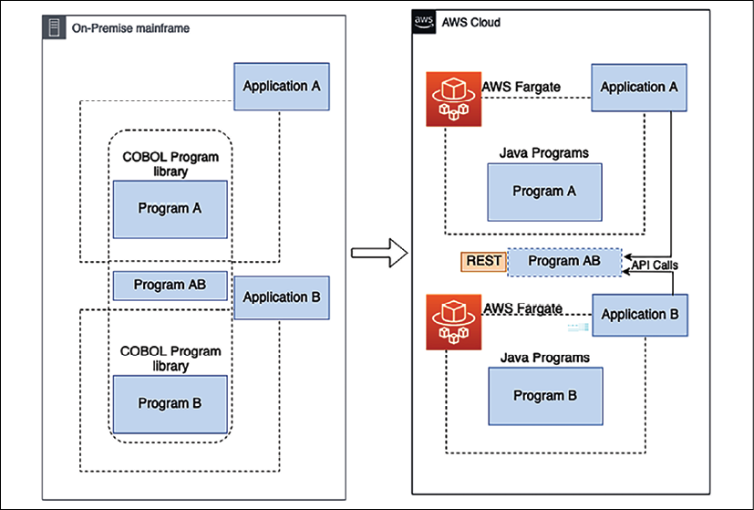

# 重构遗留系统

当今的组织在充满挑战的环境中运作。变化的速度是前所未有的。监管机构和机构正在实施新的报告和安全要求，新技术正在颠覆消费者的期望和认知，随着新参与者进入市场，生态系统也在不断发展。因此，组织正在重新定义其业务模型，以提供吸引人才、保持竞争力和发展所需的以客户为中心、敏捷性和技术。

应用程序现代化已成为这些新业务模型的关键组成部分，可以快速建立开发/测试环境、试验新想法，然后开发新产品和服务。除了无需投资昂贵且繁琐的基础设施外，新系统还通过其提供的广泛技术支持创新。

遗留系统是已经在你的数据中心部署了几十年而没有进行太多更改的应用程序。在瞬息万变的技术环境中，这些系统会过时并且难以维护。遗留系统的定义是它们的年龄以及由于底层架构和技术而无法满足不断增长的业务需求。

通常，大型企业处理遗留应用程序以运行关键的日常业务任务。这些遗留系统分布在医疗、金融、交通、制造和供应链等行业。公司必须在这些系统的维护和支持上投入大量资金，这就需要构建遗留系统。

重新构建和现代化遗留应用程序有助于组织更加敏捷和创新，并优化成本和性能。

在本章中，你将了解遗留应用程序的挑战和问题以及重构它们的技术。重写复杂的遗留应用程序可能会带来额外的业务中断风险，因此你将了解重构应用程序或考虑迁移到更灵活的基础架构的选项。本章将涵盖以下主题：

- 了解遗留系统的挑战
- 确定系统现代化战略
- 审视遗留系统现代化技术
- 为遗留系统定义云迁移策略
- 使用公共云进行大型机迁移

到本章结束时，你将了解遗留系统的各种挑战和现代化驱动因素。你将学习用于遗留系统现代化的各种策略和技术。随着公共云成为许多组织的首选战略，你还将了解遗留系统的云迁移。

## 了解遗留系统的挑战

遗留应用程序对组织提出了重大挑战。 一方面，组织已经使用了数十年的关键应用程序。 另一方面，遗留应用程序阻碍了组织的创新步伐。

在竞争激烈的环境中，最终用户正在寻找最现代、技术最先进的应用程序。 所有新功能通常都随最新软件一起提供，而遗留应用程序限制了你添加这些功能和使最终用户受益的能力。 下图显示了组织在遗留系统方面面临的一些重大挑战：

图 17.1：遗留系统的挑战

在顶层，CIO 拥有代表组织业务流程的应用程序组合。应用程序组合可以从数百到数千不等，具体取决于组织的规模。大型企业有四种可辨别的决策模式：

- **首席信息官 (CIO)**：CIO 负责业务应用程序决策。在这里，决策是在内部制定的，以使旧应用程序现代化或优先使用 SaaS。共同的优先事项是消费者体验/用户体验和供应链。
- **首席安全官 (CSO)**：当 CIO 做出应用程序优先级决策时，这些应用程序的转型或现代化会推动安全模型的现代化。这意味着彻底重新审视旧的本地安全方法，从硬件设备转移到云，并与拥有云世界安全方法的第三方软件供应商合作。
- **大数据副总裁**：他们以前所未有的方式接收数据流。可能性更加灵活和可扩展，以至于许多公司将大数据作为开发人员生产力之后使用公共云的第二个驱动因素。
- **基础设施和运营副总裁**：他们必须经历大量的流程和人员技能变化，因为这个团队必须采用新工具，放弃旧工具，并转移到 ITSM 和 DevSecOps 的混合世界，以使用跨无服务器的新工具开发新的现代化应用程序、容器和 SaaS。该团队正在以多产的速度对其软件工具进行现代化改造，但也面临着降低成本同时提高敏捷性的压力。

在我们深入研究解决方案之前，清楚地了解问题很重要。让我们更深入地探索遗留系统的挑战，以便更好地理解它们。

### 难以跟上用户需求

以客户为中心是企业成功的关键，无法跟上最新的技术趋势可能会对企业造成重大损害。可以拿曾经引领全球手机市场的诺基亚为例。近十年前，随着智能手机开始发挥作用，诺基亚仍然坚持使用遗留系统，导致几近破产。柯达公司的情况与此类似——柯达公司是相机行业最大的企业之一。柯达无法跟上数字创新并将其纳入其系统，导致柯达在 2012 年破产。这样的大型企业因缺乏遗留现代化和创新而无法生存的例子不胜枚举。

在当今技术日新月异、竞争激烈的大环境下，用户的要求非常高。现在，组织必须根据用户的条款进行更改，因为他们有多种选择。随着技术的发展，用户也随之发展并开始使用最新和流行的应用程序。如果你的竞争对手提供用户需要的新功能，他们就可以领先一步。

遗留系统还对具有内部用户群的企业应用程序提出了挑战。建立在大型机上的旧系统主要使用命令行，这在数字时代不是用户友好的。相比之下，新一代员工需要一种更加人性化的方法来执行他们的日常任务。但是，你可能会面临来自管理层的巨大阻力，他们可能已经使用遗留系统数十年并且已经习惯了它们。

大型企业的核心技术往往已经过时，并且包含可追溯到几十年前的系统。在为客户提供现代体验方面，在遗留本地技术上运行核心系统的组织面临着严峻的挑战。许多系统是多次合并和收购的产物，导致数据孤岛破裂、基础设施成本过高和开发时间缓慢。这会造成低效的处理和决策制定、缺乏业务敏捷性、糟糕的客户响应能力以及高昂的维护成本。在这些情况下，IT 很难满足内部利益相关者和客户的现代需求。

### 更高的维护和更新成本

由于遗留系统已经全部建立并运行了几十年，因此它们看起来可能更便宜。但随着时间的推移，总拥有成本变得更高，因为对旧系统的支持和更新通常成本更高。

通常，这些更新不是开箱即用的，并且需要大量手动解决方法来维护系统。大多数遗留系统都不是很适合自动化，因此需要更多的人力。

遗留系统大多有大量的专有软件，这会导致高得多的许可费用。除此之外，旧软件不再获得供应商的支持，并且在生命周期之外购买额外的支持可能非常昂贵。另一方面，现代系统主要采用开源技术来降低成本。遗留系统的运营中断可能需要更多时间并推高运营费用。具备维护遗留系统(如 DB2、COBOL、Fortran、Delphi 和 Perl)技能的人员很难找到，这会显着增加招聘成本和系统风险。

遗留系统在代码方面非常重要。未使用的代码为系统增加了另一层不必要的维护和复杂性。遗留应用程序已经运行了几十年，随着时间的推移，许多更改将在没有清理代码的情况下进行，这相当于大量的技术债务。由于未知的影响和依赖性，任何减少技术债务的举措都可能存在风险。结果，组织被迫投资于不必要的代码和系统维护，因为他们担心进行任何重大更改会破坏系统。

然而，由于未知的依赖性和中断，对遗留系统进行现代化改造可能代价高昂。在决定进行现代化改造时，需要仔细考虑成本效益分析 (**CBA**) 并确定投资回报 (**ROI**)。由于利益相关者看不到现代化的直接好处，因此为遗留现代化采购资金可能具有挑战性。

### 缺乏技能和文件

传统技术(例如大型机)具有多个相互依赖的复杂组件。它们是广泛的专有且昂贵的服务器，如果有人想自己培养技能，则这些服务器不容易获得。保留应用程序开发资源具有挑战性，雇用具有旧技术和操作系统实践经验的人员更具挑战性。

通常，遗留系统已有两年或更长时间的历史，并且大多数具有管理它们的相关技能的员工已经退休。此外，这些系统可能没有文档来记录多年的工作。随着旧劳动力与新劳动力轮换，可能会出现大量知识流失。缺乏知识会导致由于未知的依赖关系而更改系统的风险。由于系统复杂性和技能短缺，任何小的功能请求都很难满足。

大数据、机器学习和物联网 (**IoT**) 等新的前沿技术建立在新的技术平台上。由于新技术没有与遗留系统很好地集成，如果组织不能使用新兴技术的全部功能，它可能会输给竞争对手。现代系统有助于将组织品牌打造为创新型公司，大多数新一代员工都希望在其中工作。开发和培训是遗留技术的一个更重要的支出来源。

通常，自动化有助于通过减少人力来降低成本。现代系统中有许多工具可用于构建自动化，例如 DevOps 管道、代码审查和自动化测试，而遗留系统可能无法利用这些工具，从而导致额外成本。

### 容易受到公司安全问题的影响

安全是任何组织和系统的首要任务。由于缺乏供应商支持，在旧操作系统(例如 Windows XP 或 Windows 2008)上运行的遗留应用程序容易受到安全问题的影响。软件供应商不断确定新的安全威胁并发布补丁以将它们容纳在最新的软件版本中以保护它们。供应商宣布生命周期结束 (**EOL**) 的任何遗留软件都不会获得新的安全补丁，这会使你的应用程序在旧软件版本中运行，暴露于多种安全威胁。

遗留应用程序通常会忽略系统健康检查，这使得它们更容易受到安全攻击。技能差距使得难以提供持续的支持和帮助，这意味着系统以不安全的方式运行。单个漏洞可能会导致将你的应用程序、数据库和关键信息暴露给攻击者的高风险。

除了安全漏洞之外，遗留应用程序由于合规性而难以维护。随着合规性随着时间的推移不断变化以在数据处理和使用方面实施更严格的安全性，遗留系统需要进行更改以符合本地治理和合规性需求。

例如，欧盟新的通用数据保护条例 (**GDPR**) 合规要求每个系统都允许用户请求删除他们的数据。虽然现代系统可以以自动化和自助服务的方式提供这些开箱即用的功能，但这可能需要手动执行，并且在遗留系统中变得更加复杂。

坚持合规性需求可能会导致更多的运营成本和耗时的维护。

### 与其他系统不兼容

除了最终用户，每个系统都需要与其他 IT 系统集成。这些系统可能与不同的部门、客户、合作伙伴或供应商相关联。各种系统需要以不断发展的标准格式交换数据。几乎每隔几年，文件和数据格式标准就会更改以提高数据交换效率，大多数系统都需要更改才能采用它们。坚持使用旧格式的难以更改的遗留系统可能会导致系统不兼容以及你的供应商和合作伙伴可能不想使用的系统。由于复杂的解决方法和生产力损失，无法满足标准需求会给企业带来重大风险。

为简单的业务需求添加变通方法可能会使系统更加复杂。现代系统建立在面向服务的架构之上，通过独立添加新服务可以更轻松地适应任何新需求。旧系统通常采用单体架构构建，添加任何新功能都意味着你需要重建和测试整个系统。

现代架构是面向 API 的，可以轻松地与其他系统集成以减轻繁重的工作。例如，出租车预订应用程序使用 Google 地图进行全球定位系统 (**GPS**) 导航，或使用 Facebook 和 Twitter 进行用户身份验证。缺少 API 使得这些集成在遗留系统中变得更加困难，从而导致复杂的自定义代码。

随着另一个依赖的上游系统的负载增加，遗留应用程序可能面临可伸缩性问题。通常，遗留应用程序是用单体架构构建的，并且依赖于硬件。可扩展性是单体系统的一大挑战，因为由于硬件依赖性和垂直扩展受最大系统容量的限制，它无法水平扩展。将单体应用程序分解为微服务有助于应对扩展挑战并跟上负载。

除了软件维护之外，遗留应用程序在特定版本上运行时，对于硬件基础设施来说也是成本高昂的。它们分布在具有重复数据和类似功能的多个数据库中。由于它们的整体性，很难整合和使用基于云的基础架构的灵活性来节省成本。让我们来看看系统现代化的一些关键优势。

## 系统现代化的好处

通过解决对遗留系统现代化日益增长的需求来创建未来的数字战略可以有很多优势，如下图所示：

图 17.2：遗留系统现代化的好处

以下是应用程序现代化的显着优势：

- **客户满意度**：使用最新技术可提供更好的用户界面 (**UI**)、用户体验 (**UX**) 和全渠道体验。消费者已经习惯于通过个人体验随时随地从任何设备、任何地点实时访问信息。你不需要构建 UI 的不同变体；它可以构建一次并部署在笔记本电脑、平板电脑和智能手机等设备上。快速而流畅的用户界面可以带来更好的客户体验和业务增长。
- **面向未来的业务战略**：使你的应用程序现代化可以让你更加敏捷和创新。该团队可以轻松地适应业务不断变化的需求，并随着新技术的发展而发展。
- **在竞争中保持领先**：用户总是在寻找最新的东西，并倾向于转向提供更好体验的新应用程序。应用程序的现代化可帮助你紧跟最新趋势，在竞争中保持领先地位。例如，应用程序中广泛提供语音集成，你可以通过人脸检测来增强安全性。这只有在你的应用程序采用最新技术时才有可能。
- **应用程序可靠性和性能**：软件 API 和操作系统的每个新版本都试图解决和改进性能问题。使用最新的软件和硬件可帮助你实现更好的性能、可扩展性和高可用性。应用程序现代化可帮助你减少运营中断并增强安全性。
- **使用尖端技术的能力**：遗留系统阻止你从数据中获得有助于你发展业务的洞察力。通过对数据库进行现代化改造并创建数据湖，你可以使用大数据和机器学习来获取各种见解。当人们有机会使用新技术时，这也有助于你留住员工。
- **成本节约**：总的来说，任何现代化都可以通过减少运营维护和提供更自然的升级来节省成本。开源软件的使用降低了许可成本，硬件灵活性有助于采用云即用即付模式，自动化减少了日常工作所需的人力资源并提高了整体效率。

通过迁移遗留核心系统，组织可以对其核心系统进行现代化改造，以降低拥有成本、自动化手动后台流程、消除数据孤岛、改善客户体验并更快地推出面向市场的新应用程序。

然而，遗留系统现代化有几个好处，但它们可能非常复杂并且需要大量的努力。需要进行仔细评估以采取正确的方法。让我们探索遗留应用程序的评估技术。

## 确定系统现代化战略

通常，遗留系统会被排除在企业的整体数字战略之外，问题会根据需要得到解决。采用被动方法会阻碍组织执行整体系统现代化和收益。

如果你的遗留系统存在严重的业务挑战，例如安全性和合规性问题，或者无法满足业务需求，你可以采取大爆炸式的方法。在大爆炸方法中，你从头开始构建新系统并关闭旧系统。这种方法有风险，但可以解决可以从现有遗留系统中缓解的业务需求。

你可以采用的另一种方法是分阶段方法，你一次升级一个模块并继续运行旧系统和新系统。分阶段方法风险较小，但需要很长时间，而且可能更昂贵，因为你需要维护这两种环境，同时增加网络和基础设施带宽。

了解你的应用程序组合、确定某些应用程序的优先级并制定总体计划是第一步。当你使用云时，你设计了一个新的操作模型，你最终得到了一个工具组合。你可以选择使用第三方工具来确定你的需求和工具偏好。最后，你可以通过咨询合作伙伴更成功、更快速地完成迁移和现代化项目。

一旦应用程序的现代化完成，采用这些方法中的任何一种都可以提供各种好处。

### 评估遗留应用程序

一个组织中可能有多个遗留系统，有数万到数百万的代码行。在现代化的情况下，遗留系统需要与业务战略和投资成本保持一致。此外，可以重新利用它的某些部分或完全从头开始编写，但第一步是进行评估并更好地了解整个系统。在评估阶段，解决方案架构师需要更轻松地进行评估并做出明智的决策。评估可以在数天和数周内完成。以下几点是解决方案架构师在进行评估时需要关注的主要领域：

- **技术评估**：作为解决方案架构师，你需要了解现有系统使用的技术栈。如果当前技术完全过时并且缺乏供应商支持，你可能需要完全更换它。如果有更好版本的技术可用，则可以考虑升级。通常，较新的版本是向后兼容的，只需进行最少的更改。
- **架构评估**：你需要了解整体架构以使其永不过时。可能会有这样的情况，你需要对技术进行小幅升级，但整体架构是单体的，不可扩展。你应该在可伸缩性、可用性、性能和安全性方面审核架构。你可能会发现需要对架构进行重大更改才能使应用程序与业务需求保持一致。
- **代码和依赖评估**：遗留系统通常在单一环境中有数十万行代码。各种模块相互关联，使得系统非常复杂。一个模块中似乎未使用的代码如果在没有尽职调查的情况下被删除，可能会影响其他模块。这些代码行可能是几十年前写的，可能错过了定期的重构和审查。即使技术和架构看起来很好，你也需要确定代码是否可升级和可维护。我们还需要了解是否需要任何与 UI 相关的升级来改善用户体验。

作为解决方案架构师，你希望确定各种模块和代码文件之间的依赖关系。模块可能紧密耦合，你需要定义一种方法来在对整体架构进行现代化改造时执行同步升级。在评估过程中，你可能会发现以下模式：

- 首先，许多客户意识到他们有很多与未来商业模式不相关的旧应用程序；他们可以退休了。例如，大约 10-20% 的应用程序组合可以淘汰。
- 其次，数以千计的 SaaS 供应商在 5-7 年前并不存在；这些 SaaS 供应商可以取代许多本地应用程序。例如，大多数大客户都将 Salesforce 作为 CRM 平台。这种向 SaaS 的转变缩小了由 IT 运营管理的运营组合——它仍然提供安全和身份工作，但运营成本更低。

然后，可以做出提升和转移的决定，并在迁移过程中重新平台化操作系统、数据库或语言以降低成本，例如客户选择从 Windows Server 到 Linux 以及从 Oracle 到 Postgres 到降低数据库许可成本。如果你选择现代化，则应重点关注真正使你的业务脱颖而出的应用程序现代化。让我们研究一下现代化方法。

### 定义现代化方法

对于利益相关者而言，应用程序现代化可能没有直接的动机。你需要选择最具成本效益的方法并更快地交付结果。下图显示了现代化方法：

图 17.3：遗留系统现代化方法

系统评估后，你需要了解现有的架构模式及其局限性。根据你的技术堆栈，你需要评估迁移工具。例如，如果你将应用程序重新托管到 VMware，你可以选择使用模拟器进行大型机迁移或 vCenter。你可以选择各种现代化方法并创建概念验证 (POC) 来识别差距。此处列出了一些方法：

- **架构驱动的现代化**：需要架构驱动的方法来实现最大的敏捷性。通常，通过应用面向服务的模式，架构方法是独立于语言和平台的，这为开发团队提供了更具创新性的灵活性。如果你的评估表明你需要进行重大架构更改，则你可能希望选择此方法。首先开始实施最关键的功能，然后构建 POC 以突出差距和所需的工作。根据你的遗留应用程序，采用微服务方法实现可扩展性并确保与其他系统更好地集成。
- **系统重构**：在重构方法中，解决方案架构师需要深入了解遗留系统并执行逆向工程以构建新的现代化应用程序。你需要确保做出可帮助你创建面向未来的系统的技术选择。如果遗留系统过于复杂并且需要长期项目，你可能希望采用这种方法。首先从应用程序现代化开始，将数据库升级作为分阶段方法的最终切换。你需要构建一种机制，让旧模块和升级模块共存，并能够以混合方式进行通信。
- **迁移和增强**：如果你现有的系统技术运行良好但由于硬件限制和成本而受到限制，你可以使用迁移和小的增强方法。例如，你可以将整个工作负载提升并转移到云端，以获得更好的基础架构可用性和成本优化。除此之外，云提供商还扩展了几个开箱即用的工具，可帮助你更频繁地进行更改并应用更好的自动化。迁移方法使你能够以更少的努力实现应用程序的现代化，并使其面向未来，并长期保持相关性。但是，直接转移是有限的，可能并不适合所有类型的工作负载。

当你打算迁移和现代化时，请务必考虑需要大量重新设计和现代化的特定 IT 领域。这种现代化包括开发人员操作系统环境，因为它会影响补丁管理。接下来是安全、网络和身份，它们为可扩展性、弹性和降低成本提供了绝佳机会。随着越来越多的应用程序迁移到云端，随之而来的是存储、备份和数据库工具。此外，你需要使监控和管理工具现代化，所有这些都需要培训和再培训。让我们研究一下使遗留系统现代化的各种策略。

## 审视遗留系统现代化技术

根据你现有的应用程序分析，你可以采用各种方法来升级你的遗留系统。最直接的方法是迁移和重新托管，你不需要更改现有系统。但是，简单的迁移可能无法解决长期问题或提供任何好处。

你可以采取更复杂的方法，例如，如果系统不再满足业务需求，则重新构建或重新设计整个应用程序。下图说明了各种方法的影响：

图 17.4：遗留系统现代化技术

让我们更详细地了解上图中显示的各种现代化技术。

### 封装、重新托管和重新平台化

封装是最直接的方法。如果系统对业务至关重要并且需要与运行在最新技术上的其他应用程序进行通信，你可能希望使用这种方法。通过封装，你需要围绕遗留系统构建 API 包装器，这将允许其他业务应用程序与遗留应用程序进行通信。 API 包装器是一种常见的方法，你可以通过它开始将应用程序迁移到云端，但将遗留应用程序保留在本地数据中心，以便在后期进行现代化改造。如果你的遗留代码编写和维护良好，你可以选择封装选项，但同样，你将无法从技术进步和硬件灵活性中受益。

重新托管方法也是最直接的策略之一，你可以将应用程序迁移到另一个硬件提供商，例如 AWS 云，而无需更改任何代码。同样，与封装一样，由于供应商合同，重新托管选项可以降低成本，但你可能无法从技术进步和硬件灵活性中受益。

当组织需要快速退出现有合同时，通常会采用这种方法。例如，你可以在第一阶段向云迈出第一步，然后在第二阶段应用现代化。

重新平台化方法可能比重新托管方法稍微复杂一些，但会带来立竿见影的好处。如果服务器达到生命周期结束 (**EOL**) 时，组织通常会选择这种方法，此时没有可用的支持，并且需要升级来处理安全问题。例如，如果 Windows Server 2008 即将停产，你可能希望将操作系统升级到 Windows Server 2019 或 2022 版本。你需要使用新操作系统重建你的二进制文件并进行测试以确保一切正常，但没有重大代码更改。同样，与重新托管一样，通过重新平台化，你可能无法从技术进步中受益。但是，它将允许你获得供应商的持续支持。

虽然前面三种方法是最简单的方法，但它们无法提供应用程序升级的全部好处。让我们看看可帮助你充分利用应用程序现代化的方法。

### 重构和重新架构

在重构方法中，你可以重构代码以适应新系统。在重构中，整体架构将保持不变，但你正在升级代码以适应最新的编程语言和操作系统版本。你可以重构代码部分以应用自动化并执行功能增强。如果你的技术仍然适用并且可以通过代码更改满足业务需求，你可能希望采用这种方法。

在重构方法中，你决定通过尽可能重用现有代码来更改系统架构。例如，你可以从现有的单体架构中创建微服务架构。你可以一次采用一个模块，并通过为每个模块提供一个 RESTful 端点将其转换为面向服务的体系结构。重新架构选项可帮助你实现所需的可扩展性和可靠性；但是，由于使用了现有代码，整体性能结果可能是平均的。

### 重新设计和更换

重新设计的方法是最复杂的，但提供了最大的好处。如果遗留系统已经完全过时，根本无法满足业务需求，你可以选择这种方式。通过重新设计，你需要从头开始构建整个系统，同时保持整体范围不变。

下图显示了遗留大型机系统迁移到 AWS 云：

图 17.5：遗留大型机系统向云端的现代化

在这里，遗留大型机系统被重新架构并重构为类似的云服务，作为一种现代化方法。构建云原生应用程序可帮助你在可扩展性、性能、可靠性和成本方面利用云服务并从中充分受益。它通过在你的系统中适应快速变化的技术，帮助你的团队变得更加敏捷和创新。

重新设计遗留系统需要一个长期项目，需要付出大量努力并增加成本。在开始现代化之前，作为解决方案架构师，你应该仔细分析是否有任何 SaaS 产品或商用现成 (**COTS**) 产品能够以更低的成本满足你的业务需求。在继续重新设计选项之前，必须在重新设计和购买之间进行成本效益分析 (**CBA**)。

有时，用新的第三方软件替换现有的遗留系统更有利。例如，你的组织可能有一个已有十年历史的客户关系管理 (**CRM**) 系统，无法扩展并提供所需的功能。你可以寻找订阅 SaaS 产品(例如 **Salesforce CRM**)的选项，以替换遗留系统。 SaaS 产品基于订阅并提供按用户许可，因此如果你的用户不多，它们可能是正确的选择。对于拥有数千名用户的庞大企业，构建其应用程序可能更具成本效益。在投资 SaaS 产品时，你应该进行 CBA 以了解投资回报率。

## 为遗留系统定义云迁移策略

随着云变得越来越流行，越来越多的组织希望迁移到云中以满足其遗留应用程序现代化需求。你在第 5 章云迁移和混合云架构设计中了解了各种云迁移技术。云为你提供了扩展应用程序的灵活性，同时保持低成本，并帮助你实现理想的性能、高可用性和可靠性，同时保持应用程序的安全性。

AWS、Microsoft Azure 和 GCP 等云提供商提供了许多开箱即用的选项，可帮助你实现系统现代化。例如，你可以采用无服务器方法使用 AWS Lambda 和 Amazon API Gateway 构建微服务，并将 Amazon DynamoDB 作为后端。在上一节中，我们讨论了各种遗留系统现代化技术及其在迁移到云环境中的应用。下图所示的流程将帮助你决定是否使用云迁移来实现遗留应用程序的现代化：

图 17.6：遗留系统现代化的云迁移路径

如上图所示，如果你的应用程序仍被企业大量使用并产生收入，你可能希望继续进行最少的更改。在这种情况下，你可以将你的应用程序重构到云中，或者在服务器达到 EOL 时将其重新平台化到云中。

如果你不想更改现有应用程序来维持业务，并且仍然希望完全迁移到云中以节省和优化成本，那么请采用直接迁移方法在云中重新托管遗留应用程序。如果你的遗留应用程序是可替换的，那么你可以购买该产品的云原生 SaaS 版本并淘汰你的遗留应用程序。有时，如果业务依赖太多并且由于不兼容而无法迁移到云端，你可能希望将遗留系统保留在本地数据中心。

你应该执行总拥有成本 (**TCO**) 分析以了解迁移到云的优势。建议采用遗留应用程序中最复杂的模块并构建 POC，以确保你的整个系统在开始完整项目之前与云兼容。涵盖关键业务案例的详细 POC 将帮助你发现差距并显着降低迁移风险。

### 文档和支持

为了新系统的长期可持续性和优雅地迁移到它，请确保准备适当的文档和支持。为每个人都可以遵循的编码标准提供文档，这有助于使新系统保持最新状态。将你的架构文档保留为工作工件，并随着技术趋势的变化不断更新它们。保持系统更新将确保你不会再次陷入遗留系统现代化的境地。

准备全面的运行手册以支持新旧系统。你可能希望将旧系统保留一段时间，直到新系统能够满足所有业务需求并令人满意地运行。更新支持运行手册并确保你不会因员工流失而丢失知识，并且不会以依赖于人的方式处理整个知识库。

跟踪系统依赖性有助于你确定未来任何更改的影响。你将在下一章中了解有关文档的更多信息。

准备培训内容以培训员工使用新系统，并确保他们能够在出现运营中断时提供支持。

## 使用公共云进行大型机迁移

许多企业正在将他们的大型机工作负载转移到云端，以利用诸如降低成本、提高敏捷性、减少技术债务、数字战略支持、遗留大型机技能差距和数据分析等因素。迁移大型机工作负载比基于 x86 的工作负载更具挑战性，因为遗留大型机应用程序通常以紧密耦合的方式开发和部署。例如，大型机应用程序可能包含由多个子系统使用或由其他应用程序直接调用的程序。在这些情况下，对底层程序所做的更改也会影响关联的子系统和应用程序。

对于遗留应用程序，你需要采用渐进式方法，将迁移计划成波浪式，作为最佳实践。这种方法有助于降低风险，因为你选择并优先考虑要一起迁移的密切相关的应用程序。但是，这种方法有时对于大型机迁移并不那么直接，因为大型机应用程序代码可以使用时间耦合(同步调用)或部署耦合(使用链接模块)。迁移耦合的应用程序代码会影响依赖的应用程序，因此会带来一些风险。为降低这些风险，你可以在不影响相关应用程序的情况下分离大型机应用程序代码。从代码迁移的角度来看，遗留大型机应用程序的两种主要类型是独立应用程序和具有共享代码的应用程序。让我们来看看每种迁移模式的细节。

### 迁移独立应用程序

假设有两个应用程序 A 和 B，它们是独立的大型机应用程序。每个应用程序都由它专用的程序和子程序组成。

由于应用程序是独立的，你可以按应用程序对 COBOL 程序和子程序进行分组以进行代码重构，如下图所示。

图 17.7：独立应用程序的大型机现代化

上图中，主机程序和子程序用COBOL编写，代码迁移到AWS上的Java。但是，你可以将这些解耦模式与你选择的编程语言一起使用。迁移模式是遗留自动重构，其中代码、数据和依赖项自动转换为现代语言、数据存储和框架，同时保证具有相同业务功能的功能等效性。重构涉及使用自动化工具将大型机编程语言(如 **COBOL**)转换为现代编程语言(如 Java 或 . NET)。

重构的应用程序部署在由 AWS Fargate 预置和管理的容器上。 Fargate 是一种用于容器的无服务器计算引擎，可与 Amazon Elastic Container Service (**ECS**) 和 Amazon Elastic Kubernetes Service (**EKS**) 配合使用。在这里，大型机数据库表和大型机文件随应用程序一起迁移。

分组后，你可以在同一个 wave 或不同的 wave 中迁移应用程序 A 和 B。在任何一种情况下，对于每个应用程序，将重构的现代组件打包并将它们一起部署到运行时环境中。迁移后，停用本地大型机应用程序及其组件。现在让我们看看代码由多个应用程序共享的更复杂的场景。

### 使用共享代码迁移应用程序

假设大型机应用程序 A 和 B 运行称为程序 AB 的共享代码。你需要对共享程序AB 进行影响分析，将应用程序A 和B 与程序AB 一起迁移。根据影响分析，确定使用共享程序的依赖应用程序的数量，例如程序AB。你需要完成业务领域分析，以确定共享程序是否可以与应用程序一起聚合到一个域中，并作为域服务之一作为 API 公开。让我们看看你可以采用哪些方法来分离应用程序以准备迁移。

#### 使用独立 API 的应用程序解耦
使用这种方法，你可以通过将共享的 COBOL 程序 AB 转换为 Java 程序来实例化一个独立的 API。你可以使用提供的自动重构工具为程序生成网络 API，以最大限度地减少重构工作。当共享程序可以作为独立服务实例化时，你可以采用这种方法。应用A和B的其余组件整体重构为Java并迁移到云端。你可以在同一个 wave 中迁移应用程序，如下图所示：

图 17.8：使用独立 API 的共享程序应用程序迁移

在这种方法中，你需要用各自的程序重构这两个应用程序并将它们迁移到云中。你需要使用分析阶段的影响分析报告来帮助开发人员和团队识别调用共享程序 AB 的重构应用程序。用网络 API 调用替换内部程序对共享程序 AB 的调用。迁移后，停用本地大型机应用程序及其组件。

#### 使用共享库的应用程序解耦
在这种方法中，共享程序 AB 被转换为 Java 公共库并与迁移应用程序一起打包。当共享程序是支持库而不是独立服务时，你应该采用这种方法。应用程序A和B的剩余组件重构为Java程序并迁移到云端。

这种方法将应用程序 A 和 B 及其关联程序重构为 Java，并将它们迁移到云端。你应该在 AWS CodeCommit 等完全托管的源代码控制服务中维护应用程序的源代码。使用共享程序的团队可以通过使用拉取请求、分支和合并来协作处理代码更改，并且可以控制对共享程序代码所做的更改。迁移后，停用本地大型机应用程序及其组件。

当应用太大而无法归入同一个迁移波次时，你可以将它们分多个波次迁移，并在迁移过程中保持服务连续性。通过这种方法，你可以分阶段对应用程序进行现代化改造，而无需将它们捆绑在一起。在单独的 wave 中迁移你的应用程序可以将它们解耦，而无需在大型机中进行重大代码更改。

#### 使用消息队列实现应用程序解耦
在这种方法中，共享程序AB被转换为Java程序并作为应用程序A的一部分迁移到云端。消息队列用作云端重构应用程序和本地遗留应用程序之间的接口。使用这种方法，你可以将紧密耦合的大型机应用程序分解为生产者和消费者，并使它们更加模块化以独立运行。额外的优势是你可以在不同的 wave 中迁移应用程序。

当大型机上的应用程序可以通过消息队列与云中迁移的应用程序通信时，你可以采用这种方法。最好确保排队架构模式满足驻留在大型机上的应用程序的业务需求，因为它涉及重新架构现有应用程序。

如果不属于第一波浪潮的应用程序需要更长的时间(六个月或更长时间)迁移到云，则你应该采用消息队列方法。当应用太大而无法归为同一个迁移波次时，你可以将它们分多个波次迁移，如下图所示，并在迁移过程中保持业务连续性。

图 17.9：使用消息队列迁移共享程序应用程序

如上图所示，你需要按照以下步骤进行迁移：

1. 将应用程序 A 及其关联程序迁移(重构)到云端，而应用程序 B 继续驻留在本地。
2. 重构应用程序 A(在云中)以通过消息队列与应用程序 B(本地)通信。
3. 在本地重构应用程序 B，将共享程序替换为代理程序，该代理程序通过消息队列向应用程序 A 发送消息并从中接收消息。
4. 应用A迁移成功后，退出本地应用A及其组件(包括共享程序)。应用程序 B 及其组件继续驻留在本地。
5. 在下一组迁移波中，迁移应用程序 B 及其组件。松散耦合的队列架构继续充当云中应用程序 A 和 B 之间的接口。这在不影响应用程序 A 的情况下减少了应用程序 B 的重构工作。

作为最佳实践，你应该执行代码分析以生成大型机应用程序的依赖关系图并确定应用程序共享的程序列表。之后，将共享相同程序的应用程序分组以进行相同的迁移波次，以减少本地环境和云之间的程序调用。在规划阶段，运行影响分析以确定与你计划迁移的应用程序共享程序的应用程序，并为应用程序迁移选择正确的解耦模式。如果可能，逐步执行大型机迁移以降低复杂性和风险。通过增量迁移，迁移团队可以更快地反馈迁移进度，企业可以根据反馈优化内部流程，加快迁移步伐。

## 概括

在本章中，你了解了遗留应用程序面临的各种挑战，以及为什么必须对它们进行现代化改造。你了解了组织通过将其应用程序升级到最新技术可以获得的不同好处。应用程序现代化可能是一项复杂且有风险的任务，但通常值得付出努力。

你从升级中获得的结果是对你投入的投资和精力的权衡。在定义现代化方法之前，必须彻底了解你的遗留系统。你从技术、架构和代码等方面了解了应用程序的各种评估属性。

评估之后，下一步是定义现代化方法。你了解了各种现代化方法，包括架构驱动、系统重新设计和迁移方法。你还了解了多种系统现代化技术，包括简单的方法(封装和重新托管)和复杂的方法(重构和重新设计)。云可以提供重要的价值主张，你了解了在云中进行现代化改造时需要采用的决策方法。

你专注于解决方案架构的各个技术方面；但是，文档是架构设计的关键要素之一，可以使你的系统长期保持可维护性。下一章将讨论解决方案架构师准备、贡献和维护最大业务价值所需的文档。