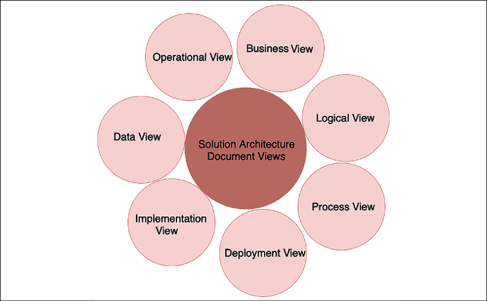
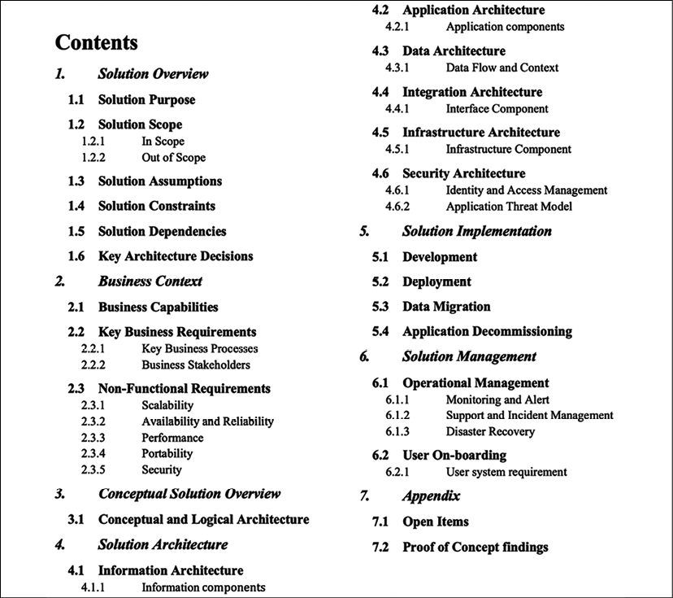
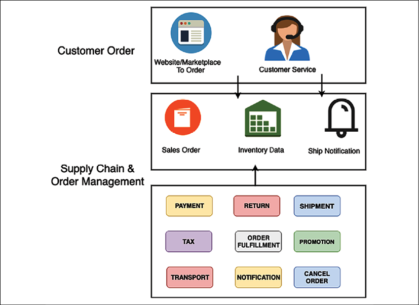
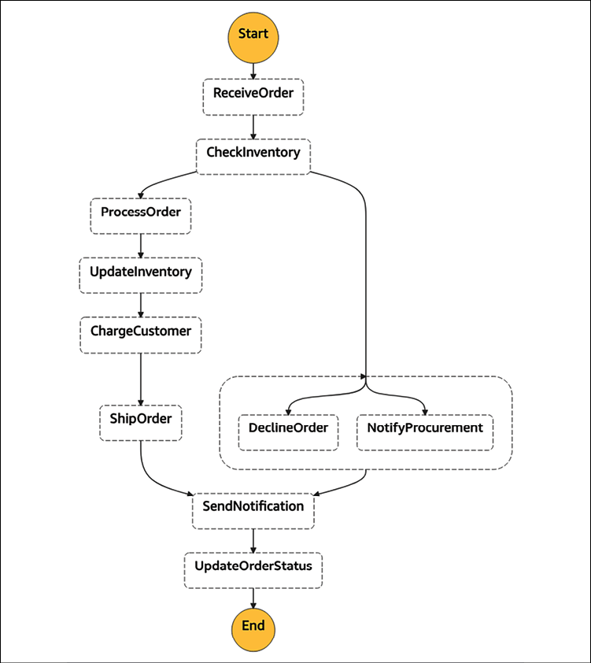
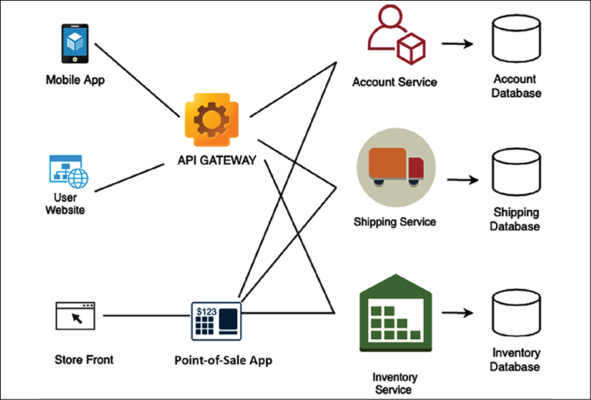
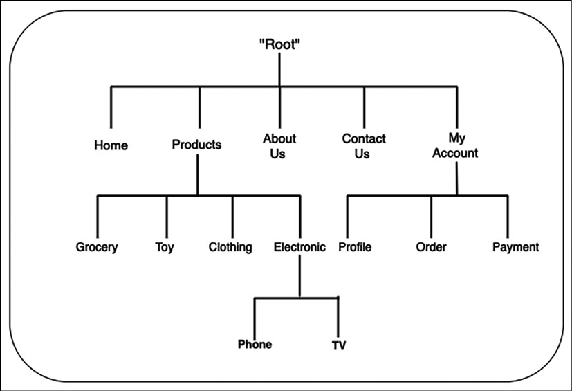
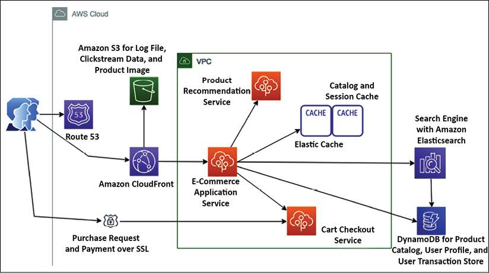
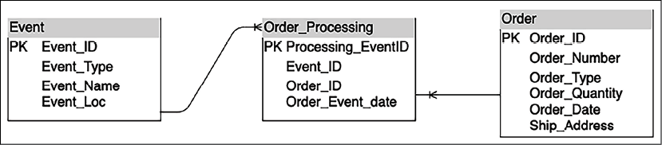
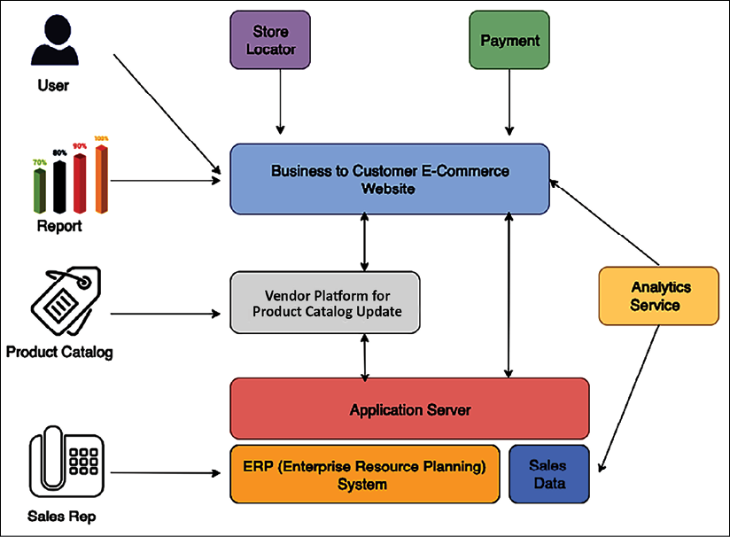
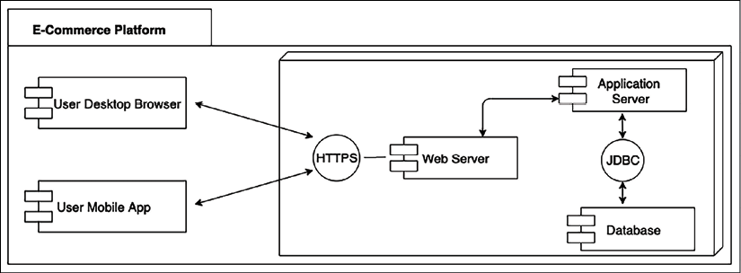

# 解决方案架构文档

在前面的章节中，你了解了解决方案架构设计和优化的各个方面。当解决方案架构师进行设计时，必须与其他利益相关者保持一致的沟通以成功交付应用程序。解决方案架构师需要向所有技术和非技术利益相关者传达解决方案设计。

解决方案架构文档 (**SAD**) 提供应用程序的端到端视图，并帮助每个人都在同一页面上。在本章中，你将了解 SAD 的各个方面，它解决了与应用程序开发相关的所有利益相关者的需求。

你将了解 SAD 的结构以及解决方案架构师需要了解的其他类型的文档，例如提案请求，解决方案架构师需要在其中提供输入以做出战略决策。我们将涵盖以下主题，以更深入地了解解决方案架构中涉及的文档：

- SAD的目的
- SAD的意见
- SAD的结构
- 解决方案架构的 IT 采购文档

到本章结束时，你将了解 SAD、它的结构以及需要包含在文档中的各种细节。

你将了解各种 IT 采购文档，例如方案架构师参与提供反馈的提案请求、信息请求和报价请求。

## SAD的目的

对架构文档的需求经常被忽略，团队在不了解整体架构的情况下开始着手实现。 SAD 提供了整体解决方案设计的广泛视图，以使所有利益相关者了解情况。

SAD 有助于实现以下目标：

- 向所有利益相关者传达端到端应用程序解决方案
- 提供高级架构和应用程序设计的不同视图，以满足应用程序的服务质量要求，例如可靠性、安全性、性能和可扩展性
- 提供解决方案对业务需求的可追溯性，并查看应用程序将如何满足所有功能和非功能需求 (NFR)
- 提供设计、构建、测试和实施所需的解决方案的所有视图
- 定义解决方案对估算、规划和交付目的的影响
- 定义解决方案在生产启动后不间断工作所需的业务流程、延续和操作

SAD 定义了解决方案的目的和目标，并解决了经常被实施团队忽视的关键组件，例如解决方案约束、假设和风险。解决方案架构师必须确保他们以业务用户可以理解并将业务上下文与技术设计相关联的简单语言创建文档。由于资源消耗，文档有助于保留知识，并使整个设计过程成为独立于人的过程。

对于需要进行现代化改造的现有应用程序，SAD 提供当前和未来架构的抽象视图以及过渡计划。解决方案架构师了解现有的系统依赖关系并记录它们以提前发现任何潜在风险。迁移计划可帮助企业了解处理新系统所需的工具和技术，并相应地规划资源。

解决方案架构师通过构建概念验证 (POC) 或通过市场调查在解决方案设计期间进行各种评估。 SAD 应列出所有架构评估及其影响，以及技术选择。 SAD 呈现解决方案设计的当前状态和目标状态的概念视图，并维护变更记录。让我们在下一节中了解 SAD 的各个方面。

## SAD的意见

解决方案架构师需要创建业务用户和技术用户都能理解的 SAD。 SAD 弥合了业务用户和开发团队之间的沟通鸿沟，以了解整个应用程序的功能。获取所有利益相关者意见的最佳方式是将自己置于他们的境地并从利益相关者的角度看待问题。解决方案架构师评估架构设计的业务和技术方面，以了解所有技术和非技术用户的需求。

如下图所示，SAD 的整体视图包括从业务需求派生的各种视图，涵盖不同方面：

图 18.1：SAD 视图

解决方案架构师可以选择标准图表，例如统一建模语言 (UML) 图表或来自 Microsoft Visio 的框图来表示各种视图。总的来说，图表应该易于所有业务和技术利益相关者阅读和理解。 SAD 应尽可能包括以下视图，以满足每个人的需求：

- **业务视图**：架构设计就是解决业务问题和解决业务目的。业务视图显示了整体解决方案和产品的价值主张。为了简化，解决方案架构师可以选择检测与业务相关的高级场景，并将这些场景呈现为用例图。业务视图还描述了利益相关者和执行项目所需的资源。你也可以将业务视图定义为用例视图。
- **逻辑视图**：它展示了系统上的各种包，以便业务用户和设计人员可以了解系统的各种逻辑组件。逻辑视图提供了它应该在其中构建的系统的编年史顺序。它显示了系统的多个包如何连接以及用户如何与它们交互。例如，在银行应用中，用户首先需要使用安全包进行认证授权，使用账户包登录账户，使用贷款包申请贷款等。在这里，每个包代表一个不同的模块，可以构建为一个微服务。
- **Process View**：这提供了更多细节，显示了系统的关键进程如何协同工作。可以用状态图来反映。如果解决方案架构师想要显示更多细节，他们可以创建一个序列图。在银行应用程序中，流程视图可以显示贷款或帐户的批准。
- **部署视图**：这展示了应用程序将如何在生产环境中工作。它显示了不同的系统组件(例如网络防火墙、负载平衡器、应用程序服务器和数据库)是如何连接的。解决方案架构师应该创建一个业务用户可以理解的简单框图。你可以向 UML 部署图中添加更多详细信息，以向技术用户(例如开发和 DevOps 团队)显示各种节点组件及其依赖关系。部署视图表示系统的物理布局。
- **实施视图**：这是 SAD 的核心，代表架构和技术选择。解决方案架构师需要将架构图放在这里——例如，如果它是 3 层、N 层或事件驱动的架构——及其背后的原因。
  你还需要详细说明技术选择——例如，使用 Java 还是 Node.js，以及使用它们的优缺点。你想要证明在实施视图中执行项目所需的资源和技能。开发团队使用实现视图来创建详细设计(例如类图)，但这不需要是 SAD 的一部分。
- **数据视图**：由于大多数应用程序都是数据驱动的，因此数据视图很重要。数据视图表示数据将如何在不同组件之间流动以及数据将如何存储。它还可以用来解释数据安全性和数据完整性。解决方案架构师可以使用实体关系图来显示数据库中不同表和模式之间的关系。你将在数据架构部分了解有关实体关系图的更多信息。数据视图还解释了所需的报告和分析。
- **操作视图**：这解释了系统将如何在启动后进行维护。通常，你会为系统定义服务级别协议 (SLA)、警报和监控功能、灾难恢复计划和支持计划。操作视图还提供有关如何执行系统维护的详细信息，例如通过部署错误修复、修补、备份和恢复以及处理安全事件。

列出的所有视图确保 SAD 涵盖系统和利益相关者的所有方面。你可以根据利益相关者的要求选择包括其他视图，例如物理架构视图、网络架构视图或安全(控制)架构视图。作为解决方案架构师，你需要提供系统功能和理解的全面视图。让我们在下一节中更详细地探讨 SAD 的结构。

## SAD的结构

根据利益相关者的要求和项目的性质，SAD 的结构可能因项目而异。你的项目可能是从头开始创建新产品、对遗留应用程序进行现代化改造或将整个系统迁移到云端。

对于每个项目，SAD 文档可能有所不同，但总的来说，它应该考虑各种利益相关者的观点并考虑必要的部分，如以下屏幕截图所示：

图 18.2：SAD 的结构

在前面的 SAD 结构中，你可以看到涵盖多个解决方案体系结构和设计方面的不同部分。解决方案架构师可以根据项目要求选择添加额外的小节或删除一些小节。例如，你可以添加另一个介绍部分来讨论文档的目的和摘要。对于过渡项目，你可以添加一个小节来展示现有架构并将其与目标架构进行比较等。让我们来看看每个部分的细节。

### 解决方案概述

在解决方案概述部分，你需要在几个段落中简要介绍解决方案，在非常高的层次上描述解决方案及其不同组件的功能。很高兴在一个地方添加一个显示各种组件的高级框图。下图说明了电子商务平台的解决方案概述：

图 18.3：电子商务平台解决方案概览

你需要以简化的语言简要介绍每个组件，以便业务用户可以了解解决方案的整体工作原理。主要小节包括：

- **解决方案目的**：这简要介绍了解决方案正在解决的业务问题以及构建给定解决方案的理由。
- **解决方案范围**：这说明了所提议的解决方案将涉及的业务范围。清楚地描述解决方案将无法容纳的超出范围的项目。
- **解决方案假设**：列出解决方案架构师提出解决方案所依据的所有假设，例如，最小网络带宽可用性。
- **解决方案限制**：列出所有技术、业务和资源限制。通常，约束来自行业和政府合规性，需要在本节中列出。你还可以突出显示风险和缓解计划。
- **解决方案依赖**：列出所有上下游依赖。例如，电子商务网站需要与 UPS 或 FedEx 等运输系统通信，以便将包裹运送给客户。
- **关键架构决策**：列出主要问题陈述和相应的建议解决方案选项。描述每个选项的优缺点，做出特定决定的原因及其背后的理由。

在提供解决方案概述后，你希望将其与业务上下文相关联。让我们在下一节中更详细地了解业务上下文视图。

### 商业背景

在业务上下文部分，解决方案架构师需要提供解决方案将解决的业务功能和需求的高级概述。本节仅包含需求的抽象视图。详细的需求需要成为单独的需求文档的一部分。但是这里可以提供需求文档的外部链接。你应该包括以下主要小节：

- **业务能力**：简要描述正在设计解决方案的业务能力。确保包括功能的好处以及它们将如何满足客户需求。
- **关键业务需求**：列出解决方案要解决的所有关键业务问题。提供关键需求的高级视图，并添加对详细需求文档的引用。
- **关键业务流程**：解决方案架构师应使用业务流程文档显示关键流程。下图说明了电子商务应用程序业务流程模型的简化视图：
  
  图 18.4：电子商务平台业务流程图
- **业务利益相关者**：列出直接或间接受项目影响的利益相关者。这包括赞助商、开发人员、最终用户、供应商和合作伙伴。
- **NFR**(非功能性相关)：解决方案架构师需要更多地关注 NFR，因为业务用户和开发团队经常错过这些。在高层次上，NFR 应包括：
  - **可扩展性**：应用程序如何随着工作负载的变化而扩展？ (例如，在给定的一天或一个月内从每秒 1,000 个事务扩展到每秒 10,000 个事务。)
  - **可用性和可靠性**：系统可用性可接受的停机时间是多少？ (例如，99.99% 的可用性或每月 45 分钟的停机时间。)
  - **性能**：性能要求是什么？系统在哪里可以处理负载增加而不影响最终用户体验？ (例如，目录页面需要在 3 秒内加载。)
  - **可移植性**：应用程序是否可以在多个平台上运行而无需任何额外工作？ (例如，移动应用程序需要在 iOS 和 Android 操作系统中运行。)
  - **容量**：应用程序可以处理的最大工作负载是多少？ (例如，最大用户数、请求数、预期响应时间和预期应用程序负载。)

架构的概念视图是一个最佳点，它为业务和技术涉众提供了良好的系统概览。让我们更详细地了解概念视图。

### 概念解决方案概述

概念解决方案概述部分提供了一个抽象级别的图表，该图表捕获了整个解决方案的全局视图，包括业务和技术方面。它为分析和权衡研究提供了基础，以帮助足够详细地改进和优化解决方案架构，以支持解决方案的设计和实施。下图说明了电子商务平台的概念架构图：

图 18.5：电子商务平台的概念架构图

上图显示了重要模块和它们之间流动的信息的抽象视图。概念架构为业务和技术用户提供了对整体架构的良好理解。然而，技术用户需要更深入的架构。让我们在下一节中更深入地探讨解决方案架构。

### 解决方案架构

解决方案架构部分深入探讨架构的每个部分。它提供了不同的视图，技术团队可以使用这些视图来创建详细的设计和实施工作。这些视图可以针对其他用户组，例如开发人员、基础架构工程师、DevOps 工程师、安全工程师和用户体验 (**UX**) 设计师。

让我们进入以下主要小节以了解更多详细信息。

#### 信息架构
此部分提供应用程序的用户导航流程。在高层，解决方案架构师需要放入一个应用程序导航结构。如下图所示，对于一个电子商务网站，用户需要点击三次才能导航到所需的页面：

图 18.6：电子商务平台的信息架构图

解决方案架构师可以添加更多细节，例如网站导航、分类法或用户体验设计师可以用来生成详细线框的高级线框。

#### 应用架构
本节针对开发团队。它提供了更多的实现细节，软件架构师或开发团队可以根据这些细节构建详细的设计。下图显示了电子商务网站的应用程序架构，其中包含缓存、网络、内容分发和数据存储等技术构建块：

图 18.7：电子商务平台应用架构图

本部分列出了应用程序现代化架构需要退役、保留、重新平台化和转换的所有应用程序模块。

#### 数据架构
本节主要由数据库管理员和开发团队用来了解数据库模式和表之间的关系。此部分通常包括一个实体关系图 (**ERD**)，显示存储在数据库中的实体集的关系，如以下屏幕截图所示：

图 18.8：电子商务平台的 ERD

数据架构部分列出了应用程序开发过程中需要考虑的所有数据对象。

#### 集成架构
这部分主要针对供应商、合作伙伴和其他团队。例如，下图显示了电子商务应用程序与其他系统的所有集成点：

图 18.9：电商平台集成架构图

集成架构部分列出了所有上游和下游系统及其与你的应用程序的依赖关系。

#### 基础架构
本节主要针对基础架构团队和系统工程师。解决方案架构师需要包括部署图以查看逻辑服务器位置及其依赖关系。
例如，下图说明了电子商务应用程序的生产部署图。你可以为其他环境生成单独的图表，例如开发、质量保证 (**QA**) 和用户验收测试 (**UAT**) 环境：

图 18.10：电子商务平台部署图

此部分列出了用于部署应用程序的所有服务器配置、数据库、网络和交换机。

#### 安全架构
此部分包括应用程序的所有安全性和合规性方面，包括：

- 身份和访问管理 (**IAM**)，例如 Active Directory (**AD**)、用户身份验证和授权管理
- 基础设施安全，例如防火墙配置、所需的入侵防御系统 (**IPS**)/入侵检测系统 (**IDS**) 和防病毒软件
- 应用程序安全，例如 WAF 和分布式拒绝服务 (**DDoS**) 保护
- 使用安全套接字层 (**SSL**)、加密算法、密钥管理等确保静态和传输中的数据安全

总的来说，解决方案架构师可以包括一个应用程序安全威胁模型来识别任何潜在的漏洞，例如跨站点脚本 (XSS) 和 SQL 注入 (SQLi)，并计划保护应用程序免受任何安全威胁。

### 解决方案实施

解决方案交付部分包括开发和部署解决方案的基本注意事项。它可以由以下主要小节组成：

- **开发**：这部分对于开发团队来说是必不可少的。它讨论了开发工具、编程语言、代码存储库、代码版本控制和分支，以及选择背后的基本原理。
- **部署**：本节主要关注 DevOps 工程师，讨论部署方法、部署工具、各种部署组件和部署清单，以及选择背后的理由。
- **数据迁移**：该部分帮助团队了解数据迁移和摄取方式、数据迁移的范围、各种数据对象、使用的数据摄取工具、数据来源和数据格式等。
- **应用停用**：本部分列出了需要停用的现有系统以及当前系统未实现投资回报 (ROI) 的退出策略。解决方案架构师需要提供停用旧系统的方法和时间表，并进行整体影响评估。

SAD 包括开发方法和工具。但是，它没有应用级的详细设计，例如类图或添加伪代码。这些细节需要在相应的软件应用细节设计文档下由软件架构师或高级开发人员处理。部署解决方案后，需要在生产环境中对其进行管理。让我们了解解决方案管理部分的详细信息。

### 解决方案管理

解决方案管理部分侧重于跨其他非产品环境的生产支持和持续系统维护。解决方案管理部分主要针对运营管理团队。本节涉及以下领域：

- 运营管理，例如开发、测试、暂存和生产环境的系统修补和升级
- 管理应用程序升级和新版本的工具
- 管理系统基础设施的工具
- 系统监控和警报；操作仪表板
- 生产支持、SLA 和事件管理
- 灾难恢复和业务流程连续性 (**BPC**)

解决方案架构师需要进行研究并收集数据以在解决方案设计期间验证正确的解决方案。这类额外的细节可以放在附录部分。让我们了解 SAD 的附录部分的更多详细信息。

### 附录

与每个业务提案文档一样，SAD 也有一个相当开放的附录部分，用于包含支持你的整体架构和解决方案选择的任何数据。在附录部分，解决方案架构师可以包括未解决的问题和任何研究数据，例如 POC 的结果、工具比较数据以及供应商和合作伙伴的数据。

在本主题中，你很好地了解了包含不同部分的 SAD 结构。 SAD 应包括前面提到的主要部分；但是，解决方案架构师可能会根据组织和项目要求排除某些部分或包括其他部分。与其他文档一样，必须继续迭代 SAD 并寻找改进的机会。更强大的 SAD 会导致明确定义的实施指南并降低任何失败风险。

SAD 是在初始阶段创建的运行文档，多年来根据整个应用程序生命周期中的各种变化不断更新。除了 SAD 之外，解决方案架构通常还涉及具有特定要求的重要采购提案，称为 x (**RFx**) 文档请求。让我们熟悉一下 RFx 文档。

## 解决方案架构的 IT 采购文档

IT 采购文件通常称为 RFx 文件。这个术语包括采购过程的不同阶段。当你提到 RFx 时，它指的是正式的请求流程。 RFx 文件分为提案请求 (**RFP**)、信息请求 (**RFI**) 和报价请求 (**RFQ**) 文件。

解决方案架构师通常参与采购过程以提供他们的意见或领导他们。这些采购可能与外包、承包、采购软件(如数据库或开发工具)或购买 SaaS 解决方案有关。

由于这些文档可能具有很高的技术性并具有广泛的长期影响，因此解决方案架构师需要提供输入或响应任何采购要求并准备邀请。下面我们来了解一下不同RFx文件的区别，如下：

- **RFI**：RFI 出现在采购流程的早期，买家邀请来自不同供应商的信息，以就他们在后期阶段的采购选择做出明智的决定。 RFI 文档收集有关各种供应商能力的信息，买方可以在其中比较所有供应商的相似参数，并与入围的供应商一起进行下一步的提案步骤。
- **RFP**：在此过程中，来自 RFI 过程的入围供应商有更多关于项目结果的信息。 RFP 文档比 RFI 文档更开放，其中供应商可以为买方提供获取解决方案的最佳方式。供应商可以包括多种选择，以及每种方法的优缺点。
- **RFQ**：在此过程中，买家与 RFP 相比缩小了需求范围，并列出了工作、设备和用品的确切要求。供应商需要为列出的要求提供成本，买方可以从中选择最佳报价来授予合同。

RFP 是最受欢迎的选择，通常，为了加快流程，买方组织通常选择仅向潜在供应商索取 RFP 文件。在这种情况下，RFP 文件需要有适当的结构，以便买方可以在能力、解决方案方法和成本方面对首选供应商进行明确比较，以便快速做出决定。

由于 IT 组织采购的技术性，解决方案架构师在从买方评估供应商的能力和方法以及从供应商方面响应 RFP 文档方面发挥着至关重要的作用。

## 概括

SAD 旨在让所有利益相关者保持一致，并就解决方案设计和要求达成正式协议。由于涉众包括业务用户和技术用户，你了解了解决方案架构师需要考虑的各种 SAD 视图。你需要包括非技术用户的视图，例如业务、流程和逻辑视图。对于技术用户，包括应用程序、开发、部署和操作视图等视图。

在本章中，你了解了 SAD 的详细结构，包括主要部分和小节。

SAD 的各个部分包括详细信息，例如解决方案、业务和概念架构的概述。在架构图中，你还了解了各种架构视图，例如应用程序、数据、基础架构、集成和安全性。你了解了解决方案交付注意事项和运营管理的其他部分。

这是一段漫长的学习之旅。你几乎读完了本书，但在结束之前，你需要学习一些成为解决方案架构师的技巧并继续提高你的知识。

在下一章也是最后一章中，你将学习各种软技能，例如沟通方式、所有权、批判性思维和持续学习技巧，以成为更好的解决方案架构师。