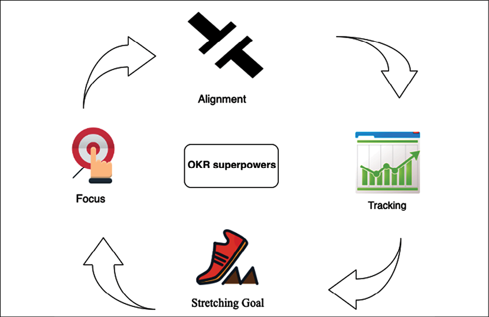
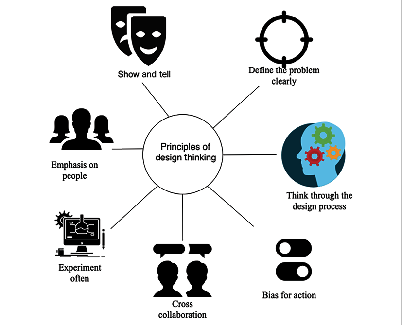
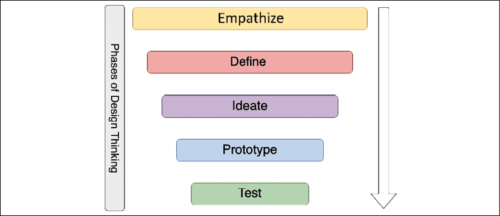

# 学习软技能以成为更好的解决方案架构师

在前面的章节中，你了解了解决方案架构师需要如何满足所有涉众的需求。即使解决方案架构师的角色是技术性的，他们也需要在整个组织中工作，从高级管理层到开发团队。要成为一名成功的解决方案架构师，软技能是必不可少的关键因素。

解决方案架构师应该让自己跟上当前的技术趋势，不断发展他们的知识，并始终对学习新事物充满好奇。通过应用持续学习，你可以成为更好的解决方案架构师。在本章中，你将了解学习新技术的方法以及如何分享和回馈技术社区。

解决方案架构师需要定义并提出总体技术策略来解决业务问题。他们需要跨业务和技术团队合作，协商最佳解决方案，这需要出色的沟通技巧。在本章中，你将学习解决方案架构师必须具备的软技能，包括：

- 掌握售前技巧
- 向 C*O高管介绍
- 拥有所有权和问责制
- 定义战略执行、目标和关键结果
- 大局观
- 具有灵活性和适应性
- 设计思维
- 通过亲身实践编码成为建设者
- 在不断的学习中变得更好
- 成为他人的导师
- 成为技术布道者和思想领袖

到本章结束时，你将了解解决方案架构师成功担任该角色所需的各种软技能。你将了解获得战略技能(例如售前和高管沟通)以及培养设计思维和个人领导技能(例如大局观和主人翁精神)的方法。你将学习将自己确立为领导者并继续提高技能的技巧。

## 掌握售前技巧

售前是复杂技术采购的关键阶段，客户可以在其中收集详细信息以做出购买决定。在客户组织中，解决方案架构师参与售前周期，以验证来自不同供应商的技术和基础设施资源。在供应商组织中，解决方案架构师需要响应客户的建议书请求 (**RFP**) 并提出潜在的解决方案来为组织获取新业务。售前需要一套独特的技能组合，将强大的技术知识与软技能相结合，包括以下内容：

- **沟通和谈判技巧**：解决方案架构师需要具备出色的沟通技巧，以便为客户提供正确和最新的细节。呈现解决方案的准确细节和行业相关性有助于客户了解你的解决方案如何解决他们的业务问题。解决方案架构师充当销售和技术团队之间的桥梁，这使得沟通和协调成为一项关键技能。解决方案架构师还需要通过与客户和内部团队协作来达成协议，这需要出色的谈判技巧。特别是，战略层面的决策对多个群体都有重大影响。解决方案架构师需要在团队之间进行协商，权衡取舍，并开发出优化的解决方案。
- **倾听和解决问题的能力**：解决方案架构师需要具备强大的分析能力，才能根据客户需求确定正确的解决方案。
  首先是通过提出正确的问题来创建一个好的解决方案来倾听和理解客户用例。你需要了解差距并开发解决方案，以产生具有长期投资回报 (**ROI**) 的直接业务影响。对于某些客户而言，性能更为重要，而其他客户可能更关注基于其应用程序用户群的成本。解决方案架构师需要根据客户的主要关键绩效指标 (**KPI**) 目标提供正确的解决方案。
- **面向客户的技能**：解决方案架构师通常需要与内部团队和外部客户团队合作。他们影响各个级别的利益相关者，从 C 级管理人员到开发工程师。他们向高级管理人员展示解决方案和演示，高级管理人员更多地从业务角度看待你的建议。 C 级高管的支持和对计划的承诺总是会导致所采用的解决方案取得成功，这使得面向客户的技能变得非常重要。 C 级主管需要在定义的有时限会议中了解解决方案的详细信息，而解决方案架构师需要充分利用分配的时间。你将在本章的下一部分了解有关高管对话的更多信息——向 C 级高管展示。
- **与团队合作**：解决方案架构师与业务团队和产品团队建立关系。为了准备一个最佳的应用程序，解决方案架构师需要与各级业务团队和技术团队合作。解决方案架构师需要成为优秀的团队合作者并与多个团队合作、分享想法并找到工作方式。

上述技能不仅是售前所必需的，而且也适用于解决方案架构师的日常工作职能。解决方案架构师来自技术背景，并且担任这样的角色，他们需要获得在执行级别进行沟通的关键技能。让我们在下一节中了解有关高管对话的更多信息。

## 向 C*O高管介绍

解决方案架构师需要从技术和业务角度应对各种挑战。然而，最具挑战性的任务之一可能是获得高管的支持。首席执行官(**CEO**)、首席技术官(**CTO**)、首席财务官(**CFO**)、首席信息官(**CIO**)等高级管理人员，由于时间紧迫，需要做很多工作，因此被视为C级的高影响力的决定。作为解决方案架构师，你可能有很多细节需要展示，但你的 C 级会议非常有时间限制。在这里，解决方案架构师需要在分配的时间段内从他们的会议中获得最大价值。

首要问题是：我们如何在有限的时间内得到高层的关注和支持？通常，在任何演示过程中，人们往往会在最后放一张摘要幻灯片，而在执行会议的情况下，你的时间可能会根据他们的优先级和议程进一步减少。执行演示的关键是在前 5 分钟内预先总结要点。你应该这样准备，如果你的 30 分钟时段减少到 5 分钟，你仍然应该能够表达你的观点并为下一步获得支持。

甚至在总结之前就解释你的议程和会议结构。高管会问很多问题以合理利用他们的时间，你的议程应该表明他们将有机会提出澄清问题。用符合他们的行业和组织的事实和数据来支持你的总结。随身携带详细信息，以防他们想深入了解某个特定领域；你应该能够调出并显示所有数据。

不要试图通过陈述从你的角度来看似乎相关但对高管听众来说意义不大的信息来详细介绍所有内容。例如，作为解决方案架构师，你可能更关注技术实施带来的好处。但是，高级管理层通过减少运营开销和提高生产率更关注投资回报率。你应该准备好回答以下高管更关心的问题：

- **提议的解决方案将如何使我们的客户受益？**：业务以客户为中心。尽管高管们着眼于公司的发展，但只有在客户满意的情况下才有可能。确保对他们的客户群和需求进行研究。准备好展示由可靠数据支持的好处。
- **你对解决方案的基线做了什么假设？**：通常，这些会议处于初始阶段，你可能没有足够的细节。解决方案架构师总是需要做出一些假设来确定解决方案的基线。用要点列出你的假设，并制定与之相关的缓解计划，以防万一事情不按假设进行。
- **我的投资回报率是多少？**：管理人员总是通过确定总拥有成本 (**TCO**) 来寻找投资回报率。准备好数据以提供估计的拥有成本、解决方案维护成本、培训成本、总体成本节省等。
- **如果我们像今天这样继续下去，什么都不做，会发生什么？**：高级管理层可能会进入极端审查模式以确定投资回报率。他们想了解投资是否值得。你需要准备好进行市场调查——例如，技术趋势、客户趋势和竞争形势。
- **我们的竞争对手对你的解决方案会有什么反应？**：竞争无处不在，而且往往是高管更担心的。他们想了解你的解决方案是否具有创新性以击败竞争对手并为他们的组织带来优势。最好做一些前期研究并添加与其行业和客户群相关的竞争力数据。
- **你的建议是什么，我能提供什么帮助？**：在提供建议时，你应该始终有一个清晰的行动项目列表作为下一步。你需要获得高管的支持，并通过寻求帮助让他们感到参与其中。比如，你可以让CIO给你牵线工程团队或者产品团队，进行下一步的整体解决方案。

到目前为止，在本章中，我们已经讨论了各种软技能，例如沟通、演示和倾听。现在让我们更多地了解解决方案架构师作为组织的技术领导者应具备的领导技能。

## 拥有所有权和问责制

拥有所有权并将自己定位为领导者可以帮助你通过问责制赢得信任。所有权并不意味着你需要单独执行事情；它更多的是关于采取新的举措并坚持下去，因为它是你的组织。你可以拥有可以在生产力、敏捷性、成本节约和增加客户群方面使你的组织受益的想法。有时，你可能没有时间或资源来执行你的想法，但你应该始终尝试将其作为一项新举措提出来，并让其他人参与执行。

问责制就是承担责任来推动结果。所有权和问责制是相辅相成的，你可以在其中创造主动性并努力获得结果。人们可以相信你可以执行任何工作并取得成果。问责制可帮助你与客户和团队建立信任，最终营造更好的工作环境并实现目标。

作为解决方案架构师，当你拥有所有权时，它可以帮助你从客户和发起人的角度看问题。你会感到有动力，并且是你喜欢做的有意义的事情的一部分。确保定义和创造关键成功和目标关键结果。目标应该可以使用特定的关键结果来衡量，并且必须有时间限制。让我们进一步了解目标和关键结果 (**OKR**)。

## 用目标和关键结果定义战略执行

战略执行是复杂且具有挑战性的。卓越的战略执行对于实现组织愿景、使命和目标至关重要。这个想法需要转化为可操作的元素，以保持团队一致，每个人都朝着同一个方向前进。目标设定和管理目标是完成任务的最佳方式之一。

目标关键结果 (**OKR**) 是目标设定的原则和实践(愿景和执行)。 OKR是一个专注于战略执行的战略管理体系。它是一个简单的框架，可让你定义组织的主要战略及其优先事项。目标就是原则，关键结果就是实践——它是组织愿景的内容和方式。 OKR 基于四个超级大国，如下图所示：

图 19.1：OKR 的超能力

OKR 的超能力包括：

- **焦点**：从这个问题开始：我们的主要优先事项是什么，人们应该把精力集中在哪里？致力于真正重要的事情，并明确说明什么是必要的。
- **对齐**：使目标公开透明。与团队联系并获得跨团队、自下而上和横向对齐。
- **跟踪**：直观地跟踪每个目标的关键结果，精确到百分点。
- **延伸目标**：制定雄心勃勃的目标以取得非凡成就。延伸目标允许人们重新想象和重新思考。

OKR 为从执行发起人到团队的各个级别的所有利益相关者提供可见性和有意义的结果。 OKR 明确了组织的愿景和使命。从事日常活动的团队成员需要对任务有可见性和清晰度。他们需要了解他们的日常工作如何对该组织使命产生影响。 OKR 框架允许你定义此链接并为团队中的每个人提供可见性和意义。

## 大局观

解决方案架构师应该能够看到大局并超前思考。解决方案架构师创建了一个基础，团队可以在该基础上放置构建块并启动产品。大局观是解决方案架构师在考虑应用程序的长期可持续性时应具备的关键技能之一。大局观并不意味着你需要制定一个非常不切实际的目标。你的目标应该大到足以挑战你并带你走出舒适区。大局观对于个人和组织层面的成功都至关重要。

在大胆思考的同时，你永远不应该怀疑自己的能力。最初，实现目标似乎具有挑战性，但是当你开始朝着目标努力时，你会找到方法。相信自己，你会发现其他人开始支持和相信你。大胆思考有助于激励你周围的人成为你成功的一部分。设定长期目标，例如你希望自己和你的组织在未来十年达到什么水平。一步一个脚印，将短期目标转化为长期目标。

一旦你通过大局观设定了伸展目标，它将帮助你主动探索新的挑战。但是，你需要同事和团队的支持才能交付结果，他们可以为你提供正确的反馈并根据需要提供帮助。成为人们愿意帮助的人；当然，这是一扇双向门。要获得帮助，你需要乐于帮助他人。适应性是解决方案架构师与他人合作的另一项关键技能。让我们进一步了解它。

例如，在微服务架构中，每个服务都通过 HTTP 协议上的标准 RESTful API 进行通信。不同的团队可能会选择使用不同的语言或工具编写代码，例如 Python、Java、Node.js 或 C#。唯一的要求是团队需要安全地公开他们的 API，以便整个系统可以在利用它们的基础上构建。

你需要不同的思维方式和视角来研究问题，以获得更具创新性的解决方案。鼓励团队快速失败和创新有助于组织具有竞争力。灵活性的个人特征表现在以下方面：

- 与团队一起思考解决问题的各种解决方案，并采取最佳方法
- 帮助团队成员卸载他们的工作
- 如果团队成员因个人工作原因需要休假数周，则自愿填补空缺
- 能够与不同地点和时区的团队有效协作

你需要思想开放并适应技术和流程的变化。在为你的团队或组织带来变革时，你可能会遇到阻力。你需要鼓励其他人保持灵活性并传达变革的重要性。例如，当一个组织想要将其工作负载从本地迁移到云端时，他们经常会遇到阻力，因为人们必须学习一个新的平台。你需要解释云的价值主张，以及它将如何帮助他们变得更加敏捷和更快地进行创新。

作为解决方案架构师，你需要适应执行多项任务并设置正确的执行优先级。你应该有随机应变的能力和在压力下工作的能力。解决方案架构师需要具有批判性的设计思维来创建创新的解决方案。让我们在下一节中了解更多关于设计思维的知识。

## 设计思维

解决方案架构师的主要角色是系统设计，这使得设计思维成为一项基本技能。设计思维是各行业为解决具有挑战性和不清楚的问题而采用的最成功的方法之一。设计思维可以帮助你从不同的角度看待问题和解决方案，而这些你可能一开始就没有考虑过。设计思维更侧重于通过提供基于解决方案的方法来解决问题来交付结果。它有助于质疑问题、解决方案和相关风险，以提出最优化的策略。

设计思维通过将自己置于最终用户和客户的位置，帮助你以更加以人为本的方式重新定义问题。下图说明了设计思维的主要原则：

图 19.2：设计思维的原则

以下几点是一些设计思维原则：

- **以人为本**：收集各种用户的反馈，设身处地地从不同的角度理解问题。
- **交叉协作**：让来自不同背景的人以多元化的方式寻找问题，并确保解决方案满足每个人的需求。
- **思考设计过程**：了解整体设计流程，有明确的目标和方法。
- **展示和讲述**：以视觉方式展示你的想法，以便房间中的每个人都能轻松理解。
- **清楚地定义问题**：为给定的挑战创建一个定义明确且清晰的愿景，这可以帮助其他人清楚地理解并鼓励他们做出更多贡献。
- **经常试验**：创建原型以了解想法在现实生活中的实施情况。采用快速失败策略并更频繁地进行试验。
- **偏向于行动**：最终的设计是为了提供解决方案而不是仅仅思考。积极推进并提出可以产生可行解决方案的活动。

设计思维为应用同理心和创建给定问题的整体视图奠定了坚实的基础。为了采用设计思维，**d.school** (https://dschool.stanford.edu/resources/getting-started-with-design-thinking) 提出了一个五阶段模型。他们是教授和应用设计思维的先驱。下图说明了设计思维的五个阶段：

图 19.3：设计思维的五个阶段

设计思维是一种需要不断发展的迭代方法。一个阶段的输出可以递归地输入到其他阶段，直到固化。这些阶段的简要概述如下：

- **同理心**：同理心是人类环境中设计的基石和基础。要产生同理心，你应该观察用户行为并与他们互动以了解实际问题。通过将自己置于情境中，尝试让自己沉浸于并体验问题。
- **定义**：同理心有助于在你体验用户的需求和他们面临的问题时定义问题。在定义模式下，你运用自己的洞察力并清楚地定义问题，这可以激发头脑风暴以找到创新而简单的解决方案。
- **构思**：构思阶段是关于从问题转向解决方案。你与团队合作，通过挑战假设来寻找各种替代解决方案。你需要从头脑中想出一个明显的解决方案，并协同工作以找到所有可能的解决方案，从而实现创新。
- **原型**：原型阶段有助于将想法转化为具体的解决方案。原型制作可以提供大量学习，并通过展示概念验证 (**POC**) 帮助解决分歧。它可以帮助你找到差距和风险。你应该在无需大量投资的情况下构建一个快速原型，这样你就可以应对失败并增加学习。
- **测试**：测试阶段是关于获得对你的解决方案的反馈并相应地重申。测试阶段可帮助你重新定义解决方案并了解有关你的用户的更多信息。

设计思维涵盖了提出合乎逻辑且实用的解决方案所需的所有阶段。在设计应用程序架构时，你可以将设计思维的阶段和原则与你的现实生活联系起来。特别强调原型制作，因为这是用数据和事实巩固你的建议和现有解决方案的唯一方法。解决方案架构师的主要工作是了解业务关注点并创建具有团队可以实施的原型的技术解决方案设计。要构建原型，解决方案架构师需要亲自动手并亲自动手编写代码。让我们进一步了解它。

## 通过亲身实践编码成为建设者

解决方案架构师是边做边学的建设者。一个原型抵得上一千张图片。它有助于减少沟通不畅和构思解决方案。呈现 POC 和原型设计是解决方案架构师角色不可或缺的一部分。

原型制作是预解决方案阶段，有助于加深你对应用程序设计和用户的理解。它可以帮助你思考和构建多个解决方案路径。通过原型测试，你可以完善你的解决方案并通过展示你的愿景来激励其他人，例如团队、客户和投资者。

解决方案架构师是与开发团队密切合作的技术领导者。在授权的敏捷开发人员团队中，除了 PowerPoint 演示之外，解决方案架构师还需要将一段代码作为 POC 进行展示。解决方案架构师不需要成为开发团队的一员，而是协同工作，以他们的语言将解决方案传达给开发团队。只有当解决方案架构师能够理解伴随持续编码、亲身实践的解决方案的深层次技术方面时，才有可能成功交付。

解决方案架构师通常被视为导师和球员教练；动手编写代码有助于他们建立信誉。解决方案架构师需要决定团队应该使用哪些编程语言和工具。动手实践的方法有助于找出可能不适合你的团队或解决方案要求的差距——始终学习新技术使解决方案架构师能够代表组织做出更好的决策。让我们进一步了解持续学习的技术。

## 在不断的学习中变得更好

解决方案架构师需要不断吸收新知识并增强他们的技能，以帮助组织做出更好的决策。持续学习使你的技能保持相关并建立信心。它打开了你的思路，改变了前景。由于全职工作和忙碌的家庭生活，学习可能会充满挑战。持续学习就是养成总是学习新事物的习惯，因此你必须有动力和纪律。你首先需要设定学习目标并应用有效的时间管理来实现这些目标。当你忙于常规的日常工作时，这通常会漏掉。

每个人都有自己的学习风格。有些人可能喜欢正规教育；有些人可能会读书；其他人可能想听和看教程。你需要找到对你最有效且适合你的生活方式的学习方式。例如，你可以选择在上下班途中收听有声读物和教程。你可以在商务旅行期间阅读书籍，或在健身房锻炼时观看视频教程。总的来说，你需要做一些调整，从繁忙的工作生活中抽出时间来持续学习。以下是让自己不断学习的一些方法：

- **通过尝试来学习新技术、框架和语言**：解决方案架构师是构建者，他们随时准备动手进行实验。作为一名成功的解决方案架构师，你需要通过构建小型 POC 来不断学习新技术。了解现代编程语言和框架将帮助你为组织和团队提供有关技术采用的最佳建议。
- **通过阅读书籍和教程学习新技能**：在线学习带来了一场革命，使任何领域都易于理解和深入。你现在拥有触手可及的大量知识库，可以学习任何东西。 Udemy 或 Coursera 等在线平台在所有领域提供了数以千计的视频教程课程，你可以在线观看或下载到你的设备以供离线学习。
  同样，Kindle 上有数百万本书可供随时随地阅读。 Audible 和 Google Play 的有声读物等有声读物平台可以帮助你在上下班途中收听该书。可用的便利资源如此之多，没有理由不应用持续学习。
- **通过阅读网站和博客上的文章来跟上技术新闻和发展**：让自己了解技术趋势的最佳方式是订阅技术新闻和博客。 TechCrunch.com、Wired.com 和 Cnet.com 是获取最新技术趋势的一些热门网站。 CNBC 或纽约时报等主要报纸以及 BBC 新闻和 CNN 频道都有技术文章，可以很好地洞察行业趋势。你可以订阅博客以获取相应技术领域的新知识。例如，对于云平台学习，你可以订阅 Amazon Web Services (**AWS**) 博客，其中有数千篇关于 AWS 云领域的文章和用例，类似的博客也可以从其他公共云(如 Azure 和谷歌云平台(**GCP**)。
- **撰写博客、白皮书或书籍**：分享知识是最好的学习方式，因为你在尝试向他人展示时通过用例进行思考。在 Medium、Blogger 和 LinkedIn 等流行的博客发布平台上发布博客和文章有助于你分享你的学习成果并向他人学习。积极参与问答平台使你能够找到任何给定问题的替代解决方案。一些流行的问答平台是 Quora、Reddit、Stack Over flow 和 Stack Exchange。
- **通过教别人巩固你的知识**：教别人可以帮助你合作并从不同的角度了解你的知识。通常，参与者提出的用例会为你提供寻找解决方案的不同方法。通过动手实验室和概念构建运行一整天的研讨会可以帮助你巩固学习并与他人一起学习。
- **参加在线课程**：有时，你想参加正规学习以更有纪律，并且想要更灵活。在线课程提供灵活性，帮助你适应其他优先事项并节省时间。在线课程可以为你提供一种有组织的方式来学习新技术并帮助增强知识。
- **向队友学习**：队友共享相同的工作环境，你一天中的大部分时间都与他们在一起。与团队成员一起学习有助于加快学习速度。团队可以采用分而治之的策略，每个团队成员都可以分享他们的主题并展示深入的午餐和学习会议。这些会议是许多组织用来在团队成员之间进行定期学习会议的标准方法。每个团队成员在每周的学习会议中分享他们的新知识，每个人都可以快速学习新主题。
- **参加和参与用户组和会议**：所有大型垂直行业和技术组织都会举办会议，以提供对新技术趋势和实践会议的洞察力。 参加行业会议和用户组会议有助于发展网络和了解技术趋势。 来自行业领导者的一些大型技术会议包括 AWS re:Invent、Google Cloud Next、Microsoft Ignite、SAP SAPPHIRE 和 Strata Data Conference。 你可以创建一个本地用户组并在你所在的区域进行聚会，这将有助于你与跨行业和组织的专业人士进行协作。

解决方案架构师扮演技术领导角色，良好的领导能力保证培养更多像你这样的领导者，这可以通过指导来实现。 解决方案架构师应该扮演球员教练的角色并指导他人。 让我们更详细地看一下。

## 成为他人的导师

指导是帮助他人并根据你的学习和经验为他们的成功做好准备。通过建立一对一的导师/受训者关系，这是培养领导者的有效方式。要成为一名优秀的导师，你需要建立一种非正式的沟通方式，让受训者可以建立一个舒适区。受训者可以在职业发展等多个领域或工作与生活平衡等个人方面寻求建议。你应该进行非正式的需求评估并设定共同的目标和期望。

指导更多的是倾听。有时，人们需要有人倾听他们的意见并根据需要提出建议。你应该先仔细倾听，了解他们的观点。

帮助他们做出自己的决定，因为这会让他们感到更有成就感。作为一名优秀的导师，在为职业提供建议时，你需要开诚布公地建议最适合受训者的是什么，即使它不一定最适合公司。始终提供诚实、建设性的反馈，帮助他们找出差距并克服这些差距。

导师的关键特征是启发他人的能力。通常，如果人们在你身上看到榜样，他们可能会选择你作为导师。帮助你的受训者在不提出你的观点的情况下发挥他们的全部潜力，并帮助他们实现他们之前从未想过的事情。成为导师总是互惠互利的；你还可以从受训者那里了解人们的行为和成长。成为他人的导师最终会帮助你成为更好的领导者和更好的人。

## 成为技术布道者和思想领袖

技术布道就是成为倡导技术和产品的专家。一些拥有广泛产品基础的组织推出了单独的技术传播者角色。尽管如此，作为他们工作的一部分，解决方案架构师仍然经常需要承担传播者的角色。作为一名技术布道者，你需要了解当前的技术趋势以了解现实世界的问题并倡导你的技术来解决他们的业务问题。

技术布道涉及作为公众演讲者参加行业会议并推广你各自的平台。它可以让你成为思想领袖和影响者，这可以帮助组织提高其平台和产品的采用率。公开演讲是解决方案架构师在各种公共平台上进行互动并在大量观众面前展示所需的关键技能之一。

布道者还创建和发布博客文章、白皮书和微博等内容来宣传他们的产品。他们将内容社交化以提高采用率，并与用户互动以了解他们的反馈。传道者从客户开始向后工作，并将反馈传达给内部团队，以帮助改进产品。随着时间的推移，作为传道者，你将完善符合组织最佳利益的信息。

总的来说，解决方案架构师是一个肩负多重职责的角色，拥有更多的自主权将帮助你在职业生涯中取得更好的成功。

## 概括

在本章中，你了解了解决方案架构师成功所需的各种软技能。解决方案架构师需要具备谈判、沟通、解决问题和倾听等售前技能，这有助于他们支持组织的售前周期，例如 RFP。你了解了执行对话和支持所需的演示技巧。

你了解了解决方案架构师应该为组织定义关键目标和结果的战略理解。为了在各个层面执行，解决方案架构师应该有远大的思考能力，并且具有灵活性和适应性。你了解了有关解决方案架构师拥有所有权并对他们的行为负责的详细信息。

解决方案架构师的角色主要负责架构设计。你了解了设计思维及其原则和阶段。你还了解了持续学习的重要性以及继续学习并让自己紧跟市场趋势的不同技巧。你还了解了解决方案架构师的额外职责——担任导师和布道者。

通过这本书学习了所有关于解决方案架构师的知识，从他们的角色和职责到解决方案设计和架构优化的不同方面，这是一段漫长的旅程。我希望你学到了很多东西，这将帮助你发展你作为解决方案架构师的职业，或者帮助你在当前角色中取得成功。

快乐学习！